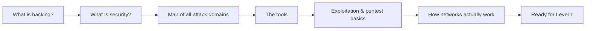

# Course 1 · Ethical Hacking Foundation

**Code:** `SKL-CEF-705` · **Learning hours:** 20 · **Level:** Beginner

This first course gives you the **vocabulary, the mindset, and the map** of the
whole cyber-security field. You won't go deep on any single attack yet —
instead you'll learn what all the pieces are and how they fit together, so the
later courses make sense.

## Modules
1. [Introduction to Ethical Hacking](module-01-introduction-to-ethical-hacking.md)
2. [Introduction to Cyber Security](module-02-introduction-to-cyber-security.md)
3. [Cyber Security Key Concepts (The Big Map)](module-03-cyber-security-key-concepts.md)
4. [Cyber Security Tools Intro](module-04-cyber-security-tools-intro.md)
5. [Exploitation and Penetration Testing](module-05-exploitation-and-penetration-testing.md)
6. [Network Basics: OSI & TCP/IP Models](module-06-network-basics-osi-and-tcp-models.md)

## Companion references
- 🌐 [Networking Basics — Deep Reference](../06-networking-basics/networking-basics.md) — a wide,
  question-by-question networking handbook (OSI/TCP-IP, TCP vs UDP, DNS/ARP,
  DHCP, IPv4 vs IPv6, switching, topologies, VLAN/VPN, NAT, SSH).

## How this course fits

➡️ Next: [Course 2 · Professional Level 1](../02-professional-level-1/)
