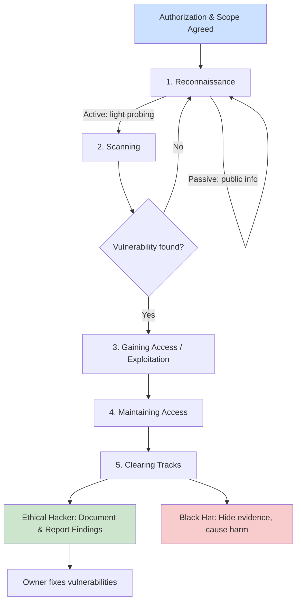

# Introduction to Ethical Hacking

> What you'll learn: what hacking really is, who hackers are, the difference between ethical and malicious hacking, and the structured phases an attacker (or an authorized tester) follows. Prerequisites: basic computer literacy (files, networks, a web browser) and willingness to use a terminal — no prior security experience required.

| Course | Course code | Module | Level |
|--------|-------------|--------|-------|
| Ethical Hacking Foundation | SKL-CEF-705 | Module 01 — Introduction to Ethical Hacking | Foundation |

---

## 1. In Plain English

Imagine you hire a locksmith to break into your own house. You want to know: can a burglar get in through the back window? Is the front lock actually secure? The locksmith tries every door, every window, every weak hinge — not to rob you, but to hand you a report saying "fix these three things before a real thief finds them." That is, in a nutshell, what **ethical hacking** is. A trusted expert attacks a system *with permission* so the owner can fix the weaknesses before a criminal exploits them.

The word "hacking" sounds scary because movies show hooded figures stealing money. But hacking simply means deeply understanding how a system works and finding ways to make it do something it wasn't designed to do. Whether that is good or bad depends entirely on **intent** and **permission**. A person who finds a flaw and reports it is helping. A person who finds the same flaw and steals data is committing a crime. The technical skill can be identical — the ethics are what differ.

Why should a total beginner care? Because almost everything you rely on — your bank app, your email, your hospital's records, the traffic lights downtown — runs on software, and all software has flaws. Someone has to find those flaws responsibly. Ethical hackers (also called **penetration testers** or "pen testers" — people paid to simulate attacks) are that "someone." This module is your first map of the territory: who the players are, what the rules are, and how an attack actually unfolds from start to finish.

The single most important idea to carry through this entire course: **authorization is everything**. The exact same action — scanning a network, guessing a password — is legal and praiseworthy when you have written permission, and a crime when you don't.

---

## 2. Core Concepts

### 2.1 What is a "system" and an "asset"?

A **system** is any combination of hardware, software, and data working together — a laptop, a website, a company's whole network. An **asset** is anything of value worth protecting: customer data, money, intellectual property, even reputation. Security exists to protect assets from harm.

### 2.2 Hacking

**Hacking** is the act of exploiting weaknesses in a system to gain unauthorized access or make the system behave in unintended ways. The weakness being exploited is called a **vulnerability** — a flaw in design, code, or configuration. The method used to take advantage of a vulnerability is an **exploit**. The actual damage that could result (data theft, downtime, fraud) is the **impact**, and the path an attacker uses to reach the asset is the **attack vector**.

### 2.3 The CIA Triad (why we defend at all)

Security professionals measure protection against three goals, known as the **CIA triad** (nothing to do with the spy agency):

- **Confidentiality** — only authorized people can read the data (e.g., your password stays secret).
- **Integrity** — data is accurate and unaltered (e.g., your bank balance isn't secretly changed).
- **Availability** — the system is up and working when you need it (e.g., the website isn't knocked offline).

Every attack tries to break one or more of these, and every defense tries to preserve them.

### 2.4 Ethical Hacking

**Ethical hacking** is the practice of using the same tools and techniques as malicious attackers, but legally and with the explicit, written permission of the system owner, to find and fix vulnerabilities before criminals do. The professional doing it is an **ethical hacker** or **penetration tester**. The engagement is usually defined by a **scope** (exactly what may be tested), a **rules of engagement** document (how and when), and a **statement of work / contract** giving legal authorization.

Three things make hacking "ethical":

1. **Authorization** — you have signed, written permission.
2. **Scope and intent** — you only touch what's allowed, to improve security.
3. **Disclosure** — you report findings to the owner so they can fix them, rather than exploiting or selling them.

### 2.5 White hat vs Black hat vs Grey hat

The "hat colors" come from old Western films where heroes wore white hats and villains wore black hats. They describe a hacker's **intent and legality**, not skill level.

| Hat | Permission? | Intent | Legal? |
|-----|-------------|--------|--------|
| **White hat** | Yes (authorized) | Defend / improve security | Legal |
| **Black hat** | No | Personal gain, harm, theft | Illegal |
| **Grey hat** | Usually no | Often "good" intentions but no permission | Illegal (a legal grey area) |

- **White hat** hackers are the professionals this course trains you to become. They operate under contracts and disclose responsibly.
- **Black hat** hackers are criminals — they break in for money, espionage, sabotage, or notoriety.
- **Grey hat** hackers sit in between. A classic example: someone scans a company's website without being asked, finds a flaw, and emails the company to tell them. Their intent may be good, but because they had no permission, they broke the law. Good intentions do not make unauthorized access legal.

### 2.6 Types of Hackers (beyond the three hats)

The industry recognizes several more categories, useful vocabulary you'll hear constantly:

- **Script kiddie** — an unskilled person who runs ready-made tools or scripts written by others without understanding them. Low skill, but can still cause real damage.
- **Hacktivist** — hacks to promote a political or social cause (e.g., defacing a website to make a statement).
- **State-sponsored / nation-state hacker** — works for a government, often highly skilled and well-funded, targeting other nations or critical infrastructure. Frequently part of an **APT (Advanced Persistent Threat)** — a stealthy, long-term intrusion.
- **Cyberterrorist** — aims to cause fear, disruption, or physical harm for ideological reasons.
- **Insider threat** — an employee or contractor who misuses legitimate access (intentionally or by accident).
- **Suicide hacker** — attacks critical systems without caring about getting caught.
- **Red team** — authorized professionals who simulate realistic adversaries to test an organization's defenses end to end.
- **Blue team** — the defenders who detect and respond to attacks. (A **purple team** is the two cooperating to share learnings.)
- **Bug bounty hunter** — a white hat who finds and reports flaws through an official program (like HackerOne or Bugcrowd) and is paid per valid bug.

### 2.7 Vulnerability, Threat, and Risk

Beginners mix these up constantly, so define them once:

- **Vulnerability** — a weakness (an unlocked window).
- **Threat** — a potential danger that could exploit it (a burglar in the neighborhood).
- **Risk** — the likelihood and impact of that threat exploiting that vulnerability (how likely you'll be robbed, and how bad it'd be).

**Risk = Threat × Vulnerability × Impact** (conceptually). Ethical hacking reduces risk by removing vulnerabilities.

---

## 3. How It Works (Step by Step)

Hacking — whether malicious or authorized — typically follows five recognized **phases**. An ethical hacker walks the same path as an attacker, but stops to document instead of doing harm.

1. **Reconnaissance (Footprinting)** — Gather information about the target *before* touching it. Two flavors: **passive** recon (collecting public info — company website, employee LinkedIn pages, DNS records — without contacting the target directly) and **active** recon (lightly interacting, e.g., pinging a server). Goal: build a picture of the target's "attack surface" (everything that could be attacked).

2. **Scanning** — Use tools to probe the target for live hosts, open **ports** (numbered doorways into a computer, e.g., port 443 for HTTPS), running **services**, and known vulnerabilities. This turns the broad recon picture into a concrete list of possible ways in.

3. **Gaining Access (Exploitation)** — Use a discovered weakness to break in — for example, a weak password, an unpatched software bug, or a misconfiguration. This is where the actual "hack" happens.

4. **Maintaining Access** — Establish a way to return later, such as installing a **backdoor** (a hidden entry point) or creating extra accounts. Attackers do this to keep control; ethical hackers note that it's *possible* and document it.

5. **Clearing Tracks / Covering Tracks** — A malicious attacker deletes logs and hides evidence to avoid detection. An **ethical hacker does NOT do this in a harmful way** — instead they carefully document everything and restore the system to its original state. After all phases, the ethical hacker writes a **report** with findings and fixes (this reporting step is what separates a pen test from a crime).



The diagram shows the shared technical path splitting at the end: the green box is the lawful outcome (report and fix), the red box is the criminal outcome. Same techniques, opposite ethics.

---

## 4. Real-World Examples

**1. The WannaCry ransomware outbreak (2017).** A piece of self-spreading malware encrypted files on hundreds of thousands of Windows computers worldwide and demanded payment, badly disrupting organizations including parts of the UK's National Health Service. It spread by exploiting a vulnerability in an older Windows file-sharing protocol for which a patch already existed. The lesson for beginners: black-hat impact is enormous, and a simple defensive measure — applying available patches promptly — would have stopped much of it. This is exactly the kind of unpatched vulnerability an ethical hacker is hired to find first.

**2. Bug bounty programs as everyday ethical hacking.** Major companies such as Google, Microsoft, and many others run public bug bounty programs (often hosted on platforms like HackerOne or Bugcrowd) where white-hat hackers are *invited* to find flaws and are paid for valid, responsibly disclosed reports. This is ethical hacking in its purest, most accessible form: clear authorization, defined scope, and reward for helping rather than harming. Many professional pen testers start their careers here.

**3. A grey-hat cautionary scenario.** A common real pattern: a curious individual notices a company's website exposes customer records through a poorly built URL, reports it publicly or to the company without prior permission, and then faces legal trouble despite "only trying to help." This illustrates why this course hammers on authorization — intent alone is not a legal defense.

---

## 5. Tools of the Trade

These are foundational tools you'll meet repeatedly. You don't need to master them today — just recognize what each does.

### Nmap (Network Mapper) — scanning
Discovers live hosts, open ports, and services on a network.
```bash
nmap -sV 127.0.0.1
```
`-sV` asks Nmap to detect the **version** of each service it finds; `127.0.0.1` is "localhost," meaning your own machine. This scans your own computer and lists which services are running and their versions.

### Wireshark — packet analysis
A graphical tool that captures and displays network traffic so you can see exactly what data is flowing. Used to understand protocols and spot suspicious traffic. Launched from the application menu or with `wireshark` on the command line; you select a network interface and watch packets arrive.

### Metasploit Framework — exploitation (lab use)
A framework of known exploits and payloads used to safely demonstrate vulnerabilities in authorized tests.
```bash
msfconsole
```
This launches Metasploit's interactive console. From there a tester searches for and (in authorized labs only) runs exploit modules. Treat this as advanced — you'll use it later in the course.

### Burp Suite — web application testing
Sits between your browser and a website to inspect and modify web requests, helping find web vulnerabilities. The free Community Edition is enough for learning; it's launched as a desktop application.

### Kali Linux — the toolbox OS
Not a single tool but a Linux distribution pre-loaded with hundreds of security tools (including all of the above). Many learners run it inside a **virtual machine (VM)** — a simulated computer running inside your real one — so testing stays isolated and safe.

---

## 6. Hands-On Lab (Authorized / Lab-Only)

> Reminder: only ever run these techniques on systems you own or have explicit written permission to test. Scanning someone else's machine without permission is illegal.

This is your very first lab, so we'll keep it gentle and 100% safe: **you will scan only your own computer.** Nothing here can harm anyone, including you.

**Step 1 — Install Nmap.**
- On most Linux systems (and Kali, which already has it): `sudo apt update && sudo apt install nmap`
- On macOS with Homebrew: `brew install nmap`
- On Windows: download the official installer from nmap.org.

Don't worry if package managers are new — they're just app stores for the command line.

**Step 2 — Confirm it installed.**
```bash
nmap --version
```
`--version` simply prints the installed version number. If you see version text (not "command not found"), you're ready. Seeing a version here is success — that's all this step checks.

**Step 3 — Run one safe scan against your own machine.**
```bash
nmap -F 127.0.0.1
```
Breaking down every part:
- `nmap` — the program.
- `-F` — "**Fast** scan." Instead of checking all 65,535 possible ports, it checks only the ~100 most common ones, so it finishes in seconds. Great for beginners.
- `127.0.0.1` — **localhost**, a special address that always means "this computer." You are scanning *yourself*, which is always allowed.

**Reading the output.** Nmap prints a small table. The key column is **STATE**:
- `open` — a service is actively listening on that port (a door that's answering).
- `closed` — nothing is listening there right now (a door that's shut).
- `filtered` — something (like a firewall) is blocking Nmap from telling.

If you see very few open ports, that's normal and a *good* sign — fewer open ports means a smaller attack surface. If you see `open` ports, those are simply services your own OS runs; you haven't broken anything.

That's it — you just performed legitimate reconnaissance on a system you're authorized to test. Take a breath: you ran your first security tool, safely, the right way. When you're ready for more, the safe next step is to download a deliberately vulnerable practice VM such as **Metasploitable** and run it inside virtualization software (like VirtualBox) on an isolated network — never against real systems.

---

## 7. Countermeasures & Defenses

Defense is the **blue team's** job. Map defenses to the attacker's phases:

**Reduce reconnaissance value (prevent):**
- Limit publicly exposed information (employee details, internal hostnames, verbose error messages).
- Minimize the **attack surface** — turn off unused services and close unneeded ports.

**Harden against scanning and access (prevent):**
- Apply security **patches** promptly (patch management) — most breaches exploit known, fixable flaws.
- Enforce strong, unique passwords and **multi-factor authentication (MFA)** — a second proof of identity beyond a password.
- Apply **least privilege** — give every account only the access it truly needs.
- Use **firewalls** to control which traffic is allowed in and out.

**Detect attacks in progress (detect):**
- Deploy **IDS/IPS** (Intrusion Detection/Prevention Systems) to spot or block suspicious traffic.
- Centralize and monitor **logs** with a **SIEM** (Security Information and Event Management) system; alert on anomalies.
- Use **EDR** (Endpoint Detection and Response) on individual machines.

**Respond and recover (mitigate):**
- Have an **incident response plan** so the team knows what to do when an alarm fires.
- Keep tested, offline **backups** to recover from ransomware or data loss.
- Run regular **penetration tests** and **vulnerability scans** to find issues before attackers do — proactive ethical hacking is itself a countermeasure.
- Train staff against **social engineering** (manipulating people into giving access), still one of the most common attack vectors.

---

## 8. Key Terms

- **Vulnerability** — a weakness in a system that can be exploited.
- **Exploit** — code or a technique that takes advantage of a vulnerability.
- **Threat** — a potential cause of harm to an asset.
- **Risk** — the likelihood and impact of a threat exploiting a vulnerability.
- **Attack surface** — the total set of points where a system could be attacked.
- **Penetration test (pen test)** — an authorized, simulated attack to find and report weaknesses.
- **Scope** — the explicitly agreed boundaries of what may be tested.
- **CIA triad** — Confidentiality, Integrity, Availability; the three core security goals.
- **White / Black / Grey hat** — hacker categories defined by permission and intent.
- **Reconnaissance** — the information-gathering first phase (passive or active).
- **Port** — a numbered communication endpoint on a networked computer.
- **Backdoor** — a hidden method of regaining access to a system.
- **Red team / Blue team** — authorized attackers / defenders in a security exercise.
- **Responsible disclosure** — privately reporting a flaw to the owner so it can be fixed.

---

## 9. Summary & Takeaways

- **Hacking is a skill; ethics is a choice.** The same techniques are legal or criminal depending on **authorization and intent**.
- **White hats** work with written permission and disclose responsibly; **black hats** are criminals; **grey hats** mean well but skip permission and are still breaking the law.
- Hackers come in many types — script kiddies, hacktivists, nation-state/APT actors, insiders, bug bounty hunters, red and blue teams.
- Attacks follow five phases: **Reconnaissance → Scanning → Gaining Access → Maintaining Access → Clearing Tracks**, and ethical hackers add a crucial sixth step: **reporting**.
- Security is measured by the **CIA triad** (Confidentiality, Integrity, Availability), and ethical hacking exists to protect all three by reducing **risk**.
- Defenses span prevention, detection, and response — patching, MFA, least privilege, logging/SIEM, IDS/IPS, backups, and regular authorized testing.
- The golden rule for this entire course: **never test what you don't own or aren't authorized to test.**

**Further reading:** OWASP (Open Worldwide Application Security Project) Top Ten; NIST SP 800-115 (Technical Guide to Information Security Testing and Assessment); MITRE ATT&CK framework; the EC-Council CEH knowledge domains.
