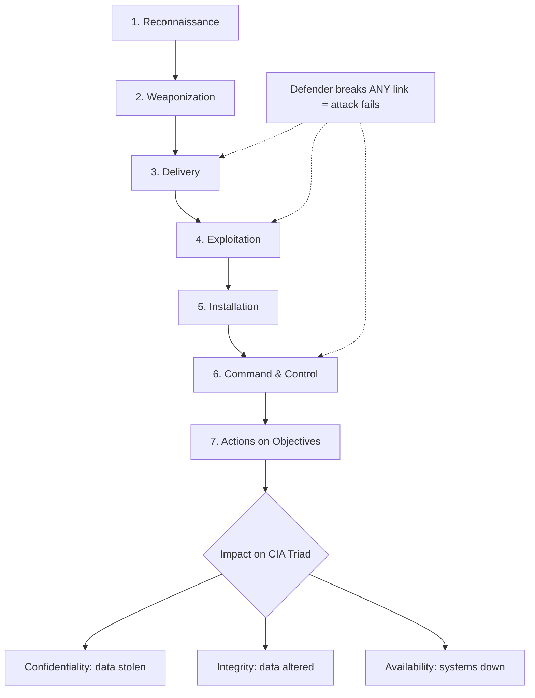

# Introduction to Cyber Security

> What you'll learn: the foundations of information security — the CIA triad, how attackers think (Cyber Kill Chain and MITRE ATT&CK), the controls defenders use, and the major laws and standards that govern data protection. Prerequisites: none — just basic comfort using a computer and a web browser.

| Course | Course code | Module | Level |
|---|---|---|---|
| Ethical Hacking Foundation | SKL-CEF-705 | Module 02 — Introduction to Cyber Security | Foundation |

---

## 1. In Plain English

Imagine your house. You want three things to be true: only the right people can get inside (your family, not a burglar), nobody messes with your belongings while you're out, and the house is actually *there and usable* when you come home. Cyber security is exactly this — but for information instead of furniture. The "house" is your data, your apps, your bank account, your photos, your company's customer records.

**Information security** (often shortened to "infosec") is the practice of protecting information — whether it's stored on a hard drive, travelling across the internet, or printed on paper — from being seen, changed, or destroyed by people who shouldn't be able to do those things. **Cyber security** is the part of information security that focuses on digital systems: computers, networks, phones, cloud services, and the data flowing between them.

Why should a total beginner care? Because almost everything valuable in modern life now has a digital shadow — your money, identity, medical history, work, and relationships all live partly online. Attackers (we'll call the malicious ones "threat actors") want that data because it can be sold, used for fraud, or held for ransom. Defenders — the people you're training to become — study how attackers operate so they can lock the doors before someone tries them.

This module is your map of the whole landscape. You won't hack anything serious yet. Instead, you'll learn the vocabulary, the mental models, and the rules of the road so that everything else in the course makes sense.

---

## 2. Core Concepts

### Information Security Overview

**Information security** is the discipline of keeping data and the systems that handle it safe from unauthorized access, modification, disruption, or destruction. It applies regardless of *where* the information lives. Security people often describe three "states" of data, and good protection covers all three:

- **Data at rest** — information sitting in storage (a database, a laptop's disk, a backup tape).
- **Data in transit** — information moving across a network (an email being sent, a web page loading).
- **Data in use** — information actively being processed in a computer's memory (a document open on screen).

A few terms you'll hear constantly:

- **Asset** — anything of value you want to protect (a server, a customer list, a password).
- **Threat** — a potential cause of harm (a hacker, malware, a flood, a careless employee).
- **Vulnerability** — a weakness that a threat could exploit (an unpatched program, a weak password).
- **Risk** — the chance that a threat exploits a vulnerability and causes damage. Roughly: *Risk = Threat × Vulnerability × Impact.*
- **Exploit** — the actual technique or piece of code used to take advantage of a vulnerability.

### The CIA Triad

The **CIA triad** is the foundation of all information security. (It has nothing to do with the intelligence agency.) It names the three properties we are always trying to preserve:

- **C — Confidentiality**: only authorized people can read the information. Broken when data leaks. Protected by **encryption** (scrambling data so only someone with the key can read it) and **access control** (rules about who may see what).
- **I — Integrity**: the information is accurate and hasn't been tampered with. Broken when an attacker secretly changes a bank balance or a file. Protected by **hashing** (a mathematical fingerprint of data — if even one character changes, the fingerprint changes) and digital signatures.
- **A — Availability**: the information and systems are accessible when legitimate users need them. Broken by a **Denial-of-Service (DoS) attack** that floods a website until it crashes, or by ransomware locking your files. Protected by backups, redundancy, and capacity planning.

A useful companion concept is **non-repudiation** — proof that a specific person performed an action, so they can't later deny it (achieved with digital signatures and logging). Some models add **Authentication** (proving who you are) and **Authorization** (what you're allowed to do).

Every security control you ever build can be traced back to protecting one or more letters of CIA.

### The Cyber Kill Chain (Lockheed Martin)

The **Cyber Kill Chain** is a model created by defense company **Lockheed Martin** in 2011 that breaks a targeted cyber attack into seven sequential stages. The insight is simple but powerful: an attacker must complete *every* step to succeed, so a defender only needs to break *one* link to stop the whole chain. The seven stages:

1. **Reconnaissance** — the attacker gathers information about the target (employee emails, technologies in use, exposed servers).
2. **Weaponization** — they build the attack package, e.g. a malicious document paired with an exploit.
3. **Delivery** — they get the weapon to the victim (phishing email, malicious USB, compromised website).
4. **Exploitation** — the weapon triggers, abusing a vulnerability to run the attacker's code.
5. **Installation** — malware installs itself to gain a foothold (e.g. a backdoor).
6. **Command and Control (C2)** — the malware "phones home" so the attacker can remotely control the machine.
7. **Actions on Objectives** — the attacker finally does what they came to do: steal data, encrypt files, spread further.

The model is great for teaching the *shape* of an attack, though critics note it is fairly focused on malware-based, externally-delivered intrusions and less on insider threats.

### MITRE ATT&CK

**MITRE ATT&CK** (pronounced "attack") is a free, continuously-updated **knowledge base** of real-world attacker behavior, maintained by the non-profit MITRE Corporation. ATT&CK stands for **Adversarial Tactics, Techniques, and Common Knowledge**. Where the Kill Chain gives you a high-level story, ATT&CK gives you an encyclopedic, evidence-based catalogue. Its structure:

- **Tactics** — the attacker's *goal* at a stage (the "why"). Examples: Initial Access, Persistence, Privilege Escalation, Defense Evasion, Exfiltration.
- **Techniques** — *how* they achieve a tactic (e.g. "Phishing" or "Valid Accounts"). Each has an ID like `T1566` (Phishing). Many have **sub-techniques** (e.g. `T1566.001` Spearphishing Attachment).
- **Procedures** — the specific real-world implementation a particular threat group used.

Defenders ("blue teams") use ATT&CK to map their detection coverage — checking which techniques they can spot and which are blind spots. The Kill Chain and ATT&CK are complementary: Kill Chain = the journey, ATT&CK = the detailed playbook of moves at each step.

### Information Security Controls

A **control** (or "safeguard" / "countermeasure") is anything that reduces risk. Controls are classified two ways.

By **function**:

| Type | Purpose | Example |
|---|---|---|
| Preventive | Stop an incident before it happens | Firewall, encryption, locks |
| Detective | Discover an incident in progress or after | Intrusion detection system, CCTV, log review |
| Corrective | Limit damage and restore systems | Backups, patching, incident response |
| Deterrent | Discourage attackers | Warning banners, visible cameras |
| Compensating | An alternative when the ideal control isn't feasible | Extra monitoring when a system can't be patched |

By **nature**:

- **Technical (logical)** — implemented in technology: firewalls, antivirus, multi-factor authentication.
- **Administrative (managerial)** — policies, training, procedures, background checks.
- **Physical** — locks, guards, fences, server-room access cards.

Two guiding principles tie controls together: **defense in depth** (layering many controls so no single failure is fatal — like a castle with a moat, walls, *and* guards) and **least privilege** (give every user and program only the minimum access they need).

### Information Security Laws and Standards

Laws are mandatory rules set by governments; standards are agreed-upon best practices (sometimes required by contract). The big ones a beginner should recognize:

- **GDPR (General Data Protection Regulation)** — EU law (in force 2018) protecting the personal data of people in the EU. Grants rights like access, correction, and erasure ("right to be forgotten"); fines can reach tens of millions of euros or 4% of global annual turnover.
- **HIPAA (Health Insurance Portability and Accountability Act)** — US law protecting patients' health information ("Protected Health Information"). Sets rules for hospitals, insurers, and their tech vendors.
- **PCI-DSS (Payment Card Industry Data Security Standard)** — a contractual standard (not a law) created by the major card brands. Any business that stores or processes credit-card data must comply, covering things like encryption and network segmentation.
- **ISO/IEC 27001** — an international standard describing how to build an **ISMS (Information Security Management System)** — a structured, organization-wide approach to managing security. Organizations can be formally *certified* against it.
- **India IT Act, 2000** (with the 2008 amendment) — India's primary cyber law, giving legal recognition to electronic records and defining cyber offences. Section 43A and related rules address handling of "sensitive personal data." (Note: India's newer **Digital Personal Data Protection Act, 2023** further strengthens personal-data protection.)

---

## 3. How It Works (Step by Step)

Let's walk through a realistic targeted attack and see how the **Kill Chain**, **ATT&CK**, and **controls** all line up.

1. **Reconnaissance** — The attacker scrapes LinkedIn and the company website to learn employee names and the email format. *(ATT&CK tactic: Reconnaissance.)* Defenders limit exposed info and watch for scanning.
2. **Weaponization** — They craft a Word document containing a malicious macro. *(Happens off-target, so it's hard to detect directly.)*
3. **Delivery** — They send a convincing phishing email to an accountant. *(ATT&CK technique: Phishing `T1566`.)* Defenders use email filtering and user training.
4. **Exploitation** — The accountant opens the file and enables macros; code runs. *(ATT&CK: User Execution `T1204`.)* Defenders disable macros by policy.
5. **Installation** — Malware drops a backdoor that survives reboots. *(ATT&CK tactic: Persistence.)* Defenders use endpoint detection (EDR).
6. **Command & Control** — The backdoor connects to the attacker's server. *(ATT&CK tactic: Command and Control.)* Defenders monitor outbound traffic for anomalies.
7. **Actions on Objectives** — The attacker copies the customer database out. *(ATT&CK tactic: Exfiltration; harms **Confidentiality**.)* Defenders use data-loss-prevention tools and egress filtering.

Notice: breaking *any one* step (e.g. training the accountant not to enable macros) stops the entire attack.



---

## 4. Real-World Examples

**Equifax (2017) — a Confidentiality and Integrity failure.** Attackers exploited an unpatched vulnerability in the Apache Struts web framework on a public-facing system, then moved through Equifax's network for weeks and exfiltrated personal data of roughly 147 million people. The root cause — a missing patch — is a textbook example of a **vulnerability** that a **corrective control** (timely patching) would have closed. It maps cleanly onto the Kill Chain: exploitation, installation, C2, and exfiltration.

**WannaCry (2017) — an Availability disaster.** This ransomware worm spread rapidly by abusing a Windows networking vulnerability, encrypting victims' files and demanding payment. The UK's National Health Service was badly disrupted, with appointments cancelled — a vivid reminder that **Availability** is a security property, and that timely patching plus backups are core defenses.

**Phishing in everyday life — a Delivery scenario.** The most common attack you'll personally encounter is a phishing email pretending to be your bank or employer, urging you to "verify your account" on a fake login page. This single technique (ATT&CK `T1566`) is the starting point for a huge share of real breaches, which is why user awareness training is one of the highest-value controls an organization can invest in.

---

## 5. Tools of the Trade

These are *orientation* tools. You'll go deep on each later; here's what they are and a representative command.

**Nmap** — a network scanner that discovers which hosts are online and which services (ports) they expose. Used in the reconnaissance phase by both attackers and defenders.

```bash
nmap -sV 127.0.0.1
```
`-sV` asks Nmap to detect the **version** of each service it finds; `127.0.0.1` is "localhost" — your own machine. This safely tells you what's listening on *your* computer.

**Wireshark** — a packet analyzer that captures and displays network traffic, letting you see data in transit. (Mostly used via its graphical interface; its command-line sibling is `tshark`.)

```bash
tshark -c 10
```
`-c 10` captures just 10 packets then stops — a tiny, safe sample so you can see what traffic looks like without being overwhelmed.

**Hashing utilities** — built-in tools that prove **integrity** by computing a file's fingerprint.

```bash
sha256sum myfile.txt
```
This prints a 64-character hash of `myfile.txt`. Run it again later; if the hash changed, the file changed. This is exactly how integrity checks work.

**MITRE ATT&CK Navigator** — a free web tool for visualizing techniques on a grid and color-coding your detection coverage. No install required; it runs in a browser and is used for planning, not attacking.

---

## 6. Hands-On Lab (Authorized / Lab-Only)

> Reminder: only run these commands against systems you own or are explicitly authorized to test — here, that's your own computer. Scanning machines you don't own can be illegal.

This first lab is gentle and risk-free: you'll confirm a tool is installed and look at *your own* machine. Take a breath — nothing here can break anything.

**Step 1 — Install Nmap (if needed).**

```bash
# macOS (with Homebrew):
brew install nmap

# Debian/Ubuntu Linux:
sudo apt update && sudo apt install nmap
```
`brew install` / `apt install` simply downloads and sets up the program. `sudo` means "run as administrator," which installation requires.

**Step 2 — Check it launched correctly.**

```bash
nmap --version
```
This prints the installed version number. If you see a version, you're ready. If you see "command not found," the install didn't finish — re-run Step 1.

**Step 3 — Run one safe scan against yourself.**

```bash
nmap -F 127.0.0.1
```
Breaking it down:
- `nmap` — the program.
- `-F` — "fast" mode: scans only the 100 most common ports instead of all 65,535, so it finishes in seconds.
- `127.0.0.1` — localhost, your own computer. You always have permission to scan yourself.

**Reading the output:** Nmap lists ports as `open`, `closed`, or `filtered`. `open` means a service is listening there (e.g. port 22 = SSH). On a typical personal laptop you'll often see *no* open ports — that's normal and good (a smaller "attack surface"). Don't worry if your results differ from a classmate's; every machine is configured differently.

**Safest practice target:** when you're ready for more, use a deliberately-vulnerable practice VM such as **Metasploitable** run inside VirtualBox on your own laptop, fully isolated from the internet. It exists *to be* practiced on, so you can explore freely without harming anyone. You're doing great — curiosity plus permission is exactly the right mindset.

---

## 7. Countermeasures & Defenses

**Prevent (stop attacks before they start):**
- Apply security patches promptly (the single highest-impact habit — see Equifax/WannaCry).
- Enforce **least privilege** and strong **multi-factor authentication (MFA)**.
- Encrypt data at rest and in transit; segment networks so a breach can't spread freely.
- Train users to recognize phishing — the human firewall.

**Detect (notice attacks in progress):**
- Deploy **IDS/IPS** (Intrusion Detection / Prevention Systems) and **EDR** (Endpoint Detection and Response).
- Centralize logs in a **SIEM** (Security Information and Event Management) tool and alert on anomalies.
- Use MITRE ATT&CK to map and close detection gaps.

**Respond & recover (limit and reverse damage):**
- Maintain an incident-response plan and tested, offline **backups**.
- Isolate compromised hosts quickly; rotate exposed credentials.
- Conduct post-incident reviews to feed lessons back into prevention.

**Govern (keep it sustainable and compliant):**
- Build an ISMS aligned to **ISO 27001**; meet legal duties (GDPR, HIPAA, PCI-DSS, India IT Act).
- Run regular risk assessments and adopt **defense in depth** across technical, administrative, and physical controls.

---

## 8. Key Terms

- **Information security** — protecting data's confidentiality, integrity, and availability across all states (at rest, in transit, in use).
- **CIA triad** — the three core goals: Confidentiality, Integrity, Availability.
- **Confidentiality** — keeping data readable only to authorized parties.
- **Integrity** — ensuring data is accurate and untampered.
- **Availability** — ensuring systems and data are accessible when needed.
- **Threat** — a potential cause of harm to an asset.
- **Vulnerability** — a weakness that a threat can exploit.
- **Risk** — the likelihood and impact of a threat exploiting a vulnerability.
- **Exploit** — the technique or code used to abuse a vulnerability.
- **Cyber Kill Chain** — Lockheed Martin's 7-stage model of a targeted attack.
- **MITRE ATT&CK** — a knowledge base of real adversary tactics, techniques, and procedures.
- **Control / countermeasure** — a safeguard that reduces risk (preventive, detective, corrective, etc.).
- **Defense in depth** — layering multiple controls so no single failure is catastrophic.
- **Least privilege** — granting only the minimum access necessary.
- **ISMS** — Information Security Management System, the framework defined by ISO 27001.

---

## 9. Summary & Takeaways

- Information security protects the **confidentiality, integrity, and availability** of data wherever it lives — and every control traces back to one of those three goals.
- **Threat, vulnerability, and risk** are distinct ideas; understanding them lets you reason about *what could go wrong and how likely it is*.
- The **Cyber Kill Chain** tells the story of an attack in seven stages; a defender wins by breaking just one link.
- **MITRE ATT&CK** is the detailed, real-world catalogue of attacker behavior — use it to find and close detection blind spots.
- Controls come in functional types (preventive, detective, corrective, deterrent, compensating) and natures (technical, administrative, physical); the best defenses **layer** them.
- Major laws and standards — **GDPR, HIPAA, PCI-DSS, ISO 27001, India IT Act** — turn good security into a legal and contractual obligation.
- Real incidents like **Equifax** and **WannaCry** show that unglamorous basics (patching, backups, training) prevent most damage.
- Practice only on systems you own or are authorized to test; start with your own machine or an isolated vulnerable VM.

**Further reading:** NIST Cybersecurity Framework and NIST SP 800-53 (controls catalogue); MITRE ATT&CK and the ATT&CK Navigator; OWASP Top Ten; ISO/IEC 27001 and the official GDPR/HIPAA/PCI-DSS regulatory texts.
