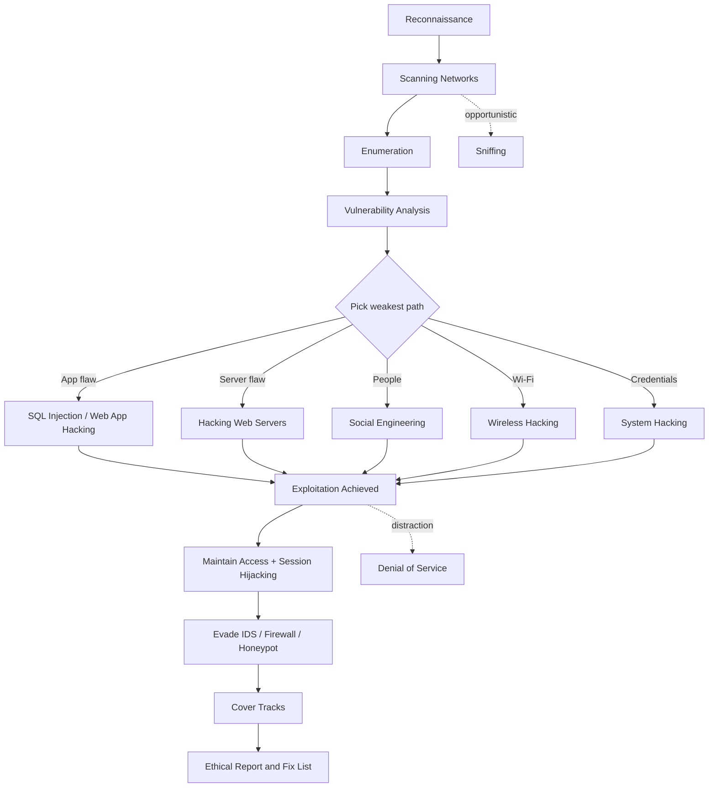

# Cyber Security Key Concepts (The Big Map)

> **What you'll learn:** A guided, plain-English tour of every major attack domain in ethical hacking — so the rest of your program clicks into place. **Prerequisites:** Basic computer literacy (you can use a terminal, you know what an "IP address" and a "website" are). No prior security knowledge required.

| Field | Value |
|-------|-------|
| Course | Ethical Hacking Foundation |
| Course code | SKL-CEF-705 |
| Module | Cyber Security Key Concepts (The Big Map) |
| Level | Foundation |

---

## 1. In Plain English

Imagine you've just been hired to test the security of a large office building. You wouldn't randomly throw a brick through a window. You'd first walk around the block to see how many entrances there are, note which doors are propped open, figure out who works there, and only *then* try (with the owner's written permission) to see whether you could slip inside unnoticed. **Ethical hacking** — testing systems for weaknesses *with permission*, so the owner can fix them before a criminal finds them — works exactly the same way, just with computers instead of buildings.

This module is the **map of the whole journey**. Every later module in your program zooms into one of the rooms in that building. Today we walk the corridor and peek into each room so you understand how they connect. You'll meet the major "attack domains" — categories of techniques attackers use, and that defenders must understand to stop them.

A quick but important word on ethics. Everything here is taught for **authorized testing, labs, and education only**. The difference between an ethical hacker and a criminal is not skill — it's *permission*. An ethical hacker (sometimes called a "white hat") always has written authorization and a defined scope before touching anything. Keep that idea with you for the entire program.

Don't worry about memorizing every tool name below. The goal of this module is *orientation*: by the end you should be able to say "ah, SQL injection is about tricking a database, and it lives near web application hacking," not become an expert in each. The depth comes later.

---

## 2. Core Concepts

Security professionals often organize an attack into a rough lifecycle: **find what's there → learn its details → spot the weak points → break in → maintain access / cause damage → hide your tracks.** The domains below map loosely onto that lifecycle. We'll define each one from scratch.

### Scanning Networks
A **network** is just a group of connected computers. **Scanning** means systematically probing a network to discover which machines are alive (responding), which **ports** they have open (a port is a numbered "door" a service listens on — e.g., web traffic usually uses port 80 or 443), and which **services** run behind those ports. Think of it as knocking on every door of the building and noting which ones answer.

### Enumeration
**Enumeration** goes one step deeper than scanning. Once you know a door is open, you start a conversation with it to extract *detailed* information: usernames, machine names, shared folders, software versions, network shares. Scanning tells you "there's a service on port 445"; enumeration tells you "it's a Windows file share, here are the user accounts and shared directories."

### Vulnerability Analysis
A **vulnerability** is a flaw or weakness that could be exploited — like a lock that can be picked or a window that doesn't latch. **Vulnerability analysis** is the process of taking everything you learned from scanning and enumeration and cross-referencing it against known weaknesses (often catalogued as **CVEs** — Common Vulnerabilities and Exposures, the public ID system for known flaws). The output is a prioritized list of "here's what could go wrong, ranked by severity."

### System Hacking
**System hacking** is the act of actually gaining access to a target machine, then keeping that access and covering one's tracks. It typically breaks into phases: **gaining access** (e.g., guessing or cracking a password), **privilege escalation** (turning a low-power account into an administrator/root — the top-level superuser), **maintaining access** (installing a backdoor so you can return), and **clearing logs** (erasing evidence). Defenders study this to know what to detect.

### Malware Threats
**Malware** = "malicious software." It's an umbrella term. A **virus** attaches to a file and spreads when that file runs; a **worm** spreads on its own across a network; a **trojan** disguises itself as something useful; **ransomware** encrypts your files and demands payment; **spyware** secretly watches you. Understanding malware families helps you recognize and contain an infection.

### Sniffing
Data on a network travels in **packets** (small chunks). **Sniffing** is capturing and reading those packets as they fly by. On older or misconfigured networks, an attacker on the same network could read traffic that isn't encrypted — including passwords sent "in the clear." This is why **encryption** (scrambling data so only the intended recipient can read it, e.g., HTTPS) matters so much.

### Social Engineering
Not all attacks are technical. **Social engineering** manipulates *people* into giving up information or access — the classic example is **phishing**, a fake email that tricks you into clicking a link or entering your password on a counterfeit site. Humans are often the easiest "system" to hack, which is why awareness training is a core defense.

### Denial of Service (DoS)
A **Denial of Service** attack tries to make a service unavailable to its real users — not by breaking in, but by overwhelming it with traffic or requests until it falls over. A **DDoS** (Distributed DoS) does this from many machines at once (often a **botnet**, a network of hijacked computers), which is far harder to block.

### Session Hijacking
When you log into a website, the server gives your browser a **session token** — a temporary "wristband" that says "this person is already authenticated." **Session hijacking** is stealing or guessing that token so the attacker can impersonate you *without* ever knowing your password.

### Evading IDS / Firewalls / Honeypots
Defenders deploy guards. A **firewall** filters traffic by rules (block this port, allow that one). An **IDS** (Intrusion Detection System) watches for suspicious patterns and raises alarms. A **honeypot** is a deliberately vulnerable-looking decoy designed to lure and study attackers. **Evasion** is the set of techniques attackers use to slip past these guards — and studying evasion teaches defenders how to tune their guards better.

### Hacking Web Servers
A **web server** is the software (e.g., Apache, Nginx, IIS) that delivers websites. Attacking the *server itself* — as opposed to the application code — usually means exploiting misconfigurations, default credentials, unpatched server software, or directory listings that expose files they shouldn't.

### Hacking Web Applications
A **web application** is the program running *on top of* the web server (the login forms, shopping carts, dashboards). Web app hacking targets flaws in that custom code — broken authentication, exposed data, and the wide family of injection and scripting flaws catalogued by **OWASP** (Open Worldwide Application Security Project).

### SQL Injection (SQLi)
Most web apps store data in a **database** queried with **SQL** (Structured Query Language). **SQL injection** happens when an app builds a database query by gluing user input directly into the query text. A crafty attacker types special characters so their input becomes *part of the command*, letting them read or alter the database. It remains one of the most damaging and common web flaws.

### Hacking Wireless Networks
**Wi-Fi** sends data through the air, so anyone in range can potentially listen. Wireless attacks target weak encryption (the long-broken **WEP**, or weak **WPA2** passphrases), rogue access points (fake hotspots), and capturing the "handshake" that occurs when a device joins, then cracking the password offline.

---

## 3. How It Works (Step by Step)

These domains aren't random — they chain together into a typical engagement. Here's the simplified flow an ethical hacker (or, unfortunately, a criminal) follows, with each numbered step naming the domain it belongs to:

1. **Reconnaissance** — Gather public information about the target (company, IPs, employees). Lightweight and often passive.
2. **Scanning Networks** — Discover live hosts, open ports, and running services.
3. **Enumeration** — Extract detailed info (users, shares, software versions) from those services.
4. **Vulnerability Analysis** — Match findings to known weaknesses and rank them.
5. **Exploitation** — Break in. This is where **System Hacking**, **SQL Injection**, **Web App Hacking**, **Wireless Hacking**, **Social Engineering**, and **Malware** come into play depending on the weakest path found.
6. **Maintaining Access & Evasion** — Install a backdoor, hijack sessions, and evade IDS/firewalls/honeypots to stay hidden.
7. **Covering Tracks** — Clear logs and remove evidence.
8. **Reporting (ethical only)** — A legitimate tester documents everything and hands the client a fix list. **This is the step that defines ethical hacking.**

Throughout, **Denial of Service** and **Sniffing** can appear opportunistically (e.g., sniffing credentials during scanning, or a DoS as a distraction).



---

## 4. Real-World Examples

**Equifax (2017).** Attackers exploited an unpatched vulnerability in a web application framework (Apache Struts) on a public-facing web app. This single web-application weakness — exactly the kind covered under *Vulnerability Analysis* and *Hacking Web Applications* — led to the exposure of personal data for roughly 147 million people. The lesson beginners should take: timely patching of known vulnerabilities is one of the highest-value defenses there is.

**The Mirai botnet (2016).** Attackers scanned the internet for IoT devices (cameras, routers) still using default factory passwords, logged in, and recruited them into a massive **botnet**. That botnet then launched one of the largest **DDoS** attacks ever recorded against the DNS provider Dyn, knocking major sites like Twitter and Netflix offline for hours. This ties together *Scanning*, default-credential weaknesses, *Malware*, and *Denial of Service* in one story.

**Everyday phishing.** Far less famous but vastly more common: an employee receives an email that looks like it's from IT, clicks a link, and types their password into a fake login page. No firewall was bypassed by force — a *human* was. This **social engineering** scenario is the entry point for a huge share of real-world breaches, which is why people, not just machines, are part of the security perimeter.

---

## 5. Tools of the Trade

Below are flagship tools per domain. You don't need to install all of them now — this is a reference map. (Many ship pre-installed in **Kali Linux**, a Linux distribution built for security testing.)

**Nmap** — the network scanner. Discovers hosts, ports, and services.
```bash
nmap -sV 192.168.56.101
```
`-sV` asks Nmap to probe open ports and report the **service version** running on each. The target IP here is a lab machine on a private network.

**Wireshark / tcpdump** — packet sniffers that capture and display network traffic.
```bash
sudo tcpdump -i eth0 -c 20
```
Capture 20 packets (`-c 20`) on network interface `eth0`. Great for *seeing* what a packet actually looks like.

**Nikto** — a web server scanner that checks for dangerous files, outdated software, and misconfigurations.
```bash
nikto -h http://192.168.56.101
```
`-h` specifies the host (target) to scan.

**sqlmap** — automates the detection and exploitation of SQL injection.
```bash
sqlmap -u "http://192.168.56.101/page.php?id=1" --batch
```
`-u` is the target URL; `--batch` answers prompts with safe defaults so it runs non-interactively.

**Metasploit Framework** — a platform for finding, testing, and (in a lab) exploiting known vulnerabilities.
```bash
msfconsole -q
```
`-q` launches the console quietly (no banner). From here you `search`, `use`, and configure modules.

**Aircrack-ng** — a suite for testing Wi-Fi security (capturing handshakes, testing passphrase strength).
```bash
aircrack-ng -w wordlist.txt capture.cap
```
Tests captured handshake file `capture.cap` against passwords in `wordlist.txt`.

> Every command above is meant for systems **you own or are authorized to test**.

---

## 6. Hands-On Lab (Authorized / Lab-Only)

> **Reminder: Only run this on systems you own or have explicit written permission to test.** For this lab, the only target is *your own computer* and *one intentionally vulnerable VM you control*.

This is your very first lab, so we'll keep it gentle. Our goal is simply to **install one tool and run one safe, read-only command** — no breaking in, no damage. We'll use **Nmap**, the friendly network scanner, and point it only at your own machine (`localhost`, which always means "this computer right here").

**Step 1 — Install Nmap.**
- On **Ubuntu/Debian/Kali Linux**: `sudo apt update && sudo apt install nmap`
- On **macOS** (with Homebrew): `brew install nmap`
- On **Windows**: download the installer from the official nmap.org site.

`sudo` means "run as administrator" and `apt install nmap` fetches and installs the program. You may be asked for your password — that's normal.

**Step 2 — Scan your own machine.** Run exactly this:
```bash
nmap -F localhost
```
- `nmap` — the program.
- `-F` — "**fast** scan." It checks only the 100 most common ports instead of all 65,535, so it finishes in seconds. Perfect for a first try.
- `localhost` — the target. This is *your* computer, so you are fully authorized.

**Step 3 — Read the output.** You'll see something like:
```
PORT    STATE  SERVICE
631/tcp open   ipp
```
- **PORT** — the door number and protocol (`tcp`).
- **STATE** — `open` means a service is listening; `closed` means nothing is there.
- **SERVICE** — Nmap's best guess at what's behind the door (here, `ipp` is a printing service).

If you see very few open ports, that's a *good* sign — it means your machine isn't exposing much. There is nothing to fix and nothing to fear; you've just performed your first scan safely.

**Optional next target:** When you're ready to try scanning something with deliberate weaknesses, download **Metasploitable** — a free, intentionally vulnerable Linux VM made for practice — and run it inside VirtualBox on an isolated host-only network. Because it's *your* VM on a private network, you're authorized, and nothing escapes to the wider internet. Take it slowly; there's no rush.

---

## 7. Countermeasures & Defenses

The "blue team" is the defensive side. Each offensive domain has a defensive answer.

**Reduce what attackers can find (Scanning / Enumeration):**
- Close unused ports; run only the services you actually need.
- Use firewalls to restrict access to management ports.
- Disable verbose banners and unnecessary information disclosure.

**Eliminate weaknesses (Vulnerability Analysis / Web Servers / Web Apps / SQLi):**
- Patch promptly — most breaches exploit *known*, already-fixed flaws.
- Use **parameterized queries / prepared statements** to stop SQL injection (never glue user input into queries).
- Validate and sanitize all user input; follow the OWASP Top 10.
- Remove default accounts and change default passwords.

**Protect data in transit (Sniffing / Session Hijacking):**
- Encrypt everything with TLS/HTTPS; never send credentials in the clear.
- Mark session cookies as `Secure` and `HttpOnly`; rotate tokens after login; set sensible timeouts.

**Stop malware and intrusions (Malware / System Hacking):**
- Endpoint protection (anti-malware/EDR), application allow-listing, least-privilege accounts.
- Centralized logging so cleared local logs can't fully hide an attack.

**Defend people and availability (Social Engineering / DoS):**
- Security-awareness training and phishing simulations; multi-factor authentication (MFA).
- DDoS mitigation services, rate limiting, and traffic filtering.

**Catch and lure attackers (IDS / Firewalls / Honeypots):**
- Deploy and *tune* IDS/IPS; keep firewall rules tight and reviewed.
- Use honeypots to detect intruders early and learn their methods.

**Secure wireless (Wi-Fi):**
- Use WPA2/WPA3 with a long, random passphrase; never WEP.
- Segment guest Wi-Fi; watch for rogue access points.

---

## 8. Key Terms

- **Ethical hacking** — Authorized testing of systems to find weaknesses so they can be fixed.
- **Scope / authorization** — The written agreement defining what a tester may and may not touch; the line between legal and illegal.
- **Port** — A numbered endpoint where a network service listens (e.g., 80 for HTTP).
- **Vulnerability** — A weakness that can be exploited.
- **CVE** — Common Vulnerabilities and Exposures; the public catalog of known flaws.
- **Privilege escalation** — Turning limited access into administrator/root access.
- **Malware** — Malicious software (virus, worm, trojan, ransomware, spyware).
- **Packet** — A small chunk of data sent over a network.
- **Phishing** — Fraudulent messages that trick people into revealing credentials.
- **Botnet** — A network of compromised machines controlled by an attacker.
- **Session token** — A temporary credential proving a user is logged in.
- **Firewall** — A filter that allows or blocks network traffic by rule.
- **IDS** — Intrusion Detection System; alerts on suspicious activity.
- **Honeypot** — A decoy system used to detect and study attackers.
- **SQL injection** — Injecting malicious input into a database query.
- **Handshake (Wi-Fi)** — The exchange when a device joins a network; can be captured to crack the passphrase.

---

## 9. Summary & Takeaways

- **The domains form a lifecycle:** find → learn → assess → exploit → persist → hide → (ethically) report.
- **Permission is everything.** Skill without authorization is a crime; the report and fix list are what make hacking *ethical*.
- **Most breaches exploit known, unpatched flaws** — patching and good configuration prevent a huge share of attacks.
- **People are a system too.** Social engineering bypasses technical defenses by targeting humans; awareness and MFA matter.
- **Every attack has a defense.** For each offensive domain you learn, there is a concrete blue-team countermeasure.
- **Encryption neutralizes sniffing and many hijacking attacks** — always use TLS/HTTPS.
- **You don't need to master every tool today.** This module is the map; later modules are the deep dives.
- **Practice only in safe, owned, isolated environments** like your own machine or a Metasploitable VM.

**Further reading:** OWASP Top 10 (web application risks); NIST SP 800-115 (Technical Guide to Information Security Testing and Assessment); MITRE ATT&CK (catalog of real-world attacker tactics and techniques); the official Nmap reference guide (nmap.org documentation).
