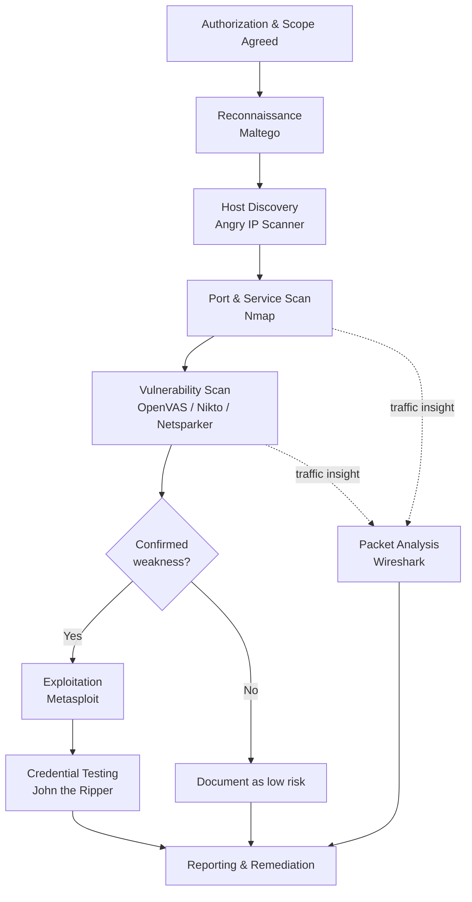

# Cyber Security Tools Intro

> What you'll learn: the essential security tools every ethical hacker uses — what each one does and where it fits in the attack lifecycle. **Prerequisites:** basic comfort with a computer, knowing what an IP address and a website are, and a willingness to read carefully. No prior hacking experience required.

| | |
|---|---|
| **Course** | Ethical Hacking Foundation |
| **Course code** | SKL-CEF-705 |
| **Module** | Cyber Security Tools Intro |
| **Level** | Foundation |

---

## 1. In Plain English

Imagine you've just been hired to test how secure a building is. You wouldn't show up empty-handed. You'd bring a flashlight to peer into dark corners, a set of lock picks to test the doors, a notebook to map every entrance, and a camera to record what you find. Each tool does one job well, and together they let you understand the building far better than your eyes alone ever could.

Ethical hacking works the same way. An **ethical hacker** (also called a penetration tester, or "pentester") is someone hired to break into systems *with permission*, so the owner can fix the weaknesses before a real criminal finds them. To do that job, they rely on a toolbox of software — and this module introduces the most important tools in that box.

Here's the key idea a beginner should hold onto: hacking is not one magic action. It's a **process**, and different tools help at different stages. First you find out what's out there (reconnaissance). Then you look for weak spots (scanning). Then you try to get in (exploitation). The tools in this module map onto those stages. By the end, you won't be an expert in any single tool, but you'll know the *map* — what exists, what it's for, and when you'd reach for it.

One non-negotiable rule before we go further: **every tool here is legal to learn and illegal to misuse.** Pointing these tools at systems you don't own or aren't authorized to test is a crime in most countries. We only ever practice on our own machines, on deliberately vulnerable practice systems, or with written permission. Keep that rule in your bones for the rest of your career.

---

## 2. Core Concepts

### The Attack Lifecycle (the map everything hangs on)

Before the tools, learn the **attack lifecycle** — the ordered stages an attacker (or an authorized tester) moves through. Many frameworks describe this; a simple version is:

1. **Reconnaissance** — gathering information about the target (who owns it, what systems exist, who works there). Often done without touching the target directly.
2. **Scanning & Enumeration** — actively probing the target to find live hosts, open **ports** (numbered doors into a computer where services listen), and running services.
3. **Vulnerability Analysis** — checking whether those services have known weaknesses, called **vulnerabilities**.
4. **Exploitation** — using a weakness to gain access. The piece of code that takes advantage of a vulnerability is called an **exploit**.
5. **Post-Exploitation** — once inside: escalating privileges, moving to other machines, and (for a tester) proving impact.
6. **Reporting** — writing up what was found so it can be fixed. This is the most valuable stage in ethical hacking.

Every tool below slots into one or more of these stages.

### Operating Systems Built for Security: Kali Linux and Parrot Security OS

Most of these tools run best on a **Linux** operating system, and two Linux "distributions" (a distribution, or *distro*, is a complete packaged version of Linux) are purpose-built for security work:

- **Kali Linux** — maintained by Offensive Security, Kali comes pre-loaded with hundreds of security tools so you don't have to install each one. Think of it as a workshop where every tool is already on the wall.
- **Parrot Security OS** — a similar, security-focused distro from the Parrot project. It also ships with security tools but adds a strong emphasis on **privacy** and is lighter on system resources, so it runs well on older or smaller machines.

You don't *have* to use these — the tools can run on other systems — but they save enormous setup time. Beginners usually run them inside a **virtual machine** (a "computer within your computer," created by software like VirtualBox or VMware) so they stay isolated and safe.

### Scanners vs. Exploitation Tools vs. Analysis Tools

The tools fall into rough families:

- **Network/port scanners** find what's reachable (Nmap, Angry IP Scanner).
- **Vulnerability scanners** check for known weaknesses (OpenVAS, Nikto, Netsparker).
- **Exploitation frameworks** actually attempt to break in (Metasploit).
- **Traffic/protocol analyzers** read network conversations (Wireshark).
- **Password/credential tools** test or recover passwords (John the Ripper, Cain — legacy).
- **Intelligence/mapping tools** connect the dots between people, domains, and infrastructure (Maltego).

### Key vocabulary to anchor now

- **Port** — a numbered channel on a computer (0–65535). Web servers usually listen on port 80 (HTTP) or 443 (HTTPS); SSH remote login on 22.
- **Service** — a program listening on a port (e.g., a web server, a database).
- **Vulnerability** — a flaw that could be abused. Public ones get a **CVE** identifier (Common Vulnerabilities and Exposures), a unique catalog number.
- **Payload** — in exploitation, the action that runs after a break-in succeeds (e.g., open a remote shell).
- **Packet** — a small chunk of data sent across a network. Conversations are made of many packets.

---

## 3. How It Works (Step by Step)

Let's walk through how an authorized tester uses these tools across the lifecycle. Picture a tester engaged to assess `lab.example.com` (a system they have written permission to test).

1. **Reconnaissance with Maltego.** The tester maps publicly available information — domains, related IP addresses, email formats — to understand the target's footprint without aggressively touching it.

2. **Host & port discovery with Angry IP Scanner / Nmap.** A quick sweep with Angry IP Scanner shows which addresses respond. Nmap then digs deeper: which ports are open, what services run, and which versions they are.

3. **Vulnerability scanning with OpenVAS, Nikto, Netsparker.** Knowing the services, the tester runs scanners. OpenVAS checks the host broadly; Nikto and Netsparker focus on the web application, flagging misconfigurations and known issues.

4. **Traffic inspection with Wireshark.** Throughout, Wireshark can capture network packets to confirm what's actually being sent — useful for spotting unencrypted data or understanding a protocol.

5. **Exploitation with Metasploit.** If a confirmed vulnerability allows it, the tester uses Metasploit to safely demonstrate that the weakness is real, choosing an appropriate exploit and payload.

6. **Credential testing with John the Ripper.** If password hashes are recovered (legally, within scope), John tests how weak they are — proving that better password policy is needed.

7. **Reporting.** Everything is documented with evidence and remediation advice.



---

## 4. Real-World Examples

**Wireshark and unencrypted credentials.** In countless training labs and real assessments, testers open Wireshark, log into a website that uses plain HTTP instead of HTTPS, and watch the username and password appear in the captured packets in plain text. This single demonstration is one of the most persuasive arguments for enforcing HTTPS everywhere — it makes an abstract risk visible in seconds.

**Metasploit and EternalBlue (CVE-2017-0144).** In 2017, a Windows SMB vulnerability nicknamed *EternalBlue* was used by the WannaCry ransomware to spread across hundreds of thousands of machines worldwide. A corresponding module exists in Metasploit, and authorized testers routinely use it against patched-vs-unpatched lab machines to show defenders exactly why timely patching matters. The lesson: the same weakness criminals abuse is what ethical hackers safely demonstrate to drive fixes.

**Nmap as the universal first step.** Across the industry, almost every penetration test and many incident investigations begin with an Nmap scan to understand what is exposed. Its ubiquity is why it appears in security training, audits, and even popular culture — it's the "look before you leap" tool of the field.

---

## 5. Tools of the Trade

> Note: tool flags shown are common, real options. Always check each tool's own `--help` or manual, as options evolve.

### Nmap — network mapper / port scanner

Finds live hosts, open ports, and service versions.

```bash
nmap -sV 192.168.56.101
```
`-sV` asks Nmap to probe open ports and report the **service version** running on each. The output lists ports, their state (open/closed/filtered), and best-guess software versions.

### Angry IP Scanner — fast, simple host discovery

Quickly tells you which addresses in a range are alive. It's GUI-based and beginner-friendly. You enter a range (e.g., `192.168.56.1` to `192.168.56.254`), click *Start*, and it pings each address, showing which respond and (optionally) which ports are open.

### OpenVAS — open-source vulnerability scanner

Scans hosts against a large database of known vulnerabilities and produces a report. Usually driven through its web interface (part of the Greenbone framework). You define a *target*, attach a *scan configuration*, and launch a task; results are graded by severity.

### Nikto — web server scanner

Checks web servers for thousands of known issues and misconfigurations.

```bash
nikto -h http://192.168.56.101
```
`-h` specifies the host/URL to test. Nikto reports outdated server software, dangerous default files, and risky configuration items.

### Netsparker — automated web application security scanner

A commercial **DAST** tool (Dynamic Application Security Testing — it tests a *running* application from the outside). It crawls a web app and tries to confirm issues like SQL injection and cross-site scripting, aiming to reduce false alarms. Driven through its GUI/dashboard: you point it at a target URL, configure scope, and run a scan.

### Metasploit — exploitation framework

A framework for selecting and running exploits with chosen payloads, all in a controlled, modular way.

```bash
msfconsole
search type:exploit eternalblue
```
`msfconsole` launches Metasploit's interactive console; `search` finds modules by keyword. You then `use` a module, `set` options like `RHOSTS` (target), and `run` it — only against authorized targets.

### Wireshark — packet/protocol analyzer

Captures and decodes network traffic so you can see exactly what's on the wire. In the GUI you pick an interface and start capturing; a **display filter** narrows results, e.g.:

```text
http.request.method == "POST"
```
This filter shows only HTTP POST requests — handy for spotting form submissions and potentially exposed credentials.

### John the Ripper — password cracking / strength testing

Tests how resistant password hashes are by attempting to recover them.

```bash
john --wordlist=/usr/share/wordlists/rockyou.txt hashes.txt
```
`--wordlist` points John at a list of candidate passwords to try against the hashes in `hashes.txt`. It's used to prove weak passwords are guessable — only on hashes you're authorized to test.

### Maltego — open-source intelligence (OSINT) and link analysis

A visual tool that maps relationships between domains, IPs, people, and organizations using "transforms" (automated lookups). It's used in the reconnaissance stage to build a picture of a target's footprint. Operated through its graphical canvas; no single command line.

### Cain (and Abel) — legacy Windows credential tool

A historic Windows tool for password recovery and network sniffing. **It is no longer maintained and is considered legacy** — modern testers use current alternatives. We mention it for context only; do not rely on it.

---

## 6. Hands-On Lab (Authorized / Lab-Only)

> Reminder: **Only run these steps against systems you own or are explicitly authorized to test.** Everything below targets your own machine — nothing else.

Welcome to your very first lab. Take a breath — this is gentle and safe. We'll install **Nmap** and scan *your own computer*. You cannot harm anything by scanning yourself.

**Step 1 — Install Nmap.**
- On **Kali/Parrot Linux**: it's already installed. Open a terminal.
- On **Ubuntu/Debian Linux**: `sudo apt update && sudo apt install nmap`
- On **macOS** (with Homebrew): `brew install nmap`
- On **Windows**: download the official installer from nmap.org and run it.

**Step 2 — Confirm it works.**

```bash
nmap --version
```
This prints the installed version. If you see a version number, you're ready. `--version` just asks the program to identify itself — completely harmless.

**Step 3 — Scan your own machine.** Every computer can refer to itself using the special address `127.0.0.1`, called **localhost** ("this computer here").

```bash
nmap 127.0.0.1
```

**What each part means:**
- `nmap` — the program.
- `127.0.0.1` — the target: *your own computer*. You are scanning yourself, which is always allowed.

**Reading the output.** Nmap prints a small table. Example:

```text
PORT     STATE  SERVICE
631/tcp  open   ipp
```
- **PORT** — the door number and protocol (`tcp`).
- **STATE** — `open` means something is listening there; `closed` means nothing is; `filtered` means a firewall is blocking the view.
- **SERVICE** — Nmap's guess at what program uses that port (here, `ipp` is a printing service).

If you see *no open ports*, that's perfectly fine — it just means your machine isn't running listening services, which is actually good for security.

**Where to practice more (safely).** When you're ready for a richer target, set up **Metasploitable** — a deliberately vulnerable Linux VM made for practice — inside VirtualBox, on an **isolated host-only network** so it can never reach the internet or your real network. Scan *that* VM, never anything else. You're doing great; go slowly and read every line of output. Curiosity plus permission is the whole game.

---

## 7. Countermeasures & Defenses

The blue team (defenders) can detect and blunt almost everything above:

**Detect**
- Monitor for **port-scan patterns** (many connection attempts across ports in a short time) using IDS/IPS such as Snort or Suricata.
- Centralize logs in a **SIEM** (Security Information and Event Management system) to spot scanning and brute-force attempts.
- Watch for unusual authentication failures — a sign of password attacks (John-style cracking is offline, but online guessing is detectable).

**Prevent**
- **Patch promptly** — most exploited vulnerabilities (like EternalBlue) had fixes available before they were widely abused.
- **Reduce attack surface** — close unused ports, disable unneeded services, and segment networks so one compromised host can't reach everything.
- **Enforce HTTPS/encryption everywhere** so Wireshark-style sniffing reveals nothing useful.
- **Strong password policy + MFA** — long, unique passwords and multi-factor authentication defeat wordlist cracking and stolen-password reuse.
- **Web application hardening** — input validation and secure coding stop the SQL injection / XSS issues Nikto and Netsparker hunt for.

**Mitigate**
- **Rate-limiting and account lockout** slow online guessing.
- **Firewalls and WAFs** (Web Application Firewalls) filter hostile traffic.
- **Run your own scans first** — use these very tools defensively to find and fix weaknesses before attackers do.

---

## 8. Key Terms

- **Ethical hacker / penetration tester** — a professional who tests systems for weaknesses *with authorization*.
- **Attack lifecycle** — the ordered stages from reconnaissance to reporting.
- **Port** — a numbered channel where a network service listens.
- **Service** — a program listening on a port.
- **Vulnerability** — a flaw that can be abused; catalogued publicly as a **CVE**.
- **Exploit** — code or technique that takes advantage of a vulnerability.
- **Payload** — what runs after a successful exploit (e.g., a remote shell).
- **Packet** — a unit of data sent over a network.
- **Distribution (distro)** — a complete, packaged version of Linux (e.g., Kali, Parrot).
- **Virtual machine (VM)** — a software-emulated computer running inside your real one.
- **OSINT** — Open-Source Intelligence; information gathered from public sources.
- **DAST** — Dynamic Application Security Testing; scanning a running app from the outside.
- **SIEM** — central system for collecting and analyzing security logs.
- **localhost / 127.0.0.1** — the address a computer uses to refer to itself.

---

## 9. Summary & Takeaways

- Ethical hacking is a **process**, not a single act; tools map onto the stages of the **attack lifecycle**.
- **Kali Linux** and **Parrot Security OS** bundle the tools so you can start fast — typically inside an isolated **virtual machine**.
- **Reconnaissance** (Maltego) → **discovery** (Angry IP Scanner, Nmap) → **vulnerability scanning** (OpenVAS, Nikto, Netsparker) → **exploitation** (Metasploit) → **credentials** (John the Ripper), with **Wireshark** giving visibility throughout.
- **Cain** is legacy and unmaintained — know it exists, but use modern tools.
- Every offensive tool has a **defensive use**: scan yourself, patch fast, encrypt traffic, enforce strong passwords and MFA.
- The single unbreakable rule: **only test systems you own or are authorized to test.** Practice on localhost or Metasploitable on an isolated network.
- Learning the *map* of tools matters more right now than mastering any one — depth comes later.

**Further reading:** OWASP Testing Guide and OWASP Top 10; NIST SP 800-115 (Technical Guide to Information Security Testing and Assessment); MITRE ATT&CK framework; the official Nmap Reference Guide and Metasploit documentation.
