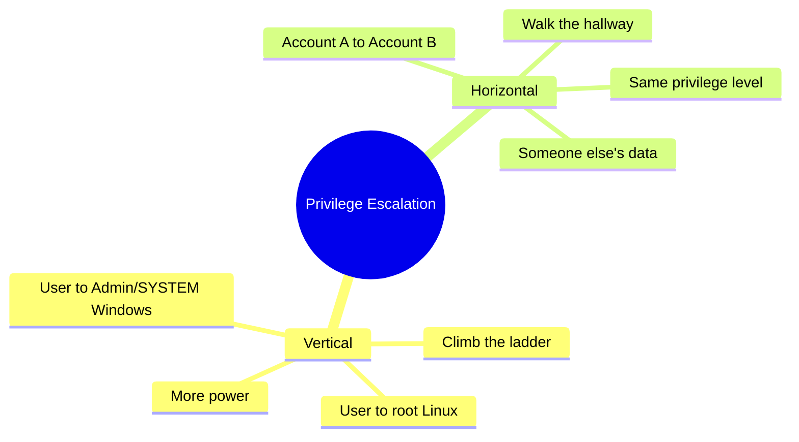
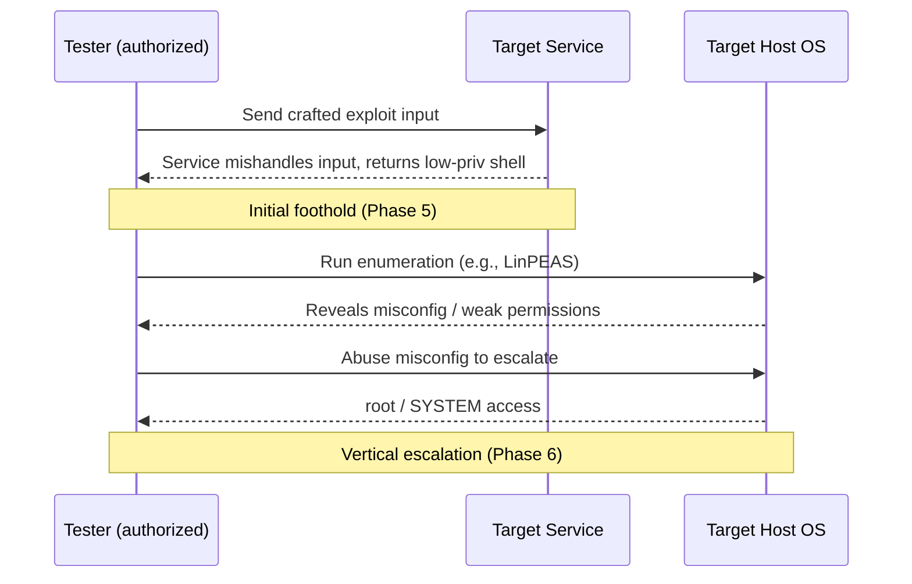
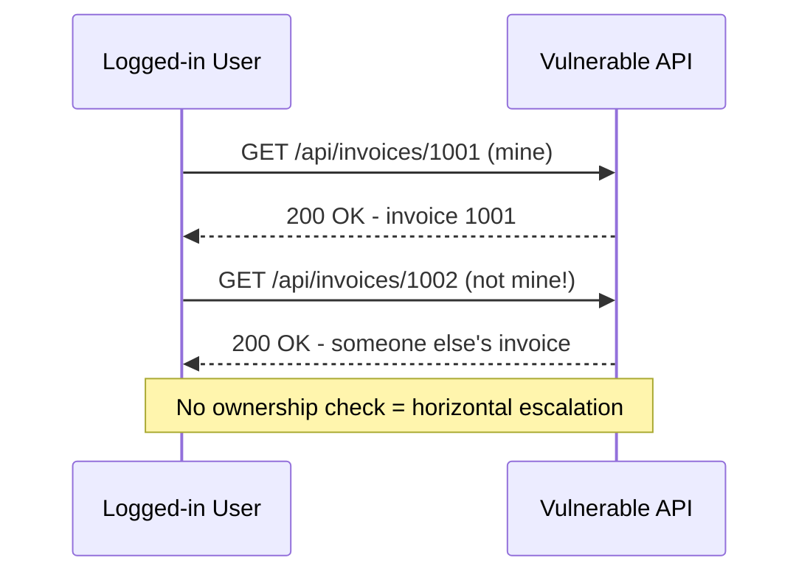
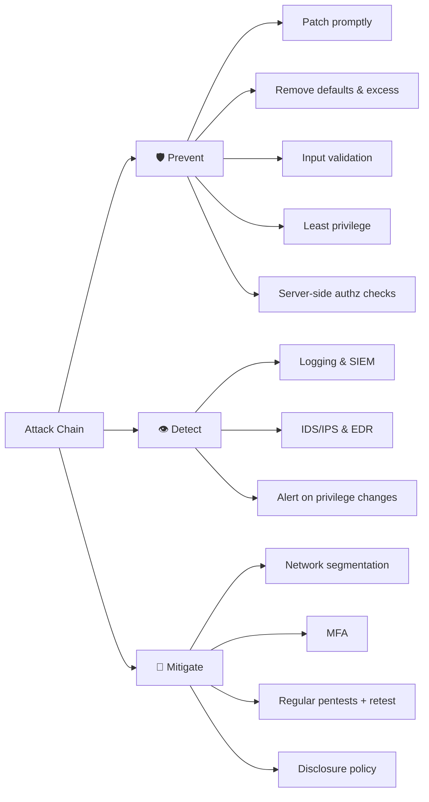

# Exploitation and Penetration Testing 🎯

> **What you'll learn:** How attackers turn a weakness into actual access, what a penetration test really is, how testers report findings, how attackers climb to higher privileges, and how the security community responsibly reports vulnerabilities.
> **Prerequisites:** Basic comfort with a terminal/command line, the idea of a "vulnerability" (a flaw or weakness in software), and the earlier modules on networking and reconnaissance.

| | |
|---|---|
| **Course** 📚 | Ethical Hacking Foundation |
| **Course code** 🔖 | SKL-CEF-705 |
| **Module** 📦 | 05 — Exploitation and Penetration Testing |
| **Level** 🟢 | Foundation |

---

## 1. In Plain English

Imagine a locksmith you *hired* to test your house. You give them written permission, then ask: "Try to break in. Tell me every weak door, every window that won't latch, and the exact order you'd use to reach the safe." When done, they hand you a tidy report: "The back door lock is worn — anyone could push it open. Once inside, the office key was on the table, which let me into the filing cabinet." That is, in spirit, a **penetration test** — and the moment the locksmith pushes that weak door open is **exploitation**.

The three core ideas in one glance:

| Idea | What it is | House analogy 🏠 |
|---|---|---|
| **Vulnerability** | A weakness (bug, misconfig, weak password) | The unlocked window |
| **Exploit** | The act/technique of *using* the weakness | Climbing through the window |
| **Penetration test** | Authorized simulated attack + report | The hired locksmith's whole job |

Why should a beginner care? Almost every real breach follows the same shape: **find → exploit → expand → report**. Someone finds a weakness, uses it to get a foothold, then quietly expands access until they reach something valuable.

> 🔑 **Key idea:** The "ethical" part is non-negotiable. Everything here is done **only with permission**, to find and fix problems *before* criminals do.

This module connects the pieces: what exploitation looks like, how a professional pentest is organized and reported, how attackers escalate from a tiny foothold to full control, and how good people report bugs responsibly.

---

## 2. Core Concepts

### Vulnerability vs. Exploit vs. Payload

These three words get mixed up constantly. Pin them down:

| Term | Definition | Lock analogy 🔐 |
|---|---|---|
| **Vulnerability** | A flaw or weakness — e.g., a login form that doesn't check input | The door |
| **Exploit** | The *technique or code* that takes advantage of the flaw | The key |
| **Payload** | *What runs* after the exploit succeeds (remote shell, new user, read a file) | What you do in the room |

> 💡 **Tip:** Memorize the one-liner — **vulnerability = the door, exploit = the key, payload = what you do in the room.**

### What Vulnerability Exploitation Actually Means

Exploitation is making a system behave in an unintended way that benefits the attacker. The common categories a beginner will hear about:

| Category | What goes wrong | Beginner example |
|---|---|---|
| 🧠 **Memory-safety bugs** | Program fed more data than expected, overwriting memory | Buffer overflow changes what the program does |
| 💉 **Injection flaws** | User input treated as *code* instead of *data* | SQL injection, command injection |
| 🔓 **Auth flaws** | Weak passwords, missing checks, logic mistakes | Acting as someone you're not |
| ⚙️ **Misconfigurations** | Defaults and excess left exposed | Default credentials, open admin panels |

*(SQL = the language databases speak.)*

Two reference systems let everyone talk about the same bug:

- **CVE** (Common Vulnerabilities and Exposures) — the public catalog of known vulnerabilities; each gets an ID like `CVE-YYYY-NNNNN`.
- **CVSS** (Common Vulnerability Scoring System) — the **0–10** score rating how severe a vulnerability is.

### What Penetration Testing Is

A **penetration test** ("pentest") is an *authorized, simulated attack* to find weaknesses before real attackers do. The deliverable isn't "we broke in" — it's actionable knowledge the owner can use to get safer.

> ⚠️ **Warning:** The key word is **authorized**. A pentest without written permission is just a crime.

Pentests are classified by how much information the tester is given:

| Type | Tester's knowledge | Simulates |
|---|---|---|
| ⬛ **Black box** | Almost nothing (just a target name/IP) | External attacker starting from scratch |
| 🔲 **Grey box** | Partial (e.g., a normal user account) | A logged-in user / partially-informed attacker |
| ⬜ **White box** | Full (source, architecture, credentials) | Thorough internal review / worst-case insider |

A related term is **Red Team**: a stealthier, goal-oriented exercise testing not just the technology but the people and detection/response process.

| | Standard Pentest | Red Team |
|---|---|---|
| **Goal** | Coverage — find as many issues as possible | A specific objective (e.g., reach the crown jewels) |
| **Stealth** | Usually open/coordinated | Quiet — avoid detection |
| **Tests** | The technology | Tech **+ people + response process** |

### Penetration Testing and Reports

The report is the product. Two engagements can use the same exploit, but a good report turns raw access into decisions. A solid finding includes:

| Element | What it answers |
|---|---|
| 🏷️ **Title & severity** (often CVSS) | "SQL Injection in login form — Critical" |
| 🎯 **Affected asset** | Which host, URL, or service |
| 📝 **Description & impact** | What the flaw is; what an attacker could do |
| 📸 **Evidence / PoC** | Screenshots, request/response samples, repro steps |
| 🛠️ **Remediation** | How to fix it (e.g., "use parameterized queries") |

Reports usually have an **executive summary** (plain-language risk overview for managers) and a **technical findings** section (detailed steps for engineers). Findings are prioritized so the most dangerous, easiest-to-fix issues get attention first.

> 🖼️ *Suggested image: a redacted sample pentest report page showing a finding with severity badge, affected asset, and remediation.*

### Privilege Escalation: Vertical vs. Horizontal

Once you have *some* access, you usually don't have *enough*. **Privilege escalation** is gaining more access than you were originally granted.



- **Vertical** — moving *up* to higher privileges. Example: a normal user becomes **root** (the all-powerful Linux admin) or **Administrator/SYSTEM** (Windows). This is "low user → admin."
- **Horizontal** — moving *sideways* to another account at the *same* level. Example: logged in as User A, you change a URL parameter from `account=A` to `account=B` and see User B's data. No new privileges, but access you shouldn't have.

> 💡 **Tip:** **Vertical = climb the ladder (more power); horizontal = walk down the hallway (same power, someone else's room).**

### Responsible / Coordinated Vulnerability Disclosure

When a researcher finds a real vulnerability — even outside a formal pentest — what should they do? **Responsible disclosure** (modern term: **Coordinated Vulnerability Disclosure, CVD**) means privately reporting the bug to the vendor first, giving reasonable time to fix it, then publishing details.

| Approach | What happens | Effect on users |
|---|---|---|
| 📢 **Full disclosure** | Publish immediately, no warning | Pressures vendors, but exposes users to attack |
| 🤐 **Non-disclosure** | Sit on it / sell it | Leaves everyone vulnerable |
| 🤝 **Coordinated (CVD)** | Report privately → agree timeline (~90 days) → fix + advisory → credit researcher | Responsible middle path ✅ |

- A **bug bounty program** is a formal channel where organizations *invite* researchers to report flaws and *pay* them for valid findings — turning disclosure into a safe, rewarded process.
- A **safe harbor** clause promises researchers won't be sued for good-faith testing within the rules.

---

## 3. How It Works (Step by Step)

Here's the typical lifecycle of an authorized pentest, from agreement to fix. It mirrors industry frameworks like the **PTES** (Penetration Testing Execution Standard).

| # | Phase | What happens |
|---|---|---|
| 1 | 📜 **Scoping & authorization** | Define in-scope systems, rules of engagement, timeframe; get **written permission**. Nothing happens before this. |
| 2 | 🔍 **Reconnaissance** | Gather info (open ports, software versions, exposed services). |
| 3 | 📋 **Scanning & enumeration** | Probe services to list users, shares, versions, likely weak points. |
| 4 | 🧪 **Vulnerability analysis** | Match findings against known weaknesses (CVEs, misconfigs, weak creds); decide what's worth trying. |
| 5 | 💥 **Exploitation** | Carefully gain an initial foothold (e.g., a low-priv shell). Confirm the issue is real without damage. |
| 6 | 🧗 **Post-exploitation & escalation** | Escalate (vertical) and/or move to other accounts/systems (horizontal/lateral) to show true impact. |
| 7 | 📄 **Reporting** | Document each finding with severity, evidence, remediation; deliver and walk through it. |
| 8 | 🔧 **Remediation & retest** | Owner fixes issues; tester verifies the fixes actually closed the holes. |


To see the attacker/target exchange concretely, here is a simplified exploitation handshake — a foothold followed by escalation:



---

## 4. Real-World Examples

### 🩸 Equifax (2017)

Attackers exploited a known, unpatched vulnerability in the Apache Struts web framework (publicly tracked as **CVE-2017-5638**, a remote code execution flaw). A patch existed *before* the breach but wasn't applied in time. From that foothold, attackers moved through internal systems and exfiltrated personal data on roughly **147 million** people.

> 🔑 **Key idea:** Exploitation often targets *known* bugs that simply weren't patched — and a single foothold can cascade through a poorly segmented internal network.

### 🔢 Broken Object Level Authorization (a horizontal escalation classic)

A very common web flaw — OWASP calls it **Broken Object Level Authorization (BOLA / IDOR)** — happens when an app trusts a user-supplied ID without checking ownership:



No "hacking tools" needed — just changing a number. This is textbook **horizontal privilege escalation** and shows why authorization must be checked on the server for *every* request.

### 🤝 Coordinated disclosure done right

Major vendors (Microsoft, Google, Apple) run formal vulnerability reporting and bug bounty programs. Google's **Project Zero** popularized a ~90-day coordinated disclosure window: report privately, give the vendor time to patch, then publish so the community can learn and defend. This balances vendor fix time against the public's right to know.

---

## 5. Tools of the Trade 🧰

> ⚠️ **Warning:** Use these only against systems you own or are explicitly authorized to test.

| Tool | Category | Use case |
|---|---|---|
| **Nmap** | Network discovery | Find live hosts, open ports, service versions |
| **Metasploit** | Exploitation toolkit | Library of checks, exploits, and payloads |
| **Nikto** | Web server scanner | Misconfigs, default files, outdated software |
| **Burp Suite (Community)** | Web proxy | Inspect/modify requests — great for IDOR hunting |
| **LinPEAS / WinPEAS** | Priv-esc enumeration | Flag escalation paths on a host you control |

### Nmap — network discovery & service scanning

The "map" before any exploitation.

```bash
nmap -sV -p- 192.168.56.101
```
- `-sV` — detect *service versions* (e.g., "Apache 2.4.18").
- `-p-` — scan *all* 65,535 ports.
- last value — the target IP.

Output lists open ports and their software, which you compare against known vulnerabilities.

> 🖼️ *Suggested image: terminal screenshot of an Nmap `-sV` scan listing open ports and detected service versions.*

### Metasploit Framework — exploitation toolkit

A large library of vulnerability checks, exploits, and payloads with a unified console.

```bash
msfconsole -q
```
Launches the console quietly (`-q` suppresses the banner). Inside, you `search` for an exploit, `use` it, `set` options like `RHOSTS` (target) and `LHOST` (your listener), then `run`.

> 💡 **Tip:** For learning, prefer Metasploit's built-in checks over live exploits.

> 🖼️ *Suggested image: the `msfconsole` interface after selecting a module and showing its options.*

### Nikto — web server scanner

```bash
nikto -h http://192.168.56.101
```
`-h` specifies the host/URL. Nikto reports things like exposed admin pages or dangerous default files.

### Burp Suite (Community) — web proxy

Sits between your browser and a web app so you can inspect and modify requests — ideal for spotting IDOR/horizontal escalation by tweaking parameters. Used through its GUI; configure your browser to proxy through `127.0.0.1:8080`.

### LinPEAS / WinPEAS — privilege escalation enumeration

```bash
./linpeas.sh
```
Run on a Linux target you control; it highlights escalation opportunities (misconfigs, weak file permissions, stored creds) in colored output. **WinPEAS** is the Windows equivalent.

---

## 6. Hands-On Lab (Authorized / Lab-Only) 🔬

> ⚠️ **Warning:** Perform this **only** on systems you own or are explicitly authorized to test — here, that's *your own computer*.

This lab is gentle and completely safe. You won't attack anyone. You'll install one classic tool and scan **your own machine** to see what a scanner "sees" — building the most important habit in security: *know your own surface before anyone else maps it for you.*

**Step 1 — Install Nmap.**

On Ubuntu/Debian Linux:
```bash
sudo apt update && sudo apt install -y nmap
```
`sudo` runs as administrator; `apt update` refreshes the package list; `apt install -y nmap` installs Nmap, and `-y` auto-answers "yes". *(macOS: `brew install nmap`; Windows: download the official installer from nmap.org.)*

**Step 2 — Confirm it installed.**
```bash
nmap --version
```
Seeing a version number means you're ready.

**Step 3 — Scan your own machine (the safest possible target).**
```bash
nmap -F 127.0.0.1
```
- `nmap` — the tool.
- `-F` — "Fast" scan; checks only the ~100 most common ports, so it finishes in seconds.
- `127.0.0.1` — **localhost**, a special address always meaning "this very computer." You only ever talk to yourself, so it's 100% safe.

**Reading the output.** You'll see lines like:
```
PORT     STATE   SERVICE
631/tcp  open    ipp
```

| Column | Meaning |
|---|---|
| **PORT** | The numbered "door" (631) |
| **STATE** | `open` (service listening), `closed` (nothing listening), or `filtered` (firewall blocking the view) |
| **SERVICE** | Nmap's guess at what's behind the door (`ipp` = a printing service) |

> 💡 **Tip:** If almost everything is `closed` or you see very few open ports — that's *good*. A small surface means fewer doors to try. A service you didn't know was running is a useful discovery: now you can decide whether you actually need it.

> 🖼️ *Suggested image: your own `nmap -F 127.0.0.1` output, with the PORT/STATE/SERVICE columns highlighted.*

That's the whole lab — a real tool, a real scan, real output, safely against yourself. When ready to go further, the standard *safe* practice target is **Metasploitable 2** (an intentionally vulnerable VM) run inside an isolated, host-only virtual network so it can never touch the real internet. Take your time; everyone starts exactly here.

---

## 7. Countermeasures & Defenses 🛡️

Defense maps neatly onto three jobs: **Prevent** (shrink the attack surface), **Detect** (notice trouble), and **Mitigate** (limit the blast radius).



Each defense counters a specific attacker move:

| Attacker move | Defense that blunts it |
|---|---|
| Exploit a *known* unpatched bug | ⏱️ **Patch promptly** — most breaches hit known bugs |
| Use default creds / exposed service | 🚪 **Remove defaults & excess** — change creds, disable unused services/ports |
| Injection (input treated as code) | 🧼 **Validate input & use parameterized queries** |
| Vertical/horizontal escalation | 🔑 **Least privilege** — minimum access per account/service |
| IDOR / BOLA | ✅ **Check authorization on every request, server-side** — never trust a client-supplied ID |
| Exploit attempt in progress | 👁️ **Logging + SIEM, IDS/IPS, EDR** to flag anomalies |
| New admin account / `root` activity | 🚨 **Alerts on privilege changes** |
| Lateral movement after foothold | 🧱 **Network segmentation** (Equifax's spread is the cautionary tale) |
| Stolen credentials | 📱 **MFA** |
| Unknown weaknesses | 🔁 **Regular pentests + fix + retest**; publish a **vulnerability disclosure policy** |

---

## 8. Key Terms 📖

| Term | Meaning |
|---|---|
| **Vulnerability** | A flaw or weakness in a system that could be abused |
| **Exploit** | The technique or code that takes advantage of a vulnerability |
| **Payload** | The action/code that runs after a successful exploit (e.g., a remote shell) |
| **Penetration test** | An authorized, simulated attack to find weaknesses before real attackers do |
| **Black/Grey/White box** | Pentests with no / partial / full prior knowledge of the target |
| **Red Team** | A stealthy, objective-driven exercise testing tech, people, and response |
| **CVE** | A public ID for a specific known vulnerability (`CVE-YYYY-NNNNN`) |
| **CVSS** | The 0–10 severity score for a vulnerability |
| **Privilege escalation** | Gaining more access than originally granted |
| **Vertical escalation** | Moving up to higher privileges (user → admin/root) |
| **Horizontal escalation** | Moving sideways to another account at the same level |
| **Lateral movement** | Spreading from one compromised system to others |
| **Root / Administrator / SYSTEM** | The highest-privilege accounts on Linux/Windows |
| **IDOR / BOLA** | Accessing others' objects by changing an ID the server failed to check |
| **Coordinated Vulnerability Disclosure (CVD)** | Reporting bugs privately, allowing fix time, then publishing |
| **Bug bounty** | A program that rewards researchers for valid vulnerability reports |
| **Safe harbor** | A policy promise not to pursue legal action against good-faith researchers |

---

## 9. Summary & Takeaways ✅

- A **vulnerability** is the weakness, an **exploit** is how you use it, a **payload** is what runs afterward — keep these three distinct.
- A **penetration test** is an *authorized* simulated attack; without written permission, it's illegal. The **report** — not the break-in — is the real deliverable.
- Pentests are scoped as **black/grey/white box**, and the work follows a repeatable lifecycle: authorize → recon → scan → analyze → exploit → escalate → report → remediate → retest.
- **Privilege escalation** turns a small foothold into real impact: **vertical** = climbing to admin/root; **horizontal** = reaching a peer account you shouldn't.
- Most real breaches (e.g., **Equifax, 2017**) exploit *known, unpatched* bugs and then spread through flat networks — so **patching** and **segmentation** are high-value defenses.
- Defenders win with **least privilege, input validation, server-side authorization checks, MFA, logging/SIEM, and IDS/EDR.**
- **Coordinated Vulnerability Disclosure** and **bug bounties** are the ethical way to handle real-world bugs: report privately, allow fix time, then publish.

> 🔑 **Key idea:** Everything here is for **owned/authorized systems only** — your skills are valuable precisely because you use them to protect, not to harm.

**Further reading:** OWASP Top 10 and the OWASP Web Security Testing Guide (WSTG); NIST SP 800-115 (Technical Guide to Information Security Testing and Assessment); MITRE ATT&CK (Privilege Escalation & related tactics) and the MITRE CVE program; the Penetration Testing Execution Standard (PTES); ISO/IEC 29147 (Vulnerability Disclosure) and 30111 (Vulnerability Handling).
