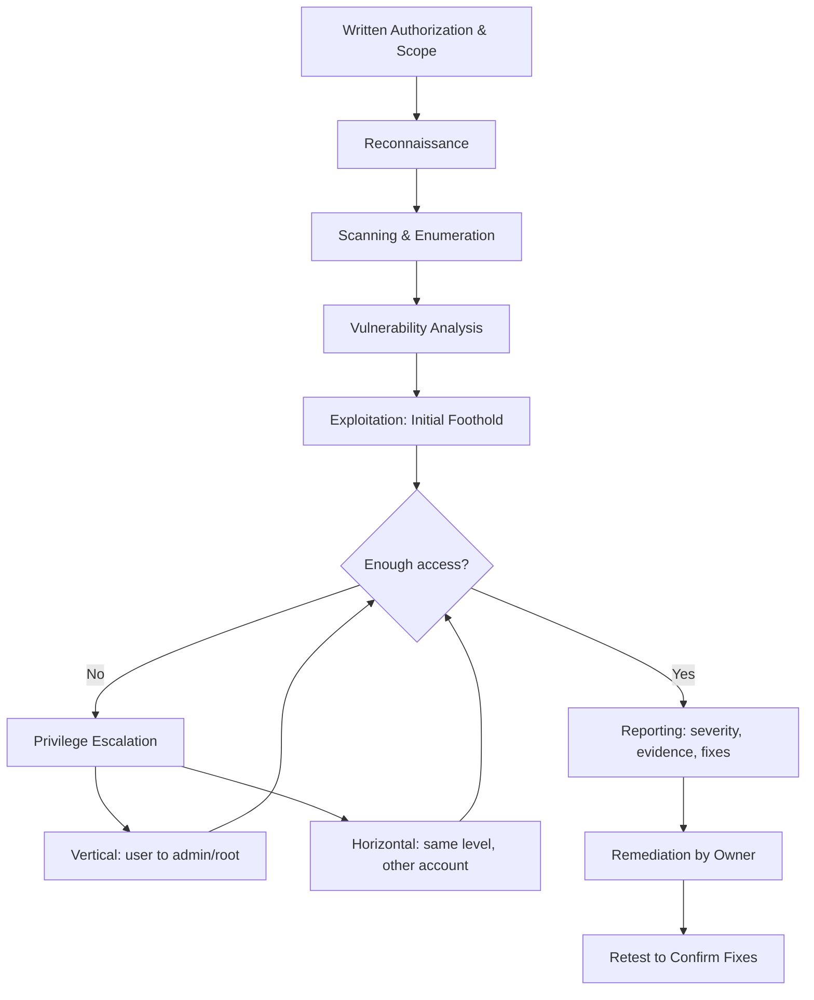

# Exploitation and Penetration Testing

> **What you'll learn:** How attackers turn a weakness into actual access, what a penetration test really is, how testers report their findings, how attackers climb to higher privileges, and how the security community responsibly reports vulnerabilities.
> **Prerequisites:** Basic comfort with using a terminal/command line, the idea of what a "vulnerability" is (a flaw or weakness in software), and the earlier modules on networking and reconnaissance.

| | |
|---|---|
| **Course** | Ethical Hacking Foundation |
| **Course code** | SKL-CEF-705 |
| **Module** | 05 — Exploitation and Penetration Testing |
| **Level** | Foundation |

---

## 1. In Plain English

Imagine a locksmith you *hired* to test your house. You give them written permission and a key list, then ask: "Try to break in. Tell me every weak door, every window that doesn't latch, and the exact order you'd use to reach the safe in my bedroom." When they finish, they hand you a tidy report: "Back door lock is worn — anyone could push it open. Once inside, the office key was sitting on the table, which let me into the filing cabinet." That is, in spirit, what a **penetration test** is — and the moment the locksmith actually pushes the weak door open is **exploitation**.

A **vulnerability** is a weakness in a system (a software bug, a misconfiguration, a weak password). **Exploitation** is the act of *using* that weakness to make the system do something it shouldn't — like granting access or running the attacker's code. A vulnerability is the unlocked window; the exploit is the act of climbing through it.

Why should a total beginner care? Because almost every real-world breach you read about follows this same shape: someone finds a weakness, uses it to get a foothold, then quietly expands their access until they reach something valuable. Understanding this chain — find, exploit, expand, report — is the backbone of ethical hacking. The "ethical" part matters enormously: everything here is done **only with permission**, to find and fix problems before criminals do.

In this module we'll connect all the pieces: what exploitation looks like, how a professional pentest is organized and reported, how attackers escalate from a tiny foothold to full control, and finally how good people in security report bugs responsibly so they get fixed without causing harm.

---

## 2. Core Concepts

### Vulnerability vs. Exploit vs. Payload

These three words get mixed up constantly, so let's pin them down:

- **Vulnerability** — a flaw or weakness. Example: a login form that doesn't check input properly.
- **Exploit** — the *technique or code* that takes advantage of that flaw. Example: a specially crafted input that tricks the login form into letting you in.
- **Payload** — *what runs* after the exploit succeeds. Think of the exploit as picking the lock, and the payload as what you do once inside (open a remote shell, create a user, read a file).

A useful saying: **the vulnerability is the door, the exploit is the key, the payload is what you do in the room.**

### What Vulnerability Exploitation Actually Means

Exploitation is making a system behave in an unintended way that benefits the attacker. Common categories a beginner will hear about:

- **Memory-safety bugs** (e.g., buffer overflows): the program is fed more data than it expected, overwriting parts of memory and letting the attacker change what the program does.
- **Injection flaws** (e.g., SQL injection, command injection): user input is treated as *code/commands* instead of plain *data*. (SQL = the language databases speak.)
- **Authentication/authorization flaws**: weak passwords, missing checks, or logic mistakes that let you act as someone you're not.
- **Misconfigurations**: default credentials, exposed admin panels, unnecessary services left running.

**CVE** (Common Vulnerabilities and Exposures) is the public catalog of known vulnerabilities — each gets an ID like `CVE-YYYY-NNNNN`. **CVSS** (Common Vulnerability Scoring System) is the 0–10 score that rates how severe a vulnerability is. These let everyone refer to the same bug by the same name and agree on how bad it is.

### What Penetration Testing Is

A **penetration test** ("pentest") is an *authorized, simulated attack* on a system to find security weaknesses before real attackers do. The key word is **authorized**: a pentest without written permission is just a crime. The deliverable isn't "we broke in" — it's actionable knowledge the owner can use to get safer.

Pentests are commonly classified by how much information the tester is given:

| Type | Tester's knowledge | Simulates |
|---|---|---|
| **Black box** | Almost nothing (just a target name/IP) | An external attacker starting from scratch |
| **Grey box** | Partial (e.g., a normal user account) | A logged-in user or partially-informed attacker |
| **White box** | Full (source code, architecture, credentials) | A thorough internal review / worst-case insider |

A closely related term is **Red Team**: a stealthier, goal-oriented exercise that tests not just the technology but the people and detection/response process. A standard pentest aims for *coverage* (find as many issues as possible); a red team aims for a *specific objective* without getting caught.

### Penetration Testing and Reports

The report is the product. Two findings can use the same exploit, but a good report turns raw access into decisions. A solid finding includes:

- **Title & severity** (often using CVSS) — e.g., "SQL Injection in login form — Critical."
- **Affected asset** — which host, URL, or service.
- **Description & impact** — what the flaw is and what an attacker could do (steal data? take over the server?).
- **Evidence / proof of concept** — screenshots, request/response samples, the exact steps to reproduce.
- **Remediation** — how to fix it (e.g., "use parameterized queries").

Reports usually have an **executive summary** (plain-language risk overview for managers) and a **technical findings** section (detailed steps for engineers). Findings are prioritized so the most dangerous, easiest-to-fix issues get attention first.

### Privilege Escalation: Vertical vs. Horizontal

Once you have *some* access, you usually don't have *enough*. **Privilege escalation** is gaining more access than you were originally granted.

- **Vertical privilege escalation** — moving *up* to higher privileges. Example: a normal user becomes **root** (the all-powerful admin account on Linux) or **Administrator/SYSTEM** (on Windows). This is "low user → admin."
- **Horizontal privilege escalation** — moving *sideways* to another account at the *same* level. Example: logged in as User A, you change a URL parameter from `account=A` to `account=B` and now see User B's data. No new privileges, but access you shouldn't have.

A quick mental model: **vertical = climb the ladder (more power); horizontal = walk down the hallway (same power, someone else's room).**

### Responsible / Coordinated Vulnerability Disclosure

When a researcher finds a real vulnerability — even outside a formal pentest — what should they do with it? **Responsible disclosure** (modern term: **Coordinated Vulnerability Disclosure, CVD**) is the practice of privately reporting the bug to the vendor first, giving them reasonable time to fix it, and only then publishing details.

- **Full disclosure** (publishing immediately, no warning) pressures vendors but exposes users to attack.
- **Non-disclosure** (sitting on it / selling it) leaves everyone vulnerable.
- **Coordinated disclosure** is the responsible middle path: report privately, agree on a timeline (commonly ~90 days), coordinate a fix and public advisory, and credit the researcher.

A **bug bounty program** is a formal channel where organizations *invite* researchers to report flaws and *pay* them for valid findings — turning disclosure into a safe, rewarded process. A **safe harbor** clause in a program's policy promises researchers won't be sued for good-faith testing within the rules.

---

## 3. How It Works (Step by Step)

Here's the typical lifecycle of an authorized penetration test, from agreement to fix. It mirrors industry frameworks like the **PTES** (Penetration Testing Execution Standard).

1. **Scoping & authorization** — Define exactly which systems are in scope, the rules of engagement, the timeframe, and get **written permission**. Nothing happens before this.
2. **Reconnaissance** — Gather information about the target (open ports, software versions, exposed services). Covered in earlier modules.
3. **Scanning & enumeration** — Probe the discovered services to list users, shares, software versions, and likely weak points.
4. **Vulnerability analysis** — Match what you found against known weaknesses (CVEs, misconfigurations, weak credentials) and decide what's worth trying.
5. **Exploitation** — Carefully use a vulnerability to gain an initial foothold (e.g., a low-privilege shell). The tester confirms the issue is real without causing damage.
6. **Post-exploitation & privilege escalation** — From the foothold, escalate privileges (vertical) and/or move to other accounts and systems (horizontal/lateral movement) to demonstrate true impact.
7. **Reporting** — Document every finding with severity, evidence, and remediation; deliver and walk through the report.
8. **Remediation & retest** — The owner fixes the issues; the tester verifies the fixes actually closed the holes.



---

## 4. Real-World Examples

**Equifax (2017).** Attackers exploited a known, unpatched vulnerability in the Apache Struts web framework (publicly tracked as CVE-2017-5638, a remote code execution flaw). A patch existed *before* the breach, but it wasn't applied in time. From that initial foothold attackers moved through internal systems and exfiltrated personal data on roughly 147 million people. The lesson is brutal and simple: exploitation often targets *known* bugs that simply weren't patched, and a single foothold can cascade through poorly segmented internal networks.

**The "broken object level authorization" pattern (a horizontal escalation classic).** A very common web flaw — OWASP calls it **Broken Object Level Authorization (BOLA/IDOR)** — happens when an app trusts a user-supplied ID without checking ownership. A logged-in user requests `/api/invoices/1001`, then simply tries `1002`, `1003`, and sees other customers' invoices. No "hacking tools" needed — just changing a number. This is textbook **horizontal privilege escalation** and shows why authorization must be checked on the server for *every* request.

**Coordinated disclosure done right.** Major vendors (Microsoft, Google, Apple, etc.) run formal vulnerability reporting and bug bounty programs. Google's **Project Zero**, for instance, popularized a ~90-day coordinated disclosure window: report privately, give the vendor time to patch, then publish so the wider community can learn and defend. This balances vendor fix time against the public's right to know.

---

## 5. Tools of the Trade

> Use these only against systems you own or are explicitly authorized to test.

### Nmap — network discovery & service scanning

Finds live hosts, open ports, and what software is running on them — the "map" before any exploitation.

```bash
nmap -sV -p- 192.168.56.101
```
`-sV` asks Nmap to detect *service versions* (e.g., "Apache 2.4.18"); `-p-` scans *all* 65,535 ports; the last value is the target IP. The output lists open ports and their software, which you compare against known vulnerabilities.

### Metasploit Framework — exploitation toolkit

A large library of vulnerability checks, exploits, and payloads with a unified console (`msfconsole`).

```bash
msfconsole -q
```
Launches the Metasploit console quietly (`-q` suppresses the banner). Inside, you `search` for an exploit, `use` it, `set` options like `RHOSTS` (target) and `LHOST` (your listener), then `run`. For learning, prefer its built-in checks over live exploits.

### Nikto — web server scanner

Scans web servers for common misconfigurations, default files, and outdated software.

```bash
nikto -h http://192.168.56.101
```
`-h` specifies the host/URL to scan. Nikto reports things like exposed admin pages or dangerous default files.

### Burp Suite (Community) — web proxy

Sits between your browser and a web app so you can inspect and modify requests — ideal for spotting IDOR/horizontal escalation by tweaking parameters. Used through its GUI; you configure your browser to proxy through `127.0.0.1:8080`.

### LinPEAS / WinPEAS — privilege escalation enumeration

Scripts that scan a machine you already have a foothold on and flag likely paths to higher privileges (misconfigurations, weak file permissions, stored credentials).

```bash
./linpeas.sh
```
Run on a Linux target you control; it highlights escalation opportunities in colored output. (WinPEAS is the Windows equivalent.)

---

## 6. Hands-On Lab (Authorized / Lab-Only)

> Reminder: perform this **only** on systems you own or are explicitly authorized to test — here, that's *your own computer*.

Don't worry — this lab is gentle and completely safe. You won't attack anyone or break anything. You'll simply install one classic tool and scan **your own machine** to see what a scanner "sees." This builds the single most important habit in security: *know your own surface before anyone else maps it for you.*

**Step 1 — Install Nmap.**

On Ubuntu/Debian Linux:
```bash
sudo apt update && sudo apt install -y nmap
```
`sudo` runs the command as administrator; `apt update` refreshes the list of available packages; `apt install -y nmap` installs Nmap, and `-y` auto-answers "yes" so you aren't prompted. (On macOS you can use `brew install nmap`; on Windows, download the official installer from nmap.org.)

**Step 2 — Confirm it installed.**
```bash
nmap --version
```
This prints the installed version. Seeing a version number means you're ready — that's it.

**Step 3 — Scan your own machine (the safest possible target).**
```bash
nmap -F 127.0.0.1
```
Let's decode this:
- `nmap` — the tool.
- `-F` — "Fast" scan; it checks only the ~100 most common ports instead of all 65,535, so it finishes in seconds.
- `127.0.0.1` — **localhost**, a special address that always means "this very computer." You are only ever talking to yourself, so this is 100% safe.

**Reading the output.** You'll see lines like:
```
PORT     STATE   SERVICE
631/tcp  open    ipp
```
- **PORT** is the numbered "door" (631).
- **STATE** is `open` (a service is listening), `closed` (nothing listening), or `filtered` (a firewall is blocking the view).
- **SERVICE** is Nmap's guess at what's behind the door (here, `ipp` = a printing service).

If almost everything is `closed` or you see very few open ports — that's *good*. A small surface means fewer doors for anyone to try. If you see a service you didn't know was running, that's a useful discovery — now you can decide whether you actually need it.

That's the whole lab. You installed a real tool, ran a real scan, and read real output — safely, against yourself. When you're ready to go further, the standard *safe* practice target is **Metasploitable 2** (an intentionally vulnerable virtual machine) run inside an isolated, host-only virtual network so it can never touch the real internet. Take your time; everyone starts exactly here.

---

## 7. Countermeasures & Defenses

**Prevent (reduce the attack surface):**
- **Patch promptly.** Most real breaches exploit *known* bugs — keep software and OS updated.
- **Remove defaults and excess.** Change default credentials; disable services and ports you don't need.
- **Validate input & use parameterized queries** to stop injection attacks (treat user input as data, never as code).
- **Enforce least privilege.** Give every account and service the minimum access it needs — this directly limits both vertical and horizontal escalation.
- **Check authorization on every request, server-side.** Never trust an ID supplied by the client; verify the user owns the object (defeats IDOR/BOLA).

**Detect (notice when something's wrong):**
- Centralized **logging** and a **SIEM** (Security Information and Event Management system) to spot anomalies.
- **Intrusion detection/prevention systems (IDS/IPS)** and endpoint detection (**EDR**) to flag exploit attempts and suspicious behavior.
- **Alerts on privilege changes** — sudden new admin accounts or unexpected `root`/`SYSTEM` activity.

**Mitigate & limit blast radius:**
- **Network segmentation** so a foothold in one area can't reach everything (Equifax's lateral spread is the cautionary tale).
- **Multi-factor authentication (MFA)** to blunt stolen-credential and escalation paths.
- **Run regular pentests and fix findings** — then *retest* to confirm fixes hold.
- **Establish a vulnerability disclosure policy** so external researchers have a safe, clear way to report issues to you.

---

## 8. Key Terms

- **Vulnerability** — a flaw or weakness in a system that could be abused.
- **Exploit** — the technique or code that takes advantage of a vulnerability.
- **Payload** — the action/code that runs after a successful exploit (e.g., a remote shell).
- **Penetration test** — an authorized, simulated attack to find weaknesses before real attackers do.
- **Black/Grey/White box** — pentests with no / partial / full prior knowledge of the target.
- **Red Team** — a stealthy, objective-driven exercise testing tech, people, and response.
- **CVE** — a public ID for a specific known vulnerability (`CVE-YYYY-NNNNN`).
- **CVSS** — the 0–10 severity score for a vulnerability.
- **Privilege escalation** — gaining more access than originally granted.
- **Vertical escalation** — moving up to higher privileges (user → admin/root).
- **Horizontal escalation** — moving sideways to another account at the same level.
- **Lateral movement** — spreading from one compromised system to others.
- **Root / Administrator / SYSTEM** — the highest-privilege accounts on Linux/Windows.
- **IDOR / BOLA** — accessing others' objects by changing an ID the server failed to check.
- **Coordinated Vulnerability Disclosure (CVD)** — reporting bugs privately, allowing fix time, then publishing.
- **Bug bounty** — a program that rewards researchers for valid vulnerability reports.
- **Safe harbor** — a policy promise not to pursue legal action against good-faith researchers.

---

## 9. Summary & Takeaways

- A **vulnerability** is the weakness, an **exploit** is how you use it, and a **payload** is what runs afterward — keep these three distinct.
- A **penetration test** is an *authorized* simulated attack; without written permission, it's illegal. The **report** — not the break-in — is the real deliverable.
- Pentests are scoped as **black/grey/white box**, and the work follows a repeatable lifecycle: authorize → recon → scan → analyze → exploit → escalate → report → remediate → retest.
- **Privilege escalation** turns a small foothold into real impact: **vertical** = climbing to admin/root; **horizontal** = reaching a peer account you shouldn't.
- Most real breaches (e.g., **Equifax, 2017**) exploit *known, unpatched* bugs and then spread through flat networks — so **patching** and **segmentation** are high-value defenses.
- Defenders win with **least privilege, input validation, server-side authorization checks, MFA, logging/SIEM, and IDS/EDR.**
- **Coordinated Vulnerability Disclosure** and **bug bounties** are the ethical way to handle real-world bugs: report privately, allow fix time, then publish.
- Everything here is for **owned/authorized systems only** — your skills are valuable precisely because you use them to protect, not to harm.

**Further reading:** OWASP Top 10 and the OWASP Web Security Testing Guide (WSTG); NIST SP 800-115 (Technical Guide to Information Security Testing and Assessment); MITRE ATT&CK (Privilege Escalation & related tactics) and the MITRE CVE program; the Penetration Testing Execution Standard (PTES); ISO/IEC 29147 (Vulnerability Disclosure) and 30111 (Vulnerability Handling).
