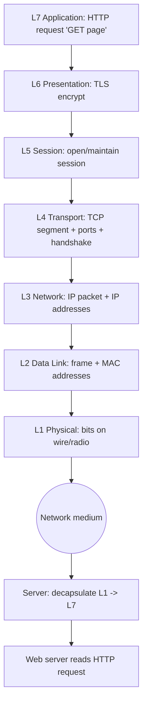

# Network Basics: OSI & TCP/IP Models

> What you'll learn: how data actually travels across a network, the two "maps" engineers use to describe that journey (OSI and TCP/IP), the core protocols involved, and how cyber attacks line up against each layer. Prerequisites: none — just basic comfort using a computer and a willingness to learn a few new words.

| Course | Course code | Module | Level |
|--------|-------------|--------|-------|
| Ethical Hacking Foundation | SKL-CEF-705 | Module 06 — Network Basics: OSI & TCP/IP Models | Foundation |

---

## 1. In Plain English

Imagine you want to mail a birthday card to a friend in another city. You write the message, put it in an envelope, write the address, hand it to the post office, and the postal system figures out trucks, planes, and sorting centers to get it there. You don't need to know how the planes fly — each part of the system has one job and trusts the next part to do its job.

Computer networks work exactly the same way. When you load a website, your message ("please send me this page") gets wrapped in several "envelopes," each added by a different part of your computer. Each envelope handles one specific concern: one knows the website's address, another makes sure nothing gets lost, another deals with the physical wires or Wi-Fi signal. This idea of breaking a big job into stacked, single-purpose layers is the single most important concept in networking.

The **OSI model** and the **TCP/IP model** are two ways of describing those layers. Think of them as two maps of the same city — one drawn in great detail for teaching (OSI, 7 layers), the other drawn for everyday practical use (TCP/IP, 4 layers). They describe the same reality.

Why should a future ethical hacker care? Because almost every attack and every defense happens *at a specific layer*. A password-stealing trick targets a different layer than a Wi-Fi jamming attack. Once you can name the layer, you instantly understand what an attack touches, what tools apply, and how to defend it. Learning the layers is like a doctor learning anatomy — you can't treat what you can't locate.

---

## 2. Core Concepts

### What is a "model" and why layers?

A **network model** is a conceptual framework that splits the complex task of communication into smaller, ordered steps called **layers**. Each layer:

- Has one clear responsibility.
- Talks only to the layer directly above and below it.
- Adds its own piece of control information (called a **header**) to your data on the way out, and removes it on the way in.

This wrapping is called **encapsulation** — each layer puts the data from the layer above into its own "envelope." The reverse, unwrapping on arrival, is **decapsulation**.

### The OSI Model (7 layers)

**OSI** stands for **Open Systems Interconnection**, a standard created by the **ISO** (International Organization for Standardization). It is mostly a *teaching and troubleshooting* model — it isn't implemented exactly as-is, but everyone uses its vocabulary. It has 7 layers, numbered from the bottom (Layer 1) to the top (Layer 7).

| # | Layer | Job (in plain words) | Example things |
|---|-------|----------------------|----------------|
| 7 | Application | The layer the user/app interacts with | HTTP, DNS, SMTP |
| 6 | Presentation | Translates/encrypts/compresses data formats | TLS encryption, JPEG, ASCII |
| 5 | Session | Starts, manages, ends conversations | Login sessions, RPC |
| 4 | Transport | Reliable (or fast) end-to-end delivery | TCP, UDP, port numbers |
| 3 | Network | Logical addressing and routing between networks | IP, routers, ICMP |
| 2 | Data Link | Delivery on the local link; physical addressing | MAC addresses, switches, ARP |
| 1 | Physical | The actual signals on wire/fiber/radio | Cables, Wi-Fi radio, voltage |

A classic memory aid (top to bottom): **A**ll **P**eople **S**eem **T**o **N**eed **D**ata **P**rocessing.

A unit of data has different names at different layers (this matters when reading tools):

- Application/Presentation/Session: **data**
- Transport: **segment** (TCP) or **datagram** (UDP)
- Network: **packet**
- Data Link: **frame**
- Physical: **bits**

### The TCP/IP Model (basics)

The **TCP/IP model** (named after its two most famous protocols, **TCP** and **IP**) is the model the real internet actually runs on. It is more practical and collapses OSI's seven layers into four:

| TCP/IP Layer | Maps to OSI layers | Examples |
|--------------|--------------------|----------|
| Application | 7, 6, 5 | HTTP, DNS, FTP, SMTP, TLS |
| Transport | 4 | TCP, UDP |
| Internet | 3 | IP, ICMP, ARP* |
| Network Access (Link) | 2, 1 | Ethernet, Wi-Fi, MAC |

\*ARP is sometimes placed at the Link layer; categorizations vary slightly by textbook — this is normal.

### Comparison of OSI and TCP/IP

| Aspect | OSI | TCP/IP |
|--------|-----|--------|
| Layers | 7 | 4 |
| Origin | ISO standard, theoretical | Built from real internet protocols |
| Main use | Teaching, troubleshooting | Actual implementation |
| Top layers | Splits App/Presentation/Session | Combines into one "Application" |
| Bottom layers | Splits Data Link/Physical | Combines into "Network Access" |
| Adoption | Reference vocabulary | Universally deployed |

Both describe the same journey; OSI is the detailed diagram, TCP/IP is the working machine.

### TCP/IP protocol suite overview

A **protocol** is simply an agreed-upon set of rules for communication — like agreeing to say "hello" before talking. The TCP/IP "suite" is the family of protocols that make the internet work:

- **IP (Internet Protocol):** assigns addresses (e.g., `192.168.1.10`) and routes packets between networks. It is *connectionless* and *unreliable* on its own — it sends packets and hopes for the best.
- **TCP (Transmission Control Protocol):** rides on top of IP to add reliability — ordering, retransmission of lost data, and a "handshake" to set up a connection.
- **UDP (User Datagram Protocol):** the fast, no-frills alternative to TCP — no handshake, no guarantee of delivery.
- **ICMP (Internet Control Message Protocol):** sends diagnostic/error messages (used by `ping`).
- **ARP (Address Resolution Protocol):** maps an IP address to a physical MAC address on the local network.
- **DNS (Domain Name System):** translates names like `example.com` into IP addresses — the internet's phone book.
- **HTTP/HTTPS, SMTP, FTP, SSH:** application-layer protocols for web, email, file transfer, and remote login.

### TCP vs UDP vs IP

These three confuse beginners the most, so let's be precise.

- **IP** is the *addressing and delivery truck*. It moves packets but makes no promises.
- **TCP** and **UDP** both sit on top of IP at the Transport layer; they decide *how reliably* the truck's cargo is handled.

| Feature | TCP | UDP | IP |
|---------|-----|-----|-----|
| Layer | Transport (4) | Transport (4) | Network/Internet (3) |
| Connection | Connection-oriented (handshake) | Connectionless | Connectionless |
| Reliability | Guaranteed, ordered, retransmits | Best-effort, no guarantee | Best-effort |
| Speed/overhead | Slower, more overhead | Fast, low overhead | n/a (carrier) |
| Uses ports | Yes | Yes | No |
| Typical uses | Web, email, file transfer | Streaming, DNS, VoIP, games | Underlies both |

**Ports** are numbered "doors" (0–65535) that let one computer run many services at once — e.g., web on port 443, email on port 25. TCP and UDP both use ports; IP does not.

### How cyber attacks map to each OSI layer

Every attack has a "home layer." This table is the heart of why hackers learn OSI:

| Layer | Example attacks | Why |
|-------|-----------------|-----|
| 7 Application | SQL injection, XSS, phishing, malware | Exploits flaws in apps/users |
| 6 Presentation | SSL/TLS downgrade, weak-cipher attacks | Targets encryption/format handling |
| 5 Session | Session hijacking, session fixation | Steals/abuses logged-in sessions |
| 4 Transport | SYN flood, port scanning | Abuses TCP/UDP handshakes & ports |
| 3 Network | IP spoofing, ICMP floods, routing attacks | Forges addresses, abuses routing |
| 2 Data Link | ARP spoofing, MAC flooding, VLAN hopping | Abuses local switching/addressing |
| 1 Physical | Cable tapping, Wi-Fi jamming, hardware theft | Attacks the medium itself |

---

## 3. How It Works (Step by Step)

Let's follow a single, concrete journey: **you type `https://example.com` and press Enter.** We'll see encapsulation in action and note where an attacker might interfere.

1. **Application (L7):** Your browser forms an HTTP request: "GET the homepage." DNS first resolves `example.com` to an IP like `93.184.x.x`. *(Attack surface: DNS spoofing, phishing.)*
2. **Presentation (L6):** TLS encrypts the request so eavesdroppers can't read it. *(Attack surface: TLS downgrade.)*
3. **Session (L5):** A session is established/maintained so the server remembers you. *(Attack surface: session hijacking.)*
4. **Transport (L4):** TCP breaks data into **segments**, adds source/destination **ports** (443 for HTTPS), and begins the **three-way handshake** (SYN → SYN-ACK → ACK). *(Attack surface: SYN flood, port scan.)*
5. **Network (L3):** IP wraps each segment into a **packet** with source and destination IP addresses, and routers forward it hop by hop. *(Attack surface: IP spoofing.)*
6. **Data Link (L2):** Each packet becomes a **frame** with MAC addresses for the next local hop; ARP finds the right MAC. *(Attack surface: ARP spoofing.)*
7. **Physical (L1):** The frame becomes **bits** — electrical, light, or radio signals on the medium. *(Attack surface: cable tap, jamming.)*

On arrival, the server reverses every step (decapsulation): bits → frame → packet → segment → data, peeling off one header per layer until the web server reads your plain HTTP request.



Each downward step *adds* an envelope (header); each upward step on the far side *removes* one. That single idea explains nearly all of networking.

---

## 4. Real-World Examples

**1. The Dyn DNS DDoS (2016) — a Transport/Network-layer flood with Application impact.** A botnet called Mirai, made of hijacked internet-connected cameras and routers, flooded the DNS provider Dyn with traffic. Because DNS (which relies heavily on UDP at the Transport layer) was overwhelmed, major sites like Twitter and Spotify became unreachable for many users. This shows how an attack low in the stack (flooding) can knock out high-level services everyone depends on.

**2. ARP spoofing on public Wi-Fi — a Data Link (L2) attack.** On an open café network, an attacker can send forged ARP messages claiming "I am the router." Other devices then send their traffic through the attacker's machine (a "man-in-the-middle" position). This is a textbook Layer 2 attack and a major reason HTTPS (encryption at higher layers) matters even on untrusted networks.

**3. SYN flood denial-of-service — a Transport (L4) attack.** An attacker sends many TCP "SYN" packets (the first step of the handshake) but never completes the handshake. The server holds half-open connections until its resources run out and legitimate users can't connect. This is a direct abuse of how TCP's three-way handshake works.

---

## 5. Tools of the Trade

These tools let you *observe* the layers in action. All examples are read-only or run against your own machine.

### ping (ICMP, Layer 3)
Checks whether a host is reachable and measures round-trip time.

```bash
ping -c 4 127.0.0.1
```
`-c 4` sends exactly 4 packets to `127.0.0.1` (your own computer, the "loopback" address) instead of pinging forever. You'll see reply times in milliseconds.

### traceroute / tracert (Layer 3)
Shows each router (hop) a packet passes through.

```bash
traceroute 8.8.8.8
```
This lists the path your packets take toward Google's public DNS server, one router per line. On Windows the command is `tracert`.

### Wireshark / tshark (Layers 2–7)
A packet analyzer that lets you *see* frames, packets, and segments and the headers each layer adds.

```bash
tshark -i lo -c 5
```
`-i lo` captures on the loopback interface (your own machine), `-c 5` stops after 5 packets so you aren't overwhelmed. Each captured line shows protocol details across layers.

### netstat / ss (Layer 4)
Lists open ports and active connections on your machine.

```bash
ss -tuln
```
`-t` TCP, `-u` UDP, `-l` listening sockets only, `-n` show numeric ports (don't translate to names). Output reveals which services are listening and on which ports.

---

## 6. Hands-On Lab (Authorized / Lab-Only)

> Reminder: perform these steps only on systems you own or are explicitly authorized to test — here, your own computer.

This is your very first lab, so we'll keep it gentle and completely safe. You will not attack anything. You'll simply *watch* a single packet travel and confirm a tool is working. Take a breath — nothing here can harm your machine.

**Goal:** use `ping` to send a few packets to your own computer and understand the output.

**Step 1 — Open a terminal.**
- macOS/Linux: open the "Terminal" app.
- Windows: open "Command Prompt" or "PowerShell."

**Step 2 — Run one safe command.**

```bash
ping -c 4 127.0.0.1
```

- `ping` is the tool (it uses ICMP at Layer 3).
- `-c 4` means "send 4 packets, then stop." (On Windows, use `ping -n 4 127.0.0.1` instead — `-n` is the Windows equivalent.)
- `127.0.0.1` is the **loopback address** — it means "this very computer." You are pinging *yourself*, so no traffic leaves your machine. This is the safest possible target.

**Step 3 — Read the output.** You'll see lines like:

```
64 bytes from 127.0.0.1: icmp_seq=0 ttl=64 time=0.045 ms
```

- `64 bytes` = size of the reply packet.
- `icmp_seq=0` = packet number (0,1,2,3).
- `ttl=64` = "time to live," a counter that prevents packets looping forever.
- `time=0.045 ms` = round-trip time. Pinging yourself is almost instant.

At the end you'll see a summary like "4 packets transmitted, 4 received, 0% packet loss." That `0% packet loss` means every packet made the round trip — success!

**If you want a slightly bigger (still safe) target:** install **Metasploitable**, a deliberately vulnerable practice VM, inside virtualization software (like VirtualBox) on an isolated, host-only network. It exists specifically so beginners can practice without touching real systems. For this first lab, though, pinging `127.0.0.1` is more than enough. Well done — you've just observed Layer 3 in action.

---

## 7. Countermeasures & Defenses

Grouped by layer, here's how the blue team (defenders) protect each part of the stack.

**Application (L7)**
- Validate and sanitize all user input (stops SQL injection, XSS).
- Use a Web Application Firewall (WAF).
- Train users against phishing.

**Presentation / Session (L6/L5)**
- Enforce strong, modern TLS; disable old/weak ciphers and protocols.
- Use secure, random session tokens; expire and rotate them; bind sessions to HTTPS.

**Transport (L4)**
- Enable SYN cookies and rate limiting to blunt SYN floods.
- Close unused ports; firewall the rest.

**Network (L3)**
- Filter spoofed source addresses at the edge (ingress/egress filtering).
- Use DDoS mitigation/scrubbing services for floods.

**Data Link (L2)**
- Enable Dynamic ARP Inspection and port security on switches.
- Segment networks with VLANs; restrict trunk ports.

**Physical (L1)**
- Lock server rooms and cabinets; control physical access.
- Use tamper-evident cabling and shielded/secured wireless.

**Cross-cutting (all layers)**
- Defense in depth: assume any single layer can fail.
- Continuous monitoring and intrusion detection (IDS/IPS).
- Keep software patched; log and review traffic; apply least privilege.

---

## 8. Key Terms

- **Protocol** — an agreed set of rules for how computers communicate.
- **OSI model** — a 7-layer reference model used to teach and troubleshoot networking.
- **TCP/IP model** — the practical 4-layer model the real internet runs on.
- **Encapsulation** — wrapping data with a header at each layer on the way out.
- **Header** — control information one layer adds to the data.
- **Packet / Frame / Segment** — names for data units at the Network, Data Link, and Transport layers.
- **TCP** — reliable, connection-oriented Transport protocol (handshake, retransmission).
- **UDP** — fast, connectionless Transport protocol with no delivery guarantee.
- **IP** — Network-layer protocol that addresses and routes packets.
- **Port** — a numbered endpoint (0–65535) that lets one host run many services.
- **MAC address** — a hardware address used at the Data Link layer for local delivery.
- **ARP** — protocol that maps an IP address to a MAC address on a local network.
- **DNS** — the system that translates domain names into IP addresses.
- **Three-way handshake** — TCP's SYN → SYN-ACK → ACK sequence that opens a connection.
- **Loopback (127.0.0.1)** — an address meaning "this same computer."

---

## 9. Summary & Takeaways

- Networking works by stacking single-purpose **layers**; each adds and removes its own envelope (encapsulation/decapsulation).
- The **OSI model** has 7 layers (great for teaching); the **TCP/IP model** has 4 (what the internet actually uses). They describe the same journey.
- **IP** addresses and routes; **TCP** adds reliability with a handshake; **UDP** trades reliability for speed.
- **Ports** let one machine run many services at once; TCP and UDP use them, IP does not.
- Nearly every attack has a "home layer" — naming the layer tells you the attack's target, the right tools, and the right defense.
- Tools like `ping`, `traceroute`, `Wireshark`, and `ss` let you *see* the layers in action — start by observing on your own machine.
- Defense in depth means protecting every layer, because any single layer can fail.
- Always practice offensive techniques only on systems you own or are authorized to test.

**Further reading:** the OSI reference model standard (ISO/IEC 7498-1); NIST SP 800-series networking guidance; OWASP Top 10 (application-layer threats); MITRE ATT&CK Enterprise matrix (mapping techniques to tactics).
