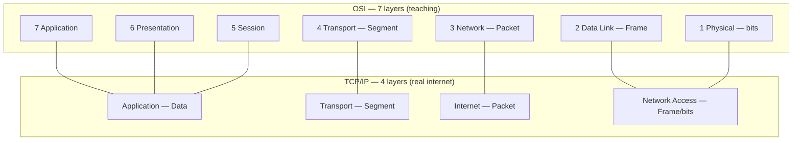
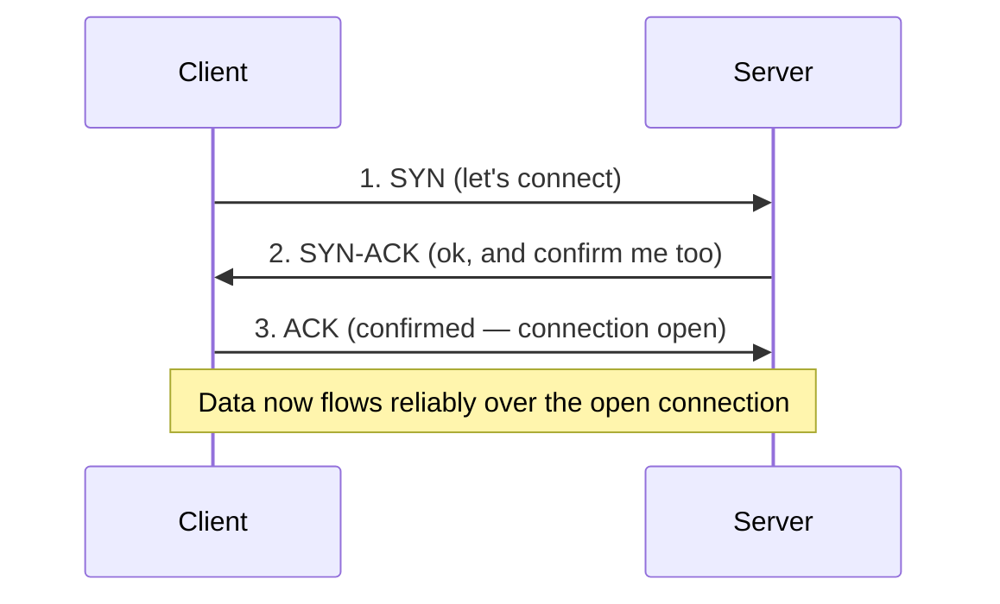
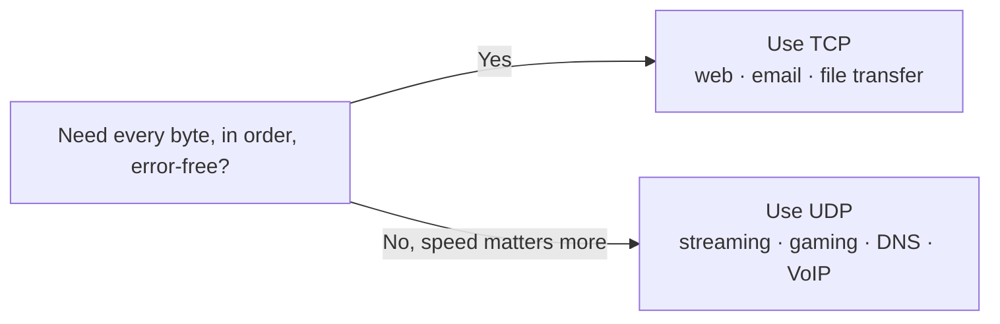
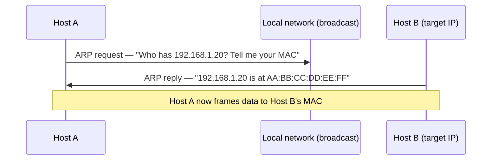
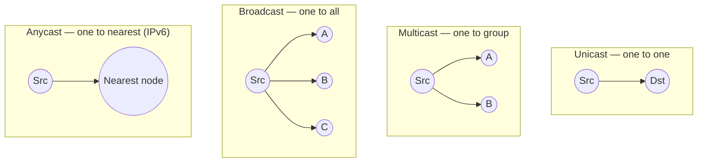
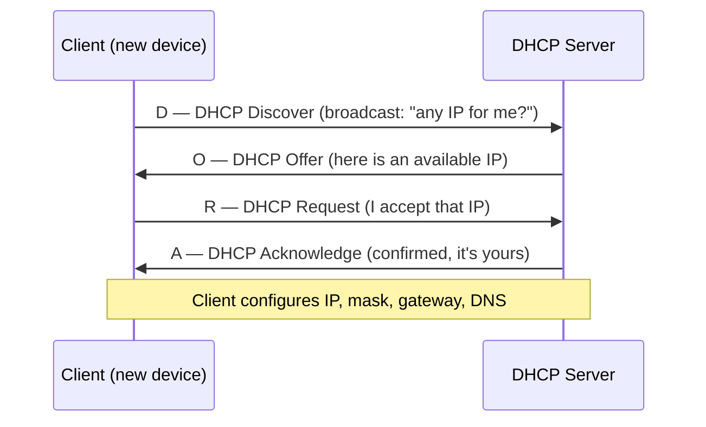
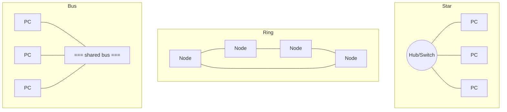
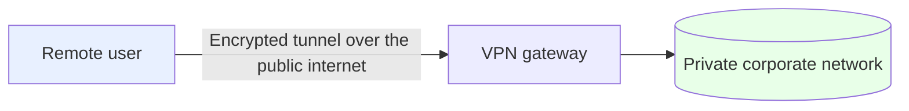
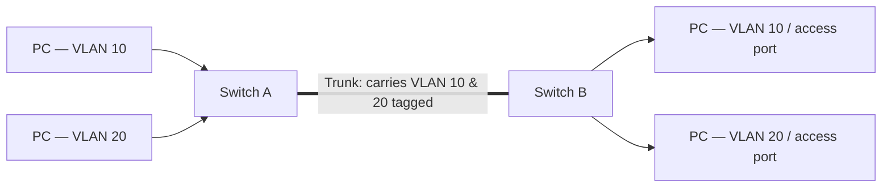
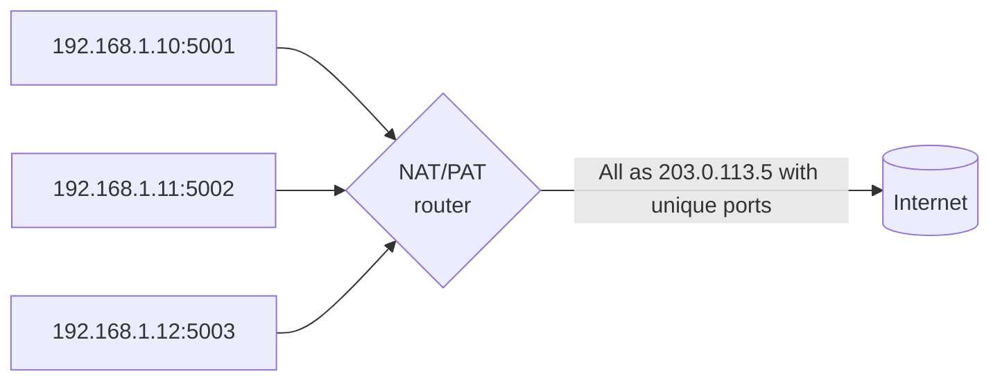

# Networking Basics — Deep Reference 🌐

> **What you'll learn:** the complete networking foundation every cyber-security
> learner needs — the OSI & TCP/IP models, TCP vs UDP and the three-way
> handshake, DNS/PING/ARP, performance metrics, routing, DHCP, IPv4 vs IPv6, IP
> address classes, switching vs routing, error detection, network topologies,
> VLANs, VPNs, firewalls, ports, NAT, and Telnet vs SSH. **Prerequisites:** none
> — just basic comfort using a computer.

| Course | Course code | Type | Level |
|--------|-------------|------|-------|
| Ethical Hacking Foundation | SKL-CEF-705 | Companion reference (Networking Basics) | Foundation |

> 📎 **How this fits:** This is a **deep companion reference** to
> [`module-06-network-basics-osi-and-tcp-models`](module-06-network-basics-osi-and-tcp-models.md).
> Module 06 teaches the OSI/TCP-IP story end-to-end; this file is the **wider,
> question-by-question networking handbook** — keep it open while studying for
> interviews, labs, and exams. Definitions are preserved exactly as taught;
> diagrams, tables, and explanations are added around them.

---

## Table of Contents

1. [OSI Layers & TCP/IP](#1-osi-layers--tcpip-)
2. [The TCP/IP Model](#2-the-tcpip-model-)
3. [TCP vs UDP & the Three-Way Handshake](#3-tcp-vs-udp--the-three-way-handshake-)
4. [Why TCP is Reliable & UDP is Not](#4-why-tcp-is-reliable--why-udp-is-not-)
5. [DNS, PING, ARP & Performance Metrics](#5-dns-ping-arp--network-performance-metrics-)
6. [Routing, Ports, RTT, Cast Types & MAC](#6-routing-ports-rtt-cast-types--mac-format-)
7. [DHCP & the DORA Process](#7-dhcp--the-dora-process-)
8. [IPv4 vs IPv6](#8-ipv4-vs-ipv6-)
9. [IPv6 Advantages & IP Address Classes](#9-ipv6-advantages--ip-address-classes-)
10. [APIPA, Switching, Hubs, Errors & CRC](#10-apipa-switching-hubs-errors--crc-)
11. [Network Topologies](#11-network-topologies-)
12. [VLAN & VPN](#12-vlan--vpn-)
13. [Firewall, Access & Trunk Ports](#13-firewall-access--trunk-ports-)
14. [NAT, Telnet & SSH](#14-nat-telnet--ssh-)
15. [Key Terms](#15-key-terms-) · [Summary](#16-summary--takeaways-)

---

## 1. OSI Layers & TCP/IP 📚

### What is OSI Layers and TCP/IP?

> **The OSI (Open Systems Interconnection) model, created by ISO, is a
> conceptual framework used to understand and standardize network communication
> between different systems. It breaks down communication into seven layers,
> each with a specific function.**

Think of the seven layers as an assembly line: each station does **one job**,
hands the work to the next, and trusts every other station to do its own. The
table below is the heart of the model — read it top (Layer 7, closest to you)
to bottom (Layer 1, the physical wire).

> 🖼️ *Suggested image: a labeled 7-layer OSI stack — Physical at the bottom, Application at the top.*

| # | Layer | Purpose | Key Functions | Key Protocols / Examples |
|---|-------|---------|---------------|--------------------------|
| 7 | 🖥️ **Application** | Provides services for applications to access network services and interact with the network | Network services to applications | HTTP, FTP, Telnet, SMTP |
| 6 | 🔐 **Presentation** | Prepares data for the application layer, handling tasks like data translation, encryption, and compression | Data formatting, encryption/decryption, and compression | JPEG, GIF, MPEG, ASCII |
| 5 | 🤝 **Session** | Establishes, manages, and terminates sessions between two communicating devices | Session setup, session maintenance, and session termination | A remote desktop connection |
| 4 | 🚚 **Transport** | Provides reliable or unreliable data transmission through segmentation, flow control, and error correction | Segmentation, flow control, and error correction | TCP (reliable, connection-oriented) and UDP (unreliable, connectionless) |
| 3 | 🗺️ **Network** | Handles logical addressing (IP addressing) and routing of data packets from source to destination across multiple networks | Path determination, logical addressing, routing | IP, ARP, ICMP, RIP |
| 2 | 🔗 **Data Link** | Handles node-to-node data transfer, error detection, and physical addressing using MAC addresses | Framing, error detection, and MAC addressing | Ethernet, PPP |
| 1 | 📡 **Physical** | Manages the physical connection between devices, converting data into electrical or optical signals for transmission | Transmission of bits over physical media (cables, fiber optics, wireless) | Cables (COAX, fiber), hubs, repeaters |

> 💡 **Memory aid (Layer 7 → 1):** **A**ll **P**eople **S**eem **T**o **N**eed **D**ata **P**rocessing.

> 🔑 **Why this matters for security:** almost every attack and defense lives at
> a *specific layer*. Name the layer and you instantly know what an attack
> touches, which tools apply, and how to defend it. (See Module 06 for the full
> attack-by-layer map.)

---

## 2. The TCP/IP Model 🧱

### TCP/IP Model

> **The TCP/IP model is a simplified framework used in modern networking,
> consisting of four layers. It is closely related to the OSI model but is more
> practical for real-world implementation.**

| TCP/IP Layer | Combines OSI layers | Key Functions | Key Protocols |
|--------------|---------------------|---------------|---------------|
| **1. Application Layer** | Combines the OSI Application, Presentation, and Session layers | Application-level services | HTTP, FTP, DNS, SMTP |
| **2. Transport Layer** | Corresponds to the OSI Transport Layer | End-to-end data delivery, flow control, error correction | TCP (reliable) and UDP (unreliable) |
| **3. Internet Layer** | Corresponds to the OSI Network Layer | Routing, logical addressing, packet forwarding | IP, ARP, ICMP |
| **4. Network Access Layer** | Combines the OSI Data Link and Physical Layers | Physical transmission of data, error detection, and MAC addressing | Ethernet, etc. |

### OSI ↔ TCP/IP mapping (with data unit at each layer)

> **Summary:** *The OSI Model: 7 layers, each governing specific functions for
> network communication. The TCP/IP Model: 4 layers, more practical for
> real-world applications, focusing on core networking functions.*

| TCP/IP | OSI layers it covers | Data name at every layer |
|--------|----------------------|--------------------------|
| **Application Layer** | Application · Presentation · Session | "Data" |
| **Transport Layer** | Transport | "Segment" |
| **Internet Layer** | Network | "Packet" |
| **Network Access Layer** | Data Link · Physical | "Frame" (Data Link) → "bit" (Physical) |



> 💡 **Remember the data units descending the stack:** **Data → Segment → Packet → Frame → bits.** Tool output (Wireshark, etc.) uses exactly these names.

---

## 3. TCP vs UDP & the Three-Way Handshake 🤝

### Differences between TCP and UDP

> **Both TCP (Transmission Control Protocol) and UDP (User Datagram Protocol)
> operate at Layer 4 (Transport Layer) of the TCP/IP model and are responsible
> for the transportation of data. To simplify, think of this layer as cars
> carrying data. The key difference between TCP and UDP is how they ensure data
> reaches its destination.**

| Feature | **TCP** (Transmission Control Protocol) | **UDP** (User Datagram Protocol) |
|---------|------------------------------------------|----------------------------------|
| **Connection** | Connection-oriented (requires a stable connection) | Connectionless (no need for an established connection) |
| **Acknowledgement** | Provides acknowledgements (ensures data is received) | No acknowledgements (does not confirm data is received) |
| **Reliability** | Reliable communication (guarantees data is delivered in order and error-free) | Unreliable communication (no guarantee of data delivery or order) |
| **Protocol number** | 6 | 17 |
| **Used by** | Applications requiring reliable transmission, such as HTTP, FTP, and SMTP | Applications that prioritize speed over reliability, like DNS, DHCP, and TFTP |

### When to Use TCP or UDP

> **The decision to use TCP or UDP depends on the type of service and the
> network requirements:**
>
> - **TCP** is used when reliable delivery is essential (e.g., web browsing, email).
> - **UDP** is chosen when speed is more critical than reliability (e.g., streaming, DNS lookups).

### Explain TCP Three-Way Handshake

> **The TCP Three-Way Handshake is a process used to establish a connection
> between a client and a server before any communication can begin.**
>
> 1. **SYN (Synchronize):** The client sends a SYN packet to the server to request a connection.
> 2. **SYN-ACK (Synchronize-Acknowledge):** The server responds with a SYN-ACK packet to acknowledge the client's request and signal readiness.
> 3. **ACK (Acknowledge):** The client sends an ACK packet back to the server, confirming the connection is established.
>
> **This handshake ensures both parties are synchronized before data transmission.**


*3-way handshake — SYN → SYN-ACK → ACK.*

> ⚠️ **Security note:** the handshake is also an attack surface. A **SYN flood**
> sends many SYN packets but never sends the final ACK, leaving the server
> holding half-open connections until it exhausts resources (a denial-of-service).

---

## 4. Why TCP is Reliable & Why UDP is Not ✅

### Why is TCP more Reliable?

> **TCP is considered more reliable due to the following mechanisms:**
>
> 1. **Acknowledgement:** Before data is sent, TCP ensures the receiver is ready and acknowledges the receipt of data.
> 2. **Sequencing:** Data is divided into segments, and each segment is numbered. This allows the receiver to detect missing data and request retransmission if needed.
> 3. **Checksum:** TCP calculates a checksum for each segment to detect any corruption during transmission. If the receiver's checksum matches the sender's, the data is considered successfully transmitted.
>
> **Disadvantage:** TCP is slower because of its need to establish a connection
> and its retransmission mechanism, but this tradeoff ensures data reliability.

### Why is UDP Unreliable?

> **UDP is unreliable because it does not confirm whether the data is received
> or if it is received correctly. It simply sends data without establishing a
> connection or waiting for acknowledgements.**
>
> **Advantage:** UDP is much faster than TCP because it skips the overhead of
> connection establishment and error-checking mechanisms. UDP is suitable for
> real-time applications where speed is more important than perfect accuracy,
> such as video streaming or online gaming.

### Conclusion

> - **TCP** is used when data integrity and order are critical, providing reliable, connection-oriented communication.
> - **UDP** is preferred for applications where speed is more important, offering fast but unreliable, connectionless communication.



> 🖼️ *Suggested image: side-by-side UDP vs TCP delivery — UDP firing packets without acknowledgement, TCP exchanging acknowledgements for each segment.*

---

## 5. DNS, PING, ARP & Network Performance Metrics 🔎

### What is DNS?

> **The Domain Name System (DNS) is a hierarchical and distributed naming system
> that translates human-readable domain names (like hotmail.com) into numerical
> IP addresses that computers use to identify each other on the network.** This
> process allows users to access websites using familiar names rather than
> complex IP addresses.

### What is PING?

> **PING is a network utility that uses the Internet Control Message Protocol
> (ICMP) to test the reachability of a host on an IP network.** It sends an
> echo-request packet to the target host and waits for an echo reply, measuring
> the time it takes for the round trip. This helps determine the latency and
> availability of the host.

### What is Address Resolution Protocol (ARP)?

> **The (ARP) is used to map a network's device's IP address to its physical MAC
> address. When a device wants to communicate with another device on the same
> local network, it uses ARP to find the device's MAC address, which is
> essential for data transmission at the Data Link layer.**



### Network Performance Metrics

> **Understanding the following metrics is crucial for evaluating network
> performance:**

| Metric | Definition (as taught) |
|--------|------------------------|
| **Bandwidth** | The maximum rate at which data can be transferred over a network link, typically measured in bits per second (bps). It represents the capacity of the connection. |
| **Delay (Latency)** | The time taken for a signal to travel from the source to the destination across a network. High latency can result in slow network responses. |
| **Reliability** | The consistency and dependability of a network path, indicating the likelihood of successful data transmission without errors. |
| **Load** | The amount of data being carried by a network path at any given time. High load can lead to congestion and increased latency. |
| **MTU (Maximum Transmission Unit)** | The largest size of a packet that can be transmitted over a network medium. Understanding MTU is important for optimizing data transfer and avoiding fragmentation. |
| **Bandwidth-Delay product** | Refers to the amount of data that can be transferred over a network connection in a given period. Higher bandwidth allows more data to be transmitted, enabling faster downloads and uploads. |
| **Latency** | Refers to the time taken for data to travel from the source to the destination. Lower latency indicates faster transmission. Factors affecting latency include network congestion, physical distance, and the type of transmission medium. |

---

## 6. Routing, Ports, RTT, Cast Types & MAC Format 🧭

### What is Routing?

> **Routing is the process of determining the best path to forward packets
> between networks that are not locally attached. It involves making decisions on
> how to forward packets toward their destination based on routing tables and
> network topology.**

### What is a Router?

> **A router is a Layer 3 (Network Layer) device that forwards data packets
> between different logical networks. It enables communication between two or
> more networks and determines the best path for data transmission based on the
> destination IP address.**

> **A protocol is a set of rules and procedures that define how data is
> transmitted and received across a network. It governs communication between
> devices, ensuring proper data exchange. Examples include TCP, UDP, HTTP, and ICMP.**

### What is a Port? — Physical vs Logical

> **Port:** *can refer to:*
>
> - **Physical Port:** The physical interface on a network device (e.g., Ethernet port).
> - **Logical Port:** A software-defined endpoint used to identify specific services or applications in a device (e.g., port 80 for HTTP, port 443 for HTTPS).

### What is Round Trip Time (RTT)?

> **RTT is the time it takes for a packet to travel from the source to the
> destination and back. It is a key metric to measure network performance and
> latency.**

### Unicasting, Anycasting, Multicasting, and Broadcasting

> - **Unicasting:** One-to-one communication, where data is sent from a source to a single recipient.
> - **Anycasting:** One-to-nearest communication, where data is sent to the nearest node in a group (supported only in IPv6).
> - **Multicasting:** One-to-many communication, where data is sent to a specific group of devices.
> - **Broadcasting:** One-to-all communication, where data is sent to all devices in the network (e.g., DHCP requests).



### What is the MAC Format?

> **A MAC (Media Access Control) address is a unique physical address assigned to
> a network device. It is 48 bits (6 bytes) in length and is usually written in
> hexadecimal format (e.g., 00:1A:2B:3C:4D:5E).**
>
> - The first 3 bytes (24 bits) represent the manufacturer's ID (assigned by an internet standards body).
> - The last 3 bytes (24 bits) are assigned by the manufacturer.

```
 00:1A:2B : 3C:4D:5E
 └──┬───┘   └──┬───┘
   OUI         NIC-specific
 (24 bits,     (24 bits,
  vendor ID)    device ID)
```

---

## 7. DHCP & the DORA Process 🪪

### What is DHCP? (Dynamic Host Configuration Protocol)

> **DHCP stands for Dynamic Host Configuration Protocol, and it is used to
> automatically assign IP addresses and other network configuration settings
> (such as subnet masks, gateways, and DNS servers) to client devices on a
> network. This helps avoid the need for manual configuration and reduces the
> risk of human errors, such as duplicate IP addresses or incorrect addresses.**

### What is the Role of a DHCP Server?

> **The DHCP Server plays a crucial role in automating the process of assigning
> IP addresses to devices (clients) on a network. Instead of manually configuring
> each device, the DHCP server handles this process automatically, saving time
> and preventing configuration errors. It ensures that each device gets a unique
> IP address and other necessary configuration settings.**

### DORA Process

> 1. **Discover:** The client device, when connecting to the network, broadcasts a **DHCP Discover** message. This message is sent to all DHCP servers on the network, searching for available IP addresses.
> 2. **Offer:** The DHCP server responds with a **DHCP Offer** message, offering an available IP address to the client. This message is sent directly (unicast) to the client that requested the IP.
> 3. **Request:** The client, upon receiving an offer, sends a **DHCP Request** message to the server to formally accept the offered IP address.
> 4. **Acknowledge:** Finally, the DHCP server responds with a **DHCP Acknowledge** message, confirming that the IP address has been assigned to the client. At this point, the client can start using the assigned IP address to communicate on the network.



### Why Use DHCP?

> - **Automation:** Reduces the need for manual IP address assignment.
> - **Error Prevention:** Avoids human errors such as duplicate IP addresses.
> - **Time-Saving:** Provides faster network setup, especially in large environments.
> - **Central Management:** Allows IT teams to manage IP addresses from a central point.

---

## 8. IPv4 vs IPv6 🔢

### What is version of IP? IPv4 & IPv6

| Feature | **IPv4** | **IPv6** |
|---------|----------|----------|
| **Address Length** | 32 bits (4 octets) | 128 bits (8 octets) |
| **Address Format** | Decimal, separated by dots (e.g., 192.168.0.1) | Hexadecimal, separated by colons (e.g., 2001:0db8:85a3::8a2e:0370:7334) |
| **Number of Addresses** | About 4.3 billion | 2¹²⁸ (≈ 340 undecillion addresses) |
| **NAT (Network Address Translation)** | Requires NAT for expanding address space | NAT not needed due to the vast address space |
| **Security Features** | No built-in security (requires external solutions like IPsec) | Built-in security with mandatory IPsec support |
| **Configuration** | Manual or DHCP | Auto-configuration with stateless address auto-configuration (SLAAC) or DHCPv6 |
| **Header Complexity** | Complex header (options included) | Simplified header for faster routing |
| **Broadcast** | Supports broadcasting (sending to all devices) | No broadcast, but supports Anycast and Multicast |
| **Anycast** | Not supported | Supported |
| **Transition Mechanisms** | Not applicable to IPv6 | Dual-stack and tunneling methods are used to support IPv4 to IPv6 transitions |

### Key Advantages of IPv6 over IPv4

> 1. **Address Availability:** IPv6 offers a vastly larger address space compared to IPv4, which is limited to approximately 4.3 billion addresses. With IPv6, there are 2¹²⁸ (about 340 undecillion) unique addresses, ensuring there will be no shortage of IP addresses as more devices connect to the internet.
> 2. **128-bit Addressing:** IPv6 uses 128-bit addresses, while IPv4 uses 32-bit addresses. This expanded address length allows more devices to be connected globally without running out of addresses.
> 3. **No NAT (Network Address Translation):** IPv6 eliminates the need for NAT, a common technique used in IPv4 to extend the number of available addresses by allowing multiple devices to share a single public address.

---

## 9. IPv6 Advantages & IP Address Classes 🏷️

### More IPv6 advantages (continued)

> 4. **Built-in Security Features:** IPv6 comes with built-in support for IPsec (Internet Protocol Security), which provides authentication and encryption to ensure secure communication between devices.
> 5. **Simplified Header Structure:** IPv6 uses a simplified header compared to IPv4, making packet processing faster and more efficient. This reduces the load on routers and other network devices.
> 6. **Anycast Support:** IPv6 introduces Anycast, which allows data to be sent to the nearest node in a group of devices, improving efficiency in certain applications like content delivery networks.
> 7. **Transition Compatibility:** While IPv4 and IPv6 are not directly compatible, IPv6 provides various transition mechanisms (like dual-stack and tunneling) to enable co-existence and smooth transition between the two protocols.
> 8. **No Broadcast:** IPv6 does not support Broadcasting (a common method in IPv4 for sending data to all devices in a network). Instead, it uses Multicast (one-to-many) and Anycast (one-to-nearest) communication methods for more efficient data distribution.

### IP Address Classes

| Address Class | Network ID | Default Subnet Mask | # Networks | # Hosts |
|---------------|------------|---------------------|------------|---------|
| **Class A** | 1–126 (0.0.0.0) | 255.0.0.0 | 126 | 16,777,214 |
| **Class B** | 128–191 (10.0.0.0) | 255.255.0.0 | 16,384 | 65,534 |
| **Class C** | 192–223 (0.0.0.0) | 255.255.255.0 | 2,097,152 | 254 |

> *Class A Loopback Address: 127.0.0.0*

**Private IP Addresses (RFC 1918 ranges):**

```
Class A : 10.0.0.1 – 10.255.255.254
Class B : 172.16.0.1 – 172.31.255.254
Class C : 192.168.0.1 – 192.168.255.254
```

> 💡 **Reading the classes:** the leading octet identifies the class — Class A
> for very large networks (few networks, millions of hosts each), Class B for
> medium networks, and Class C for many small networks (254 hosts each).
> Classes D (multicast) and E (experimental) exist but aren't used for normal
> host addressing.

---

## 10. APIPA, Switching, Hubs, Errors & CRC 🔀

### What is APIPA (Automatic Private IP Addressing)?

> **APIPA assigns a device a temporary IP address in the 169.254.0.0/16 range
> (not 192.254.0.0), when it fails to receive an IP address from a DHCP server.
> This allows the device to communicate with other devices in the same local
> network with APIPA addresses, but it won't have internet access or external
> network communication.**

### What is Switch and Switching? Which Layer Does It Work?

> **Switching is the process that a switch performs to connect devices within
> the same network and manage how data is sent. Switches intelligently forward
> data based on MAC addresses, helping divide the network into smaller segments
> for better efficiency.**
>
> **A Switch operates at Layer 2 (Data Link Layer)** of the OSI model. It uses
> MAC addresses to forward data frames to the intended device, avoiding
> unnecessary broadcasts. It's more efficient than a hub because it reduces
> network congestion by sending data directly to the intended device.

### Can We Replace a Router with a Switch and Vice Versa?

> **No, you cannot replace a router with a switch because they work differently:**
>
> - A **Router** operates at Layer 3 (Network Layer), responsible for routing traffic between different networks and handling IP-based forwarding.
> - A **Switch** works at Layer 2 and forwards data within the same network based on MAC addresses.
>
> However, some **Layer 3 switches** can provide limited routing functions, but they still do not replace the full functionality of a router.

### Which Layer Does a Hub Work In?

> **A Hub operates at Layer 1 (Physical Layer) of the OSI model. It doesn't
> understand MAC or IP addresses; it simply broadcasts all data it receives to
> all connected devices, functioning like an electrical signal repeater.**

### What Are the Types of Errors?

> - **Single-Bit Error:** Only one bit in the data has changed.
> - **Burst Error:** Two or more consecutive bits in the data have changed.

### What is CRC?

> **CRC (Cyclic Redundancy Check) is a robust error detection technique based on
> binary division. A calculated remainder is appended to the data before
> transmission. The receiver performs the same calculation to detect any
> discrepancies, ensuring the data integrity. If the calculated value at the
> receiver matches, the data is deemed error-free.**

| Device | OSI Layer | Forwards based on | Behaviour |
|--------|-----------|-------------------|-----------|
| **Hub** | 1 — Physical | Nothing (repeats signal) | Broadcasts to **all** ports — collision-prone |
| **Switch** | 2 — Data Link | MAC address | Sends frame **only** to the intended port |
| **Router** | 3 — Network | IP address | Forwards packets **between different networks** |

---

## 11. Network Topologies 🕸️

> A **topology** is the physical or logical arrangement of devices and links in a
> network. Each layout trades off cost, fault-tolerance, and ease of management.

> 🖼️ *Suggested image: a chart of the six classic topologies — Bus, Star, Ring, Mesh, Tree, Hybrid.*

### 1. Bus Topology

> - All nodes are connected to a single central cable (the bus).
> - **Pros:** Simple and cost-effective for small networks.
> - **Cons:** If the central cable (bus) fails, the entire network is disrupted. Performance decreases as more devices are added.
> - **Use case:** Small networks or temporary setups.

### 2. Star Topology

> - All devices are connected to a central hub or switch.
> - **Pros:** Easy to manage and troubleshoot. A failure in one link doesn't affect others, as they connect independently to the central node.
> - **Cons:** If the central hub fails, the entire network goes down.
> - **Use case:** Commonly used in homes, offices, and enterprise networks.

### 3. Ring Topology

> - Each node is connected to exactly two other nodes, forming a circular (ring) structure.
> - **Pros:** Simple data flow in one direction reduces the chances of collisions.
> - **Cons:** If any single node or connection fails, the entire network can be disrupted. Requires additional mechanisms for fault tolerance.
> - **Use case:** Often uses token ring networks, though less common now due to its complexity and maintenance challenges.

### 4. Mesh Topology

> - Every node is connected to one or more other nodes, providing multiple paths for data to travel.
> - **Pros:** Highly robust and fault-tolerant. If one link fails, the network can still function through alternate paths.
> - **Cons:** Expensive and complex to install and maintain due to the number of connections required.
> - **Use case:** In critical systems where high redundancy is needed, like military networks and data centers.

### 5. Tree Topology

> - A combination of star and bus topologies. Smaller star networks are connected via a central bus.
> - **Pros:** Scalable and easy to manage. Faults in star nodes do not affect the entire network.
> - **Cons:** If the main bus fails, all connected segments are impacted.
> - **Use case:** Large networks requiring hierarchical structuring, such as in schools or university campuses.

### 6. Hybrid Topology

> - Combines multiple topologies (e.g., star-bus or star-ring) to create a more flexible and scalable network.
> - **Pros:** Can be customized to suit specific network needs, utilizing the strengths of various topologies while avoiding their weaknesses.
> - **Cons:** Can be complex and expensive to design, implement, and maintain.
> - **Use case:** Large networks that need to meet diverse requirements, like corporate and industrial networks.



| Topology | Cost | Fault tolerance | Best for |
|----------|------|-----------------|----------|
| Bus | Low | Low (bus = single point of failure) | Small / temporary setups |
| Star | Medium | Good (hub = single point of failure) | Homes, offices, enterprises |
| Ring | Medium | Low (one break disrupts ring) | Legacy token-ring networks |
| Mesh | High | Excellent (multiple paths) | Critical systems, data centers, military |
| Tree | Medium | Good (bus = weak point) | Hierarchical campuses/schools |
| Hybrid | High | Customizable | Large mixed corporate/industrial networks |

---

## 12. VLAN & VPN 🛡️

### What is a VLAN and How does it work / why is it used?

> **A VLAN improves security by isolating sensitive data and devices, enhances
> scalability by logically grouping devices regardless of their physical
> location, and improves traffic management by reducing broadcast traffic to
> specific VLANs.** VLANs are applied on switches by assigning names or numbers
> to VLANs and then associating specific ports with them.
>
> **Advantages:**
>
> - **Performance Enhancement:** Reduces unnecessary traffic by limiting broadcasts within specific VLANs, improving network efficiency.
> - **Security:** Devices in different VLANs cannot communicate directly, isolating sensitive data.
> - **Organization:** Helps logically structure the network into manageable segments.
>
> **Notes:** To enable communication between VLANs, a Layer 3 switch or router is
> used to apply inter-VLAN routing.

### What is a VLAN and How does it reduce broadcast traffic?

> **A VLAN reduces broadcast traffic by dividing the network into smaller
> broadcast domains. A VLAN can broadcast to each other, but that traffic doesn't
> reach other VLANs, minimizing unnecessary traffic across the network.**

### What is VPN (Virtual Private Network)?

> **A VPN extends a private network over a public network (like the internet),
> allowing secure communication between devices through a virtual tunnel. VPNs
> use:**
>
> - **Encryption** to protect data in transit.
> - **Authentication** to verify identities.
> - **Tunneling protocols** to securely transport data.
>
> **VPNs are often used to establish secure remote access to private networks.**
>
> **Advantages:**
>
> 1. **Scalability:** Can accommodate large networks over the internet.
> 2. **Low Cost:** Eliminates the need for dedicated leased lines for secure communication.
> 3. **Security:** Ensures confidentiality, integrity, and authentication through encryption and tunneling.



---

## 13. Firewall, Access & Trunk Ports 🔥

### VPN vs VLAN (summary)

| | **VPN — Virtual Private Network** | **VLAN — Virtual Local Area Network** |
|---|------------------------------------|----------------------------------------|
| **What it is** | A virtual private tunnel between source and destination over a public network (internet) | Logical segmentation of a physical network into multiple virtual local area networks |
| **Used for** | Secure communication over untrusted networks (like the internet) | Used to reduce broadcast traffic and increase security within local networks |
| **Main advantages** | Scalability, low cost, security | Better security, easy network management, reduced traffic |

### What is a Firewall?

> **A Firewall is a network security device that filters traffic between trusted
> (internal) and untrusted (external) networks. It permits or denies traffic
> based on predefined security rules and policies. Firewalls help protect
> networks from unauthorized access, external attacks, and malware.**
>
> **Functions of a Firewall:**
>
> 1. **Traffic Filtering:** Only allows legitimate traffic based on configured policies.
> 2. **Network Segmentation:** Can isolate certain parts of the network (e.g., management network from the user network).
> 3. **Protection:** Shields the internal network from external threats.

> **Example:** A firewall can be configured to block unauthorized access from the
> internet while allowing trusted services like web browsing or email.

### What is an Access Port?

> **An Access Port is a type of port on a switch that belongs to and carries
> traffic for only one VLAN. Devices connected to an access port are unaware of
> VLAN configurations because the switch removes VLAN tagging before forwarding
> the frame to the device. Key points:**
>
> - **Assigned to one VLAN:** Only carries traffic for a specific VLAN.
> - **Device unaware of VLAN:** Any device connected to an access port does not recognize the VLAN membership.
> - **No inter-VLAN communication:** Devices on different VLANs cannot communicate unless routing is involved between them across VLANs.

### What is a Trunk Port?

> **A Trunk Port is a port configured on a switch to carry traffic for multiple
> VLANs simultaneously, ranging from 1 to 4094 VLANs. Trunk ports are commonly
> used to connect switches or routers, allowing VLAN information to travel across
> the network. Key points:**
>
> - **Carries traffic for multiple VLANs.**
> - **Tagged and untagged traffic:** Supports both tagged VLAN frames and untagged (native VLAN) frames.
> - **Inter-switch communication:** Used to connect switches to other switches or routers.


*Access ports carry one untagged VLAN to end devices; the trunk carries many tagged VLANs between switches.*

---

## 14. NAT, Telnet & SSH 🔁

### What is NAT (Network Address Translation)?

> **NAT (Network Address Translation) is the process that allows devices in a
> private network to access externally addressable resources (e.g., the internet)
> by converting private IP addresses to public IP addresses (and vice versa). NAT
> provides a layer of security by masking internal IP addresses.**
>
> **Types of NAT:**
>
> 1. **Static NAT:** Maps one private IP address to one public IP address.
> 2. **Dynamic NAT:** Maps one private IP address to a pool of public IP addresses.
> 3. **PAT (Port Address Translation):** Maps multiple private IP addresses to a single public IP address by using different ports (also called **NAT overload**).

### What is PAT (Port Address Translation)?

> **PAT (Port Address Translation) is a type of NAT that allows multiple devices
> on a local area network (LAN) to be mapped to a single public IP address but
> with different port numbers. PAT enables multiple IP addresses by using unique
> port numbers. This enables multiple devices to share one public IP for internet
> access. Key points:**
>
> - **Converts multiple private IPs to one public IP.**
> - **Uses port numbers to differentiate between devices.**
> - **Commonly used in home and office networks to conserve IP addresses.**


*PAT lets many private hosts share one public IP, distinguished by port number.*

### What is Telnet?

> **Telnet is a network protocol used to remotely access and manage devices over
> a TCP/IP network. It operates on port 23. Telnet allows an administrator to log
> into a device and issue commands, but it transmits all data, including login
> credentials, in plain text.**
>
> - **Uses TCP on port 23.**
> - **Insecure:** Sends data, including credentials, in plain text.

### What is SSH?

> **SSH (Secure Shell) is a protocol used to securely access and manage devices
> remotely over a TCP/IP network. SSH encrypts data and protects against attacks
> like IP spoofing, DNS spoofing, and IP source routing. It operates on port 22
> and provides a secure remote administration.**
>
> - **Uses TCP on port 22.**
> - **Secure:** Encrypts data, protecting against various network attacks.
> - **Replacement for Telnet:** SSH is preferred over Telnet due to its encryption and security.

| | **Telnet** | **SSH (Secure Shell)** |
|---|-----------|------------------------|
| **Port** | TCP 23 | TCP 22 |
| **Encryption** | None — plain text | Encrypted |
| **Credentials** | Sent in clear text | Protected |
| **Use today** | Legacy / avoid | Standard for remote admin |

> ⚠️ **Security takeaway:** never use Telnet over an untrusted network — anyone
> capturing traffic sees your password. **SSH** is the encrypted replacement and
> the modern default for remote device management.

---

## 15. Key Terms 📖

| Term | Meaning |
|------|---------|
| **OSI model** | 7-layer conceptual framework (ISO) for standardizing network communication |
| **TCP/IP model** | Practical 4-layer model the real internet runs on |
| **TCP / UDP** | Reliable connection-oriented (TCP, protocol 6) vs fast connectionless (UDP, protocol 17) Transport protocols |
| **Three-way handshake** | TCP's SYN → SYN-ACK → ACK sequence that opens a connection |
| **DNS** | Translates human-readable domain names into numerical IP addresses |
| **PING** | ICMP utility that tests host reachability and round-trip time |
| **ARP** | Maps an IP address to a physical MAC address on the local network |
| **RTT** | Round Trip Time — time for a packet to go to a destination and back |
| **MTU** | Maximum Transmission Unit — largest packet size for a medium |
| **Router** | Layer 3 device that forwards packets between different networks (by IP) |
| **Switch** | Layer 2 device that forwards frames within a network (by MAC) |
| **Hub** | Layer 1 device that repeats signals to all ports |
| **DHCP** | Auto-assigns IP and config; uses the DORA process (Discover, Offer, Request, Acknowledge) |
| **IPv4 / IPv6** | 32-bit (~4.3 billion) vs 128-bit (~340 undecillion) IP addressing |
| **APIPA** | Auto-assigned 169.254.0.0/16 address when no DHCP server responds |
| **CRC** | Cyclic Redundancy Check — binary-division error detection |
| **VLAN** | Logical segmentation of a LAN into smaller broadcast domains |
| **VPN** | Encrypted tunnel extending a private network over a public one |
| **Firewall** | Filters traffic between trusted and untrusted networks by rules |
| **Access / Trunk port** | One-VLAN port to a device vs multi-VLAN tagged port between switches |
| **NAT / PAT** | Translates private IPs to public; PAT shares one public IP via ports |
| **Telnet / SSH** | Remote management — plain-text (port 23) vs encrypted (port 22) |

---

## 16. Summary & Takeaways ✅

- The **OSI model** (7 layers, ISO) and **TCP/IP model** (4 layers, real
  internet) describe the same journey; data is named **Data → Segment → Packet
  → Frame → bits** as it descends the stack.
- **TCP** guarantees ordered, error-free delivery via acknowledgements,
  sequencing, and checksums (slower); **UDP** is fast but unreliable (best for
  streaming, gaming, DNS). TCP opens connections with the **three-way handshake**.
- **DNS** resolves names to IPs, **PING** (ICMP) tests reachability, and **ARP**
  maps IP → MAC for local delivery. Performance is judged by **bandwidth,
  latency, reliability, load, and MTU**.
- **Routers** (L3, IP) connect different networks; **switches** (L2, MAC) forward
  within a network; **hubs** (L1) blindly repeat. **DHCP** automates addressing
  through **DORA**.
- **IPv6** fixes IPv4's address exhaustion with 128-bit addresses, built-in
  IPsec, a simpler header, anycast, and no NAT/broadcast.
- **Topologies** (Bus, Star, Ring, Mesh, Tree, Hybrid) trade cost against
  fault-tolerance. **VLANs** segment a LAN for security and reduced broadcast;
  **VPNs** tunnel securely over the public internet.
- **Firewalls** filter trusted vs untrusted traffic. **NAT/PAT** lets private
  hosts share public IPs. Use **SSH (encrypted, port 22)**, never **Telnet
  (plain-text, port 23)**, for remote management.

> ⚠️ **Ethics reminder:** as with every module in this repo, practice and test
> only on systems you own or are explicitly authorized to use.

**Further reading:** [Module 06 — Network Basics: OSI & TCP/IP Models](module-06-network-basics-osi-and-tcp-models.md) · [GLOSSARY.md](../GLOSSARY.md) · ISO/IEC 7498-1 (OSI reference model) · RFC 1918 (private addresses) · RFC 2460/8200 (IPv6).
