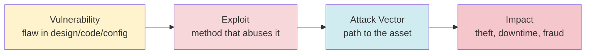
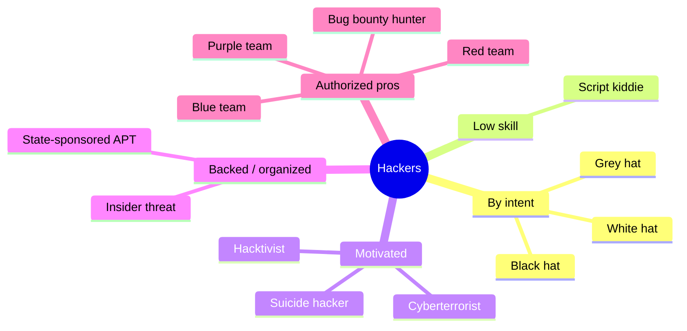
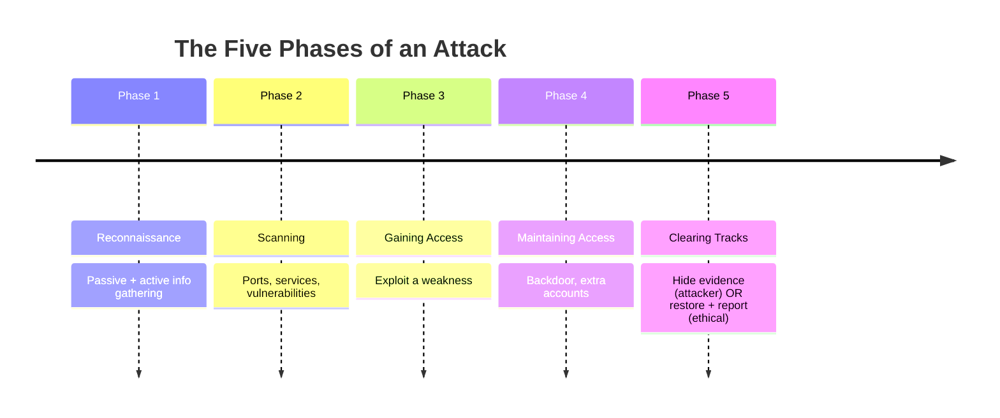
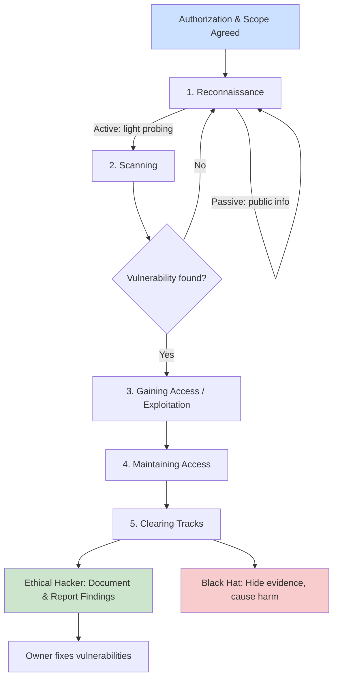
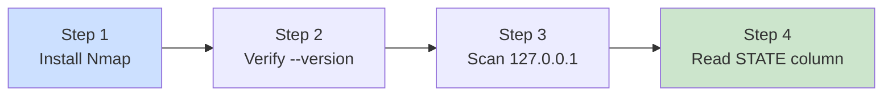
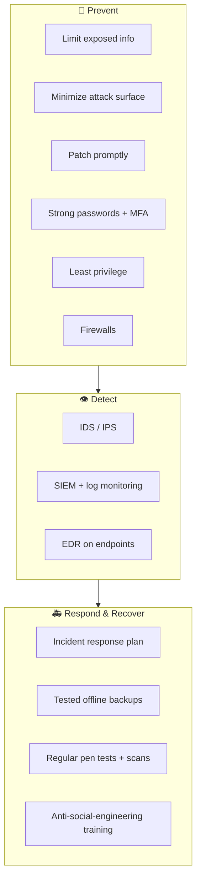

# Introduction to Ethical Hacking 🛡️

> **What you'll learn:** what hacking really is, who hackers are, the difference between ethical and malicious hacking, and the structured phases an attacker (or authorized tester) follows.
> **Prerequisites:** basic computer literacy (files, networks, a web browser) and willingness to use a terminal — no prior security experience required.

| Course | Course code | Module | Level |
|--------|-------------|--------|-------|
| Ethical Hacking Foundation | SKL-CEF-705 | Module 01 — Introduction to Ethical Hacking | Foundation |

---

> 📺 **Watch — top video on this topic:** [](https://www.youtube.com/watch?v=4oYaEWT4FGY) [Ethical Hacking Explained for Beginners](https://www.youtube.com/watch?v=4oYaEWT4FGY)

---

## 1. In Plain English 🗣️

Imagine you hire a locksmith to break into your own house. You want to know: can a burglar get in through the back window? Is the front lock actually secure? The locksmith tries every door and hinge — not to rob you, but to hand you a report saying "fix these three things before a real thief finds them." That is **ethical hacking**: a trusted expert attacks a system *with permission* so the owner can fix weaknesses before a criminal exploits them.

"Hacking" sounds scary because movies show hooded figures stealing money. But hacking simply means deeply understanding a system and making it do something it wasn't designed to do. Whether that's good or bad depends entirely on **intent** and **permission**:

- A person who finds a flaw and **reports** it is helping.
- A person who finds the same flaw and **steals** data is committing a crime.
- The technical skill can be identical — the **ethics** are what differ.

Why should a beginner care? Almost everything you rely on — your bank app, email, hospital records, the traffic lights downtown — runs on software, and all software has flaws. Someone has to find those flaws responsibly. Ethical hackers (also called **penetration testers** or "pen testers") are that someone. This module is your first map of the territory.

> 🔑 **Key idea:** The single most important rule of this entire course is **authorization is everything**. Scanning a network or guessing a password is legal and praiseworthy *with* written permission — and a crime *without* it.

---

## 2. Core Concepts 📚

### 2.1 Systems and Assets

| Term | Meaning | Example |
|------|---------|---------|
| **System** 💻 | Hardware, software, and data working together | A laptop, a website, a whole company network |
| **Asset** 💎 | Anything of value worth protecting | Customer data, money, IP, reputation |

Security exists to protect **assets** from harm.

### 2.2 The Anatomy of an Attack

Hacking is exploiting weaknesses to gain unauthorized access or force unintended behavior. The vocabulary fits together like a chain:



| Term | Plain definition |
|------|------------------|
| **Vulnerability** | A flaw in design, code, or configuration |
| **Exploit** | The method used to take advantage of a vulnerability |
| **Attack vector** | The path an attacker uses to reach the asset |
| **Impact** | The actual damage that could result |

### 2.3 The CIA Triad — Why We Defend At All

Security is measured against three goals, the **CIA triad** (nothing to do with the spy agency). Every attack tries to break one or more; every defense tries to preserve them.


*The CIA triad — the three core goals of information security. (Wikimedia Commons)*

| Goal | Guarantee | Everyday example |
|------|-----------|------------------|
| 🤫 **Confidentiality** | Only authorized people can read data | Your password stays secret |
| ✅ **Integrity** | Data is accurate and unaltered | Your bank balance isn't secretly changed |
| 🟢 **Availability** | The system works when you need it | The website isn't knocked offline |

### 2.4 What Makes Hacking "Ethical"

**Ethical hacking** uses the same tools and techniques as malicious attackers — but legally, with explicit written permission, to find and fix vulnerabilities before criminals do. Engagements are bounded by a **scope** (what may be tested), **rules of engagement** (how/when), and a **statement of work / contract** (legal authorization).

Three pillars make it ethical:

1. **Authorization** — you have signed, written permission.
2. **Scope & intent** — you only touch what's allowed, to improve security.
3. **Disclosure** — you report findings so the owner can fix them, rather than exploiting or selling them.

### 2.5 White Hat vs Black Hat vs Grey Hat 🎩

The "hat colors" come from old Western films — heroes in white hats, villains in black. They describe **intent and legality, not skill level**.

| Hat | Permission? | Intent | Legal? |
|-----|-------------|--------|--------|
| ⚪ **White hat** | ✅ Yes (authorized) | Defend / improve security | ✅ Legal |
| ⚫ **Black hat** | ❌ No | Personal gain, harm, theft | ❌ Illegal |
| 🩶 **Grey hat** | ⚠️ Usually no | Often "good" intentions, no permission | ❌ Illegal (grey area) |

- **White hats** are who this course trains you to become — contracts and responsible disclosure.
- **Black hats** are criminals breaking in for money, espionage, sabotage, or notoriety.
- **Grey hats** sit between. Classic example: someone scans a company's site uninvited, finds a flaw, and emails them about it. Good intent — but no permission means they broke the law.

> ⚠️ **Warning:** Good intentions do not make unauthorized access legal. "I was only trying to help" is not a legal defense.

### 2.6 Types of Hackers (a Taxonomy)



| Type | One-line description |
|------|----------------------|
| **Script kiddie** | Runs ready-made tools without understanding them — low skill, real damage |
| **Hacktivist** | Hacks to promote a political/social cause (e.g., website defacement) |
| **State-sponsored / nation-state** | Government-backed, well-funded; often an **APT** (Advanced Persistent Threat) — stealthy, long-term intrusion |
| **Cyberterrorist** | Aims to cause fear, disruption, or physical harm for ideology |
| **Insider threat** | Employee/contractor misusing legitimate access (deliberately or accidentally) |
| **Suicide hacker** | Attacks critical systems without caring about getting caught |
| **Red team** | Authorized pros simulating realistic adversaries end-to-end |
| **Blue team** | Defenders who detect and respond (a **purple team** is the two cooperating) |
| **Bug bounty hunter** | White hat paid per valid bug via programs like HackerOne or Bugcrowd |

### 2.7 Vulnerability vs Threat vs Risk

Beginners mix these up, so pin them down with the "unlocked window" analogy:

| Term | Definition | Analogy |
|------|------------|---------|
| **Vulnerability** | A weakness | An unlocked window |
| **Threat** | A potential danger that could exploit it | A burglar in the neighborhood |
| **Risk** | Likelihood × impact of the threat exploiting the vulnerability | How likely you'll be robbed, and how bad it'd be |

> 🔑 **Key idea:** **Risk ≈ Threat × Vulnerability × Impact** (conceptually). Ethical hacking reduces risk by removing vulnerabilities.

---

## 3. How It Works (Step by Step) 🔄

Hacking — malicious or authorized — typically follows five recognized **phases**. An ethical hacker walks the same path but stops to document instead of doing harm, then adds a crucial sixth step: **reporting**.



| # | Phase | What happens | Beginner note |
|---|-------|--------------|---------------|
| 1 | **Reconnaissance (Footprinting)** | Gather info *before* touching the target | **Passive** = public info (site, LinkedIn, DNS) with no direct contact; **Active** = light interaction (e.g., a ping). Goal: map the **attack surface** |
| 2 | **Scanning** | Probe for live hosts, open **ports**, services, known vulns | Turns the broad recon picture into a concrete list of ways in. (Port 443 = HTTPS) |
| 3 | **Gaining Access (Exploitation)** | Break in via a weak password, unpatched bug, or misconfiguration | This is where the actual "hack" happens |
| 4 | **Maintaining Access** | Install a **backdoor** or extra accounts to return later | Ethical hacker notes it's *possible* and documents it |
| 5 | **Clearing Tracks** | Attacker deletes logs to hide; **ethical hacker does NOT** — they restore the system and document everything | Reporting separates a pen test from a crime |



The shared technical path splits at the end: green is the lawful outcome (report and fix), red is the criminal one. **Same techniques, opposite ethics.**

---

## 4. Real-World Examples 🌍

**1. WannaCry ransomware outbreak (2017).** 🦠 Self-spreading malware encrypted files on hundreds of thousands of Windows machines worldwide and demanded payment, disrupting organizations including parts of the UK's NHS. It exploited a known flaw in an older Windows file-sharing protocol — *for which a patch already existed.*
- **Lesson:** Black-hat impact is enormous, yet simply applying available patches promptly would have stopped much of it. This is exactly the kind of unpatched vulnerability an ethical hacker is hired to find first.

**2. Bug bounty programs — everyday ethical hacking.** 💰 Google, Microsoft, and many others run public programs (often on HackerOne or Bugcrowd) where white hats are *invited* to find flaws and are paid for valid, responsibly disclosed reports.
- **Lesson:** Ethical hacking in its purest, most accessible form — clear authorization, defined scope, reward for helping. Many pen testers start their careers here.

**3. A grey-hat cautionary scenario.** ⚠️ A curious person notices a company's site exposes customer records via a poorly built URL, reports it (publicly or to the company) without prior permission, and then faces legal trouble despite "only trying to help."
- **Lesson:** Intent alone is not a legal defense — this is why we hammer on authorization.

---

## 5. Tools of the Trade 🧰

Foundational tools you'll meet repeatedly. You don't need to master them today — just recognize what each does.

| Tool | Category | Use case | Try it (lab only) |
|------|----------|----------|-------------------|
| **Nmap** 🗺️ | Scanning | Discover live hosts, open ports, services | `nmap -sV 127.0.0.1` |
| **Wireshark** 🦈 | Packet analysis | Capture & inspect network traffic | GUI / `wireshark` |
| **Metasploit** 💥 | Exploitation | Run known exploits/payloads safely in tests | `msfconsole` |
| **Burp Suite** 🕷️ | Web app testing | Intercept & modify web requests | Desktop app (Community = free) |
| **Kali Linux** 🐉 | Toolbox OS | Distro pre-loaded with hundreds of tools | Run inside a VM |

**Nmap (Network Mapper).** Discovers live hosts, open ports, and services.
```bash
nmap -sV 127.0.0.1
```
`-sV` detects the **version** of each service; `127.0.0.1` is **localhost** (your own machine). This lists which services are running and their versions.

**Wireshark.** A graphical tool that captures and displays network traffic so you can see exactly what's flowing — used to understand protocols and spot suspicious traffic. Pick an interface and watch packets arrive.

> 🖼️ *Suggested image: Wireshark capturing a live packet stream, with the packet list, detail, and bytes panes visible.*

**Metasploit Framework (lab use).** A framework of known exploits and payloads to safely demonstrate vulnerabilities in authorized tests.
```bash
msfconsole
```
Launches the interactive console where a tester searches for and (in authorized labs only) runs exploit modules. Treat this as advanced — you'll use it later.

> 🖼️ *Suggested image: the Metasploit `msfconsole` banner and prompt after first launch.*

**Burp Suite.** Sits between your browser and a website to inspect and modify web requests. The free Community Edition is enough for learning.

**Kali Linux.** Not a single tool but a Linux distribution pre-loaded with hundreds of security tools. Many learners run it inside a **virtual machine (VM)** — a simulated computer inside your real one — so testing stays isolated and safe.

---

## 6. Hands-On Lab (Authorized / Lab-Only) 🧪

> ⚠️ **Warning:** Only ever run these techniques on systems you **own** or have **explicit written permission** to test. Scanning someone else's machine without permission is illegal.

Your first lab is 100% safe: **you will scan only your own computer.** Nothing here can harm anyone.



**Step 1 — Install Nmap.**

| OS | Command |
|----|---------|
| 🐧 Linux / Kali | `sudo apt update && sudo apt install nmap` |
| 🍎 macOS (Homebrew) | `brew install nmap` |
| 🪟 Windows | Download the official installer from nmap.org |

Package managers are just app stores for the command line.

**Step 2 — Confirm it installed.**
```bash
nmap --version
```
Prints the installed version. If you see version text (not "command not found"), you're ready — that's all this step checks.

**Step 3 — Run one safe scan against your own machine.**
```bash
nmap -F 127.0.0.1
```
- `nmap` — the program.
- `-F` — **Fast** scan: checks only the ~100 most common ports instead of all 65,535, so it finishes in seconds.
- `127.0.0.1` — **localhost**, which always means "this computer." Scanning yourself is always allowed.

**Step 4 — Read the output.** Nmap prints a small table; the key column is **STATE**:

| STATE | Meaning | Analogy |
|-------|---------|---------|
| `open` 🟢 | A service is actively listening | A door that's answering |
| `closed` 🔴 | Nothing is listening right now | A door that's shut |
| `filtered` 🟡 | Something (e.g., a firewall) blocks Nmap from telling | A door you can't even see |

> 🖼️ *Suggested image: terminal output of `nmap -F 127.0.0.1` showing the PORT / STATE / SERVICE columns.*

> 💡 **Tip:** Few open ports is a *good* sign — fewer open ports means a smaller attack surface. Any `open` ports are just services your own OS runs; you haven't broken anything.

You just performed legitimate reconnaissance on a system you're authorized to test. When ready for more, the safe next step is a deliberately vulnerable practice VM such as **Metasploitable**, run inside virtualization software (like VirtualBox) on an **isolated** network — never against real systems.

---

## 7. Countermeasures & Defenses 🛡️

Defense is the **blue team's** job. The cleanest way to think about it is to map each defense to the attacker's phase.



| Goal | Countermeasure | Why it works |
|------|----------------|--------------|
| 🚧 **Prevent** | Limit public info; minimize attack surface (disable unused services/ports) | Less to find = less to exploit |
| 🚧 **Prevent** | Patch management | Most breaches exploit known, fixable flaws |
| 🚧 **Prevent** | Strong passwords + **MFA** | A second proof of identity beyond a password |
| 🚧 **Prevent** | **Least privilege** + firewalls | Accounts get only needed access; control traffic in/out |
| 👁️ **Detect** | **IDS/IPS** | Spot or block suspicious traffic |
| 👁️ **Detect** | **SIEM** (centralized logs) + **EDR** | Alert on anomalies; watch individual machines |
| 🚑 **Respond** | Incident response plan + offline **backups** | Know what to do; recover from ransomware |
| 🚑 **Respond** | Regular **pen tests** & vuln scans | Proactive ethical hacking is itself a countermeasure |
| 🚑 **Respond** | Anti-**social-engineering** training | Manipulating people is still a top attack vector |

---

## 8. Key Terms 🗂️

| Term | Definition |
|------|------------|
| **Vulnerability** | A weakness in a system that can be exploited |
| **Exploit** | Code or technique that takes advantage of a vulnerability |
| **Threat** | A potential cause of harm to an asset |
| **Risk** | Likelihood and impact of a threat exploiting a vulnerability |
| **Attack surface** | The total set of points where a system could be attacked |
| **Penetration test** | An authorized, simulated attack to find and report weaknesses |
| **Scope** | The explicitly agreed boundaries of what may be tested |
| **CIA triad** | Confidentiality, Integrity, Availability — the three core security goals |
| **White / Black / Grey hat** | Hacker categories defined by permission and intent |
| **Reconnaissance** | The information-gathering first phase (passive or active) |
| **Port** | A numbered communication endpoint on a networked computer |
| **Backdoor** | A hidden method of regaining access to a system |
| **Red team / Blue team** | Authorized attackers / defenders in a security exercise |
| **Responsible disclosure** | Privately reporting a flaw to the owner so it can be fixed |

---

## 9. Summary & Takeaways ✅

- 🎯 **Hacking is a skill; ethics is a choice.** The same techniques are legal or criminal depending on **authorization and intent**.
- 🎩 **White hats** work with written permission and disclose responsibly; **black hats** are criminals; **grey hats** mean well but skip permission — still illegal.
- 👥 Hackers come in many types — script kiddies, hacktivists, nation-state/APT actors, insiders, bug bounty hunters, red and blue teams.
- 🔄 Attacks follow five phases: **Reconnaissance → Scanning → Gaining Access → Maintaining Access → Clearing Tracks** — and ethical hackers add a crucial sixth: **reporting**.
- 🛡️ Security is measured by the **CIA triad** (Confidentiality, Integrity, Availability); ethical hacking protects all three by reducing **risk**.
- 🧱 Defenses span **prevention, detection, and response** — patching, MFA, least privilege, logging/SIEM, IDS/IPS, backups, and regular authorized testing.

> 🔑 **Golden rule for the entire course:** never test what you don't own or aren't authorized to test.

**Further reading:** OWASP Top Ten; NIST SP 800-115 (Technical Guide to Information Security Testing and Assessment); MITRE ATT&CK framework; the EC-Council CEH knowledge domains.
