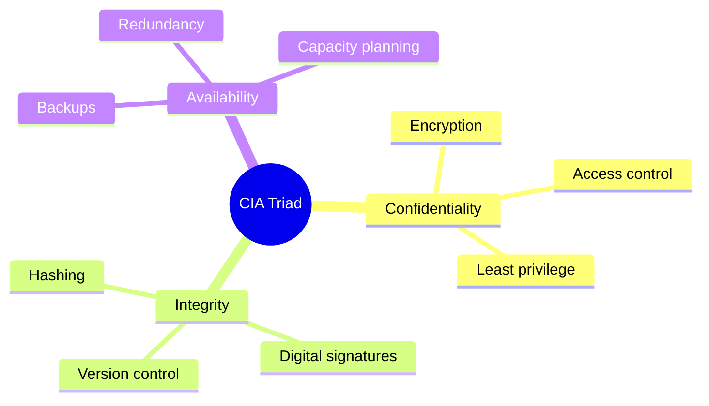
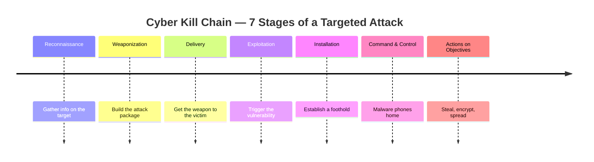
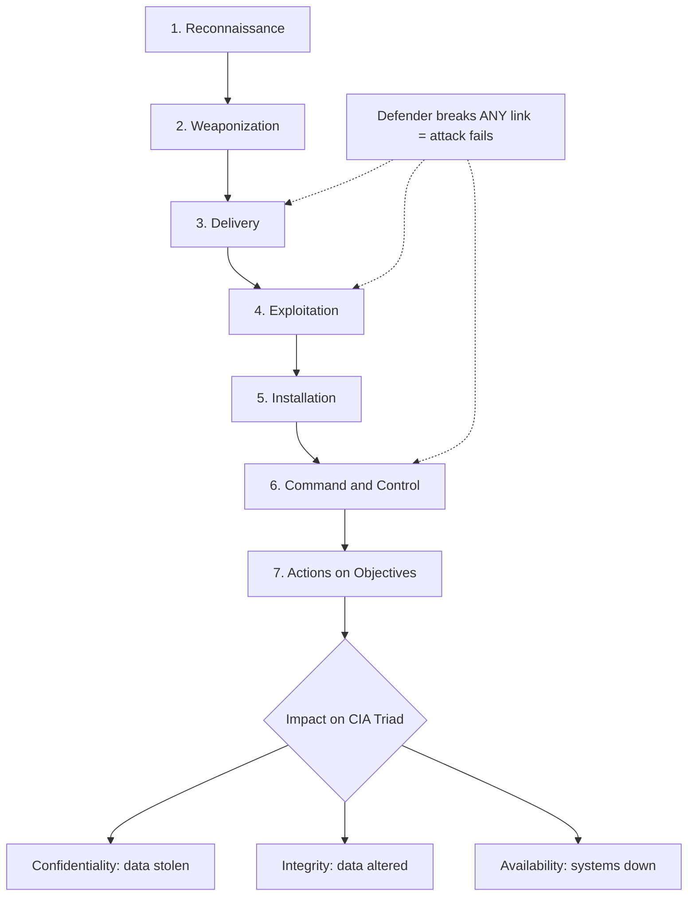
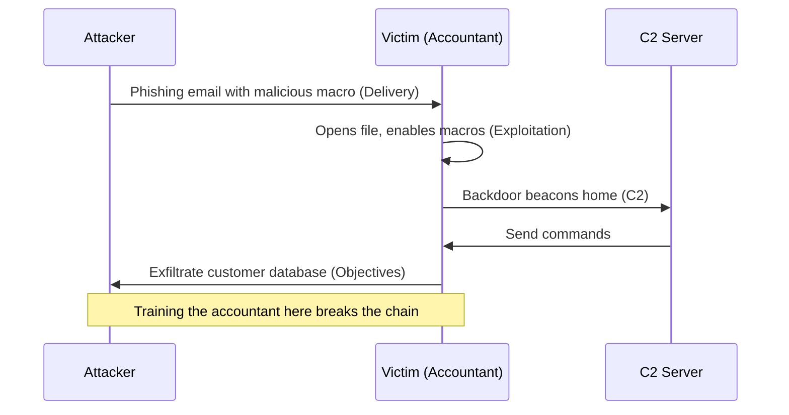
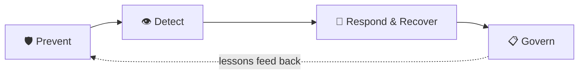

# Introduction to Cyber Security

> **What you'll learn:** the foundations of information security — the CIA triad, how attackers think (Cyber Kill Chain and MITRE ATT&CK), the controls defenders use, and the major laws and standards that govern data protection.
> **Prerequisites:** none — just basic comfort using a computer and a web browser.

| Course | Course code | Module | Level |
|---|---|---|---|
| Ethical Hacking Foundation | SKL-CEF-705 | Module 02 — Introduction to Cyber Security | Foundation |

---

> 📺 **Watch — top video on this topic:** [](https://www.youtube.com/watch?v=3oTLTijODA4) [Introduction to Cyber Security for Beginners](https://www.youtube.com/watch?v=3oTLTijODA4)

---

## 1. In Plain English 🏠

Picture your house. You want three things to be true: only the right people get inside, nobody tampers with your stuff while you're out, and the house is *there and usable* when you come home. Cyber security is exactly this — but for information instead of furniture. The "house" is your data: your apps, bank account, photos, and your company's customer records.

- **Information security (infosec)** — protecting information (on a disk, crossing the internet, or printed on paper) from being seen, changed, or destroyed by people who shouldn't.
- **Cyber security** — the part of infosec focused on *digital* systems: computers, networks, phones, cloud services, and the data flowing between them.

Why should a beginner care? Almost everything valuable now has a digital shadow — your money, identity, medical history, work, and relationships all live partly online. **Threat actors** want that data because it can be sold, used for fraud, or held for ransom. Defenders — what you're training to become — study how attackers operate so they can lock the doors first.

> 🔑 **Key idea:** This module is your *map* of the whole landscape. You won't hack anything serious yet — you'll learn the vocabulary, mental models, and rules of the road so everything else in the course makes sense.

---

## 2. Core Concepts 🧠

### Information Security Overview

**Information security** keeps data — and the systems that handle it — safe from unauthorized access, modification, disruption, or destruction, regardless of *where* the data lives. Good protection covers all three **states of data**:

| State | What it means | Example |
|---|---|---|
| 💾 At rest | Sitting in storage | A database, laptop disk, backup tape |
| 🌐 In transit | Moving across a network | An email being sent, a web page loading |
| ⚙️ In use | Actively processed in memory | A document open on screen |

Core vocabulary you'll hear constantly:

| Term | Meaning | Example |
|---|---|---|
| **Asset** | Anything of value you protect | A server, a customer list, a password |
| **Threat** | A potential cause of harm | A hacker, malware, a flood, a careless employee |
| **Vulnerability** | A weakness a threat could exploit | An unpatched program, a weak password |
| **Risk** | Chance a threat exploits a vulnerability and causes damage | *Risk = Threat × Vulnerability × Impact* |
| **Exploit** | The actual technique/code that abuses a vulnerability | Malicious macro, buffer-overflow payload |

### The CIA Triad

The **CIA triad** is the foundation of all information security (nothing to do with the intelligence agency). It names the three properties we always try to preserve.


*The CIA triad — Confidentiality, Integrity, and Availability — the three goals every control protects. (Source: Wikimedia Commons)*

| Letter | Property | Broken when… | Protected by |
|---|---|---|---|
| 🔒 **C** | **Confidentiality** — only authorized people can read it | Data leaks | Encryption (scrambling so only a key-holder reads it) + access control |
| ✅ **I** | **Integrity** — data is accurate and untampered | An attacker secretly alters a bank balance | Hashing (a fingerprint that changes if one character changes) + digital signatures |
| 🟢 **A** | **Availability** — systems are accessible when needed | A DoS attack floods a site until it crashes; ransomware locks files | Backups, redundancy, capacity planning |

Companion concepts:
- **Non-repudiation** — proof a specific person did something, so they can't later deny it (digital signatures + logging).
- Some models add **Authentication** (proving who you are) and **Authorization** (what you're allowed to do).

> 🔑 **Key idea:** Every security control you ever build traces back to protecting one or more letters of CIA.



### The Cyber Kill Chain (Lockheed Martin)

The **Cyber Kill Chain**, created by **Lockheed Martin** in 2011, breaks a targeted attack into seven sequential stages. The powerful insight: an attacker must complete *every* step to succeed, so a defender only needs to break *one* link to stop the whole chain.



| # | Stage | What the attacker does |
|---|---|---|
| 1 | **Reconnaissance** | Gathers info (employee emails, tech in use, exposed servers) |
| 2 | **Weaponization** | Builds the attack package, e.g. a malicious doc + exploit |
| 3 | **Delivery** | Gets the weapon to the victim (phishing, USB, compromised site) |
| 4 | **Exploitation** | The weapon triggers, abusing a vulnerability to run code |
| 5 | **Installation** | Malware installs to gain a foothold (e.g. a backdoor) |
| 6 | **Command & Control (C2)** | Malware "phones home" for remote control |
| 7 | **Actions on Objectives** | Steals data, encrypts files, spreads further |

> 💡 **Tip:** The Kill Chain teaches the *shape* of an attack well, but critics note it's focused on malware-based, externally-delivered intrusions — less so on insider threats.

### MITRE ATT&CK

**MITRE ATT&CK** ("attack") is a free, continuously-updated **knowledge base** of real-world attacker behavior, maintained by the non-profit MITRE Corporation. It stands for **Adversarial Tactics, Techniques, and Common Knowledge**. Where the Kill Chain gives a high-level story, ATT&CK gives an evidence-based encyclopedia.

| Layer | What it answers | Example |
|---|---|---|
| **Tactics** | The *goal* at a stage (the "why") | Initial Access, Persistence, Privilege Escalation, Exfiltration |
| **Techniques** | *How* a tactic is achieved | Phishing `T1566`, Valid Accounts |
| **Sub-techniques** | A more specific variant | `T1566.001` Spearphishing Attachment |
| **Procedures** | The exact real-world implementation a group used | APT28's specific spearphish payload |

Defenders ("blue teams") use ATT&CK to map detection coverage — checking which techniques they can spot and which are blind spots.

> 🔑 **Key idea:** Kill Chain = the *journey*; ATT&CK = the detailed *playbook of moves* at each step. They are complementary.

### Information Security Controls

A **control** (or "safeguard" / "countermeasure") is anything that reduces risk. Controls are classified two ways — by **function** and by **nature**.

**By function:**

| Type | Purpose | Example |
|---|---|---|
| 🛡️ Preventive | Stop an incident before it happens | Firewall, encryption, locks |
| 👁️ Detective | Discover an incident in progress or after | IDS, CCTV, log review |
| 🔧 Corrective | Limit damage and restore systems | Backups, patching, incident response |
| 🚧 Deterrent | Discourage attackers | Warning banners, visible cameras |
| 🔁 Compensating | An alternative when the ideal control isn't feasible | Extra monitoring when a system can't be patched |

**By nature:**

| Nature | Implemented as | Examples |
|---|---|---|
| Technical (logical) | Technology | Firewalls, antivirus, MFA |
| Administrative (managerial) | People & process | Policies, training, background checks |
| Physical | The physical world | Locks, guards, fences, access cards |

Two principles tie controls together:
- **Defense in depth** — layer many controls so no single failure is fatal (a castle with a moat, walls, *and* guards).
- **Least privilege** — give every user and program only the minimum access they need.

### Information Security Laws and Standards

Laws are mandatory government rules; standards are agreed best practices (sometimes required by contract).

| Name | Type | Region | Protects / governs |
|---|---|---|---|
| **GDPR** (2018) | Law | EU | Personal data of people in the EU; rights to access, correct, erase. Fines up to €20M or 4% of global turnover |
| **HIPAA** | Law | US | Patients' health information (PHI); rules for hospitals, insurers, vendors |
| **PCI-DSS** | Contractual standard | Global | Any business storing/processing credit-card data; encryption, segmentation |
| **ISO/IEC 27001** | Standard | International | How to build an ISMS; organizations can be formally certified |
| **India IT Act, 2000** (2008 amend.) | Law | India | Legal recognition of e-records; cyber offences; §43A on sensitive personal data |

> 💡 **Tip:** India's newer **Digital Personal Data Protection Act, 2023** further strengthens personal-data protection beyond the IT Act.

---

## 3. How It Works (Step by Step) 🔍

Let's walk through a realistic targeted attack and see how the **Kill Chain**, **ATT&CK**, and **controls** line up. Notice that breaking *any one* step stops the entire attack.

| Stage | What happens | ATT&CK | Defender response |
|---|---|---|---|
| 1. Recon | Scrapes LinkedIn + site for names & email format | Reconnaissance | Limit exposed info, watch for scanning |
| 2. Weaponize | Crafts a Word doc with a malicious macro | (off-target) | Hard to detect directly |
| 3. Delivery | Sends a convincing phishing email to an accountant | Phishing `T1566` | Email filtering + user training |
| 4. Exploitation | Accountant enables macros; code runs | User Execution `T1204` | Disable macros by policy |
| 5. Installation | Malware drops a reboot-surviving backdoor | Persistence | Endpoint detection (EDR) |
| 6. C2 | Backdoor connects to attacker's server | Command and Control | Monitor outbound traffic |
| 7. Objectives | Customer database copied out (harms **Confidentiality**) | Exfiltration | DLP tools + egress filtering |



Here is the same attack as an exchange between attacker and target — the kind of conversation defenders try to interrupt:



---

## 4. Real-World Examples 🌍

**Equifax (2017) — a Confidentiality & Integrity failure.** Attackers exploited an unpatched flaw in the Apache Struts web framework on a public-facing system, moved through the network for weeks, and exfiltrated personal data of ~147 million people. The root cause — a missing patch — is a textbook **vulnerability** that timely patching (a **corrective control**) would have closed. It maps cleanly to the Kill Chain: exploitation → installation → C2 → exfiltration.

**WannaCry (2017) — an Availability disaster.** This ransomware worm spread rapidly by abusing a Windows networking vulnerability, encrypting files and demanding payment. The UK's NHS was badly disrupted, with appointments cancelled — a vivid reminder that **Availability** is a security property, and that patching plus backups are core defenses.

**Phishing in everyday life — a Delivery scenario.** The attack you'll personally meet most is a phishing email pretending to be your bank or employer, urging you to "verify your account" on a fake login page. This single technique (ATT&CK `T1566`) starts a huge share of real breaches — which is why awareness training is one of the highest-value controls an organization can buy.

> ⚠️ **Warning:** The "unglamorous basics" — patching, backups, MFA, and training — would have blunted nearly every headline breach. Sophistication is rarely the attacker's edge; neglect is.

> 🖼️ *Suggested image: a real phishing email screenshot with the spoofed sender, urgent language, and fake login link annotated.*

---

## 5. Tools of the Trade 🛠️

These are *orientation* tools — you'll go deep on each later. Here's what they are and a representative command.

| Tool | What it does | Kill Chain phase | Representative command |
|---|---|---|---|
| **Nmap** | Network scanner: finds live hosts and open ports/services | Reconnaissance | `nmap -sV 127.0.0.1` |
| **Wireshark / tshark** | Packet analyzer: captures and shows data in transit | Recon / analysis | `tshark -c 10` |
| **Hashing utils** | Compute a file's fingerprint to prove integrity | Integrity check | `sha256sum myfile.txt` |
| **ATT&CK Navigator** | Web tool to visualize techniques & detection coverage | Defense planning | (browser, no install) |

**Nmap** — discovers which hosts are online and which services (ports) they expose.

```bash
nmap -sV 127.0.0.1
```
`-sV` detects the **version** of each service found; `127.0.0.1` is "localhost" — your own machine. This safely shows what's listening on *your* computer.

**Wireshark** — captures and displays network traffic so you can see data in transit (mostly GUI; CLI sibling is `tshark`).

```bash
tshark -c 10
```
`-c 10` captures just 10 packets then stops — a tiny, safe sample.

**Hashing utilities** — built-in tools that prove **integrity** by computing a file's fingerprint.

```bash
sha256sum myfile.txt
```
Prints a 64-character hash. Run it again later; if the hash changed, the file changed. That's exactly how integrity checks work.

**MITRE ATT&CK Navigator** — a free browser tool for visualizing techniques on a grid and color-coding detection coverage. Used for planning, not attacking.

> 🖼️ *Suggested image: MITRE ATT&CK Navigator grid with several techniques color-coded by detection coverage.*

---

## 6. Hands-On Lab (Authorized / Lab-Only) 🧪

> ⚠️ **Warning:** Only run these against systems you own or are explicitly authorized to test — here, that's your own computer. Scanning machines you don't own can be illegal.

This first lab is gentle and risk-free: confirm a tool is installed and look at *your own* machine. Nothing here can break anything.

**Step 1 — Install Nmap (if needed).**

```bash
# macOS (with Homebrew):
brew install nmap

# Debian/Ubuntu Linux:
sudo apt update && sudo apt install nmap
```
`brew install` / `apt install` downloads and sets up the program. `sudo` means "run as administrator," which installing requires.

**Step 2 — Check it launched correctly.**

```bash
nmap --version
```
Prints the installed version. A version means you're ready; "command not found" means the install didn't finish — re-run Step 1.

**Step 3 — Run one safe scan against yourself.**

```bash
nmap -F 127.0.0.1
```
- `nmap` — the program.
- `-F` — "fast" mode: scans only the 100 most common ports (not all 65,535), so it finishes in seconds.
- `127.0.0.1` — localhost, your own computer. You always have permission to scan yourself.

**Reading the output:** Nmap lists ports as `open`, `closed`, or `filtered`. `open` means a service is listening (e.g. port 22 = SSH). On a typical personal laptop you'll often see *no* open ports — that's normal and good (a smaller "attack surface").

| Port state | Meaning |
|---|---|
| 🟢 `open` | A service is actively listening |
| 🔴 `closed` | Reachable, but nothing is listening |
| ⚪ `filtered` | A firewall is blocking Nmap from telling |

> 🖼️ *Suggested image: a terminal showing `nmap -F 127.0.0.1` output with the open/closed/filtered port list.*

> 💡 **Tip:** When ready for more, practice on a deliberately-vulnerable VM like **Metasploitable** inside VirtualBox on your own laptop, isolated from the internet. It exists *to be* practiced on — explore freely without harming anyone. Curiosity plus permission is exactly the right mindset.

---

## 7. Countermeasures & Defenses 🛡️

The strongest programs cover the full lifecycle — prevent, detect, respond, and govern.



**🛡️ Prevent (stop attacks before they start):**
- Apply security patches promptly — the single highest-impact habit (see Equifax/WannaCry).
- Enforce **least privilege** and strong **multi-factor authentication (MFA)**.
- Encrypt data at rest and in transit; segment networks so a breach can't spread freely.
- Train users to recognize phishing — the human firewall.

**👁️ Detect (notice attacks in progress):**
- Deploy **IDS/IPS** (Intrusion Detection/Prevention) and **EDR** (Endpoint Detection and Response).
- Centralize logs in a **SIEM** (Security Information and Event Management) and alert on anomalies.
- Use MITRE ATT&CK to map and close detection gaps.

**🔧 Respond & recover (limit and reverse damage):**
- Maintain an incident-response plan and tested, **offline backups**.
- Isolate compromised hosts quickly; rotate exposed credentials.
- Run post-incident reviews to feed lessons back into prevention.

**📋 Govern (keep it sustainable and compliant):**
- Build an ISMS aligned to **ISO 27001**; meet legal duties (GDPR, HIPAA, PCI-DSS, India IT Act).
- Run regular risk assessments; apply **defense in depth** across technical, administrative, and physical controls.

| Attack | Defense that would have stopped/blunted it |
|---|---|
| Equifax (unpatched Struts) | Prompt patching + network segmentation |
| WannaCry (ransomware worm) | Patching + offline backups |
| Phishing (`T1566`) | User training + email filtering + MFA |

---

## 8. Key Terms 📖

| Term | Definition |
|---|---|
| **Information security** | Protecting data's CIA across all states (at rest, in transit, in use) |
| **CIA triad** | The three core goals: Confidentiality, Integrity, Availability |
| **Confidentiality** | Keeping data readable only to authorized parties |
| **Integrity** | Ensuring data is accurate and untampered |
| **Availability** | Ensuring systems and data are accessible when needed |
| **Threat** | A potential cause of harm to an asset |
| **Vulnerability** | A weakness a threat can exploit |
| **Risk** | The likelihood and impact of a threat exploiting a vulnerability |
| **Exploit** | The technique or code used to abuse a vulnerability |
| **Cyber Kill Chain** | Lockheed Martin's 7-stage model of a targeted attack |
| **MITRE ATT&CK** | A knowledge base of real adversary tactics, techniques, procedures |
| **Control / countermeasure** | A safeguard that reduces risk (preventive, detective, corrective, etc.) |
| **Defense in depth** | Layering multiple controls so no single failure is catastrophic |
| **Least privilege** | Granting only the minimum access necessary |
| **ISMS** | Information Security Management System, the framework defined by ISO 27001 |

---

## 9. Summary & Takeaways ✅

- Information security protects the **confidentiality, integrity, and availability** of data wherever it lives — every control traces back to one of those three goals.
- **Threat, vulnerability, and risk** are distinct ideas; together they let you reason about *what could go wrong and how likely it is*.
- The **Cyber Kill Chain** tells an attack's story in seven stages; a defender wins by breaking just one link.
- **MITRE ATT&CK** is the detailed, real-world catalogue of attacker behavior — use it to find and close detection blind spots.
- Controls come in functional types (preventive, detective, corrective, deterrent, compensating) and natures (technical, administrative, physical); the best defenses **layer** them.
- Major laws and standards — **GDPR, HIPAA, PCI-DSS, ISO 27001, India IT Act** — turn good security into a legal and contractual obligation.
- Real incidents like **Equifax** and **WannaCry** show that unglamorous basics — patching, backups, training — prevent most damage.
- Practice only on systems you own or are authorized to test; start with your own machine or an isolated vulnerable VM.

> 📚 **Further reading:** NIST Cybersecurity Framework and NIST SP 800-53 (controls catalogue); MITRE ATT&CK and the ATT&CK Navigator; OWASP Top Ten; ISO/IEC 27001 and the official GDPR/HIPAA/PCI-DSS regulatory texts.
