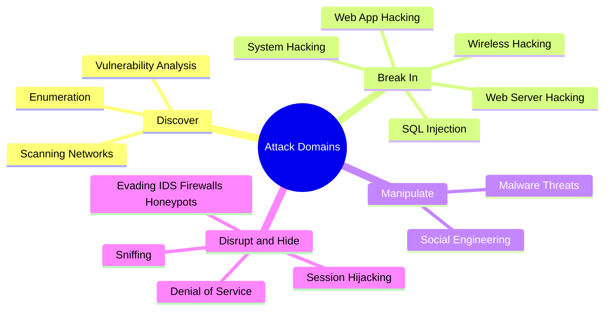
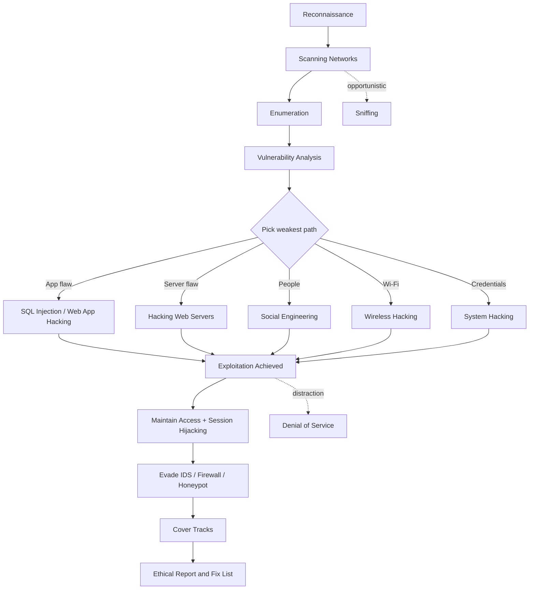
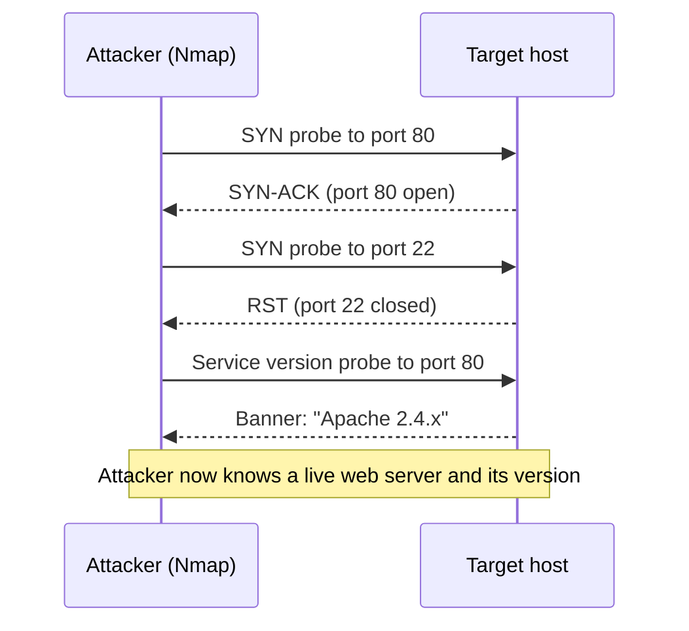
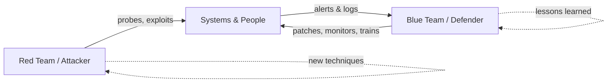

# Cyber Security Key Concepts (The Big Map) 🗺️

> **What you'll learn:** A guided, plain-English tour of every major attack domain in ethical hacking — so the rest of your program clicks into place. **Prerequisites:** Basic computer literacy (you can use a terminal; you know what an "IP address" and a "website" are). No prior security knowledge required.

| Field | Value |
|-------|-------|
| 📘 Course | Ethical Hacking Foundation |
| 🔖 Course code | SKL-CEF-705 |
| 🧩 Module | Cyber Security Key Concepts (The Big Map) |
| 🎓 Level | Foundation |

---

> 📺 **Watch — top video on this topic:** [](https://www.youtube.com/watch?v=Ti6UN9MSLno) [The CIA Triad: Confidentiality, Integrity & Availability Explained](https://www.youtube.com/watch?v=Ti6UN9MSLno)

---

## 1. In Plain English

Imagine you've just been hired to test the security of a large office building. You wouldn't throw a brick through a window. You'd first walk the block to count entrances, note which doors are propped open, learn who works there, and only *then* — with the owner's written permission — try to slip inside unnoticed. **Ethical hacking** works exactly the same way, just with computers instead of buildings: testing systems for weaknesses *with permission*, so the owner can fix them before a criminal finds them.

This module is the **map of the whole journey**. Every later module zooms into one room of that building; today we walk the corridor and peek into each one so you understand how they connect. You'll meet the major **attack domains** — categories of techniques attackers use and defenders must understand to stop them.

> 🔑 **Key idea:** The difference between an ethical hacker (a "white hat") and a criminal is *not* skill — it's **permission**. Written authorization and a defined scope come before touching anything. Hold onto that for the entire program.

> 💡 **Tip:** Don't memorize every tool below. The goal here is *orientation* — by the end you should be able to say "ah, SQL injection tricks a database, and it lives near web application hacking," not become an expert in each. Depth comes later.

---

## 2. Core Concepts

Security pros organize an attack into a rough lifecycle:

> 🔑 **The lifecycle:** find what's there → learn its details → spot weak points → break in → maintain access / cause damage → hide your tracks.

The domains below map loosely onto that lifecycle. Here's the full taxonomy at a glance, then a definition of each.



| Domain | One-line definition | Lifecycle stage |
|--------|--------------------|-----------------|
| 🔍 Scanning Networks | Probe a network for live hosts, open ports, running services | Discover |
| 🗣️ Enumeration | Start a "conversation" with open services to extract detail (users, shares, versions) | Discover |
| 🩹 Vulnerability Analysis | Cross-reference findings against known weaknesses, ranked by severity | Discover |
| 🔓 System Hacking | Gain access to a machine, escalate, persist, clear logs | Break in |
| 💉 SQL Injection | Smuggle commands into a database query via user input | Break in |
| 🌐 Web App Hacking | Exploit flaws in custom application code | Break in |
| 🖥️ Web Server Hacking | Exploit the server software/config itself | Break in |
| 📶 Wireless Hacking | Attack Wi-Fi encryption, rogue APs, handshakes | Break in |
| 🎭 Social Engineering | Manipulate *people* into giving up access | Manipulate |
| 🦠 Malware Threats | Use malicious software to infect and control | Manipulate |
| 🌊 Denial of Service | Overwhelm a service so real users can't reach it | Disrupt |
| 👂 Sniffing | Capture and read network packets in transit | Disrupt |
| 🎟️ Session Hijacking | Steal a logged-in session token to impersonate a user | Hide/persist |
| 🛡️ Evading IDS/FW/Honeypot | Slip past defensive guards | Hide/persist |

**Definitions from scratch:**

- **🔍 Scanning Networks** — A **network** is connected computers. Scanning systematically probes it to find which machines are alive, which **ports** (numbered "doors" a service listens on — web traffic uses 80 or 443) are open, and which **services** run behind them. Like knocking on every door and noting which answer.
- **🗣️ Enumeration** — One step deeper than scanning. Once a door is open, you start a conversation to extract *detailed* info: usernames, machine names, shares, software versions. Scanning says "service on port 445"; enumeration says "Windows file share, here are the accounts and shared directories."
- **🩹 Vulnerability Analysis** — A **vulnerability** is an exploitable flaw (a pickable lock, a window that won't latch). This step matches everything from scanning/enumeration against known weaknesses — often catalogued as **CVEs** (Common Vulnerabilities and Exposures, the public ID system) — producing a prioritized "here's what could go wrong" list.
- **🔓 System Hacking** — Actually gaining access, then keeping it and covering tracks. Phases: **gaining access** (cracking a password), **privilege escalation** (low-power account → administrator/root superuser), **maintaining access** (a backdoor to return), **clearing logs** (erasing evidence). Defenders study this to know what to detect.
- **🦠 Malware Threats** — "Malicious software," an umbrella term. A **virus** attaches to a file and spreads when it runs; a **worm** spreads on its own across a network; a **trojan** disguises itself as useful; **ransomware** encrypts files for payment; **spyware** secretly watches you.
- **👂 Sniffing** — Network data travels in **packets** (small chunks). Sniffing captures and reads them in flight. On misconfigured networks, an attacker on the same segment can read unencrypted traffic — including passwords "in the clear." Hence **encryption** (e.g., HTTPS) matters.
- **🎭 Social Engineering** — Not all attacks are technical. This manipulates *people* into giving up information or access. The classic is **phishing**: a fake email tricking you into clicking a link or entering your password on a counterfeit site. Humans are often the easiest "system" to hack.
- **🌊 Denial of Service (DoS)** — Makes a service unavailable not by breaking in, but by overwhelming it until it falls over. A **DDoS** (Distributed DoS) does this from many machines at once — often a **botnet** (hijacked computers) — making it far harder to block.
- **🎟️ Session Hijacking** — On login, the server gives your browser a **session token**: a temporary "wristband" saying "already authenticated." Hijacking steals or guesses that token to impersonate you *without knowing your password*.
- **🛡️ Evading IDS / Firewalls / Honeypots** — A **firewall** filters traffic by rules; an **IDS** (Intrusion Detection System) watches for suspicious patterns and alarms; a **honeypot** is a decoy that looks vulnerable to lure and study attackers. Evasion slips past these guards — and studying it teaches defenders to tune their guards.
- **🖥️ Hacking Web Servers** — A **web server** is the software (Apache, Nginx, IIS) that delivers websites. Attacking the *server itself* means exploiting misconfigurations, default credentials, unpatched software, or exposed directory listings.
- **🌐 Hacking Web Applications** — The **web application** runs *on top of* the server (login forms, carts, dashboards). This targets flaws in custom code — broken authentication, exposed data, and the injection/scripting families catalogued by **OWASP** (Open Worldwide Application Security Project).
- **💉 SQL Injection (SQLi)** — Most apps store data in a **database** queried with **SQL**. SQLi happens when an app glues user input directly into query text; special characters make the input *part of the command*, letting an attacker read or alter the database. One of the most common and damaging web flaws.
- **📶 Hacking Wireless Networks** — **Wi-Fi** sends data through the air, so anyone in range can listen. Attacks target weak encryption (broken **WEP**, weak **WPA2** passphrases), rogue access points (fake hotspots), and capturing the join "handshake" to crack the password offline.

---

## 3. How It Works (Step by Step)

These domains chain together into a typical engagement. Below is the simplified flow an ethical hacker (or, unfortunately, a criminal) follows.

| # | Phase | Domain(s) involved |
|---|-------|--------------------|
| 1 | Reconnaissance | Gather public info (company, IPs, employees) — light, often passive |
| 2 | Scanning Networks | Discover live hosts, open ports, services |
| 3 | Enumeration | Extract users, shares, software versions |
| 4 | Vulnerability Analysis | Match findings to known weaknesses, rank them |
| 5 | Exploitation | System Hacking, SQLi, Web App/Server, Wireless, Social Eng., Malware — whichever path is weakest |
| 6 | Maintaining Access & Evasion | Backdoors, Session Hijacking, evade IDS/firewall/honeypot |
| 7 | Covering Tracks | Clear logs, remove evidence |
| 8 | **Reporting (ethical only)** | Document everything, deliver a fix list — **this step defines ethical hacking** |

Throughout, **Denial of Service** and **Sniffing** appear opportunistically (sniffing credentials during scanning, or a DoS as a distraction).



To make one exchange concrete, here is how a **scan** actually talks to a target — the attacker sends probes and reads the replies:



> 🖼️ *Suggested image: a real Nmap scan output in a terminal showing the PORT / STATE / SERVICE columns.*

---

## 4. Real-World Examples

| Incident | Domains it illustrates | Beginner takeaway |
|----------|------------------------|-------------------|
| 🏦 **Equifax (2017)** | Vulnerability Analysis, Web App Hacking | Patch known flaws fast — one of the highest-value defenses |
| 📹 **Mirai botnet (2016)** | Scanning, default creds, Malware, DoS | Change default passwords; IoT devices are targets too |
| 📧 **Everyday phishing** | Social Engineering | People are part of the security perimeter |

**🏦 Equifax (2017).** Attackers exploited an unpatched flaw in a web application framework (Apache Struts) on a public-facing app — exactly the territory of *Vulnerability Analysis* and *Web Application Hacking*. The result: personal data exposed for roughly 147 million people. Timely patching of *known* vulnerabilities would have prevented it.

**📹 Mirai botnet (2016).** Attackers scanned the internet for IoT devices (cameras, routers) still using default factory passwords, logged in, and recruited them into a massive **botnet**. That botnet launched one of the largest **DDoS** attacks ever recorded against DNS provider Dyn, knocking Twitter and Netflix offline for hours — tying together *Scanning*, default-credential weakness, *Malware*, and *Denial of Service*.

**📧 Everyday phishing.** Less famous but vastly more common: an employee gets an email that looks like it's from IT, clicks a link, and types their password into a fake login page. No firewall was forced — a *human* was. This **social engineering** path is the entry point for a huge share of real breaches.

---

## 5. Tools of the Trade 🧰

Flagship tools per domain — a reference map, not a to-do list. Many ship pre-installed in **Kali Linux**, a distro built for security testing.

| Tool | Domain | Use case |
|------|--------|----------|
| 🔍 **Nmap** | Scanning | Discover hosts, ports, services |
| 👂 **Wireshark / tcpdump** | Sniffing | Capture and inspect packets |
| 🖥️ **Nikto** | Web server | Find dangerous files, outdated software, misconfig |
| 💉 **sqlmap** | SQL injection | Detect and exploit SQLi |
| 🔓 **Metasploit Framework** | System hacking | Find, test, exploit known vulns (lab) |
| 📶 **Aircrack-ng** | Wireless | Capture handshakes, test passphrase strength |

> ⚠️ **Warning:** Every command below is meant for systems **you own or are explicitly authorized to test**. Running them elsewhere is illegal.

**Nmap** — the network scanner.
```bash
nmap -sV 192.168.56.101
```
`-sV` probes open ports and reports the **service version** on each. The IP is a lab machine on a private network.

**Wireshark / tcpdump** — packet sniffers.
```bash
sudo tcpdump -i eth0 -c 20
```
Capture 20 packets (`-c 20`) on interface `eth0`. Great for *seeing* what a packet looks like.

> 🖼️ *Suggested image: a Wireshark capture window with a TCP packet expanded to show its layers.*

**Nikto** — a web server scanner.
```bash
nikto -h http://192.168.56.101
```
`-h` specifies the host (target) to scan.

**sqlmap** — automates SQL injection detection/exploitation.
```bash
sqlmap -u "http://192.168.56.101/page.php?id=1" --batch
```
`-u` is the target URL; `--batch` answers prompts with safe defaults to run non-interactively.

**Metasploit Framework** — a platform to find, test, and (in a lab) exploit known vulnerabilities.
```bash
msfconsole -q
```
`-q` launches quietly (no banner). From here you `search`, `use`, and configure modules.

> 🖼️ *Suggested image: the Metasploit msfconsole prompt after launch.*

**Aircrack-ng** — a Wi-Fi security testing suite.
```bash
aircrack-ng -w wordlist.txt capture.cap
```
Tests captured handshake `capture.cap` against passwords in `wordlist.txt`.

---

## 6. Hands-On Lab (Authorized / Lab-Only) 🧪

> ⚠️ **Warning: Only run this on systems you own or have explicit written permission to test.** For this lab, the only targets are *your own computer* and *one intentionally vulnerable VM you control*.

Your first lab is gentle: **install one tool and run one safe, read-only command** — no breaking in, no damage. We'll use **Nmap** and point it only at your own machine (`localhost`, which always means "this computer right here").

**Step 1 — Install Nmap.**

| OS | Command / action |
|----|------------------|
| Ubuntu / Debian / Kali | `sudo apt update && sudo apt install nmap` |
| macOS (Homebrew) | `brew install nmap` |
| Windows | Download the installer from the official nmap.org site |

`sudo` means "run as administrator"; `apt install nmap` fetches and installs it. A password prompt is normal.

**Step 2 — Scan your own machine.**
```bash
nmap -F localhost
```
- `nmap` — the program.
- `-F` — **fast** scan: only the 100 most common ports (not all 65,535), so it finishes in seconds.
- `localhost` — your computer, so you're fully authorized.

**Step 3 — Read the output.** You'll see something like:
```
PORT    STATE  SERVICE
631/tcp open   ipp
```
- **PORT** — door number and protocol (`tcp`).
- **STATE** — `open` means a service is listening; `closed` means nothing's there.
- **SERVICE** — Nmap's best guess at what's behind the door (`ipp` is a printing service).

> 💡 **Tip:** Few open ports is a *good* sign — your machine isn't exposing much. Nothing to fix and nothing to fear; you've just run your first scan safely.

**Optional next target:** When ready to try something with deliberate weaknesses, download **Metasploitable** — a free, intentionally vulnerable Linux VM for practice — and run it in VirtualBox on an isolated host-only network. Because it's *your* VM on a private network, you're authorized and nothing escapes to the internet. Take it slowly.

> 🖼️ *Suggested image: VirtualBox host-only network settings, showing the isolated lab adapter.*

---

## 7. Countermeasures & Defenses 🛡️

The "blue team" is the defensive side. Every offensive domain has a defensive answer.

| Offensive domain | Blue-team countermeasure |
|------------------|--------------------------|
| 🔍 Scanning / Enumeration | Close unused ports; firewall management ports; disable verbose banners |
| 🩹 Vuln Analysis / Web / SQLi | Patch promptly; parameterized queries; validate input (OWASP Top 10); remove default accounts |
| 👂 Sniffing / 🎟️ Session Hijacking | TLS/HTTPS everywhere; `Secure` + `HttpOnly` cookies; rotate tokens; sensible timeouts |
| 🦠 Malware / 🔓 System Hacking | Endpoint protection/EDR; app allow-listing; least privilege; centralized logging |
| 🎭 Social Engineering / 🌊 DoS | Awareness training + phishing sims; MFA; DDoS mitigation; rate limiting |
| 🛡️ IDS / Firewalls / Honeypots | Deploy *and tune* IDS/IPS; tight, reviewed firewall rules; honeypots for early detection |
| 📶 Wireless | WPA2/WPA3 with long random passphrase; never WEP; segment guest Wi-Fi; watch for rogue APs |

> 🔑 **Key idea:** Most breaches exploit *known, already-fixed* flaws. **Patching and good configuration** prevent a huge share of attacks before any fancy defense is needed.

> 💡 **Tip:** Stop SQL injection at the source — use **parameterized queries / prepared statements** so user input is treated as *data*, never as part of the command. Never glue input into query strings.

The attacker-vs-defender relationship is a continuous loop, not a one-time event:



---

## 8. Key Terms 📖

| Term | Meaning |
|------|---------|
| **Ethical hacking** | Authorized testing to find weaknesses so they can be fixed |
| **Scope / authorization** | Written agreement defining what a tester may touch — the line between legal and illegal |
| **Port** | A numbered endpoint where a service listens (e.g., 80 for HTTP) |
| **Vulnerability** | A weakness that can be exploited |
| **CVE** | Common Vulnerabilities and Exposures; the public catalog of known flaws |
| **Privilege escalation** | Turning limited access into administrator/root access |
| **Malware** | Malicious software (virus, worm, trojan, ransomware, spyware) |
| **Packet** | A small chunk of data sent over a network |
| **Phishing** | Fraudulent messages that trick people into revealing credentials |
| **Botnet** | A network of compromised machines controlled by an attacker |
| **Session token** | A temporary credential proving a user is logged in |
| **Firewall** | A filter that allows or blocks network traffic by rule |
| **IDS** | Intrusion Detection System; alerts on suspicious activity |
| **Honeypot** | A decoy system used to detect and study attackers |
| **SQL injection** | Injecting malicious input into a database query |
| **Handshake (Wi-Fi)** | The exchange when a device joins a network; can be captured to crack the passphrase |

---

## 9. Summary & Takeaways ✅

- **The domains form a lifecycle:** find → learn → assess → exploit → persist → hide → (ethically) report.
- **Permission is everything.** Skill without authorization is a crime; the report and fix list make hacking *ethical*.
- **Most breaches exploit known, unpatched flaws** — patching and good config prevent a huge share of attacks.
- **People are a system too.** Social engineering bypasses technical defenses; awareness and MFA matter.
- **Every attack has a defense.** For each offensive domain, there's a concrete blue-team countermeasure.
- **Encryption neutralizes sniffing and many hijacking attacks** — always use TLS/HTTPS.
- **You don't need to master every tool today.** This module is the map; later modules are the deep dives.
- **Practice only in safe, owned, isolated environments** like your own machine or a Metasploitable VM.

> 🔑 **Remember:** Ethical hacking = the same techniques as the attacker, plus **permission** and a **report that helps the defender win**.

**📚 Further reading:** OWASP Top 10 (web application risks); NIST SP 800-115 (Technical Guide to Information Security Testing and Assessment); MITRE ATT&CK (catalog of real-world attacker tactics); the official Nmap reference guide (nmap.org documentation).
