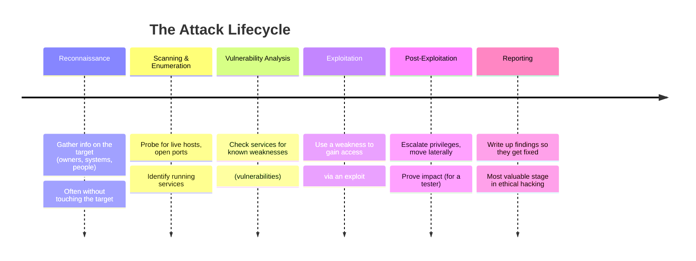
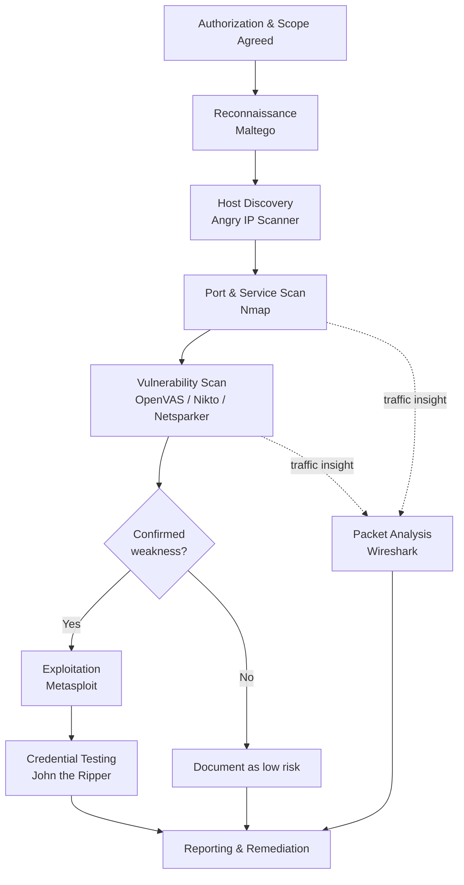
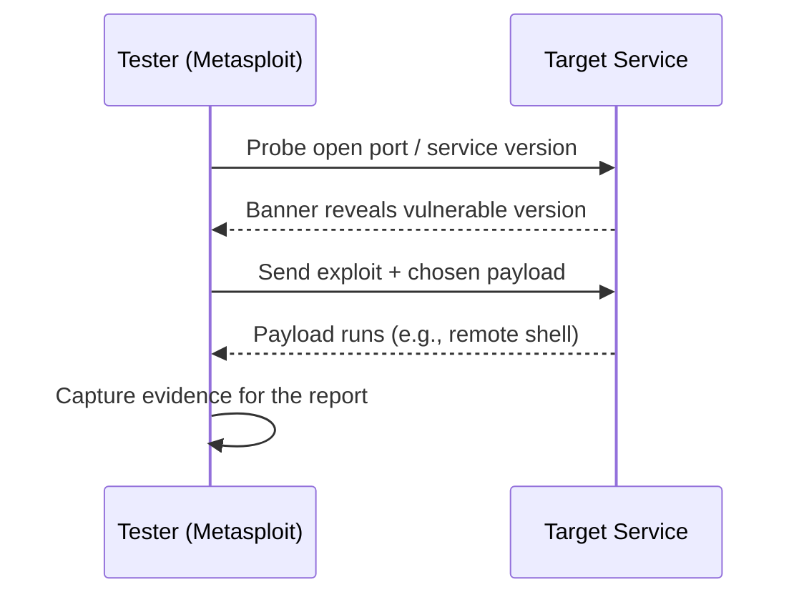
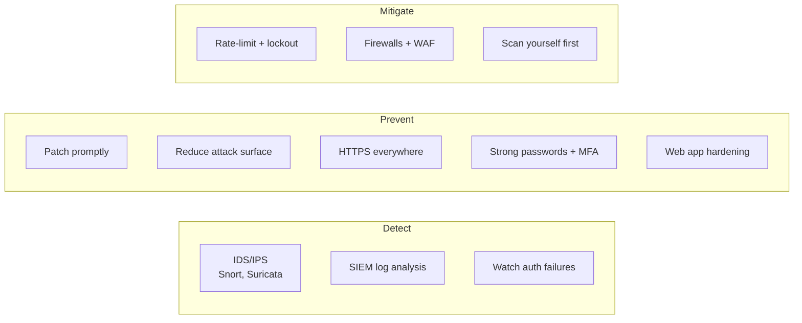
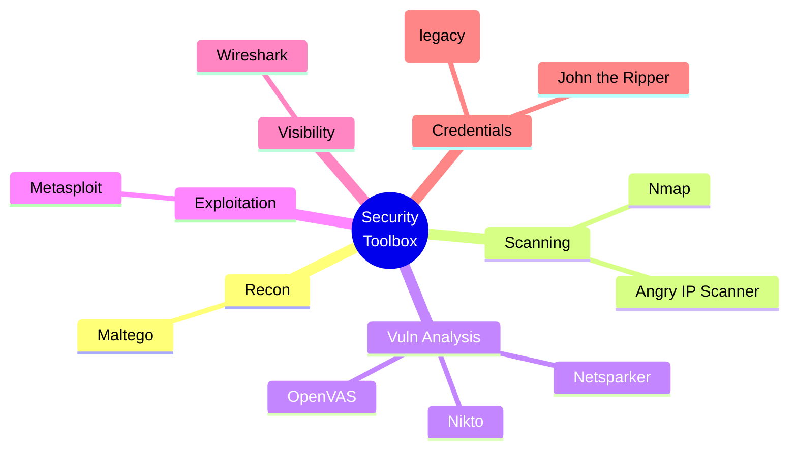

# 🛠️ Cyber Security Tools Intro

> **What you'll learn:** the essential security tools every ethical hacker uses — what each does and where it fits in the attack lifecycle.
>
> **Prerequisites:** basic comfort with a computer, knowing what an IP address and a website are, and a willingness to read carefully. No prior hacking experience required.

| | |
|---|---|
| 📘 **Course** | Ethical Hacking Foundation |
| 🔖 **Course code** | SKL-CEF-705 |
| 🧩 **Module** | Cyber Security Tools Intro |
| 🎚️ **Level** | Foundation |

---

> 📺 **Watch — top video on this topic:** [](https://www.youtube.com/watch?v=zsyhXbVum1Q) [Top 5 Cybersecurity Tools for Beginners: Wireshark, Nmap, Metasploit & More](https://www.youtube.com/watch?v=zsyhXbVum1Q)

---

## 1. In Plain English

Imagine you're hired to test how secure a building is. You wouldn't show up empty-handed — you'd bring a flashlight for dark corners, lock picks to test doors, a notebook to map entrances, and a camera to record findings. Each tool does one job well, and together they reveal far more than your eyes alone.

Ethical hacking works the same way. An **ethical hacker** (or *penetration tester* / "pentester") is hired to break into systems *with permission*, so the owner can fix weaknesses before a real criminal finds them. This module introduces the most important tools in that toolbox.

> 🔑 **Key idea:** Hacking is not one magic action — it's a **process**. Different tools help at different stages: find what's out there (recon) → look for weak spots (scanning) → try to get in (exploitation). By the end you won't have mastered any single tool, but you'll know the *map*: what exists, what it's for, and when to reach for it.

> ⚠️ **Warning — the non-negotiable rule:** Every tool here is **legal to learn and illegal to misuse.** Pointing these tools at systems you don't own or aren't authorized to test is a crime in most countries. We practice only on our own machines, on deliberately vulnerable practice systems, or with written permission. Keep this rule in your bones for the rest of your career.

---

## 2. Core Concepts

### 🗺️ The Attack Lifecycle (the map everything hangs on)

Before the tools, learn the **attack lifecycle** — the ordered stages an attacker (or authorized tester) moves through. Many frameworks describe this; here is a simple version.



| # | Stage | Goal | Touches target? |
|---|-------|------|-----------------|
| 1 | 🔍 **Reconnaissance** | Gather info (owners, systems, staff) | Often no |
| 2 | 📡 **Scanning & Enumeration** | Find live hosts, open **ports**, services | Yes |
| 3 | 🩺 **Vulnerability Analysis** | Find known **vulnerabilities** in services | Yes |
| 4 | 💥 **Exploitation** | Use a weakness (an **exploit**) to get in | Yes |
| 5 | 🪜 **Post-Exploitation** | Escalate, move laterally, prove impact | Yes |
| 6 | 📝 **Reporting** | Document findings for remediation | No |

> 💡 **Tip:** A **port** is a numbered "door" into a computer (0–65535) where a service listens. Every tool below slots into one or more of these stages.

### 🐧 Operating Systems Built for Security

Most of these tools run best on **Linux**. A *distribution* (or *distro*) is a complete packaged version of Linux, and two are purpose-built for security work:

| Distro | Maintainer | Strength | Best for |
|--------|-----------|----------|----------|
| 🐉 **Kali Linux** | Offensive Security | Hundreds of pre-loaded tools | A "workshop with every tool on the wall" |
| 🦜 **Parrot Security OS** | Parrot Project | Privacy focus + lightweight | Older or smaller machines |

You don't *have* to use these — the tools run on other systems — but they save enormous setup time. Beginners usually run them inside a **virtual machine** (a "computer within your computer," via VirtualBox or VMware) so they stay isolated and safe.

> 🖼️ *Suggested image: Kali Linux desktop showing the security tools menu*

### 🧰 Tool Families

The tools fall into rough families. Match the family to the job.

| Family | What it does | Examples |
|--------|--------------|----------|
| 📡 Network / port scanners | Find what's reachable | Nmap, Angry IP Scanner |
| 🩺 Vulnerability scanners | Check for known weaknesses | OpenVAS, Nikto, Netsparker |
| 💥 Exploitation frameworks | Attempt to break in | Metasploit |
| 🔬 Traffic / protocol analyzers | Read network conversations | Wireshark |
| 🔑 Password / credential tools | Test or recover passwords | John the Ripper, Cain (legacy) |
| 🕸️ Intelligence / mapping | Connect people, domains, infra | Maltego |

### 📖 Key vocabulary to anchor now

| Term | Meaning |
|------|---------|
| **Port** | Numbered channel (0–65535). Web → 80 (HTTP) / 443 (HTTPS); SSH → 22 |
| **Service** | A program listening on a port (web server, database, etc.) |
| **Vulnerability** | A flaw that can be abused; public ones get a **CVE** catalog ID |
| **Payload** | The action that runs after a successful break-in (e.g., a remote shell) |
| **Packet** | A small chunk of data sent across a network; conversations = many packets |

---

## 3. How It Works (Step by Step)

Let's walk through how an authorized tester uses these tools across the lifecycle. Picture a tester engaged to assess `lab.example.com` — a system they have **written permission** to test.

1. 🔍 **Reconnaissance — Maltego.** Map public info (domains, related IPs, email formats) to understand the target's footprint without aggressively touching it.
2. 📡 **Host & port discovery — Angry IP Scanner / Nmap.** Angry IP Scanner shows which addresses respond; Nmap digs deeper into open ports, services, and versions.
3. 🩺 **Vulnerability scanning — OpenVAS / Nikto / Netsparker.** OpenVAS checks the host broadly; Nikto and Netsparker focus on the web app, flagging misconfigurations and known issues.
4. 🔬 **Traffic inspection — Wireshark.** Capture packets to confirm what's actually on the wire — useful for spotting unencrypted data.
5. 💥 **Exploitation — Metasploit.** If a confirmed vulnerability allows it, safely demonstrate the weakness is real, choosing an exploit and payload.
6. 🔑 **Credential testing — John the Ripper.** If hashes are recovered (legally, in scope), test how weak they are.
7. 📝 **Reporting.** Document everything with evidence and remediation advice.



A single exploitation step, zoomed in, is really a short conversation between tester and target:



---

## 4. Real-World Examples

**🔬 Wireshark and unencrypted credentials.** In countless labs and real assessments, testers open Wireshark, log into a website using plain HTTP (not HTTPS), and watch the username and password appear in plain text in the captured packets. This is one of the most persuasive arguments for HTTPS everywhere — it makes an abstract risk visible in seconds.

> 🖼️ *Suggested image: Wireshark capture highlighting a plain-text HTTP POST with credentials*

**💥 Metasploit and EternalBlue (CVE-2017-0144).** In 2017, a Windows SMB vulnerability nicknamed *EternalBlue* was used by the WannaCry ransomware to spread across hundreds of thousands of machines worldwide. A matching Metasploit module lets authorized testers run it against patched-vs-unpatched lab machines to show defenders exactly why timely patching matters. **The lesson:** the same weakness criminals abuse is what ethical hackers safely demonstrate to drive fixes.

**📡 Nmap as the universal first step.** Almost every penetration test and many incident investigations begin with an Nmap scan to understand what's exposed. Its ubiquity is why it appears in training, audits, and even popular culture — it's the "look before you leap" tool of the field.

---

## 5. Tools of the Trade

> 💡 **Tip:** Tool flags shown are common, real options. Always check each tool's own `--help` or manual, as options evolve.

### 📊 Quick reference

| Tool | Family | Stage | Interface |
|------|--------|-------|-----------|
| 📡 **Nmap** | Port scanner | Scanning | CLI |
| 📡 **Angry IP Scanner** | Host discovery | Scanning | GUI |
| 🩺 **OpenVAS** | Vuln scanner | Vuln analysis | Web UI |
| 🩺 **Nikto** | Web server scanner | Vuln analysis | CLI |
| 🩺 **Netsparker** | DAST (web app) | Vuln analysis | GUI/dashboard |
| 💥 **Metasploit** | Exploit framework | Exploitation | CLI (`msfconsole`) |
| 🔬 **Wireshark** | Packet analyzer | All stages | GUI |
| 🔑 **John the Ripper** | Password cracker | Post-exploit | CLI |
| 🕸️ **Maltego** | OSINT / link analysis | Recon | GUI canvas |
| ⚠️ **Cain & Abel** | Legacy creds (Windows) | — | GUI (unmaintained) |

### 📡 Nmap — network mapper / port scanner

Finds live hosts, open ports, and service versions.

```bash
nmap -sV 192.168.56.101
```
`-sV` probes open ports and reports the **service version** on each. Output lists ports, their state (open/closed/filtered), and best-guess software versions.

> 🖼️ *Suggested image: terminal showing an Nmap -sV scan result table*

### 📡 Angry IP Scanner — fast, simple host discovery

Quickly shows which addresses in a range are alive. GUI-based and beginner-friendly: enter a range (e.g., `192.168.56.1`–`192.168.56.254`), click *Start*, and it pings each address, showing which respond and (optionally) which ports are open.

### 🩺 OpenVAS — open-source vulnerability scanner

Scans hosts against a large database of known vulnerabilities and produces a graded report. Usually driven through its web interface (part of the Greenbone framework): define a *target*, attach a *scan configuration*, launch a task; results are ranked by severity.

### 🩺 Nikto — web server scanner

Checks web servers for thousands of known issues and misconfigurations.

```bash
nikto -h http://192.168.56.101
```
`-h` specifies the host/URL to test. Nikto reports outdated server software, dangerous default files, and risky configuration items.

### 🩺 Netsparker — automated web application security scanner

A commercial **DAST** tool (Dynamic Application Security Testing — tests a *running* application from the outside). It crawls a web app and tries to confirm issues like SQL injection and cross-site scripting, aiming to reduce false alarms. Driven through its GUI/dashboard: point it at a target URL, configure scope, run a scan.

### 💥 Metasploit — exploitation framework

A framework for selecting and running exploits with chosen payloads, in a controlled, modular way.

```bash
msfconsole
search type:exploit eternalblue
```
`msfconsole` launches the interactive console; `search` finds modules by keyword. You then `use` a module, `set` options like `RHOSTS` (target), and `run` it — **only against authorized targets.**

> 🖼️ *Suggested image: msfconsole showing a search result and module options*

### 🔬 Wireshark — packet / protocol analyzer

Captures and decodes network traffic so you can see exactly what's on the wire. Pick an interface, start capturing, then narrow results with a **display filter**, e.g.:

```text
http.request.method == "POST"
```
This shows only HTTP POST requests — handy for spotting form submissions and potentially exposed credentials.

### 🔑 John the Ripper — password cracking / strength testing

Tests how resistant password hashes are by attempting to recover them.

```bash
john --wordlist=/usr/share/wordlists/rockyou.txt hashes.txt
```
`--wordlist` points John at a list of candidate passwords to try against the hashes in `hashes.txt`. Used to prove weak passwords are guessable — only on hashes you're authorized to test.

### 🕸️ Maltego — OSINT and link analysis

A visual tool that maps relationships between domains, IPs, people, and organizations using "transforms" (automated lookups). Used in reconnaissance to build a picture of a target's footprint. Operated through its graphical canvas; no single command line.

### ⚠️ Cain (and Abel) — legacy Windows credential tool

A historic Windows tool for password recovery and network sniffing.

> ⚠️ **Warning:** Cain & Abel is **no longer maintained and is considered legacy.** Modern testers use current alternatives. Mentioned for context only — do not rely on it.

---

## 6. Hands-On Lab (Authorized / Lab-Only)

> ⚠️ **Warning:** **Only run these steps against systems you own or are explicitly authorized to test.** Everything below targets your own machine — nothing else.

Welcome to your first lab. Take a breath — this is gentle and safe. We'll install **Nmap** and scan *your own computer*. You cannot harm anything by scanning yourself.

**Step 1 — Install Nmap.**

| Platform | Command / action |
|----------|------------------|
| 🐉 Kali / Parrot | Already installed — open a terminal |
| 🐧 Ubuntu / Debian | `sudo apt update && sudo apt install nmap` |
| 🍎 macOS (Homebrew) | `brew install nmap` |
| 🪟 Windows | Download the official installer from nmap.org and run it |

**Step 2 — Confirm it works.**

```bash
nmap --version
```
Prints the installed version. A version number means you're ready. `--version` just asks the program to identify itself — completely harmless.

**Step 3 — Scan your own machine.** Every computer refers to itself using the special address `127.0.0.1`, called **localhost** ("this computer here").

```bash
nmap 127.0.0.1
```

**What each part means:**
- `nmap` — the program.
- `127.0.0.1` — the target: *your own computer*. Scanning yourself is always allowed.

**Reading the output.** Nmap prints a small table. Example:

```text
PORT     STATE  SERVICE
631/tcp  open   ipp
```

| Column | Meaning |
|--------|---------|
| **PORT** | The door number and protocol (`tcp`) |
| **STATE** | `open` = something is listening; `closed` = nothing; `filtered` = a firewall blocks the view |
| **SERVICE** | Nmap's guess at the program (here, `ipp` = a printing service) |

> 💡 **Tip:** If you see *no open ports*, that's perfectly fine — it just means your machine isn't running listening services, which is actually good for security.

**Where to practice more (safely).** When ready for a richer target, set up **Metasploitable** — a deliberately vulnerable Linux VM made for practice — inside VirtualBox on an **isolated host-only network** so it can never reach the internet or your real network. Scan *that* VM, never anything else.

> 🔑 **Key idea:** Curiosity plus permission is the whole game. Go slowly and read every line of output.

---

## 7. Countermeasures & Defenses

The blue team (defenders) can detect and blunt almost everything above. Think of each offensive tool as having a matching defense.

| 🔴 Offensive technique | 🔵 Defense |
|------------------------|-----------|
| Port scanning (Nmap, Angry IP) | IDS/IPS (Snort, Suricata) detect scan patterns; close unused ports |
| Vuln scanning (OpenVAS, Nikto) | Patch promptly; web app hardening (input validation, secure coding) |
| Packet sniffing (Wireshark) | Enforce HTTPS / encryption everywhere |
| Exploitation (Metasploit) | Patch fast; network segmentation limits blast radius |
| Password cracking (John) | Strong password policy + MFA; rate-limiting + account lockout |



**🔎 Detect**
- Monitor for **port-scan patterns** (many connection attempts across ports quickly) using IDS/IPS such as Snort or Suricata.
- Centralize logs in a **SIEM** (Security Information and Event Management) to spot scanning and brute-force attempts.
- Watch for unusual authentication failures — a sign of password attacks (John-style cracking is offline, but online guessing is detectable).

**🛡️ Prevent**
- **Patch promptly** — most exploited vulnerabilities (like EternalBlue) had fixes available before they were widely abused.
- **Reduce attack surface** — close unused ports, disable unneeded services, segment networks so one compromised host can't reach everything.
- **Enforce HTTPS/encryption everywhere** so Wireshark-style sniffing reveals nothing useful.
- **Strong password policy + MFA** — long, unique passwords and multi-factor auth defeat wordlist cracking and stolen-password reuse.
- **Web application hardening** — input validation and secure coding stop the SQL injection / XSS issues Nikto and Netsparker hunt for.

**⚖️ Mitigate**
- **Rate-limiting and account lockout** slow online guessing.
- **Firewalls and WAFs** (Web Application Firewalls) filter hostile traffic.
- **Run your own scans first** — use these very tools defensively to find and fix weaknesses before attackers do.

---

## 8. Key Terms

| Term | Meaning |
|------|---------|
| **Ethical hacker / pentester** | A professional who tests systems for weaknesses *with authorization* |
| **Attack lifecycle** | The ordered stages from reconnaissance to reporting |
| **Port** | A numbered channel where a network service listens |
| **Service** | A program listening on a port |
| **Vulnerability** | A flaw that can be abused; catalogued publicly as a **CVE** |
| **Exploit** | Code or technique that takes advantage of a vulnerability |
| **Payload** | What runs after a successful exploit (e.g., a remote shell) |
| **Packet** | A unit of data sent over a network |
| **Distribution (distro)** | A complete, packaged version of Linux (e.g., Kali, Parrot) |
| **Virtual machine (VM)** | A software-emulated computer running inside your real one |
| **OSINT** | Open-Source Intelligence — info gathered from public sources |
| **DAST** | Dynamic Application Security Testing — scanning a running app from outside |
| **SIEM** | Central system for collecting and analyzing security logs |
| **localhost / 127.0.0.1** | The address a computer uses to refer to itself |

### 🧠 The toolbox at a glance



---

## 9. Summary & Takeaways

- ✅ Ethical hacking is a **process**, not a single act; tools map onto the stages of the **attack lifecycle**.
- ✅ **Kali Linux** and **Parrot Security OS** bundle the tools so you start fast — typically inside an isolated **virtual machine**.
- ✅ **Recon** (Maltego) → **discovery** (Angry IP Scanner, Nmap) → **vuln scanning** (OpenVAS, Nikto, Netsparker) → **exploitation** (Metasploit) → **credentials** (John the Ripper), with **Wireshark** giving visibility throughout.
- ⚠️ **Cain** is legacy and unmaintained — know it exists, but use modern tools.
- 🛡️ Every offensive tool has a **defensive use**: scan yourself, patch fast, encrypt traffic, enforce strong passwords and MFA.
- 🔑 The single unbreakable rule: **only test systems you own or are authorized to test.** Practice on localhost or Metasploitable on an isolated network.
- 🧭 Learning the *map* of tools matters more right now than mastering any one — depth comes later.

> **Further reading:** OWASP Testing Guide and OWASP Top 10; NIST SP 800-115 (Technical Guide to Information Security Testing and Assessment); MITRE ATT&CK framework; the official Nmap Reference Guide and Metasploit documentation.
