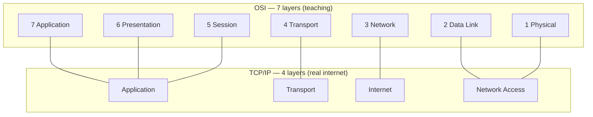
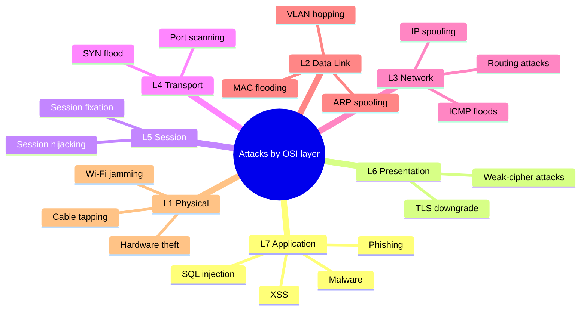
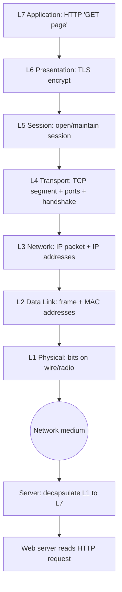
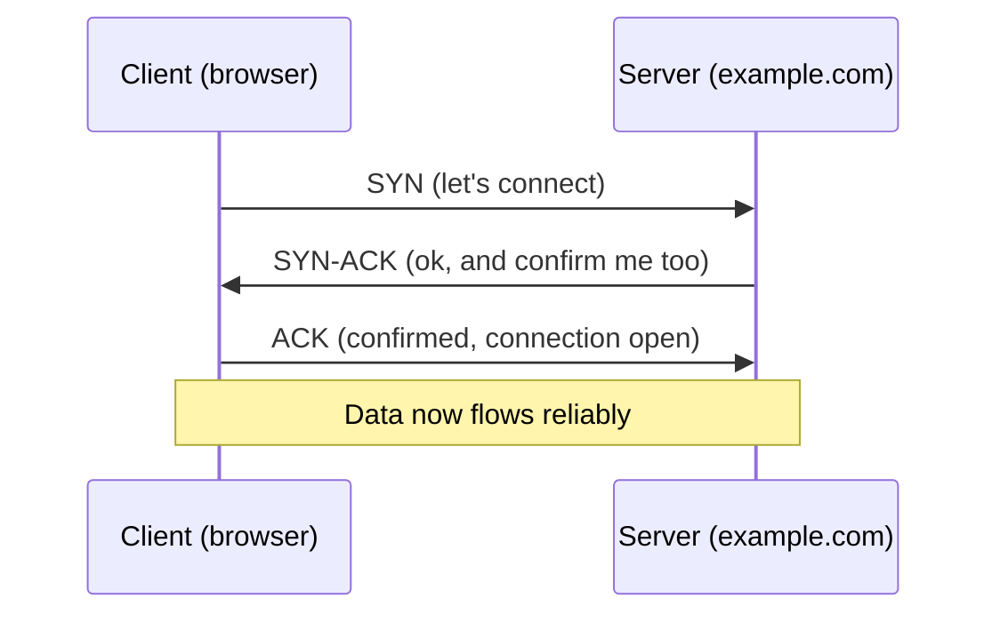

# Network Basics: OSI & TCP/IP Models

> **What you'll learn:** how data travels across a network, the two "maps" engineers use to describe that journey (OSI and TCP/IP), the core protocols, and how cyber attacks line up against each layer. **Prerequisites:** none — just basic comfort using a computer.

| Course | Course code | Module | Level |
|--------|-------------|--------|-------|
| Ethical Hacking Foundation | SKL-CEF-705 | Module 06 — Network Basics: OSI & TCP/IP Models | Foundation |

---

## 1. In Plain English 📬

Imagine mailing a birthday card. You write the message, seal the envelope, address it, and hand it to the post office — which figures out trucks, planes, and sorting centers. You don't need to know how planes fly. Each part of the system has **one job** and trusts the next part to do its own.

Computer networks work the same way. When you load a website, your message ("send me this page") gets wrapped in several "envelopes," each added by a different part of your computer:

- One knows the website's **address**.
- One makes sure **nothing gets lost**.
- One deals with the **physical wires or Wi-Fi signal**.

Breaking a big job into stacked, single-purpose layers is the single most important concept in networking.

The **OSI model** and **TCP/IP model** are two ways of describing those layers — two maps of the same city. One is drawn in great detail for teaching (OSI, 7 layers); the other is drawn for everyday practical use (TCP/IP, 4 layers). They describe the same reality.

> 🔑 **Key idea:** Almost every attack and every defense happens *at a specific layer*. A password-stealing trick targets a different layer than a Wi-Fi jamming attack. Name the layer, and you instantly know what an attack touches, which tools apply, and how to defend it. Learning the layers is like a doctor learning anatomy — you can't treat what you can't locate.

---

## 2. Core Concepts 🧠

### What is a "model" and why layers?

A **network model** splits the complex task of communication into smaller, ordered steps called **layers**. Each layer:

- Has **one clear responsibility**.
- Talks only to the layer **directly above and below** it.
- Adds its own piece of control information (a **header**) on the way out, and removes it on the way in.

This wrapping is **encapsulation** — each layer puts the data from the layer above into its own envelope. The reverse, unwrapping on arrival, is **decapsulation**.

### The OSI Model (7 layers)

**OSI** = **Open Systems Interconnection**, a standard from the **ISO** (International Organization for Standardization). It's mostly a *teaching and troubleshooting* model — not implemented exactly as-is, but everyone uses its vocabulary. Layers are numbered bottom (Layer 1) to top (Layer 7).

> 🖼️ *Suggested image: a labeled 7-layer OSI stack diagram (Physical at the bottom, Application at the top).*

| # | Layer | Job (plain words) | Example things | Data unit |
|---|-------|-------------------|----------------|-----------|
| 7 | 🖥️ Application | The layer the user/app interacts with | HTTP, DNS, SMTP | data |
| 6 | 🔐 Presentation | Translates / encrypts / compresses formats | TLS, JPEG, ASCII | data |
| 5 | 🤝 Session | Starts, manages, ends conversations | Login sessions, RPC | data |
| 4 | 🚚 Transport | Reliable (or fast) end-to-end delivery | TCP, UDP, ports | segment / datagram |
| 3 | 🗺️ Network | Logical addressing and routing | IP, routers, ICMP | packet |
| 2 | 🔗 Data Link | Local-link delivery; physical addressing | MAC, switches, ARP | frame |
| 1 | 📡 Physical | Actual signals on wire/fiber/radio | Cables, Wi-Fi radio, voltage | bits |

> 💡 **Tip — memory aid (top to bottom):** **A**ll **P**eople **S**eem **T**o **N**eed **D**ata **P**rocessing.

The data-unit names matter when reading tools' output: **data → segment/datagram → packet → frame → bits** as you descend.

### The TCP/IP Model (basics)

The **TCP/IP model** (named after its two most famous protocols, **TCP** and **IP**) is the model the real internet runs on. It collapses OSI's seven layers into four:

| TCP/IP Layer | Maps to OSI | Examples |
|--------------|-------------|----------|
| Application | 7, 6, 5 | HTTP, DNS, FTP, SMTP, TLS |
| Transport | 4 | TCP, UDP |
| Internet | 3 | IP, ICMP, ARP* |
| Network Access (Link) | 2, 1 | Ethernet, Wi-Fi, MAC |

> \*ARP is sometimes placed at the Link layer instead; categorizations vary slightly by textbook — this is normal.

Below, the two models side by side:



### OSI vs TCP/IP

| Aspect | OSI | TCP/IP |
|--------|-----|--------|
| Layers | 7 | 4 |
| Origin | ISO standard, theoretical | Built from real internet protocols |
| Main use | Teaching, troubleshooting | Actual implementation |
| Top layers | Splits App/Presentation/Session | Combines into one "Application" |
| Bottom layers | Splits Data Link/Physical | Combines into "Network Access" |
| Adoption | Reference vocabulary | Universally deployed |

Both describe the same journey: OSI is the detailed diagram, TCP/IP is the working machine.

### TCP/IP protocol suite overview

A **protocol** is an agreed-upon set of rules for communication — like agreeing to say "hello" before talking. The TCP/IP "suite" is the family of protocols that make the internet work:

| Protocol | Layer | Role |
|----------|-------|------|
| **IP** (Internet Protocol) | Network | Assigns addresses (e.g. `192.168.1.10`) and routes packets. *Connectionless and unreliable* — sends and hopes. |
| **TCP** (Transmission Control) | Transport | Rides on IP to add reliability: ordering, retransmission, and a connection handshake. |
| **UDP** (User Datagram) | Transport | Fast, no-frills: no handshake, no delivery guarantee. |
| **ICMP** (Internet Control Message) | Network | Diagnostic/error messages (used by `ping`). |
| **ARP** (Address Resolution) | Link | Maps an IP address to a physical MAC on the local network. |
| **DNS** (Domain Name System) | Application | Translates `example.com` into an IP — the internet's phone book. |
| **HTTP/HTTPS, SMTP, FTP, SSH** | Application | Web, email, file transfer, remote login. |

### TCP vs UDP vs IP

These three confuse beginners most, so let's be precise:

- **IP** is the *addressing and delivery truck* — it moves packets but makes no promises.
- **TCP** and **UDP** sit on top of IP at the Transport layer; they decide *how reliably* the cargo is handled.

| Feature | TCP | UDP | IP |
|---------|-----|-----|-----|
| Layer | Transport (4) | Transport (4) | Network (3) |
| Connection | Connection-oriented (handshake) | Connectionless | Connectionless |
| Reliability | Guaranteed, ordered, retransmits | Best-effort, no guarantee | Best-effort |
| Speed/overhead | Slower, more overhead | Fast, low overhead | n/a (carrier) |
| Uses ports | ✅ Yes | ✅ Yes | ❌ No |
| Typical uses | Web, email, file transfer | Streaming, DNS, VoIP, games | Underlies both |

> 💡 **Tip:** **Ports** are numbered "doors" (0–65535) that let one computer run many services at once — web on `443`, email on `25`. TCP and UDP use ports; IP does not.

### How cyber attacks map to each OSI layer

Every attack has a "home layer." This mindmap and table are the heart of why hackers learn OSI.



| Layer | Example attacks | Why |
|-------|-----------------|-----|
| 7 Application | SQL injection, XSS, phishing, malware | Exploits flaws in apps/users |
| 6 Presentation | TLS downgrade, weak-cipher attacks | Targets encryption/format handling |
| 5 Session | Session hijacking, session fixation | Steals/abuses logged-in sessions |
| 4 Transport | SYN flood, port scanning | Abuses TCP/UDP handshakes & ports |
| 3 Network | IP spoofing, ICMP floods, routing attacks | Forges addresses, abuses routing |
| 2 Data Link | ARP spoofing, MAC flooding, VLAN hopping | Abuses local switching/addressing |
| 1 Physical | Cable tapping, Wi-Fi jamming, hardware theft | Attacks the medium itself |

---

## 3. How It Works (Step by Step) 🔄

Let's follow one concrete journey: **you type `https://example.com` and press Enter.** Watch encapsulation in action and note where an attacker might interfere.

| Step | Layer | What happens | ⚠️ Attack surface |
|------|-------|--------------|-------------------|
| 1 | L7 Application | Browser forms an HTTP "GET homepage" request; DNS resolves `example.com` to an IP | DNS spoofing, phishing |
| 2 | L6 Presentation | TLS encrypts the request so eavesdroppers can't read it | TLS downgrade |
| 3 | L5 Session | A session is established/maintained so the server remembers you | Session hijacking |
| 4 | L4 Transport | TCP splits data into **segments**, adds **ports** (443), begins the **three-way handshake** | SYN flood, port scan |
| 5 | L3 Network | IP wraps each segment into a **packet** with source/dest IPs; routers forward hop by hop | IP spoofing |
| 6 | L2 Data Link | Each packet becomes a **frame** with MAC addresses for the next hop; ARP finds the MAC | ARP spoofing |
| 7 | L1 Physical | The frame becomes **bits** — electrical, light, or radio signals | Cable tap, jamming |

On arrival the server reverses every step (decapsulation): **bits → frame → packet → segment → data**, peeling off one header per layer until the web server reads your plain HTTP request.



> 🔑 **Key idea:** Each downward step *adds* an envelope (header); each upward step on the far side *removes* one. That single idea explains nearly all of networking.

The TCP three-way handshake at step 4 deserves its own picture, since several attacks target it directly:



---

## 4. Real-World Examples 🌍

**1. Dyn DNS DDoS (2016) — a Transport/Network flood with Application impact.**
The Mirai botnet (hijacked internet-connected cameras and routers) flooded the DNS provider Dyn. Because DNS relies heavily on UDP at the Transport layer, it was overwhelmed, and major sites like Twitter and Spotify went unreachable. A low-stack flood knocked out high-level services everyone depends on.

**2. ARP spoofing on public Wi-Fi — a Data Link (L2) attack.**
On an open café network, an attacker sends forged ARP messages claiming "I am the router." Other devices route traffic through the attacker (a man-in-the-middle position). A textbook Layer 2 attack — and a major reason HTTPS (higher-layer encryption) matters even on untrusted networks.

**3. SYN flood denial-of-service — a Transport (L4) attack.**
An attacker sends many TCP SYN packets (handshake step 1) but never completes the handshake. The server holds half-open connections until resources run out and legitimate users can't connect. A direct abuse of the three-way handshake.

> 🖼️ *Suggested image: news screenshot / outage map from the October 2016 Dyn DDoS showing affected regions.*

---

## 5. Tools of the Trade 🛠️

These tools let you *observe* the layers in action. All examples are read-only or run against your own machine.

| Tool | Layer | What it shows | Example |
|------|-------|---------------|---------|
| `ping` | L3 (ICMP) | Host reachability + round-trip time | `ping -c 4 127.0.0.1` |
| `traceroute` / `tracert` | L3 | Every router (hop) a packet passes | `traceroute 8.8.8.8` |
| Wireshark / `tshark` | L2–L7 | Frames, packets, segments + headers | `tshark -i lo -c 5` |
| `netstat` / `ss` | L4 | Open ports and active connections | `ss -tuln` |

### ping (ICMP, Layer 3)
```bash
ping -c 4 127.0.0.1
```
`-c 4` sends exactly 4 packets to `127.0.0.1` (your own "loopback" address) instead of pinging forever. You'll see reply times in milliseconds.

### traceroute / tracert (Layer 3)
```bash
traceroute 8.8.8.8
```
Lists the path your packets take toward Google's public DNS, one router per line. On Windows the command is `tracert`.

### Wireshark / tshark (Layers 2–7)
```bash
tshark -i lo -c 5
```
`-i lo` captures on the loopback interface (your own machine); `-c 5` stops after 5 packets so you aren't overwhelmed. Each line shows protocol details across layers.

> 🖼️ *Suggested image: Wireshark capture window highlighting the Ethernet, IP, and TCP header sections for one packet.*

### netstat / ss (Layer 4)
```bash
ss -tuln
```
`-t` TCP, `-u` UDP, `-l` listening sockets only, `-n` numeric ports. Output reveals which services are listening and on which ports.

> 🖼️ *Suggested image: terminal showing `ss -tuln` output with listening ports.*

---

## 6. Hands-On Lab (Authorized / Lab-Only) 🧪

> ⚠️ **Warning:** Perform these steps only on systems you own or are explicitly authorized to test — here, your own computer.

This is your first lab, so we'll keep it gentle and completely safe. You won't attack anything — you'll just *watch* a single packet travel and confirm a tool works. Nothing here can harm your machine.

**Goal:** use `ping` to send a few packets to your own computer and understand the output.

**Step 1 — Open a terminal.**
- macOS/Linux: open the **Terminal** app.
- Windows: open **Command Prompt** or **PowerShell**.

**Step 2 — Run one safe command.**
```bash
ping -c 4 127.0.0.1
```
- `ping` is the tool (ICMP at Layer 3).
- `-c 4` means "send 4 packets, then stop." (On Windows use `ping -n 4 127.0.0.1` — `-n` is the equivalent.)
- `127.0.0.1` is the **loopback address** — "this very computer." You're pinging *yourself*, so no traffic leaves your machine. The safest possible target.

**Step 3 — Read the output.** You'll see lines like:
```
64 bytes from 127.0.0.1: icmp_seq=0 ttl=64 time=0.045 ms
```

| Field | Meaning |
|-------|---------|
| `64 bytes` | Size of the reply packet |
| `icmp_seq=0` | Packet number (0,1,2,3) |
| `ttl=64` | "Time to live" — counter that prevents packets looping forever |
| `time=0.045 ms` | Round-trip time (pinging yourself is near-instant) |

At the end you'll see a summary like `4 packets transmitted, 4 received, 0% packet loss`. That `0% packet loss` means every packet made the round trip — success!

> 💡 **Tip — going further (still safe):** Install **Metasploitable**, a deliberately vulnerable practice VM, inside virtualization software (e.g. VirtualBox) on an **isolated, host-only network**. It exists so beginners can practice without touching real systems. For this first lab, `127.0.0.1` is plenty. Well done — you've observed Layer 3 in action.

> 🖼️ *Suggested image: terminal showing a successful `ping 127.0.0.1` run with the 0% packet loss summary.*

---

## 7. Countermeasures & Defenses 🛡️

How the blue team (defenders) protect each part of the stack — attack vs defense, layer by layer.


*Packets traverse the network stack through filtering hooks (Netfilter/iptables) — the basis for the firewall and filtering defenses below. Source: Wikimedia Commons.*


| Layer | Example attack | Primary defenses |
|-------|----------------|------------------|
| 7 Application | SQLi, XSS, phishing | Validate/sanitize input; Web Application Firewall (WAF); phishing training |
| 6/5 Presentation/Session | TLS downgrade, session hijacking | Enforce strong modern TLS, disable weak ciphers; secure random session tokens, expire/rotate, bind to HTTPS |
| 4 Transport | SYN flood, port scan | SYN cookies + rate limiting; close unused ports, firewall the rest |
| 3 Network | IP spoofing, ICMP flood | Ingress/egress filtering of spoofed addresses; DDoS mitigation/scrubbing |
| 2 Data Link | ARP spoofing, MAC flooding | Dynamic ARP Inspection + port security; VLAN segmentation, restrict trunk ports |
| 1 Physical | Cable tap, theft | Lock server rooms/cabinets; tamper-evident cabling; secured wireless |

**Cross-cutting (all layers):**
- 🧱 **Defense in depth** — assume any single layer can fail.
- 👁️ Continuous monitoring and intrusion detection (IDS/IPS).
- 🔧 Keep software patched; log and review traffic; apply least privilege.

---

## 8. Key Terms 📖

| Term | Meaning |
|------|---------|
| **Protocol** | An agreed set of rules for how computers communicate |
| **OSI model** | 7-layer reference model used to teach and troubleshoot |
| **TCP/IP model** | Practical 4-layer model the real internet runs on |
| **Encapsulation** | Wrapping data with a header at each layer on the way out |
| **Header** | Control information one layer adds to the data |
| **Packet / Frame / Segment** | Data-unit names at the Network, Data Link, and Transport layers |
| **TCP** | Reliable, connection-oriented Transport protocol (handshake, retransmission) |
| **UDP** | Fast, connectionless Transport protocol with no delivery guarantee |
| **IP** | Network-layer protocol that addresses and routes packets |
| **Port** | Numbered endpoint (0–65535) that lets one host run many services |
| **MAC address** | Hardware address used at the Data Link layer for local delivery |
| **ARP** | Maps an IP address to a MAC address on a local network |
| **DNS** | Translates domain names into IP addresses |
| **Three-way handshake** | TCP's SYN → SYN-ACK → ACK sequence that opens a connection |
| **Loopback (127.0.0.1)** | An address meaning "this same computer" |

---

## 9. Summary & Takeaways ✅

- Networking works by stacking single-purpose **layers**; each adds and removes its own envelope (**encapsulation/decapsulation**).
- The **OSI model** has 7 layers (great for teaching); the **TCP/IP model** has 4 (what the internet actually uses). They describe the same journey.
- **IP** addresses and routes; **TCP** adds reliability with a handshake; **UDP** trades reliability for speed.
- **Ports** let one machine run many services; TCP and UDP use them, IP does not.
- Nearly every attack has a "home layer" — naming the layer tells you its target, the right tools, and the right defense.
- Tools like `ping`, `traceroute`, Wireshark, and `ss` let you *see* the layers — start by observing on your own machine.
- **Defense in depth** means protecting every layer, because any single layer can fail.

> ⚠️ **Warning:** Always practice offensive techniques only on systems you own or are explicitly authorized to test.

**Further reading:** OSI reference model standard (ISO/IEC 7498-1); NIST SP 800-series networking guidance; OWASP Top 10 (application-layer threats); MITRE ATT&CK Enterprise matrix.
