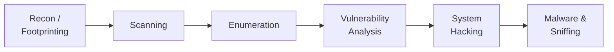

# Course 2 · Professional Level 1

**Code:** `SKL-CSP1-710` · **Learning hours:** 60 · **Level:** Intermediate

Now you start *doing*. This course follows the **early phases of a real attack**
in order: set up your lab, gather information (recon), find live hosts and open
ports (scanning), pull out details (enumeration), find weaknesses (vulnerability
analysis), break in (system hacking), and understand the malware and sniffing
techniques attackers rely on.

## Modules
1. [Cyber Security Introduction & Kali Setup](module-01-cyber-security-introduction.md)
2. [Footprinting and Reconnaissance](module-02-footprinting-and-reconnaissance.md)
3. [Scanning Networks](module-03-scanning-networks.md)
4. [Enumeration](module-04-enumeration.md)
5. [Vulnerability Analysis](module-05-vulnerability-analysis.md)
6. [System Hacking](module-06-system-hacking.md)
7. [Malware Threats](module-07-malware-threats.md)
8. [Sniffing](module-08-sniffing.md)

## The attack lifecycle you'll follow

⬅️ Prev: [Course 1](../01-ethical-hacking-foundation/) · ➡️ Next: [Course 3 · Professional Level 2](../03-professional-level-2/)
