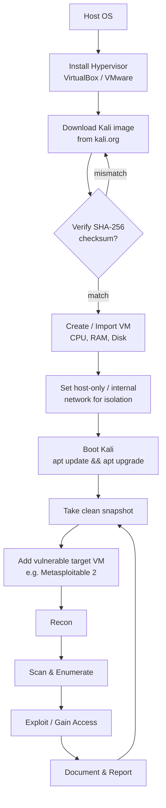

# Cyber Security Introduction & Kali Setup

> What you'll learn: the big-picture ideas behind cyber security and ethical hacking, how to install and configure Kali Linux in a virtual machine, and the essential Linux command-line skills every beginner needs. Prerequisites: a computer with virtualization support (Intel VT-x / AMD-V), at least 8 GB RAM, ~40 GB free disk space, and basic comfort with a keyboard — no prior security or Linux experience required.

| Field | Value |
|-------|-------|
| Course | Skillogic Cyber Security Professional |
| Course code | SKL-CSP1-710 |
| Module | Cyber Security Introduction & Kali Setup |
| Level | Professional Level 1 (level1) |

---

## 1. In Plain English

Imagine your house. You have doors with locks, maybe a fence, perhaps a camera over the porch, and a habit of checking that the windows are shut before bed. **Cyber security** is exactly the same idea, except the "house" is your data and the computer systems that hold it — your email, your bank account, a company's customer database, a hospital's patient records. The "burglars" are people (or automated programs) trying to get in to steal, damage, or hold things for ransom.

Now imagine you hired a locksmith to deliberately try to break into your own house — not to rob you, but to find the weak spots before a real burglar does. That is **ethical hacking** (also called penetration testing or "pentesting"): security professionals attack systems *with permission* to discover vulnerabilities so they can be fixed. The word "ethical" is doing heavy lifting here — the only difference between an ethical hacker and a criminal is **authorization** and **intent**.

To do this job, ethical hackers need a toolbox. **Kali Linux** is the most popular one: a free operating system that comes pre-loaded with hundreds of security tools, like a mechanic's rolling tool chest that arrives already stocked. Instead of installing it on your main computer (where a mistake could break things), we run it inside a **virtual machine (VM)** — a fully working computer that exists only as software, safely sandboxed inside your real computer.

Why should a total beginner care? Because almost everything you value now lives on a network, and the demand for people who can defend it vastly outstrips supply. Learning to think like an attacker — safely and legally — is the fastest way to learn how to defend. This module is the foundation: by the end you'll have a working lab and the command-line fluency to actually *use* it.

---

## 2. Core Concepts

### What "Cyber Security" Actually Protects: the CIA Triad

Security professionals describe their goal with three words, known as the **CIA triad** (no relation to the spy agency):

- **Confidentiality** — keeping information secret from those who shouldn't see it. Example: encrypting a password file so a thief who copies it still can't read it.
- **Integrity** — making sure data isn't tampered with. Example: detecting if someone changed a bank balance from $100 to $100,000.
- **Availability** — keeping systems up and reachable for legitimate users. Example: defending against a flood of fake traffic that knocks a website offline.

Every attack you'll ever study violates at least one of these. Every defense protects at least one. Keep this triad in your head as a checklist.

### Vulnerability, Threat, Exploit, and Risk

These four words are often confused. Define them once and use them precisely:

- **Vulnerability** — a weakness in a system (an unlocked window). Example: software that hasn't been updated and contains a known bug.
- **Threat** — anything that could exploit a vulnerability (a burglar walking down the street). It's the *potential* danger.
- **Exploit** — the actual technique or code used to take advantage of a vulnerability (the crowbar that pries the window open).
- **Risk** — the combination of how likely an attack is and how bad it would be if it happened. Risk = Threat × Vulnerability × Impact, roughly speaking.

### Ethical Hacking vs. Malicious Hacking

The skills are identical; the framing is not. Hackers are often grouped by "hat color":

| Hat | Authorization | Intent |
|-----|---------------|--------|
| White hat | Yes — explicit permission | Improve security |
| Black hat | No | Personal gain / harm |
| Grey hat | Often none, but no malice | Mixed; legally risky |

An ethical hacker always operates under a **scope** (what they're allowed to test) and a **rules of engagement** document, usually backed by a signed contract or, for learning, an intentionally vulnerable practice target. Testing a system you don't own or have written permission to test is a crime in most countries (e.g., the Computer Fraud and Abuse Act in the US, the Computer Misuse Act in the UK).

### The Penetration Testing Phases

Professional ethical hacking follows a repeatable lifecycle. A common model (aligned with EC-Council and PTES — the Penetration Testing Execution Standard) is:

1. **Reconnaissance** — gather information about the target (domains, IPs, employees). Can be *passive* (no contact, e.g. Google searches) or *active* (directly probing).
2. **Scanning / Enumeration** — find live hosts, open ports, running services, and their versions.
3. **Gaining Access (Exploitation)** — use a vulnerability to get a foothold.
4. **Maintaining Access** — keep that foothold to simulate what a real attacker would do.
5. **Covering Tracks / Reporting** — in real engagements, the critical final step is a clear report so defenders can fix what was found. (Criminals cover tracks; ethical hackers document.)

### What Kali Linux Is

**Kali Linux** is a Debian-based Linux distribution maintained by Offensive Security, purpose-built for penetration testing and digital forensics. "Debian-based" means it shares the same package system and command structure as Debian/Ubuntu, so skills transfer. Its value is that it ships with 600+ pre-installed security tools (Nmap, Metasploit, Wireshark, Burp Suite, and many more), saving you days of setup.

### What a Virtual Machine Is

A **virtual machine (VM)** is a software emulation of a physical computer. A program called a **hypervisor** (VirtualBox or VMware are the common free/cheap options) carves out a slice of your real machine's CPU, RAM, and disk and presents it to a "guest" operating system as if it were real hardware. Benefits for security learning:

- **Isolation** — malware or a mistake stays inside the VM (a sandbox), not your real machine.
- **Snapshots** — save the VM's exact state and roll back instantly if something breaks.
- **Disposability** — delete and recreate freely.

### NAT vs. Host-Only Networking

When you create a VM, you choose how it talks to the network. Two beginner-relevant modes:

- **NAT (Network Address Translation)** — the VM shares your host's internet connection but is hidden behind it. Good default; the VM can reach the internet but isn't directly reachable from your LAN.
- **Host-only** — the VM can talk to your host and other VMs but **not** the internet. This is the safest mode for an attack lab, because your vulnerable target machine is isolated from the outside world.

For a practice lab containing intentionally vulnerable machines, **host-only** (or an internal network) is strongly preferred so you never expose a deliberately broken machine to the internet.

---

## 3. How It Works (Step by Step)

Here's the end-to-end flow of setting up the lab and running a first authorized assessment, tying the concepts together.

1. **Install a hypervisor** (VirtualBox or VMware) on your host operating system.
2. **Download the Kali image.** Offensive Security publishes a pre-built VM image (faster) and an installer ISO. Always download from the official `kali.org` site.
3. **Verify the download** by comparing its SHA-256 checksum to the value published by Kali. This proves the file wasn't corrupted or tampered with (an **integrity** check — there's the CIA triad in action).
4. **Create / import the VM**, allocating CPU cores, RAM (4 GB+ recommended), and disk.
5. **Set networking** to host-only or an internal network so the lab is isolated.
6. **Boot Kali, update it**, and take a clean snapshot you can always return to.
7. **Add a vulnerable target VM** (e.g., Metasploitable 2) on the same isolated network.
8. **Run the pentest lifecycle** against the target: recon → scan → enumerate → exploit → report.



---

## 4. Real-World Examples

**WannaCry (2017).** A ransomware worm spread to an estimated 200,000+ computers across 150 countries in days. It exploited a known Windows SMB (file-sharing) vulnerability for which a patch already existed. The UK's National Health Service was hit hard, forcing some hospitals to divert patients. Lesson for this module: the attack succeeded against systems that hadn't applied an available update — the gap between "vulnerability known" and "vulnerability patched" is where attackers live. Ethical hackers exist to close that gap proactively.

**Equifax (2017).** Attackers exploited an unpatched vulnerability in the Apache Struts web framework, eventually exposing personal data of roughly 147 million people. A timely vulnerability scan and patch — the kind of routine assessment this course teaches — would have flagged the weakness. This breach violated **confidentiality** at massive scale.

**Authorized scenario — a small business engagement.** A 50-person company hires a pentester. The pentester signs a scope document limiting testing to two specific public IP addresses. They spin up Kali in a VM, run reconnaissance and a port scan, find an outdated web server, confirm (without disrupting service) that it's exploitable, and deliver a report recommending an upgrade. No data is stolen, nothing breaks, and the company fixes the hole before a black hat finds it. This is the entire job in miniature — and it all starts from the lab you build in this module.

---

## 5. Tools of the Trade

These ship with Kali. You'll use them throughout the course; here is a first taste.

### Nmap (Network Mapper)
Discovers live hosts, open ports, and the services/versions running on them — the workhorse of the scanning phase.

```bash
nmap -sV -O 192.168.56.101
```
`-sV` probes open ports to detect service versions; `-O` attempts to guess the operating system; the final value is the target's IP. Output lists each open port with its likely service and version.

### Metasploit Framework
A platform of ready-made exploits and payloads used to validate that a vulnerability is actually exploitable.

```bash
msfconsole
```
Launches the interactive console. Inside, you `search` for an exploit, `use` it, `set` options like `RHOSTS` (target), and `run` it. (Detailed exploitation comes in later modules.)

### Wireshark
A graphical packet analyzer that captures and inspects network traffic — invaluable for understanding what's actually moving across the wire.

```bash
wireshark &
```
The `&` launches it in the background so your terminal stays free. You then pick a network interface and watch packets in real time.

### apt (package manager)
Installs, updates, and removes software on Debian-based systems like Kali.

```bash
sudo apt update && sudo apt full-upgrade -y
```
`apt update` refreshes the list of available packages; `full-upgrade` installs the newest versions; `-y` auto-confirms. Run this right after first boot.

---

## 6. Hands-On Lab (Authorized / Lab-Only)

> Reminder: perform these steps **only** against systems you own or are explicitly authorized to test — here, your own isolated lab VMs. Never point these tools at machines or networks you don't control.

**Goal:** Build the lab, then perform reconnaissance and scanning against an intentionally vulnerable target (**Metasploitable 2**, a deliberately broken Linux VM made for practice).

**Setup:** Two VMs on the same **host-only** network — Kali (your attacker) and Metasploitable 2 (your target). Confirm both are on the `192.168.56.0/24` host-only network (your numbers may differ).

### Step 1 — Confirm Kali's own network details
```bash
ip addr show
```
Look for an interface (often `eth0`) with an `inet` line like `192.168.56.102/24`. That's Kali's address. Note the network — you'll scan the rest of it to find the target.

### Step 2 — Discover live hosts on the lab network
```bash
nmap -sn 192.168.56.0/24
```
`-sn` does a "ping sweep" — it finds which hosts are up without scanning ports. Expected output is a short list of `Nmap scan report for 192.168.56.x  Host is up`. One of those (not Kali's own IP, not the gateway `.1` or `.100`) is Metasploitable. Suppose it's `192.168.56.101`.

### Step 3 — Scan the target's ports and service versions
```bash
nmap -sV 192.168.56.101
```
Expected output (Metasploitable 2 is famously open):
```
PORT     STATE SERVICE     VERSION
21/tcp   open  ftp         vsftpd 2.3.4
22/tcp   open  ssh         OpenSSH 4.7p1 Debian
23/tcp   open  telnet      Linux telnetd
80/tcp   open  http        Apache httpd 2.2.8
3306/tcp open  mysql       MySQL 5.0.51a
...
```
**How to read it:** each line is an open door. The `VERSION` column is gold — old versions (like `vsftpd 2.3.4`) are publicly documented as vulnerable. You've just completed enumeration: you know what's running and how old it is.

### Step 4 — Identify which findings matter
Open Telnet (port 23) and FTP (21) transmit credentials in plaintext — a **confidentiality** problem. The aged Apache and MySQL versions are integrity/availability concerns. Write these down; this list *is* the start of a pentest report.

### Step 5 — Browse the web service (safe, read-only validation)
```bash
curl -I http://192.168.56.101
```
`-I` fetches only the HTTP headers. You'll see a `Server: Apache/2.2.8` header confirming the version Nmap reported. Cross-confirming a finding with a second tool is good practice.

### Step 6 — Save your evidence
```bash
nmap -sV -oN ~/lab/metasploitable_scan.txt 192.168.56.101
```
`-oN` writes a clean "normal" report to a file. Real engagements live or die by good notes — get in the habit now.

**Interpretation of the whole lab:** in six commands you found the target, mapped its attack surface, identified concrete weaknesses, and saved evidence — the recon-and-scan core of every assessment, performed safely inside an isolated lab.

---

## 7. Countermeasures & Defenses

The blue team (defenders) counters exactly what you just did. Grouped by goal:

**Reduce the attack surface**
- Close unused ports and disable unneeded services (the fewer open doors, the better).
- Replace insecure protocols: use SSH instead of Telnet, SFTP/FTPS instead of plain FTP.
- Apply the principle of **least privilege** — accounts and services get only the access they need.

**Patch and harden**
- Keep operating systems and software fully updated; the WannaCry and Equifax breaches were both unpatched-software failures.
- Use **vulnerability scanners** (e.g., OpenVAS, Nessus) on a schedule to catch weaknesses before attackers do.
- Remove default credentials and disable unused accounts.

**Detect**
- Deploy an **IDS/IPS** (Intrusion Detection/Prevention System, e.g., Snort or Suricata) to flag or block scans and exploit attempts.
- Centralize logs into a **SIEM** (Security Information and Event Management) so suspicious patterns — like a port scan from one host — are visible.
- Monitor for the noisy reconnaissance traffic that tools like Nmap generate.

**Contain and respond**
- Segment networks so a breach in one area can't reach everything (your host-only lab is segmentation in miniature).
- Use firewalls to restrict traffic to only what's required.
- Maintain an incident response plan and tested backups (the antidote to ransomware).

---

## 8. Key Terms

- **Cyber security** — the practice of protecting systems and data from unauthorized access, alteration, or disruption.
- **Ethical hacking / penetration testing** — authorized simulated attacks performed to find and fix vulnerabilities.
- **CIA triad** — Confidentiality, Integrity, Availability; the three goals of security.
- **Vulnerability** — a weakness that can be exploited.
- **Threat** — a potential cause of an unwanted incident.
- **Exploit** — a technique or piece of code that takes advantage of a vulnerability.
- **Risk** — the likelihood and impact of a threat exploiting a vulnerability.
- **Scope / Rules of Engagement** — the agreed boundaries and rules for an authorized test.
- **Kali Linux** — a Debian-based distro pre-loaded with security tools.
- **Virtual machine (VM)** — a software-emulated computer running on a host.
- **Hypervisor** — software (VirtualBox/VMware) that creates and runs VMs.
- **Snapshot** — a saved VM state you can roll back to.
- **NAT / Host-only networking** — VM network modes; host-only isolates the VM from the internet.
- **Reconnaissance** — the information-gathering phase of an attack.
- **Enumeration** — listing services, versions, and details of a target.
- **Metasploitable 2** — an intentionally vulnerable Linux VM for practice.

## 9. Summary & Takeaways

- Cyber security protects **Confidentiality, Integrity, and Availability** — use the CIA triad as your mental checklist for every attack and defense.
- **Ethical hacking is defined by authorization and intent**; the same skills used legally protect, used illegally are crimes. Always have a documented scope.
- Learn the **pentest lifecycle** — recon, scanning/enumeration, exploitation, maintaining access, reporting — because every engagement follows it.
- **Kali Linux** gives you a pre-stocked toolbox; running it in a **VM** keeps your experiments isolated, snapshot-able, and disposable.
- Use **host-only networking** and **snapshots** so your lab is safe and recoverable, and always **verify downloads** by checksum.
- Real breaches like **WannaCry** and **Equifax** stemmed from unpatched, known vulnerabilities — proactive scanning and patching is the core defense.
- The blue team counters reconnaissance by **reducing attack surface, patching, detecting (IDS/SIEM), and segmenting** networks.
- Basic **Linux command-line fluency** (`nmap`, `apt`, `ip addr`, `curl`, file navigation) is the prerequisite skill that makes every later module possible.

**Further reading:** OWASP Testing Guide; NIST SP 800-115 (Technical Guide to Information Security Testing and Assessment); MITRE ATT&CK framework; official Kali Linux documentation (kali.org/docs) and the Penetration Testing Execution Standard (PTES).
