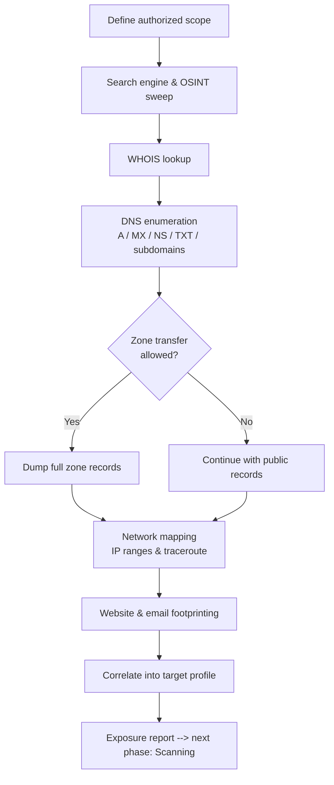

# Footprinting and Reconnaissance

> What you'll learn: how attackers (and ethical hackers) quietly gather information about a target before ever touching it, and how defenders shrink that exposed surface.
> Prerequisites: basic networking (IP, DNS, HTTP), comfort with a Linux terminal, and Module 01 (Introduction to Ethical Hacking).

| Course | Course code | Module | Level |
|--------|-------------|--------|-------|
| Skillogic CSPP – Professional Level 1 | SKL-CSP1-710 | Module 02: Footprinting and Reconnaissance | level1 |

---

## 1. In Plain English

Imagine a burglar who wants to break into a house. A clumsy one just walks up and rattles the door. A smart one watches first: when do the lights go off, which windows have no locks, is there a dog, does a delivery van show up every Tuesday? They build a complete picture *before* doing anything risky. **Footprinting and reconnaissance** is exactly that "watch first" phase, but for computer systems and organizations.

**Reconnaissance** means information gathering. **Footprinting** is the specific reconnaissance step where you collect a "footprint" — a profile — of a target organization: its domain names, IP addresses, employee emails, the software it runs, even the names and habits of its staff. The clever part is that most of this information is *already public*. Companies publish it on their websites, in job postings, in domain registration records, and across social media, without realizing an attacker is quietly assembling it all.

Why should a total beginner care? Because nearly every real-world cyberattack starts here. You cannot defend what you don't know is exposed. By learning how attackers footprint, you learn to see your own organization the way they do — and then you can close the doors and windows they were counting on. This is the very first phase of every ethical hacking engagement and penetration test.

A key idea throughout: footprinting is mostly **passive**. The attacker often never sends a single packet to the target's systems. They read public records and search results instead, leaving almost no trace. That stealth is exactly why it works so well and why defenders must think about exposure, not just intrusion.

---

## 2. Core Concepts

### 2.1 Footprinting

**Footprinting** is the process of collecting as much information as possible about a target system, network, or organization to find ways to intrude. The output is a detailed map: domains, subdomains, IP ranges, operating systems, employee names and emails, technologies in use, and physical locations.

There are two flavors:

- **Passive footprinting** — gathering information *without directly interacting* with the target's systems. You use search engines, public databases, and social media. The target generally cannot detect this.
- **Active footprinting** — gathering information by *directly engaging* the target, for example sending DNS queries to its servers or pinging hosts. This can leave log entries and is detectable.

### 2.2 Reconnaissance vs. Footprinting

These terms are often used interchangeably. Reconnaissance is the broad first phase of the attack lifecycle; footprinting is the structured information-gathering activity within it. In practice, "footprinting and reconnaissance" together mean: *learn everything you legally can about the target before scanning or attacking.*

### 2.3 OSINT (Open-Source Intelligence)

**OSINT** is intelligence collected from publicly available, legal sources: websites, news, public records, social media, leaked-but-public databases, satellite imagery, and so on. "Open-source" here does **not** mean open-source software — it means open, public sources of *information*. OSINT is the engine that powers most passive footprinting. The skill is not finding data (it's everywhere) but *correlating* scattered pieces into a useful picture.

### 2.4 Footprinting Through Search Engines

Search engines index far more than people realize. Using advanced search operators ("Google dorking") an attacker can find exposed files, login pages, error messages, and configuration data. Common operators:

| Operator | What it finds |
|----------|---------------|
| `site:example.com` | Pages only on a specific domain |
| `filetype:pdf` | Documents of a specific type |
| `intitle:"index of"` | Open directory listings |
| `inurl:admin` | URLs containing a keyword like "admin" |
| `cache:example.com` | A cached (older) copy of a page |

Combining them — `site:example.com filetype:xls password` — can surface spreadsheets that were never meant to be public.

### 2.5 Footprinting Through Web Services

Specialized web services aggregate huge amounts of target data:

- **Shodan / Censys** — search engines for internet-connected *devices*, showing open ports, banners, and running services for an IP or organization.
- **Netcraft** — reports the hosting provider, server software, and history of a website.
- **Wayback Machine (archive.org)** — shows old versions of a site, sometimes exposing pages, comments, or files since removed.
- **People / job sites** — LinkedIn and job boards reveal staff names, roles, and the exact technologies a company hires for (a free tech-stack disclosure).

### 2.6 Footprinting Through Social Networking Sites

Employees overshare. Job titles, project names, badge photos, internal tool screenshots, and "I'm at the office" posts all leak organizational structure and technology. Attackers build a **social graph** of who works with whom, which feeds later social-engineering and phishing.

### 2.7 Website and Email Footprinting

- **Website footprinting** — examining a site's structure, HTTP headers, source code comments, technologies, and cookies. Tools mirror the whole site for offline study.
- **Email footprinting** — analyzing email **headers** (the hidden routing data in every message) to learn the sender's mail servers, IP addresses, and the path the message traveled. **Email tracking** (tracking pixels or read receipts) confirms when and where a target opens a message.

### 2.8 WHOIS Footprinting

**WHOIS** is a public directory of domain registration records. A WHOIS lookup on a domain can reveal the registrant organization, contact emails and phone numbers, registration and expiry dates, the registrar, and the authoritative name servers. (Privacy services and GDPR now redact much personal data, but organizational and technical details often remain.)

### 2.9 DNS Footprinting

**DNS (Domain Name System)** translates names like `example.com` into IP addresses. Its records leak structure:

| Record | Meaning |
|--------|---------|
| `A` / `AAAA` | IPv4 / IPv6 address of a host |
| `MX` | Mail servers |
| `NS` | Authoritative name servers |
| `TXT` | Free text — often SPF/DKIM, sometimes verification tokens |
| `CNAME` | Alias pointing to another name |
| `SOA` | Zone authority and admin contact |

A misconfigured server may allow a **zone transfer** (AXFR) — handing over the entire list of records, a goldmine of internal hostnames.

### 2.10 Network Footprinting

Determining the target's **IP address ranges** and network topology. Techniques include `traceroute` (mapping the routers between you and the target) and querying regional internet registries (ARIN, RIPE, APNIC) for the netblocks an organization owns.

### 2.11 Footprinting Through Social Engineering

**Social engineering** is manipulating people into revealing information. In the footprinting phase this is low-tech but effective: **pretexting** (posing as IT support), **shoulder surfing** (watching someone type), **dumpster diving** (recovering discarded documents), and **eavesdropping**. Humans are often the easiest "database" to query.

---

## 3. How It Works (Step by Step)

A structured footprinting engagement (authorized) generally proceeds from broad and passive to narrow and active:

1. **Define scope** — confirm exactly which domains, IPs, and assets you are authorized to investigate. Stay inside it.
2. **Search-engine & OSINT sweep** — Google dorking, Shodan, social media, job posts. Build a notes file of domains, emails, names, and technologies.
3. **WHOIS lookup** — identify the registrant, registrar, and authoritative name servers for each in-scope domain.
4. **DNS enumeration** — pull A, MX, NS, TXT records; enumerate subdomains; test (carefully) for zone transfers.
5. **Network mapping** — resolve IPs, determine owned netblocks via registries, run `traceroute` to understand topology.
6. **Website & email footprinting** — inspect headers, source, technologies; analyze email headers if samples are available.
7. **Correlate & report** — combine everything into a target profile and an exposure list, which feeds the next phase (scanning).



---

## 4. Real-World Examples

**1. LinkedIn / job-post tech-stack disclosure.** A widely observed pattern: organizations publish job listings demanding experience in specific products and versions (e.g., "Cisco ASA," "Apache Struts 2.x," a named SIEM). An attacker reads these for free and instantly knows what software to research for known vulnerabilities — all without touching the company's network. This is pure passive footprinting through web services and social networks.

**2. Misconfigured DNS zone transfers.** For years, security researchers and scanning projects have documented thousands of public-facing DNS servers that permitted unrestricted AXFR zone transfers, exposing complete internal hostname inventories (mail, VPN, dev, staging hosts). Each leaked hostname is a candidate target. The fix is trivial — restrict transfers to known secondaries — yet the misconfiguration remains common.

**3. Reconnaissance preceding major breaches.** Public incident analyses, including MITRE ATT&CK case studies and post-mortems of large enterprise compromises, repeatedly show an extended reconnaissance phase: attackers harvested employee emails and roles, mapped externally exposed services, and tailored phishing accordingly before any intrusion. The lesson is consistent — meaningful attacks begin with patient, low-noise footprinting.

---

## 5. Tools of the Trade

> All examples below are for systems you own or are explicitly authorized to test.

**whois** — queries domain registration records.
```bash
whois example.com
# Returns registrar, registrant org, creation/expiry dates, and name servers.
```

**dig** — flexible DNS lookup tool.
```bash
dig example.com ANY +noall +answer
# Pulls available DNS records (A, MX, NS, TXT) in one query for a quick profile.
```

**dnsrecon** — automated DNS enumeration including subdomain brute-forcing and zone-transfer tests.
```bash
dnsrecon -d example.com -t std
# Standard enumeration: NS, MX, A records and an AXFR (zone transfer) attempt per name server.
```

**theHarvester** — gathers emails, subdomains, and hostnames from public sources.
```bash
theHarvester -d example.com -b bing,crtsh
# Collects emails and subdomains for example.com from Bing and certificate-transparency logs.
```

**whatweb** — fingerprints website technologies (CMS, server, frameworks).
```bash
whatweb https://example.com
# Identifies the web server, CMS, and JavaScript libraries from HTTP responses and page content.
```

**Shodan CLI** — searches internet-exposed devices/services.
```bash
shodan host 93.184.216.34
# Shows open ports, service banners, and location for a given IP (requires a free API key).
```

**Recon-ng** — modular OSINT framework that stores findings in a workspace database. Useful for correlating data from many sources in one place.

---

## 6. Hands-On Lab (Authorized / Lab-Only)

> Reminder: run these steps only against systems you own or are explicitly authorized to test. The lab below uses **Metasploitable 2**, an intentionally vulnerable VM, plus your own throwaway domain. Never point these tools at third-party infrastructure.

**Goal:** footprint a target you control and assemble a small profile.

**Step 1 — Confirm reachability of your lab target.** Find your Metasploitable 2 VM IP (e.g., `192.168.56.101`).
```bash
ping -c 2 192.168.56.101
```
*Expected:* replies with round-trip times, confirming the host is up. Interpretation: the VM is reachable on your isolated lab network.

**Step 2 — Discover services (passive-style banner read).** Metasploitable advertises many services. Grab the web banner.
```bash
whatweb http://192.168.56.101
```
*Expected:* output naming the HTTP server (e.g., Apache) and possibly PHP. Interpretation: you now know the web stack to research further.

**Step 3 — WHOIS on a domain you own.** Use a real domain you control (registered for learning).
```bash
whois yourlabdomain.example
```
*Expected:* registrar, creation date, and name servers. Interpretation: confirms what your own domain leaks publicly — useful for understanding the defender's view.

**Step 4 — Enumerate your domain's DNS.**
```bash
dig yourlabdomain.example MX +short
dig yourlabdomain.example NS +short
```
*Expected:* the mail servers and authoritative name servers. Interpretation: MX records reveal your email provider; NS records reveal who could be targeted for a zone-transfer test.

**Step 5 — Test for a zone transfer (authorized domain only).**
```bash
dig AXFR yourlabdomain.example @ns1.yourprovider.example
```
*Expected on a secure server:* `Transfer failed` or a refusal. Interpretation: a refusal is the **correct, secure** result. If it dumped every record, that name server is misconfigured and must be fixed.

**Step 6 — Harvest OSINT for your domain.**
```bash
theHarvester -d yourlabdomain.example -b crtsh
```
*Expected:* a list of subdomains discovered via certificate-transparency logs. Interpretation: each subdomain is an asset you may have forgotten about — exactly what an attacker would catalog.

**Step 7 — Write the profile.** Combine the IP, web stack, DNS records, and subdomains into a short notes file. This correlated profile is the deliverable of the footprinting phase and the input to scanning.

---

## 7. Countermeasures & Defenses

**Reduce what you publish (search engines & web services):**
- Use a `robots.txt` and proper access controls so sensitive pages aren't indexed (note: `robots.txt` hides from polite crawlers, not from attackers — combine with real authentication).
- Periodically run Google dorks against your own domains and remove exposed files.
- Strip metadata and internal comments from public documents and HTML.

**DNS & WHOIS hardening:**
- **Disable or restrict zone transfers** to authorized secondary servers only.
- Use domain **privacy/redaction** on WHOIS records.
- Avoid descriptive internal hostnames in public DNS (e.g., `payroll-db.example.com`).
- Split internal and external DNS (split-horizon DNS) so internal names never reach the public.

**Email footprinting defenses:**
- Configure **SPF, DKIM, and DMARC** to limit spoofing and reduce header-derived intelligence value.
- Block tracking pixels and external image auto-loading in mail clients.

**Social media & people:**
- Set a clear **information-sharing policy**; train staff not to post internal tool screenshots, badges, or project details.
- Keep job postings generic — avoid naming exact product versions.

**Social engineering / physical:**
- Enforce **shredding** of documents (defeat dumpster diving) and clean-desk/clear-screen policies.
- Verify caller identity before sharing information (defeat pretexting); train against **shoulder surfing** and **tailgating**.

**Detection:**
- Monitor for active footprinting: spikes in DNS queries, repeated WHOIS/zone-transfer attempts, and scraping patterns in web logs.
- Use threat intelligence to spot your data appearing in OSINT sources and breach dumps.

---

## 8. Key Terms

- **Footprinting** — collecting a detailed information profile of a target prior to attack.
- **Reconnaissance** — the broad first phase of the attack lifecycle; information gathering.
- **Passive footprinting** — gathering data without directly touching the target's systems.
- **Active footprinting** — gathering data by directly interacting with the target (detectable).
- **OSINT** — Open-Source Intelligence; intelligence from publicly available sources.
- **Google dorking** — using advanced search operators to find exposed information.
- **WHOIS** — public registry of domain registration details.
- **DNS** — Domain Name System; maps names to IP addresses.
- **Zone transfer (AXFR)** — bulk copy of a DNS zone's records; dangerous if unrestricted.
- **Traceroute** — tool that maps the network path (routers) to a target.
- **Email header analysis** — reading a message's routing metadata to learn its origin and path.
- **Social engineering** — manipulating people to disclose information.
- **Shodan / Censys** — search engines for internet-connected devices and services.

---

## 9. Summary & Takeaways

- Footprinting is the **first phase** of every attack and pentest — you can't defend what you don't know is exposed.
- Most of it is **passive and undetectable**: attackers read public data rather than touching your systems.
- **OSINT** (search engines, web services, social media, job posts) yields domains, emails, names, and tech stacks for free.
- **WHOIS** and **DNS** reveal ownership, mail servers, name servers, and — via misconfigured **zone transfers** — entire internal hostname lists.
- **Website and email footprinting** expose technologies and routing details through headers, source, and metadata.
- **Social engineering** turns people into an information source via pretexting, dumpster diving, and shoulder surfing.
- Defense is about **shrinking exposure**: restrict zone transfers, redact WHOIS, harden email (SPF/DKIM/DMARC), train staff, and self-audit with the same tools attackers use.
- The deliverable is a **correlated target profile** that feeds the scanning phase.

**Further reading:** OWASP Web Security Testing Guide (Information Gathering section); NIST SP 800-115 (Technical Guide to Information Security Testing and Assessment); MITRE ATT&CK Reconnaissance tactic (TA0043); vendor documentation for Shodan, theHarvester, and dnsrecon.
