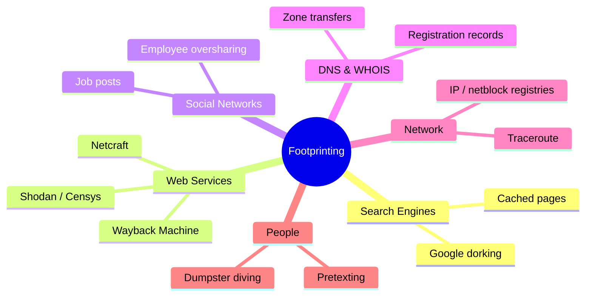
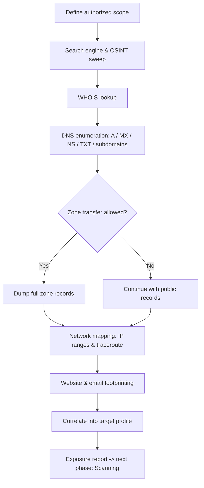
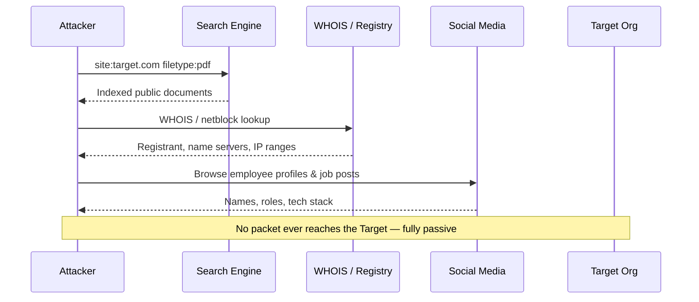
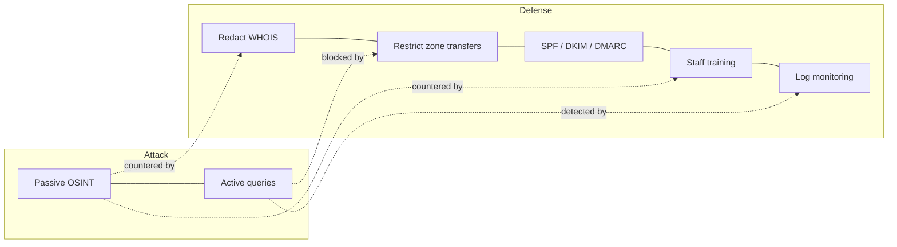

# Footprinting and Reconnaissance

> 🔑 **What you'll learn:** how attackers (and ethical hackers) quietly gather information about a target *before ever touching it* — and how defenders shrink that exposed surface.
> **Prerequisites:** basic networking (IP, DNS, HTTP), comfort with a Linux terminal, and Module 01 (Introduction to Ethical Hacking).

| Course | Course code | Module | Level |
|--------|-------------|--------|-------|
| Skillogic CSPP – Professional Level 1 | SKL-CSP1-710 | Module 02: Footprinting and Reconnaissance | level1 |

---

## 1. In Plain English

A clumsy burglar walks up and rattles the door. A smart one watches first: when do the lights go off, which windows have no locks, is there a dog, does a delivery van show up every Tuesday? They build a complete picture *before* doing anything risky. **Footprinting and reconnaissance** is that "watch first" phase — but for computer systems and organizations.

- **Reconnaissance** = information gathering (the broad first phase).
- **Footprinting** = the structured step where you collect a "footprint" — a profile of a target: domains, IP addresses, employee emails, software in use, even staff names and habits.
- The clever part: most of this is *already public*. Companies publish it on websites, job postings, domain records, and social media — never realizing an attacker is quietly assembling it all.

> 🔑 **Key idea:** Footprinting is mostly **passive**. The attacker often never sends a single packet to the target. They read public records and search results, leaving almost no trace. That stealth is exactly why it works — and why defenders must think about *exposure*, not just intrusion.

Why care as a beginner? Nearly every real-world attack starts here. **You cannot defend what you don't know is exposed.** Learn how attackers footprint, and you start seeing your own organization the way they do — then you can close the doors and windows they were counting on.



---

## 2. Core Concepts

### 2.1 Footprinting 🦶

**Footprinting** collects as much information as possible about a target system, network, or organization to find ways to intrude. The output is a detailed map: domains, subdomains, IP ranges, operating systems, employee names and emails, technologies, and physical locations.

There are two flavors:

| Type | How it works | Detectable? | Examples |
|------|--------------|:-----------:|----------|
| 🕵️ **Passive** | Gather info *without* touching the target's systems | ❌ Usually not | Search engines, public databases, social media |
| 📡 **Active** | Gather info by *directly engaging* the target | ✅ Yes (logs) | DNS queries to its servers, pinging hosts |

### 2.2 Reconnaissance vs. Footprinting

These terms are often used interchangeably. Reconnaissance is the broad first phase of the attack lifecycle; footprinting is the structured information-gathering activity within it. Together they mean: *learn everything you legally can about the target before scanning or attacking.*

### 2.3 OSINT (Open-Source Intelligence) 🌐

**OSINT** is intelligence collected from publicly available, legal sources: websites, news, public records, social media, leaked-but-public databases, satellite imagery, and more.

> 💡 **Tip:** "Open-source" here does **not** mean open-source software — it means open, *public sources of information*. The skill is not finding data (it's everywhere) but **correlating** scattered pieces into a useful picture.

### 2.4 Footprinting Through Search Engines 🔎

Search engines index far more than people realize. With advanced operators ("Google dorking") an attacker finds exposed files, login pages, error messages, and config data:

| Operator | What it finds |
|----------|---------------|
| `site:example.com` | Pages only on a specific domain |
| `filetype:pdf` | Documents of a specific type |
| `intitle:"index of"` | Open directory listings |
| `inurl:admin` | URLs containing a keyword like "admin" |
| `cache:example.com` | A cached (older) copy of a page |

Combining them — `site:example.com filetype:xls password` — can surface spreadsheets that were never meant to be public.

> ⚠️ **Warning:** Dorking only your *own* domains is fine. Running these against third parties to harvest exposed credentials is unauthorized access in most jurisdictions.

### 2.5 Footprinting Through Web Services 🛰️

Specialized services aggregate huge amounts of target data:

| Service | What it reveals |
|---------|-----------------|
| **Shodan / Censys** | Search engines for internet-connected *devices* — open ports, banners, running services per IP/org |
| **Netcraft** | Hosting provider, server software, and site history |
| **Wayback Machine** (archive.org) | Old versions of a site — pages, comments, files since removed |
| **People / job sites** | Staff names, roles, and exact technologies a company hires for (a free tech-stack disclosure) |

### 2.6 Footprinting Through Social Networking Sites 👥

Employees overshare. Job titles, project names, badge photos, internal tool screenshots, and "I'm at the office" posts all leak organizational structure and technology. Attackers build a **social graph** of who works with whom — fuel for later social-engineering and phishing.

### 2.7 Website and Email Footprinting 📧

- **Website footprinting** — examining a site's structure, HTTP headers, source comments, technologies, and cookies. Tools can mirror an entire site for offline study.
- **Email footprinting** — analyzing email **headers** (hidden routing data in every message) to learn the sender's mail servers, IP addresses, and the path traveled. **Email tracking** (tracking pixels, read receipts) confirms *when* and *where* a target opens a message.

> 🖼️ *Suggested image: an email "show original / view headers" view highlighting the `Received:` chain and originating IP.*

### 2.8 WHOIS Footprinting 📇

**WHOIS** is a public directory of domain registration records. A lookup can reveal the registrant organization, contact emails/phones, registration and expiry dates, the registrar, and authoritative name servers.

> 💡 **Tip:** Privacy services and GDPR now redact much personal data, but **organizational and technical details often remain** — registrar, name servers, dates.

### 2.9 DNS Footprinting 🌳

**DNS (Domain Name System)** translates names like `example.com` into IP addresses. Its records leak structure:

| Record | Meaning |
|--------|---------|
| `A` / `AAAA` | IPv4 / IPv6 address of a host |
| `MX` | Mail servers |
| `NS` | Authoritative name servers |
| `TXT` | Free text — often SPF/DKIM, sometimes verification tokens |
| `CNAME` | Alias pointing to another name |
| `SOA` | Zone authority and admin contact |

> ⚠️ **Warning:** A misconfigured server may allow a **zone transfer** (AXFR) — handing over the *entire* list of records. That's a goldmine of internal hostnames and a common, avoidable mistake.

### 2.10 Network Footprinting 🗺️

Determining the target's **IP address ranges** and topology. Techniques include `traceroute` (mapping routers between you and the target) and querying regional internet registries (ARIN, RIPE, APNIC) for the netblocks an organization owns.

### 2.11 Footprinting Through Social Engineering 🎭

**Social engineering** manipulates people into revealing information. In footprinting it's low-tech but effective:

- **Pretexting** — posing as IT support or a trusted party.
- **Shoulder surfing** — watching someone type.
- **Dumpster diving** — recovering discarded documents.
- **Eavesdropping** — overhearing conversations.

> 🔑 **Key idea:** Humans are often the easiest "database" to query — no firewall guards a friendly phone call.

---

## 3. How It Works (Step by Step)

An authorized footprinting engagement proceeds from **broad and passive** to **narrow and active**:

1. **Define scope** — confirm exactly which domains, IPs, and assets you're authorized to investigate. Stay inside it.
2. **Search-engine & OSINT sweep** — Google dorking, Shodan, social media, job posts. Build a notes file of domains, emails, names, technologies.
3. **WHOIS lookup** — identify registrant, registrar, and authoritative name servers per in-scope domain.
4. **DNS enumeration** — pull A, MX, NS, TXT records; enumerate subdomains; carefully test for zone transfers.
5. **Network mapping** — resolve IPs, determine owned netblocks via registries, run `traceroute`.
6. **Website & email footprinting** — inspect headers, source, technologies; analyze email headers if samples exist.
7. **Correlate & report** — combine everything into a target profile and exposure list, feeding the next phase (scanning).



The passive nature is clearest when you watch the data flow between attacker and *third parties* — never the target itself:



---

## 4. Real-World Examples

**1. LinkedIn / job-post tech-stack disclosure.** Organizations publish job listings demanding specific products and versions (e.g., "Cisco ASA," "Apache Struts 2.x," a named SIEM). An attacker reads these for free and instantly knows what software to research for known vulnerabilities — without touching the network. Pure passive footprinting through web services and social networks.

**2. Misconfigured DNS zone transfers.** Security researchers and scanning projects have documented thousands of public-facing DNS servers permitting unrestricted AXFR zone transfers, exposing complete internal hostname inventories (mail, VPN, dev, staging). Each leaked hostname is a candidate target. The fix is trivial — restrict transfers to known secondaries — yet the misconfiguration persists.

**3. Reconnaissance preceding major breaches.** Public incident analyses — including MITRE ATT&CK case studies and enterprise post-mortems — repeatedly show an extended recon phase: attackers harvested employee emails and roles, mapped exposed services, and tailored phishing *before* any intrusion. The lesson is consistent: meaningful attacks begin with patient, low-noise footprinting.

> 🖼️ *Suggested image: a redacted screenshot of a real job posting with the required product names/versions highlighted.*

---

## 5. Tools of the Trade

> ⚠️ **Warning:** All examples below are for systems you **own or are explicitly authorized to test**.

| Tool | Use case | One-liner |
|------|----------|-----------|
| `whois` | Domain registration records | `whois example.com` |
| `dig` | Flexible DNS lookups | `dig example.com ANY +noall +answer` |
| `dnsrecon` | Automated DNS enum + AXFR test | `dnsrecon -d example.com -t std` |
| `theHarvester` | Emails, subdomains, hostnames from public sources | `theHarvester -d example.com -b bing,crtsh` |
| `whatweb` | Website technology fingerprinting | `whatweb https://example.com` |
| `shodan` | Internet-exposed devices/services | `shodan host 93.184.216.34` |
| `recon-ng` | Modular OSINT framework (workspace DB) | interactive console |

Selected detail:

**whois** — returns registrar, registrant org, creation/expiry dates, and name servers.
```bash
whois example.com
```

**dig** — pulls available records (A, MX, NS, TXT) in one query for a quick profile.
```bash
dig example.com ANY +noall +answer
```

**dnsrecon** — standard enumeration: NS, MX, A records and an AXFR (zone transfer) attempt per name server.
```bash
dnsrecon -d example.com -t std
```

**theHarvester** — collects emails and subdomains from Bing and certificate-transparency logs.
```bash
theHarvester -d example.com -b bing,crtsh
```

**whatweb** — identifies the web server, CMS, and JS libraries from HTTP responses and page content.
```bash
whatweb https://example.com
```

**Shodan CLI** — shows open ports, service banners, and location for an IP (requires a free API key).
```bash
shodan host 93.184.216.34
```

**Recon-ng** — modular OSINT framework that stores findings in a workspace database; ideal for correlating many sources in one place.

> 🖼️ *Suggested image: terminal screenshot of `theHarvester` output listing discovered subdomains and emails for a lab domain.*

---

## 6. Hands-On Lab (Authorized / Lab-Only)

> ⚠️ **Warning:** Run these steps only against systems you own or are explicitly authorized to test. This lab uses **Metasploitable 2** (an intentionally vulnerable VM) plus your own throwaway domain. **Never** point these tools at third-party infrastructure.

**Goal:** footprint a target you control and assemble a small profile.

| Step | Command | Expected result & interpretation |
|------|---------|----------------------------------|
| 1 — Reachability | `ping -c 2 192.168.56.101` | Replies with round-trip times → the VM is up on your isolated lab net |
| 2 — Web banner | `whatweb http://192.168.56.101` | Names the HTTP server (e.g., Apache) + PHP → you know the web stack to research |
| 3 — WHOIS (your domain) | `whois yourlabdomain.example` | Registrar, creation date, name servers → what your own domain leaks publicly |
| 4 — DNS enum | `dig yourlabdomain.example MX +short`<br>`dig yourlabdomain.example NS +short` | MX = email provider; NS = who could be targeted for a zone-transfer test |
| 5 — Zone transfer | `dig AXFR yourlabdomain.example @ns1.yourprovider.example` | `Transfer failed` / refusal = **correct, secure** result. A full dump = misconfigured server to fix |
| 6 — OSINT harvest | `theHarvester -d yourlabdomain.example -b crtsh` | Subdomains via cert-transparency logs → assets you may have forgotten |
| 7 — Write the profile | (notes file) | Combine IP, web stack, DNS records, subdomains into the footprinting deliverable |

> 💡 **Tip:** Step 5 is the most instructive. A *refusal* is the success condition — you're verifying your defenses, not breaking anything. A successful dump is a finding to remediate, not exploit.

The correlated profile from Step 7 is the deliverable of the footprinting phase and the input to scanning.

---

## 7. Countermeasures & Defenses

Defense is about **shrinking exposure**. Map each footprinting technique to its counter:

| Footprinting vector | Defense |
|---------------------|---------|
| 🔎 Search engines | `robots.txt` + real access control; self-dork and remove exposed files; strip metadata/comments |
| 🌳 DNS | Restrict zone transfers to authorized secondaries; avoid descriptive internal hostnames; use split-horizon DNS |
| 📇 WHOIS | Enable privacy/redaction on registration records |
| 📧 Email | Configure **SPF, DKIM, DMARC**; block tracking pixels / external image auto-load |
| 👥 Social media | Information-sharing policy; train staff; keep job posts generic (no exact versions) |
| 🎭 Social engineering | Shredding (vs. dumpster diving); clean-desk policy; verify caller identity (vs. pretexting); guard against shoulder surfing & tailgating |

> ⚠️ **Warning:** `robots.txt` hides pages from *polite* crawlers — not from attackers. Treat it as a hint to search engines, never as a security control. Combine it with real authentication.

**Detection (catch active footprinting):**
- Monitor spikes in DNS queries and repeated WHOIS/zone-transfer attempts.
- Watch web logs for scraping patterns.
- Use threat intelligence to spot your data in OSINT sources and breach dumps.



---

## 8. Key Terms

| Term | Meaning |
|------|---------|
| **Footprinting** | Collecting a detailed information profile of a target prior to attack |
| **Reconnaissance** | The broad first phase of the attack lifecycle; information gathering |
| **Passive footprinting** | Gathering data without directly touching the target's systems |
| **Active footprinting** | Gathering data by directly interacting with the target (detectable) |
| **OSINT** | Open-Source Intelligence; intelligence from publicly available sources |
| **Google dorking** | Using advanced search operators to find exposed information |
| **WHOIS** | Public registry of domain registration details |
| **DNS** | Domain Name System; maps names to IP addresses |
| **Zone transfer (AXFR)** | Bulk copy of a DNS zone's records; dangerous if unrestricted |
| **Traceroute** | Tool that maps the network path (routers) to a target |
| **Email header analysis** | Reading a message's routing metadata to learn its origin and path |
| **Social engineering** | Manipulating people to disclose information |
| **Shodan / Censys** | Search engines for internet-connected devices and services |

---

## 9. Summary & Takeaways

- 🥇 Footprinting is the **first phase** of every attack and pentest — you can't defend what you don't know is exposed.
- 🕵️ Most of it is **passive and undetectable**: attackers read public data instead of touching your systems.
- 🌐 **OSINT** (search engines, web services, social media, job posts) yields domains, emails, names, and tech stacks for free.
- 📇 **WHOIS** and **DNS** reveal ownership, mail servers, name servers — and via misconfigured **zone transfers**, entire internal hostname lists.
- 📧 **Website and email footprinting** expose technologies and routing details through headers, source, and metadata.
- 🎭 **Social engineering** turns people into an information source via pretexting, dumpster diving, and shoulder surfing.
- 🛡️ Defense = **shrinking exposure**: restrict zone transfers, redact WHOIS, harden email (SPF/DKIM/DMARC), train staff, and self-audit with the same tools attackers use.
- 📋 The deliverable is a **correlated target profile** that feeds the scanning phase.

> 📚 **Further reading:** OWASP Web Security Testing Guide (Information Gathering); NIST SP 800-115 (Technical Guide to Information Security Testing and Assessment); MITRE ATT&CK Reconnaissance tactic (TA0043); vendor docs for Shodan, theHarvester, and dnsrecon.
