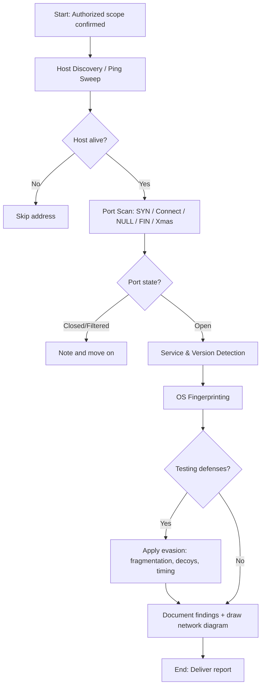

# Scanning Networks

> **What you'll learn:** How attackers and defenders map out a network — finding live hosts, open ports, running services, and operating systems — and how to do it carefully enough to slip past (or detect) firewalls and intrusion detection systems.
> **Prerequisites:** Basic understanding of IP addresses, the TCP/IP model, ports, and how a client and server "talk" over a network (covered in the Networking Fundamentals module).

| Course | Course code | Module | Level |
| --- | --- | --- | --- |
| Professional Level 1 | SKL-CSP1-710 | Module 03 — Scanning Networks | level1 |

---

## 1. In Plain English

Imagine you're a burglar casing a building before a break-in (don't worry — in this course you're the *good* version, the one hired to test the building's security). Before you do anything, you walk around the block. You note which lights are on, which doors exist, which windows are open, and what kind of locks each door uses. You're not breaking in yet — you're just *gathering information*. That's exactly what **network scanning** is.

In the previous stage, called **reconnaissance** (passively collecting public information about a target), you learned *who* and *what* the target is from a distance. Scanning is the next step: you start gently knocking on doors to see which ones are real, which are open, and what's behind them. A "door" here is a **port** — a numbered communication endpoint on a computer (for example, web traffic usually lives on port 80 or 443). A computer that responds is a **live host**. The program listening behind an open port is a **service** (like a web server or a database).

Why should a beginner care? Because almost every attack in the world starts with scanning. If a defender understands what scanning looks like, they can spot an attacker early — often *before* any real damage is done. And if you ever work in security testing (penetration testing), scanning is the very first hands-on skill you'll use. Get it right and the rest of the engagement goes smoothly; get it wrong (too loud, too aggressive) and you'll be detected, blocked, or you'll crash a fragile system.

Throughout this note, every technique is framed for **authorized testing only** — meaning you have written permission to scan the target. Scanning systems you don't own or have permission to test is illegal in most countries.

---

## 2. Core Concepts

### What is network scanning?

**Network scanning** is the process of sending crafted packets (small units of network data) to a target and studying the responses to learn about it. The three big questions scanning answers are:

1. **Which hosts are alive?** (host discovery)
2. **Which ports are open on those hosts?** (port discovery)
3. **What software is running, and on what OS?** (service and OS discovery)

### Ports and port states

A computer has 65,535 TCP ports and 65,535 UDP ports. Think of them as numbered mailboxes. A scanner classifies each port into one of these states:

- **Open** — a service is actively listening and accepting connections. This is the attacker's main interest.
- **Closed** — the host is reachable but nothing is listening on that port.
- **Filtered** — a firewall or filter is blocking the probe, so the scanner can't tell if the port is open or closed. The probe simply disappears.

### TCP flags and the three-way handshake

TCP (Transmission Control Protocol) is a "reliable" protocol: before two machines exchange real data, they perform a **three-way handshake** to agree on a connection. Each TCP packet carries **control flags** — single on/off bits that signal intent. The key flags for scanning are:

| Flag | Full name | Meaning in plain English |
| --- | --- | --- |
| **SYN** | Synchronize | "I want to start a connection." |
| **ACK** | Acknowledge | "I received your message." |
| **FIN** | Finish | "I'm done; let's close the connection." |
| **RST** | Reset | "Stop — there's no connection here / abort." |
| **PSH** | Push | "Deliver this data to the app immediately." |
| **URG** | Urgent | "This data is urgent; process it first." |

The normal handshake looks like this: the client sends **SYN**, the server replies **SYN/ACK**, and the client finishes with **ACK**. Now the connection is established.

Scanners abuse these flags to learn about ports without always completing a full connection.

### Scan types (built on TCP flags)

- **TCP Connect scan** — The scanner completes the *entire* three-way handshake (SYN → SYN/ACK → ACK), then closes it. It's accurate and needs no special privileges, but it's "loud": the connection gets logged by the target.
- **SYN scan (half-open scan)** — The scanner sends a SYN, and if it gets a SYN/ACK back, it knows the port is **open** — but instead of completing the handshake, it sends an **RST** to tear it down. Because the connection is never fully established, many older systems don't log it. This is the default and most popular scan.
- **NULL scan** — Sends a packet with **no flags set at all**. Per the TCP standard, a closed port should reply with RST and an open port should stay silent. Useful for sneaking past simple filters; works mainly against Unix/Linux-style stacks.
- **FIN scan** — Sends a packet with only the **FIN** flag. Same logic as NULL: closed ports reply RST, open ports stay silent.
- **Xmas scan** — Sends a packet with **FIN, PSH, and URG** flags all set — it "lights up like a Christmas tree." Same response logic as NULL/FIN.

> **Important nuance:** NULL, FIN, and Xmas scans rely on how a system *should* behave per the RFC standard. Windows systems often reply with RST to *every* such packet, so these scans can't reliably distinguish open from closed on Windows. They're a tool for evasion, not a universal solution.

- **UDP scan** — UDP has no handshake. The scanner sends a UDP packet; silence may mean "open" *or* "filtered," while an ICMP "port unreachable" error means "closed." UDP scanning is slow and less certain but matters because services like DNS and SNMP run on UDP.

### Host discovery

Before scanning ports, you find out which addresses actually have a live machine. This is also called a **ping sweep**. Techniques include ICMP echo requests (the classic "ping"), TCP/UDP probes to common ports, and ARP requests on a local network (the most reliable method on a LAN because it can't be firewalled off easily).

### Service and version discovery

Knowing a port is open isn't enough — you want to know *what's* behind it and *which version*. The scanner connects and examines the response **banner** (the greeting text a service sends) or matches response patterns against a database of known service fingerprints. Version detail matters enormously: "Apache 2.4.49" might map to a known, exploitable vulnerability, while a newer version may not.

### OS discovery / fingerprinting

Every operating system builds its network packets slightly differently — TTL (Time To Live) values, TCP window sizes, and how it responds to unusual packets all vary. **OS fingerprinting** compares these subtle traits against a database to guess the target OS (e.g., "Linux 5.x" or "Windows Server 2019"). **Active fingerprinting** sends crafted probes; **passive fingerprinting** just listens to existing traffic, which is stealthier.

### Scanning beyond IDS and firewalls

An **IDS** (Intrusion Detection System) watches traffic for suspicious patterns and raises alerts; an **IPS** can also block. A **firewall** filters traffic by rules. Evasion techniques aim to make scans look benign:

- **Fragmentation** — split probe packets into tiny pieces so simple filters can't reassemble and recognize them.
- **Decoys** — make the scan appear to come from many spoofed source addresses, hiding the real attacker among fakes.
- **Source port manipulation** — send from a trusted-looking port (like 53/DNS or 80/HTTP) that the firewall may allow.
- **Timing control** — scan very slowly so the activity stays under detection thresholds.
- **MAC/IP spoofing** — forge the source address (works only in limited situations, since replies won't return to you).

### Drawing network diagrams

After scanning, you organize findings into a **network diagram** — a visual map of hosts, their roles, open services, and how they connect (subnets, routers, firewalls). This turns a pile of raw data into something you can reason about, and it's a standard deliverable in any professional engagement.

---

## 3. How It Works (Step by Step)

Here's the typical flow an authorized tester follows when scanning a target network:

1. **Define scope.** Confirm exactly which IP ranges you're permitted to scan. Never go outside this.
2. **Host discovery.** Run a ping sweep across the range to find live hosts. Filter out dead addresses so you don't waste time.
3. **Port scan.** For each live host, scan ports (commonly a SYN scan of the top 1,000 ports first, then a full scan if time allows).
4. **Service/version detection.** For each open port, identify the service and version via banners and fingerprints.
5. **OS detection.** Fingerprint the operating system from packet characteristics.
6. **Evasion (if testing defenses).** If the goal includes testing the IDS/firewall, repeat scans using fragmentation, decoys, or timing controls and observe whether the blue team detects you.
7. **Document.** Record everything and draw a network diagram.



---

## 4. Real-World Examples

**The WannaCry ransomware outbreak (2017).** WannaCry spread by scanning for hosts with TCP port 445 (SMB file-sharing) open and then exploiting a vulnerability nicknamed "EternalBlue." Its scanning component swept both local networks and random internet addresses looking for that one open port. The lesson is stark: an open, unpatched service that's discoverable by a simple port scan can lead to a worldwide outbreak. Organizations that blocked port 445 at their network edge were far less exposed.

**Internet-wide scanning research.** Academic and security tools like ZMap and Masscan can scan the *entire* IPv4 internet for a single open port in minutes. Researchers use this responsibly to measure things like how many servers still run outdated, vulnerable software. This shows scanning at massive scale and reminds defenders that "security through obscurity" (hoping no one finds your service) doesn't work — everything reachable will be found.

**A realistic penetration test.** A tester is hired to assess a company's internal network. A SYN scan reveals an old server with port 3306 (MySQL) open to the whole internal network, running a years-old database version. Version detection flags it as matching a known vulnerability class. The tester documents it, and the company restricts the database to only the application servers that need it — closing a path an attacker could have used to steal customer data.

---

## 5. Tools of the Trade

### Nmap (Network Mapper)

The industry-standard scanner. Does host discovery, port scanning, version detection, OS fingerprinting, and (via the Nmap Scripting Engine) light vulnerability checks.

```bash
nmap -sS -sV -O -p- 192.168.56.0/24
```
This runs a **SYN scan** (`-sS`), detects **service versions** (`-sV`), attempts **OS detection** (`-O`), and scans **all 65,535 ports** (`-p-`) across the given subnet.

### Masscan

An extremely fast port scanner built for very large address ranges. Trades some accuracy for speed.

```bash
masscan 10.0.0.0/8 -p80,443 --rate 1000
```
Scans the entire `10.x.x.x` range for ports 80 and 443, sending 1,000 packets per second (the `--rate` keeps it from overwhelming the network).

### Netcat (nc)

A "Swiss Army knife" for TCP/UDP. Great for manual banner grabbing on a single port.

```bash
nc -v 192.168.56.101 22
```
Opens a connection to port 22 (SSH) and prints the banner the service sends back, often revealing the software and version.

### Wireshark

A packet-capture and analysis tool. Defenders use it to *see* what a scan actually looks like on the wire; learners use it to understand how flags and handshakes behave.

```bash
# Capture filter shown in Wireshark's filter bar:
tcp.flags.syn == 1 and tcp.flags.ack == 0
```
This filter displays only SYN packets without ACK — a quick way to spot the start of connection attempts, including SYN scans.

---

## 6. Hands-On Lab (Authorized / Lab-Only)

> **Reminder:** Perform these steps only against systems you own or are explicitly authorized to test. The target below, **Metasploitable 2**, is an intentionally vulnerable virtual machine you run on your own computer.

**Setup:** Run Kali Linux (attacker) and Metasploitable 2 (target) as virtual machines on the *same host-only network* in VirtualBox or VMware. Assume the target gets the IP `192.168.56.101`. Never bridge these VMs to a real network.

**Step 1 — Find the live host (host discovery).**
```bash
nmap -sn 192.168.56.0/24
```
`-sn` does a ping sweep with no port scan. Expected output includes a line like:
```
Nmap scan report for 192.168.56.101
Host is up (0.00042s latency).
```
*Interpretation:* the target is alive and reachable. Note its IP for the next steps.

**Step 2 — Discover open ports (SYN scan).**
```bash
sudo nmap -sS -p- 192.168.56.101
```
`sudo` is needed because raw-packet SYN scans require elevated privileges. Expected output (abbreviated):
```
PORT     STATE SERVICE
21/tcp   open  ftp
22/tcp   open  ssh
80/tcp   open  http
3306/tcp open  mysql
```
*Interpretation:* multiple services are exposed. Metasploitable 2 is deliberately wide open, which is why it's a teaching target.

**Step 3 — Identify services and versions.**
```bash
sudo nmap -sV -p 21,22,80,3306 192.168.56.101
```
Expected output (abbreviated):
```
21/tcp   open  ftp     vsftpd 2.3.4
22/tcp   open  ssh     OpenSSH 4.7p1
80/tcp   open  http    Apache httpd 2.2.8
3306/tcp open  mysql   MySQL 5.0.51a
```
*Interpretation:* These are old versions. `vsftpd 2.3.4`, for example, is famous for a backdoor — exactly the kind of finding a tester documents.

**Step 4 — Fingerprint the operating system.**
```bash
sudo nmap -O 192.168.56.101
```
Expected output includes:
```
Running: Linux 2.6.X
OS details: Linux 2.6.9 - 2.6.33
```
*Interpretation:* the target is an old Linux box. Combined with the service versions, you now have a clear picture of the attack surface.

**Step 5 — Try a stealthier scan and watch it (optional, for understanding evasion).**
```bash
sudo nmap -sX -p 80,3306 192.168.56.101
```
`-sX` is the **Xmas scan**. On this Linux target, open ports stay silent and closed ports return RST. Run Wireshark on the attacker while you do this and compare the packets to the SYN scan from Step 2 — you'll *see* the difference in flags.

**Step 6 — Save results for your report.**
```bash
sudo nmap -sS -sV -O -oN scan_results.txt 192.168.56.101
```
`-oN` writes a human-readable report to `scan_results.txt`, which becomes the basis for your network diagram and findings.

---

## 7. Countermeasures & Defenses

**Detection (spotting a scan):**
- Deploy an **IDS/IPS** (e.g., Snort, Suricata) tuned to flag rapid connections to many ports or hosts.
- Watch firewall and host logs for bursts of connection attempts, especially many half-open (SYN-without-completion) connections.
- Use rate-based alerts: a single source touching dozens of ports in seconds is a classic scan signature.
- Deploy **honeypots** — decoy systems that have no legitimate use, so *any* contact with them is automatically suspicious.

**Prevention and hardening:**
- **Close unused ports** and stop unnecessary services — the smallest attack surface is the best defense.
- Use a **default-deny firewall**: block everything, then allow only what's explicitly needed.
- **Segment the network** so that even a discovered host can't reach everything else (e.g., keep databases on an isolated subnet).
- Apply **patches promptly** so that even if a service is found, its version isn't exploitable.
- Hide or genericize service banners so version information isn't handed to attackers.

**Mitigation (slowing the attacker down):**
- Enable **SYN flood / port-scan protection** on firewalls to throttle aggressive probing.
- Rate-limit ICMP and connection attempts per source.
- Use **port knocking** or VPN-gated access for sensitive admin services so they aren't directly scannable.

---

## 8. Key Terms

- **Network scanning** — Sending packets to a target and analyzing responses to map hosts, ports, services, and OS.
- **Port** — A numbered endpoint (1–65535) where a service listens for connections.
- **Live host** — A reachable, responding machine on the network.
- **Three-way handshake** — The SYN → SYN/ACK → ACK sequence that establishes a TCP connection.
- **TCP flags** — Control bits (SYN, ACK, FIN, RST, PSH, URG) that signal a packet's purpose.
- **SYN (half-open) scan** — Sends SYN, reads the reply, then aborts with RST before completing the connection.
- **NULL / FIN / Xmas scans** — Scans using unusual flag combinations to infer port state and evade simple filters.
- **Banner grabbing** — Reading a service's greeting text to identify the software and version.
- **OS fingerprinting** — Guessing the operating system from subtle packet characteristics.
- **IDS / IPS** — Intrusion Detection / Prevention System; tools that detect (and optionally block) suspicious traffic.
- **Decoy scanning** — Hiding the real attacker's address among many spoofed ones.
- **Ping sweep** — Host discovery across a range of addresses.

---

## 9. Summary & Takeaways

- Scanning is the reconnaissance-to-action bridge: it answers *which hosts are alive, which ports are open, what's running, and on what OS*.
- TCP flags drive scan behavior; the **SYN (half-open) scan** is the default because it's fast and relatively stealthy.
- **NULL, FIN, and Xmas scans** exploit RFC behavior for evasion but are unreliable against Windows — they're tools, not silver bullets.
- **Service and version detection** matters more than just "open/closed," because the version determines exploitability.
- Attackers evade defenses with **fragmentation, decoys, source-port tricks, and slow timing**; defenders counter with IDS/IPS, rate limiting, and segmentation.
- The strongest defense is a **small attack surface**: close ports, patch fast, and deny by default.
- Always document findings and draw a **network diagram** — raw scan data is only useful once it's organized.
- Everything here is for **authorized testing only**; unauthorized scanning is illegal and unethical.

**Further reading:** NIST SP 800-115 (*Technical Guide to Information Security Testing and Assessment*); the official Nmap reference guide and book by Gordon "Fyodor" Lyon; MITRE ATT&CK tactic *Reconnaissance* (T1595, Active Scanning); OWASP Web Security Testing Guide (information-gathering chapters).
