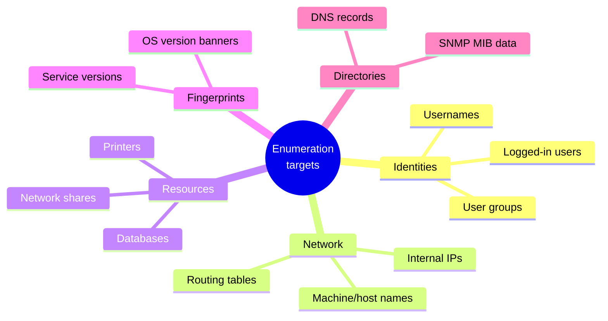
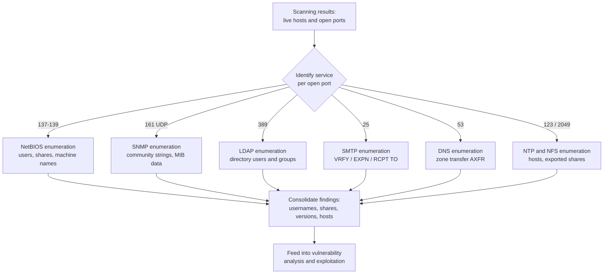
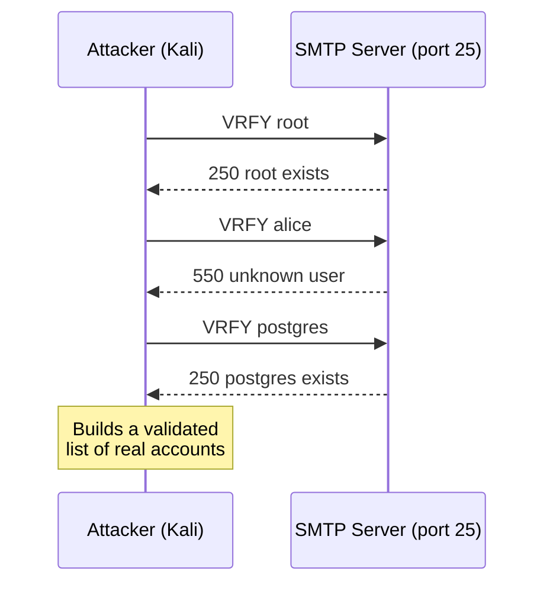

# Enumeration 🔍

> **What you'll learn:** How attackers (and ethical hackers) actively interrogate a target to pull out usernames, network shares, services, and config details — and how defenders shut that door. **Prerequisites:** Basic networking (IP addresses, ports, TCP/UDP), footprinting/scanning basics, and comfort with the Linux command line.

| | |
|---|---|
| **Course** 📚 | Professional Level 1 |
| **Course code** 🏷️ | SKL-CSP1-710 |
| **Module** 🧩 | Enumeration |
| **Level** 🎓 | level1 |

---

## 1. In Plain English

Picture a burglar casing a building:

- **Footprinting** → reading the company sign and noting the address (passive observation).
- **Scanning** → walking the perimeter, checking which doors and windows exist and which are unlocked.
- **Enumeration** → slipping into the lobby and reading the staff directory, the mailbox names, and the building map. Nothing is broken yet — you're collecting the specific, named details that let you walk straight to the right office later.

In computer terms, **enumeration is actively connecting to a target and asking it questions to extract named resources**: user accounts, group names, machine names, network shares, running services, software versions, and config settings. The key word is *active* — unlike passive recon, you make real connections, so it's noisier and more likely to be logged.

> 🔑 **Key idea:** Almost every serious breach starts with the attacker building a list of "what's here and who's here." A single valid username, a misconfigured share, or a forgotten service banner can unravel an entire network.

> ⚠️ **Lab-only:** Everything offensive here is for **authorized testing, labs, and education**. Running these techniques against systems you don't own or have written permission to test is illegal in most countries.

---

## 2. Core Concepts

### Enumeration vs. Scanning vs. Footprinting

These three phases open the ethical-hacking lifecycle and are easy to blur. The clean distinction:

| Phase | What it answers | Activity level |
|---|---|---|
| 🕵️ **Footprinting / Recon** | "Who is the target and what's their public footprint?" | Mostly passive |
| 📡 **Scanning** | "Which hosts are alive and which ports/services are open?" | Active, broad |
| 🔬 **Enumeration** | "What *named* resources, users, and details live behind those open services?" | Active, deep |

Enumeration is where you stop counting open doors and start reading what's written behind them.

### The attacker's "shopping list"



### Key protocols and their enumeration value

A short lead-in: each open port maps to a protocol, and each protocol leaks something useful. Memorize this table — ports are the entry point for everything that follows.

| Protocol | Port(s) | What it is | What it leaks |
|---|---|---|---|
| **NetBIOS** | 137, 138, 139 (TCP/UDP) | Legacy Windows name/comms protocol | Machine names, logged-in users, shares, workgroup/domain |
| **SMB** | 139, 445 (TCP) | File/printer sharing, enumerated alongside NetBIOS | Users, shares, OS version, password policy |
| **SNMP** | 161 (UDP) | Device monitoring/management | Configs, ARP tables, processes, user accounts |
| **LDAP** | 389 / 636 (TLS) | Directory services (e.g., Active Directory) | Full org chart: users, emails, groups |
| **NTP** | 123 (UDP) | Clock synchronization | Recently connected hosts → internal IPs |
| **NFS** | 2049 | Unix/Linux file sharing | Exported (and mountable) shares |
| **SMTP** | 25 (TCP) | Email transfer | Valid usernames via `VRFY`/`EXPN`/`RCPT TO` |
| **DNS** | 53 | Name-to-IP "phone book" | Full hostname map via zone transfer (`AXFR`) |

**A few protocols deserve extra detail:**

- 🪧 **Service banners.** A banner is the greeting a service sends on connect — e.g., `220 mail.example.com ESMTP Postfix (Ubuntu)`. **Banner grabbing** reads that greeting to learn the software name and version, which often maps directly to a known weakness.
- 🔐 **SNMP community strings.** SNMP access is gated by a **community string** — essentially a plaintext password. Devices expose a tree of data called a **MIB** (Management Information Base). Many ship with defaults `public` (read-only) and `private` (read-write). Left in place, an attacker can read — or change — device config.
- 🗂️ **LDAP anonymous binds.** If LDAP allows connecting without credentials, an attacker can query the directory and harvest every username, email, and group.
- ⏰ **NTP monlist.** NTP servers can be queried (`monlist` and similar) for a list of recently connected hosts, revealing internal IPs.
- 📨 **SMTP user verification.** `VRFY` (verify a user), `EXPN` (expand a list), and `RCPT TO` can confirm which usernames exist — a clean list of accounts to attack.
- 🌐 **DNS zone transfer.** The `AXFR` request copies DNS records between trusted servers. If exposed to anyone, it hands over every hostname and internal IP in one shot.

---

## 3. How It Works (Step by Step)

A real enumeration workflow is methodical, moving from broad to specific.

1. **Discover live hosts and open ports.** Carry results forward from scanning (e.g., 25, 53, 139, 161, 389).
2. **Map ports to services.** Each open port hints at a protocol — 161 → SNMP, 389 → LDAP, 25 → SMTP.
3. **Grab banners.** Connect and read the greeting to learn software and version.
4. **Pick the right technique per service.** NetBIOS tools on 137-139, SNMP on 161, SMTP `VRFY` on 25, DNS `AXFR` on 53.
5. **Extract named resources.** Usernames, shares, group memberships, device configs, internal hostnames.
6. **Correlate and prioritize.** Build a picture: who the admins are, which shares are writable, which versions are outdated. This feeds **vulnerability analysis** and **exploitation**.



Here's a concrete attacker/target exchange for SMTP user enumeration — note how the server's honest replies leak which accounts exist:



> 💡 **Tip:** The whole game is *broad to deep*. Scanning tells you a door exists; enumeration reads the nameplate, the directory, and the version sticker behind it.

---

## 4. Real-World Examples

| # | Scenario | Why it matters |
|---|---|---|
| 1️⃣ | **SNMP default community strings** | Network gear has shipped with `public`/`private` for decades. Auditors routinely find production routers, switches, and printers still using defaults — exposing full configs, sometimes including weakly obscured credentials. "Check for default SNMP strings" is a standard pentest checklist item. |
| 2️⃣ | **DNS zone transfers** | Misconfigured servers permitting unrestricted `AXFR` have repeatedly leaked entire internal hostname maps. One `dig axfr` can return every server, mail host, and dev box — a ready-made target list. A recurring bug-bounty finding. |
| 3️⃣ | **SMTP user enumeration → password attacks** | Servers that respond differently to `VRFY`/`RCPT TO` for valid vs. invalid users let attackers build verified account lists, then run password-spraying (one common password against many accounts). A recurring root cause in email-account compromise. |
| 4️⃣ | **NetBIOS/SMB null sessions (historical)** | Older Windows allowed anonymous "null sessions" to the IPC$ share, revealing users, shares, and password policies. Famously abused by worms and lateral-movement toolkits — which is why modern Windows restricts anonymous enumeration by default. |

---

## 5. Tools of the Trade

> ⚠️ **All commands below are for authorized testing and lab use only.**

Quick reference — match the tool to the protocol:

| Tool 🛠️ | Targets | Primary use |
|---|---|---|
| **Nmap (+ NSE)** | Any | Port scan + scripted enumeration |
| **nbtscan / nmblookup** | NetBIOS (137-139) | Machine names, workgroups, logged-in users |
| **snmpwalk / snmp-check** | SNMP (161) | Walk the MIB tree |
| **enum4linux** | SMB/NetBIOS | Automated Windows/Samba enumeration |
| **ldapsearch** | LDAP (389/636) | Query directory, anonymous bind |
| **dig / nslookup** | DNS (53) | Records and zone transfers |
| **smtp-user-enum** | SMTP (25) | Validate usernames |

### Nmap (with NSE scripts)

The Swiss-army scanner. Beyond port scanning, its scripting engine (NSE) automates enumeration of many protocols.

```bash
# Enumerate SMB users, shares, and OS over NetBIOS/SMB on a target
nmap -p 139,445 --script smb-enum-users,smb-enum-shares,smb-os-discovery 192.168.56.101
```
Scans the SMB ports and runs scripts that list user accounts, shared folders, and the OS version.

### nbtscan / nmblookup

```bash
nbtscan 192.168.56.0/24
```
Sweeps a whole subnet and prints each host's NetBIOS name and active services.

### snmpwalk / snmp-check

```bash
# Read the full MIB tree using the default 'public' community string, SNMP v2c
snmpwalk -v2c -c public 192.168.56.101
```
`-v2c` sets the SNMP version, `-c public` supplies the community string. The output dumps every readable value — system info, interfaces, processes, sometimes users.

### enum4linux

```bash
enum4linux -a 192.168.56.101
```
`-a` runs "all simple" checks: a consolidated report of users, groups, shares, and policy.

### ldapsearch

```bash
# Attempt an anonymous bind and dump the directory base
ldapsearch -x -h 192.168.56.101 -b "dc=example,dc=com"
```
`-x` uses simple (anonymous) auth, `-h` is the host, `-b` sets the search base (top of the tree to read).

### dig / nslookup

```bash
# Attempt a full zone transfer from a DNS server
dig axfr example.com @ns1.example.com
```
If misconfigured to allow it, this returns every DNS record for the domain.

### smtp-user-enum

```bash
smtp-user-enum -M VRFY -U users.txt -t 192.168.56.101
```
`-M VRFY` chooses the method, `-U` supplies a username wordlist, `-t` is the target. Reports which usernames the server confirms.

> 🖼️ *Suggested image: Nmap `-sV` scan output showing open ports with service/version banners.*

---

## 6. Hands-On Lab (Authorized / Lab-Only)

> ⚠️ **Only run this against systems you own or are explicitly authorized to test.** This lab uses **Metasploitable 2**, an intentionally vulnerable Linux VM, on an isolated host-only network. The attacker is a Kali Linux VM. Assume Metasploitable is at `192.168.56.101`.

**Goal:** Enumerate the target across SMB, SNMP, and SMTP, then explain what each result tells us.

### Step 1 — Confirm the target and open services

```bash
nmap -sV 192.168.56.101
```
*Expected output (trimmed):*
```
25/tcp   open  smtp        Postfix smtpd
139/tcp  open  netbios-ssn Samba smbd
445/tcp  open  netbios-ssn Samba smbd
2049/tcp open  nfs
```
**Interpretation:** SMTP, Samba (SMB/NetBIOS), and NFS are all open — three rich enumeration targets. `-sV` also grabbed version banners (Postfix, Samba).

### Step 2 — Enumerate SMB / NetBIOS with enum4linux

```bash
enum4linux -a 192.168.56.101
```
*Expected output (trimmed):*
```
[+] Got domain/workgroup name: WORKGROUP
[+] Users on 192.168.56.101:
    user:[msfadmin] rid:[0x3e8]
    user:[user]     rid:[0x3ea]
[+] Share Enumeration:
    tmp   Disk  oh noes!
    IPC$  IPC   IPC Service
```
**Interpretation:** Real usernames (`msfadmin`, `user`) and a writable `tmp` share. Usernames feed password attacks; the open share is a potential foothold.

> 🖼️ *Suggested image: enum4linux terminal output highlighting the recovered user list and share enumeration.*

### Step 3 — Enumerate SNMP

```bash
snmpwalk -v2c -c public 192.168.56.101 | head -n 20
```
*Expected output (trimmed):*
```
SNMPv2-MIB::sysDescr.0 = STRING: Linux metasploitable 2.6.24-16-server ...
SNMPv2-MIB::sysName.0 = STRING: metasploitable
```
**Interpretation:** The default `public` community string works, leaking the exact kernel version and hostname. That kernel string maps to known vulnerabilities in the next phase.

### Step 4 — Enumerate SMTP users

```bash
smtp-user-enum -M VRFY -U /usr/share/wordlists/metasploit/unix_users.txt -t 192.168.56.101
```
*Expected output (trimmed):*
```
192.168.56.101: root exists
192.168.56.101: postgres exists
192.168.56.101: user exists
```
**Interpretation:** The server answers `VRFY` honestly, confirming which accounts are real. Combined with the SMB usernames, we now have a validated account list.

### Step 5 — Consolidate

You now hold: confirmed usernames, a writable SMB share, and an exact OS/kernel version — exactly the inputs needed for the next phase. In a real engagement, every finding goes into your report with evidence and the recommended fix.

---

## 7. Countermeasures & Defenses

The pattern across every protocol: **disable what you don't need, kill anonymous access, change defaults, restrict by ACL, encrypt in transit, and monitor.** Because enumeration is *active*, it's also detectable.

| Protocol | Attack vector | Defense |
|---|---|---|
| 🪟 **NetBIOS / SMB** | Null sessions, port 137-139/445 exposure | Disable NetBIOS over TCP/IP where unneeded; block 137-139 & 445 at perimeter; disable anonymous (null-session) access; enforce "Do not allow anonymous enumeration of SAM accounts and shares" |
| 📟 **SNMP** | Default community strings | Change `public`/`private` to strong values, or upgrade to **SNMPv3** (auth + encryption); restrict to management hosts via ACL; block 161 at perimeter; disable if unused |
| 🗂️ **LDAP** | Anonymous binds | Disable anonymous binds; require auth for all queries; use **LDAPS** (port 636); restrict readable attributes |
| ⏰ **NTP / NFS** | `monlist`, world-readable exports | Disable legacy query commands like `monlist`; restrict queriers; export NFS only to trusted hosts, use `root_squash`, avoid world-readable/writable exports |
| 📨 **SMTP** | `VRFY` / `EXPN` enumeration | Disable `VRFY` and `EXPN`; return identical responses for valid vs. invalid recipients; apply rate limiting/throttling |
| 🌐 **DNS** | Open `AXFR` zone transfers | Restrict zone transfers to authorized secondaries; split internal/external DNS; monitor for unexpected `AXFR` requests |

**General hardening (applies everywhere):**

- Disable unused services and close unneeded ports — you can't enumerate a service that isn't running.
- Apply least privilege so even a successful connection reveals little.
- Log and monitor connection attempts; alert on bursts of failed binds, repeated `VRFY` commands, or full MIB walks.

> 💡 **Tip:** "Defaults are the enemy." Default SNMP strings, anonymous LDAP binds, and open DNS zone transfers cause most real-world leaks — and all three are free to fix.

> 🖼️ *Suggested image: SIEM/log dashboard showing an alert triggered by repeated VRFY commands or a full MIB walk.*

---

## 8. Key Terms

| Term | Definition |
|---|---|
| **Enumeration** | Actively connecting to a target to extract named resources (users, shares, services, configs) |
| **Banner grabbing** | Reading a service's greeting text to learn its software name and version |
| **NetBIOS** | Legacy Windows naming/communication protocol on ports 137-139 |
| **SMB** | Server Message Block; file/printer-sharing protocol enumerated alongside NetBIOS (139/445) |
| **Null session** | An anonymous, credential-free connection to a Windows IPC$ share |
| **SNMP** | Simple Network Management Protocol (UDP 161) for monitoring devices |
| **Community string** | Plaintext password gating SNMP access (`public`, `private` by default) |
| **MIB** | Management Information Base; the tree of data an SNMP device exposes |
| **LDAP** | Lightweight Directory Access Protocol (389/636) behind directory services like Active Directory |
| **Anonymous bind** | Connecting to LDAP without credentials |
| **NTP** | Network Time Protocol (UDP 123) for clock synchronization |
| **NFS** | Network File System (port 2049) for Unix/Linux file sharing |
| **SMTP** | Simple Mail Transfer Protocol (port 25); abused via `VRFY`/`EXPN`/`RCPT TO` |
| **Zone transfer (AXFR)** | A DNS feature copying all records of a domain between servers; dangerous if exposed |

---

## 9. Summary & Takeaways

- 🔬 **Enumeration is active and deep:** beyond "what ports are open" to "what users, shares, and details live behind them."
- 🚪 **It directly enables exploitation:** a single valid username, default password, or open share can become a foothold.
- 🧭 **Every protocol has its own vector** — NetBIOS/SMB for Windows resources, SNMP for device configs, LDAP for directories, SMTP for usernames, DNS for hostnames, NTP/NFS for network and file details.
- ⚙️ **Defaults are the enemy:** default SNMP strings, anonymous LDAP binds, and open DNS zone transfers cause most real-world leaks.
- 📊 **Because it's active, it's detectable:** enumeration generates connections and logs, so good monitoring catches it.
- 🧼 **Defense is mostly hygiene:** disable unused services, kill anonymous access, change defaults, restrict by ACL, encrypt where possible.
- ✅ **Always authorized:** these techniques are legal only against systems you own or are contracted to test.

**Further reading:** OWASP Testing Guide (Information Gathering & Enumeration); NIST SP 800-115 (*Technical Guide to Information Security Testing and Assessment*); MITRE ATT&CK tactic **Discovery (TA0007)** and techniques such as Network Service Discovery; vendor hardening guides for Microsoft Active Directory and SNMPv3.
