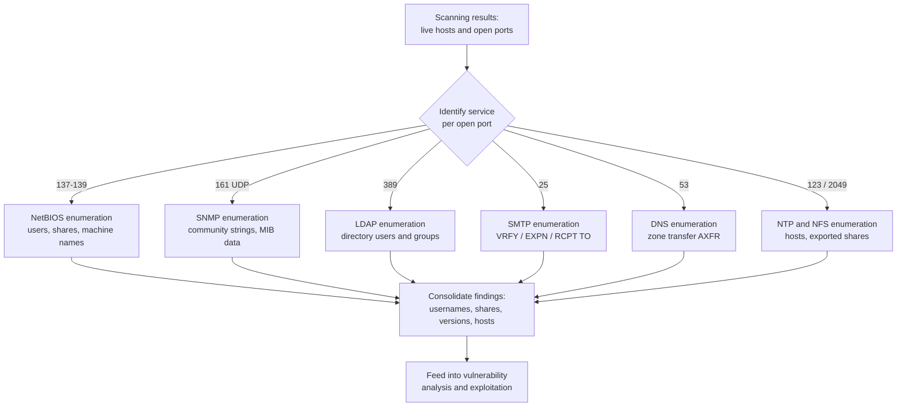

# Enumeration

> **What you'll learn:** How attackers (and ethical hackers) actively interrogate a target system to pull out usernames, network shares, services, and configuration details — and how defenders shut that door. **Prerequisites:** Basic networking (IP addresses, ports, TCP/UDP), a working knowledge of footprinting/scanning, and comfort with the Linux command line.

| | |
|---|---|
| **Course** | Professional Level 1 |
| **Course code** | SKL-CSP1-710 |
| **Module** | Enumeration |
| **Level** | level1 |

---

## 1. In Plain English

Imagine you're a burglar casing a building. **Footprinting** is reading the company sign, watching who comes and goes, and noting the address. **Scanning** is walking the perimeter and checking which doors and windows exist and which ones are unlocked. **Enumeration** is the next step: you've found an unlocked door, so now you slip inside the lobby and start reading the staff directory on the wall, the names on the mailboxes, and the building map taped to the reception desk. You're not breaking anything yet — you're just collecting the specific, named details that will let you walk straight to the right office later.

In computer terms, enumeration is the act of **actively connecting to a target system and asking it questions to extract named resources** — user accounts, group names, machine names, network shares, running services, software versions, and configuration settings. The key word is *active*: unlike passive reconnaissance where you quietly observe, enumeration involves making real connections to the target, so it's noisier and more likely to be logged.

Why should a total beginner care? Because almost every serious breach starts with the attacker building a detailed list of "what's here and who's here." A single valid username, a misconfigured file share, or a forgotten service banner can be the thread that unravels an entire network. Understanding enumeration teaches you to think like an attacker — and, more importantly, to spot and close the small information leaks that make attacks easy.

Throughout this note, everything offensive is framed strictly for **authorized testing, labs, and education**. Running these techniques against systems you don't own or have written permission to test is illegal in most countries.

---

## 2. Core Concepts

### Enumeration vs. Scanning vs. Footprinting

These three phases sit at the start of the ethical-hacking lifecycle and people often blur them together. Here's the clean distinction:

| Phase | What it answers | Activity level |
|---|---|---|
| **Footprinting / Reconnaissance** | "Who is the target and what's their public footprint?" | Mostly passive |
| **Scanning** | "Which hosts are alive and which ports/services are open?" | Active, broad |
| **Enumeration** | "What *named* resources, users, and details live behind those open services?" | Active, deep |

Enumeration is where you stop counting open doors and start reading what's written behind them.

### What an attacker is trying to extract

The typical "shopping list" during enumeration includes:

- **Usernames and user groups** — useful for password guessing and privilege mapping.
- **Machine/host names** — helps map the network's logical layout.
- **Network shares and services** — shared folders, printers, databases.
- **Routing tables and network information** — how traffic flows internally.
- **Application and OS version banners** — to match a service against known vulnerabilities.
- **SNMP and DNS details** — the "phone book" and "management console" of the network.

### Service banners

A **banner** is the little greeting text a service sends when you connect to it — for example, an email server replying `220 mail.example.com ESMTP Postfix (Ubuntu)`. **Banner grabbing** is the act of reading that greeting to learn the software name and version. It's one of the simplest forms of enumeration and one of the easiest to exploit, because the version often maps directly to a known weakness.

### NetBIOS

**NetBIOS** (Network Basic Input/Output System) is an old Windows protocol that lets computers on a local network find and talk to each other by name. It runs over TCP/UDP ports **137, 138, and 139**. Because NetBIOS happily tells you machine names, logged-in users, shared folders, and the workgroup/domain, it has historically been a goldmine for attackers enumerating Windows networks.

### SNMP

**SNMP** (Simple Network Management Protocol) lets administrators monitor and manage routers, switches, printers, and servers. It uses UDP port **161**. Devices expose a tree of data called a **MIB** (Management Information Base), and access is gated by a **community string** — essentially a plaintext password. The catch: many devices ship with the default community strings `public` (read-only) and `private` (read-write). If those defaults are left in place, an attacker can read — or even change — device configuration, ARP tables, running processes, and user accounts.

### LDAP

**LDAP** (Lightweight Directory Access Protocol) is the protocol behind directory services like Microsoft Active Directory. It runs on TCP/UDP port **389** (and **636** for LDAP over SSL). A directory is a hierarchical database of an organization's users, groups, computers, and policies. If LDAP allows **anonymous binds** (connecting without credentials), an attacker can query the directory and harvest the entire org chart — every username, email, and group.

### NTP

**NTP** (Network Time Protocol) keeps clocks synchronized across a network, using UDP port **123**. It seems harmless, but NTP servers can be queried for a list of hosts that recently connected to them (`monlist` and similar commands), revealing internal IP addresses and helping attackers map the network.

### NFS

**NFS** (Network File System) is a Unix/Linux protocol for sharing folders across a network, using port **2049**. If exported shares are misconfigured (e.g., readable/writable by the world), an attacker can list and mount them to read or plant files.

### SMTP

**SMTP** (Simple Mail Transfer Protocol) moves email between servers on TCP port **25**. Certain SMTP commands — `VRFY` (verify a user exists), `EXPN` (expand a mailing list), and `RCPT TO` — can be abused to confirm which usernames are valid on the mail server, producing a clean list of accounts to attack.

### DNS

**DNS** (Domain Name System) is the internet's phone book, translating names like `example.com` into IP addresses, on port **53**. A misconfigured DNS server may allow a **zone transfer** (the `AXFR` request) — a feature meant to copy DNS records between trusted servers. If exposed to anyone, it hands over the full list of an organization's hostnames and internal IPs in one shot.

---

## 3. How It Works (Step by Step)

A real enumeration workflow is methodical. The attacker (or pentester) moves from broad to specific:

1. **Discover live hosts and open ports.** Carrying results forward from the scanning phase, identify which IPs are up and which TCP/UDP ports are open (e.g., 25, 53, 139, 161, 389).
2. **Map ports to services.** Each open port hints at a protocol — 161 means SNMP, 389 means LDAP, 25 means SMTP, and so on.
3. **Grab banners.** Connect to each service and read its greeting to learn the software and version.
4. **Pick the right enumeration technique per service.** Use NetBIOS tools on 137-139, SNMP tools on 161, SMTP `VRFY` on 25, DNS zone transfers on 53, etc.
5. **Extract named resources.** Pull out usernames, shares, group memberships, device configs, and internal hostnames.
6. **Correlate and prioritize.** Combine everything into a picture of the network: who the admins are, which shares are writable, which versions are outdated. This directly feeds the **vulnerability analysis** and **exploitation** phases.



---

## 4. Real-World Examples

**1. SNMP default community strings.** For decades, network gear has shipped with the SNMP community strings `public` and `private` enabled by default. Auditors and attackers alike routinely find production routers, switches, and printers still using these defaults, allowing anyone on the network to read full device configurations — including, on some devices, plaintext or weakly obscured credentials. This is so common that "check for default SNMP strings" is a standard checklist item in every network penetration test.

**2. DNS zone transfers exposing internal infrastructure.** Misconfigured DNS servers that permit unrestricted `AXFR` zone transfers have repeatedly leaked entire internal hostname maps. A single `dig axfr` request can return every server name, mail host, and development box an organization runs, handing an attacker a ready-made target list. Public bug-bounty disclosures regularly cite open zone transfers as a finding.

**3. SMTP user enumeration feeding password attacks.** Mail servers that respond differently to `VRFY` or `RCPT TO` for valid versus invalid users let attackers build a verified list of real accounts. That clean username list is then fed into password-spraying attacks (trying one common password against many accounts), which has been a recurring root cause in email-account compromise incidents.

**4. NetBIOS/SMB null sessions (historical).** Older Windows systems allowed "null sessions" — anonymous connections to the IPC$ share over NetBIOS/SMB — that revealed user lists, shares, and password policies. This was famously abused in network worms and lateral-movement toolkits, which is why modern Windows restricts anonymous enumeration by default.

---

## 5. Tools of the Trade

> All commands below are for **authorized testing and lab use only.**

### Nmap (with NSE scripts)

The Swiss-army scanner. Beyond port scanning, its scripting engine (NSE) automates enumeration of many protocols.

```bash
# Enumerate SMB users, shares, and OS over NetBIOS/SMB on a target
nmap -p 139,445 --script smb-enum-users,smb-enum-shares,smb-os-discovery 192.168.56.101
```
This scans the SMB ports and runs scripts that list user accounts, shared folders, and the OS version.

### nbtscan / nmblookup

Query NetBIOS name tables to find machine names, workgroups, and logged-in users.

```bash
nbtscan 192.168.56.0/24
```
Sweeps a whole subnet and prints each host's NetBIOS name and any active services.

### snmpwalk / snmp-check

Walk the SNMP MIB tree using a community string.

```bash
# Read the full MIB tree using the default 'public' community string, SNMP v2c
snmpwalk -v2c -c public 192.168.56.101
```
`-v2c` sets the SNMP version, `-c public` supplies the community string, and the output dumps every readable value — system info, interfaces, processes, sometimes users.

### enum4linux

A wrapper that automates Windows/Samba enumeration (NetBIOS, SMB, RID cycling, shares, password policy).

```bash
enum4linux -a 192.168.56.101
```
`-a` runs "all simple" checks and produces a consolidated report of users, groups, shares, and policy.

### ldapsearch

Query an LDAP/Active Directory server.

```bash
# Attempt an anonymous bind and dump the directory base
ldapsearch -x -h 192.168.56.101 -b "dc=example,dc=com"
```
`-x` uses simple (anonymous) authentication, `-h` is the host, and `-b` sets the search base (the top of the directory tree to read from).

### dig / nslookup

Query DNS, including zone-transfer attempts.

```bash
# Attempt a full zone transfer from a DNS server
dig axfr example.com @ns1.example.com
```
If the server is misconfigured to allow it, this returns every DNS record for the domain.

### smtp-user-enum

Validate usernames against an SMTP server.

```bash
smtp-user-enum -M VRFY -U users.txt -t 192.168.56.101
```
`-M VRFY` chooses the VRFY method, `-U` supplies a username wordlist, and `-t` is the target. It reports which usernames the server confirms as valid.

---

## 6. Hands-On Lab (Authorized / Lab-Only)

> **Reminder: Only run this against systems you own or are explicitly authorized to test.** This lab uses **Metasploitable 2**, an intentionally vulnerable Linux VM, on an isolated host-only network. The attacker is a Kali Linux VM. Assume Metasploitable is at `192.168.56.101`.

**Goal:** Enumerate the target across SMB, SNMP, and SMTP, then explain what each result tells us.

### Step 1 — Confirm the target and open services

```bash
nmap -sV 192.168.56.101
```
*Expected output (trimmed):*
```
25/tcp   open  smtp        Postfix smtpd
139/tcp  open  netbios-ssn Samba smbd
445/tcp  open  netbios-ssn Samba smbd
2049/tcp open  nfs
```
**Interpretation:** SMTP, Samba (SMB/NetBIOS), and NFS are all open — three rich enumeration targets. The `-sV` flag also grabbed version banners (Postfix, Samba).

### Step 2 — Enumerate SMB / NetBIOS with enum4linux

```bash
enum4linux -a 192.168.56.101
```
*Expected output (trimmed):*
```
[+] Got domain/workgroup name: WORKGROUP
[+] Users on 192.168.56.101:
    user:[msfadmin] rid:[0x3e8]
    user:[user]     rid:[0x3ea]
[+] Share Enumeration:
    tmp   Disk  oh noes!
    IPC$  IPC   IPC Service
```
**Interpretation:** We recovered real usernames (`msfadmin`, `user`) and a writable `tmp` share. The usernames feed password attacks; the open share is a potential foothold.

### Step 3 — Enumerate SNMP

```bash
snmpwalk -v2c -c public 192.168.56.101 | head -n 20
```
*Expected output (trimmed):*
```
SNMPv2-MIB::sysDescr.0 = STRING: Linux metasploitable 2.6.24-16-server ...
SNMPv2-MIB::sysName.0 = STRING: metasploitable
```
**Interpretation:** The default `public` community string works, leaking the exact kernel version and hostname. That kernel string can be matched against known vulnerabilities in the next phase.

### Step 4 — Enumerate SMTP users

```bash
smtp-user-enum -M VRFY -U /usr/share/wordlists/metasploit/unix_users.txt -t 192.168.56.101
```
*Expected output (trimmed):*
```
192.168.56.101: root exists
192.168.56.101: postgres exists
192.168.56.101: user exists
```
**Interpretation:** The SMTP server answers `VRFY` honestly, confirming which accounts are real. Combined with the SMB usernames, we now have a validated account list.

### Step 5 — Consolidate

You now hold: confirmed usernames, a writable SMB share, and an exact OS/kernel version — exactly the inputs needed for the next phase. In a real engagement, every finding goes into your report with the evidence and the recommended fix.

---

## 7. Countermeasures & Defenses

**General**
- Disable unused services and close unneeded ports — you can't enumerate a service that isn't running.
- Apply the principle of least privilege so that even a successful connection reveals little.
- Log and monitor connection attempts; enumeration is *active* and therefore noisy. Alert on bursts of failed binds, repeated `VRFY` commands, or full MIB walks.

**NetBIOS / SMB**
- Disable NetBIOS over TCP/IP where it isn't needed.
- Block ports 137-139 and 445 at the perimeter firewall.
- Disable anonymous (null-session) access; on modern Windows, enforce the "Do not allow anonymous enumeration of SAM accounts and shares" policy.

**SNMP**
- Change default community strings (`public`/`private`) to strong, non-guessable values — or better, upgrade to **SNMPv3**, which adds authentication and encryption.
- Restrict SNMP access to specific management hosts via ACLs and block port 161 at the perimeter.
- Disable SNMP entirely on devices that don't need remote management.

**LDAP**
- Disable anonymous binds; require authentication for all queries.
- Use LDAPS (LDAP over TLS, port 636) to protect data in transit.
- Restrict which attributes anonymous or low-privilege users can read.

**NTP / NFS**
- Disable legacy NTP query commands (e.g., `monlist`) and restrict who can query the time server.
- For NFS, export shares only to specific trusted hosts, use `root_squash`, and avoid world-readable/writable exports.

**SMTP**
- Disable the `VRFY` and `EXPN` commands.
- Configure the server to return identical responses for valid and invalid recipients so attackers can't tell them apart.
- Apply rate limiting and connection throttling.

**DNS**
- Restrict zone transfers (`AXFR`) to authorized secondary servers only.
- Split internal and external DNS so internal hostnames never appear in public records.
- Monitor for unexpected `AXFR` requests.

---

## 8. Key Terms

- **Enumeration** — Actively connecting to a target to extract named resources (users, shares, services, configs).
- **Banner grabbing** — Reading a service's greeting text to learn its software name and version.
- **NetBIOS** — Legacy Windows naming/communication protocol on ports 137-139.
- **SMB** — Server Message Block; the file/printer-sharing protocol often enumerated alongside NetBIOS (ports 139/445).
- **Null session** — An anonymous, credential-free connection to a Windows IPC$ share.
- **SNMP** — Simple Network Management Protocol (UDP 161) for monitoring devices.
- **Community string** — A plaintext password gating SNMP access (`public`, `private` by default).
- **MIB** — Management Information Base; the tree of data an SNMP device exposes.
- **LDAP** — Lightweight Directory Access Protocol (389/636) behind directory services like Active Directory.
- **Anonymous bind** — Connecting to LDAP without credentials.
- **NTP** — Network Time Protocol (UDP 123) for clock synchronization.
- **NFS** — Network File System (port 2049) for Unix/Linux file sharing.
- **SMTP** — Simple Mail Transfer Protocol (port 25) for sending email; abused via `VRFY`/`EXPN`/`RCPT TO`.
- **Zone transfer (AXFR)** — A DNS feature that copies all records of a domain between servers; dangerous if exposed.
- **Community of named resources** — The usernames, groups, shares, and hosts an attacker compiles during enumeration.

---

## 9. Summary & Takeaways

- **Enumeration is active and deep:** it goes beyond "what ports are open" to "what users, shares, and details live behind them."
- **It directly enables exploitation:** a single valid username, default password, or open share can become an attacker's foothold.
- **Every protocol has its own enumeration vector** — NetBIOS/SMB for Windows resources, SNMP for device configs, LDAP for directories, SMTP for usernames, DNS for hostnames, NTP and NFS for network and file details.
- **Defaults are the enemy:** default SNMP community strings, anonymous LDAP binds, and open DNS zone transfers cause most real-world leaks.
- **Because it's active, it's detectable:** enumeration generates connections and logs, so good monitoring catches it.
- **Defense is mostly hygiene:** disable unused services, kill anonymous access, change defaults, restrict by ACL, and encrypt where possible.
- **Always authorized:** these techniques are legal only against systems you own or are contracted to test.

**Further reading:** OWASP Testing Guide (Information Gathering & Enumeration sections); NIST SP 800-115 (*Technical Guide to Information Security Testing and Assessment*); MITRE ATT&CK tactic **Discovery (TA0007)** and techniques such as Network Service Discovery; vendor hardening guides for Microsoft Active Directory and SNMPv3.
