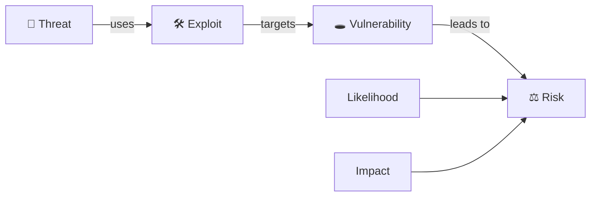
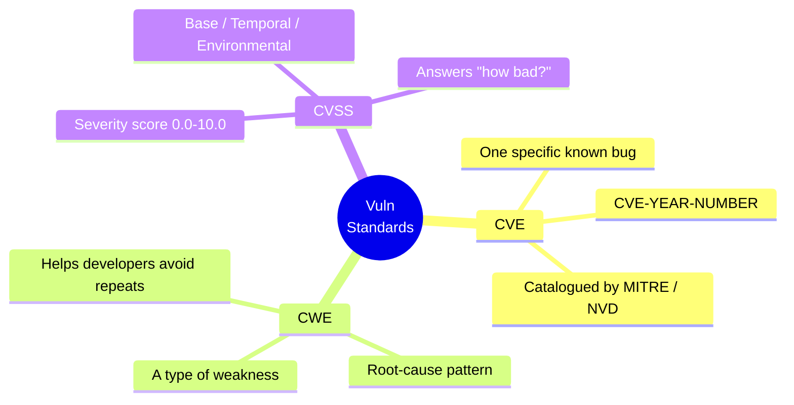
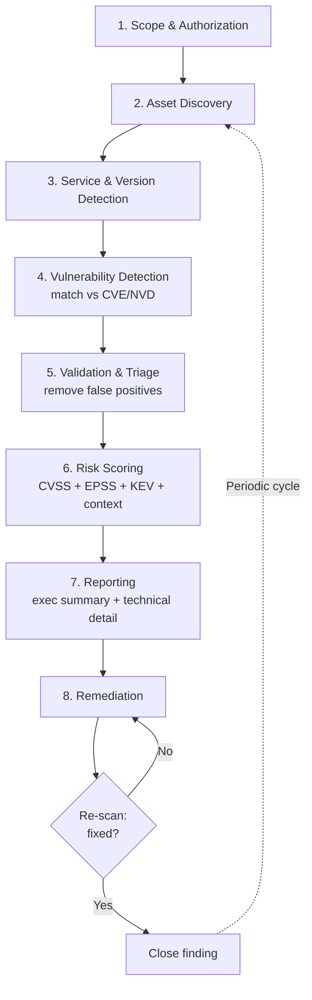
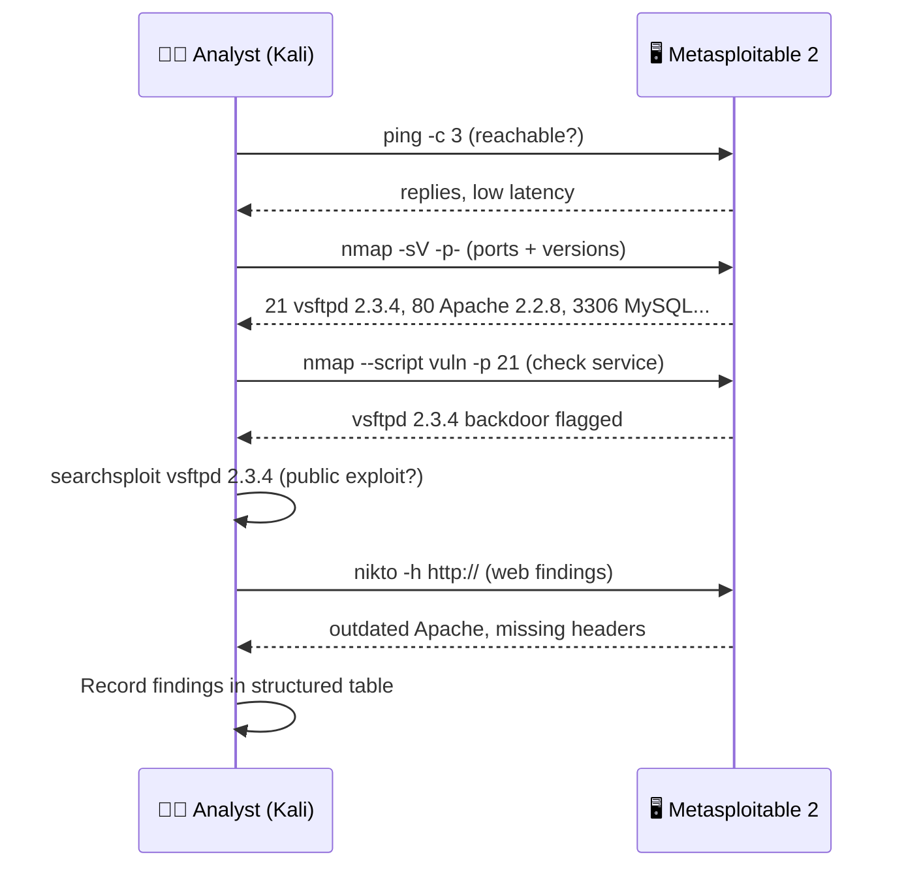
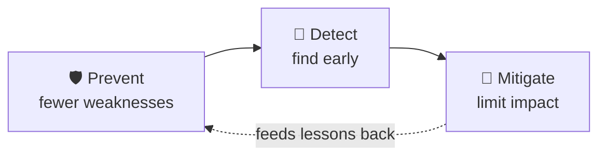

# Vulnerability Analysis 🔍

> **What you'll learn:** how to find, classify, score, and report security weaknesses in systems *before* attackers exploit them.
> **Prerequisites:** basic networking (IP addresses, ports, TCP/IP), familiarity with the Linux command line, and a high-level understanding of what a "vulnerability" is.

| | |
|---|---|
| 📘 **Course** | Professional Level 1 |
| 🔖 **Course code** | SKL-CSP1-710 |
| 🧩 **Module** | Vulnerability Analysis (Module 05) |
| 🎚️ **Level** | level1 |

---

## 1. In Plain English

Think of your house: doors, windows, a garage, a basement. A **vulnerability** is any one of those that someone who shouldn't be able to open it *can* — an unlocked window, a flimsy back-door latch, a spare key under the mat. **Vulnerability analysis** is walking around with a checklist, finding every weak spot, deciding which a burglar is most likely to use, and writing a clear report so the right things get fixed first.

In computing the "house" is a server, an app, a network, or a whole company's infrastructure. The "weak spots" are software bugs, misconfigurations, default passwords, and outdated programs. Attackers constantly scan the internet for these, so defenders must find them *first*.

- 💼 **Why care?** Almost every major breach you've heard of started with a *known, fixable* weakness nobody patched in time.
- 🧰 **It's a real job.** Systematically discovering and prioritizing weaknesses is one of the most in-demand cybersecurity skills — and it's mostly methodical checklist work, not movie-style hacking.

> 🔑 **Key idea:** A **vulnerability assessment** *finds and lists* weaknesses. A **penetration test** goes further and actually *exploits* them to prove damage. This module is about the *assessment* — the find-and-prioritize stage.

---

## 2. Core Concepts

### 2.1 What is a vulnerability assessment?

A **vulnerability assessment (VA)** is a systematic review of a system to identify, quantify, and prioritize security weaknesses. The output is a *ranked list* of issues with enough detail to fix them. It is **broad** (many hosts, many issue types) but **shallow** (it doesn't deeply exploit each finding) — think *breadth-first inventory of weaknesses*.

| Property | What it means |
|---|---|
| 🔁 **Repeatable** | Run it weekly and compare results over time. |
| 🤖 **Mostly automated** | Scanners do the heavy lifting; humans verify and prioritize. |
| 🩹 **Non-destructive** | Done correctly it shouldn't crash production — though aggressive scans sometimes can, which is why scope and timing matter. |

### 2.2 Vulnerability vs. threat vs. risk vs. exploit

These four words get mixed up constantly. Define them once and the rest of the field clicks into place.

| Term | Plain definition | House analogy |
|---|---|---|
| 🕳️ **Vulnerability** | A weakness (e.g., an unpatched web server). | The unlocked window. |
| 👤 **Threat** | Someone/something that could take advantage of it (e.g., a ransomware gang). | The burglar. |
| 🛠️ **Exploit** | The actual technique or code that abuses the weakness. | The crowbar + technique to climb in. |
| ⚖️ **Risk** | *How likely* a threat exploits the vuln × *how bad* the impact would be. What business leaders care about. | The chance you get robbed and what they take. |

> 🔑 **Key idea:** **Risk = Likelihood × Impact.**



### 2.3 Vulnerability classification: CVE, CWE, and CVSS

To discuss millions of weaknesses across the whole industry, we need shared naming and scoring. Three standards do this.



#### CVE — Common Vulnerabilities and Exposures
A **CVE** is a unique ID for a *specific, publicly known* vulnerability in a *specific product* — e.g., `CVE-2021-44228` (Log4Shell). Format: `CVE-<year>-<number>`. CVEs are catalogued by MITRE and listed in the U.S. National Vulnerability Database (NVD), so everyone refers to a flaw by the same name.

#### CWE — Common Weakness Enumeration
A **CWE** describes a *category* of weakness, not one instance. `CWE-89` is "SQL Injection"; `CWE-79` is "Cross-Site Scripting (XSS)." Where a CVE says *"this exact product version is broken,"* a CWE says *"this is the class of mistake that caused it"* — helping developers avoid repeating the root-cause pattern.

| Standard | Answers the question | Example |
|---|---|---|
| 🆔 **CVE** | *Which specific known bug?* | CVE-2021-44228 (Log4Shell) |
| 🧬 **CWE** | *What type of weakness?* | CWE-502 (Deserialization of Untrusted Data) |
| 📊 **CVSS** | *How severe is it?* | 10.0 (Critical) |

#### CVSS — Common Vulnerability Scoring System
**CVSS** scores a vulnerability **0.0–10.0** — the standard answer to "how bad is this?" The score is built from **metrics** in three groups:

| Group | What it captures | Examples |
|---|---|---|
| 🧱 **Base** | Intrinsic, unchanging properties | Attack Vector (network/adjacent/local/physical), Attack Complexity, Privileges Required, User Interaction, and impact to **C/I/A** |
| ⏱️ **Temporal** | Things that change over time | Whether a working exploit exists yet |
| 🌍 **Environmental** | How it matters *in your environment* | A flaw on an internet-facing server is worse than the same flaw on an isolated test box |

> 💡 **Tip:** The "C/I/A" in the Base group is the **CIA triad** — Confidentiality, Integrity, Availability — the three impact dimensions every score weighs.

**Severity bands (CVSS v3.x):**

| Score | Severity |
|---|---|
| 0.0 | ⚪ None |
| 0.1 – 3.9 | 🟢 Low |
| 4.0 – 6.9 | 🟡 Medium |
| 7.0 – 8.9 | 🟠 High |
| 9.0 – 10.0 | 🔴 Critical |

> ⚠️ **Warning:** CVSS v4.0 exists and refines the metrics, but the 0–10 scale and Low/Medium/High/Critical bands are the same idea. **Always check which version a tool reports.**

> 🔑 **Key idea: CVSS is *not* the same as risk.** A "Critical 9.8" on a machine with no network access and no sensitive data may matter less than a "Medium 6.1" on your public payment server. CVSS is the *starting point*; you adjust with environmental context. Newer frameworks help focus on what attackers actually use:
> - **EPSS** — Exploit Prediction Scoring System: the probability a vuln will be exploited in the wild.
> - **CISA KEV** — Known Exploited Vulnerabilities catalog: flaws confirmed to be under active attack.

### 2.4 Authenticated vs. unauthenticated scans

| Scan type | Scanner has login? | Sees what... | Accuracy | Best for |
|---|---|---|---|---|
| 🌐 **Unauthenticated (network)** | No | An outside attacker sees | Lower — guesses a lot | Understanding external exposure |
| 🔐 **Authenticated (credentialed)** | Yes (SSH/Windows) | Installed packages, patch levels, configs directly | High — fewer false positives | Internal / compliance scanning |

### 2.5 False positives and false negatives

| Term | Meaning | Why it hurts |
|---|---|---|
| 🟥 **False positive** | Scanner reports a vuln that isn't actually exploitable | Wastes time → this is why human **validation** matters |
| 🟦 **False negative** | A real vuln the scanner *missed* | More dangerous — gives false confidence |

---

## 3. How It Works (Step by Step)

A vulnerability assessment follows a repeatable lifecycle:

1. 🤝 **Scope & authorization** — agree exactly which IPs/hosts/apps are in scope, the time window, and get **written permission**. Never scan systems you don't own or aren't authorized to test.
2. 🛰️ **Asset discovery** — find what's actually alive on the network (host discovery, port scanning). You can't assess what you don't know exists.
3. 🔎 **Service & version detection** — for each open port, identify the service and software version (e.g., "Apache 2.4.49 on port 80").
4. 🗂️ **Vulnerability detection** — match discovered services/versions against vulnerability databases (CVE/NVD) using a scanner's plugin checks.
5. ✅ **Validation / triage** — remove false positives, confirm findings, enrich with context (internet-facing? sensitive data?).
6. ⚖️ **Risk scoring & prioritization** — combine CVSS base scores with environmental context, EPSS, and KEV to rank what to fix first.
7. 📄 **Reporting** — produce two outputs: an executive summary for leadership and a detailed technical report for remediators.
8. 🔁 **Remediation & re-scan** — apply fixes, then scan again to verify. This closes the loop and is often forgotten.



---

## 4. Real-World Examples

> 🔑 **Common thread:** in all three cases the weakness was *known and fixable*. Vulnerability analysis is the discipline that closes the gap between "a fix exists" and "the fix is applied."

| Incident | CVE | Weakness (CWE) | CVSS | The process lesson |
|---|---|---|---|---|
| 🪵 **Log4Shell** (Dec 2021) | CVE-2021-44228 | CWE-502 (unsafe deserialization / JNDI abuse) | 10.0 🔴 | A single library buried in thousands of products triggered a global scramble. Orgs with accurate **inventories** found affected systems in *hours*; others took *weeks*. → why **asset discovery** is step 2. |
| 🏦 **Equifax** (2017) | CVE-2017-5638 (Apache Struts) | Remote code execution | High 🟠 | A patch existed *months earlier*. ~147 million people exposed. The failure was the *process* — not detecting and patching in time. → the case for regular **authenticated** VAs with tracked remediation. |
| 💥 **EternalBlue / WannaCry** (2017) | CVE-2017-0144 (SMB) | Protocol flaw | High 🟠 | Microsoft shipped patch MS17-010 *before* the outbreak. Orgs with a vuln-management program detecting unpatched SMB were largely protected; many without it were crippled. |

**Log4Shell** is worth dwelling on: attackers ran code on a server just by getting it to *log* a specially crafted string. The reach of one tiny logging library is why software inventory and dependency scanning matter so much.

> 🖼️ *Suggested image: timeline graphic of the Log4Shell disclosure → exploitation window (Dec 2021), showing how fast attacks followed public disclosure.*

---

## 5. Tools of the Trade

| Tool | Category | Use case | Cost |
|---|---|---|---|
| 🗺️ **Nmap** | Network/port scanner | Discover hosts, ports, service versions; NSE vuln scripts | Free |
| 🛡️ **OpenVAS / Greenbone** | Vuln scanner | Full CVE-matching scans with scored reports | Open-source |
| 🏢 **Nessus (Tenable)** | Vuln scanner | Industry-standard, accurate credentialed & compliance scans | Commercial |
| 🌐 **Nikto** | Web server scanner | Dangerous files, outdated software, misconfigurations | Free |
| 📚 **Searchsploit** | Exploit-DB lookup | Check whether public exploits exist (prioritization) | Free |

### 🗺️ Nmap — network and port scanner
Discovers live hosts, open ports, and service versions. Its scripting engine (NSE) includes vulnerability-detection scripts.

```bash
nmap -sV -sC -p- 192.168.56.101
```
`-sV` detects service versions, `-sC` runs default safe scripts, `-p-` scans all 65,535 ports. Tells you *what is running* before you check it for vulnerabilities.

```bash
nmap --script vuln 192.168.56.101
```
Runs the `vuln` category of NSE scripts to flag known vulnerabilities on detected services.

> 🖼️ *Suggested image: Nmap terminal output showing the open-ports / VERSION table for a scanned host.*

### 🛡️ OpenVAS / Greenbone — open-source vulnerability scanner
A full scanner with a large feed of vulnerability tests (NVTs). It scans hosts, matches against known CVEs, and produces scored reports.

```bash
# Example using the gvm CLI; targets and tasks are usually managed in the web UI
gvm-cli socket --xml "<get_tasks/>"
```
Lists configured scan tasks. In practice you create a target, attach a scan config, run it, and export a PDF/CSV report from the Greenbone web interface.

### 🏢 Nessus (Tenable) — commercial vulnerability scanner
An industry-standard scanner known for accuracy and credentialed scans. Configured mainly through its web UI, with policies for compliance and CIS benchmark checks.

### 🌐 Nikto — web server scanner
Quickly checks a web server for dangerous files, outdated software, and common misconfigurations.

```bash
nikto -h http://192.168.56.101
```
`-h` sets the target host; Nikto reports outdated server versions, risky default files, and missing security headers.

### 📚 Searchsploit — local exploit database lookup
Part of Exploit-DB. After identifying a service version, search whether public exploits exist (helps prioritization; lab-only for actual use).

```bash
searchsploit vsftpd 2.3.4
```
Searches the local Exploit-DB copy for known exploits matching that software and version.

---

## 6. Hands-On Lab (Authorized / Lab-Only)

> ⚠️ **Warning:** Perform these steps only against systems you own or are explicitly authorized to test — here, a **Metasploitable 2** VM on an isolated host-only network. Never point these tools at systems you do not control.

**Goal:** run a real assessment workflow against Metasploitable 2 (an intentionally vulnerable Linux VM) and interpret results. Assume its IP is `192.168.56.101` and you're on Kali Linux.

This lab walks the live half of the lifecycle — discovery → detection → triage → documentation — without exploiting anything:



**Step 1 — Confirm the target is reachable.**
```bash
ping -c 3 192.168.56.101
```
Expected: replies with low latency. If it times out, your VM networking (host-only adapter) is misconfigured.

**Step 2 — Discover open ports and service versions.**
```bash
nmap -sV -p- 192.168.56.101
```
Expected (abridged):
```
PORT     STATE SERVICE     VERSION
21/tcp   open  ftp         vsftpd 2.3.4
22/tcp   open  ssh         OpenSSH 4.7p1
80/tcp   open  http        Apache httpd 2.2.8
139/tcp  open  netbios-ssn Samba smbd 3.X
445/tcp  open  netbios-ssn Samba smbd 3.X
3306/tcp open  mysql       MySQL 5.0.51a
```
*Interpretation:* every line is an attack surface. Note the **versions** — they're old, which strongly hints at known CVEs. `vsftpd 2.3.4` should stand out (it historically shipped with a backdoor).

**Step 3 — Run vulnerability scripts on a suspicious service.**
```bash
nmap --script vuln -p 21 192.168.56.101
```
Expected: Nmap flags vsftpd 2.3.4 as associated with a known backdoor.
*Interpretation:* a candidate finding. Record the service, version, and matching weakness.

**Step 4 — Check for public exploits (prioritization, not exploitation).**
```bash
searchsploit vsftpd 2.3.4
```
Expected: a result referencing the vsftpd 2.3.4 backdoor command execution.
*Interpretation:* a public exploit existing raises the *likelihood* part of risk — pushing the finding up your priority list (like EPSS/KEV would).

**Step 5 — Scan the web server.**
```bash
nikto -h http://192.168.56.101
```
Expected: outdated Apache version, world-readable directories, and missing HTTP security headers.
*Interpretation:* multiple medium-severity web findings. Group them under "Web server hardening."

> 🖼️ *Suggested image: Nikto scan output highlighting outdated Apache and missing security headers.*

**Step 6 — Record findings in a structured table.** For each finding capture: **host, port/service, version, CWE category, CVE (if any), CVSS band, evidence (command output), remediation note.** This table becomes the core of your technical report.

> 💡 **Tip:** You've now completed discovery → detection → triage → documentation *without* exploiting anything destructively. That is a clean vulnerability assessment.

---

## 7. Countermeasures & Defenses

Defenses fall into three layers — prevent fewer weaknesses, detect them early, and limit impact when a fix isn't immediate.

| Layer | Goal | Key actions |
|---|---|---|
| 🛡️ **Prevent** | Reduce the number of weaknesses | • Accurate **asset inventory** (can't patch what you don't know exists)<br>• **Patch management** with SLAs (e.g., Critical patched within 7 days)<br>• Disable unused services/ports; remove default accounts & passwords<br>• Apply **secure baselines** (CIS Benchmarks)<br>• Secure coding to avoid CWE classes (SQLi, XSS) |
| 🔭 **Detect** | Find weaknesses early | • **Regular scheduled scans** — authenticated where possible<br>• Integrate scanning into CI/CD (images + dependencies)<br>• Subscribe to vendor advisories and **CISA KEV**<br>• Monitor for new/rogue assets (shadow IT) |
| 🧯 **Mitigate** | Lower impact when no fix yet | • Compensating controls: network segmentation, firewall, **WAF** rules<br>• Principle of **least privilege** to limit spread<br>• Prioritize by **risk context** (internet-facing + sensitive data + active exploitation), not raw CVSS<br>• **Re-scan after remediation**, then close the finding |



---

## 8. Key Terms

| Term | Definition |
|---|---|
| **Vulnerability** | A weakness in a system that can be exploited to compromise security. |
| **Threat** | A potential cause of an unwanted incident (the actor or event). |
| **Risk** | Likelihood of a threat exploiting a vulnerability × the resulting impact. |
| **Exploit** | Code or technique that takes advantage of a vulnerability. |
| **Vulnerability Assessment (VA)** | Systematic identification, classification, and prioritization of weaknesses (find-and-list, not exploit). |
| **Penetration Test** | An authorized attempt to actually exploit weaknesses to prove impact. |
| **CVE** | Common Vulnerabilities and Exposures; a unique ID for one specific known vulnerability. |
| **CWE** | Common Weakness Enumeration; a category/type of weakness. |
| **CVSS** | Common Vulnerability Scoring System; a 0.0–10.0 severity score. |
| **CIA triad** | Confidentiality, Integrity, Availability; the three impact dimensions. |
| **NVD** | National Vulnerability Database; the U.S. repository of CVE data and CVSS scores. |
| **EPSS** | Exploit Prediction Scoring System; probability a vuln will be exploited in the wild. |
| **KEV** | CISA's Known Exploited Vulnerabilities catalog. |
| **Authenticated scan** | A scan that logs in for accurate, low-false-positive results. |
| **False positive** | A reported finding that is not actually exploitable. |
| **False negative** | A real vulnerability the scanner failed to detect. |

---

## 9. Summary & Takeaways

- 🔍 A **vulnerability assessment** systematically finds, classifies, and prioritizes weaknesses — broad and (mostly) non-destructive, unlike a penetration test which actively exploits.
- 🏷️ Three standards organize the field: **CVE** (a specific known bug), **CWE** (the type of weakness), **CVSS** (a 0–10 severity score). Know what each answers.
- ⚖️ **CVSS is a starting point, not final risk.** Combine it with environmental context, EPSS, and the CISA KEV catalog to prioritize what to actually fix first.
- 🔁 The process is a repeatable loop: scope → discover → detect → validate → score → report → remediate → **re-scan**. Skipping discovery or re-scan is how breaches happen.
- 🔐 **Authenticated scans** are far more accurate than unauthenticated ones; always validate findings to weed out false positives.
- 💥 Real breaches — **Equifax**, **Log4Shell**, **WannaCry** — all exploited *known, fixable* vulnerabilities, proving the value of disciplined vulnerability management.
- 📄 A good report has two halves: an **executive summary** (risk, in business terms) and a **technical section** (host, evidence, CVE/CVSS, clear remediation steps).
- ✅ Only scan systems you **own or are authorized** to test — always get written permission and define scope first.

**Further reading:** OWASP Web Security Testing Guide and OWASP Top Ten; NIST SP 800-115 (Technical Guide to Information Security Testing and Assessment); MITRE CVE and CWE programs and the CWE Top 25; FIRST CVSS specification (v3.1 / v4.0); and the CISA Known Exploited Vulnerabilities (KEV) catalog.
