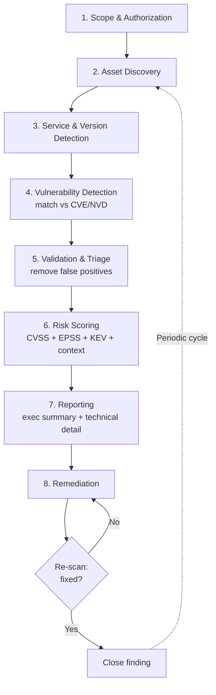

# Vulnerability Analysis

> What you'll learn: how to find, classify, score, and report security weaknesses in systems before attackers exploit them.
> Prerequisites: basic networking (IP addresses, ports, TCP/IP), familiarity with the Linux command line, and a working understanding of what a "vulnerability" is at a high level.

| | |
|---|---|
| **Course** | Professional Level 1 |
| **Course code** | SKL-CSP1-710 |
| **Module** | Vulnerability Analysis (Module 05) |
| **Level** | level1 |

---

## 1. In Plain English

Imagine your house has doors, windows, a garage, and a basement. A **vulnerability** is any one of those that can be opened by someone who shouldn't be able to open it — an unlocked window, a back door with a flimsy latch, a spare key under the mat. **Vulnerability analysis** is the process of walking around your house with a checklist, finding every weak spot, deciding which ones a burglar is most likely to use, and writing down a clear report so the right things get fixed first.

In computing, the "house" is a server, an app, a network, or a whole company's infrastructure. The "weak spots" are software bugs, misconfigurations, default passwords, and outdated programs. Attackers actively scan the internet looking for these weaknesses, so the defenders need to find them *first*. That is exactly what vulnerability analysis does.

Why should a total beginner care? Because almost every major breach you've heard about started with a known, fixable weakness that nobody patched in time. The skill of systematically discovering and prioritizing these weaknesses is one of the most in-demand jobs in cybersecurity — and it is mostly methodical checklist work, not movie-style hacking.

One important distinction up front: a **vulnerability assessment** finds and lists weaknesses; a **penetration test** goes further and actually tries to exploit them to prove the damage. This module is about the *assessment* — the find-and-prioritize stage.

---

## 2. Core Concepts

### 2.1 What is a vulnerability assessment?

A **vulnerability assessment (VA)** is a systematic review of a system to identify, quantify, and prioritize security weaknesses. The output is a ranked list of issues with enough detail for someone to fix them. It is broad (covers many hosts and many issue types) but shallow (it does not deeply exploit each finding). Think *breadth-first inventory of weaknesses*.

Key properties:
- **Repeatable** — you can run it weekly and compare results over time.
- **Mostly automated** — scanners do the heavy lifting, humans verify and prioritize.
- **Non-destructive** (when done correctly) — it should not crash production systems, though aggressive scans sometimes can, which is why scope and timing matter.

### 2.2 Vulnerability vs. threat vs. risk vs. exploit

These four words get mixed up constantly. Define them once and the rest of the field makes sense.

- **Vulnerability** — a weakness (e.g., an unpatched web server).
- **Threat** — something or someone that could take advantage of the weakness (e.g., a ransomware gang).
- **Exploit** — the actual technique or code that takes advantage of the vulnerability.
- **Risk** — the combination: *how likely* a threat exploits the vulnerability, multiplied by *how bad* the impact would be. Risk is what business leaders ultimately care about.

A handy formula: **Risk = Likelihood × Impact**.

### 2.3 Vulnerability classification: CVE, CWE, and CVSS

To talk about millions of weaknesses across the whole industry, we need shared naming and scoring. Three standards do this.

#### CVE — Common Vulnerabilities and Exposures
A **CVE** is a unique ID for a *specific, publicly known* vulnerability in a *specific product*. It looks like `CVE-2021-44228` (the famous Log4Shell flaw). The format is `CVE-<year>-<number>`. CVEs are catalogued by MITRE and listed in the U.S. National Vulnerability Database (NVD). When a vendor announces a flaw, it almost always gets a CVE so everyone refers to it by the same name.

#### CWE — Common Weakness Enumeration
A **CWE** describes a *category* or *type* of weakness, not one specific instance. For example, `CWE-89` is "SQL Injection" and `CWE-79` is "Cross-Site Scripting (XSS)." Where a CVE says *"this exact product version is broken,"* a CWE says *"this is the class of programming mistake that caused it."* CWEs help developers understand the root-cause pattern so they can avoid repeating it.

| Standard | Answers the question | Example |
|---|---|---|
| **CVE** | *Which specific known bug?* | CVE-2021-44228 (Log4Shell) |
| **CWE** | *What type of weakness?* | CWE-502 (Deserialization of Untrusted Data) |
| **CVSS** | *How severe is it?* | 10.0 (Critical) |

#### CVSS — Common Vulnerability Scoring System
**CVSS** gives a vulnerability a severity score from **0.0 to 10.0**. It is the standard way to answer "how bad is this?" The score is built from several **metrics** grouped into categories:

- **Base metrics** — intrinsic, unchanging properties: how the vuln is reached (Attack Vector — network/adjacent/local/physical), how hard it is (Attack Complexity), what privileges are needed (Privileges Required), whether a user must be tricked (User Interaction), and the impact to **Confidentiality, Integrity, and Availability** (the "CIA triad").
- **Temporal metrics** — things that change over time, like whether a working exploit exists yet.
- **Environmental metrics** — how the vuln matters *in your specific environment* (a flaw in an internet-facing server is worse than the same flaw on an isolated test box).

Severity bands (CVSS v3.x):

| Score | Severity |
|---|---|
| 0.0 | None |
| 0.1 – 3.9 | Low |
| 4.0 – 6.9 | Medium |
| 7.0 – 8.9 | High |
| 9.0 – 10.0 | Critical |

Note: CVSS v4.0 exists and refines these metrics, but the 0–10 scale and the Low/Medium/High/Critical bands are the same idea. Always check which version a tool reports.

A crucial real-world lesson: **CVSS is not the same as risk.** A "Critical 9.8" on a machine with no network access and no sensitive data may be lower priority than a "Medium 6.1" on your public payment server. CVSS is the starting point; you adjust with environmental context. Newer prioritization frameworks like **EPSS** (Exploit Prediction Scoring System — the probability a vuln will be exploited in the wild) and **CISA's KEV** (Known Exploited Vulnerabilities catalog) help focus on what attackers are *actually* using.

### 2.4 Authenticated vs. unauthenticated scans

- **Unauthenticated (network) scan** — the scanner has no login. It sees what an outside attacker sees. Good for understanding external exposure, but it guesses a lot.
- **Authenticated (credentialed) scan** — the scanner logs in (SSH/Windows credentials) and inspects installed packages, patch levels, and configs directly. Far more accurate and produces fewer false positives. Preferred for internal/compliance scanning.

### 2.5 False positives and false negatives

- **False positive** — the scanner reports a vulnerability that isn't actually exploitable. Wastes time. This is why human **validation** matters.
- **False negative** — a real vulnerability the scanner *missed*. More dangerous because it gives false confidence.

---

## 3. How It Works (Step by Step)

A vulnerability assessment follows a repeatable lifecycle. Here is the typical flow:

1. **Scope & authorization** — agree exactly which IPs/hosts/apps are in scope, the time window, and get **written permission**. Never scan systems you don't own or aren't authorized to test.
2. **Asset discovery** — find what is actually alive on the network (host discovery, port scanning). You can't assess what you don't know exists.
3. **Service & version detection** — for each open port, identify the service and software version (e.g., "Apache 2.4.49 on port 80").
4. **Vulnerability detection** — match discovered services/versions against vulnerability databases (CVE/NVD) using a scanner's plugin checks.
5. **Validation / triage** — remove false positives, confirm findings, and enrich with context (is it internet-facing? sensitive data?).
6. **Risk scoring & prioritization** — combine CVSS base scores with environmental context, EPSS, and KEV to rank what to fix first.
7. **Reporting** — produce two outputs: an executive summary for leadership and a detailed technical report for the people who will remediate.
8. **Remediation & re-scan** — fixes are applied, then you scan again to verify (this closes the loop and is often forgotten).



---

## 4. Real-World Examples

**Log4Shell (CVE-2021-44228, December 2021).** A flaw in the widely used Java logging library Log4j let attackers run code on a server just by getting it to *log* a specially crafted string. It scored CVSS 10.0 (Critical) and the underlying weakness type was CWE-502 (unsafe deserialization / JNDI lookup abuse). The lesson for vulnerability analysts: a single library buried deep inside thousands of products created a global scramble. Organizations that maintained accurate software inventories could find affected systems in hours; those without inventories took weeks. This is why **asset discovery** is step two of the process.

**Equifax breach (2017).** Attackers exploited a known vulnerability in the Apache Struts web framework (CVE-2017-5638) for which a patch had already been released months earlier. The data of roughly 147 million people was exposed. The vulnerability had a CVE, a high CVSS score, and an available fix — the failure was in the *process*: the weakness was not detected and patched in time. This is the single best argument for running regular, authenticated vulnerability assessments and tracking remediation to completion.

**EternalBlue / WannaCry (2017).** The WannaCry ransomware spread using EternalBlue (related to CVE-2017-0144), an SMB protocol flaw in Windows. Microsoft had released a patch (MS17-010) before the outbreak. Organizations that had a vulnerability management program detecting unpatched SMB were largely protected; many that didn't were crippled.

The common thread: in all three cases the weakness was *known and fixable*. Vulnerability analysis is the discipline that closes the gap between "a fix exists" and "the fix is applied."

---

## 5. Tools of the Trade

### Nmap — network and port scanner
Discovers live hosts, open ports, and service versions. It also has a scripting engine (NSE) with vulnerability-detection scripts.

```bash
nmap -sV -sC -p- 192.168.56.101
```
`-sV` detects service versions, `-sC` runs default safe scripts, `-p-` scans all 65,535 ports. This tells you *what is running* before you check it for vulnerabilities.

```bash
nmap --script vuln 192.168.56.101
```
Runs the `vuln` category of NSE scripts to flag known vulnerabilities on detected services.

### OpenVAS / Greenbone — open-source vulnerability scanner
A full scanner with a large feed of vulnerability tests (NVTs). It scans hosts, matches against known CVEs, and produces scored reports.

```bash
# Example using the gvm CLI; targets and tasks are usually managed in the web UI
gvm-cli socket --xml "<get_tasks/>"
```
Lists configured scan tasks. In practice you create a target, attach a scan config, run it, and export a PDF/CSV report from the Greenbone web interface.

### Nessus (Tenable) — commercial vulnerability scanner
An industry-standard scanner known for accuracy and credentialed scans. Configured mainly through its web UI, but supports policies for compliance and CIS benchmark checks.

### Nikto — web server scanner
Quickly checks a web server for dangerous files, outdated software, and common misconfigurations.

```bash
nikto -h http://192.168.56.101
```
`-h` sets the target host; Nikto reports outdated server versions, risky default files, and missing security headers.

### Searchsploit — local exploit database lookup
Part of Exploit-DB. After you identify a service version, search whether public exploits exist (helps with prioritization, lab-only for actual use).

```bash
searchsploit vsftpd 2.3.4
```
Searches the local Exploit-DB copy for known exploits matching that software and version.

---

## 6. Hands-On Lab (Authorized / Lab-Only)

> Reminder: perform these steps only against systems you own or are explicitly authorized to test — here, a **Metasploitable 2** virtual machine on an isolated host-only network. Never point these tools at systems you do not control.

**Goal:** run a real assessment workflow against Metasploitable 2 (an intentionally vulnerable Linux VM) and interpret the results. Assume Metasploitable's IP is `192.168.56.101` and you are running Kali Linux.

**Step 1 — Confirm the target is reachable.**
```bash
ping -c 3 192.168.56.101
```
Expected: replies with low latency. If it times out, your VM networking (host-only adapter) is misconfigured.

**Step 2 — Discover open ports and service versions.**
```bash
nmap -sV -p- 192.168.56.101
```
Expected (abridged):
```
PORT     STATE SERVICE     VERSION
21/tcp   open  ftp         vsftpd 2.3.4
22/tcp   open  ssh         OpenSSH 4.7p1
80/tcp   open  http        Apache httpd 2.2.8
139/tcp  open  netbios-ssn Samba smbd 3.X
445/tcp  open  netbios-ssn Samba smbd 3.X
3306/tcp open  mysql       MySQL 5.0.51a
```
*Interpretation:* every line is an attack surface. Note the **versions** — they are old, which strongly hints at known CVEs. `vsftpd 2.3.4` should immediately stand out (it shipped with a backdoor historically).

**Step 3 — Run vulnerability scripts on a suspicious service.**
```bash
nmap --script vuln -p 21 192.168.56.101
```
Expected: Nmap flags the vsftpd 2.3.4 service as associated with a known backdoor.
*Interpretation:* this is a candidate finding. You record the service, version, and the matching weakness.

**Step 4 — Check for public exploits (prioritization, not exploitation).**
```bash
searchsploit vsftpd 2.3.4
```
Expected: a result referencing the vsftpd 2.3.4 backdoor command execution.
*Interpretation:* a public exploit existing raises the *likelihood* part of risk — this pushes the finding up your priority list (similar to how EPSS/KEV would).

**Step 5 — Scan the web server.**
```bash
nikto -h http://192.168.56.101
```
Expected: Nikto reports an outdated Apache version, world-readable directories, and missing HTTP security headers.
*Interpretation:* multiple medium-severity web findings. Group them in your report under "Web server hardening."

**Step 6 — Record findings in a structured table.** For each finding capture: host, port/service, version, CWE category, CVE (if any), CVSS band, evidence (the command output), and a remediation note. This table becomes the core of your technical report (Section 2 below).

You have now completed discovery → detection → triage → documentation without exploiting anything destructively. That is a clean vulnerability assessment.

---

## 7. Countermeasures & Defenses

**Prevent (reduce the number of weaknesses):**
- Maintain an accurate **asset inventory** — you cannot protect or patch what you don't know exists.
- Establish a **patch management** program with defined SLAs (e.g., Critical patched within 7 days).
- Disable unused services and ports; remove default accounts and change default passwords.
- Apply **secure configuration baselines** (e.g., CIS Benchmarks) to harden systems.
- Build security into development (secure coding to avoid CWE classes like SQL injection and XSS).

**Detect (find weaknesses early):**
- Run **regular, scheduled vulnerability scans** — authenticated where possible for accuracy.
- Integrate scanning into CI/CD (scan container images and dependencies before deployment).
- Subscribe to vendor advisories and the **CISA KEV** catalog to learn of actively exploited flaws fast.
- Monitor for new assets appearing on the network (rogue/shadow IT).

**Mitigate (lower impact when a fix isn't immediate):**
- Apply compensating controls: network segmentation, firewall rules, and WAF (web application firewall) rules to shield an unpatched service.
- Use the principle of **least privilege** so a single compromise spreads less.
- Prioritize using **risk context** (internet-facing + sensitive data + active exploitation), not raw CVSS alone.
- Always **re-scan after remediation** to confirm the fix actually worked, then close the finding.

---

## 8. Key Terms

- **Vulnerability** — a weakness in a system that can be exploited to compromise security.
- **Threat** — a potential cause of an unwanted incident (the actor or event).
- **Risk** — likelihood of a threat exploiting a vulnerability multiplied by the resulting impact.
- **Exploit** — code or technique that takes advantage of a vulnerability.
- **Vulnerability Assessment (VA)** — systematic identification, classification, and prioritization of weaknesses (find-and-list, not exploit).
- **Penetration Test** — an authorized attempt to actually exploit weaknesses to prove impact.
- **CVE** — Common Vulnerabilities and Exposures; a unique ID for one specific known vulnerability.
- **CWE** — Common Weakness Enumeration; a category/type of weakness.
- **CVSS** — Common Vulnerability Scoring System; a 0.0–10.0 severity score.
- **CIA triad** — Confidentiality, Integrity, Availability; the three impact dimensions.
- **NVD** — National Vulnerability Database; the U.S. government repository of CVE data and CVSS scores.
- **EPSS** — Exploit Prediction Scoring System; probability a vuln will be exploited in the wild.
- **KEV** — CISA's Known Exploited Vulnerabilities catalog.
- **Authenticated scan** — a scan that logs in for accurate, low-false-positive results.
- **False positive** — a reported finding that is not actually exploitable.
- **False negative** — a real vulnerability the scanner failed to detect.

---

## 9. Summary & Takeaways

- A **vulnerability assessment** systematically finds, classifies, and prioritizes weaknesses; it is broad and (mostly) non-destructive, unlike a penetration test which actively exploits.
- Three standards organize the field: **CVE** (a specific known bug), **CWE** (the type of weakness), and **CVSS** (a 0–10 severity score). Know what each answers.
- **CVSS is a starting point, not final risk.** Combine it with environmental context, EPSS, and the CISA KEV catalog to prioritize what to actually fix first.
- The process is a repeatable loop: scope → discover → detect → validate → score → report → remediate → **re-scan**. Skipping discovery or re-scan is how breaches happen.
- **Authenticated scans** are far more accurate than unauthenticated ones; always validate findings to weed out false positives.
- Real breaches like **Equifax**, **Log4Shell**, and **WannaCry** all exploited *known, fixable* vulnerabilities — proving the value of disciplined vulnerability management.
- A good report has two halves: an **executive summary** (risk, in business terms) and a **technical section** (host, evidence, CVE/CVSS, and clear remediation steps).
- Only scan systems you **own or are authorized** to test — always get written permission and define scope first.

**Further reading:** OWASP Web Security Testing Guide and OWASP Top Ten; NIST SP 800-115 (Technical Guide to Information Security Testing and Assessment); MITRE CVE and CWE programs and the CWE Top 25; FIRST CVSS specification (v3.1 / v4.0) and the CISA Known Exploited Vulnerabilities (KEV) catalog.
