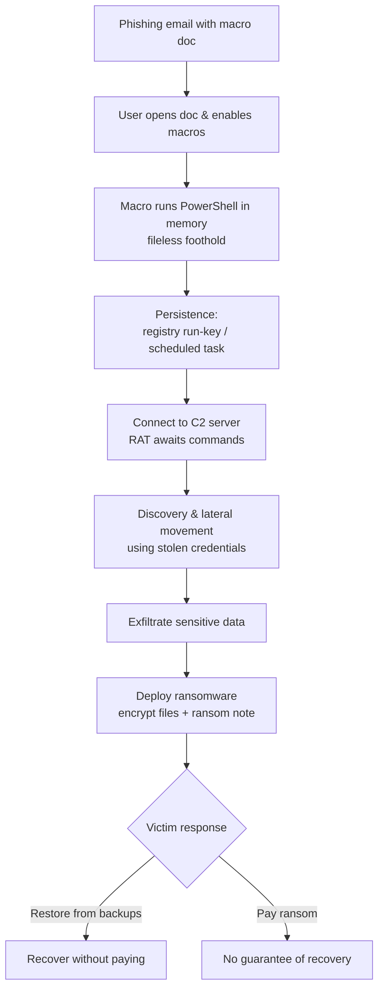

# Malware Threats

> **What you'll learn:** what malware is, the main families (trojans, viruses, worms, fileless, ransomware), how advanced attackers (APTs) use it, how analysts safely dissect it, and how defenders stop it.
> **Prerequisites:** basic familiarity with operating systems, files/processes, and networking (IP, ports). A safe, isolated lab (a VM you own) is required for the hands-on section.

| Course | Course code | Module | Level |
|--------|-------------|--------|-------|
| Skillogic CSPP — Professional Level 1 | SKL-CSP1-710 | Module 07: Malware Threats | level1 |

---

## 1. In Plain English

**Malware** — short for *malicious software* — is any program written to do something harmful to a computer, the data on it, or the person using it. Think of your computer as a house. Most visitors (programs) are invited and well-behaved. Malware is the burglar who slips in through an unlocked window, the con artist who knocks dressed as a delivery driver, or the squatter who changes the locks and demands rent. Same house, very different intentions.

Why should a total beginner care? Because malware is the single most common way attackers turn a security weakness into real damage — stolen passwords, drained bank accounts, leaked photos, frozen hospitals, halted factories. Almost every major cyber incident you read about involves malware at some stage. Understanding how it gets in and what it does is the foundation for defending against nearly everything else in security.

The good news: malware is not magic. It is just code, and code can be read, watched, and blocked. In this module we open the hood. We look at the different *kinds* of malware (each with its own trick), how a sophisticated attacker chains them together over weeks or months (an **APT**), how analysts study a suspicious file without getting infected, and how defenders detect and remove it. By the end you'll be able to look at a scary-sounding headline and understand roughly what happened and why.

---

## 2. Core Concepts

### Malware (the umbrella term)

**Malware** is the general category for all hostile software. Everything below is a *type* of malware, distinguished by how it spreads and what it does. Two useful axes to keep in mind:

- **Propagation** — how it copies and spreads (needs a host file? spreads on its own? tricks a user?).
- **Payload** — what it actually does once running (steal data, encrypt files, spy, mine cryptocurrency, give remote control).

### Virus

A **virus** is malware that attaches itself to a legitimate file or program (its *host*) and only runs — and spreads — when that host is opened by a person. Like a biological virus, it needs a host cell. Open the infected document or run the infected program, and the virus copies itself into other files. It cannot spread by itself; it relies on human action (sharing a file, running a program).

### Worm

A **worm** is like a virus but with one crucial difference: it spreads **by itself**, with no host file and no human required. It exploits a network vulnerability or weak credentials to copy itself from machine to machine automatically. Because it self-propagates, a worm can race across thousands of computers in minutes — making worms historically responsible for the fastest, largest outbreaks.

### Trojan

A **Trojan horse** (or just *trojan*) is malware disguised as something desirable or harmless — a free game, a cracked app, a fake invoice PDF, a "video codec" you need to install. The name comes from the wooden horse of Greek legend: the gift hides soldiers inside. A trojan does not self-replicate; it depends entirely on tricking the user into running it. Once running, common trojan payloads include:

- **RAT (Remote Access Trojan)** — gives the attacker remote control of the machine, like an invisible person at the keyboard.
- **Banking trojan** — steals financial credentials.
- **Dropper / loader** — its only job is to quietly download and install *other* malware.
- **Backdoor** — opens a hidden entry point for future access.

### Fileless Malware

Most malware writes a file to disk, which is exactly what antivirus loves to scan. **Fileless malware** avoids that by running entirely in **memory (RAM)** and abusing tools that are *already trusted and installed* on the system — a technique called **living off the land**. Favorite tools to abuse include PowerShell, Windows Management Instrumentation (WMI), and the Windows registry. Because there's little or no file on disk to scan, traditional signature-based antivirus often misses it. It typically arrives via a malicious document macro or a script and survives reboots by hiding in places like registry "run" keys or scheduled tasks.

### Ransomware

**Ransomware** encrypts the victim's files (scrambles them with a secret key) and demands payment — usually in cryptocurrency — for the key to unlock them. Modern ransomware gangs add **double extortion**: before encrypting, they *steal* a copy of the data and threaten to publish it if you don't pay, so even good backups don't fully protect you. Ransomware is now often sold "as a service" (**RaaS**), where developers rent the malware to less-skilled affiliates for a cut of the profits.

### APT (Advanced Persistent Threat)

An **APT** is not a type of malware — it's a *type of attacker*. The term describes a well-resourced, often state-sponsored group that conducts long, stealthy, targeted campaigns (the **P** is *Persistent* — they stay in the network for months or years, undetected, pursuing a specific goal like espionage). APTs use malware as one tool among many. The industry tracks their behavior using the **MITRE ATT&CK** framework, which catalogs the **tactics** (the attacker's goals, e.g., *Persistence*, *Exfiltration*) and **techniques** (the specific methods) they use. A common high-level model for an intrusion is the **Cyber Kill Chain**: Reconnaissance → Weaponization → Delivery → Exploitation → Installation → Command & Control → Actions on Objectives.

> **Command & Control (C2)** — the channel the malware uses to "phone home" to the attacker's server for instructions and to send out stolen data.

### Malware Analysis: Static vs Dynamic

To defend against malware, analysts must understand what a sample does. There are two complementary approaches:

- **Static analysis** — examining the file **without running it**. You inspect its bytes, strings, code structure, and metadata. It's safe (the code never executes) and fast, but attackers use **packing** and **obfuscation** (compressing/scrambling the code) to hide from it.
- **Dynamic analysis** — **running** the sample in a controlled, isolated environment (a **sandbox**) and watching its behavior: files it creates, registry keys it touches, network connections it makes, processes it spawns. It reveals real behavior that static analysis can't see, but it's slower and the malware may detect the sandbox and refuse to misbehave.

In practice, analysts use both: static first to triage, dynamic to confirm behavior.

| | Static analysis | Dynamic analysis |
|---|---|---|
| Does it run the code? | No | Yes (in a sandbox) |
| Safety | High | Requires isolation |
| Speed | Fast | Slower |
| Beats obfuscation? | Often blocked by packing | Reveals real behavior |
| Example tools | strings, PE viewers, disassemblers | sandbox, process monitor, network capture |

---

## 3. How It Works (Step by Step)

Let's trace a realistic intrusion that ties the concepts together — a phishing email leading to ransomware, the way many real breaches actually unfold.

1. **Delivery.** The victim receives a convincing email with an attachment (e.g., `Invoice_April.docm`, a Word doc with macros). This is the **delivery** phase.
2. **Exploitation / user action.** The victim opens the document and enables macros (because the doc says it must, to "view content"). The macro runs — this is the **trojan/dropper** behaving.
3. **Fileless foothold.** The macro launches PowerShell to download and run the next stage **in memory**, avoiding writing an obvious file to disk (living off the land).
4. **Installation / persistence.** The malware sets a registry run-key or scheduled task so it survives reboots.
5. **Command & Control (C2).** The implant connects out to the attacker's server, awaiting commands. The attacker now has a foothold (a **RAT**).
6. **Discovery & lateral movement.** The attacker maps the network and spreads to other machines using stolen credentials — worm-like movement, but human-directed (classic APT behavior).
7. **Exfiltration.** Sensitive data is copied out to the attacker (enabling double extortion).
8. **Actions on objectives.** The **ransomware payload** deploys network-wide, encrypts files, and drops a ransom note.



---

## 4. Real-World Examples

**WannaCry (2017) — a ransomware worm.** WannaCry combined two malware types: it was **ransomware** that spread like a **worm**, using a Windows SMB network vulnerability (patched by Microsoft shortly before the outbreak) to self-propagate. It infected hundreds of thousands of systems across many countries in days, notably disrupting parts of the UK's National Health Service. The lesson: unpatched systems plus self-spreading malware equals a very fast, very large outbreak.

**NotPetya (2017) — disguised as ransomware, designed to destroy.** NotPetya looked like ransomware but was effectively a *wiper* — its real goal was destruction, and recovery via payment was not realistically possible. It spread aggressively through a compromised software update and trusted network mechanisms, causing massive collateral damage to global companies. The lesson: a ransom note doesn't guarantee your data is recoverable, and supply-chain delivery can hit even careful organizations.

**Emotet — a long-lived trojan/loader.** Emotet began as a banking trojan and evolved into a modular **loader** delivered through malicious email attachments. Its main job became installing *other* gangs' malware (including ransomware) for a fee — a clear example of the trojan-as-delivery-mechanism and the criminal "malware-as-a-service" economy. It was disrupted by international law enforcement in 2021. The lesson: one infection often opens the door to several others.

---

## 5. Tools of the Trade

These are standard, legitimate analysis tools. Use them only on samples in an isolated lab.

**`strings` — pull readable text out of a binary (static).** Malware often leaves clues in plain text: URLs, IP addresses, file paths, error messages.

```bash
strings -n 8 suspicious.bin | grep -Ei 'http|\.exe|\.dll|powershell'
```
Extracts strings at least 8 characters long, then filters for likely indicators (URLs, executables, PowerShell references).

**`file` — identify what a sample actually is (static).** Attackers rename files to mislead; `file` reads the contents.

```bash
file invoice.pdf
```
Reports the true type. If a "PDF" comes back as a Windows executable, that's a red flag.

**`sha256sum` — fingerprint a sample.** A cryptographic hash uniquely identifies the file so you can look it up in threat-intelligence databases without sharing the sample.

```bash
sha256sum suspicious.bin
```
Prints a unique 64-character fingerprint you can search against known-malware databases.

**`pestudio` / PE viewers — inspect Windows executable structure (static).** Shows imported functions (e.g., crypto or networking APIs hint at ransomware/C2), embedded resources, and signs of packing.

**`procmon` (Process Monitor, Sysinternals) — watch live behavior (dynamic).** In the sandbox, it records every file, registry, and process operation in real time so you can see exactly what the running sample touches.

**`Wireshark` / `tcpdump` — capture network traffic (dynamic).** Reveals C2 callbacks and exfiltration.

```bash
sudo tcpdump -i any -w capture.pcap
```
Records all network traffic to `capture.pcap` for later inspection in Wireshark — useful for spotting the malware "phoning home."

**`YARA` — write rules to recognize malware by patterns.** Defenders write signatures (strings/byte patterns) and scan files or memory for matches.

```bash
yara ransomware_rules.yar /samples/
```
Scans everything in `/samples/` against your rule file and reports matches.

---

## 6. Hands-On Lab (Authorized / Lab-Only)

> **Reminder: perform this only on systems and samples you own or are explicitly authorized to test, inside an isolated lab VM with no internet access to the rest of your network.**

We'll do **safe static analysis** of a *benign* test file inside a Linux VM (Kali or Ubuntu). We deliberately do **not** detonate real malware on a beginner setup — the goal is to learn the static-analysis workflow that you'd later apply to a real sample in a hardened sandbox. The well-known **EICAR test file** is a harmless string defined by the antivirus industry specifically so you can safely verify scanners and practice handling, without any real malicious code.

**Step 1 — Snapshot your VM.** Before any analysis, take a VM snapshot so you can roll back instantly.

**Step 2 — Create the EICAR test file (harmless).**
```bash
cat > eicar.com <<'EOF'
X5O!P%@AP[4\PZX54(P^)7CC)7}$EICAR-STANDARD-ANTIVIRUS-TEST-FILE!$H+H*
EOF
```
This writes the official EICAR test string. It is not malware — it only triggers antivirus *detection logic* for testing.

**Step 3 — Identify the file type.**
```bash
file eicar.com
```
*Expected:* a generic type such as `ASCII text`. **Interpretation:** the `file` command reads contents, not the extension — a first sanity check on what you're really dealing with.

**Step 4 — Fingerprint it.**
```bash
sha256sum eicar.com
```
*Expected:* a 64-character hash. **Interpretation:** this is the sample's unique ID. In real work you'd search this hash in a threat-intel database to see if it's already known, *before* doing deeper analysis.

**Step 5 — Extract readable strings.**
```bash
strings eicar.com
```
*Expected:* you'll see the `EICAR-STANDARD-ANTIVIRUS-TEST-FILE` text. **Interpretation:** in real malware this step often surfaces URLs, IPs, or command strings (your **Indicators of Compromise**). Here it confirms what the file is.

**Step 6 — Scan with antivirus (dynamic detection check).** Install ClamAV and scan:
```bash
sudo apt-get install -y clamav && sudo freshclam
clamscan eicar.com
```
*Expected:* the scanner flags it, e.g. `eicar.com: Eicar-Test-Signature FOUND`. **Interpretation:** this demonstrates **signature-based detection** working end-to-end — the scanner matched the file against a known pattern, exactly as it would for real malware whose signature it knows.

**Step 7 — Clean up.** Delete the test file and **revert your VM to the Step 1 snapshot** so your analysis box returns to a known-good state.
```bash
rm -f eicar.com capture.pcap
```

**What you practiced:** the core triage loop every analyst uses — identify → fingerprint → inspect strings → confirm detection → clean up — all inside an isolated, reversible environment.

---

## 7. Countermeasures & Defenses

**Prevent (reduce the chance of infection):**
- **Patch promptly.** Worms like WannaCry exploit known, already-patched holes. Keep OS and software updated.
- **Email and web filtering.** Block malicious attachments and links before they reach users; strip or disable Office macros from the internet.
- **Least privilege.** Users and services should run with the minimum rights needed, so a single infection can't take over everything.
- **Application allow-listing.** Only approved programs may run, which blocks many trojans and droppers outright.
- **Disable/limit scripting tools** (e.g., constrain PowerShell, log its use) to blunt fileless attacks.
- **Security awareness training.** Most malware needs a human click; trained users are a strong first line of defense.

**Detect (find it when prevention fails):**
- **EDR (Endpoint Detection & Response):** monitors process and memory **behavior**, not just files — essential for fileless and novel malware.
- **Network monitoring / IDS** to spot C2 callbacks and unusual outbound traffic and data transfers.
- **Centralized logging + SIEM** to correlate events across machines and surface the APT pattern.
- **Threat hunting** using IoCs and **MITRE ATT&CK** techniques as a checklist.

**Respond & recover (limit the damage):**
- **Isolate** infected hosts from the network immediately to stop lateral movement and worm spread.
- **Maintain offline, tested backups** following the **3-2-1 rule** (3 copies, 2 media types, 1 offsite/offline) — the best defense against ransomware.
- **Have an incident response plan** and practice it; know who does what before a real event.
- **Network segmentation** so one compromised segment can't reach everything.

---

## 8. Key Terms

- **Malware** — any software written to harm a system, its data, or its user.
- **Virus** — malware that attaches to a host file and spreads when a user runs that file.
- **Worm** — self-spreading malware needing no host file and no user action.
- **Trojan** — malware disguised as something legitimate to trick users into running it.
- **RAT (Remote Access Trojan)** — a trojan giving the attacker remote control of the machine.
- **Dropper / Loader** — malware whose job is to install other malware.
- **Fileless malware** — malware that runs in memory and abuses trusted built-in tools to avoid leaving files to scan.
- **Living off the land** — abusing legitimate, pre-installed system tools to carry out an attack.
- **Ransomware** — malware that encrypts files and demands payment for the decryption key.
- **Double extortion** — stealing data before encrypting it, then threatening to leak it.
- **APT (Advanced Persistent Threat)** — a well-resourced, stealthy, long-term targeted attacker (often state-sponsored).
- **C2 (Command & Control)** — the channel malware uses to receive orders and send out stolen data.
- **Static analysis** — examining a sample without executing it.
- **Dynamic analysis** — running a sample in an isolated sandbox to observe its behavior.
- **Sandbox** — an isolated environment for safely running and observing suspicious code.
- **Packing / obfuscation** — compressing or scrambling code to evade static analysis.
- **IoC (Indicator of Compromise)** — an observable clue (hash, IP, domain, filename) that signals an infection.
- **EDR** — Endpoint Detection & Response; behavior-based endpoint security tooling.

---

## 9. Summary & Takeaways

- **Malware is just code with bad intent** — every type can be read, watched, and blocked.
- The families differ by **how they spread** (virus needs a host + user; worm self-spreads; trojan tricks the user) and **what they do** (RAT, dropper, ransomware).
- **Fileless malware** hides by running in memory and abusing trusted tools, defeating simple file scanners — which is why **behavior-based EDR** matters.
- **Ransomware** is now a business (RaaS) with **double extortion**, so tested **offline backups** plus a response plan are non-negotiable.
- An **APT** is an attacker, not a malware type — patient, stealthy, and tracked via **MITRE ATT&CK** and the kill chain.
- Analysts combine **static** (safe, fast, read-don't-run) and **dynamic** (sandbox, watch real behavior) analysis.
- Defense is layered: **patch, filter, least privilege, allow-listing, awareness** to prevent; **EDR, IDS, SIEM** to detect; **isolate, backup, respond** to recover.

**Further reading:** MITRE ATT&CK (Enterprise tactics and techniques); NIST SP 800-83 (Guide to Malware Incident Prevention and Handling); NIST SP 800-61 (Computer Security Incident Handling Guide); the Lockheed Martin Cyber Kill Chain framework.
