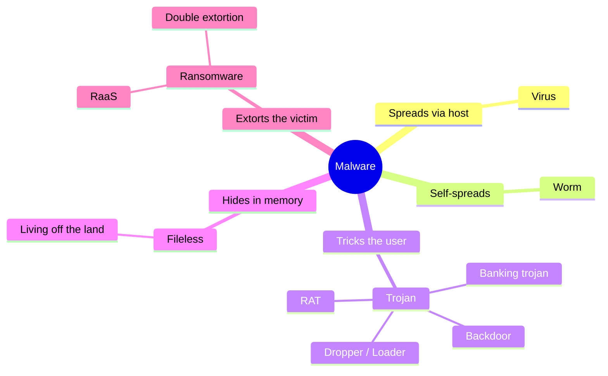
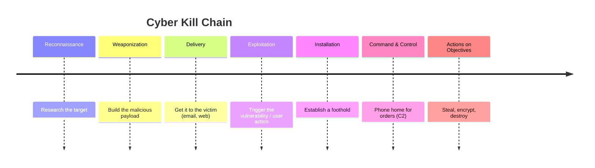
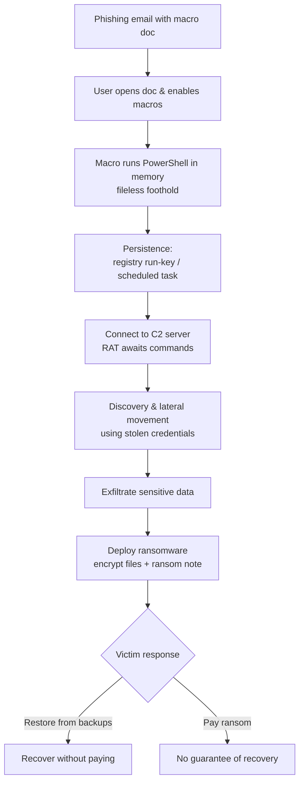
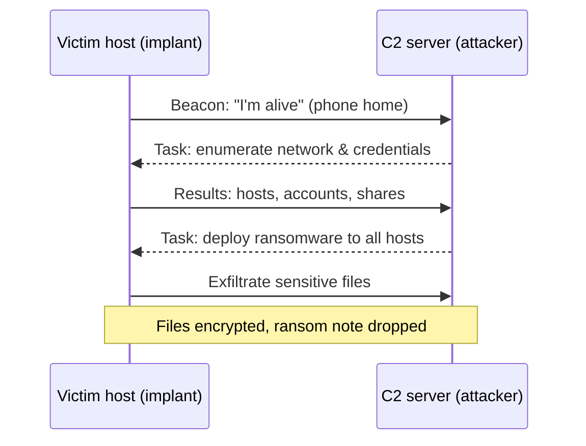
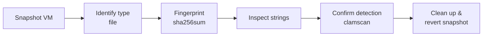

# Malware Threats 🦠

> **What you'll learn:** what malware is, the main families (trojans, viruses, worms, fileless, ransomware), how advanced attackers (APTs) use it, how analysts safely dissect it, and how defenders stop it.
> **Prerequisites:** basic familiarity with operating systems, files/processes, and networking (IP, ports). A safe, isolated lab (a VM you own) is required for the hands-on section.

| Course | Course code | Module | Level |
|--------|-------------|--------|-------|
| Skillogic CSPP — Professional Level 1 | SKL-CSP1-710 | Module 07: Malware Threats | level1 |

---

## 1. In Plain English

**Malware** — short for *malicious software* — is any program written to harm a computer, its data, or its user. Think of your computer as a house: most programs are invited guests, but malware is the burglar through an unlocked window, the con artist dressed as a delivery driver, or the squatter who changes the locks and demands rent.

Why should a beginner care? Malware is the single most common way attackers turn a weakness into real damage — stolen passwords, drained accounts, leaked photos, frozen hospitals, halted factories. Almost every major incident you read about involves malware at some stage.

> 🔑 **Key idea:** Malware is not magic — it's just code, and code can be read, watched, and blocked. This module opens the hood: the *kinds* of malware, how an attacker chains them over weeks (an **APT**), how analysts study a file without getting infected, and how defenders detect and remove it.

---

## 2. Core Concepts

### Malware (the umbrella term) 🌂

**Malware** is the general category for all hostile software. Everything below is a *type*, distinguished by two axes:

| Axis | Question it answers | Examples |
|------|--------------------|----------|
| 🔁 **Propagation** | How does it spread? | Needs a host file? Spreads on its own? Tricks a user? |
| 💥 **Payload** | What does it do once running? | Steal data, encrypt files, spy, mine crypto, give remote control |

The mindmap below shows how the families relate.



### 🦠 Virus, 🐛 Worm, 🐴 Trojan — the three propagation styles

These three differ mainly in **how they spread**:

| Family | Needs a host file? | Needs a human? | Spreads itself? | One-line summary |
|--------|:---:|:---:|:---:|---|
| 🦠 **Virus** | ✅ Yes | ✅ Yes | ❌ No | Attaches to a file/program; runs and copies only when a person opens the host. |
| 🐛 **Worm** | ❌ No | ❌ No | ✅ Yes | Self-propagates over the network via vulnerabilities or weak creds — fastest, largest outbreaks. |
| 🐴 **Trojan** | ❌ No | ✅ Yes | ❌ No | Disguised as something desirable; relies entirely on tricking the user into running it. |

A **virus** needs a host cell like its biological namesake. A **worm** races across thousands of machines in minutes with no human required. A **Trojan horse** hides hostile code inside a "gift" — a free game, cracked app, fake invoice PDF, or "video codec." Once a trojan runs, common payloads include:

| Trojan payload | What it does |
|----------------|--------------|
| **RAT** (Remote Access Trojan) | Gives the attacker remote control — an invisible person at the keyboard. |
| **Banking trojan** | Steals financial credentials. |
| **Dropper / Loader** | Quietly downloads and installs *other* malware. |
| **Backdoor** | Opens a hidden entry point for future access. |

### 👻 Fileless Malware

Most malware writes a file to disk — exactly what antivirus loves to scan. **Fileless malware** avoids that by running entirely in **memory (RAM)** and abusing tools *already trusted and installed* on the system — a technique called **living off the land**.

- 🎯 **Favorite tools to abuse:** PowerShell, Windows Management Instrumentation (WMI), the Windows registry.
- 🥷 **Why it evades AV:** little or no file on disk, so signature-based scanners often miss it.
- 🚪 **Arrival:** usually a malicious document macro or script.
- ⏳ **Persistence:** registry "run" keys or scheduled tasks (survives reboots).

### 🔒 Ransomware

**Ransomware** encrypts the victim's files and demands payment — usually cryptocurrency — for the decryption key. Modern gangs add **double extortion**: they *steal* a copy first and threaten to publish it, so even good backups don't fully protect you. It's now often sold "as a service" (**RaaS**), with developers renting the malware to less-skilled affiliates for a cut.

> ⚠️ **Warning:** With double extortion, paying does **not** guarantee your data won't be leaked — and backups alone don't prevent the leak.

### 🕵️ APT (Advanced Persistent Threat)

An **APT** is not a type of malware — it's a *type of attacker*: well-resourced, often state-sponsored, running long, stealthy, targeted campaigns. The **P** is *Persistent* — they stay undetected for months or years pursuing a specific goal (e.g., espionage), using malware as one tool among many.

- 🗺️ **MITRE ATT&CK** catalogs their **tactics** (goals, e.g., *Persistence*, *Exfiltration*) and **techniques** (specific methods).
- ⛓️ The **Cyber Kill Chain** is a common intrusion model (see timeline below).



> 🔑 **Command & Control (C2):** the channel malware uses to "phone home" to the attacker's server for instructions and to send out stolen data.

### 🔬 Malware Analysis: Static vs Dynamic

To defend, analysts must understand what a sample does. Two complementary approaches:

- **Static analysis** — examine the file **without running it** (bytes, strings, code structure, metadata). Safe and fast, but attackers use **packing** and **obfuscation** to hide.
- **Dynamic analysis** — **run** the sample in an isolated **sandbox** and watch its behavior (files, registry, network, processes). Reveals real behavior, but is slower and the malware may detect the sandbox.

In practice: static first to triage, dynamic to confirm.

| | 🔍 Static analysis | ▶️ Dynamic analysis |
|---|---|---|
| Runs the code? | No | Yes (in a sandbox) |
| Safety | High | Requires isolation |
| Speed | Fast | Slower |
| Beats obfuscation? | Often blocked by packing | Reveals real behavior |
| Example tools | `strings`, PE viewers, disassemblers | sandbox, process monitor, network capture |

---

## 3. How It Works (Step by Step)

Let's trace a realistic intrusion — a phishing email leading to ransomware, the way many real breaches unfold.

1. **Delivery.** A convincing email arrives with an attachment (e.g., `Invoice_April.docm`, a Word doc with macros).
2. **Exploitation / user action.** The victim opens it and enables macros (the doc claims this is needed "to view content"). The macro runs — the **trojan/dropper** behaving.
3. **Fileless foothold.** The macro launches PowerShell to download and run the next stage **in memory** (living off the land).
4. **Installation / persistence.** A registry run-key or scheduled task ensures survival across reboots.
5. **Command & Control (C2).** The implant connects out, awaiting commands — the attacker now has a **RAT** foothold.
6. **Discovery & lateral movement.** The attacker maps the network and spreads using stolen credentials — worm-like, but human-directed (classic APT).
7. **Exfiltration.** Sensitive data is copied out (enabling double extortion).
8. **Actions on objectives.** The **ransomware payload** deploys network-wide, encrypts files, and drops a ransom note.



The exchange between the implant and the attacker's server looks like this over time:



---

## 4. Real-World Examples

| Incident (year) | What made it notable | Lesson |
|-----------------|----------------------|--------|
| 🪱 **WannaCry (2017)** | A **ransomware worm**: ransomware that self-propagated via a Windows SMB vulnerability (patched just before the outbreak). Hit hundreds of thousands of systems in days, disrupting parts of the UK's NHS. | Unpatched systems + self-spreading malware = a very fast, very large outbreak. |
| 💣 **NotPetya (2017)** | Looked like ransomware but was effectively a **wiper** — destruction was the goal; paying couldn't realistically recover data. Spread via a compromised software update and trusted network mechanisms. | A ransom note doesn't guarantee recovery; supply-chain delivery hits even careful orgs. |
| 📨 **Emotet** | A banking trojan that evolved into a modular **loader**, delivered via malicious email attachments. Its job became installing *other* gangs' malware for a fee — a "malware-as-a-service" economy. Disrupted by law enforcement in 2021. | One infection often opens the door to several others. |

> 🖼️ *Suggested image: WannaCry ransom-note screen ("Ooops, your files have been encrypted!") as a teaching exhibit.*

---

## 5. Tools of the Trade 🧰

These are standard, legitimate analysis tools. Use them **only on samples in an isolated lab**.

| Tool | Type | Use case |
|------|:---:|----------|
| `strings` | 🔍 Static | Pull readable text (URLs, IPs, paths, errors) out of a binary. |
| `file` | 🔍 Static | Identify what a sample *actually* is, regardless of extension. |
| `sha256sum` | 🔍 Static | Cryptographic fingerprint for threat-intel lookups. |
| `pestudio` / PE viewers | 🔍 Static | Inspect Windows EXE structure — imports, resources, packing signs. |
| `procmon` (Sysinternals) | ▶️ Dynamic | Record every file/registry/process operation live in the sandbox. |
| `Wireshark` / `tcpdump` | ▶️ Dynamic | Capture network traffic to reveal C2 callbacks and exfiltration. |
| `YARA` | 🔍 Both | Write pattern rules and scan files or memory for matches. |

**`strings` — readable text out of a binary (static).** Clues often live in plain text:

```bash
strings -n 8 suspicious.bin | grep -Ei 'http|\.exe|\.dll|powershell'
```
Extracts strings ≥ 8 characters, then filters for likely indicators (URLs, executables, PowerShell references).

**`file` — identify the true type (static).** Attackers rename files to mislead.

```bash
file invoice.pdf
```
If a "PDF" comes back as a Windows executable, that's a red flag.

**`sha256sum` — fingerprint a sample.** A hash uniquely identifies the file so you can look it up without sharing the sample.

```bash
sha256sum suspicious.bin
```
Prints a unique 64-character fingerprint to search against known-malware databases.

**`tcpdump` / `Wireshark` — capture network traffic (dynamic).** Reveals C2 callbacks and exfiltration.

```bash
sudo tcpdump -i any -w capture.pcap
```
Records all traffic to `capture.pcap` for later inspection — useful for spotting the malware "phoning home."

**`YARA` — recognize malware by patterns.** Defenders write string/byte signatures and scan for matches.

```bash
yara ransomware_rules.yar /samples/
```
Scans everything in `/samples/` against your rule file and reports matches.

> 🖼️ *Suggested image: Wireshark capture showing periodic outbound beacons to a single suspicious IP (C2 traffic).*

> 🖼️ *Suggested image: Process Monitor (procmon) capture with a filter on RegSetValue showing a malicious "Run" key being written.*

---

## 6. Hands-On Lab (Authorized / Lab-Only) 🧪

> ⚠️ **Warning:** Perform this only on systems and samples you own or are explicitly authorized to test, inside an isolated lab VM with **no network access** to the rest of your network.

We'll do **safe static analysis** of a *benign* test file inside a Linux VM (Kali or Ubuntu). We deliberately do **not** detonate real malware on a beginner setup — the goal is the static-analysis workflow you'd later apply to a real sample in a hardened sandbox. The **EICAR test file** is a harmless string defined by the antivirus industry specifically so you can safely verify scanners and practice handling, with no real malicious code.

The triage loop you'll practice:



**Step 1 — Snapshot your VM.** Take a snapshot first so you can roll back instantly.

**Step 2 — Create the EICAR test file (harmless).**
```bash
cat > eicar.com <<'EOF'
X5O!P%@AP[4\PZX54(P^)7CC)7}$EICAR-STANDARD-ANTIVIRUS-TEST-FILE!$H+H*
EOF
```
The official EICAR test string — not malware; it only triggers antivirus *detection logic* for testing.

**Step 3 — Identify the file type.**
```bash
file eicar.com
```
*Expected:* a generic type such as `ASCII text`. **Interpretation:** `file` reads contents, not the extension — a first sanity check.

**Step 4 — Fingerprint it.**
```bash
sha256sum eicar.com
```
*Expected:* a 64-character hash. **Interpretation:** the sample's unique ID. In real work you'd search this hash in a threat-intel database *before* deeper analysis.

**Step 5 — Extract readable strings.**
```bash
strings eicar.com
```
*Expected:* the `EICAR-STANDARD-ANTIVIRUS-TEST-FILE` text. **Interpretation:** in real malware this often surfaces URLs, IPs, or commands (your **Indicators of Compromise**).

**Step 6 — Scan with antivirus (detection check).**
```bash
sudo apt-get install -y clamav && sudo freshclam
clamscan eicar.com
```
*Expected:* a flag such as `eicar.com: Eicar-Test-Signature FOUND`. **Interpretation:** **signature-based detection** working end-to-end — the scanner matched a known pattern.

> 🖼️ *Suggested image: terminal output of `clamscan` reporting "Eicar-Test-Signature FOUND".*

**Step 7 — Clean up.** Delete the test file and **revert your VM to the Step 1 snapshot**.
```bash
rm -f eicar.com capture.pcap
```

> 💡 **Tip:** The triage loop here — identify → fingerprint → inspect strings → confirm detection → clean up — is exactly what analysts run on real samples, just inside a hardened, reversible sandbox.

---

## 7. Countermeasures & Defenses 🛡️

Defense is layered across three stages. The map below shows the families a layered program targets.

```mermaid
graph LR
    subgraph Prevent
        P1[Patch promptly]
        P2[Email/web filtering<br/>+ disable macros]
        P3[Least privilege]
        P4[App allow-listing]
        P5[Limit scripting<br/>PowerShell logging]
        P6[Awareness training]
    end
    subgraph Detect
        D1[EDR behavior]
        D2[Network IDS]
        D3[SIEM correlation]
        D4[Threat hunting]
    end
    subgraph Recover
        R1[Isolate hosts]
        R2[Offline 3-2-1 backups]
        R3[Incident response plan]
        R4[Network segmentation]
    end
    Prevent --> Detect --> Recover
```



**🚧 Prevent (reduce the chance of infection):**

| Control | Why it helps |
|---------|--------------|
| **Patch promptly** | Worms like WannaCry exploit known, already-patched holes. |
| **Email & web filtering** | Block malicious attachments/links; strip or disable internet-sourced Office macros. |
| **Least privilege** | A single infection can't take over everything. |
| **Application allow-listing** | Only approved programs run — blocks many trojans/droppers outright. |
| **Limit scripting tools** | Constrain and log PowerShell to blunt fileless attacks. |
| **Security awareness training** | Most malware needs a human click; trained users are a strong first line. |

**🔎 Detect (find it when prevention fails):**

- **EDR (Endpoint Detection & Response):** monitors process and memory **behavior**, not just files — essential for fileless and novel malware.
- **Network monitoring / IDS:** spots C2 callbacks and unusual outbound traffic.
- **Centralized logging + SIEM:** correlates events across machines to surface the APT pattern.
- **Threat hunting:** uses IoCs and **MITRE ATT&CK** techniques as a checklist.

**🚑 Respond & recover (limit the damage):**

- **Isolate** infected hosts immediately to stop lateral movement and worm spread.
- **Offline, tested backups** following the **3-2-1 rule** (3 copies, 2 media types, 1 offsite/offline) — the best defense against ransomware.
- **Incident response plan** — practiced; know who does what before a real event.
- **Network segmentation** so one compromised segment can't reach everything.

> 💡 **Tip:** No single control wins. Prevention reduces volume, detection catches what slips through, and recovery limits the blast radius — you need all three.

---

## 8. Key Terms 📖

| Term | Meaning |
|------|---------|
| **Malware** | Any software written to harm a system, its data, or its user. |
| **Virus** | Malware that attaches to a host file and spreads when a user runs that file. |
| **Worm** | Self-spreading malware needing no host file and no user action. |
| **Trojan** | Malware disguised as something legitimate to trick users into running it. |
| **RAT** | Remote Access Trojan — gives the attacker remote control of the machine. |
| **Dropper / Loader** | Malware whose job is to install other malware. |
| **Fileless malware** | Runs in memory and abuses trusted built-in tools to avoid leaving files to scan. |
| **Living off the land** | Abusing legitimate, pre-installed system tools to carry out an attack. |
| **Ransomware** | Encrypts files and demands payment for the decryption key. |
| **Double extortion** | Stealing data before encrypting it, then threatening to leak it. |
| **APT** | Advanced Persistent Threat — a well-resourced, stealthy, long-term targeted attacker (often state-sponsored). |
| **C2 (Command & Control)** | The channel malware uses to receive orders and send out stolen data. |
| **Static analysis** | Examining a sample without executing it. |
| **Dynamic analysis** | Running a sample in an isolated sandbox to observe its behavior. |
| **Sandbox** | An isolated environment for safely running and observing suspicious code. |
| **Packing / obfuscation** | Compressing or scrambling code to evade static analysis. |
| **IoC** | Indicator of Compromise — an observable clue (hash, IP, domain, filename) signaling infection. |
| **EDR** | Endpoint Detection & Response — behavior-based endpoint security tooling. |

---

## 9. Summary & Takeaways ✅

- **Malware is just code with bad intent** — every type can be read, watched, and blocked.
- Families differ by **how they spread** (virus needs a host + user; worm self-spreads; trojan tricks the user) and **what they do** (RAT, dropper, ransomware).
- **Fileless malware** hides in memory and abuses trusted tools, defeating simple file scanners — which is why **behavior-based EDR** matters.
- **Ransomware** is now a business (RaaS) with **double extortion**, so tested **offline backups** plus a response plan are non-negotiable.
- An **APT** is an attacker, not a malware type — patient, stealthy, and tracked via **MITRE ATT&CK** and the kill chain.
- Analysts combine **static** (safe, fast, read-don't-run) and **dynamic** (sandbox, watch real behavior) analysis.
- Defense is layered: **patch, filter, least privilege, allow-listing, awareness** to prevent; **EDR, IDS, SIEM** to detect; **isolate, backup, respond** to recover.

**Further reading:** MITRE ATT&CK (Enterprise tactics and techniques); NIST SP 800-83 (Guide to Malware Incident Prevention and Handling); NIST SP 800-61 (Computer Security Incident Handling Guide); the Lockheed Martin Cyber Kill Chain framework.
