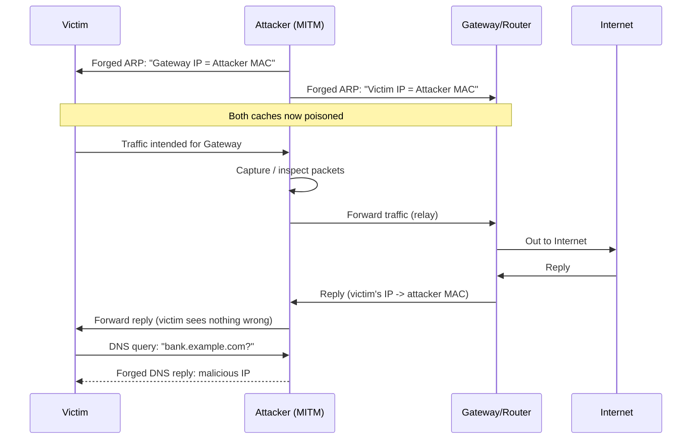

# Sniffing

> **What you'll learn:** How attackers silently capture network traffic, the layer-2 and protocol tricks they use to redirect that traffic to themselves (CAM flooding, ARP poisoning, DHCP and DNS attacks, spoofing), the tools involved, and how defenders detect and stop it.
> **Prerequisites:** Basic understanding of the OSI model (especially Layer 2 / Data Link and Layer 3 / Network), what IP and MAC addresses are, how switches and routers differ, and comfort with a Linux command line.

| | |
|---|---|
| **Course** | Professional Level 1 |
| **Course code** | SKL-CSP1-710 |
| **Module** | Sniffing |
| **Level** | level1 |

---

## 1. In Plain English

Imagine the local network at your office or home as a busy postal system. Every device sends out "letters" (data packets) addressed to other devices. **Sniffing** is the act of secretly reading other people's mail as it passes by — capturing network traffic that wasn't meant for you and inspecting what's inside.

On older networks (those using a *hub*, a dumb device that copies every signal to every port), reading other people's mail was trivial — every letter was photocopied to everyone. Modern networks use *switches*, which are smarter: a switch learns which device is on which port and delivers each letter only to its intended recipient. That makes plain eavesdropping harder. So attackers learned tricks to **force** the switch to send them mail that isn't theirs — for example by overwhelming the switch's memory or by lying about who they are.

Why should a total beginner care? Because an enormous amount of everyday traffic is still readable if it's not encrypted: login forms on `http://` sites, internal company tools, database connections, FTP file transfers, and more. A single attacker who gets a foothold on the same local network can quietly harvest passwords, session cookies, and confidential data without ever "hacking" a server in the dramatic Hollywood sense. Sniffing is one of the oldest, quietest, and most effective techniques in an attacker's toolkit — and understanding it is the first step to defending against it.

---

## 2. Core Concepts

### Sniffing — the basic idea

**Sniffing** (also called *packet capture*) means putting a network interface into a mode where it captures traffic and lets a human or program read it. Normally a network card ignores frames not addressed to it. To sniff everything it sees, the card is placed in **promiscuous mode** — a setting that tells the card "give me *every* frame on the wire, not just the ones addressed to my MAC address." On wireless cards there is a stronger relative called **monitor mode**, which captures raw radio frames including ones from networks you aren't joined to.

A **frame** is a unit of data at Layer 2 (Data Link); a **packet** is a unit at Layer 3 (Network). When we "capture a packet," we usually capture the whole frame and decode the layers inside it.

### Passive vs Active sniffing

This is the single most important distinction in the module.

- **Passive sniffing** means just *listening* — you capture traffic that already reaches your network card without sending anything or altering the network. This works perfectly on a **hub-based** network (because the hub floods everything everywhere) and on wireless networks (radio is broadcast by nature). Passive sniffing is nearly undetectable because the attacker emits nothing.

- **Active sniffing** means you must *interfere* with the network to get traffic that wouldn't normally reach you. This is required on **switched** networks. Because the switch only forwards traffic to the correct port, the attacker injects crafted packets to trick switches or hosts into sending traffic the wrong way. CAM flooding, ARP poisoning, DHCP attacks, and DNS poisoning are all forms of active sniffing. Because the attacker sends packets, active sniffing *can* be detected.

| | Passive | Active |
|---|---|---|
| Network type | Hubs, wireless | Switches |
| Attacker sends traffic? | No | Yes |
| Detectable? | Very hard | Possible |
| Examples | Listening on a hub/Wi-Fi | ARP poisoning, CAM flooding |

### How a switch normally works: the CAM table

A switch keeps a **CAM table** (Content Addressable Memory, also called the MAC address table). It maps **MAC addresses** (the 48-bit hardware address burned into each network card) to physical switch ports. When a frame arrives, the switch looks up the destination MAC in the CAM table and forwards the frame only out of the matching port. This is what makes simple passive sniffing fail on switches.

### MAC attacks — CAM flooding (MAC flooding)

The CAM table is finite — it has a limited number of entries. In a **MAC flooding** attack, the attacker rapidly sends thousands of frames each with a *different, fake source MAC address*. The switch dutifully tries to learn each one, and its CAM table fills up. Once full, many switches enter **fail-open** mode: unable to learn or look up addresses, they revert to behaving like a hub and **flood all frames out of every port**. Now the attacker can passively sniff everything — active attack to enable passive capture. Tools like `macof` automate this.

### DHCP attacks

**DHCP** (Dynamic Host Configuration Protocol) is how a device automatically gets an IP address, subnet mask, default gateway, and DNS server when it joins a network. Two relevant attacks:

- **DHCP starvation:** The attacker floods the DHCP server with requests using many spoofed MAC addresses, exhausting the pool of available IP addresses. Legitimate clients can no longer get an address — a denial of service.
- **Rogue DHCP server:** The attacker stands up their *own* DHCP server. When a new client broadcasts a request, the attacker's server may answer first, handing the victim a configuration that points the **default gateway** and **DNS server** at the attacker's machine. All the victim's traffic now flows through the attacker — a man-in-the-middle position.

### ARP poisoning (ARP spoofing)

**ARP** (Address Resolution Protocol) translates a known IP address into the MAC address needed to actually deliver a frame on the local network. A host shouts, "Who has IP 192.168.1.1? Tell me your MAC," and the owner replies. The flaw: ARP is **stateless and unauthenticated** — a host will accept and cache an ARP reply even if it never asked.

In **ARP poisoning**, the attacker sends forged ARP replies. It tells the victim "the gateway's IP belongs to *my* MAC," and tells the gateway "the victim's IP belongs to *my* MAC." Both update their **ARP cache** with the lie. Now both sides send their traffic to the attacker, who forwards it on (so nothing breaks visibly) while copying everything. This is the classic **man-in-the-middle (MITM)** attack on a LAN.

### MAC spoofing and IP spoofing

- **MAC spoofing:** Changing your network card's reported MAC address to impersonate another device — used to bypass MAC-based access controls (like port security or a captive portal) or to hijack a session tied to a MAC.
- **IP spoofing:** Forging the *source IP address* in a packet's header so it appears to come from a trusted host. Used to bypass IP-based filtering, to anonymize attacks, and as a building block in denial-of-service and reflection attacks. Because replies go to the forged address, pure IP spoofing is mostly useful for one-way or amplification attacks unless combined with other techniques.

### DNS poisoning (DNS spoofing)

**DNS** (Domain Name System) translates human names like `bank.example.com` into IP addresses. **DNS poisoning** means feeding a victim a *false* IP for a name, so when they type a legitimate site they are silently sent to an attacker-controlled server (often a convincing phishing clone). On a LAN this is commonly done by the attacker, already in a MITM position via ARP poisoning, answering DNS queries with forged replies. At a larger scale, **cache poisoning** corrupts the cached records of a DNS resolver so that many users are misdirected.

---

## 3. How It Works (Step by Step)

Let's walk through the most common end-to-end LAN attack: **ARP poisoning to enable sniffing and DNS spoofing.** (Authorized labs only.)

1. **Recon.** The attacker joins the local network and scans to learn the IP/MAC of the victim and the default gateway (router).
2. **Enable forwarding.** The attacker turns on IP forwarding so that traffic passing through them is relayed onward — otherwise the victim loses connectivity and the attack is obvious.
3. **Poison the caches.** The attacker continuously sends forged ARP replies: to the victim claiming "gateway IP = attacker MAC," and to the gateway claiming "victim IP = attacker MAC."
4. **Achieve MITM.** Both victim and gateway now send their traffic to the attacker. The attacker forwards it to the real destination, so the victim notices nothing.
5. **Sniff.** The attacker runs a packet capture tool, reading any unencrypted traffic (HTTP, FTP, Telnet, DNS queries, etc.).
6. **Optional DNS spoof.** When the victim asks DNS "where is `bank.example.com`?", the attacker injects a forged reply pointing to a malicious server.
7. **Harvest.** Credentials, cookies, and data are captured; the victim may be redirected to a phishing page.



---

## 4. Real-World Examples

**1. Firesheep (2010) — session hijacking made trivial.** A Firefox extension called *Firesheep* let anyone on an open Wi-Fi network passively capture the unencrypted session cookies of people browsing major sites (Facebook, Twitter, and others of the era) and instantly log in as them. It required no skill and dramatically demonstrated why sites moved to HTTPS everywhere. The lesson: on shared/wireless networks, *passive* sniffing of unencrypted sessions is a real, mass-scale threat.

**2. The Kaminsky DNS cache-poisoning flaw (2008).** Security researcher Dan Kaminsky disclosed a fundamental weakness in how DNS resolvers validated responses, making large-scale **DNS cache poisoning** practical. An attacker could trick a resolver into caching a forged record, silently redirecting users of that resolver to malicious sites. It triggered a coordinated, industry-wide patching effort and accelerated adoption of source-port randomization and DNSSEC.

**3. Coffee-shop man-in-the-middle (realistic scenario).** An attacker on the same café Wi-Fi runs an ARP-poisoning MITM tool. Patrons who log into an internal company portal that still uses `http://`, or whose app sends an unencrypted API token, leak those credentials directly to the attacker — who quietly forwards traffic so victims notice nothing. This is the everyday version of the attack chain in Section 3.

---

## 5. Tools of the Trade

> All tools below are legitimate network-analysis tools. Use them only on networks you own or are explicitly authorized to test.

### Wireshark / tshark — packet capture and analysis
The de facto standard graphical packet analyzer; `tshark` is its command-line sibling. It captures and decodes thousands of protocols.

```bash
# Capture on interface eth0, save to a file, but only show HTTP traffic
sudo tshark -i eth0 -w capture.pcapng -f "tcp port 80"
```
This listens on `eth0`, writes raw packets to `capture.pcapng`, and uses a capture filter (`-f`) to keep only TCP port 80 (HTTP) traffic, reducing noise.

### tcpdump — lightweight CLI capture
A minimal, scriptable capture tool present on most Unix systems.

```bash
sudo tcpdump -i eth0 -n -A 'port 21'
```
`-i eth0` selects the interface, `-n` skips DNS name resolution (faster, no extra lookups), `-A` prints packet payloads as ASCII, and `'port 21'` filters for FTP — handy for spotting cleartext FTP logins.

### macof (part of dsniff) — MAC/CAM flooding
Floods a switch with random source MACs to fill the CAM table.

```bash
sudo macof -i eth0
```
Sends a flood of frames with random MAC/IP values out of `eth0`, attempting to overflow the switch's CAM table so it fails open and floods traffic.

### Ettercap — all-in-one MITM and ARP poisoning
A comprehensive MITM suite supporting ARP poisoning, sniffing, and filtering.

```bash
sudo ettercap -T -i eth0 -M arp:remote /192.168.1.10// /192.168.1.1//
```
`-T` runs the text interface, `-M arp:remote` launches an ARP-poisoning MITM between the two targets (victim `192.168.1.10` and gateway `192.168.1.1`), capturing traffic between them.

### arpspoof (part of dsniff) — targeted ARP poisoning
A focused tool that sends forged ARP replies to redirect one host's traffic.

```bash
sudo arpspoof -i eth0 -t 192.168.1.10 192.168.1.1
```
Tells victim `192.168.1.10` that the gateway `192.168.1.1` is at the attacker's MAC, so the victim's gateway-bound traffic comes to the attacker. (Run a second instance with the targets reversed for full bidirectional MITM, and enable IP forwarding first.)

---

## 6. Hands-On Lab (Authorized / Lab-Only)

> **Reminder:** Perform this only on systems you own or have written authorization to test. The recommended setup is **Kali Linux** (attacker) and **Metasploitable 2** (vulnerable target) running in an isolated virtual network with no internet bridge.

**Goal:** Perform an ARP-poisoning MITM between the Metasploitable 2 host and the gateway, then capture a cleartext FTP login from Metasploitable.

### Step 1 — Identify the hosts
```bash
# Find live hosts on the lab subnet
nmap -sn 192.168.56.0/24
```
Expected output lists the gateway (e.g., `192.168.56.1`) and the Metasploitable box (e.g., `192.168.56.101`). Note both IPs and their MACs.

### Step 2 — Enable IP forwarding
```bash
echo 1 | sudo tee /proc/sys/net/ipv4/ip_forward
```
Expected output: `1`. This lets your attacker box relay the victim's traffic so connectivity is preserved and the attack stays stealthy. If you skip this, the victim simply loses its connection.

### Step 3 — Start ARP poisoning (two terminals)
```bash
# Terminal A: tell the victim that the gateway is us
sudo arpspoof -i eth0 -t 192.168.56.101 192.168.56.1
# Terminal B: tell the gateway that the victim is us
sudo arpspoof -i eth0 -t 192.168.56.1 192.168.56.101
```
Expected output: repeating lines showing ARP replies being sent (source/destination MACs). Leave both running. You are now the man in the middle.

### Step 4 — Confirm the poisoning worked
On the victim (Metasploitable), `arp -a` would show the gateway's IP mapped to the *attacker's* MAC. From the attacker side, you can verify traffic is now flowing through you in the next step.

### Step 5 — Start the capture
```bash
sudo tcpdump -i eth0 -n -A 'host 192.168.56.101 and tcp port 21'
```
This captures only FTP (port 21) traffic to/from the victim and prints payloads as ASCII.

### Step 6 — Generate and capture the cleartext login
From the victim, an FTP login is performed (Metasploitable runs a cleartext FTP service). In your tcpdump window you should see lines containing the protocol commands, for example:
```
USER msfadmin
PASS msfadmin
```
**Interpretation:** Because FTP is unencrypted, the username and password appear in plaintext in the captured payload — exactly what an attacker would harvest. This is the entire point of the exercise: it shows *why* cleartext protocols are dangerous on a shared network.

### Step 7 — Clean up
Stop both `arpspoof` processes (Ctrl+C). They will automatically send corrective ARP replies to restore the real mappings. Then disable forwarding:
```bash
echo 0 | sudo tee /proc/sys/net/ipv4/ip_forward
```
Confirm the victim's ARP cache returns to normal. Always restore the environment after a lab.

---

## 7. Countermeasures & Defenses

**Prevent traffic from being readable (encryption — the strongest defense):**
- Use **HTTPS/TLS everywhere**; enforce HSTS so browsers refuse to downgrade to HTTP.
- Replace cleartext protocols: SSH instead of Telnet, SFTP/FTPS instead of FTP, IMAPS/SMTPS instead of plaintext mail.
- Use a **VPN** on untrusted networks so traffic is encrypted even if captured.

**Harden Layer 2 / switches (stop active sniffing):**
- Enable **port security** to limit the number of MAC addresses learned per port — directly defeats CAM/MAC flooding.
- Enable **DHCP snooping** so the switch only trusts DHCP replies from authorized ports — kills rogue DHCP servers and starvation.
- Enable **Dynamic ARP Inspection (DAI)**, which validates ARP packets against the DHCP-snooping binding table — defeats ARP poisoning.
- Use **IP Source Guard** to filter spoofed source IPs at the port.
- Segment the network with **VLANs** and **802.1X** port-based authentication so only authenticated devices get on.

**Protect name resolution:**
- Deploy **DNSSEC** so DNS responses are cryptographically signed and forgeries are rejected.
- Use validating resolvers and DNS over HTTPS/TLS where appropriate.

**Detection (see also Section 9):**
- Monitor for spikes in ARP traffic, multiple IPs mapping to one MAC, or one IP suddenly mapping to a new MAC.
- Use **static ARP entries** for critical hosts (gateway, servers) so forged replies are ignored.
- Run an IDS/NIDS (e.g., a Suricata/Snort sensor) with rules for ARP anomalies and DHCP spoofing.

**Sniffing detection techniques specifically:**
- **ARP-based detection:** send an ARP request to a non-existent IP with a bogus broadcast MAC; only a host in promiscuous mode tends to respond.
- **DNS-based detection:** craft traffic to a fake host; a sniffer doing reverse-DNS lookups on captured IPs reveals itself with a DNS query.
- **Latency/ping tests:** a host in promiscuous mode processing all traffic may show measurably different response timing under load.
- Tools and scripts (e.g., the classic `arpwatch` daemon, or `nmap`'s sniffer-detection script) help automate this monitoring.

---

## 8. Key Terms

- **Sniffing / packet capture** — Reading network traffic off the wire, intended for you or not.
- **Promiscuous mode** — NIC setting that accepts all frames, not just those addressed to it.
- **Monitor mode** — Wireless equivalent that captures raw radio frames from any nearby network.
- **Passive sniffing** — Listening only; no packets injected (hubs/Wi-Fi).
- **Active sniffing** — Injecting packets to redirect traffic (required on switches).
- **MAC address** — 48-bit hardware address of a network card (Layer 2).
- **CAM table** — A switch's MAC-to-port lookup table; finite in size.
- **MAC/CAM flooding** — Overflowing the CAM table so the switch fails open and floods all ports.
- **ARP** — Protocol mapping an IP address to a MAC address on a LAN; unauthenticated.
- **ARP poisoning / spoofing** — Sending forged ARP replies to become a man-in-the-middle.
- **Man-in-the-middle (MITM)** — Attacker secretly relaying/altering traffic between two parties.
- **DHCP** — Protocol that auto-assigns IP/gateway/DNS to clients.
- **DHCP starvation** — Exhausting the DHCP address pool (denial of service).
- **Rogue DHCP server** — Attacker-run DHCP server that hands out malicious config.
- **MAC spoofing** — Changing your reported MAC to impersonate another device.
- **IP spoofing** — Forging the source IP in packet headers.
- **DNS poisoning / spoofing** — Returning a false IP for a domain name to misdirect victims.
- **DHCP snooping / Dynamic ARP Inspection / Port security** — Switch features that block these Layer-2 attacks.
- **DNSSEC** — Cryptographic signing of DNS records to prevent forgery.

---

## 9. Summary & Takeaways

- **Sniffing** captures network traffic; it's *passive* (listen only) on hubs/Wi-Fi and *active* (inject packets) on switched networks.
- Switches normally block sniffing via the **CAM table**, but **MAC flooding** can force a switch to fail open and flood all ports.
- **ARP poisoning** is the classic LAN man-in-the-middle: forged ARP replies redirect a victim's and gateway's traffic through the attacker.
- **DHCP attacks** (starvation, rogue servers) and **DNS poisoning** let attackers control a victim's network configuration and where their domain lookups resolve.
- **MAC and IP spoofing** are supporting techniques for impersonation, filter evasion, and amplification.
- The strongest defense is **encryption** (TLS/HTTPS, SSH, VPN) — it doesn't stop capture but makes captured data useless.
- Switch-level controls — **port security, DHCP snooping, Dynamic ARP Inspection, IP Source Guard** — defeat the active attacks at Layer 2, while **DNSSEC** protects name resolution.
- Sniffers can be **detected** via ARP, DNS, and latency techniques and by monitoring for ARP/DHCP anomalies.

**Further reading:** OWASP Testing Guide (network and transport-layer testing); NIST SP 800-115 (*Technical Guide to Information Security Testing and Assessment*); MITRE ATT&CK techniques T1557 (*Adversary-in-the-Middle*, including ARP and DHCP spoofing) and T1040 (*Network Sniffing*); Cisco documentation on Port Security, DHCP Snooping, and Dynamic ARP Inspection.
