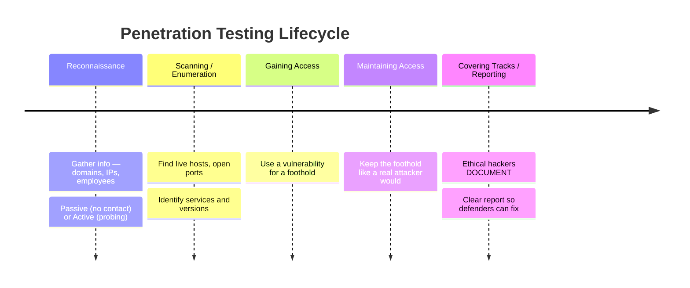
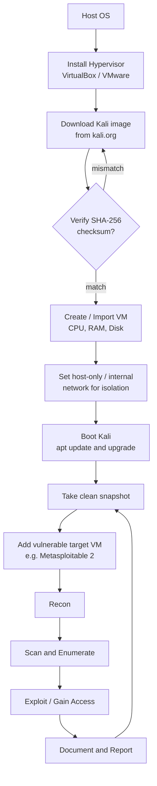
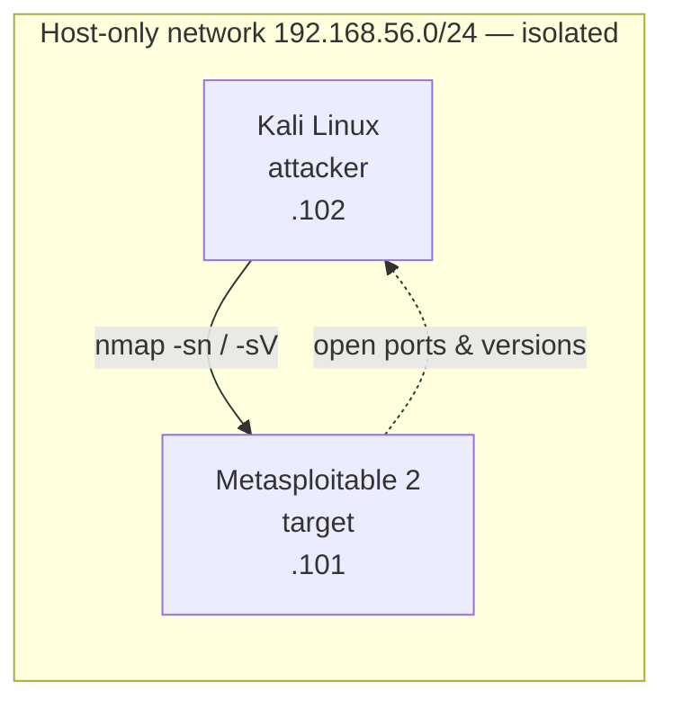
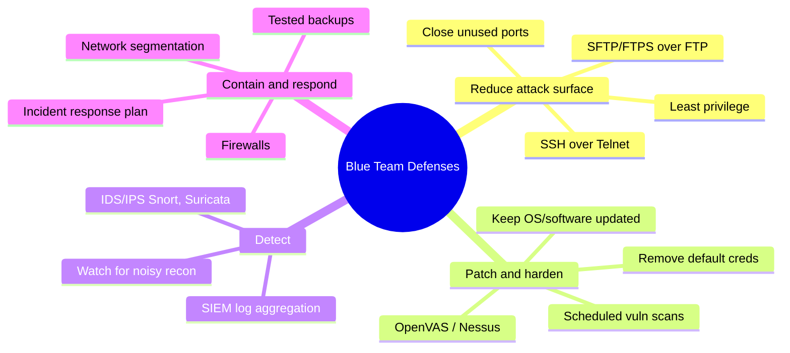

# Cyber Security Introduction & Kali Setup 🛡️

> **What you'll learn:** the big-picture ideas behind cyber security and ethical hacking, how to install and configure Kali Linux in a virtual machine, and the essential Linux command-line skills every beginner needs.
>
> **Prerequisites:** a computer with virtualization support (Intel VT-x / AMD-V), 8 GB+ RAM, ~40 GB free disk, and basic keyboard comfort — no prior security or Linux experience required.

| Field | Value |
|-------|-------|
| 📘 Course | Skillogic Cyber Security Professional |
| 🔖 Course code | SKL-CSP1-710 |
| 📦 Module | Cyber Security Introduction & Kali Setup |
| 🎯 Level | Professional Level 1 (level1) |

---

> 📺 **Watch — top video on this topic:** [](https://www.youtube.com/watch?v=z5nc9MDbvkw) [Introduction To Cyber Security — Training For Beginners (Simplilearn)](https://www.youtube.com/watch?v=z5nc9MDbvkw)

---

## 1. In Plain English

Think of your **house**: doors with locks, a fence, a porch camera, the habit of checking the windows before bed. **Cyber security** is the same idea — but the "house" is your data and the systems holding it (email, bank account, a company's customer database, a hospital's patient records). The "burglars" are people or automated programs trying to steal, damage, or ransom what's inside.

Now imagine hiring a locksmith to break into your *own* house — not to rob you, but to find weak spots before a real burglar does. That's **ethical hacking** (a.k.a. penetration testing / "pentesting"): attacking systems *with permission* to find vulnerabilities so they get fixed.

> 🔑 **Key idea:** The only difference between an ethical hacker and a criminal is **authorization** and **intent**. The skills are identical.

To do the job you need a toolbox. **Kali Linux** is the most popular one — a free OS pre-loaded with hundreds of security tools, like a mechanic's tool chest that arrives already stocked. We run it inside a **virtual machine (VM)** — a fully working computer that exists only as software, safely sandboxed inside your real machine.

**Why a beginner should care:** almost everything you value lives on a network, and demand for defenders far outstrips supply. Learning to think like an attacker — safely and legally — is the fastest path to defending. This module is the foundation: by the end you'll have a working lab and the command-line fluency to use it.

---

## 2. Core Concepts

### 🎯 What Security Protects: the CIA Triad

Security has three goals, the **CIA triad** (no relation to the spy agency). Every attack violates at least one; every defense protects at least one — keep it as a mental checklist.


*The CIA triad: Confidentiality, Integrity, and Availability (Wikimedia Commons).*

| Goal | Means | Example |
|------|-------|---------|
| 🔒 **Confidentiality** | Keep info secret from those who shouldn't see it | Encrypting a password file so a thief who copies it still can't read it |
| ✅ **Integrity** | Ensure data isn't tampered with | Detecting a bank balance changed from $100 to $100,000 |
| 🟢 **Availability** | Keep systems up for legitimate users | Defending against a traffic flood that knocks a site offline |

### Vulnerability, Threat, Exploit, Risk

These four are often confused. Define them once, use them precisely.

| Term | Plain meaning | Burglar analogy |
|------|---------------|-----------------|
| **Vulnerability** | A weakness in a system | An unlocked window |
| **Threat** | Anything that *could* exploit it | A burglar walking down the street |
| **Exploit** | The technique/code that takes advantage | The crowbar prying the window open |
| **Risk** | Likelihood × impact if it happens | Roughly: *Threat × Vulnerability × Impact* |

### Ethical vs. Malicious Hacking

Hackers are grouped by "hat color." An ethical hacker always operates under a defined **scope** (what's allowed) and a **rules of engagement** document, backed by a signed contract or — for learning — an intentionally vulnerable target.

| Hat | Authorization | Intent |
|-----|---------------|--------|
| ⚪ White hat | Yes — explicit permission | Improve security |
| ⚫ Black hat | No | Personal gain / harm |
| 🩶 Grey hat | Often none, but no malice | Mixed; legally risky |

> ⚠️ **Warning:** Testing a system you don't own or lack written permission to test is a crime in most countries — e.g., the **Computer Fraud and Abuse Act** (US) and the **Computer Misuse Act** (UK).

### The Penetration Testing Phases

Professional pentesting follows a repeatable lifecycle (aligned with EC-Council and PTES, the Penetration Testing Execution Standard).



> 💡 **Tip:** Criminals *cover tracks*; ethical hackers *document*. The report is the deliverable that justifies the whole engagement.

### What Kali Linux Is

**Kali Linux** is a Debian-based distribution maintained by Offensive Security, purpose-built for penetration testing and digital forensics. "Debian-based" means it shares Debian/Ubuntu's package system and command structure, so skills transfer. It ships with **600+ pre-installed tools** (Nmap, Metasploit, Wireshark, Burp Suite, and more), saving days of setup.

### What a Virtual Machine Is

A **VM** is a software emulation of a physical computer. A **hypervisor** (VirtualBox or VMware) carves out a slice of your real CPU, RAM, and disk and presents it to a "guest" OS as if it were real hardware.

| Benefit | What it gives you |
|---------|-------------------|
| 🧱 **Isolation** | Malware or mistakes stay inside the sandbox |
| 📸 **Snapshots** | Save exact state, roll back instantly |
| 🗑️ **Disposability** | Delete and recreate freely |

### NAT vs. Host-Only Networking

When creating a VM you choose how it talks to the network.

| Mode | Internet access | Reachable from LAN | Best for |
|------|-----------------|--------------------|----------|
| **NAT** | ✅ Yes (shares host's) | ❌ Hidden behind host | General use / updates |
| **Host-only** | ❌ No | Host + other VMs only | 🧪 Attack labs |

> 🔑 **Key idea:** For a lab full of intentionally vulnerable machines, use **host-only** (or an internal network) so you never expose a deliberately broken machine to the internet.

---

## 3. How It Works (Step by Step)

The end-to-end flow of building the lab and running a first authorized assessment:

1. **Install a hypervisor** (VirtualBox or VMware) on your host OS.
2. **Download the Kali image** from the official `kali.org` site (pre-built VM image is fastest).
3. **Verify the SHA-256 checksum** against Kali's published value — proves the file wasn't corrupted or tampered with (an *integrity* check — the CIA triad in action).
4. **Create / import the VM**, allocating CPU cores, RAM (4 GB+), and disk.
5. **Set networking** to host-only or internal so the lab is isolated.
6. **Boot, update, snapshot** — take a clean snapshot you can always return to.
7. **Add a vulnerable target VM** (e.g., Metasploitable 2) on the same isolated network.
8. **Run the pentest lifecycle**: recon → scan → enumerate → exploit → report.



> 🖼️ *Suggested image: VirtualBox "New VM" wizard showing Kali Linux name, type Linux, and Debian 64-bit selected.*

---

## 4. Real-World Examples

| Breach | What went wrong | CIA goal violated | Lesson |
|--------|-----------------|-------------------|--------|
| 🦠 **WannaCry (2017)** | Ransomware worm hit 200,000+ machines in 150 countries via a known Windows SMB flaw that *already had a patch* | Availability (+ Integrity) | The gap between "vulnerability known" and "vulnerability patched" is where attackers live |
| 🗂️ **Equifax (2017)** | Unpatched Apache Struts flaw exposed personal data of ~147 million people | Confidentiality | A routine vulnerability scan + patch — exactly what this course teaches — would have flagged it |

**Authorized scenario — a small-business engagement.** A 50-person company hires a pentester who signs a scope document limiting testing to two public IPs. They spin up Kali in a VM, run recon and a port scan, find an outdated web server, confirm (without disrupting service) it's exploitable, and deliver a report recommending an upgrade. Nothing is stolen, nothing breaks, and the hole is fixed before a black hat finds it. **This is the entire job in miniature — and it starts from the lab you build here.**

---

## 5. Tools of the Trade

These ship with Kali. Here's a first taste; you'll use them all course long.

| Tool | Role | One-liner to launch |
|------|------|---------------------|
| 🗺️ **Nmap** | Discover hosts, ports, services/versions — the scanning workhorse | `nmap -sV -O <ip>` |
| 💥 **Metasploit** | Ready-made exploits/payloads to validate a vulnerability | `msfconsole` |
| 🦈 **Wireshark** | Graphical packet capture & analysis | `wireshark &` |
| 📦 **apt** | Install / update / remove software | `sudo apt update && sudo apt full-upgrade -y` |

**Flag reference:**

| Flag | Tool | Effect |
|------|------|--------|
| `-sV` | Nmap | Probe open ports for service versions |
| `-O` | Nmap | Attempt OS detection |
| `-sn` | Nmap | Ping sweep (find hosts, no port scan) |
| `-oN` | Nmap | Write a clean "normal" report to a file |
| `&` | shell | Run a command in the background |
| `-y` | apt | Auto-confirm prompts |

> 💡 **Tip:** Inside `msfconsole` you `search` for an exploit, `use` it, `set` options like `RHOSTS` (target), then `run`. Detailed exploitation comes in later modules.

> 🖼️ *Suggested image: Wireshark capturing live traffic, with the packet list, detail pane, and hex view visible.*

---

## 6. Hands-On Lab (Authorized / Lab-Only) 🧪

> ⚠️ **Warning:** Perform these steps **only** against systems you own or are explicitly authorized to test — here, your own isolated lab VMs. Never point these tools at machines or networks you don't control.

**Goal:** Build the lab, then perform recon and scanning against **Metasploitable 2** (a deliberately broken Linux VM made for practice).

**Setup:** Two VMs on the same **host-only** network — Kali (attacker) and Metasploitable 2 (target), both on `192.168.56.0/24` (your numbers may differ).



### Step 1 — Confirm Kali's network details
```bash
ip addr show
```
Look for an interface (often `eth0`) with an `inet` line like `192.168.56.102/24`. That's Kali's address; note the network — you'll scan the rest of it.

### Step 2 — Discover live hosts
```bash
nmap -sn 192.168.56.0/24
```
`-sn` does a "ping sweep" — finds which hosts are up without scanning ports. You'll get a short list of `Host is up`. One of them (not Kali's IP, not the gateway `.1` or `.100`) is Metasploitable — suppose `192.168.56.101`.

### Step 3 — Scan ports and service versions
```bash
nmap -sV 192.168.56.101
```
Expected output (Metasploitable 2 is famously wide open):
```
PORT     STATE SERVICE     VERSION
21/tcp   open  ftp         vsftpd 2.3.4
22/tcp   open  ssh         OpenSSH 4.7p1 Debian
23/tcp   open  telnet      Linux telnetd
80/tcp   open  http        Apache httpd 2.2.8
3306/tcp open  mysql       MySQL 5.0.51a
...
```

> 🔑 **Key idea:** The `VERSION` column is gold — old versions (like `vsftpd 2.3.4`) are publicly documented as vulnerable. You've just completed *enumeration*: you know what's running and how old it is.

> 🖼️ *Suggested image: Terminal showing `nmap -sV` output against Metasploitable 2 with the open-port table highlighted.*

### Step 4 — Identify which findings matter

| Finding | Port | Concern | CIA goal |
|---------|------|---------|----------|
| Telnet (plaintext creds) | 23 | Credentials sent unencrypted | Confidentiality |
| FTP (plaintext creds) | 21 | Credentials sent unencrypted | Confidentiality |
| Aged Apache | 80 | Known web vulns | Integrity / Availability |
| Aged MySQL | 3306 | Known DB vulns | Integrity / Availability |

Write these down — this list *is* the start of a pentest report.

### Step 5 — Cross-confirm the web service (read-only)
```bash
curl -I http://192.168.56.101
```
`-I` fetches only HTTP headers; you'll see `Server: Apache/2.2.8`, confirming Nmap's finding. Cross-confirming with a second tool is good practice.

### Step 6 — Save your evidence
```bash
nmap -sV -oN ~/lab/metasploitable_scan.txt 192.168.56.101
```
`-oN` writes a clean report to a file. Real engagements live or die by good notes — build the habit now.

**Lab takeaway:** in six commands you found the target, mapped its attack surface, identified concrete weaknesses, and saved evidence — the recon-and-scan core of every assessment, performed safely inside an isolated lab.

---

## 7. Countermeasures & Defenses

The blue team (defenders) counters exactly what you just did. Each defense maps back to a step in the attack.



| Goal | Key actions | Counters which attack step |
|------|-------------|----------------------------|
| 🚪 **Reduce attack surface** | Close unused ports; replace Telnet→SSH, FTP→SFTP/FTPS; least privilege | Scanning / Enumeration |
| 🩹 **Patch & harden** | Update everything; scheduled scans (OpenVAS/Nessus); remove default creds | Exploitation (WannaCry & Equifax were unpatched-software failures) |
| 🔍 **Detect** | IDS/IPS (Snort/Suricata); SIEM log aggregation; watch for noisy recon | Reconnaissance / Scanning |
| 🧯 **Contain & respond** | Network segmentation; firewalls; incident response plan; tested backups | Maintaining Access / impact |

> 💡 **Tip:** Your host-only lab network is **segmentation in miniature** — a breach in one segment can't reach everything else.

---

## 8. Key Terms

| Term | Definition |
|------|------------|
| **Cyber security** | Protecting systems and data from unauthorized access, alteration, or disruption |
| **Ethical hacking / pentesting** | Authorized simulated attacks to find and fix vulnerabilities |
| **CIA triad** | Confidentiality, Integrity, Availability — the three goals of security |
| **Vulnerability** | A weakness that can be exploited |
| **Threat** | A potential cause of an unwanted incident |
| **Exploit** | A technique or code that takes advantage of a vulnerability |
| **Risk** | The likelihood and impact of a threat exploiting a vulnerability |
| **Scope / Rules of Engagement** | The agreed boundaries and rules for an authorized test |
| **Kali Linux** | A Debian-based distro pre-loaded with security tools |
| **Virtual machine (VM)** | A software-emulated computer running on a host |
| **Hypervisor** | Software (VirtualBox/VMware) that creates and runs VMs |
| **Snapshot** | A saved VM state you can roll back to |
| **NAT / Host-only** | VM network modes; host-only isolates the VM from the internet |
| **Reconnaissance** | The information-gathering phase of an attack |
| **Enumeration** | Listing services, versions, and details of a target |
| **Metasploitable 2** | An intentionally vulnerable Linux VM for practice |

## 9. Summary & Takeaways

- 🎯 Cyber security protects **Confidentiality, Integrity, Availability** — use the CIA triad as your checklist for every attack and defense.
- ⚖️ **Ethical hacking is defined by authorization and intent**; the same skills protect when legal and are crimes when not. Always have a documented scope.
- 🔁 Learn the **pentest lifecycle** — recon → scanning/enumeration → exploitation → maintaining access → reporting — every engagement follows it.
- 🧰 **Kali Linux** gives a pre-stocked toolbox; running it in a **VM** keeps experiments isolated, snapshot-able, and disposable.
- 🧱 Use **host-only networking** and **snapshots** for safety and recovery, and always **verify downloads** by checksum.
- 🦠 Real breaches like **WannaCry** and **Equifax** stemmed from unpatched, known vulnerabilities — proactive scanning and patching is the core defense.
- 🛡️ The blue team counters recon by **reducing attack surface, patching, detecting (IDS/SIEM), and segmenting** networks.
- 💻 Basic **Linux command-line fluency** (`nmap`, `apt`, `ip addr`, `curl`, file navigation) is the prerequisite that makes every later module possible.

> 📚 **Further reading:** OWASP Testing Guide • NIST SP 800-115 (Technical Guide to Information Security Testing and Assessment) • MITRE ATT&CK framework • official Kali docs (kali.org/docs) • Penetration Testing Execution Standard (PTES).
