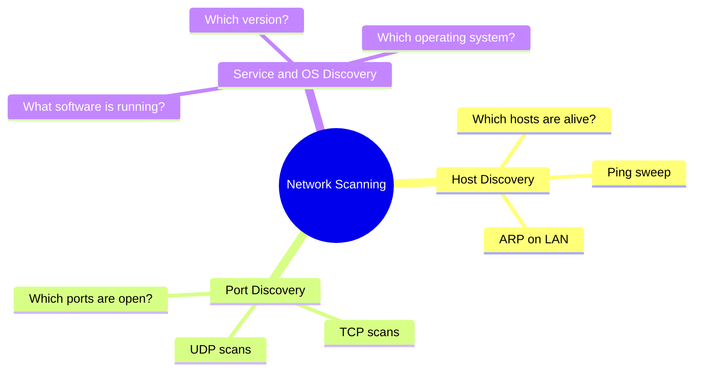
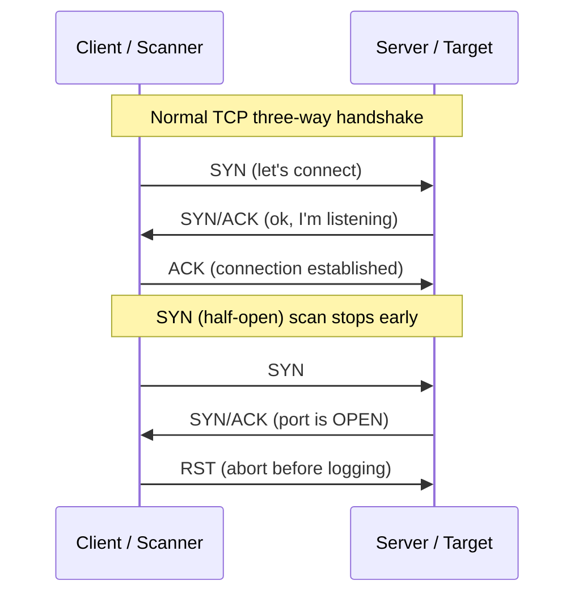
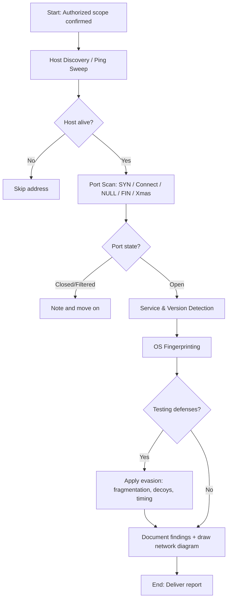
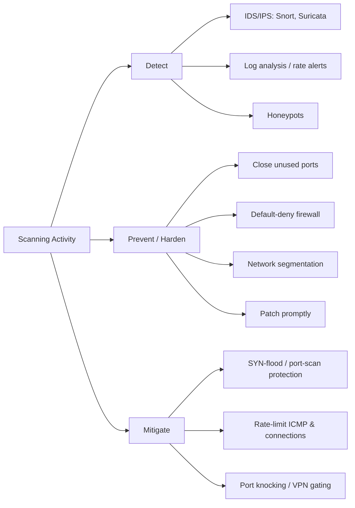

# Scanning Networks 🔍

> **What you'll learn:** How attackers and defenders map a network — finding live hosts, open ports, running services, and operating systems — and how to do it carefully enough to slip past (or detect) firewalls and intrusion detection systems.
> **Prerequisites:** Basic understanding of IP addresses, the TCP/IP model, ports, and how a client and server "talk" over a network (covered in the Networking Fundamentals module).

| Course | Course code | Module | Level |
| --- | --- | --- | --- |
| Professional Level 1 | SKL-CSP1-710 | Module 03 — Scanning Networks | level1 |

---

## 1. In Plain English 🗣️

Picture a security professional hired to test a building. Before doing anything, they walk the perimeter and note which lights are on, which doors exist, which windows are open, and what locks each door uses. They aren't breaking in — they're *gathering information*. That is exactly what **network scanning** is.

- **Reconnaissance** (the previous stage) passively collects public info — *who* and *what* the target is, from a distance.
- **Scanning** is the next step: gently knocking on doors to see which are real, which are open, and what's behind them.

A few core "building" metaphors map directly to networking terms:

| Building metaphor 🏢 | Networking term | Meaning |
| --- | --- | --- |
| A door | **Port** | A numbered communication endpoint (e.g., web traffic on 80 or 443) |
| Someone home | **Live host** | A computer that responds |
| Who's behind the door | **Service** | The program listening on an open port (web server, database) |

Why care as a beginner? Almost every attack starts with scanning.

- **Defenders** who know what scanning looks like can spot an attacker early — often *before* real damage.
- **Testers** use scanning as their very first hands-on skill. Get it right and the engagement goes smoothly; too loud or too aggressive and you'll be detected, blocked, or you'll crash a fragile system.

> ⚠️ **Warning:** Every technique here is framed for **authorized testing only** — you must have written permission. Scanning systems you don't own or aren't permitted to test is illegal in most countries.

---

## 2. Core Concepts 🧠

### What is network scanning?

**Network scanning** sends crafted packets (small units of network data) to a target and studies the responses. It answers three big questions:



### Ports and port states

A computer has 65,535 TCP ports and 65,535 UDP ports — think numbered mailboxes. A scanner classifies each into a state:

| State | Meaning | Attacker interest |
| --- | --- | --- |
| 🟢 **Open** | A service is listening and accepting connections | High — main target |
| 🔴 **Closed** | Host reachable, but nothing listening on that port | Low |
| 🟡 **Filtered** | A firewall blocks the probe; scanner can't tell open vs. closed (probe just disappears) | Medium — reveals defenses |

### TCP flags and the three-way handshake

TCP (Transmission Control Protocol) is "reliable": before exchanging real data, two machines perform a **three-way handshake**. Each TCP packet carries **control flags** — single on/off bits that signal intent.

| Flag | Full name | Meaning in plain English |
| --- | --- | --- |
| **SYN** | Synchronize | "I want to start a connection." |
| **ACK** | Acknowledge | "I received your message." |
| **FIN** | Finish | "I'm done; let's close the connection." |
| **RST** | Reset | "Stop — there's no connection here / abort." |
| **PSH** | Push | "Deliver this data to the app immediately." |
| **URG** | Urgent | "This data is urgent; process it first." |

The normal handshake: client sends **SYN**, server replies **SYN/ACK**, client finishes with **ACK** — connection established. Scanners abuse these flags to learn about ports *without* always completing a full connection.




*The TCP connection lifecycle — SYN, SYN/ACK, ACK to open and FIN/ACK exchanges to close. (Wikimedia Commons)*

### Scan types (built on TCP flags)

| Scan | How it works | Stealth | Notes |
| --- | --- | --- | --- |
| **TCP Connect** | Completes the full handshake (SYN → SYN/ACK → ACK), then closes | Loud 🔊 | Accurate, no special privileges, but logged by target |
| **SYN (half-open)** | Sends SYN; on SYN/ACK sends RST instead of ACK | Stealthy 🤫 | Default and most popular; many old systems don't log it |
| **NULL** | Sends a packet with **no flags** set | Evasive | Closed→RST, open→silent; mainly Unix/Linux stacks |
| **FIN** | Sends only the **FIN** flag | Evasive | Same logic as NULL |
| **Xmas** | Sets **FIN + PSH + URG** ("lights up like a tree") | Evasive | Same response logic as NULL/FIN |
| **UDP** | Sends a UDP packet (no handshake) | Slow ⏳ | Silence = open *or* filtered; ICMP "port unreachable" = closed |

> ⚠️ **Warning:** NULL, FIN, and Xmas scans rely on RFC-standard behavior. **Windows replies with RST to every such packet**, so these scans can't distinguish open from closed on Windows. They're an evasion tool, not a universal solution.

> 💡 **Tip:** UDP scanning is slow and uncertain but essential — services like DNS and SNMP run on UDP and would be missed by a TCP-only scan.

### Host discovery

Before scanning ports, find which addresses host a live machine. Also called a **ping sweep**. Techniques:

- **ICMP echo requests** — the classic "ping."
- **TCP/UDP probes** to common ports.
- **ARP requests** on a local network — the most reliable on a LAN, since it can't easily be firewalled off.

### Service and version discovery

Knowing a port is open isn't enough — you want to know *what's* behind it and *which version*. The scanner reads the response **banner** (the greeting text a service sends) or matches response patterns against a fingerprint database.

> 🔑 **Key idea:** Version detail is everything. "Apache 2.4.49" may map to a known exploitable vulnerability, while a newer build does not.

### OS discovery / fingerprinting

Every OS builds packets slightly differently — TTL (Time To Live) values, TCP window sizes, and responses to unusual packets all vary. **OS fingerprinting** compares these traits against a database to guess the target OS (e.g., "Linux 5.x", "Windows Server 2019").

- **Active fingerprinting** — sends crafted probes (more accurate, noisier).
- **Passive fingerprinting** — just listens to existing traffic (stealthier).

### Scanning beyond IDS and firewalls

An **IDS** (Intrusion Detection System) watches traffic and raises alerts; an **IPS** can also block. A **firewall** filters traffic by rules. Evasion makes scans look benign:

| Technique | What it does | Limitation |
| --- | --- | --- |
| **Fragmentation** | Splits probes into tiny pieces simple filters can't reassemble | Modern IDS reassembles |
| **Decoys** | Makes the scan appear to come from many spoofed sources | Real source still in the mix |
| **Source port manipulation** | Sends from a trusted-looking port (53/DNS, 80/HTTP) | Works only against loose rules |
| **Timing control** | Scans very slowly to stay under detection thresholds | Much slower engagement |
| **MAC/IP spoofing** | Forges the source address | Replies won't return to you |

### Drawing network diagrams

After scanning, organize findings into a **network diagram** — a visual map of hosts, roles, open services, and connections (subnets, routers, firewalls). This turns raw data into something you can reason about, and it's a standard professional deliverable.

> 🖼️ *Suggested image: an example network topology diagram showing subnets, a firewall, and discovered hosts with their open ports labeled.*

---

## 3. How It Works (Step by Step) 🪜

The typical flow an authorized tester follows:

1. **Define scope.** Confirm exactly which IP ranges you may scan. Never go outside this.
2. **Host discovery.** Run a ping sweep to find live hosts; filter out dead addresses.
3. **Port scan.** For each live host, scan ports (commonly a SYN scan of the top 1,000 first, then full).
4. **Service/version detection.** Identify the service and version on each open port via banners and fingerprints.
5. **OS detection.** Fingerprint the OS from packet characteristics.
6. **Evasion (if testing defenses).** Repeat with fragmentation, decoys, or timing controls and watch whether the blue team detects you.
7. **Document.** Record everything and draw a network diagram.



---

## 4. Real-World Examples 🌍

**WannaCry ransomware outbreak (2017).** WannaCry scanned for hosts with TCP port 445 (SMB file-sharing) open, then exploited the "EternalBlue" vulnerability. Its scanning component swept both local networks and random internet addresses for that one open port.
> 🔑 **Key idea:** An open, unpatched service that a simple port scan can find can lead to a worldwide outbreak. Organizations that blocked port 445 at their edge were far less exposed.

**Internet-wide scanning research.** Tools like ZMap and Masscan can scan the *entire* IPv4 internet for a single open port in minutes. Researchers use this responsibly to measure how many servers still run outdated software — proof that "security through obscurity" doesn't work. Everything reachable will be found.

**A realistic penetration test.** A tester scans a company's internal network. A SYN scan reveals an old server with port 3306 (MySQL) open to the entire internal network, running a years-old version that matches a known vulnerability class. The tester documents it; the company restricts the database to only the application servers that need it — closing a path to customer data.

---

## 5. Tools of the Trade 🛠️

| Tool | Best for | One-line role |
| --- | --- | --- |
| **Nmap** | All-around scanning | Host discovery, ports, versions, OS, scripting |
| **Masscan** | Huge address ranges | Internet-scale speed (trades some accuracy) |
| **Netcat (nc)** | A single port | Manual banner grabbing, "Swiss Army knife" |
| **Wireshark** | Seeing packets | Capture/analyze what a scan looks like on the wire |

### Nmap (Network Mapper)

The industry-standard scanner — host discovery, port scanning, version detection, OS fingerprinting, and light vulnerability checks via the Nmap Scripting Engine.

```bash
nmap -sS -sV -O -p- 192.168.56.0/24
```
SYN scan (`-sS`), service versions (`-sV`), OS detection (`-O`), all 65,535 ports (`-p-`) across the subnet.

### Masscan

An extremely fast port scanner for very large ranges. Trades accuracy for speed.

```bash
masscan 10.0.0.0/8 -p80,443 --rate 1000
```
Scans the entire `10.x.x.x` range for ports 80 and 443 at 1,000 packets/second (`--rate` keeps it from overwhelming the network).

### Netcat (nc)

A TCP/UDP utility great for manual banner grabbing on a single port.

```bash
nc -v 192.168.56.101 22
```
Opens a connection to port 22 (SSH) and prints the banner, often revealing software and version.

### Wireshark

A packet-capture and analysis tool. Defenders use it to *see* what a scan looks like; learners use it to understand flags and handshakes.

```bash
# Capture filter shown in Wireshark's filter bar:
tcp.flags.syn == 1 and tcp.flags.ack == 0
```
Displays only SYN packets without ACK — a quick way to spot connection attempts, including SYN scans.

> 🖼️ *Suggested image: a Wireshark capture window filtered on SYN packets, highlighting the flags column during a scan.*

---

## 6. Hands-On Lab (Authorized / Lab-Only) 🧪

> ⚠️ **Warning:** Perform these steps only against systems you own or are explicitly authorized to test. The target below, **Metasploitable 2**, is an intentionally vulnerable virtual machine you run on your own computer.

**Setup:** Run Kali Linux (attacker) and Metasploitable 2 (target) as VMs on the *same host-only network* in VirtualBox or VMware. Assume the target IP is `192.168.56.101`. Never bridge these VMs to a real network.

**Step 1 — Find the live host (host discovery).**
```bash
nmap -sn 192.168.56.0/24
```
`-sn` does a ping sweep with no port scan. Expected:
```
Nmap scan report for 192.168.56.101
Host is up (0.00042s latency).
```
*Interpretation:* the target is alive. Note its IP.

**Step 2 — Discover open ports (SYN scan).**
```bash
sudo nmap -sS -p- 192.168.56.101
```
`sudo` is needed because raw-packet SYN scans require elevated privileges. Expected (abbreviated):
```
PORT     STATE SERVICE
21/tcp   open  ftp
22/tcp   open  ssh
80/tcp   open  http
3306/tcp open  mysql
```
*Interpretation:* many services exposed. Metasploitable 2 is deliberately wide open.

**Step 3 — Identify services and versions.**
```bash
sudo nmap -sV -p 21,22,80,3306 192.168.56.101
```
Expected (abbreviated):
```
21/tcp   open  ftp     vsftpd 2.3.4
22/tcp   open  ssh     OpenSSH 4.7p1
80/tcp   open  http    Apache httpd 2.2.8
3306/tcp open  mysql   MySQL 5.0.51a
```
*Interpretation:* old versions. `vsftpd 2.3.4` is famous for a backdoor — exactly what a tester documents.

**Step 4 — Fingerprint the operating system.**
```bash
sudo nmap -O 192.168.56.101
```
Expected includes:
```
Running: Linux 2.6.X
OS details: Linux 2.6.9 - 2.6.33
```
*Interpretation:* an old Linux box. Combined with service versions, you have a clear attack surface.

**Step 5 — Try a stealthier scan and watch it (optional, for understanding evasion).**
```bash
sudo nmap -sX -p 80,3306 192.168.56.101
```
`-sX` is the **Xmas scan**. On this Linux target, open ports stay silent and closed ports return RST. Run Wireshark on the attacker and compare these packets to the SYN scan from Step 2 — you'll *see* the flag difference.

**Step 6 — Save results for your report.**
```bash
sudo nmap -sS -sV -O -oN scan_results.txt 192.168.56.101
```
`-oN` writes a human-readable report to `scan_results.txt`, the basis for your network diagram and findings.

> 🖼️ *Suggested image: a Kali Linux terminal showing Nmap output for Metasploitable 2 with the open-ports table visible.*

---

## 7. Countermeasures & Defenses 🛡️

A scan is an attacker action; the defender's job is to **detect**, **prevent**, and **mitigate**.



| Goal | Measures |
| --- | --- |
| 🔎 **Detection** | IDS/IPS (Snort, Suricata) tuned for rapid multi-port/host connections; watch logs for SYN-without-completion bursts; rate-based alerts; honeypots (any contact is suspicious) |
| 🚧 **Prevention** | Close unused ports & stop unneeded services; default-deny firewall; segment the network (isolate databases); patch promptly; hide/genericize service banners |
| ⏱️ **Mitigation** | SYN-flood / port-scan protection on firewalls; rate-limit ICMP and connections per source; port knocking or VPN-gated admin access |

> 🔑 **Key idea:** The strongest defense is a **small attack surface** — the smallest set of exposed ports and services is the best defense.

---

## 8. Key Terms 📖

| Term | Definition |
| --- | --- |
| **Network scanning** | Sending packets to a target and analyzing responses to map hosts, ports, services, and OS |
| **Port** | A numbered endpoint (1–65535) where a service listens |
| **Live host** | A reachable, responding machine |
| **Three-way handshake** | The SYN → SYN/ACK → ACK sequence that establishes a TCP connection |
| **TCP flags** | Control bits (SYN, ACK, FIN, RST, PSH, URG) signaling a packet's purpose |
| **SYN (half-open) scan** | Sends SYN, reads the reply, then aborts with RST before completing |
| **NULL / FIN / Xmas scans** | Scans using unusual flag combinations to infer port state and evade simple filters |
| **Banner grabbing** | Reading a service's greeting text to identify software and version |
| **OS fingerprinting** | Guessing the OS from subtle packet characteristics |
| **IDS / IPS** | Intrusion Detection / Prevention System — detects (and optionally blocks) suspicious traffic |
| **Decoy scanning** | Hiding the real attacker's address among many spoofed ones |
| **Ping sweep** | Host discovery across a range of addresses |

---

## 9. Summary & Takeaways ✅

- Scanning is the reconnaissance-to-action bridge: *which hosts are alive, which ports are open, what's running, and on what OS*.
- TCP flags drive scan behavior; the **SYN (half-open) scan** is the default — fast and relatively stealthy.
- **NULL, FIN, and Xmas scans** exploit RFC behavior for evasion but are unreliable against Windows — tools, not silver bullets.
- **Service and version detection** matters more than just "open/closed" because the version determines exploitability.
- Attackers evade with **fragmentation, decoys, source-port tricks, and slow timing**; defenders counter with IDS/IPS, rate limiting, and segmentation.
- The strongest defense is a **small attack surface**: close ports, patch fast, deny by default.
- Always document findings and draw a **network diagram** — raw scan data is only useful once organized.
- Everything here is for **authorized testing only**; unauthorized scanning is illegal and unethical.

**Further reading:** NIST SP 800-115 (*Technical Guide to Information Security Testing and Assessment*); the official Nmap reference guide and book by Gordon "Fyodor" Lyon; MITRE ATT&CK tactic *Reconnaissance* (T1595, Active Scanning); OWASP Web Security Testing Guide (information-gathering chapters).
