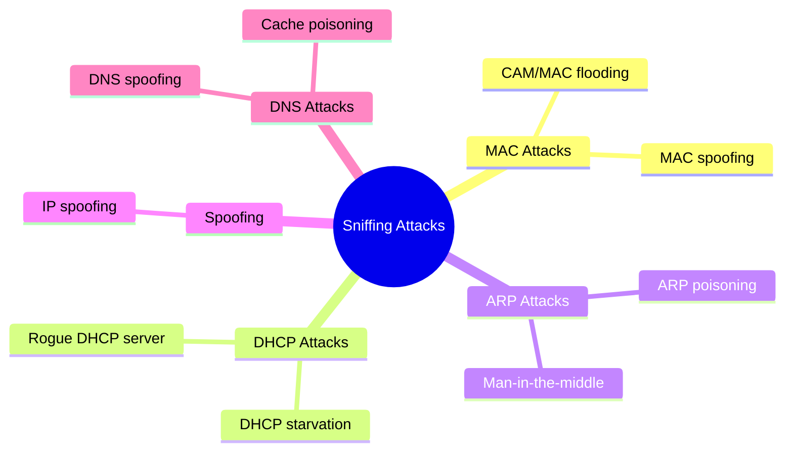
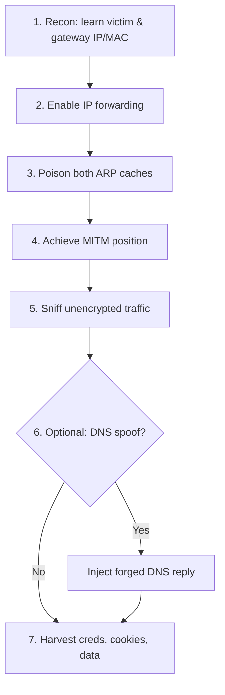
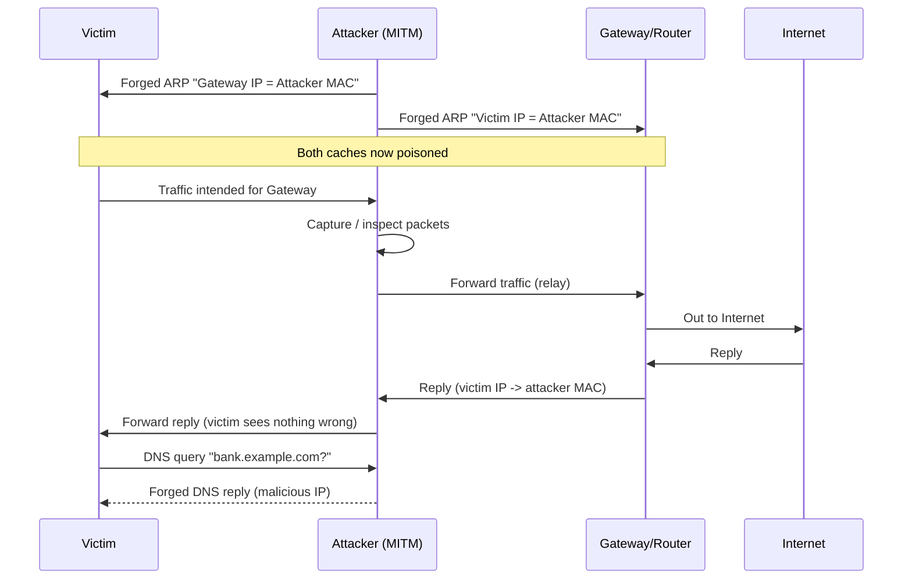
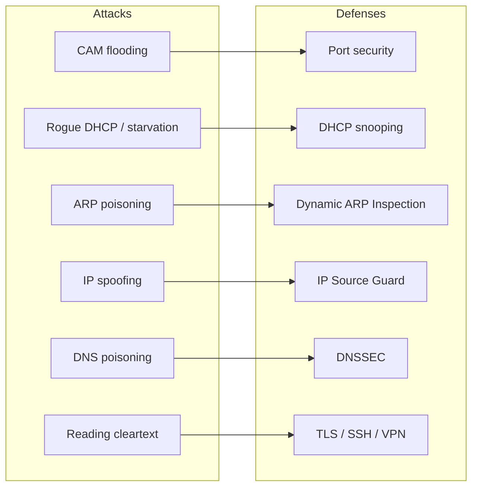

# Sniffing 🕵️

> **What you'll learn:** How attackers silently capture network traffic, the Layer-2 and protocol tricks they use to redirect that traffic to themselves (CAM flooding, ARP poisoning, DHCP and DNS attacks, spoofing), the tools involved, and how defenders detect and stop it.
> **Prerequisites:** Basic OSI model (especially Layer 2 / Data Link and Layer 3 / Network), what IP and MAC addresses are, how switches and routers differ, and comfort with a Linux command line.

| | |
|---|---|
| **Course** | Professional Level 1 |
| **Course code** | SKL-CSP1-710 |
| **Module** | Sniffing |
| **Level** | level1 |

---

## 1. In Plain English 📬

Picture your local network as a postal system. Every device sends out "letters" (data packets) addressed to other devices. **Sniffing** is secretly reading other people's mail as it passes by — capturing traffic that wasn't meant for you and inspecting what's inside.

- **Old networks used hubs** — a dumb device that photocopies every letter to every port. Eavesdropping was trivial.
- **Modern networks use switches** — they learn which device is on which port and deliver each letter only to its recipient. Plain eavesdropping fails here.
- So attackers learned tricks to **force** the switch to hand them mail that isn't theirs: overwhelming its memory or lying about who they are.

> 🔑 **Key idea:** A huge amount of everyday traffic is still readable if unencrypted — `http://` login forms, internal tools, database connections, FTP transfers. One attacker on your local network can quietly harvest passwords, session cookies, and confidential data without ever "hacking" a server in the Hollywood sense.

Sniffing is one of the oldest, quietest, and most effective techniques in an attacker's toolkit — and understanding it is the first step to defending against it.


*The OSI model. Sniffing attacks mostly target Layer 2 (Data Link / MAC, ARP) and Layer 3 (Network / IP), reading the unencrypted upper layers once traffic is redirected.*

---

## 2. Core Concepts 🧠

### Sniffing — the basic idea

**Sniffing** (a.k.a. *packet capture*) means putting a network interface into a mode where it captures traffic for a human or program to read. Normally a card ignores frames not addressed to it.

- **Promiscuous mode** — tells the card "give me *every* frame on the wire, not just mine."
- **Monitor mode** — the wireless cousin: captures raw radio frames, including ones from networks you haven't joined.
- A **frame** is a Layer-2 (Data Link) unit; a **packet** is a Layer-3 (Network) unit. Capturing a "packet" usually means capturing the whole frame and decoding the layers inside.

### Passive vs Active sniffing — the most important distinction

- **Passive sniffing** = just *listening*. You capture traffic that already reaches your card, sending nothing. Works on **hub** networks (the hub floods everything) and **wireless** (radio is broadcast). Nearly undetectable — the attacker emits nothing.
- **Active sniffing** = *interfering* with the network to pull traffic that wouldn't normally reach you. Required on **switched** networks. The attacker injects crafted packets to trick switches or hosts. CAM flooding, ARP poisoning, DHCP and DNS attacks are all active. Because packets are sent, it *can* be detected.

| | 🟢 Passive | 🔴 Active |
|---|---|---|
| Network type | Hubs, wireless | Switches |
| Attacker sends traffic? | No | Yes |
| Detectable? | Very hard | Possible |
| Examples | Listening on a hub / Wi-Fi | ARP poisoning, CAM flooding |

### How a switch normally works: the CAM table

A switch keeps a **CAM table** (Content Addressable Memory, a.k.a. the MAC address table) mapping **MAC addresses** (the 48-bit hardware address on each card) to physical ports. When a frame arrives, the switch looks up the destination MAC and forwards the frame only out the matching port. This is what makes simple passive sniffing fail on switches.

### Taxonomy of sniffing attacks



### MAC attacks — CAM flooding (MAC flooding)

The CAM table is **finite**. In a **MAC flooding** attack, the attacker rapidly sends thousands of frames each with a *different fake source MAC*. The switch tries to learn each one, filling the table. Once full, many switches **fail open** — unable to look up addresses, they revert to hub behaviour and **flood all frames out of every port**. Now the attacker can passively sniff everything — an active attack used to enable passive capture. Tools like `macof` automate this.

### DHCP attacks

**DHCP** auto-assigns a device its IP, subnet mask, default gateway, and DNS server when it joins. Two attacks:

| Attack | What the attacker does | Impact |
|---|---|---|
| **DHCP starvation** 🥀 | Floods the DHCP server with requests using many spoofed MACs | Exhausts the IP pool → legit clients can't get an address (DoS) |
| **Rogue DHCP server** 🎭 | Stands up their own DHCP server that answers first | Hands victims a config pointing gateway + DNS at the attacker → MITM |

### ARP poisoning (ARP spoofing)

**ARP** translates a known IP into the MAC needed to deliver a frame on the LAN. A host shouts *"Who has 192.168.1.1? Tell me your MAC,"* and the owner replies.

> ⚠️ **The flaw:** ARP is **stateless and unauthenticated** — a host will accept and cache an ARP reply even if it never asked.

In **ARP poisoning**, the attacker sends forged ARP replies: it tells the victim *"the gateway's IP belongs to my MAC,"* and tells the gateway *"the victim's IP belongs to my MAC."* Both update their **ARP cache** with the lie, so both send traffic to the attacker, who forwards it on (nothing breaks visibly) while copying everything. This is the classic **man-in-the-middle (MITM)** attack on a LAN.

### MAC spoofing and IP spoofing

| Technique | What it forges | Why attackers use it |
|---|---|---|
| **MAC spoofing** | The card's reported MAC address | Bypass MAC-based access controls (port security, captive portals); hijack MAC-tied sessions |
| **IP spoofing** | The *source IP* in a packet header | Bypass IP filtering, anonymize attacks, building block for DoS/reflection. Replies go to the forged address, so pure IP spoofing suits one-way/amplification attacks unless combined with other tricks |

### DNS poisoning (DNS spoofing)

**DNS** translates names like `bank.example.com` into IP addresses. **DNS poisoning** feeds a victim a *false* IP for a name, so typing a legitimate site silently sends them to an attacker-controlled server (often a phishing clone).

- **On a LAN:** an attacker already in a MITM position (via ARP poisoning) answers DNS queries with forged replies.
- **At scale:** **cache poisoning** corrupts a resolver's cached records, misdirecting many users at once.

---

## 3. How It Works (Step by Step) 🔗

The most common end-to-end LAN attack: **ARP poisoning to enable sniffing and DNS spoofing.** *(Authorized labs only.)*



1. **Recon.** Join the network; scan to learn the IP/MAC of the victim and the default gateway.
2. **Enable forwarding.** Turn on IP forwarding so traffic passing through is relayed onward — otherwise the victim loses connectivity and the attack is obvious.
3. **Poison the caches.** Continuously send forged ARP replies: to the victim *"gateway IP = attacker MAC,"* and to the gateway *"victim IP = attacker MAC."*
4. **Achieve MITM.** Both now send traffic to the attacker, who forwards it to the real destination — victim notices nothing.
5. **Sniff.** Run a capture tool, reading any unencrypted traffic (HTTP, FTP, Telnet, DNS, etc.).
6. **Optional DNS spoof.** When the victim asks *"where is `bank.example.com`?"*, inject a forged reply to a malicious server.
7. **Harvest.** Credentials, cookies, and data captured; victim may be redirected to a phishing page.



---

## 4. Real-World Examples 🌍

| Case | Year | What happened | Lesson |
|---|---|---|---|
| **Firesheep** 🐑 | 2010 | A Firefox extension let anyone on open Wi-Fi passively capture unencrypted session cookies (Facebook, Twitter, etc.) and log in as the victim — no skill required | Passive sniffing of unencrypted sessions on shared networks is a real, mass-scale threat; drove "HTTPS everywhere" |
| **Kaminsky DNS flaw** 🧨 | 2008 | Dan Kaminsky disclosed a weakness in how resolvers validated responses, making large-scale **DNS cache poisoning** practical | Triggered industry-wide patching; accelerated source-port randomization and DNSSEC |
| **Coffee-shop MITM** ☕ | — | Attacker on café Wi-Fi runs an ARP-poisoning tool; patrons logging into an `http://` portal or sending an unencrypted token leak credentials directly | The everyday version of the Section 3 chain — quiet forwarding means victims notice nothing |

---

## 5. Tools of the Trade 🛠️

> ⚠️ **Warning:** All tools below are legitimate network-analysis tools. Use them **only** on networks you own or are explicitly authorized to test.

| Tool | Role | Use case |
|---|---|---|
| **Wireshark / tshark** | Packet capture & analysis | Deep protocol decoding, forensic inspection |
| **tcpdump** | Lightweight CLI capture | Quick, scriptable captures on any Unix box |
| **macof** (dsniff) | CAM/MAC flooding | Force a switch to fail open |
| **Ettercap** | All-in-one MITM | ARP poisoning, sniffing, filtering |
| **arpspoof** (dsniff) | Targeted ARP poisoning | Redirect one host's traffic |

### Wireshark / tshark — packet capture and analysis
The de facto standard graphical analyzer; `tshark` is its CLI sibling. Decodes thousands of protocols.

```bash
# Capture on eth0, save to a file, keep only HTTP traffic
sudo tshark -i eth0 -w capture.pcapng -f "tcp port 80"
```
Listens on `eth0`, writes raw packets to `capture.pcapng`, and uses a capture filter (`-f`) to keep only TCP port 80 (HTTP), reducing noise.

> 🖼️ *Suggested image: Wireshark capture window showing a decoded HTTP request with credentials visible in the packet detail pane.*

### tcpdump — lightweight CLI capture
A minimal, scriptable capture tool present on most Unix systems.

```bash
sudo tcpdump -i eth0 -n -A 'port 21'
```
`-i eth0` selects the interface, `-n` skips DNS name resolution (faster), `-A` prints payloads as ASCII, and `'port 21'` filters for FTP — handy for spotting cleartext FTP logins.

### macof (part of dsniff) — MAC/CAM flooding
Floods a switch with random source MACs to fill the CAM table.

```bash
sudo macof -i eth0
```
Sends a flood of frames with random MAC/IP values out of `eth0`, attempting to overflow the CAM table so the switch fails open and floods traffic.

### Ettercap — all-in-one MITM and ARP poisoning
A comprehensive MITM suite supporting ARP poisoning, sniffing, and filtering.

```bash
sudo ettercap -T -i eth0 -M arp:remote /192.168.1.10// /192.168.1.1//
```
`-T` runs the text interface; `-M arp:remote` launches an ARP-poisoning MITM between victim `192.168.1.10` and gateway `192.168.1.1`, capturing traffic between them.

### arpspoof (part of dsniff) — targeted ARP poisoning
A focused tool that sends forged ARP replies to redirect one host's traffic.

```bash
sudo arpspoof -i eth0 -t 192.168.1.10 192.168.1.1
```
Tells victim `192.168.1.10` that the gateway `192.168.1.1` is at the attacker's MAC, so the victim's gateway-bound traffic comes to the attacker. (Run a second instance with targets reversed for full bidirectional MITM, and enable IP forwarding first.)

---

## 6. Hands-On Lab (Authorized / Lab-Only) 🧪

> ⚠️ **Reminder:** Perform this only on systems you own or have written authorization to test. Recommended setup: **Kali Linux** (attacker) and **Metasploitable 2** (vulnerable target) in an **isolated virtual network with no internet bridge**.

**Goal:** Run an ARP-poisoning MITM between Metasploitable 2 and the gateway, then capture a cleartext FTP login.

### Step 1 — Identify the hosts
```bash
# Find live hosts on the lab subnet
nmap -sn 192.168.56.0/24
```
Expected output lists the gateway (e.g., `192.168.56.1`) and the Metasploitable box (e.g., `192.168.56.101`). Note both IPs and their MACs.

> 🖼️ *Suggested image: Nmap host-discovery output listing live hosts with their MAC addresses.*

### Step 2 — Enable IP forwarding
```bash
echo 1 | sudo tee /proc/sys/net/ipv4/ip_forward
```
Expected output: `1`. This lets your attacker box relay the victim's traffic so connectivity is preserved and the attack stays stealthy. Skip it and the victim simply loses connection.

### Step 3 — Start ARP poisoning (two terminals)
```bash
# Terminal A: tell the victim that the gateway is us
sudo arpspoof -i eth0 -t 192.168.56.101 192.168.56.1
# Terminal B: tell the gateway that the victim is us
sudo arpspoof -i eth0 -t 192.168.56.1 192.168.56.101
```
Expected output: repeating lines showing ARP replies being sent. Leave both running — you are now the man in the middle.

### Step 4 — Confirm the poisoning worked
On the victim, `arp -a` shows the gateway's IP mapped to the *attacker's* MAC. From the attacker side, you verify traffic flow in the next step.

### Step 5 — Start the capture
```bash
sudo tcpdump -i eth0 -n -A 'host 192.168.56.101 and tcp port 21'
```
Captures only FTP (port 21) traffic to/from the victim and prints payloads as ASCII.

### Step 6 — Generate and capture the cleartext login
From the victim, perform an FTP login (Metasploitable runs a cleartext FTP service). Your tcpdump window should show the protocol commands:
```
USER msfadmin
PASS msfadmin
```
> 💡 **Interpretation:** Because FTP is unencrypted, the username and password appear in **plaintext** — exactly what an attacker harvests. This is the whole point: it shows *why* cleartext protocols are dangerous on a shared network.

> 🖼️ *Suggested image: tcpdump terminal output with the cleartext USER/PASS lines highlighted.*

### Step 7 — Clean up
Stop both `arpspoof` processes (Ctrl+C); they automatically send corrective ARP replies to restore the real mappings. Then disable forwarding:
```bash
echo 0 | sudo tee /proc/sys/net/ipv4/ip_forward
```
Confirm the victim's ARP cache returns to normal. Always restore the environment after a lab.

---

## 7. Countermeasures & Defenses 🛡️



**🔐 Make traffic unreadable (encryption — the strongest defense):**
- Use **HTTPS/TLS everywhere**; enforce **HSTS** so browsers refuse to downgrade to HTTP.
- Replace cleartext protocols: SSH over Telnet, SFTP/FTPS over FTP, IMAPS/SMTPS over plaintext mail.
- Use a **VPN** on untrusted networks so captured traffic is still encrypted.

**🔧 Harden Layer 2 / switches (stop active sniffing):**

| Defense | Defeats |
|---|---|
| **Port security** (limit MACs learned per port) | CAM/MAC flooding |
| **DHCP snooping** (trust DHCP only from authorized ports) | Rogue DHCP, starvation |
| **Dynamic ARP Inspection (DAI)** (validate ARP vs DHCP-snooping bindings) | ARP poisoning |
| **IP Source Guard** (filter spoofed source IPs at the port) | IP spoofing |
| **VLANs + 802.1X** (segment + authenticate devices) | Unauthorized access |

**🌐 Protect name resolution:**
- Deploy **DNSSEC** so DNS responses are cryptographically signed and forgeries are rejected.
- Use validating resolvers and DNS over HTTPS/TLS where appropriate.

**🔎 Detection (see also Section 9):**
- Monitor for ARP-traffic spikes, multiple IPs mapping to one MAC, or one IP suddenly mapping to a new MAC.
- Use **static ARP entries** for critical hosts (gateway, servers) so forged replies are ignored.
- Run an IDS/NIDS (Suricata/Snort) with rules for ARP anomalies and DHCP spoofing.

**Detecting sniffers specifically:**
- **ARP-based:** send an ARP request to a non-existent IP with a bogus broadcast MAC; only a host in promiscuous mode tends to respond.
- **DNS-based:** craft traffic to a fake host; a sniffer doing reverse-DNS lookups reveals itself with a DNS query.
- **Latency/ping tests:** a promiscuous-mode host processing all traffic may show different response timing under load.
- Tools like the `arpwatch` daemon or `nmap`'s sniffer-detection script automate this monitoring.

---

## 8. Key Terms 📖

| Term | Meaning |
|---|---|
| **Sniffing / packet capture** | Reading network traffic off the wire, intended for you or not |
| **Promiscuous mode** | NIC setting that accepts all frames, not just those addressed to it |
| **Monitor mode** | Wireless equivalent capturing raw radio frames from any nearby network |
| **Passive sniffing** | Listening only; no packets injected (hubs/Wi-Fi) |
| **Active sniffing** | Injecting packets to redirect traffic (required on switches) |
| **MAC address** | 48-bit hardware address of a network card (Layer 2) |
| **CAM table** | A switch's MAC-to-port lookup table; finite in size |
| **MAC/CAM flooding** | Overflowing the CAM table so the switch fails open and floods all ports |
| **ARP** | Maps an IP to a MAC on a LAN; unauthenticated |
| **ARP poisoning / spoofing** | Forged ARP replies to become a man-in-the-middle |
| **Man-in-the-middle (MITM)** | Attacker secretly relaying/altering traffic between two parties |
| **DHCP** | Auto-assigns IP/gateway/DNS to clients |
| **DHCP starvation** | Exhausting the DHCP address pool (DoS) |
| **Rogue DHCP server** | Attacker-run DHCP server handing out malicious config |
| **MAC spoofing** | Changing your reported MAC to impersonate another device |
| **IP spoofing** | Forging the source IP in packet headers |
| **DNS poisoning / spoofing** | Returning a false IP for a domain to misdirect victims |
| **DHCP snooping / DAI / Port security** | Switch features that block these Layer-2 attacks |
| **DNSSEC** | Cryptographic signing of DNS records to prevent forgery |

---

## 9. Summary & Takeaways ✅

- **Sniffing** captures network traffic — *passive* (listen only) on hubs/Wi-Fi, *active* (inject packets) on switched networks.
- Switches normally block sniffing via the **CAM table**, but **MAC flooding** can force a switch to fail open and flood all ports.
- **ARP poisoning** is the classic LAN MITM: forged ARP replies redirect victim and gateway traffic through the attacker.
- **DHCP attacks** (starvation, rogue servers) and **DNS poisoning** let attackers control a victim's network config and where domain lookups resolve.
- **MAC and IP spoofing** support impersonation, filter evasion, and amplification.
- The strongest defense is **encryption** (TLS/HTTPS, SSH, VPN) — it doesn't stop capture but makes captured data useless.
- Switch-level controls — **port security, DHCP snooping, Dynamic ARP Inspection, IP Source Guard** — defeat the active attacks at Layer 2; **DNSSEC** protects name resolution.
- Sniffers can be **detected** via ARP, DNS, and latency techniques and by monitoring ARP/DHCP anomalies.

**Further reading:** OWASP Testing Guide (network/transport-layer testing); NIST SP 800-115 (*Technical Guide to Information Security Testing and Assessment*); MITRE ATT&CK techniques **T1557** (*Adversary-in-the-Middle*) and **T1040** (*Network Sniffing*); Cisco docs on Port Security, DHCP Snooping, and Dynamic ARP Inspection.
