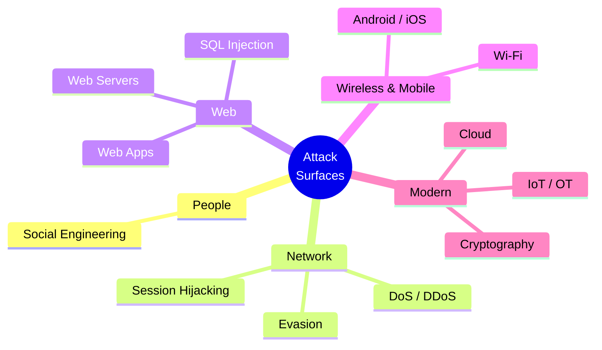

# Course 3 · Professional Level 2

**Code:** `SKL-CSP2-711` · **Learning hours:** 80 · **Level:** Advanced

The largest course. You move from breaking into single machines to attacking
**whole technology domains**: people (social engineering), availability (DoS),
sessions, defensive evasion, web servers and applications, databases (SQLi),
wireless, mobile, cloud, cryptography, and IoT/OT. This is where the bulk of
real-world offensive and defensive skill lives.

## Modules
1. [Social Engineering](module-01-social-engineering.md)
2. [Denial-of-Service](module-02-denial-of-service.md)
3. [Session Hijacking](module-03-session-hijacking.md)
4. [Evading IDS, Firewalls & Honeypots](module-04-evading-ids-firewalls-and-honeypots.md)
5. [Hacking Web Servers](module-05-hacking-web-servers.md)
6. [Hacking Web Applications](module-06-hacking-web-applications.md)
7. [SQL Injection](module-07-sql-injection.md)
8. [Hacking Wireless Networks](module-08-hacking-wireless-networks.md)
9. [Hacking Mobile Platforms](module-09-hacking-mobile-platforms.md)
10. [Cloud Computing Security](module-10-cloud-computing-security.md)
11. [Cryptography](module-11-cryptography.md)
12. [IoT & OT Hacking](module-12-iot-and-ot-hacking.md)

## Attack surfaces covered

⬅️ Prev: [Course 2](../02-professional-level-1/) · ➡️ Next: [Course 4 · Penetration Testing](../04-penetration-testing/)
