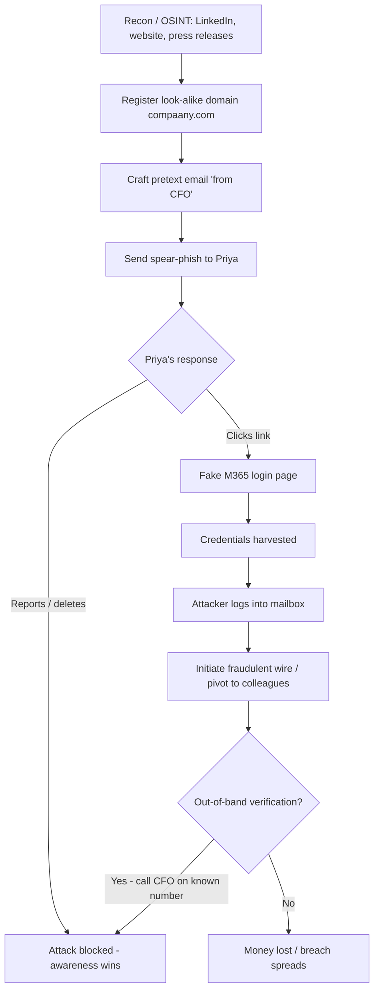

# Social Engineering

> **What you'll learn:** How attackers manipulate people (not machines) to gain access, money, or secrets — the techniques they use, real incidents, the tools involved, and how to defend yourself and an organization.
> **Prerequisites:** Basic familiarity with email, web browsing, and common workplace IT (logins, badges, help desks). No prior security knowledge required.

| | |
|---|---|
| **Course** | Professional Level 2 |
| **Course code** | SKL-CSP2-711 |
| **Module** | Social Engineering |
| **Level** | level2 |

---

## 1. In Plain English

Imagine a thief who wants to get into a locked office building. One option is to pick the locks, cut the alarm wires, and climb through a window — hard, noisy, and risky. A much easier option: wait by the door with a coffee in each hand and a friendly smile, and ask the next employee, "Hey, could you grab the door for me? My hands are full." Most people will hold it open. The thief just walked in — no lock-picking required.

That second approach is **social engineering**: the art of tricking *people* into doing something that helps the attacker, instead of attacking technology directly. Computers do exactly what they are told. People, on the other hand, are helpful, busy, trusting, afraid of getting in trouble, and easily rushed — and attackers exploit exactly those human tendencies.

Why should a total beginner care? Because social engineering is involved in a huge share of real-world breaches. You can have the world's best firewall and still get hacked if an employee clicks a fake invoice or reads their password to someone pretending to be IT support. The "vulnerability" being attacked is human psychology, and *everyone* — not just engineers — is part of the defense.

Throughout this note, every offensive technique is described so you can **recognize and defend against it**. Actually testing these techniques on people is only acceptable in authorized engagements (for example, a company hiring testers to run a phishing simulation) or in a private lab you own.

---

## 2. Core Concepts

### Social engineering

**Social engineering** is any attack that manipulates human behavior to bypass security controls. Rather than exploiting a software bug, the attacker exploits trust, authority, fear, curiosity, or helpfulness. The goal is usually to make the victim do one of three things: **reveal information** (a password, a code, internal details), **perform an action** (click a link, move money, plug in a USB stick), or **grant access** (let someone through a door, install software).

Almost every social engineering attack leans on a small set of **psychological levers**:

- **Authority** — we obey people who seem to be in charge ("This is the CEO, I need this done now").
- **Urgency / scarcity** — we act fast and skip checks when told there's no time ("Your account will be locked in 10 minutes").
- **Social proof** — we copy what others appear to be doing ("All your colleagues have already updated their password here").
- **Liking / familiarity** — we trust people who are friendly or seem similar to us.
- **Reciprocity** — we feel obliged to return a favor ("I helped you, now just sign here").
- **Fear** — threats of punishment, loss, or embarrassment push people to comply.

### The attack lifecycle

Most engagements follow four phases:

1. **Reconnaissance (information gathering)** — collecting public information about the target: names, job titles, email formats, vendors, org charts. This is called **OSINT** (Open-Source Intelligence — intelligence gathered from publicly available sources like LinkedIn, company websites, and social media).
2. **Hook (engagement / pretexting)** — making first contact and establishing a believable cover story.
3. **Play (exploitation)** — getting the victim to act: click, pay, reveal, or grant access.
4. **Exit** — getting the gains out and covering tracks so the victim doesn't realize what happened (or realizes too late).

### Phishing and its cousins

**Phishing** is sending fraudulent messages — usually email — that appear to come from a trusted source, to trick recipients into revealing data or running malware. Variants are named by *target* and *channel*:

- **Spear phishing** — phishing aimed at a *specific* individual, customized with personal details to look convincing.
- **Whaling** — spear phishing that targets a "big fish" such as a CEO or CFO.
- **Vishing** (voice phishing) — the same trickery over a **phone call** (e.g., a caller pretending to be the bank's fraud department).
- **Smishing** (SMS phishing) — phishing via **text messages**, often with a malicious link ("Your package couldn't be delivered, confirm here").
- **Business Email Compromise (BEC)** — a high-value scam where the attacker impersonates an executive or supplier to redirect payments.

### Pretexting

**Pretexting** is inventing a believable scenario (the "pretext") to justify the attacker's request. Example: calling the help desk pretending to be a new remote employee who can't log in, so they reset "your" password. Pretexting is the storytelling backbone behind vishing, impersonation, and many phishing campaigns.

### Baiting

**Baiting** offers something enticing to lure a victim into a trap. The classic physical version is leaving infected USB drives labeled "Payroll 2025" in a parking lot, betting that someone will plug one in out of curiosity. The digital version is a tempting "free movie download" that is actually malware.

### Tailgating and piggybacking

**Tailgating** is following an authorized person through a secure door before it closes, without badging in yourself. **Piggybacking** is the same thing but with the victim's *consent* — they hold the door for you because you look like you belong (the coffee-cup trick from Section 1).

### Insider threats

An **insider threat** is a risk that comes from someone who already has legitimate access — an employee, contractor, or partner. Categories:

- **Malicious insider** — deliberately steals data or sabotages systems (revenge, money, espionage).
- **Negligent insider** — well-meaning but careless: reuses passwords, falls for phishing, emails data to the wrong person.
- **Compromised insider** — a legitimate account taken over by an outside attacker, who then operates "from the inside."

Social engineering and insider threats intertwine: a phished employee *becomes* a compromised insider.

### Impersonation on social networking sites

Attackers create **fake or cloned profiles** on platforms like LinkedIn, Facebook, or X to build trust. Tactics include cloning a real person's profile to fool their connections, posing as a recruiter to extract resumes and personal data, or befriending employees to map an organization. The information harvested feeds straight back into reconnaissance and spear phishing.

### Identity theft

**Identity theft** is stealing and using someone's personal information — name, national ID number, date of birth, card numbers — to impersonate them for fraud (opening accounts, taking loans, filing fake tax returns). Social engineering is a primary *fuel* for identity theft: phishing and pretexting collect the raw personal data that thieves then monetize. The data points most prized are collectively called **PII (Personally Identifiable Information).**

---

## 3. How It Works (Step by Step)

Let's walk through a realistic **spear-phishing → credential theft** chain, which is the most common social engineering pattern in corporate breaches.

1. **Recon (OSINT).** The attacker finds, on LinkedIn, that "Priya" works in Finance and reports to "CFO Raj." From the company website they learn the email format is `first.last@company.com`.
2. **Pretext.** The attacker registers a look-alike domain (`compaany.com`) and drafts an email "from Raj" referencing a real ongoing project (gleaned from a press release) to add authority and credibility.
3. **Hook.** Priya receives: *"Priya — finalizing the Henderson deal. Review the updated invoice and confirm the wire today, it's time-sensitive."* (Authority + urgency.)
4. **Lure.** The email links to a fake Microsoft 365 login page that looks identical to the real one.
5. **Capture.** Priya enters her username and password; the fake page **harvests** them and quietly forwards her to the real site so nothing seems wrong.
6. **Use / pivot.** The attacker logs into Priya's mailbox, reads payment threads, and either initiates a fraudulent wire (BEC) or uses the access to phish more colleagues from a trusted internal address.
7. **Detection point (defense).** A mail security gateway flags the look-alike domain; or Priya reports the email; or the bank/finance team enforces **out-of-band verification** (calling Raj on a known number) before any wire — breaking the chain.



---

## 4. Real-World Examples

**Twitter/X account takeover (July 2020).** Attackers used **vishing and pretexting** against Twitter employees, posing as internal IT to obtain access to internal admin tools. They then hijacked high-profile verified accounts (politicians, executives, celebrities) to run a cryptocurrency scam. Lesson: even a tech-savvy company falls when *people* are targeted, and powerful internal tools amplify the damage.

**RSA SecurID breach (2011).** Attackers sent a small number of employees a spear-phishing email with an Excel attachment titled along the lines of "2011 Recruitment Plan." Opening it exploited a vulnerability and installed a backdoor, ultimately leading to theft of data related to RSA's SecurID two-factor authentication product. Lesson: a single targeted email to a non-executive employee can compromise a security company itself.

**Business Email Compromise — general pattern.** Across many documented cases, finance staff have wired large sums after receiving emails appearing to come from a CEO or a trusted supplier, often with urgency and instructions to keep the matter confidential. The FBI's Internet Crime reports consistently rank BEC among the costliest cyber-crime categories. Lesson: BEC needs no malware — just a convincing story and a rushed approval process.

---

## 5. Tools of the Trade

These are standard tools used in **authorized** awareness training, penetration tests, and red-team engagements. They are described for defensive understanding.

### theHarvester (OSINT)
Collects emails, subdomains, and host names from public sources to understand a target's exposure.
```bash
theHarvester -d example.com -b bing,duckduckgo -l 200
# -d target domain, -b data sources to query, -l limit results
# Shows what public footprint an attacker could enumerate about a domain.
```

### Gophish (phishing simulation framework)
An open-source platform to run *authorized* phishing simulations and measure click rates.
```bash
# Launch the Gophish server (admin UI then served locally, default :3333)
./gophish
# You then configure: a Sending Profile, a landing-page template,
# a target group, and a campaign — all from the web dashboard.
# Used by security teams to train staff and report on susceptibility.
```

### Social-Engineer Toolkit (SET)
A menu-driven framework for crafting phishing pages and payloads in lab settings.
```bash
sudo setoolkit
# Navigate: 1) Social-Engineering Attacks -> 2) Website Attack Vectors
#           -> Credential Harvester Method -> Site Cloner
# Clones a login page to demonstrate credential capture in an authorized lab.
```

### Maltego (OSINT graphing)
Maps relationships between people, domains, emails, and social profiles visually, showing how reconnaissance data connects. Used via its GUI by running "transforms" against an entity (a domain or email) to expand the graph of related data.

### Built-in email header inspection (defensive)
No special tool needed — view the raw headers of a suspicious email to check the real sender path.
```text
# In most mail clients: "Show original" / "View source"
# Inspect: Return-Path, Received: chain, SPF/DKIM/DMARC results
# A "pass" on DMARC and a matching Return-Path raise confidence; failures are a red flag.
```

---

## 6. Hands-On Lab (Authorized / Lab-Only)

> **Reminder:** Perform every step only against systems, accounts, and people that you own or have **explicit written authorization** to test. Never target real third parties.

**Goal:** Build a self-contained lab, run an end-to-end phishing simulation against a *consenting test user account you control*, and then validate that your detection controls catch it.

**Lab setup (build your own range):**
- Use a virtualization host (VirtualBox/VMware) or a cloud sandbox with an isolated network.
- **VM 1 — Attacker (Kali Linux):** runs Gophish / SET and theHarvester.
- **VM 2 — Victim workstation (Windows or Linux):** a clean browser and a test mailbox.
- **VM 3 — Defender (any Linux):** a mail/log collector (e.g., a syslog server or a lightweight SIEM such as a Wazuh or ELK stack) to observe events.
- Keep the network **host-only / NAT-isolated** so nothing leaves the lab.

**Attack chain:**
1. **Recon.** From the attacker VM, run `theHarvester` against a *domain you own* to see what public data exists. Note the email format and any exposed addresses.
2. **Pretext.** Draft a believable scenario for your test scenario (e.g., a fake "password expiry" notice). Write the email body to use authority + urgency, but keep it clearly within your test scope.
3. **Build the campaign.** In Gophish, create a sending profile (your lab SMTP), a cloned login landing page, a target group containing only your *test* victim address, and a campaign. Adapt the templates yourself — do not expect copy-paste to work; match your lab's domain.
4. **Launch & capture.** Send the campaign to the victim VM. From the victim, open the email, click through, and submit dummy credentials into the landing page. Confirm Gophish records the **open**, **click**, and **submitted data** events.
5. **Pivot (optional, lab-only).** Demonstrate why credentials matter by logging into a lab service with the captured test credentials — purely to show impact.

**Validate the defense / detection:**
6. **Detect.** On the defender VM, confirm the simulated email and click generated log events. Write or tune a detection rule that fires on: (a) inbound mail referencing a look-alike domain, (b) a click to your landing-page host, or (c) a login from an unexpected source for the test account.
7. **Verify out-of-band control.** Add a process step: require a phone/secondary-channel confirmation before any "sensitive action" in your scenario, and show that following it stops the attack.
8. **Report.** Produce a short metrics report (open rate, click rate, submit rate) exactly as a real awareness program would — this is the deliverable that drives training.

**Success criteria:** the attack events are *both* captured by Gophish *and* visible/alertable on the defender side, proving you can run **and** detect the technique.

---

## 7. Countermeasures & Defenses

**People (awareness):**
- Run **regular security-awareness training** and ongoing **phishing simulations**; measure improvement over time.
- Teach the verification habit: for any unusual money or data request, **verify out-of-band** using a known phone number — never the contact details in the suspicious message.
- Make it **easy and blame-free to report** suspicious messages (a one-click "Report Phish" button); reward reporting, never punish honest mistakes.
- Foster a culture where it is acceptable to **challenge strangers** at doors and to say "no" to authority-based pressure.

**Process:**
- Require **dual approval and call-back verification** for wire transfers and changes to payment details (anti-BEC).
- Enforce **least privilege** and timely **deprovisioning** of leaving employees to limit insider damage.
- Maintain a tested **incident-response plan** so a reported phish triggers fast containment.

**Technology — email & identity:**
- Deploy **SPF, DKIM, and DMARC** (email authentication standards that let receivers detect spoofed senders) and enforce DMARC in reject/quarantine mode.
- Use a **secure email gateway** with link rewriting/sandboxing and **look-alike / newly-registered domain** detection.
- Mandate **phishing-resistant MFA** (multi-factor authentication, ideally FIDO2/hardware keys) so stolen passwords alone aren't enough.
- Monitor with a **SIEM** for impossible-travel logins, mailbox-rule changes, and mass forwarding.

**Physical:**
- Use **badge access with anti-tailgating** measures (mantraps, turnstiles, security guards) and visitor escorts.
- **Disable autorun** and restrict USB ports to defeat baiting; provide a safe way to report found devices.

**Detection signals to watch:**
- Look-alike domains, mismatched display name vs. real address, DMARC failures.
- Sudden urgency + secrecy + payment-change requests.
- Logins or data access from unusual locations/times; new inbox forwarding rules.

---

## 8. Key Terms

- **Social engineering** — manipulating people into actions or disclosures that compromise security.
- **OSINT** — Open-Source Intelligence; data gathered from public sources for reconnaissance.
- **Phishing** — fraudulent messages impersonating a trusted source to steal data or deliver malware.
- **Spear phishing / Whaling** — phishing targeted at a specific person / a senior executive.
- **Vishing** — phishing conducted by voice phone call.
- **Smishing** — phishing conducted by SMS/text message.
- **Pretexting** — using an invented, believable scenario to justify a malicious request.
- **Baiting** — luring a victim with something enticing (e.g., an infected USB drive).
- **Tailgating / Piggybacking** — following an authorized person through a secure door (without / with their consent).
- **Insider threat** — risk from someone with legitimate access (malicious, negligent, or compromised).
- **BEC (Business Email Compromise)** — impersonating an executive/supplier to redirect payments.
- **Identity theft** — stealing personal data to impersonate someone for fraud.
- **PII** — Personally Identifiable Information.
- **MFA** — Multi-Factor Authentication; requiring more than a password to log in.
- **SPF / DKIM / DMARC** — email-authentication standards used to detect and block spoofed senders.

---

## 9. Summary & Takeaways

- Social engineering attacks **people, not machines** — it exploits trust, authority, urgency, fear, and curiosity.
- Phishing, vishing, smishing, pretexting, baiting, and tailgating are all variations on the same idea across different **channels**.
- Most attacks follow a lifecycle: **recon → hook → exploit → exit**, and OSINT quietly powers the whole thing.
- **Insider threats** (malicious, negligent, or compromised) and **fake social-media profiles** feed reconnaissance and turn humans into entry points.
- Stolen personal data drives **identity theft**, making PII protection a core defensive goal.
- Defense is **layered**: aware people + verified processes + email/identity technology + physical controls.
- The single highest-impact habits: **out-of-band verification** for sensitive requests and **phishing-resistant MFA**.
- A blame-free **reporting culture** turns every employee into a sensor, not a liability.

**Further reading:** NIST SP 800-50 / SP 800-61 (security awareness and incident response); MITRE ATT&CK (Initial Access — *Phishing*, T1566); OWASP Top 10 and OWASP awareness materials; CISA guidance on phishing and Business Email Compromise.
