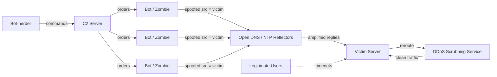

# Denial-of-Service (DoS & DDoS)

> What you'll learn: how attackers knock services offline by exhausting their resources, the main attack families and tools, a real-world case study, and how defenders detect and mitigate them.
> Prerequisites: basic TCP/IP networking (IP, ports, the TCP handshake), how HTTP requests work, and comfort with a Linux command line.

| Course | Course code | Module | Level |
|---|---|---|---|
| Professional Level 2 | SKL-CSP2-711 | Module 02 — Denial-of-Service | level2 |

---

## 1. In Plain English

Imagine a small coffee shop with one barista. Normally customers walk in, order, and leave happy. Now imagine 5,000 people show up at once — some just standing in the doorway blocking it, some ordering the most complicated drinks possible, and some shouting fake orders that the barista half-prepares and then abandons. The real customers can't get in, can't get served, and eventually give up. The shop isn't *broken* — it's just **overwhelmed**. That is a **Denial-of-Service (DoS)** attack: making a system unavailable to its legitimate users by exhausting some limited resource (bandwidth, connections, CPU, or memory).

A **Distributed** Denial-of-Service (**DDoS**) attack is the same idea, but instead of one troublemaker, the crowd is made of thousands of machines spread across the world — often computers, phones, or smart devices that have been secretly hijacked. Because the flood comes from everywhere at once, you can't just block one address and be done with it.

Why should a total beginner care? Because availability is one of the three pillars of security (alongside confidentiality and integrity — together the **CIA triad**). A service that is down can't sell, serve, or protect anything. DDoS is also one of the cheapest attacks to launch (you can rent firepower online) and one of the hardest to fully prevent, which is exactly why understanding it matters. Whether you defend a website, run a game server, or build cloud apps, you will eventually meet this threat.

---

## 2. Core Concepts

### 2.1 Availability and resource exhaustion

Every online service has finite resources: **bandwidth** (how much data its network link can carry), **connection state** (how many simultaneous connections the OS will track), **CPU/memory** (how much work it can compute), and **application limits** (database connections, worker threads, API quotas). A DoS attack picks one of these and pushes past the limit. The goal is not to steal data — it's to *deny availability*.

### 2.2 DoS vs DDoS

- **DoS** — comes from a single source. Easier to trace and block because all the malicious traffic shares one origin.
- **DDoS** — comes from many sources simultaneously (a **distributed** attack). Far harder to mitigate because the traffic looks like it's coming from the whole internet, and blocking one address barely dents the flood.

### 2.3 The three attack categories

Industry (and AWS/Cloudflare/OWASP literature) groups DDoS attacks into three families based on which layer of the network stack they abuse.

#### Volumetric attacks (Layer 3/4 — "fill the pipe")
The attacker sends so much raw traffic that the victim's internet connection saturates, like flooding a highway until nothing moves. Measured in bits per second (bps). Common technique: **amplification/reflection** — the attacker sends a small spoofed request to a third-party server (DNS, NTP, memcached) that replies with a much larger response aimed at the victim. The ratio between request and response size is the **amplification factor** (memcached has reached factors of tens of thousands).

Examples: UDP flood, ICMP (ping) flood, DNS amplification, NTP amplification, memcached amplification.

#### Protocol attacks (Layer 3/4 — "exhaust the state tables")
Instead of brute bandwidth, these abuse weaknesses in how protocols track connections. Measured in packets per second (pps). The classic is the **SYN flood**: TCP starts every connection with a three-way handshake (SYN → SYN-ACK → ACK). The attacker sends many SYN packets but never completes the handshake, leaving the server holding thousands of **half-open connections** until its connection table fills and it can accept no one new.

Examples: SYN flood, ACK flood, Ping of Death, Smurf attack, fragmented-packet attacks.

#### Application-layer attacks (Layer 7 — "make every request expensive")
These target the application itself (HTTP, DNS, etc.) with requests that *look* legitimate but are deliberately costly to answer. Measured in requests per second (rps). Because each request is valid, they are stealthy and need far less traffic to do damage. The classic is an **HTTP flood** hammering a search or login endpoint that triggers heavy database work. "Low and slow" variants (Slowloris, RUDY) keep many connections open by sending data one byte at a time, tying up worker threads.

Examples: HTTP GET/POST flood, Slowloris, RUDY (R-U-Dead-Yet), DNS query flood.

### 2.4 Botnets

A **botnet** is a network of internet-connected devices infected with malware and remotely controlled by an attacker (the **bot-herder**) through **Command-and-Control (C2)** infrastructure. Each infected device is a **bot** or **zombie**. Botnets provide the "distributed" in DDoS. Modern botnets often recruit poorly-secured **IoT** (Internet of Things) devices — routers, cameras, DVRs — that ship with default passwords. The infamous **Mirai** botnet did exactly this. C2 can be centralized (one server) or **peer-to-peer** (resilient, no single point to take down).

### 2.5 Reflection vs amplification

- **Reflection** — the attacker spoofs the victim's IP as the *source*, so a third-party server's reply is bounced ("reflected") at the victim, hiding the real attacker.
- **Amplification** — choosing a protocol where the reply is much larger than the request, multiplying the attacker's effort.
Most big volumetric attacks combine both: spoofed requests to open DNS/NTP/memcached servers that reflect huge replies at the target.

---

## 3. How It Works (Step by Step)

Here is the lifecycle of a typical reflected/amplified DDoS driven by a botnet:

1. **Recruitment** — The attacker scans the internet for vulnerable devices (e.g., IoT gadgets with default credentials), infects them with malware, and enrolls them into a botnet. Each device phones home to the C2 server.
2. **Command** — Through C2, the bot-herder tells all bots a target IP, an attack type, and a start time.
3. **Spoofing** — Bots craft small requests to public **reflectors** (open DNS/NTP servers), but forge the *source address* to be the victim's IP.
4. **Amplification & reflection** — Each reflector sends a much larger reply to the victim. Thousands of bots × thousands of reflectors = a torrent.
5. **Saturation** — The victim's bandwidth, connection tables, or application workers are exhausted. Legitimate users get timeouts and errors.
6. **Detection & mitigation** — Monitoring flags the anomaly; traffic is rerouted through a **scrubbing** service that filters malicious packets and forwards clean traffic.



---

## 4. Real-World Examples

**Dyn DNS outage (October 2016).** The Mirai botnet, built largely from compromised IoT devices, launched a massive DDoS against Dyn, a major managed-DNS provider. Because so many popular sites relied on Dyn to resolve their domain names, attacking the DNS provider indirectly took down access to services like Twitter, Reddit, Spotify, and GitHub for many users across the US and Europe. The lesson: attacking shared infrastructure (DNS) can have far broader impact than attacking one site.

**GitHub memcached amplification (February 2018).** GitHub was hit by a volumetric attack that peaked around 1.35 Tbps — at the time among the largest recorded. Attackers abused thousands of exposed **memcached** servers (a caching system never meant to face the public internet) as reflectors, achieving enormous amplification. GitHub stayed down for only minutes because traffic was quickly rerouted through a DDoS mitigation provider for scrubbing. The lesson: a tiny misconfiguration (memcached open to the internet) at scale becomes a global weapon, and pre-arranged scrubbing capacity is what saved the day.

**Slowloris-style application attacks.** Unlike the headline volumetric records, low-and-slow Layer 7 attacks have repeatedly taken down web servers using a single laptop and almost no bandwidth, simply by holding open all available worker connections. The lesson: bandwidth is not the only thing that runs out — connection slots and worker threads do too.

---

## 5. Tools of the Trade

> All tools below are for use only against systems you own or are explicitly authorized to test.

### hping3
A packet crafter that can generate custom TCP/UDP/ICMP packets — widely used to demonstrate SYN floods in a lab.
```bash
# Lab-only: SYN flood toward an authorized target on port 80,
# with random spoofed source IPs.
sudo hping3 -S -p 80 --flood --rand-source 10.0.0.50
```
`-S` sets the SYN flag, `-p 80` targets the web port, `--flood` sends as fast as possible, and `--rand-source` randomizes source addresses to simulate a distributed origin.

### slowhttptest
A Layer-7 tester for "low and slow" attacks (Slowloris/RUDY style) that measures how a web server copes with slow, drawn-out connections.
```bash
# Lab-only: open 1000 slow connections, sending headers very slowly.
slowhttptest -c 1000 -H -i 10 -r 200 -u http://10.0.0.50/ -x 24 -p 3
```
`-c 1000` opens 1000 connections, `-H` selects slow-headers (Slowloris) mode, `-i 10` sends data every 10 seconds, and `-u` is the authorized target URL.

### LOIC / HOIC (historical, study-only)
"Low/High Orbit Ion Cannon" are early stress-test tools that became notorious in hacktivist campaigns. Study them to understand attack history; they are noisy and trivially traced. No command is given here on purpose.

### tcpdump / Wireshark (defender side)
Packet capture tools to *observe* an attack — counting SYNs without matching ACKs, spotting one-sided flows, or seeing reflected DNS/NTP replies.
```bash
# Capture and count incoming SYN-only packets on a server interface.
sudo tcpdump -ni eth0 'tcp[tcpflags] & tcp-syn != 0 and tcp[tcpflags] & tcp-ack == 0'
```
This filters for packets with the SYN flag set but the ACK flag clear — the signature of a half-open SYN flood.

---

## 6. Hands-On Lab (Authorized / Lab-Only)

> Reminder: perform this only on systems you own or are explicitly authorized to test. Never point these tools at the public internet.

**Goal:** Build a small isolated lab, launch a SYN flood and a Slowloris attack against your own web server, then *detect and mitigate* each from the blue-team side.

**Build the lab.** Stand up three VMs on an isolated host-only network (VirtualBox, VMware, or a cloud VPC with no internet egress and tight security groups):
- **Victim** — Ubuntu running Nginx, IP `10.0.0.50`.
- **Attacker** — Kali Linux with `hping3` and `slowhttptest`.
- **Monitor** — a box (or the victim itself) running `tcpdump` and a metrics tool.

**Step 1 — Baseline.** From the victim, record normal behavior: `ss -s` (socket summary) and a `curl -w "%{time_total}\n" http://10.0.0.50/` timing. You'll compare against this later.

**Step 2 — Protocol attack.** From the attacker, run a SYN flood (see `hping3` above). On the victim, watch the half-open connections grow:
```bash
watch -n1 "ss -tan state syn-recv | wc -l"
```
This counts connections stuck in `SYN-RECV` — they should spike sharply.

**Step 3 — Detect.** On the monitor, run the SYN-only `tcpdump` filter from Section 5 and confirm a flood of SYNs with no matching ACKs and (if you used `--rand-source`) varied source IPs.

**Step 4 — Mitigate the protocol attack.** On the victim, enable **SYN cookies**, a kernel technique that lets the server respond to handshakes without storing state until the handshake completes:
```bash
sudo sysctl -w net.ipv4.tcp_syncookies=1
```
Re-run Step 2 and confirm the `SYN-RECV` count no longer exhausts the table and the site stays reachable. Optionally add a `nftables`/`iptables` rate-limit rule on new SYNs.

**Step 5 — Application attack.** Stop the flood. From the attacker, launch the Slowloris run (see `slowhttptest` above). On the victim, watch Nginx worker connections fill and `curl` start timing out.

**Step 6 — Mitigate Layer 7.** Tune Nginx defenses: lower `client_header_timeout` and `client_body_timeout`, cap `limit_conn` per source IP, and enable `limit_req` rate limiting. Re-run Step 5 and confirm legitimate `curl` requests succeed again while the slow connections are dropped.

**Step 7 — Write it up.** For each attack, note the symptom, the detection signal, the mitigation applied, and the before/after metrics. Adapt the IPs, ports, and thresholds to your own lab — don't just copy values.

---

## 7. Countermeasures & Defenses

**Detect**
- Baseline normal traffic so anomalies (sudden bps/pps/rps spikes, lopsided flows, geographic outliers) stand out.
- Use NetFlow/sFlow analysis, IDS/IPS signatures, and application logs (e.g., a surge of identical expensive requests).
- Alert on protocol signatures: many `SYN-RECV` sockets, one-sided TCP flows, unexpected DNS/NTP reply storms.

**Prevent / harden**
- Enable **SYN cookies** and tune kernel connection/backlog limits.
- Apply **rate limiting** and connection caps at the web/proxy layer (Nginx `limit_req`/`limit_conn`).
- Deploy a **Web Application Firewall (WAF)** to filter malicious Layer-7 requests and add bot challenges (CAPTCHA/JS challenge) for suspicious clients.
- Close/secure amplification vectors you operate: don't expose open DNS resolvers, NTP, or memcached; implement **BCP 38** anti-spoofing ingress filtering on your network.
- Over-provision and use **anycast** so traffic is spread across many points of presence.

**Mitigate during an attack**
- Reroute traffic through a **scrubbing center** or cloud DDoS service that filters malicious packets and forwards clean traffic.
- Use **blackhole/sinkhole** routing as a last resort to drop traffic to a targeted IP and protect the rest of the network.
- Coordinate with your **ISP/upstream provider** to filter near the source, where there's more capacity.
- Follow an incident-response runbook: detect → classify → mitigate → communicate → review.

---

## 8. Key Terms

- **DoS (Denial-of-Service)** — making a service unavailable by exhausting a limited resource, from a single source.
- **DDoS (Distributed DoS)** — the same attack launched from many sources at once.
- **CIA triad** — Confidentiality, Integrity, Availability; DoS attacks the Availability pillar.
- **Volumetric attack** — saturates bandwidth (measured in bps); e.g., UDP/DNS amplification.
- **Protocol attack** — exhausts connection state (measured in pps); e.g., SYN flood.
- **Application-layer (Layer 7) attack** — costly but valid requests (measured in rps); e.g., HTTP flood, Slowloris.
- **Botnet** — a network of malware-infected devices (bots/zombies) remotely controlled by a bot-herder.
- **C2 (Command-and-Control)** — the infrastructure used to direct a botnet.
- **Reflection** — bouncing replies off third-party servers by spoofing the victim's source IP.
- **Amplification** — using protocols whose replies are far larger than the requests; the size ratio is the amplification factor.
- **SYN flood** — sending many TCP SYNs without completing the handshake, leaving half-open connections.
- **SYN cookies** — a kernel defense that avoids storing state for incomplete handshakes.
- **Slowloris** — a low-and-slow Layer-7 attack that holds connections open by sending data very slowly.
- **Scrubbing** — filtering malicious traffic through a specialized service before passing clean traffic on.
- **Anycast** — advertising one IP from many locations so traffic spreads across points of presence.
- **WAF (Web Application Firewall)** — a filter that inspects and blocks malicious HTTP-layer requests.
- **BCP 38** — best-practice ingress filtering that blocks spoofed source addresses.

---

## 9. Summary & Takeaways

- DoS/DDoS attacks the **availability** pillar — they make systems unusable rather than stealing data.
- The difference between DoS and DDoS is **scale and distribution**: many sources are far harder to block.
- Attacks fall into three families — **volumetric** (fill the pipe), **protocol** (exhaust state), and **application-layer** (make each request expensive).
- **Botnets** (often hijacked IoT devices) supply the distributed firepower, directed via **C2**.
- **Reflection + amplification** let small spoofed requests produce huge floods, as the 2018 memcached attack showed.
- Defense is layered: harden hosts (SYN cookies, rate limits), filter Layer 7 (WAF), close amplification vectors, and pre-arrange **scrubbing/anycast** capacity.
- Bandwidth is not the only resource that runs out — connection slots and worker threads do too, which is why low-and-slow attacks work.
- Have an incident-response runbook ready *before* an attack; mitigation speed is what limited GitHub's downtime to minutes.

**Further reading:** OWASP "Denial of Service" Cheat Sheet and Application DoS resources; NIST SP 800-61 (Computer Security Incident Handling Guide); MITRE ATT&CK techniques T1498 (Network Denial of Service) and T1499 (Endpoint Denial of Service); Cloudflare and AWS DDoS protection documentation; IETF BCP 38 (RFC 2827) on ingress filtering.
