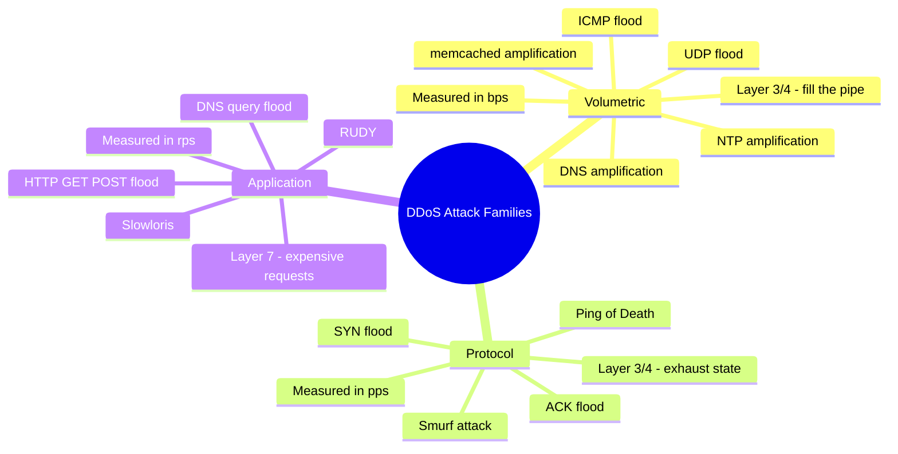
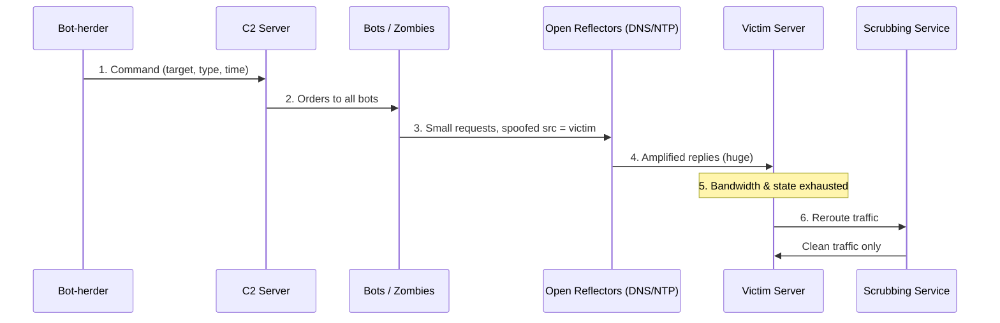
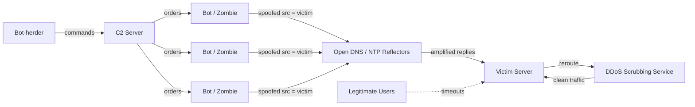
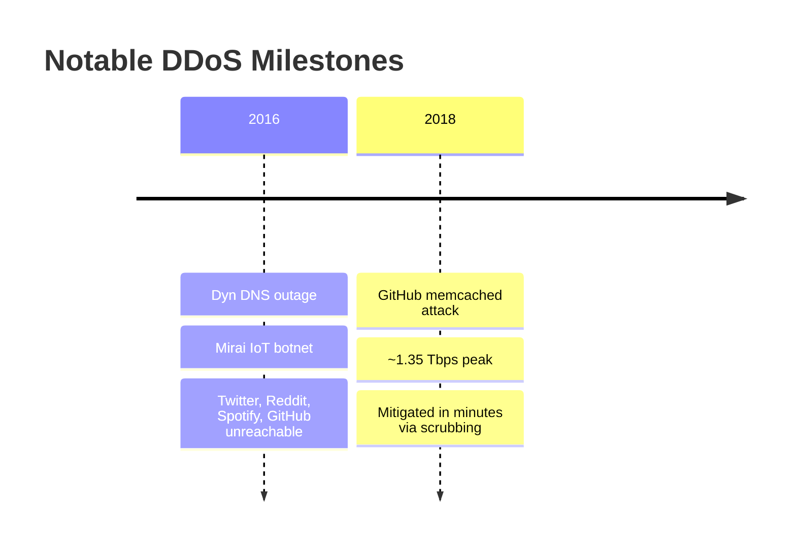
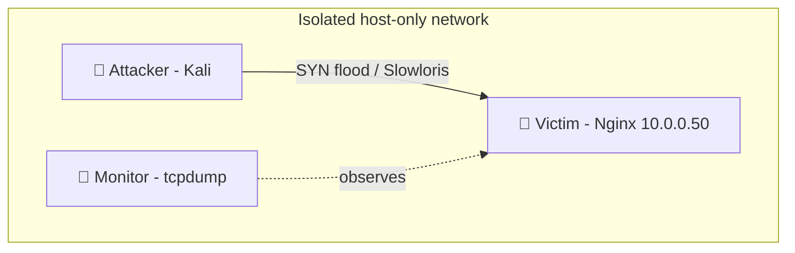
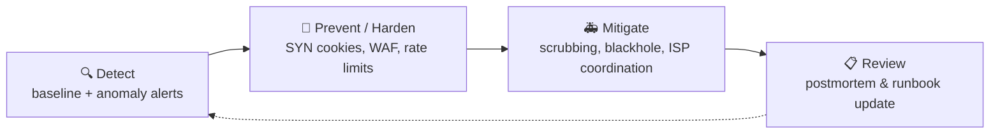

# Denial-of-Service (DoS & DDoS) 🚫🌐

> What you'll learn: how attackers knock services offline by exhausting resources, the main attack families and tools, a real-world case study, and how defenders detect and mitigate them.
> Prerequisites: basic TCP/IP networking (IP, ports, the TCP handshake), how HTTP requests work, and comfort with a Linux command line.

| Course | Course code | Module | Level |
|---|---|---|---|
| Professional Level 2 | SKL-CSP2-711 | Module 02 — Denial-of-Service | level2 |

---

## 1. In Plain English ☕

Picture a coffee shop with one barista. Normally customers walk in, order, and leave happy. Now 5,000 people show up at once — some block the doorway, some order absurdly complicated drinks, and some shout fake orders the barista half-prepares then abandons. Real customers can't get in or get served, and give up. The shop isn't *broken* — it's **overwhelmed**.

That is a **Denial-of-Service (DoS)** attack: making a system unavailable to legitimate users by exhausting a limited resource (bandwidth, connections, CPU, or memory).

A **Distributed** Denial-of-Service (**DDoS**) attack is the same idea, but the crowd is thousands of machines worldwide — computers, phones, or smart devices that have been secretly hijacked. Because the flood comes from everywhere at once, you can't just block one address and be done.

> 🔑 **Key idea:** DoS targets **availability**, one of the three pillars of security (the **CIA triad** — Confidentiality, Integrity, Availability). A service that is down can't sell, serve, or protect anything.

Why care as a beginner? DDoS is one of the **cheapest** attacks to launch (you can rent firepower online) and one of the **hardest** to fully prevent. Whether you defend a website, run a game server, or build cloud apps, you will eventually meet this threat.

> 🖼️ *Suggested image: side-by-side diagram of "one attacker (DoS)" vs "many hijacked devices (DDoS)" flooding a single server.*

---

## 2. Core Concepts 🧠

### 2.1 Availability and resource exhaustion

Every online service has finite resources. A DoS attack picks one and pushes past the limit. The goal is not to steal data — it's to *deny availability*.

| Resource | What it is | Runs out when... |
|---|---|---|
| 🌊 **Bandwidth** | Data the network link can carry | Traffic saturates the pipe |
| 🔗 **Connection state** | Simultaneous connections the OS tracks | Connection table fills |
| ⚙️ **CPU / memory** | Compute the server can do | Requests are too expensive |
| 🧵 **Application limits** | DB connections, worker threads, API quotas | All workers are tied up |

### 2.2 DoS vs DDoS

| | 🎯 **DoS** | 🌐 **DDoS** |
|---|---|---|
| **Sources** | Single origin | Many sources at once (distributed) |
| **Traceability** | Easier to trace and block | Looks like the whole internet |
| **Mitigation** | Block one address | Blocking one address barely dents it |

### 2.3 The three attack categories

Industry literature (AWS/Cloudflare/OWASP) groups DDoS into three families by which network layer they abuse.



**🌊 Volumetric attacks (Layer 3/4 — "fill the pipe").** Send so much raw traffic that the victim's link saturates, like flooding a highway until nothing moves. Measured in **bits per second (bps)**. Common technique: **amplification/reflection** — send a small spoofed request to a third-party server (DNS, NTP, memcached) that replies with a much larger response aimed at the victim. The request-to-response size ratio is the **amplification factor** (memcached has reached tens of thousands).
*Examples:* UDP flood, ICMP (ping) flood, DNS/NTP/memcached amplification.

**🔗 Protocol attacks (Layer 3/4 — "exhaust the state tables").** Abuse weaknesses in how protocols track connections rather than brute bandwidth. Measured in **packets per second (pps)**. The classic **SYN flood**: TCP starts every connection with a three-way handshake (SYN → SYN-ACK → ACK). The attacker sends many SYNs but never completes the handshake, leaving thousands of **half-open connections** until the connection table fills.
*Examples:* SYN flood, ACK flood, Ping of Death, Smurf attack, fragmented-packet attacks.

**⚙️ Application-layer attacks (Layer 7 — "make every request expensive").** Target the application (HTTP, DNS) with requests that *look* legitimate but are deliberately costly to answer. Measured in **requests per second (rps)**. Because each request is valid, they are stealthy and need far less traffic. Classic: an **HTTP flood** on a search or login endpoint that triggers heavy database work. "Low and slow" variants (Slowloris, RUDY) hold many connections open by sending data one byte at a time, tying up worker threads.
*Examples:* HTTP GET/POST flood, Slowloris, RUDY (R-U-Dead-Yet), DNS query flood.

| Family | Layer | Metric | Defends by |
|---|---|---|---|
| 🌊 Volumetric | 3/4 | bps | Scrubbing, anycast, upstream filtering |
| 🔗 Protocol | 3/4 | pps | SYN cookies, rate limits, firewalls |
| ⚙️ Application | 7 | rps | WAF, connection caps, bot challenges |

### 2.4 Botnets 🤖

A **botnet** is a network of internet-connected devices infected with malware and remotely controlled by an attacker (the **bot-herder**) through **Command-and-Control (C2)** infrastructure. Each infected device is a **bot** or **zombie**, and they supply the "distributed" in DDoS.

Modern botnets recruit poorly-secured **IoT** (Internet of Things) devices — routers, cameras, DVRs — that ship with default passwords. The infamous **Mirai** botnet did exactly this. C2 can be **centralized** (one server) or **peer-to-peer** (resilient, no single point to take down).

### 2.5 Reflection vs amplification

- **Reflection** 🪞 — the attacker spoofs the victim's IP as the *source*, so a third-party server's reply is bounced ("reflected") at the victim, hiding the real attacker.
- **Amplification** 📢 — choosing a protocol where the reply is much larger than the request, multiplying the attacker's effort.

> 💡 **Tip:** Most big volumetric attacks combine **both** — spoofed requests to open DNS/NTP/memcached servers that reflect *huge* replies at the target.

---

## 3. How It Works (Step by Step) 🔄

The lifecycle of a typical reflected/amplified DDoS driven by a botnet:

1. **Recruitment** — Scan the internet for vulnerable devices (e.g., IoT gadgets with default credentials), infect with malware, enroll into a botnet. Each device phones home to the C2 server.
2. **Command** — Through C2, the bot-herder tells all bots a target IP, an attack type, and a start time.
3. **Spoofing** — Bots craft small requests to public **reflectors** (open DNS/NTP servers) but forge the *source address* to be the victim's IP.
4. **Amplification & reflection** — Each reflector sends a much larger reply to the victim. Thousands of bots × thousands of reflectors = a torrent.
5. **Saturation** — The victim's bandwidth, connection tables, or workers are exhausted. Legitimate users get timeouts and errors.
6. **Detection & mitigation** — Monitoring flags the anomaly; traffic is rerouted through a **scrubbing** service that filters malicious packets and forwards clean traffic.



And the topology view of the same flood:



---

## 4. Real-World Examples 📰



**🌐 Dyn DNS outage (October 2016).** The **Mirai** botnet, built largely from compromised IoT devices, launched a massive DDoS against Dyn, a major managed-DNS provider. Because so many popular sites relied on Dyn to resolve their domain names, attacking the DNS provider indirectly cut off access to Twitter, Reddit, Spotify, and GitHub for users across the US and Europe.
> 🔑 **Lesson:** Attacking shared infrastructure (DNS) has far broader impact than attacking one site.

**📢 GitHub memcached amplification (February 2018).** GitHub was hit by a volumetric attack peaking around **1.35 Tbps** — then among the largest recorded. Attackers abused thousands of exposed **memcached** servers (a caching system never meant to face the public internet) as reflectors for enormous amplification. GitHub stayed down only **minutes** because traffic was quickly rerouted to a DDoS mitigation provider for scrubbing.
> 🔑 **Lesson:** A tiny misconfiguration (memcached open to the internet) becomes a global weapon at scale, and pre-arranged scrubbing capacity is what saved the day.

**🐌 Slowloris-style application attacks.** Unlike the headline volumetric records, low-and-slow Layer 7 attacks have repeatedly taken down web servers using a single laptop and almost no bandwidth, simply by holding open all available worker connections.
> 🔑 **Lesson:** Bandwidth is not the only thing that runs out — connection slots and worker threads do too.

---

## 5. Tools of the Trade 🛠️

> ⚠️ **Warning:** All tools below are for use **only** against systems you own or are explicitly authorized to test.

| Tool | Side | Purpose | Use case |
|---|---|---|---|
| `hping3` | 🔴 Red | Packet crafter (TCP/UDP/ICMP) | Demonstrate SYN floods |
| `slowhttptest` | 🔴 Red | Layer-7 slow-connection tester | Slowloris/RUDY simulation |
| LOIC / HOIC | 🔴 Red | Historical stress tools | Study only (noisy, traceable) |
| `tcpdump` / Wireshark | 🔵 Blue | Packet capture & analysis | Observe and confirm attacks |

### 🔴 hping3
A packet crafter that generates custom TCP/UDP/ICMP packets — widely used to demonstrate SYN floods in a lab.
```bash
# Lab-only: SYN flood toward an authorized target on port 80,
# with random spoofed source IPs.
sudo hping3 -S -p 80 --flood --rand-source 10.0.0.50
```
`-S` sets the SYN flag, `-p 80` targets the web port, `--flood` sends as fast as possible, `--rand-source` randomizes source addresses to simulate a distributed origin.

### 🔴 slowhttptest
A Layer-7 tester for "low and slow" attacks (Slowloris/RUDY style) that measures how a web server copes with slow, drawn-out connections.
```bash
# Lab-only: open 1000 slow connections, sending headers very slowly.
slowhttptest -c 1000 -H -i 10 -r 200 -u http://10.0.0.50/ -x 24 -p 3
```
`-c 1000` opens 1000 connections, `-H` selects slow-headers (Slowloris) mode, `-i 10` sends data every 10 seconds, `-u` is the authorized target URL.

### 🔴 LOIC / HOIC (historical, study-only)
"Low/High Orbit Ion Cannon" — early stress-test tools notorious in hacktivist campaigns. Study them to understand attack history; they are noisy and trivially traced. No command is given here on purpose.

### 🔵 tcpdump / Wireshark (defender side)
Packet capture tools to *observe* an attack — counting SYNs without matching ACKs, spotting one-sided flows, or seeing reflected DNS/NTP replies.
```bash
# Capture and count incoming SYN-only packets on a server interface.
sudo tcpdump -ni eth0 'tcp[tcpflags] & tcp-syn != 0 and tcp[tcpflags] & tcp-ack == 0'
```
This filters for packets with the SYN flag set but the ACK flag clear — the signature of a half-open SYN flood.

> 🖼️ *Suggested image: Wireshark capture showing a wall of SYN packets with no matching SYN-ACK/ACK responses.*

---

## 6. Hands-On Lab (Authorized / Lab-Only) 🧪

> ⚠️ **Warning:** Perform this only on systems you own or are explicitly authorized to test. Never point these tools at the public internet.

**Goal:** Build a small isolated lab, launch a SYN flood and a Slowloris attack against your own web server, then *detect and mitigate* each from the blue-team side.

**Lab topology** — three VMs on an isolated host-only network (VirtualBox, VMware, or a cloud VPC with no internet egress and tight security groups):

| Role | OS / Tooling | IP |
|---|---|---|
| 🎯 **Victim** | Ubuntu running Nginx | `10.0.0.50` |
| 🔴 **Attacker** | Kali Linux + `hping3`, `slowhttptest` | — |
| 🔵 **Monitor** | `tcpdump` + a metrics tool (or the victim itself) | — |



**Step 1 — Baseline 📏.** From the victim, record normal behavior: `ss -s` (socket summary) and a `curl -w "%{time_total}\n" http://10.0.0.50/` timing. Compare against this later.

**Step 2 — Protocol attack 🔗.** From the attacker, run a SYN flood (see `hping3` above). On the victim, watch the half-open connections grow:
```bash
watch -n1 "ss -tan state syn-recv | wc -l"
```
This counts connections stuck in `SYN-RECV` — they should spike sharply.

**Step 3 — Detect 🔍.** On the monitor, run the SYN-only `tcpdump` filter from Section 5 and confirm a flood of SYNs with no matching ACKs and (if you used `--rand-source`) varied source IPs.

**Step 4 — Mitigate the protocol attack 🛡️.** On the victim, enable **SYN cookies**, a kernel technique that responds to handshakes without storing state until the handshake completes:
```bash
sudo sysctl -w net.ipv4.tcp_syncookies=1
```
Re-run Step 2 and confirm the `SYN-RECV` count no longer exhausts the table and the site stays reachable. Optionally add an `nftables`/`iptables` rate-limit rule on new SYNs.

**Step 5 — Application attack ⚙️.** Stop the flood. From the attacker, launch the Slowloris run (see `slowhttptest` above). On the victim, watch Nginx worker connections fill and `curl` start timing out.

**Step 6 — Mitigate Layer 7 🧵.** Tune Nginx: lower `client_header_timeout` and `client_body_timeout`, cap `limit_conn` per source IP, and enable `limit_req` rate limiting. Re-run Step 5 and confirm legitimate `curl` requests succeed while slow connections are dropped.

**Step 7 — Write it up 📝.** For each attack, note the symptom, the detection signal, the mitigation applied, and the before/after metrics. Adapt IPs, ports, and thresholds to your own lab — don't just copy values.

---

## 7. Countermeasures & Defenses 🛡️

Defense is layered across three phases: **detect**, **prevent/harden**, and **mitigate during an attack**.



**🔍 Detect**
- Baseline normal traffic so anomalies (sudden bps/pps/rps spikes, lopsided flows, geographic outliers) stand out.
- Use NetFlow/sFlow analysis, IDS/IPS signatures, and application logs (e.g., a surge of identical expensive requests).
- Alert on protocol signatures: many `SYN-RECV` sockets, one-sided TCP flows, unexpected DNS/NTP reply storms.

**🧱 Prevent / harden**
- Enable **SYN cookies** and tune kernel connection/backlog limits.
- Apply **rate limiting** and connection caps at the web/proxy layer (Nginx `limit_req`/`limit_conn`).
- Deploy a **Web Application Firewall (WAF)** to filter malicious Layer-7 requests; add bot challenges (CAPTCHA/JS challenge) for suspicious clients.
- Close/secure amplification vectors you operate: don't expose open DNS resolvers, NTP, or memcached; implement **BCP 38** anti-spoofing ingress filtering.
- Over-provision and use **anycast** so traffic spreads across many points of presence.

**🚑 Mitigate during an attack**
- Reroute traffic through a **scrubbing center** or cloud DDoS service that filters malicious packets and forwards clean traffic.
- Use **blackhole/sinkhole** routing as a last resort to drop traffic to a targeted IP and protect the rest of the network.
- Coordinate with your **ISP/upstream provider** to filter near the source, where there's more capacity.
- Follow an incident-response runbook: detect → classify → mitigate → communicate → review.

| Attack family | Primary defense | Backup defense |
|---|---|---|
| 🌊 Volumetric | Scrubbing service / anycast | ISP/upstream filtering, blackhole |
| 🔗 Protocol | SYN cookies, kernel tuning | Firewall rate limits |
| ⚙️ Application | WAF + bot challenge | `limit_req`/`limit_conn` caps |

---

## 8. Key Terms 📖

| Term | Meaning |
|---|---|
| **DoS** | Making a service unavailable by exhausting a limited resource, from a single source |
| **DDoS** | The same attack launched from many sources at once |
| **CIA triad** | Confidentiality, Integrity, Availability; DoS attacks the Availability pillar |
| **Volumetric attack** | Saturates bandwidth (bps); e.g., UDP/DNS amplification |
| **Protocol attack** | Exhausts connection state (pps); e.g., SYN flood |
| **Application-layer (L7) attack** | Costly but valid requests (rps); e.g., HTTP flood, Slowloris |
| **Botnet** | A network of malware-infected devices (bots/zombies) controlled by a bot-herder |
| **C2 (Command-and-Control)** | The infrastructure used to direct a botnet |
| **Reflection** | Bouncing replies off third-party servers by spoofing the victim's source IP |
| **Amplification** | Using protocols whose replies are far larger than requests; the ratio is the amplification factor |
| **SYN flood** | Sending many TCP SYNs without completing the handshake, leaving half-open connections |
| **SYN cookies** | A kernel defense that avoids storing state for incomplete handshakes |
| **Slowloris** | A low-and-slow L7 attack that holds connections open by sending data very slowly |
| **Scrubbing** | Filtering malicious traffic through a specialized service before passing clean traffic on |
| **Anycast** | Advertising one IP from many locations so traffic spreads across points of presence |
| **WAF** | Web Application Firewall — inspects and blocks malicious HTTP-layer requests |
| **BCP 38** | Best-practice ingress filtering that blocks spoofed source addresses |

---

## 9. Summary & Takeaways ✅

- DoS/DDoS attacks the **availability** pillar — making systems unusable rather than stealing data.
- DoS vs DDoS is **scale and distribution**: many sources are far harder to block.
- Three families: **volumetric** (fill the pipe), **protocol** (exhaust state), **application-layer** (make each request expensive).
- **Botnets** (often hijacked IoT devices) supply the distributed firepower, directed via **C2**.
- **Reflection + amplification** let small spoofed requests produce huge floods, as the 2018 memcached attack showed.
- Defense is layered: harden hosts (SYN cookies, rate limits), filter Layer 7 (WAF), close amplification vectors, and pre-arrange **scrubbing/anycast** capacity.
- Bandwidth isn't the only resource that runs out — connection slots and worker threads do too, which is why low-and-slow attacks work.
- Have an incident-response runbook ready *before* an attack; mitigation speed is what limited GitHub's downtime to minutes.

**📚 Further reading:** OWASP "Denial of Service" Cheat Sheet and Application DoS resources; NIST SP 800-61 (Computer Security Incident Handling Guide); MITRE ATT&CK techniques T1498 (Network Denial of Service) and T1499 (Endpoint Denial of Service); Cloudflare and AWS DDoS protection documentation; IETF BCP 38 (RFC 2827) on ingress filtering.
