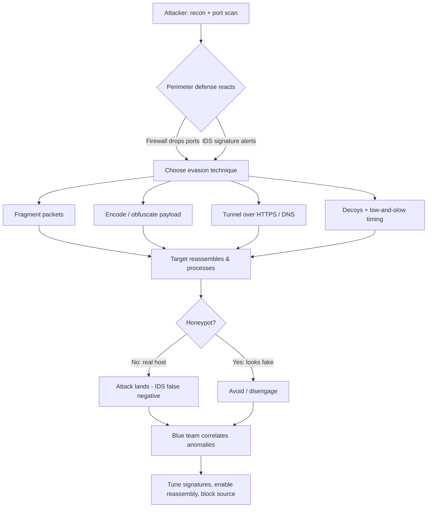

# Evading IDS, Firewalls & Honeypots

> What you'll learn: how intrusion detection systems, intrusion prevention systems, firewalls, and honeypots work — and how attackers attempt to slip past them, so you can defend better. Prerequisites: basic TCP/IP networking (IP addresses, ports, TCP/UDP, the three-way handshake), familiarity with `nmap` and packet captures, and comfort on a Linux command line.

| Course | Course code | Module | Level |
|--------|-------------|--------|-------|
| Skillogic CSPP — Professional Level 2 | SKL-CSP2-711 | Module 04: Evading IDS, Firewalls & Honeypots | level2 |

---

## 1. In Plain English

Imagine a guarded office building. At the front gate, a security guard checks IDs and decides who gets in — that's the **firewall**. Inside, CCTV cameras watch the hallways and raise an alarm if someone behaves suspiciously — that's the **Intrusion Detection System (IDS)**. If, instead of just alarming, a guard physically tackles the intruder and stops them mid-stride, that's an **Intrusion Prevention System (IPS)**. And sometimes the building leaves a fake unlocked office full of fake "secret documents" — a trap to see who pokes around so the security team can study them. That trap is a **honeypot**.

Attackers know all of these exist. So they try tricks: wearing a disguise the guard doesn't recognize, walking in during a shift change when the cameras blink, or splitting a forbidden item into pieces small enough that no single bag-check flags it. In network terms, these tricks are called **evasion** — making malicious traffic look normal, or breaking it into fragments so the watching systems fail to recognize the threat.

Why should a beginner care? Because understanding how attackers evade defenses is exactly what makes you good at building defenses. Every evasion technique has a matching detection technique. If you only know how to install a firewall but never learn how someone tunnels past it, you'll deploy a system that *looks* secure but quietly fails. This module teaches both sides — the trick and the counter-trick — always for authorized, lawful testing and learning.

By the end, you'll recognize the main perimeter defenses, understand the common ways they get bypassed, know the tools involved, and — most importantly — know how a defender detects and shuts those bypasses down.

---

## 2. Core Concepts

### Firewall

A **firewall** is a device or software that controls network traffic by enforcing a set of **rules** (an "access control list" or ACL). Each rule says something like "allow TCP traffic to port 443" or "deny all traffic from this IP range." Firewalls come in flavors:

- **Packet-filtering firewall**: looks at individual packets — source/destination IP, port, protocol — and allows or drops each one. Fast but "dumb"; it doesn't remember context.
- **Stateful inspection firewall**: remembers active connections (the "state"). It knows that a reply packet belongs to a connection you started, so it allows it without a separate rule. This is the common modern baseline.
- **Application-layer / proxy firewall**: understands specific protocols (HTTP, FTP) and can inspect the *content*, not just the headers. A **Web Application Firewall (WAF)** is a specialized version that inspects HTTP requests for attacks like SQL injection.
- **Next-Generation Firewall (NGFW)**: combines stateful filtering with deep packet inspection, application awareness, and often built-in IPS.

### IDS (Intrusion Detection System)

An **IDS** monitors traffic or system activity and **alerts** when it sees something suspicious. It does not block — it watches and reports. Two placements:

- **Network IDS (NIDS)**: watches network traffic, usually from a mirrored ("SPAN") port on a switch.
- **Host IDS (HIDS)**: runs on an individual machine, watching its files, logs, and processes.

How an IDS decides what is "suspicious" splits into two detection methods:

- **Signature-based (misuse) detection**: matches traffic against a database of known-bad patterns (signatures), like antivirus matching known malware. Accurate for known threats, blind to new ones.
- **Anomaly-based detection**: builds a model of "normal" behavior and flags deviations. Can catch novel attacks, but produces more **false positives** (alerts on harmless-but-unusual activity).

### IPS (Intrusion Prevention System)

An **IPS** is an IDS that can *act*. It sits **inline** (traffic flows through it) so it can drop malicious packets, reset connections, or block source IPs in real time. The trade-off: because it's inline, a misconfigured IPS can block legitimate traffic, and it adds latency.

### Honeypot

A **honeypot** is a decoy system that has no legitimate purpose. Because nobody should ever touch it, *any* interaction is by definition suspicious — which makes honeypots excellent, low-false-positive detectors and intelligence-gathering tools.

- **Low-interaction honeypot**: emulates a few services (just enough to look real). Safe and easy, but shallow — a careful attacker may notice it's fake.
- **High-interaction honeypot**: a real (often virtualized) system attackers can fully engage. Yields rich intelligence but is riskier and must be tightly contained.
- **Honeynet**: a whole network of honeypots designed to look like a real environment.

### Evasion

**Evasion** is any technique that makes malicious traffic evade recognition by these defenses. The core idea: defenses make assumptions about how traffic looks. Evasion violates those assumptions. Major families:

- **Fragmentation**: splitting a packet/payload into many small pieces so no single piece matches a signature; the target reassembles them, but the IDS may not (or may reassemble differently).
- **Encoding / obfuscation**: representing the same attack in an alternate form (URL-encoding, Unicode, case changes) that the target decodes but the signature doesn't match.
- **Encryption / tunneling**: hiding traffic inside an encrypted channel (HTTPS, SSH, DNS) so inspection devices can't read the payload.
- **Source manipulation**: spoofing source IPs, using decoys, or slowing the scan ("low and slow") to stay under detection thresholds.
- **Insertion & evasion (the classic Ptacek-Newsham model)**: feeding the IDS packets the *end host* will reject ("insertion"), or sending packets the IDS rejects but the *host* accepts ("evasion"), so the IDS reconstructs a different stream than the target sees.

### False Positives vs False Negatives

- **False positive**: an alert fires on harmless traffic. Too many of these cause "alert fatigue."
- **False negative**: a real attack passes unnoticed. This is what evasion aims to produce.

---

## 3. How It Works (Step by Step)

Here is a typical authorized-test flow where an attacker probes a target, encounters perimeter defenses, and adapts — while a defender watches.

1. **Reconnaissance.** The tester maps the target with a port scan and tries to fingerprint defenses (firewall behavior, IDS presence).
2. **Hit a wall.** A normal scan triggers alerts or gets dropped — the firewall blocks certain ports; the IDS logs the scan signature.
3. **Adapt with evasion.** The tester applies techniques: fragment the scan packets, randomize timing, decoy with spoofed source IPs, or tunnel the payload over an allowed protocol like HTTPS or DNS.
4. **Decode at the target.** The target host reassembles fragments / decodes the obfuscated payload and processes the request — the attack lands even though the IDS signature didn't match.
5. **Avoid the trap.** The tester tries to spot honeypots (unrealistic services, default banners, no real user data) and steers clear so as not to waste effort or reveal techniques.
6. **Defender detects.** The blue team correlates anomalies — fragmented streams, unusual DNS volume, traffic to a decoy host — and responds: tune signatures, enable reassembly, alert on the honeypot touch.



---

## 4. Real-World Examples

**The Ptacek & Newsham insertion/evasion research (1998).** Security researchers Thomas Ptacek and Timothy Newsham published a landmark paper, *"Insertion, Evasion, and Denial of Service: Eluding Network Intrusion Detection."* They showed that because an IDS and the end host can interpret the *same* packets differently (due to differing TTL handling, fragment reassembly, and TCP options), an attacker can craft streams where the IDS sees benign content while the target sees the attack. This paper still shapes how detection engines and tools like Snort handle stream reassembly today.

**WAF bypass via encoding.** Web Application Firewalls maintain signatures for attacks like SQL injection and cross-site scripting. Attackers have repeatedly bypassed naive WAFs by encoding the payload — using URL-encoding, double-encoding, mixed case (`SeLeCt`), inline comments (`SEL/**/ECT`), or alternate Unicode representations — so the literal signature doesn't match, yet the backend database or browser decodes and executes it. This is why modern WAFs normalize (decode) input before matching, and why defense-in-depth (parameterized queries, output encoding) matters more than the WAF alone.

**DNS tunneling for data exfiltration.** Because DNS (port 53) is almost always allowed outbound, attackers have used it as a covert channel: encoding stolen data into DNS query names sent to an attacker-controlled domain. Malware families and red teams alike have used DNS tunneling to evade firewalls that scrutinize HTTP but trust DNS. Defenders counter by monitoring DNS query volume, entropy, and unusually long subdomain labels.

---

## 5. Tools of the Trade

> All tools below are for authorized testing only.

### Nmap — network scanning with evasion options

Nmap supports fragmentation, decoys, timing control, and source spoofing.

```bash
# Fragment probe packets, use 5 decoy source IPs (ME = your real position),
# scan a target with slow timing to stay under detection thresholds
nmap -f -D RND:5 -T1 -p 80,443 192.0.2.10
```

`-f` fragments packets, `-D RND:5` mixes your scan with five random decoy source addresses so the IDS can't easily tell which is the real attacker, and `-T1` ("sneaky" timing) slows the scan to avoid rate-based alerts.

### hping3 — custom packet crafting

Lets you build packets field by field to probe firewall rules and spoof sources.

```bash
# Send TCP SYN packets to port 443 with a spoofed source IP, for firewall rule testing
hping3 -S -p 443 -a 198.51.100.5 192.0.2.10
```

`-S` sets the SYN flag, `-p 443` targets HTTPS, and `-a` spoofs the source address — useful for observing how a firewall responds without revealing your own host.

### Snort / Suricata — IDS/IPS engines (defender + tester)

Used to detect intrusions and, in IPS mode, block them. Testers run them to verify whether their evasion is detected.

```bash
# Run Suricata against a captured pcap to see which rules fire
suricata -r capture.pcap -S /etc/suricata/rules/local.rules -l ./logs/
```

This replays a packet capture through Suricata's signatures and writes alerts to `./logs/`, letting you confirm whether a given technique was caught.

### iodine / dnscat2 — DNS tunneling

Demonstrate covert channels over DNS to test whether a firewall and DNS monitoring catch tunneling.

```bash
# (Lab only) Establish a DNS tunnel to an authorized server you control
iodine -f tunnel.lab.example t1.lab.example
```

This builds an IP-over-DNS tunnel to a server you own, simulating exfiltration so you can validate detection.

### Nikto / sqlmap with tamper scripts — WAF evasion testing

`sqlmap` includes "tamper" scripts that encode payloads to test WAF robustness.

```bash
# Test a parameter while applying space-to-comment and case-randomization tampers
sqlmap -u "https://lab.example/item?id=1" --tamper=space2comment,randomcase --batch
```

The tamper scripts transform the injection payload to evade simple signature matching, helping you find gaps in WAF normalization. Use only against applications you are authorized to test.

---

## 6. Hands-On Lab (Authorized / Lab-Only)

> Reminder: perform every step below ONLY on systems you own or are explicitly authorized to test. Never run these against systems you do not control.

**Goal:** build a small lab, launch an evasive scan past a firewall and IDS, then switch to the defender seat and prove you can detect it.

**Lab build (multi-VM or cloud sandbox).** Stand up three machines on an isolated host-only / private network (e.g., VirtualBox host-only network, or a locked-down cloud VPC with no internet egress):

- **VM-A (Attacker):** Kali Linux or any Linux with `nmap`, `hping3`, `sqlmap`.
- **VM-B (Sensor/Gateway):** Linux running `iptables`/`nftables` as a firewall plus **Suricata** in IDS mode on a mirrored interface.
- **VM-C (Target):** a vulnerable web app (e.g., DVWA or a deliberately weak app you deploy) and a low-interaction honeypot service such as a fake SSH banner on an unused port.

**Steps:**

1. **Baseline scan.** From VM-A, run a plain `nmap -sS -p- VM-C`. On VM-B, watch Suricata alerts — confirm the scan is detected and logged.
2. **Apply evasion.** Re-run the scan with fragmentation, decoys, and slow timing (adapt the Nmap command from Section 5). Compare Suricata's alerts: did fewer fire? Which technique reduced detection?
3. **Tunnel test.** Configure a DNS tunnel from VM-A to an authorized endpoint you control (or simulate it locally). Observe whether the firewall on VM-B allows it and whether your DNS monitoring notices the volume/entropy.
4. **WAF/encoding test.** Deploy a simple regex-based filter (or ModSecurity) in front of VM-C's web app, then use `sqlmap` tamper scripts to attempt a bypass. Note which encodings slip past and which the WAF normalizes.
5. **Honeypot detection.** From VM-A, interact with VM-C's fake SSH service. Look for tell-tale signs of a honeypot (default/unusual banner, no real shell, identical responses). Reason about how you'd avoid it.
6. **Validate the defense.** Now switch to defender. On VM-B: enable Suricata's **stream/IP defragmentation and reassembly**, add a rule that alerts on *any* connection to the honeypot port, and add DNS-anomaly logging. Re-run steps 2–5 and confirm each evasion now produces an alert. Document the before/after detection rate.

The learning outcome is the *delta*: how detection improves once you turn on reassembly, normalization, and decoy/honeypot alerting. Adapt the exact commands, ports, and rule syntax to your environment.

---

## 7. Countermeasures & Defenses

**Against IDS evasion (fragmentation / obfuscation):**
- Enable full **packet and stream reassembly** on the IDS/IPS so it sees the same data the host does.
- Normalize traffic before matching: URL-decode, Unicode-normalize, and canonicalize HTTP requests (use a normalizing engine like Suricata or ModSecurity).
- Combine **signature** detection with **anomaly/behavioral** detection so novel and obfuscated attacks still raise flags.
- Keep signatures and rule sets continuously updated.

**Against firewall evasion (tunneling / spoofing):**
- Use **stateful** and **application-aware (NGFW)** firewalls; default-deny outbound, allow only what's needed.
- Apply **egress filtering** — restrict and inspect outbound DNS, ICMP, and unusual ports often abused for tunneling.
- Monitor DNS for high query volume, long/high-entropy subdomains, and queries to rare domains.
- Apply **anti-spoofing** (RFC 2827/BCP 38 ingress filtering) to drop packets with implausible source addresses.
- Decrypt-and-inspect (TLS inspection) where legally and operationally appropriate, so encrypted channels aren't a blind spot.

**Against honeypot-aware attackers / using honeypots well:**
- Make honeypots realistic (high-interaction where the risk is acceptable) so they're harder to fingerprint.
- Alert on *any* interaction with a honeypot — there should be no legitimate traffic to it.
- Strictly contain honeypots (no outbound access to production or the internet) so attackers can't pivot from them.

**General blue-team hygiene:**
- Defense in depth: never rely on one control. Pair the WAF with parameterized queries; pair the firewall with host hardening.
- Centralize logs in a **SIEM** and **correlate** weak signals (a slow scan + a decoy host touch + odd DNS) that individually look benign.
- Tune to reduce false positives so real alerts aren't lost in noise.
- Regularly run authorized red-team/pentest exercises to validate detections.

---

## 8. Key Terms

- **Firewall** — a control that allows or denies traffic based on rules (IP, port, protocol, or application).
- **Stateful inspection** — firewall capability that tracks active connections so return traffic is allowed without separate rules.
- **IDS** — Intrusion Detection System; monitors and alerts on suspicious activity but does not block.
- **IPS** — Intrusion Prevention System; an inline IDS that can actively drop or block malicious traffic.
- **Signature-based detection** — matching traffic against a database of known-bad patterns.
- **Anomaly-based detection** — flagging deviations from a learned model of normal behavior.
- **Honeypot** — a decoy system with no legitimate use, deployed to detect and study attackers.
- **Honeynet** — a network of honeypots simulating a real environment.
- **Evasion** — techniques that make malicious traffic avoid recognition by defenses.
- **Fragmentation** — splitting traffic into small pieces to defeat signature matching.
- **Insertion (IDS)** — feeding the IDS packets the end host will discard, so the IDS reconstructs a different stream.
- **Tunneling** — hiding traffic inside an allowed protocol (e.g., DNS or HTTPS) to bypass inspection.
- **Egress filtering** — restricting and inspecting outbound traffic.
- **False positive / false negative** — an alert on benign traffic / a missed real attack.
- **WAF** — Web Application Firewall; inspects HTTP traffic for web attacks.
- **SIEM** — Security Information and Event Management; centralizes and correlates security logs.

---

## 9. Summary & Takeaways

- Firewalls filter, IDS alerts, IPS blocks, and honeypots trap — together they form the network perimeter, and each defends a different layer.
- Detection methods split into **signature-based** (accurate for known threats, blind to new) and **anomaly-based** (catches novelty but noisier); strong defenses use both.
- Evasion exploits the gap between what a defense *assumes* traffic looks like and what the target host actually processes — via fragmentation, encoding, tunneling, spoofing, and timing.
- The classic insertion/evasion problem means an IDS must reassemble and normalize traffic exactly as the end host would, or it will miss attacks.
- Every evasion technique has a matching countermeasure: reassembly, normalization, egress filtering, anti-spoofing, and honeypot interaction alerts.
- Honeypots are powerful, low-false-positive detectors — but only when realistic and tightly contained.
- Defense in depth and SIEM-based correlation beat any single control; correlate weak signals to catch "low and slow" evasion.
- All offensive techniques here are for authorized, lawful testing and education only — the point is to build defenses you've actually proven.

**Further reading:** Ptacek & Newsham, *"Insertion, Evasion, and Denial of Service: Eluding Network Intrusion Detection"* (1998); NIST SP 800-94, *Guide to Intrusion Detection and Prevention Systems (IDPS)*; MITRE ATT&CK tactic **Defense Evasion (TA0005)** and technique **Protocol Tunneling (T1572)**; OWASP guidance on WAF evasion and SQL injection prevention; Suricata and Snort official documentation.
