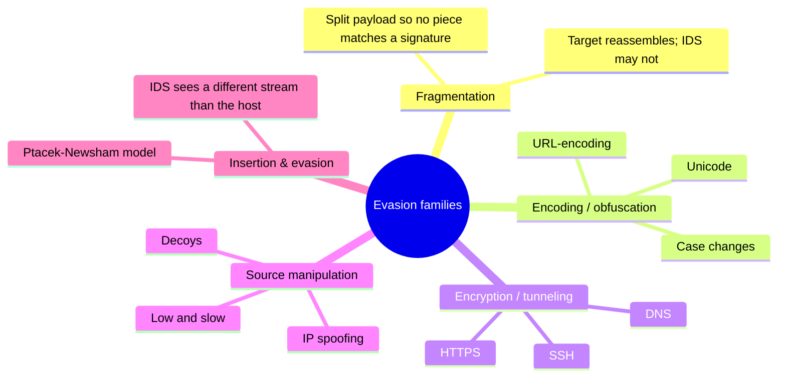
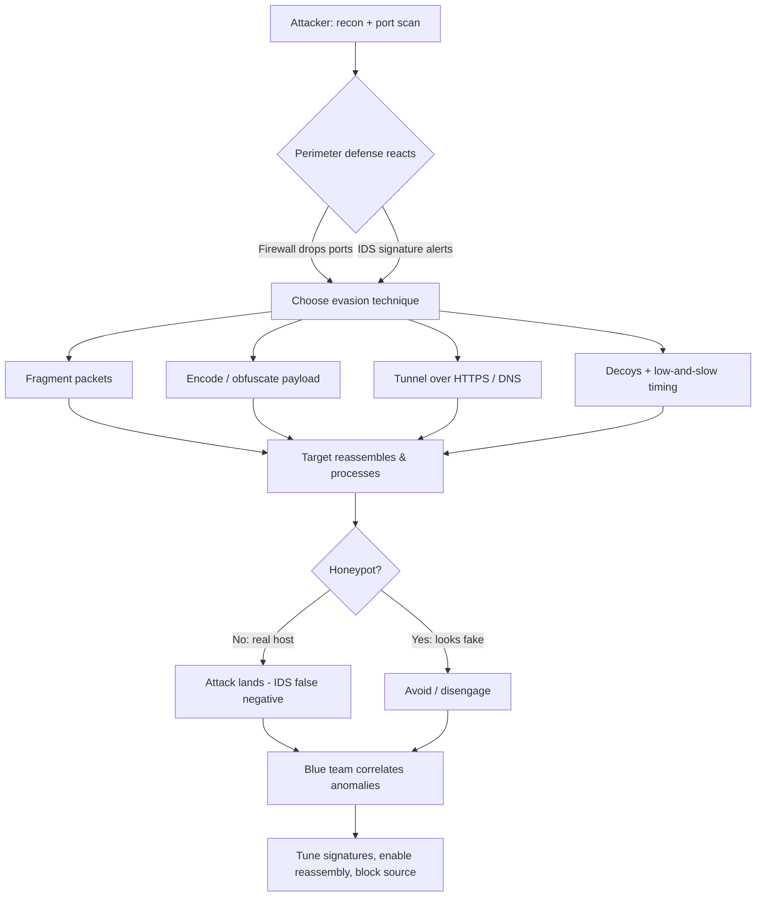
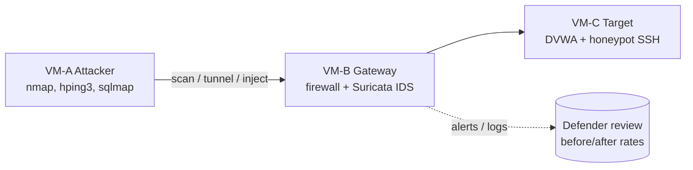
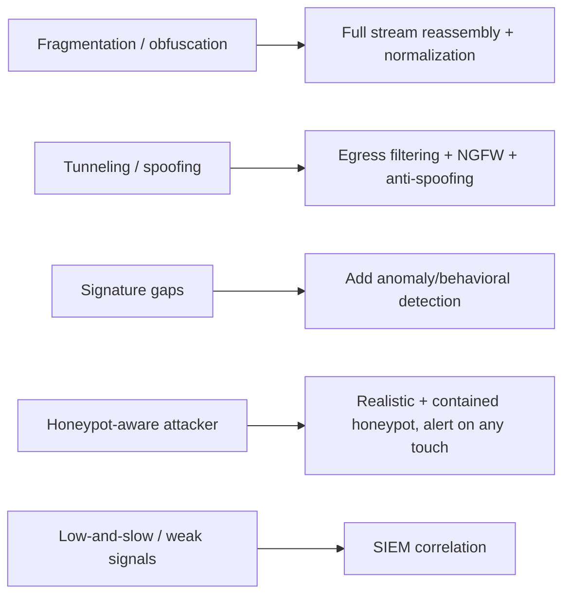

# Evading IDS, Firewalls & Honeypots

> What you'll learn: how intrusion detection systems, intrusion prevention systems, firewalls, and honeypots work — and how attackers try to slip past them, so you can defend better. Prerequisites: basic TCP/IP networking (IP addresses, ports, TCP/UDP, the three-way handshake), familiarity with `nmap` and packet captures, and comfort on a Linux command line.

| Course | Course code | Module | Level |
|--------|-------------|--------|-------|
| Skillogic CSPP — Professional Level 2 | SKL-CSP2-711 | Module 04: Evading IDS, Firewalls & Honeypots | level2 |

---

## 1. In Plain English

Picture a guarded office building. Each defense maps to a role:

| 🏢 Building role | 🛡️ Network equivalent | What it does |
|------------------|-----------------------|--------------|
| Guard checking IDs at the gate | **Firewall** | Decides who gets in, by rule |
| CCTV that raises an alarm | **IDS** (Intrusion Detection System) | Watches and reports, doesn't stop |
| Guard who tackles the intruder | **IPS** (Intrusion Prevention System) | Blocks the threat in real time |
| Fake unlocked office full of fake "secrets" | **Honeypot** | A trap to lure and study attackers |

Attackers know all of these exist, so they use tricks: a disguise the guard doesn't recognize, walking in during a shift change, or splitting a forbidden item into pieces small enough that no single bag-check flags it. In network terms these tricks are **evasion** — making malicious traffic look normal, or breaking it into fragments so the watching systems fail to recognize the threat.

> 🔑 **Key idea:** Understanding how attackers evade defenses is exactly what makes you good at building them. Every evasion technique has a matching detection technique. Learn a firewall but never learn how someone tunnels past it, and you'll deploy a system that *looks* secure but quietly fails.

This module teaches both sides — the trick and the counter-trick — always for authorized, lawful testing. By the end you'll recognize the main perimeter defenses, the common ways they get bypassed, the tools involved, and how a defender shuts those bypasses down.

> 🖼️ *Suggested image: a labeled diagram of a network perimeter showing firewall, IDS sensor on a SPAN port, inline IPS, and a honeypot in a DMZ.*

---

## 2. Core Concepts

### 🧱 Firewall

A **firewall** controls network traffic by enforcing **rules** (an access control list / ACL). Each rule says something like "allow TCP to port 443" or "deny all traffic from this IP range." Types:

| Firewall type | Inspects | Strength | Weakness |
|---------------|----------|----------|----------|
| **Packet-filtering** | IP, port, protocol per packet | Fast | "Dumb" — no memory of context |
| **Stateful inspection** | Active connection state | Allows valid replies automatically; modern baseline | Header-level only |
| **Application-layer / proxy** | Protocol *content* (HTTP, FTP) | Sees actual payloads | Slower, protocol-specific |
| **WAF** (Web App Firewall) | HTTP requests | Catches SQLi, XSS | Web-only |
| **NGFW** (Next-Gen) | Stateful + DPI + app awareness + IPS | All-in-one | Cost, complexity |

### 👁️ IDS (Intrusion Detection System)

An **IDS** monitors traffic or system activity and **alerts** on something suspicious. It does not block — it watches and reports.

- **Network IDS (NIDS):** watches network traffic, usually from a mirrored ("SPAN") port on a switch.
- **Host IDS (HIDS):** runs on one machine, watching its files, logs, and processes.

How an IDS decides what is "suspicious" splits into two detection methods:

| Method | How it works | Catches | Misses / cost |
|--------|--------------|---------|---------------|
| **Signature-based** (misuse) | Matches known-bad patterns, like antivirus | Known threats, accurately | Blind to novel attacks |
| **Anomaly-based** | Models "normal," flags deviations | Novel attacks | More **false positives** |

### 🚫 IPS (Intrusion Prevention System)

An **IPS** is an IDS that can *act*. It sits **inline** (traffic flows through it) so it can drop malicious packets, reset connections, or block source IPs in real time.

> ⚠️ **Warning:** Because it's inline, a misconfigured IPS can block legitimate traffic and adds latency. IDS observes off to the side; IPS is in the path.

### 🍯 Honeypot

A **honeypot** is a decoy system with no legitimate purpose. Because nobody should ever touch it, *any* interaction is suspicious by definition — making honeypots excellent, low-false-positive detectors and intelligence tools.

| Type | What it is | Pro | Con |
|------|-----------|-----|-----|
| **Low-interaction** | Emulates a few services | Safe, easy | Shallow; careful attacker may spot it |
| **High-interaction** | A real (often virtualized) system | Rich intelligence | Riskier; must be tightly contained |
| **Honeynet** | A whole network of honeypots | Looks like a real environment | Most operational effort |

### 🎭 Evasion

**Evasion** is any technique that makes malicious traffic avoid recognition. The core idea: defenses make assumptions about how traffic looks; evasion violates them.



- **Fragmentation:** split a packet/payload into small pieces so no single piece matches a signature; the target reassembles them, but the IDS may not (or may reassemble differently).
- **Encoding / obfuscation:** represent the same attack in an alternate form the target decodes but the signature doesn't match.
- **Encryption / tunneling:** hide traffic inside an encrypted channel (HTTPS, SSH, DNS) so inspectors can't read the payload.
- **Source manipulation:** spoof source IPs, use decoys, or slow the scan ("low and slow") to stay under detection thresholds.
- **Insertion & evasion (the classic Ptacek-Newsham model):** feed the IDS packets the *end host* will reject ("insertion"), or send packets the IDS rejects but the *host* accepts ("evasion"), so the IDS reconstructs a different stream than the target sees.

### ⚖️ False Positives vs False Negatives

| Term | Meaning | Consequence |
|------|---------|-------------|
| **False positive** | Alert fires on harmless traffic | "Alert fatigue" |
| **False negative** | Real attack passes unnoticed | What evasion aims to produce |

---

## 3. How It Works (Step by Step)

A typical authorized-test flow where an attacker probes a target, hits perimeter defenses, and adapts — while a defender watches:

1. **Reconnaissance** — map the target with a port scan; fingerprint defenses (firewall behavior, IDS presence).
2. **Hit a wall** — a normal scan triggers alerts or gets dropped; the firewall blocks ports, the IDS logs the scan signature.
3. **Adapt with evasion** — fragment scan packets, randomize timing, decoy with spoofed IPs, or tunnel over an allowed protocol (HTTPS, DNS).
4. **Decode at the target** — the host reassembles fragments / decodes the obfuscated payload and processes it; the attack lands even though the IDS signature didn't match.
5. **Avoid the trap** — spot honeypots (unrealistic services, default banners, no real data) and steer clear.
6. **Defender detects** — the blue team correlates anomalies (fragmented streams, unusual DNS volume, traffic to a decoy host) and responds: tune signatures, enable reassembly, alert on the honeypot touch.



The **insertion/evasion** mismatch is best seen as a sequence — the IDS and the host process the *same* wire bytes differently:

```mermaid
sequenceDiagram
    participant A as Attacker
    participant I as IDS sensor
    participant H as Target host
    A->>I: Packet (low TTL, expires before host)
    A->>H: Packet never arrives
    Note over I,H: INSERTION — IDS accepts, host never sees it
    A->>I: Overlapping fragment "benign"
    A->>H: Overlapping fragment "attack" (host keeps this copy)
    Note over I,H: EVASION — IDS reassembles benign, host runs attack
    H-->>A: Attack executes; IDS logged something harmless
```

---

## 4. Real-World Examples

**📜 Ptacek & Newsham insertion/evasion research (1998).** Thomas Ptacek and Timothy Newsham published the landmark paper *"Insertion, Evasion, and Denial of Service: Eluding Network Intrusion Detection."* They showed that an IDS and the end host can interpret the *same* packets differently — due to differing TTL handling, fragment reassembly, and TCP options — so an attacker can craft streams where the IDS sees benign content while the target sees the attack. The paper still shapes how detection engines and tools like Snort handle stream reassembly today.

**🌐 WAF bypass via encoding.** WAFs hold signatures for attacks like SQL injection and XSS. Attackers bypass naive WAFs by encoding the payload so the literal signature doesn't match, yet the backend decodes and executes it:

| Technique | Example | Why it works |
|-----------|---------|--------------|
| URL / double encoding | `%2553ELECT` | WAF decodes once, app decodes again |
| Mixed case | `SeLeCt` | Case-sensitive signature misses it |
| Inline comments | `SEL/**/ECT` | Comment stripped before SQL runs |
| Alternate Unicode | full-width chars | Normalized only at the backend |

This is why modern WAFs **normalize (decode) input before matching**, and why defense-in-depth (parameterized queries, output encoding) matters more than the WAF alone.

**📡 DNS tunneling for data exfiltration.** Because DNS (port 53) is almost always allowed outbound, attackers use it as a covert channel: encoding stolen data into DNS query names sent to an attacker-controlled domain. Malware families and red teams alike use DNS tunneling to evade firewalls that scrutinize HTTP but trust DNS. Defenders counter by monitoring DNS query volume, entropy, and unusually long subdomain labels.

> 🖼️ *Suggested image: a screenshot of Wireshark showing abnormally long, high-entropy DNS query labels indicative of tunneling.*

---

## 5. Tools of the Trade

> ⚠️ **Warning:** All tools below are for authorized testing only.

| Tool | Side | Primary use |
|------|------|-------------|
| **nmap** | Red | Scanning with fragmentation, decoys, timing, spoofing |
| **hping3** | Red | Custom packet crafting, firewall rule probing |
| **Snort / Suricata** | Blue + test | IDS/IPS detection; verify whether evasion is caught |
| **iodine / dnscat2** | Red (lab) | DNS tunneling / covert channels |
| **sqlmap / Nikto** | Red | WAF evasion via tamper/encoding scripts |

### Nmap — network scanning with evasion options

Nmap supports fragmentation, decoys, timing control, and source spoofing.

```bash
# Fragment probe packets, use 5 decoy source IPs (ME = your real position),
# scan a target with slow timing to stay under detection thresholds
nmap -f -D RND:5 -T1 -p 80,443 192.0.2.10
```

`-f` fragments packets, `-D RND:5` mixes your scan with five random decoy source addresses so the IDS can't easily tell which is the real attacker, and `-T1` ("sneaky" timing) slows the scan to avoid rate-based alerts.

### hping3 — custom packet crafting

Builds packets field by field to probe firewall rules and spoof sources.

```bash
# Send TCP SYN packets to port 443 with a spoofed source IP, for firewall rule testing
hping3 -S -p 443 -a 198.51.100.5 192.0.2.10
```

`-S` sets the SYN flag, `-p 443` targets HTTPS, and `-a` spoofs the source address — useful for observing how a firewall responds without revealing your own host.

### Snort / Suricata — IDS/IPS engines (defender + tester)

Detect intrusions and, in IPS mode, block them. Testers run them to verify whether their evasion is detected.

```bash
# Run Suricata against a captured pcap to see which rules fire
suricata -r capture.pcap -S /etc/suricata/rules/local.rules -l ./logs/
```

This replays a packet capture through Suricata's signatures and writes alerts to `./logs/`, confirming whether a technique was caught.

### iodine / dnscat2 — DNS tunneling

Demonstrate covert channels over DNS to test whether a firewall and DNS monitoring catch tunneling.

```bash
# (Lab only) Establish a DNS tunnel to an authorized server you control
iodine -f tunnel.lab.example t1.lab.example
```

This builds an IP-over-DNS tunnel to a server you own, simulating exfiltration so you can validate detection.

### Nikto / sqlmap with tamper scripts — WAF evasion testing

`sqlmap` includes "tamper" scripts that encode payloads to test WAF robustness.

```bash
# Test a parameter while applying space-to-comment and case-randomization tampers
sqlmap -u "https://lab.example/item?id=1" --tamper=space2comment,randomcase --batch
```

The tamper scripts transform the injection payload to evade simple signature matching, helping you find gaps in WAF normalization.

> 💡 **Tip:** Run your evasive traffic through your *own* Suricata/Snort first. If your IDS catches it, so might the target's — and you've just validated a detection rule for the blue team.

---

## 6. Hands-On Lab (Authorized / Lab-Only)

> ⚠️ **Warning:** Perform every step ONLY on systems you own or are explicitly authorized to test. Never run these against systems you do not control.

**Goal:** build a small lab, launch an evasive scan past a firewall and IDS, then switch to the defender seat and prove you can detect it.

**Lab build (multi-VM or cloud sandbox).** Stand up three machines on an isolated host-only / private network (VirtualBox host-only network, or a locked-down cloud VPC with no internet egress):

| VM | Role | Software |
|----|------|----------|
| **VM-A** | Attacker | Kali (or any Linux) with `nmap`, `hping3`, `sqlmap` |
| **VM-B** | Sensor / Gateway | `iptables`/`nftables` firewall + **Suricata** IDS on a mirrored interface |
| **VM-C** | Target | Vulnerable web app (e.g., DVWA) + low-interaction honeypot (fake SSH banner on an unused port) |



**Steps:**

1. **Baseline scan.** From VM-A, run `nmap -sS -p- VM-C`. On VM-B, watch Suricata alerts — confirm the scan is detected and logged.
2. **Apply evasion.** Re-run with fragmentation, decoys, and slow timing (adapt the Section 5 command). Compare alerts: did fewer fire? Which technique reduced detection?
3. **Tunnel test.** Configure a DNS tunnel from VM-A to an authorized endpoint you control (or simulate locally). Observe whether VM-B's firewall allows it and whether DNS monitoring notices the volume/entropy.
4. **WAF / encoding test.** Deploy a simple regex filter (or ModSecurity) in front of VM-C's web app, then use `sqlmap` tamper scripts to attempt a bypass. Note which encodings slip past and which the WAF normalizes.
5. **Honeypot detection.** From VM-A, interact with VM-C's fake SSH service. Look for tell-tale signs (default/unusual banner, no real shell, identical responses). Reason about how you'd avoid it.
6. **Validate the defense.** Switch to defender. On VM-B: enable Suricata's **stream/IP defragmentation and reassembly**, add a rule that alerts on *any* connection to the honeypot port, and add DNS-anomaly logging. Re-run steps 2–5 and confirm each evasion now produces an alert. Document the before/after detection rate.

> 🔑 **Key idea:** The learning outcome is the *delta* — how detection improves once you turn on reassembly, normalization, and decoy/honeypot alerting.

---

## 7. Countermeasures & Defenses

Every evasion family has a matching counter:



**🧩 Against IDS evasion (fragmentation / obfuscation):**
- Enable full **packet and stream reassembly** so the IDS sees the same data the host does.
- **Normalize** before matching: URL-decode, Unicode-normalize, canonicalize HTTP (Suricata, ModSecurity).
- Combine **signature** + **anomaly/behavioral** detection so novel/obfuscated attacks still flag.
- Keep signatures and rule sets continuously updated.

**🔥 Against firewall evasion (tunneling / spoofing):**
- Use **stateful** and **application-aware (NGFW)** firewalls; default-deny outbound, allow only what's needed.
- Apply **egress filtering** — restrict and inspect outbound DNS, ICMP, and unusual ports abused for tunneling.
- Monitor DNS for high query volume, long/high-entropy subdomains, and queries to rare domains.
- Apply **anti-spoofing** (RFC 2827 / BCP 38 ingress filtering) to drop implausible source addresses.
- **TLS inspection** where legally and operationally appropriate, so encrypted channels aren't a blind spot.

**🍯 Against honeypot-aware attackers / using honeypots well:**
- Make honeypots realistic (high-interaction where risk is acceptable) so they're harder to fingerprint.
- Alert on *any* interaction — there should be no legitimate traffic to it.
- Strictly contain them (no outbound access to production or the internet) so attackers can't pivot.

**🧰 General blue-team hygiene:**
- **Defense in depth:** never rely on one control. Pair the WAF with parameterized queries; the firewall with host hardening.
- Centralize logs in a **SIEM** and **correlate** weak signals (slow scan + decoy host touch + odd DNS) that individually look benign.
- Tune to reduce false positives so real alerts aren't lost in noise.
- Regularly run authorized red-team/pentest exercises to validate detections.

---

## 8. Key Terms

| Term | Definition |
|------|------------|
| **Firewall** | Control that allows/denies traffic by rules (IP, port, protocol, application). |
| **Stateful inspection** | Tracks active connections so return traffic is allowed without separate rules. |
| **IDS** | Intrusion Detection System; monitors and alerts, does not block. |
| **IPS** | Inline IDS that can actively drop or block malicious traffic. |
| **Signature-based detection** | Matching traffic against a database of known-bad patterns. |
| **Anomaly-based detection** | Flagging deviations from a learned model of normal behavior. |
| **Honeypot** | Decoy system with no legitimate use, deployed to detect and study attackers. |
| **Honeynet** | A network of honeypots simulating a real environment. |
| **Evasion** | Techniques that make malicious traffic avoid recognition. |
| **Fragmentation** | Splitting traffic into small pieces to defeat signature matching. |
| **Insertion (IDS)** | Feeding the IDS packets the host will discard, so it reconstructs a different stream. |
| **Tunneling** | Hiding traffic inside an allowed protocol (DNS, HTTPS) to bypass inspection. |
| **Egress filtering** | Restricting and inspecting outbound traffic. |
| **False positive / negative** | An alert on benign traffic / a missed real attack. |
| **WAF** | Web Application Firewall; inspects HTTP traffic for web attacks. |
| **SIEM** | Security Information and Event Management; centralizes and correlates logs. |

---

## 9. Summary & Takeaways

- 🧱 Firewalls filter, 👁️ IDS alerts, 🚫 IPS blocks, 🍯 honeypots trap — together they form the perimeter, each defending a different layer.
- Detection methods split into **signature-based** (accurate for known threats, blind to new) and **anomaly-based** (catches novelty but noisier); strong defenses use both.
- Evasion exploits the gap between what a defense *assumes* traffic looks like and what the host actually processes — via fragmentation, encoding, tunneling, spoofing, and timing.
- The classic insertion/evasion problem means an IDS must reassemble and normalize traffic *exactly* as the end host would, or it will miss attacks.
- Every evasion technique has a matching countermeasure: reassembly, normalization, egress filtering, anti-spoofing, and honeypot-interaction alerts.
- Honeypots are powerful, low-false-positive detectors — but only when realistic and tightly contained.
- Defense in depth and SIEM-based correlation beat any single control; correlate weak signals to catch "low and slow" evasion.
- All offensive techniques here are for authorized, lawful testing and education only — the point is to build defenses you've actually proven.

**Further reading:** Ptacek & Newsham, *"Insertion, Evasion, and Denial of Service: Eluding Network Intrusion Detection"* (1998); NIST SP 800-94, *Guide to Intrusion Detection and Prevention Systems (IDPS)*; MITRE ATT&CK tactic **Defense Evasion (TA0005)** and technique **Protocol Tunneling (T1572)**; OWASP guidance on WAF evasion and SQL injection prevention; Suricata and Snort official documentation.
