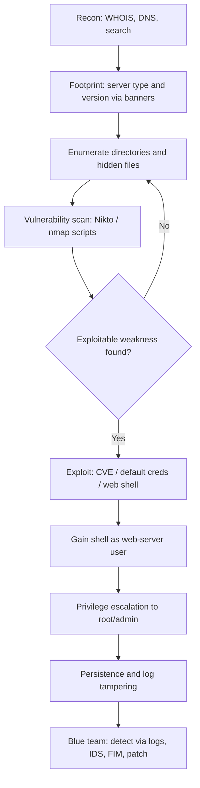

# Hacking Web Servers

> What you'll learn: how web servers work, how attackers compromise them, the tools used, and how blue teams harden and defend them. Prerequisites: basic networking (IP, ports, DNS), familiarity with HTTP, and comfort using a Linux terminal.

| Course | Course code | Module | Level |
|---|---|---|---|
| Professional Level 2 | SKL-CSP2-711 | Module 05 — Hacking Web Servers | level2 |

## 1. In Plain English

Imagine a busy hotel. The **web server** is the front desk: it takes requests from guests (visitors typing a web address into their browser), looks up what they asked for, and hands it back. When you type `example.com` and a page appears, a web server somewhere quietly received your request, found the right files, and replied. It does this thousands of times a minute, for strangers all over the world.

Now imagine a burglar studying that hotel. They don't smash a wall — they look for an unlocked side door, a master key left in a drawer, or a desk clerk who follows instructions too literally. **Hacking a web server** means finding and abusing those weak spots: outdated software, careless configuration, default passwords, or files the owner forgot to hide.

Why should a beginner care? Because the web server is one of the most exposed pieces of technology on the planet. It must be reachable by anyone, which means attackers can reach it too. A single compromised web server can leak customer data, deface a brand, host malware, or become a launch pad into the rest of a company's network.

The good news: most web-server break-ins exploit *known* problems that have *known* fixes. Once you understand how the front desk works and where the side doors are, you can both test a system (with permission) and lock it down properly.

## 2. Core Concepts

### What a web server actually is

A **web server** is software that listens on a network port and responds to **HTTP** (HyperText Transfer Protocol) requests. The most common web servers are **Apache HTTP Server**, **Nginx**, and **Microsoft IIS** (Internet Information Services). It usually listens on **port 80** (plain HTTP) and **port 443** (HTTPS — HTTP encrypted with **TLS**, Transport Layer Security).

Be careful with vocabulary: a *web server* (the software/host serving pages) is different from a *web application* (the program logic, e.g., a shopping cart written in PHP or Java). This module focuses on the server and its surrounding infrastructure, though the two overlap.

### The request/response cycle

When a browser asks for a page, it sends an HTTP **request** — a method (`GET`, `POST`, etc.), a path (`/login`), headers, and sometimes a body. The server returns an HTTP **response**: a status code (200 OK, 404 Not Found, 500 Server Error), headers, and a body (HTML, JSON, an image). Every one of these fields is a potential clue or attack surface.

### Web server architecture

A typical production setup has layers:

- **Reverse proxy / load balancer** (e.g., Nginx, a CDN, or an AWS/Azure load balancer): the public-facing entry point that distributes traffic.
- **Web server**: serves static files and forwards dynamic requests.
- **Application server**: runs code (PHP-FPM, Tomcat, Node.js, Gunicorn).
- **Database**: stores data behind the scenes.
- **Operating system**: Linux or Windows underneath it all.

A weakness in *any* layer can compromise the whole stack. Attackers map this architecture before striking.

### Common vulnerability categories

- **Misconfiguration**: directory listing enabled, default pages left up, verbose error messages, weak file permissions, exposed admin panels.
- **Default credentials**: admin/admin on a management console.
- **Outdated/unpatched software**: a known vulnerability (tracked with a **CVE** — Common Vulnerabilities and Exposures ID) that the vendor has already fixed but the operator hasn't applied.
- **Insecure protocols/ciphers**: old TLS versions, weak ciphers.
- **Information leakage**: the `Server:` header revealing exact versions, backup files (`config.php.bak`), or `.git` directories left on the server.
- **Directory traversal**: tricking the server into serving files outside the web root using `../` sequences.

### Server-Side Request Forgery and file upload abuse

Two server-centric attack classes worth naming: **SSRF** (Server-Side Request Forgery), where an attacker makes the server itself send requests to internal systems; and **unrestricted file upload**, where an attacker uploads a malicious script (a **web shell**) that the server then executes, giving remote command access.

### Why web servers get hacked

The CEH-style summary: the operator's biggest enemies are **misconfiguration, missing patches, and default settings**. Attackers automate the search for these at internet scale.

## 3. How It Works (Step by Step)

A methodical attack against a web server (performed only against systems you own or are authorized to test) follows a repeatable methodology:

1. **Information gathering (reconnaissance)** — Discover the target's domains, IP ranges, and exposed services using passive sources (WHOIS, DNS, search engines) so as not to touch the target yet.
2. **Footprinting the web server** — Identify the server software and version via banners and the HTTP `Server` header (e.g., with `whatweb` or `nmap`). Knowing it's "Apache 2.4.x on Ubuntu" narrows down which exploits apply.
3. **Mirroring & directory enumeration** — Crawl the site and brute-force hidden paths (`/admin`, `/backup`, `/.git`) to find forgotten or unprotected resources.
4. **Vulnerability scanning** — Run a scanner (Nikto, a vulnerability scanner) to flag known issues: outdated versions, dangerous default files, missing security headers.
5. **Exploitation** — Use a matching exploit: a known CVE, default credentials, directory traversal, or uploading a web shell.
6. **Gaining access / privilege escalation** — Get a command shell, then escalate from the limited web-server user to root/administrator by abusing local misconfigurations.
7. **Maintaining access & covering tracks** — Install persistence (a backdoor) and clear logs. (Defenders must assume this step happens and protect logs accordingly.)



## 4. Real-World Examples

**Equifax (2017).** Attackers exploited a known, already-patched vulnerability in the Apache Struts web-application framework (CVE-2017-5638) on an internet-facing server. Because the patch had not been applied in time, intruders reached an estimated 147 million people's personal records. The lesson is brutally simple: **patch management failure on a web-facing server** caused one of the largest breaches in history.

**Default and exposed admin interfaces.** A recurring real-world pattern is administrative consoles (server-status pages, dashboards, database admin tools like phpMyAdmin) left reachable from the internet with default or weak credentials. Attackers running automated scanners find these constantly; once logged in, they often gain code execution.

**Web shells via file upload.** Many breaches escalate when an attacker uploads a small script (a web shell) through an unvalidated upload form. The server executes it, and the attacker now runs commands as the web-server user — a tactic so common it maps to MITRE ATT&CK technique **T1505.003 (Server Software Component: Web Shell)**.

## 5. Tools of the Trade

> Use these only against systems you own or have written authorization to test.

### Nmap — network and service discovery

Finds open ports, identifies services, and runs HTTP-focused scripts.

```bash
nmap -sV -p 80,443 --script http-headers,http-title,http-enum target.lab
```

This scans ports 80/443, detects service versions (`-sV`), and runs scripts that dump HTTP headers, the page title, and enumerate common web paths.

### WhatWeb — technology fingerprinting

Identifies the web server, CMS, frameworks, and versions.

```bash
whatweb -v http://target.lab
```

Verbose mode (`-v`) reports the server software, detected technologies, and HTTP headers so you know what you're dealing with.

### Nikto — web server vulnerability scanner

Checks for thousands of known dangerous files, outdated versions, and misconfigurations.

```bash
nikto -h http://target.lab -o nikto-report.html -Format htm
```

Scans the host and writes an HTML report. Nikto is noisy and easily detected — that's fine for a lab and useful for testing your detection rules.

### Gobuster / ffuf — directory and file enumeration

Brute-forces hidden directories and files using a wordlist.

```bash
gobuster dir -u http://target.lab -w /usr/share/wordlists/dirb/common.txt -x php,bak,txt
```

Requests many candidate paths (with extensions `.php`, `.bak`, `.txt`) and reports which return non-404 responses, revealing hidden resources.

### Metasploit Framework — exploitation

A framework of vetted exploit modules for known vulnerabilities.

```bash
msfconsole -q
# search type:exploit name:apache
# use exploit/<matching_module>; set RHOSTS target.lab; check
```

`search` finds modules, `use` selects one, and `check` (when supported) safely verifies whether the target is vulnerable before any exploitation.

## 6. Hands-On Lab (Authorized / Lab-Only)

> This lab is for systems you own or are explicitly authorized to test. Never run any of this against systems you do not control.

**Goal:** Build a small lab, fingerprint a deliberately vulnerable web server, find a hidden web shell or misconfiguration, gain a shell, then switch to the blue-team side and *detect* what you did.

**Lab setup.** Create an isolated network — either a multi-VM home lab (VirtualBox/VMware with a host-only network) or an isolated cloud sandbox (a dedicated VPC/VNet with no public ingress). Suggested machines:

- **Attacker:** Kali Linux.
- **Target:** an intentionally vulnerable image such as OWASP Juice Shop, DVWA, or Metasploitable (run only on an isolated network).
- **Monitor:** a small Linux box running an IDS (Suricata or Zeek) and a log collector.

**Step 1 — Footprint.** From Kali, fingerprint the target and capture its server/version:

```bash
whatweb -v http://TARGET_IP
nmap -sV -p- --min-rate 1000 TARGET_IP
```

**Step 2 — Enumerate.** Brute-force directories and look for backups, admin panels, `.git`, or upload endpoints. Adapt the wordlist and extensions to what you found in Step 1.

```bash
gobuster dir -u http://TARGET_IP -w <your_wordlist> -x php,bak,zip,old
```

**Step 3 — Identify a weakness.** Run Nikto, review the report, and pick one concrete issue (an outdated component with a known CVE, an exposed admin page, or an unvalidated upload form). Cross-reference any version against a CVE source before proceeding.

**Step 4 — Exploit (lab only).** Depending on the weakness, either log into an exposed panel with default credentials, or upload a benign test web shell to an unprotected upload endpoint and confirm command execution (e.g., have it run `id`). The point is to *demonstrate* impact, not to cause damage.

**Step 5 — Post-exploitation awareness.** Note what an attacker would do next: enumerate the OS, look for privilege-escalation paths, and attempt to clear logs. Do not destroy your own evidence — you need it for Step 6.

**Step 6 — Validate the defense (the important half).** Switch to the Monitor box and confirm you can *detect* the attack:

- Open the web server access logs and find your Nikto/Gobuster bursts (hundreds of 404s from one IP in seconds).
- Confirm Suricata/Zeek raised alerts for the scan and any exploit traffic.
- Enable **File Integrity Monitoring** (e.g., AIDE or `auditd`) and verify it flags the uploaded web shell as a new/changed file in the web root.
- Apply the fix (patch the component, remove the upload, change credentials, disable directory listing) and re-run Steps 1–4 to prove the hole is closed.

**Success criteria:** you exploited one issue, your monitoring detected it, and your remediation made the re-test fail.

## 7. Countermeasures & Defenses

**Detect**
- Centralize and protect web server logs (ship them off-box so attackers can't wipe them).
- Deploy an IDS/IPS (Suricata, Zeek) and a Web Application Firewall (WAF, e.g., ModSecurity).
- Use File Integrity Monitoring (AIDE, Tripwire, `auditd`) to catch web shells and tampered files.
- Alert on anomalies: spikes of 404s, requests to `/admin` or `.git`, and traffic to known scanner user-agents.

**Prevent**
- **Patch promptly** — the single highest-impact control (see Equifax).
- Remove default content, sample apps, and unused modules; disable directory listing.
- Change all default credentials; require strong authentication and MFA on admin interfaces.
- Restrict admin panels to internal networks or VPN; never expose them publicly.
- Suppress version banners and verbose error messages.
- Enforce TLS 1.2+ with strong ciphers; add security headers (HSTS, Content-Security-Policy, X-Content-Type-Options).
- Validate and restrict file uploads (type, size, no execution in upload directories).
- Run the web server as a low-privileged user; apply least privilege and file-permission hardening.

**Mitigate / respond**
- Network segmentation so a compromised web server can't reach the whole environment.
- Rate limiting and bot/scanner blocking at the edge/CDN.
- A tested incident response plan and regular backups (offline copies) to recover from defacement or ransomware.

## 8. Key Terms

- **Web server** — software (Apache, Nginx, IIS) that listens for and answers HTTP requests.
- **HTTP/HTTPS** — the protocol for web requests; HTTPS adds TLS encryption.
- **Reverse proxy** — a server that fronts and forwards traffic to back-end servers.
- **CVE** — a public identifier for a specific known vulnerability.
- **Misconfiguration** — insecure settings (default pages, directory listing, weak permissions).
- **Directory traversal** — using `../` to read files outside the web root.
- **Web shell** — a malicious script uploaded to a server that grants remote command execution.
- **SSRF** — making the server send attacker-chosen requests to internal systems.
- **Footprinting** — gathering details (server type, version) about a target.
- **WAF** — Web Application Firewall, filters malicious HTTP traffic.
- **FIM** — File Integrity Monitoring, alerts when files unexpectedly change.
- **Patch management** — the process of testing and applying software updates promptly.

## 9. Summary & Takeaways

- A web server is the public front door of an organization — exposed by design, so it must be hardened deliberately.
- Most compromises come from three avoidable causes: **missing patches, misconfiguration, and default credentials**.
- Attackers follow a repeatable methodology: recon, footprint, enumerate, scan, exploit, escalate, persist.
- Tools like Nmap, WhatWeb, Nikto, Gobuster, and Metasploit automate finding weaknesses — and are equally useful for testing your own defenses.
- **Patch management is the highest-leverage control**; the Equifax breach is the canonical reminder.
- Defense is layered: detect (logs, IDS, FIM, WAF), prevent (patch, harden, least privilege), and mitigate (segmentation, backups, IR plan).
- Always practice offensive techniques only on owned or authorized, isolated lab systems, and validate that your detections actually fire.

Further reading: OWASP Top Ten and OWASP Web Security Testing Guide; NIST SP 800-123 (Guide to General Server Security) and SP 800-40 (Patch Management); MITRE ATT&CK technique T1505.003 (Web Shell); and the official Apache, Nginx, and Microsoft IIS hardening documentation.
