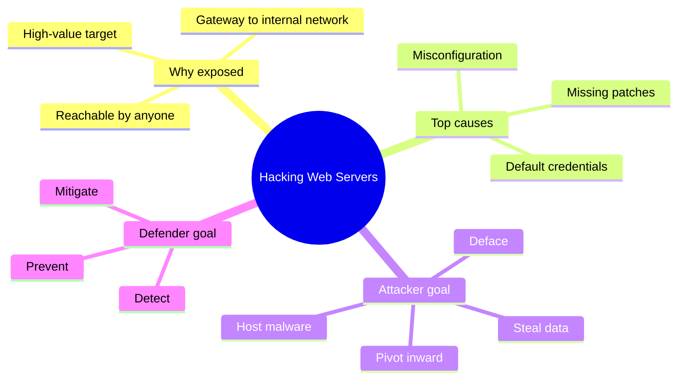
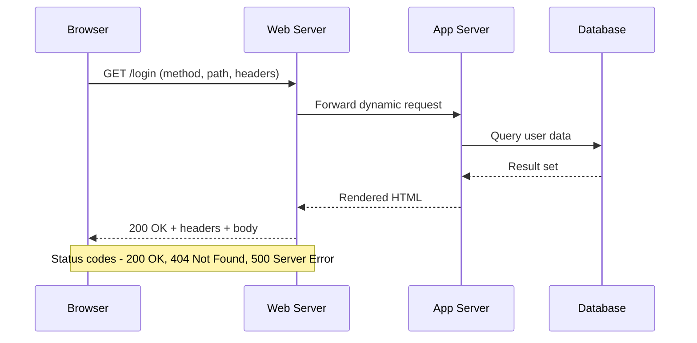
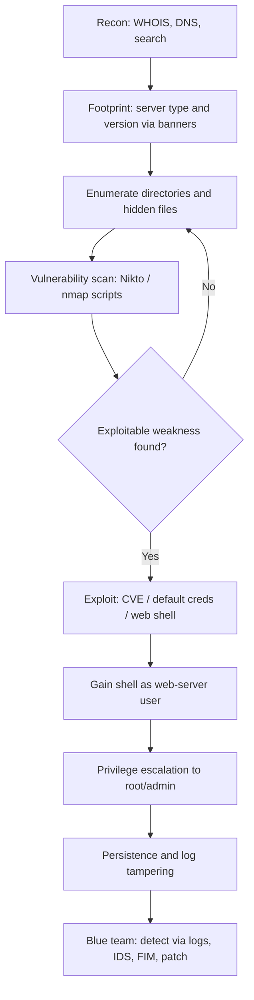
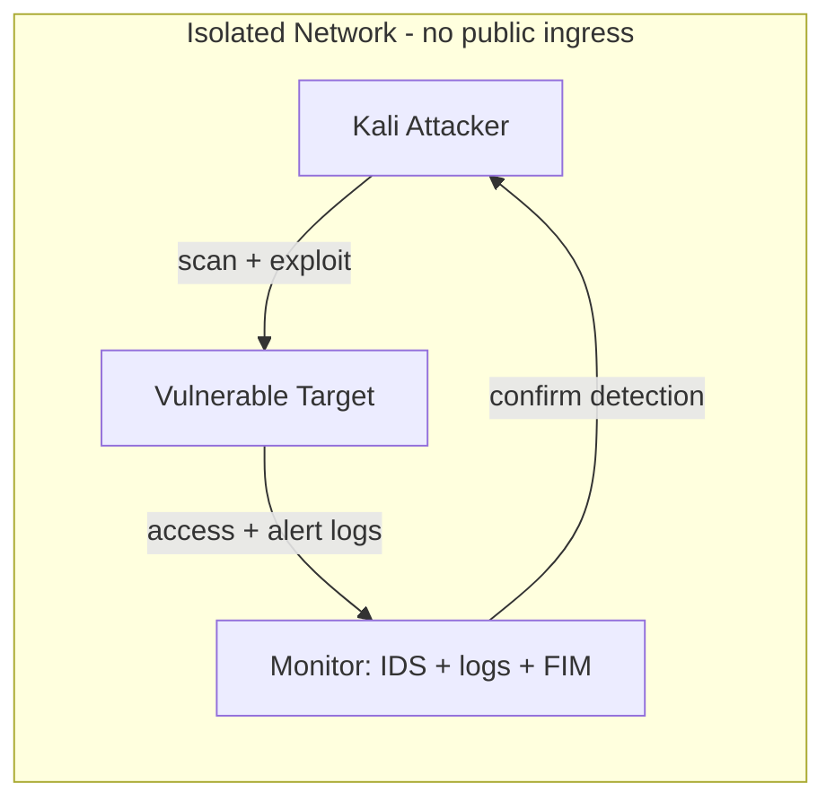
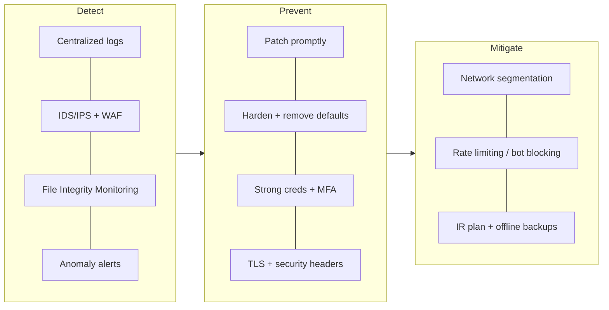

# Hacking Web Servers

> What you'll learn: how web servers work, how attackers compromise them, the tools involved, and how blue teams harden and defend them. Prerequisites: basic networking (IP, ports, DNS), familiarity with HTTP, and comfort with a Linux terminal.

| Course | Course code | Module | Level |
|---|---|---|---|
| Professional Level 2 | SKL-CSP2-711 | Module 05 — Hacking Web Servers | level2 |

## 1. In Plain English

Picture a busy hotel front desk. The **web server** is that desk: it takes requests from guests (visitors typing a web address), looks up what they asked for, and hands it back — thousands of times a minute, for strangers all over the world.

Now picture a burglar studying the hotel. They don't smash a wall — they look for an unlocked side door, a master key left in a drawer, or a clerk who follows instructions too literally. **Hacking a web server** means finding and abusing those weak spots: outdated software, careless configuration, default passwords, or files the owner forgot to hide.

Why care? The web server is one of the most exposed pieces of technology on the planet. It *must* be reachable by anyone — which means attackers can reach it too. A single compromised web server can leak customer data, deface a brand, host malware, or become a launch pad into the rest of a company's network.

> 💡 **Tip:** The good news — most web-server break-ins exploit *known* problems with *known* fixes. Understand the front desk, and you can both test it (with permission) and lock it down.



## 2. Core Concepts

### What a web server actually is

A **web server** is software that listens on a network port and answers **HTTP** (HyperText Transfer Protocol) requests. The big three are **Apache HTTP Server**, **Nginx**, and **Microsoft IIS** (Internet Information Services). Typical ports:

| Port | Protocol | Meaning |
|---|---|---|
| 80 | HTTP | Plain, unencrypted |
| 443 | HTTPS | HTTP over **TLS** (Transport Layer Security) — encrypted |

> 🔑 **Key idea:** A *web server* (the software/host serving pages) is not the same as a *web application* (the program logic, e.g., a shopping cart in PHP or Java). This module focuses on the server and its infrastructure — though the two overlap heavily.

### The request/response cycle

A browser sends an HTTP **request**: a method (`GET`, `POST`), a path (`/login`), headers, and sometimes a body. The server returns a **response**: a status code, headers, and a body (HTML, JSON, an image). Every field is a potential clue or attack surface.



### Web server architecture

A production stack has layers — and a weakness in *any* layer can compromise the whole thing. Attackers map this before striking.

| Layer | Example tech | Role |
|---|---|---|
| 🌐 Reverse proxy / load balancer | Nginx, CDN, AWS/Azure LB | Public entry point, distributes traffic |
| 🗂️ Web server | Apache, Nginx, IIS | Serves static files, forwards dynamic requests |
| ⚙️ Application server | PHP-FPM, Tomcat, Node.js, Gunicorn | Runs code |
| 🗄️ Database | MySQL, PostgreSQL | Stores data behind the scenes |
| 🖥️ Operating system | Linux, Windows | Foundation underneath it all |

> 🖼️ *Suggested image: a labeled layered diagram of a production web stack (client → CDN/LB → web server → app server → DB) with the OS spanning the bottom.*

### Common vulnerability categories

| Category | What it looks like |
|---|---|
| ⚙️ Misconfiguration | Directory listing on, default pages, verbose errors, weak file permissions, exposed admin panels |
| 🔑 Default credentials | `admin/admin` on a management console |
| 🩹 Outdated/unpatched software | A known vuln (tracked by a **CVE** — Common Vulnerabilities and Exposures ID) the vendor fixed but the operator never applied |
| 🔓 Insecure protocols/ciphers | Old TLS versions, weak ciphers |
| 📢 Information leakage | `Server:` header revealing exact versions, backup files (`config.php.bak`), exposed `.git` directories |
| 📁 Directory traversal | Serving files outside the web root via `../` sequences |

### Server-side attack classes worth naming

- **SSRF** (Server-Side Request Forgery) — an attacker makes *the server itself* send requests to internal systems.
- **Unrestricted file upload** — an attacker uploads a malicious script (a **web shell**) that the server then executes, granting remote command access.

> 🔑 **Key idea (CEH-style summary):** The operator's biggest enemies are **misconfiguration, missing patches, and default settings**. Attackers automate the hunt for these at internet scale.

## 3. How It Works (Step by Step)

A methodical attack — performed *only* against systems you own or are authorized to test — follows a repeatable methodology.

| # | Phase | What happens | Tools |
|---|---|---|---|
| 1 | 🔍 Recon (info gathering) | Discover domains, IP ranges, services via passive sources — no target contact yet | WHOIS, DNS, search engines |
| 2 | 🪪 Footprint the server | Identify server software/version via banners and the `Server` header | `whatweb`, `nmap` |
| 3 | 🗺️ Mirror & enumerate dirs | Crawl the site, brute-force hidden paths (`/admin`, `/backup`, `/.git`) | Gobuster, ffuf |
| 4 | 🧪 Vulnerability scan | Flag known issues: outdated versions, dangerous defaults, missing headers | Nikto, nmap scripts |
| 5 | 💥 Exploitation | Use a matching CVE, default creds, directory traversal, or upload a web shell | Metasploit |
| 6 | ⬆️ Access & priv-esc | Get a shell, escalate from the web-server user to root/admin via local misconfigs | Local enumeration |
| 7 | 🕳️ Persist & cover tracks | Install a backdoor, clear logs (defenders must assume this happens and protect logs) | — |



## 4. Real-World Examples

**🩸 Equifax (2017).** Attackers exploited a known, already-patched flaw in the Apache Struts web-application framework (CVE-2017-5638) on an internet-facing server. The patch wasn't applied in time, so intruders reached an estimated 147 million people's personal records.

> ⚠️ **Warning:** The lesson is brutally simple — a **patch-management failure on a web-facing server** caused one of the largest breaches in history.

**🚪 Default and exposed admin interfaces.** Administrative consoles (server-status pages, dashboards, database tools like phpMyAdmin) left reachable from the internet with default or weak credentials are a recurring pattern. Automated scanners find these constantly; once logged in, attackers often gain code execution.

**🐚 Web shells via file upload.** Many breaches escalate when an attacker uploads a small script (a web shell) through an unvalidated upload form. The server executes it, and the attacker now runs commands as the web-server user — common enough to map to MITRE ATT&CK technique **T1505.003 (Server Software Component: Web Shell)**.

## 5. Tools of the Trade

> ⚠️ **Warning:** Use these only against systems you own or have written authorization to test.

| Tool | Category | Best for | Noise level |
|---|---|---|---|
| 🛰️ Nmap | Network/service discovery | Open ports, service versions, HTTP scripts | Low–medium |
| 🔎 WhatWeb | Tech fingerprinting | Server, CMS, frameworks, versions | Low |
| 🧪 Nikto | Vuln scanner | Known dangerous files, outdated versions, misconfigs | High |
| 📂 Gobuster / ffuf | Dir/file enumeration | Hidden directories and files via wordlist | High |
| 💣 Metasploit | Exploitation framework | Vetted modules for known vulnerabilities | Medium–high |

### Nmap — network and service discovery

```bash
nmap -sV -p 80,443 --script http-headers,http-title,http-enum target.lab
```

Scans ports 80/443, detects service versions (`-sV`), and runs scripts that dump HTTP headers, the page title, and enumerate common web paths.

### WhatWeb — technology fingerprinting

```bash
whatweb -v http://target.lab
```

Verbose mode (`-v`) reports server software, detected technologies, and HTTP headers — so you know what you're dealing with.

### Nikto — web server vulnerability scanner

```bash
nikto -h http://target.lab -o nikto-report.html -Format htm
```

Scans the host and writes an HTML report. Nikto is noisy and easily detected — fine for a lab, and useful for testing your detection rules.

### Gobuster / ffuf — directory and file enumeration

```bash
gobuster dir -u http://target.lab -w /usr/share/wordlists/dirb/common.txt -x php,bak,txt
```

Requests many candidate paths (with extensions `.php`, `.bak`, `.txt`) and reports which return non-404 responses, revealing hidden resources.

### Metasploit Framework — exploitation

```bash
msfconsole -q
# search type:exploit name:apache
# use exploit/<matching_module>; set RHOSTS target.lab; check
```

`search` finds modules, `use` selects one, and `check` (when supported) safely verifies whether the target is vulnerable before any exploitation.

> 🖼️ *Suggested image: a Kali Linux terminal showing WhatWeb output identifying an Apache version and detected technologies.*

## 6. Hands-On Lab (Authorized / Lab-Only)

> ⚠️ **Warning:** This lab is for systems you own or are explicitly authorized to test. Never run any of this against systems you do not control.

**Goal:** Build a small lab, fingerprint a deliberately vulnerable web server, find a hidden web shell or misconfiguration, gain a shell — then switch to the blue-team side and *detect* what you did.

### Lab setup

Create an **isolated network**: either a multi-VM home lab (VirtualBox/VMware with a host-only network) or an isolated cloud sandbox (a dedicated VPC/VNet with no public ingress).

| Role | Suggested machine | Purpose |
|---|---|---|
| 🗡️ Attacker | Kali Linux | Run the offensive tools |
| 🎯 Target | OWASP Juice Shop, DVWA, or Metasploitable | Intentionally vulnerable — isolated network only |
| 🛡️ Monitor | Linux box with IDS (Suricata/Zeek) + log collector | Validate detection |



**Step 1 — Footprint.** From Kali, fingerprint the target and capture its server/version:

```bash
whatweb -v http://TARGET_IP
nmap -sV -p- --min-rate 1000 TARGET_IP
```

**Step 2 — Enumerate.** Brute-force directories; look for backups, admin panels, `.git`, or upload endpoints. Adapt the wordlist and extensions to what Step 1 revealed.

```bash
gobuster dir -u http://TARGET_IP -w <your_wordlist> -x php,bak,zip,old
```

**Step 3 — Identify a weakness.** Run Nikto, review the report, and pick one concrete issue (an outdated component with a known CVE, an exposed admin page, or an unvalidated upload form). Cross-reference any version against a CVE source before proceeding.

**Step 4 — Exploit (lab only).** Depending on the weakness, either log into an exposed panel with default credentials, or upload a *benign* test web shell to an unprotected upload endpoint and confirm command execution (e.g., have it run `id`). The point is to *demonstrate* impact, not cause damage.

**Step 5 — Post-exploitation awareness.** Note what an attacker would do next: enumerate the OS, look for privilege-escalation paths, attempt to clear logs.

> 💡 **Tip:** Do *not* destroy your own evidence — you need it for Step 6.

**Step 6 — Validate the defense (the important half).** Switch to the Monitor box and confirm you can *detect* the attack:

- Open the web server access logs and find your Nikto/Gobuster bursts (hundreds of 404s from one IP in seconds).
- Confirm Suricata/Zeek raised alerts for the scan and any exploit traffic.
- Enable **File Integrity Monitoring** (AIDE or `auditd`) and verify it flags the uploaded web shell as a new/changed file in the web root.
- Apply the fix (patch the component, remove the upload, change credentials, disable directory listing) and re-run Steps 1–4 to prove the hole is closed.

> 🔑 **Success criteria:** you exploited one issue, your monitoring detected it, and your remediation made the re-test fail.

## 7. Countermeasures & Defenses

Defense is layered. Map each attacker move to a control.

| Attack / weakness | Defense |
|---|---|
| 💥 Known CVE exploited | Patch promptly (highest-impact control) |
| 🔑 Default credentials | Change all defaults; require strong auth + MFA on admin interfaces |
| 🚪 Exposed admin panel | Restrict to internal network / VPN; never expose publicly |
| 📢 Version banner leakage | Suppress version banners and verbose error messages |
| 🔓 Weak TLS/ciphers | Enforce TLS 1.2+; add HSTS, CSP, X-Content-Type-Options |
| 🐚 Malicious file upload | Validate type/size; no execution in upload directories |
| ⬆️ Privilege escalation | Run as low-privileged user; least privilege + permission hardening |
| 🗺️ Scan/enumeration | IDS/IPS + WAF; alert on 404 spikes, `/admin`, `.git`, scanner user-agents |
| 🕳️ Log tampering | Centralize and ship logs off-box so attackers can't wipe them |



**Detect**
- Centralize and protect web server logs (ship them off-box).
- Deploy an IDS/IPS (Suricata, Zeek) and a Web Application Firewall (WAF, e.g., ModSecurity).
- Use File Integrity Monitoring (AIDE, Tripwire, `auditd`) to catch web shells and tampered files.
- Alert on anomalies: 404 spikes, requests to `/admin` or `.git`, known scanner user-agents.

**Prevent**
- **Patch promptly** — the single highest-impact control (see Equifax).
- Remove default content, sample apps, and unused modules; disable directory listing.
- Change all default credentials; require strong authentication and MFA on admin interfaces.
- Restrict admin panels to internal networks or VPN.
- Suppress version banners and verbose error messages.
- Enforce TLS 1.2+ with strong ciphers; add security headers (HSTS, CSP, X-Content-Type-Options).
- Validate and restrict file uploads (type, size, no execution in upload directories).
- Run the web server as a low-privileged user; apply least privilege and permission hardening.

**Mitigate / respond**
- Network segmentation so a compromised web server can't reach the whole environment.
- Rate limiting and bot/scanner blocking at the edge/CDN.
- A tested incident response plan and regular offline backups to recover from defacement or ransomware.

## 8. Key Terms

| Term | Meaning |
|---|---|
| **Web server** | Software (Apache, Nginx, IIS) that listens for and answers HTTP requests |
| **HTTP / HTTPS** | The protocol for web requests; HTTPS adds TLS encryption |
| **Reverse proxy** | A server that fronts and forwards traffic to back-end servers |
| **CVE** | A public identifier for a specific known vulnerability |
| **Misconfiguration** | Insecure settings (default pages, directory listing, weak permissions) |
| **Directory traversal** | Using `../` to read files outside the web root |
| **Web shell** | A malicious script uploaded to a server granting remote command execution |
| **SSRF** | Making the server send attacker-chosen requests to internal systems |
| **Footprinting** | Gathering details (server type, version) about a target |
| **WAF** | Web Application Firewall — filters malicious HTTP traffic |
| **FIM** | File Integrity Monitoring — alerts when files unexpectedly change |
| **Patch management** | The process of testing and applying software updates promptly |

## 9. Summary & Takeaways

- A web server is the public front door of an organization — exposed by design, so it must be hardened deliberately.
- Most compromises come from three avoidable causes: **missing patches, misconfiguration, and default credentials**.
- Attackers follow a repeatable methodology: recon → footprint → enumerate → scan → exploit → escalate → persist.
- Tools like Nmap, WhatWeb, Nikto, Gobuster, and Metasploit automate finding weaknesses — and are equally useful for testing your own defenses.
- **Patch management is the highest-leverage control**; the Equifax breach is the canonical reminder.
- Defense is layered: **detect** (logs, IDS, FIM, WAF), **prevent** (patch, harden, least privilege), **mitigate** (segmentation, backups, IR plan).
- Practice offensive techniques only on owned or authorized, isolated lab systems — and always validate that your detections actually fire.

> 📚 **Further reading:** OWASP Top Ten and OWASP Web Security Testing Guide; NIST SP 800-123 (Guide to General Server Security) and SP 800-40 (Patch Management); MITRE ATT&CK technique T1505.003 (Web Shell); and the official Apache, Nginx, and Microsoft IIS hardening documentation.
