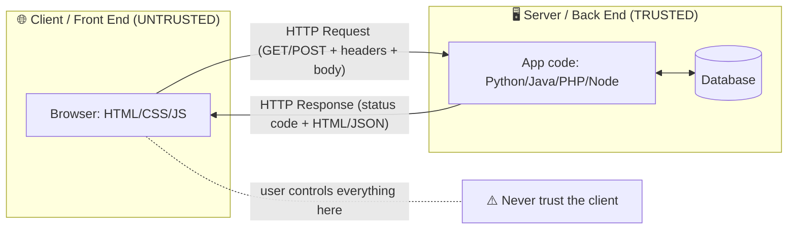
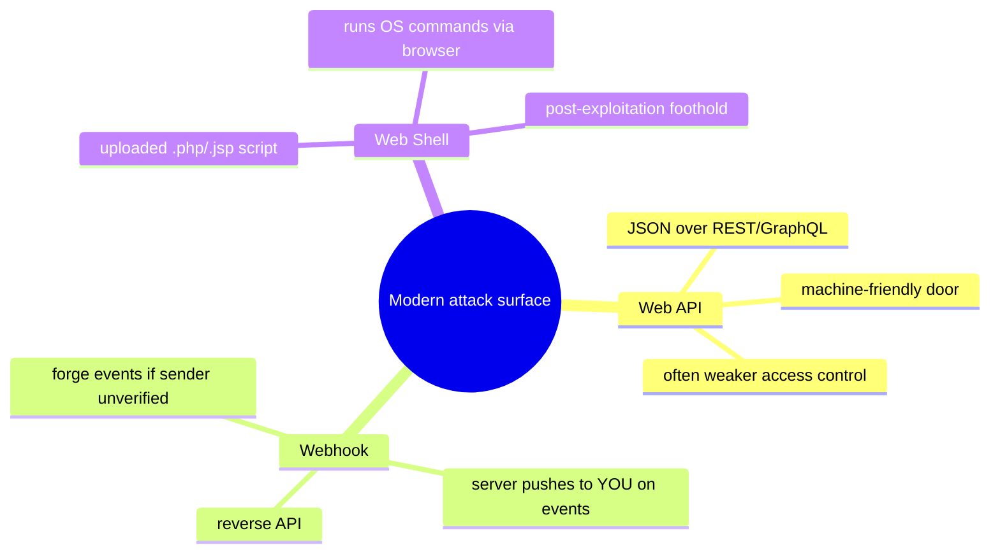
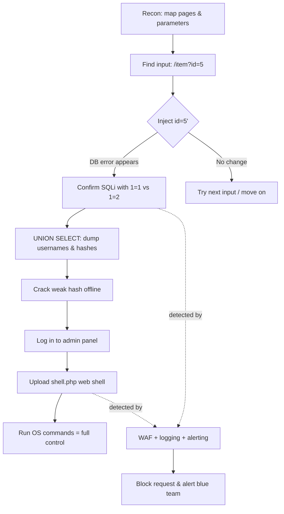
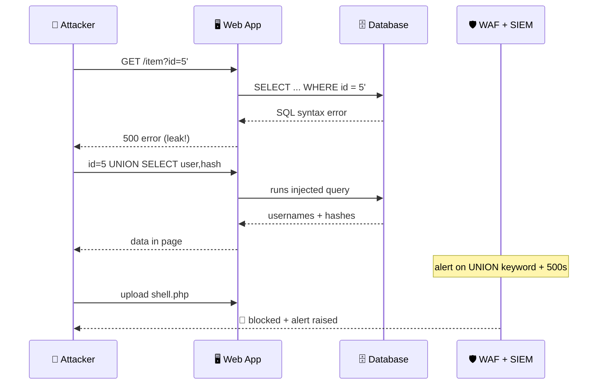
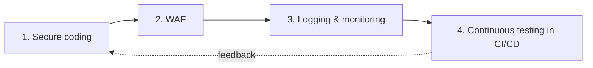

# Hacking Web Applications

> **What you'll learn:** how web apps are built, the most common ways attackers break them (the OWASP Top 10), the step-by-step methodology a tester follows, modern attack surfaces like APIs, webhooks and web shells — and how defenders shut all of this down with secure coding.
> **Prerequisites:** how websites work (browsers, URLs), comfort reading simple HTTP requests, and basic command line. No prior security experience required.

| Course | Course code | Module | Level |
|--------|-------------|--------|-------|
| Professional Level 2 | SKL-CSP2-711 | Module 06 — Hacking Web Applications | level2 |

## 1. In Plain English 🍽️

Think of a web application as a busy restaurant. The **front of house** is the website in your browser — the menu, the buttons, the order form. The **back of house** is the kitchen: servers, databases, and code that prepares your order. Clicking "place order" sends a slip of paper (an HTTP request) to the kitchen, which sends back your food (an HTTP response — the page).

Now picture a dishonest customer who writes on the slip: "one pizza, AND give me everyone else's credit card numbers." A careless kitchen that doesn't read carefully might actually do it. That is web application hacking in a nutshell: sending crafted requests the application trusts too much, tricking it into leaking data, running unintended commands, or impersonating other users.

> 🔑 **Key idea:** Almost everything important now lives behind a web app — banking, email, medical records, internal tools. The web is the single largest attack surface in technology. Understand these attacks, and you can build resistant software, test systems before criminals do, and respond intelligently when something breaks.

The good news: most web attacks come from a small, well-understood set of mistakes. Learn those, and you've covered most of the real-world risk.

## 2. Core Concepts

A web app is two halves talking over HTTP. The diagram below shows the trust boundary that every attack and defense revolves around.



**Web Application** — software used through a browser instead of installing it. Runs partly in your browser (the **client / front end**) and partly on a remote computer (the **server / back end**). The two halves talk over **HTTP**, a simple request-and-response conversation.

**HTTP Request & Response** — every interaction is one request from the browser, one response from the server:

| Part | Lives in | Examples |
|------|----------|----------|
| Method | Request | `GET` (fetch data), `POST` (submit data) |
| URL | Request | the address being acted on |
| Headers | Both | browser type, **session token** |
| Body | Both | submitted form data; response HTML/JSON |
| Status code | Response | `200` OK, `404` not found, `500` server error |

**Client-side vs Server-side** — client code (HTML, CSS, JavaScript) runs in the user's browser and can **never** be fully trusted; the user controls it and can edit any request before sending. Server-side code runs on the company's machine. The golden rule follows directly: **never trust the client.** All validation and authorization must be re-checked on the server.

**Session & Authentication vs Authorization** — two questions people often confuse:

| Concept | Question it answers | Mechanism |
|---------|--------------------|-----------|
| 🔐 Authentication | "Who are you?" | login → server issues a **session token** (usually a **cookie**) sent on every later request |
| 🛂 Authorization | "What are you allowed to do?" | per-request ownership/permission checks |

> ⚠️ **Warning:** Many breaches come from checking *authentication* ("are you logged in?") but forgetting *authorization* ("do you own this specific object?").

### The OWASP Top 10 (Web Application Threats)

**OWASP** (Open Worldwide Application Security Project) publishes a community-built list of the ten most critical web app risks — the industry's default checklist.

| # | Risk category | Plain-English meaning |
|---|---------------|-----------------------|
| 1 | 🚪 Broken Access Control | Users reach data/actions they shouldn't (e.g. changing a URL ID to view someone's invoice). |
| 2 | 🔒 Cryptographic Failures | Sensitive data sent or stored without proper encryption. |
| 3 | 💉 Injection | Untrusted input treated as code/commands — includes **SQL injection** and **command injection**. |
| 4 | 📐 Insecure Design | Flaw in the blueprint, not one bug — missing security thinking up front. |
| 5 | ⚙️ Security Misconfiguration | Default passwords, verbose errors, unnecessary features left on. |
| 6 | 📦 Vulnerable & Outdated Components | A library/framework with a known, unpatched flaw. |
| 7 | 🔑 Identification & Authentication Failures | Weak login, predictable tokens, no brute-force protection. |
| 8 | 📝 Software & Data Integrity Failures | Trusting code/updates from unverified sources (insecure CI/CD, deserialization). |
| 9 | 🔭 Security Logging & Monitoring Failures | Attacks go unnoticed because nothing is recorded or watched. |
| 10 | 🔀 Server-Side Request Forgery (SSRF) | Server tricked into requesting places it shouldn't, like internal systems. |

### Key Attack Types

- **💉 SQL Injection (SQLi):** inserting database commands into an input field so the database runs them. Classic example: typing `' OR '1'='1` into a login form to make the query always return "true."
- **📜 Cross-Site Scripting (XSS):** injecting malicious JavaScript that runs in *another user's* browser — used to steal session cookies or deface pages.
- **🔁 Cross-Site Request Forgery (CSRF):** tricking a logged-in user's browser into silently submitting an action (like "transfer money") to a site they're authenticated to.
- **🔢 Insecure Direct Object Reference (IDOR):** broken access control where changing an identifier (`/account?id=123` → `id=124`) exposes someone else's data.

### Web APIs, Webhooks, and Web Shells



- A **Web API** is the machine-friendly door into an app — instead of HTML it returns structured data, usually **JSON**, often as a **REST** or **GraphQL** API. APIs frequently have weaker access control than the main site and are a top target.
- A **Webhook** is a "reverse API": the server sends an HTTP request *to you* when an event happens (e.g. "payment received"). If the receiving endpoint doesn't verify the sender, attackers can forge events.
- A **Web Shell** is a malicious script an attacker uploads to a compromised server (e.g. a `.php` or `.jsp` file) that runs operating-system commands through the browser. A common *post-exploitation* tool — the foothold after the initial break-in.

**Secure Coding** — writing software so these flaws cannot occur: validating input, using safe APIs (parameterized queries), encoding output, enforcing authorization on every request, and keeping dependencies patched.

## 3. How It Works (Step by Step)

Let's walk a realistic attack chain combining several concepts: the attacker finds an **SQL injection**, extracts credentials, then plants a **web shell**.

1. **Reconnaissance.** Map the app: which pages exist, what parameters they take, what tech stack is used (revealed by headers, error messages, file extensions).
2. **Find the input.** A product page at `/item?id=5`. Changing `id` to `5'` produces a database error — a strong hint the input flows unsanitized into a SQL query.
3. **Confirm injection.** Send `id=5 AND 1=1` (page loads) vs `id=5 AND 1=2` (page changes). Different behavior confirms the database interprets input as code.
4. **Extract data.** A `UNION SELECT` payload pulls usernames and password hashes from the database.
5. **Crack & escalate.** Offline, crack a weak hash and log in to the admin panel.
6. **Plant a web shell.** The admin panel allows file uploads. Upload `shell.php`, browse to it, run server commands — full control.
7. **Defender's view.** A **WAF** and logging should flag the SQL error responses, the `UNION` keyword, and the upload of an executable script.



The same chain, viewed as the conversation between attacker, app, and defender:



## 4. Real-World Examples

> 🖼️ *Suggested image: timeline graphic of the Equifax 2017 breach (disclosure → patch released → exploitation → public announcement)*

**Equifax (2017).** Attackers exploited a known, unpatched vulnerability in the Apache Struts web framework — a textbook "Vulnerable & Outdated Components" failure. The flaw let them run commands on the server, exposing personal data of roughly 147 million people. The fix had been public for months. Lesson: **patching dependencies is core security work, not optional housekeeping.**

**SQL injection against bulk-data sites.** For two decades, SQLi has repeatedly dumped entire user databases from forums, retailers, and government sites. It stays in the OWASP Top 10 because input is still commonly concatenated directly into queries. The defense — parameterized queries — has existed for years but isn't universally applied.

**API broken object-level authorization.** A mobile app calls `GET /api/v2/users/1001/messages`. The server checks the caller is logged in (authentication) but not that user 1001 is *them* (authorization), so changing the number to `1002` returns another person's private messages. This IDOR-at-the-API-layer pattern has driven numerous real disclosures — exactly why "Broken Access Control" tops OWASP's list.

## 5. Tools of the Trade

> ⚠️ **Warning:** All tools below are for **authorized testing** of systems you own or have written permission to test.

| Tool | Type | Best for | Free? |
|------|------|----------|-------|
| 🕷️ Burp Suite | Intercepting proxy | Manually reading/editing every request | Community ed. |
| ⚡ OWASP ZAP | Proxy + scanner | Automated passive/active scanning | ✅ open source |
| 🗃️ sqlmap | SQLi automation | Detecting & exploiting injection | ✅ |
| 🔎 Nikto | Server scanner | Misconfig & known-file checks | ✅ |
| 📂 ffuf / gobuster | Content discovery | Finding hidden paths/endpoints | ✅ |

**Burp Suite** — an intercepting proxy between your browser and the target so you can read and modify every request. The free Community edition is the standard learning tool.
```text
# Configure browser proxy to 127.0.0.1:8080, then in Burp:
# Intercept ON -> edit the captured request -> Forward
# Use "Repeater" to resend a tweaked request and compare responses
```
Lets you change a hidden `id` parameter or strip a client-side check and watch how the server reacts.

**OWASP ZAP** — a free, open-source alternative to Burp with an automated scanner.
```bash
# Baseline passive scan of a target (lab only):
zap-baseline.py -t http://localhost:3000 -r zap_report.html
```
Crawls the site, runs passive checks, and writes an HTML findings report.

**sqlmap** — automates detecting and exploiting SQL injection.
```bash
sqlmap -u "http://localhost:3000/item?id=5" --batch --dbs
```
Tests the `id` parameter and, if injectable, lists the databases. `--batch` accepts default prompts non-interactively.

**Nikto** — quick web server misconfiguration and known-file scanner.
```bash
nikto -h http://localhost:3000
```
Reports default files, outdated server versions, and risky HTTP methods.

**ffuf / gobuster** — content discovery (finding hidden paths and endpoints).
```bash
ffuf -u http://localhost:3000/FUZZ -w /usr/share/wordlists/dirb/common.txt
```
Replaces `FUZZ` with each word in the list to discover unlinked admin or backup pages.

## 6. Hands-On Lab (Authorized / Lab-Only) 🧪

> ⚠️ **Warning:** Perform every step ONLY against systems you own or are explicitly authorized to test. Never point these tools at the live internet.

**Goal:** build a sandbox, chain an SQLi-to-admin-access attack against a deliberately vulnerable app, then validate that detection works.

> 🖼️ *Suggested image: network diagram of the host-only lab — Kali attacker VM and target VM isolated from the internet*

**Lab build.** Stand up an isolated environment so nothing escapes to a real network:
1. Create two VMs (VirtualBox/VMware) on a **host-only network**, or use Docker on an isolated bridge. One VM is the **attacker** (Kali Linux), one is the **target**.
2. On the target, run a vulnerable app such as **OWASP Juice Shop** (`docker run -d -p 3000:3000 bkimminich/juice-shop`) or **DVWA**. A firewalled cloud sandbox works too — restrict it to your own IP only.

**Attack chain** (adapt values to your app):
1. **Map** the app with content discovery (`ffuf` against the target); note every parameter and login form.
2. **Probe for injection** manually in Burp Repeater — append a single quote to a parameter and watch for a DB error.
3. **Confirm & exploit** with `sqlmap` against the parameter you found; enumerate tables and dump the users table.
4. **Crack** retrieved password hashes offline (`john` or `hashcat`) with a small wordlist.
5. **Escalate** by logging into the admin area with cracked creds, then try the file-upload feature.
6. **Plant a (harmless) web shell** — upload a script that runs only a benign command like `id`, proving the path without doing damage.

**Validate the defense / detection (required):**
1. Put a WAF (**ModSecurity** + OWASP Core Rule Set) or ZAP in front of the target and re-run step 3. Confirm the SQLi payloads are now blocked.
2. Tail the web server and WAF logs during the attack; write a one-line detection rule (e.g. alert on `UNION SELECT` in a query string, or on uploads with executable extensions). Re-run and confirm your alert fires.
3. Patch the app's input handling to use a parameterized query, re-run `sqlmap`, and confirm it reports "not injectable."

> 💡 **Tip:** This closes the loop — **attack → detect → fix → re-verify.** A fix you never re-tested is a hope, not a control.

## 7. Countermeasures & Defenses

Defense is layered. The table maps each major attack to its primary fix; the prose below adds the platform and detection layers.

| Attack | 🛡️ Primary defense |
|--------|--------------------|
| 💉 SQL Injection | Parameterized queries / prepared statements |
| 📜 XSS | Context-aware output encoding |
| 🔁 CSRF | Anti-CSRF tokens + `SameSite` cookies |
| 🔢 IDOR / Broken Access Control | Per-request, object-level authorization |
| 📂 Web Shell upload | Validate type, store outside web root, never execute uploads |
| 🔀 SSRF | Allow-list outbound destinations; block internal ranges |
| 🪝 Webhook forgery | Verify a **signature / HMAC** from the sender |

**Prevent (secure design & coding):**
- Use **parameterized queries / prepared statements** for all database access — never build SQL by string concatenation. This single practice eliminates most SQL injection.
- **Validate input** against an allow-list (what *is* permitted) rather than a deny-list, server-side.
- **Encode output** for its context (HTML, attribute, JavaScript, URL) to stop XSS.
- Enforce **authorization on every request**, server-side, checking ownership of the specific object — not just "is the user logged in."
- Use **anti-CSRF tokens** and the `SameSite` cookie attribute for state-changing actions.
- Restrict file uploads: validate type/extension, store outside the web root, never execute uploaded files (defeats web shells).
- For APIs: object-level authorization, rate limiting, schema validation. For webhooks: verify a **signature/HMAC** so you trust only the real sender.

**Harden the platform:**
- Keep frameworks and libraries patched; track them with a software bill of materials and dependency scanning.
- Disable verbose error messages in production; turn off unused features and default accounts.
- Enforce TLS everywhere and store passwords as salted, slow hashes (**bcrypt/argon2**).

**Detect & respond:**
- Deploy a **WAF** (ModSecurity + OWASP CRS) as defense-in-depth, not a substitute for fixing code.
- Centralize and monitor logs; alert on injection keywords, repeated `403/500` errors, and suspicious uploads.
- Run regular scans (ZAP/Nikto) and authorized penetration tests; integrate **SAST** (static) and **DAST** (dynamic) checks into CI/CD.

## 8. Key Terms

| Term | Meaning |
|------|---------|
| **HTTP** | Request/response protocol browsers and servers use to communicate. |
| **OWASP Top 10** | Industry-standard list of the most critical web app security risks. |
| **SQL Injection (SQLi)** | Making a database run attacker-supplied commands via unsanitized input. |
| **Cross-Site Scripting (XSS)** | Injecting JavaScript that executes in another user's browser. |
| **CSRF** | Tricking a logged-in browser into making an unwanted state-changing request. |
| **IDOR / Broken Access Control** | Accessing another user's data/actions by manipulating identifiers. |
| **SSRF** | Coercing the server into requesting internal or unintended destinations. |
| **Web API** | A structured (often JSON) machine interface to an application. |
| **Webhook** | A server-initiated HTTP callback fired when an event occurs. |
| **Web Shell** | A malicious uploaded script giving the attacker command execution. |
| **WAF** | Web Application Firewall; filters/blocks malicious HTTP traffic. |
| **Parameterized query** | A query where data is passed separately from SQL code, preventing injection. |
| **SAST / DAST** | Static (code) and dynamic (running app) automated security testing. |

## 9. Summary & Takeaways



- Web apps split into an **untrusted client** and a **trusted server** — never trust the client; re-validate and re-authorize everything server-side.
- The **OWASP Top 10** captures the bulk of real-world risk; **Broken Access Control** and **Injection** are perennial leaders.
- A typical attack follows a **methodology**: recon → find input → confirm → exploit → escalate → persist (e.g. web shell).
- **APIs and webhooks** are first-class attack surfaces — often weaker authorization than the main site; enforce object-level checks and sender verification.
- Most devastating flaws are **simple to prevent**: parameterized queries, output encoding, proper authorization, patched dependencies, locked-down file uploads.
- Defense is **layered**: secure coding first, then WAF, logging, monitoring, and continuous testing in CI/CD.
- Always confirm a fix by **re-running the attack** — attack, detect, patch, re-verify.

**Further reading:** the **OWASP Top 10** and **OWASP API Security Top 10**, the **OWASP Testing Guide** and **Cheat Sheet Series**, the **MITRE ATT&CK** Enterprise matrix (Initial Access and Persistence), and **NIST SP 800-115** (Technical Guide to Information Security Testing and Assessment).
