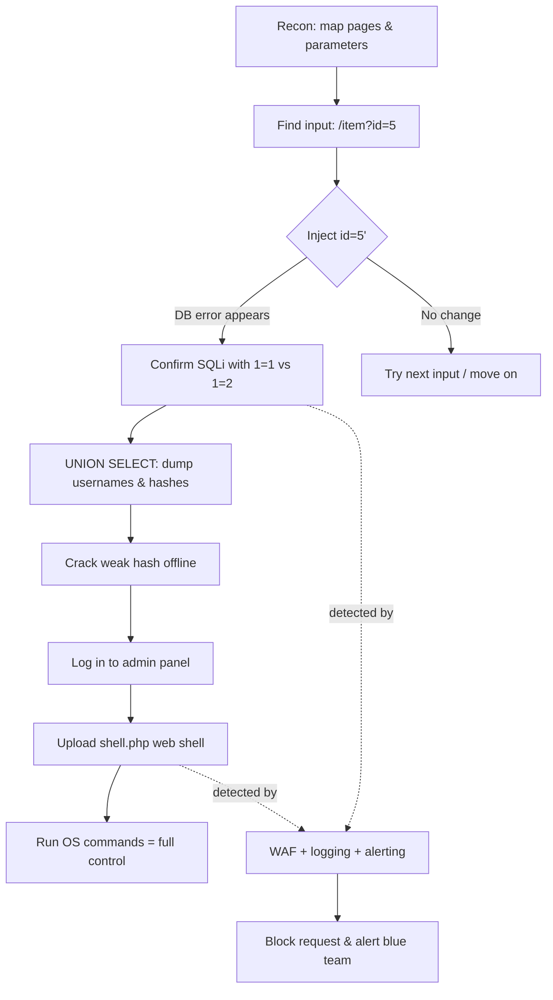

# Hacking Web Applications

> What you'll learn: how web applications are built, the most common ways attackers break them (the OWASP Top 10), the step-by-step methodology a tester follows, modern attack surfaces like APIs, webhooks and web shells — and how defenders shut all of this down with secure coding.
> Prerequisites: basic understanding of how websites work (browsers, URLs), comfort reading simple HTTP requests, and familiarity with the command line. No prior security experience required.

| Course | Course code | Module | Level |
|--------|-------------|--------|-------|
| Professional Level 2 | SKL-CSP2-711 | Module 06 — Hacking Web Applications | level2 |

## 1. In Plain English

Imagine a web application is like a busy restaurant. The **front of house** is the website you see in your browser — the menu, the buttons, the order form. The **back of house** is the kitchen: servers, databases, and code that actually prepares your order. When you click "place order," your browser sends a slip of paper (an HTTP request) to the kitchen, and the kitchen sends back your food (an HTTP response — the page).

Now imagine a dishonest customer who, instead of writing "one pizza" on the order slip, writes "one pizza, AND give me everyone else's credit card numbers." A careless kitchen that doesn't read the slip carefully might actually do it. That, in a nutshell, is web application hacking: sending cleverly crafted requests that the application trusts too much, tricking it into leaking data, running unintended commands, or letting an attacker impersonate other users.

Why should a beginner care? Because almost everything important now lives behind a web app — your bank, your email, your medical records, your company's internal tools. The web is the single largest attack surface in existing technology. If you understand how these attacks work, you can build software that resists them, test systems for weaknesses before criminals do, and respond intelligently when something goes wrong.

The good news: the vast majority of web attacks come from a small, well-understood set of mistakes. Learn those, and you've covered most of the real-world risk.

## 2. Core Concepts

### Web Application
A **web application** is software you use through a browser instead of installing it. It runs partly in your browser (the **client / front end**) and partly on a remote computer (the **server / back end**). The two halves talk over **HTTP** (HyperText Transfer Protocol), the language of the web — a simple request-and-response conversation.

### HTTP Request and Response
Every interaction is one **request** from the browser and one **response** from the server. A request has a **method** (e.g. `GET` to fetch data, `POST` to submit data), a **URL** (the address), **headers** (metadata like which browser you use or your session token), and sometimes a **body** (the form data you submitted). The response has a **status code** (`200` = OK, `404` = not found, `500` = server error) and a body (usually HTML, or JSON for APIs).

### Client-side vs Server-side
**Client-side** code (HTML, CSS, JavaScript) runs in the user's browser and can never be fully trusted — the user controls it completely and can edit any request before it's sent. **Server-side** code (e.g. Python, Java, PHP, Node.js) runs on the company's machine. The golden rule of security follows directly: **never trust the client.** All validation and authorization decisions must be re-checked on the server.

### Session and Authentication
**Authentication** is proving who you are (logging in). After you log in, the server gives your browser a **session token** — usually stored in a **cookie** — that you send with every later request so you don't have to log in again. **Authorization** is a separate question: now that we know who you are, *what are you allowed to do?* Many breaches come from confusing these two.

### The OWASP Top 10 (Web Application Threats)
**OWASP** (the Open Worldwide Application Security Project) publishes a community-built list of the ten most critical web app risks. It is the industry's default checklist. The current top categories include:

| Risk category | Plain-English meaning |
|---------------|-----------------------|
| Broken Access Control | Users can reach data or actions they shouldn't (e.g. changing a URL ID to view someone else's invoice). |
| Cryptographic Failures | Sensitive data sent or stored without proper encryption. |
| Injection | Untrusted input is treated as code/commands — includes **SQL injection** and **command injection**. |
| Insecure Design | The flaw is in the blueprint, not a single bug — missing security thinking up front. |
| Security Misconfiguration | Default passwords, verbose error pages, unnecessary features left on. |
| Vulnerable & Outdated Components | Using a library or framework with a known, unpatched flaw. |
| Identification & Authentication Failures | Weak login, predictable session tokens, no protection against password guessing. |
| Software & Data Integrity Failures | Trusting code/updates from unverified sources (e.g. insecure CI/CD or deserialization). |
| Security Logging & Monitoring Failures | Attacks go unnoticed because nothing is recorded or watched. |
| Server-Side Request Forgery (SSRF) | The server is tricked into making requests to places it shouldn't, like internal systems. |

### Key Attack Types (definitions)
- **SQL Injection (SQLi):** inserting database commands into an input field so the database runs them. The classic example is typing `' OR '1'='1` into a login form to make the query always return "true."
- **Cross-Site Scripting (XSS):** injecting malicious JavaScript that runs in *another user's* browser — used to steal session cookies or deface pages.
- **Cross-Site Request Forgery (CSRF):** tricking a logged-in user's browser into silently submitting an action (like "transfer money") to a site they're authenticated to.
- **Insecure Direct Object Reference (IDOR):** a form of broken access control where changing an identifier (`/account?id=123` → `id=124`) gives access to someone else's data.

### Web APIs, Webhooks, and Web Shells
- A **Web API** (Application Programming Interface) is the machine-friendly door into an application — instead of HTML pages it returns structured data, usually **JSON**, often as a **REST** or **GraphQL** API. APIs frequently have weaker access control than the main site and are a top target.
- A **Webhook** is a "reverse API": instead of you asking the server for updates, the server sends an HTTP request *to you* when an event happens (e.g. "payment received"). If the receiving endpoint doesn't verify the sender, attackers can forge events.
- A **Web Shell** is a malicious script an attacker uploads to a compromised server (e.g. a `.php` or `.jsp` file) that lets them run operating-system commands through the browser. It is a common *post-exploitation* tool — the foothold after the initial break-in.

### Secure Coding
**Secure coding** is the practice of writing software so these flaws cannot occur: validating input, using safe APIs (like parameterized queries), encoding output, enforcing authorization on every request, and keeping dependencies patched.

## 3. How It Works (Step by Step)

Let's walk through a realistic attack chain combining several concepts: an attacker finds an **SQL injection**, extracts credentials, and then plants a **web shell**.

1. **Reconnaissance.** The attacker maps the app: which pages exist, what parameters they take, what technology stack is used (revealed by headers, error messages, file extensions).
2. **Find the input.** They notice a product page at `/item?id=5`. Changing `id` to `5'` produces a database error — a strong hint the input flows unsanitized into a SQL query.
3. **Confirm injection.** They send `id=5 AND 1=1` (page loads) vs `id=5 AND 1=2` (page changes). Different behavior confirms the database is interpreting their input as code.
4. **Extract data.** Using a `UNION SELECT` payload, they pull usernames and password hashes out of the database.
5. **Crack and escalate.** Offline, they crack a weak password hash and log in to an admin panel.
6. **Plant a web shell.** The admin panel allows file uploads. The attacker uploads `shell.php`, then browses to it to run server commands — full server control.
7. **Defender's view.** A **WAF** (Web Application Firewall) and logging should have flagged the SQL error responses, the `UNION` keyword, and the upload of an executable script.



## 4. Real-World Examples

**Equifax (2017).** Attackers exploited a known, unpatched vulnerability in the Apache Struts web framework — a textbook "Vulnerable & Outdated Components" failure. The flaw let them run commands on the server, ultimately exposing personal data of roughly 147 million people. The fix had been publicly available for months; the lesson is that patching dependencies is core security work, not optional housekeeping.

**SQL injection against bulk-data sites.** Over the past two decades, SQL injection has repeatedly been used to dump entire user databases from forums, retailers, and government sites. It remains in the OWASP Top 10 because input is still commonly concatenated directly into queries. The defense — parameterized queries — has existed for years but isn't universally applied.

**API broken object-level authorization.** A common modern scenario: a mobile app calls an API like `GET /api/v2/users/1001/messages`. Because the server only checks that the caller is logged in (authentication) but not that user 1001 is *them* (authorization), changing the number to `1002` returns another person's private messages. This IDOR-at-the-API-layer pattern has driven numerous real disclosures and is exactly why "Broken Access Control" sits at the top of OWASP's list.

## 5. Tools of the Trade

> All tools below are for authorized testing of systems you own or have written permission to test.

**Burp Suite** — an intercepting proxy that sits between your browser and the target so you can read and modify every request. The free Community edition is the standard learning tool.
```text
# Configure browser proxy to 127.0.0.1:8080, then in Burp:
# Intercept ON -> edit the captured request -> Forward
# Use "Repeater" to resend a tweaked request and compare responses
```
This lets you change a hidden `id` parameter or strip a client-side check and see how the server reacts.

**OWASP ZAP** — a free, open-source alternative to Burp with an automated scanner.
```bash
# Baseline passive scan of a target (lab only):
zap-baseline.py -t http://localhost:3000 -r zap_report.html
```
Crawls the site, runs passive checks, and writes an HTML report of findings.

**sqlmap** — automates detecting and exploiting SQL injection.
```bash
sqlmap -u "http://localhost:3000/item?id=5" --batch --dbs
```
Tests the `id` parameter, and if injectable, lists the databases. `--batch` accepts default prompts non-interactively.

**Nikto** — quick web server misconfiguration and known-file scanner.
```bash
nikto -h http://localhost:3000
```
Reports default files, outdated server versions, and risky HTTP methods.

**ffuf / gobuster** — content discovery (finding hidden paths and endpoints).
```bash
ffuf -u http://localhost:3000/FUZZ -w /usr/share/wordlists/dirb/common.txt
```
Replaces `FUZZ` with each word in the list to discover unlinked admin or backup pages.

## 6. Hands-On Lab (Authorized / Lab-Only)

> Reminder: perform every step below ONLY against systems you own or are explicitly authorized to test. Never point these tools at the live internet.

**Goal:** build a sandbox, chain an SQLi-to-admin-access attack against a deliberately vulnerable app, then validate that detection works.

**Lab build.** Stand up an isolated environment so nothing escapes to a real network:
1. Create two VMs (VirtualBox/VMware) on a **host-only network**, or use Docker on an isolated bridge. One VM is the **attacker** (Kali Linux), one is the **target**.
2. On the target, run a vulnerable app such as **OWASP Juice Shop** (`docker run -d -p 3000:3000 bkimminich/juice-shop`) or **DVWA**. Optionally add a cloud sandbox instead, but keep it firewalled to your own IP only.

**Attack chain (adapt the values to your app):**
1. **Map** the app with content discovery (`ffuf` against the target) and note every parameter and login form.
2. **Probe for injection** manually in Burp Repeater — append a single quote to a parameter and watch for a database error.
3. **Confirm and exploit** with `sqlmap` against the parameter you found; attempt to enumerate tables and dump the users table.
4. **Crack** any retrieved password hashes offline (e.g. with `john` or `hashcat`) using a small wordlist.
5. **Escalate** by logging into the admin area with cracked credentials, then attempt the file-upload feature.
6. **Plant a (harmless) web shell** — upload a script that only runs a benign command like `id`, proving the path without doing damage.

**Validate the defense / detection (required):**
1. Put a WAF (e.g. **ModSecurity** with the OWASP Core Rule Set) or enable ZAP in front of the target and re-run step 3. Confirm the SQLi payloads are now blocked.
2. Tail the web server and WAF logs during the attack and write a one-line detection rule (e.g. alert on `UNION SELECT` in a query string, or on uploads with executable extensions). Re-run the attack and confirm your alert fires.
3. Patch the app's input handling to use a parameterized query, re-run `sqlmap`, and confirm it now reports "not injectable." This closes the loop: attack, detect, fix, re-verify.

## 7. Countermeasures & Defenses

**Prevent (secure design & coding):**
- Use **parameterized queries / prepared statements** for all database access — never build SQL by string concatenation. This single practice eliminates most SQL injection.
- **Validate input** against an allow-list (what *is* permitted) rather than a deny-list, at the server side.
- **Encode output** appropriately for its context (HTML, attribute, JavaScript, URL) to stop XSS.
- Enforce **authorization on every request**, server-side, checking ownership of the specific object — not just "is the user logged in."
- Use **anti-CSRF tokens** and the `SameSite` cookie attribute for state-changing actions.
- Restrict file uploads: validate type/extension, store outside the web root, and never execute uploaded files (defeats web shells).
- For APIs: apply object-level authorization, rate limiting, and schema validation. For webhooks: verify a **signature/HMAC** so you trust only the real sender.

**Harden the platform:**
- Keep frameworks and libraries patched; track them with a software bill of materials and dependency scanning.
- Disable verbose error messages in production; turn off unused features and default accounts.
- Enforce TLS everywhere and store passwords as salted, slow hashes (bcrypt/argon2).

**Detect & respond:**
- Deploy a **WAF** (e.g. ModSecurity + OWASP CRS) as defense-in-depth, not a substitute for fixing code.
- Centralize and monitor logs; alert on injection keywords, repeated `403/500` errors, and suspicious uploads.
- Run regular scans (ZAP/Nikto) and periodic authorized penetration tests; integrate **SAST** (static) and **DAST** (dynamic) checks into the CI/CD pipeline.

## 8. Key Terms

- **HTTP** — the request/response protocol browsers and servers use to communicate.
- **OWASP Top 10** — the industry-standard list of the most critical web application security risks.
- **SQL Injection (SQLi)** — making a database run attacker-supplied commands via unsanitized input.
- **Cross-Site Scripting (XSS)** — injecting JavaScript that executes in another user's browser.
- **CSRF** — tricking a logged-in browser into making an unwanted state-changing request.
- **IDOR / Broken Access Control** — accessing data or actions belonging to another user by manipulating identifiers.
- **SSRF** — coercing the server into making requests to internal or unintended destinations.
- **Web API** — a structured (often JSON) machine interface to an application.
- **Webhook** — a server-initiated HTTP callback fired when an event occurs.
- **Web Shell** — a malicious script uploaded to a server giving the attacker command execution.
- **WAF** — Web Application Firewall; filters/blocks malicious HTTP traffic.
- **Parameterized query** — a query where data is passed separately from SQL code, preventing injection.
- **SAST / DAST** — static (code) and dynamic (running app) automated security testing.

## 9. Summary & Takeaways

- Web apps split into an untrusted client and a trusted server — **never trust the client**; re-validate and re-authorize everything server-side.
- The **OWASP Top 10** captures the bulk of real-world risk; Broken Access Control and Injection are perennial leaders.
- A typical attack follows a **methodology**: recon → find input → confirm vulnerability → exploit → escalate → persist (e.g. web shell).
- **APIs and webhooks** are first-class attack surfaces — they often have weaker authorization than the main site and must enforce object-level checks and sender verification.
- Most devastating flaws are **simple to prevent**: parameterized queries, output encoding, proper authorization, patched dependencies, and locked-down file uploads.
- Defense is **layered**: secure coding first, then WAF, logging, monitoring, and continuous testing in CI/CD.
- Always confirm a fix by **re-running the attack** — attack, detect, patch, re-verify.

Further reading: the **OWASP Top 10** and **OWASP API Security Top 10**, the **OWASP Testing Guide** and **Cheat Sheet Series**, the **MITRE ATT&CK** Enterprise matrix (Initial Access and Persistence techniques), and **NIST SP 800-115** (Technical Guide to Information Security Testing and Assessment).
