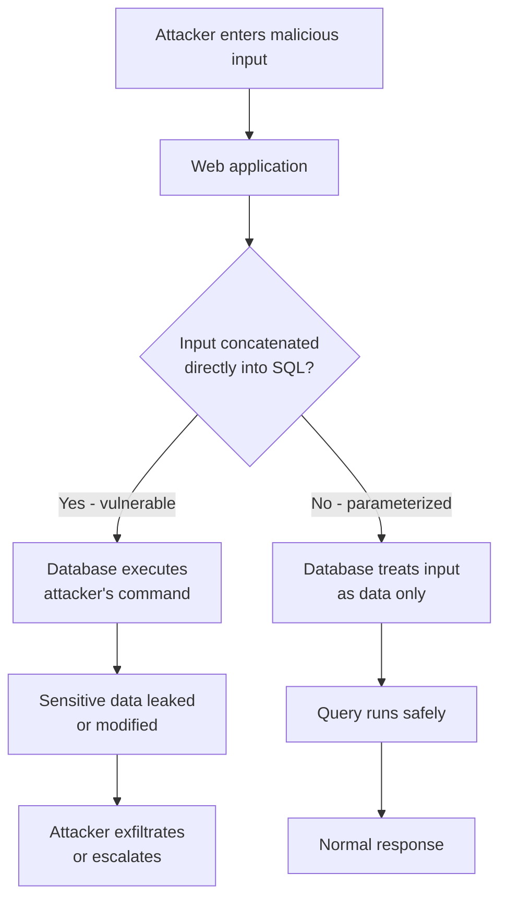

# SQL Injection

> **What you'll learn:** How attackers trick a website's database into running their commands, the main flavors of this attack, the tools and methods used, and exactly how developers and defenders stop it.
> **Prerequisites:** Basic understanding of how web applications talk to databases, a little SQL (the `SELECT ... FROM ... WHERE ...` shape), and comfort using a terminal.

| Course | Course code | Module | Level |
|--------|-------------|--------|-------|
| Skillogic CSPP — Professional Level 2 | SKL-CSP2-711 | Module 07: SQL Injection | level2 |

---

## 1. In Plain English

Imagine you walk up to a bank teller and slide a note through the window that says: *"Withdraw $100 from my account."* The teller reads it, checks your ID, and follows the instruction. Now imagine you write a sneakier note: *"Withdraw $100 from my account — AND ALSO read out every account number and balance in the bank."* If the teller blindly does whatever the note says without separating *your account request* from *general bank commands*, you've just robbed the bank with a pen.

That is exactly what **SQL injection** is. SQL (pronounced "sequel," short for **Structured Query Language**) is the language websites use to talk to their **database** — the organized storage where usernames, passwords, orders, and messages live. When you type your username into a login box, the website builds a sentence in SQL like "find the user whose name equals what they typed." SQL injection happens when an attacker types not just a username, but extra SQL commands — and the website foolishly glues those commands into its sentence and runs them.

Why should a total beginner care? Because SQL injection has been one of the most damaging web vulnerabilities for over two decades. It can leak millions of passwords, expose credit cards, or let an attacker delete an entire database — often through nothing more than a text box. It consistently ranks near the top of the **OWASP Top 10**, the industry's list of the most critical web application risks. Understanding it teaches you the single most important defensive idea in software: **never mix untrusted data with executable commands.**

---

## 2. Core Concepts

### 2.1 What a database query looks like

A **query** is a request sent to a database. A typical login check looks like this:

```sql
SELECT * FROM users WHERE username = 'alice' AND password = 'secret123';
```

This reads: "Give me every column (`*`) from the `users` table where the username is `alice` and the password is `secret123`." The single quotes (`'...'`) mark where **data** starts and ends. Everything outside the quotes is treated as a **command**; everything inside is supposed to be just data.

### 2.2 The root cause: mixing data with code

Many applications build queries by **string concatenation** — literally pasting user input into the middle of a query string:

```python
query = "SELECT * FROM users WHERE username = '" + user_input + "'"
```

If a user types `alice`, the query is fine. But the database has no way to know the boundary between the developer's intended command and the attacker's data — it just sees one final string. If the attacker types something containing a quote character, they can "break out" of the data section and into the command section. This confusion between **code and data** is the entire vulnerability.

### 2.3 Breaking out of the quotes

Suppose an attacker types this into the username box:

```
' OR '1'='1
```

The query becomes:

```sql
SELECT * FROM users WHERE username = '' OR '1'='1';
```

The attacker's leading single quote closed the empty username string early. Now `OR '1'='1'` is read as a *command*, and since `'1'='1'` is always true, the `WHERE` filter matches **every row**. The login check that was supposed to find one matching user now returns all users — often logging the attacker in as the first one (frequently an administrator).

### 2.4 Injection points

An **injection point** is any place user-controlled data flows into a query. These include login forms, search boxes, URL parameters (`?id=5`), HTTP headers (like cookies or `User-Agent`), and even values inside JSON sent by a mobile app. Anywhere data reaches the database is a candidate.

### 2.5 Why it's so impactful

Depending on the database account's permissions, a successful injection can let an attacker **read** any data (`SELECT`), **modify or delete** data (`UPDATE`, `DELETE`, `DROP`), bypass authentication, read files from the server, or in some configurations run operating-system commands. The blast radius depends heavily on how much power the database user account has — a key idea we'll revisit in defenses.

---

## 3. How It Works (Step by Step)

Here is the lifecycle of a typical SQL injection attack against a vulnerable web app:

1. **Find an input.** The attacker identifies a field that reaches the database — say a product page at `https://shop.example/item?id=10`.
2. **Probe for the flaw.** They submit a value with a special character, like `id=10'` (a single quote). If the page returns a database error or behaves oddly, the input is likely injectable.
3. **Confirm control.** They test logic, e.g. `id=10 AND 1=1` (page loads normally) versus `id=10 AND 1=2` (page changes or empties). Different behavior proves the input is being interpreted as SQL.
4. **Determine the database shape.** Using techniques like `UNION SELECT`, the attacker figures out how many columns the query returns and which data types they hold.
5. **Extract data.** They craft a payload that appends a second query pulling sensitive data — usernames, password hashes, schema names — into the visible page.
6. **Escalate.** Depending on permissions, they read configuration files, write a web shell, or pivot deeper into the network.
7. **Cover tracks** (in a real attack) or, in authorized testing, **document and report**.

The diagram below shows the request flow and where the trust boundary is crossed:



---

## 4. Real-World Examples

**TalkTalk (2015).** The UK telecom company TalkTalk suffered a breach in which attackers used SQL injection to access a database containing personal details of well over 100,000 customers, including some bank account information. The UK's data protection regulator issued a then-record fine, and the incident became a textbook case of how a "classic" web flaw still causes massive real-world harm. *(Claim kept to the widely reported facts: SQLi was the entry vector, the regulator fined the company, and a six-figure number of customers were affected.)*

**The "Sony / mass-dump" era and Heartland-style retail breaches.** Across the late 2000s and 2010s, numerous large breaches were attributed at least partly to SQL injection against public-facing web applications, leading to the exposure of payment-card and account data. These repeated incidents are a big reason payment-security standards (like PCI DSS) explicitly require protection against injection.

**Realistic scenario — the vulnerable search box.** A small e-commerce site lets customers search products. The search term is concatenated straight into a query. A penetration tester (with written authorization) enters `widget' UNION SELECT username, password_hash FROM users-- ` into the box. The trailing `-- ` comments out the rest of the original query. The page, designed to show product names and prices, instead lists usernames and password hashes in the product grid. This single field exposed the entire customer table.

---

## 5. Tools of the Trade

### sqlmap

**sqlmap** is the best-known open-source tool for automated SQL injection detection and exploitation. It probes a target with many payloads, identifies the database type, and can dump tables, read files, and more. **Use it only against systems you own or are explicitly authorized to test.**

```bash
# Test a single URL parameter for injection
sqlmap -u "https://shop.example/item?id=10" --batch

# If injectable, enumerate the databases
sqlmap -u "https://shop.example/item?id=10" --dbs --batch

# Dump a specific table from a chosen database
sqlmap -u "https://shop.example/item?id=10" -D shopdb -T users --dump --batch
```

`-u` sets the target URL, `--batch` accepts default prompts automatically, `--dbs` lists databases, and `-D`/`-T`/`--dump` select a database, table, and extract its rows.

### Burp Suite

**Burp Suite** is an intercepting proxy that sits between your browser and the target, letting you view and modify every HTTP request. Its **Repeater** lets you hand-edit a request and resend it; its scanner (Pro) can flag injection automatically.

```
# Conceptual workflow (done in the Burp GUI):
1. Configure browser to use Burp's proxy (127.0.0.1:8080)
2. Capture a request to the search endpoint
3. Send to Repeater, modify the parameter to add a single quote
4. Resend and inspect the response for SQL errors
```

This shows that manual testing is about observing how responses change when you alter input.

### Database CLI clients (for the lab/defender side)

Native clients like `mysql` or `psql` let you reproduce queries and confirm whether a fix works.

```bash
# Connect to a local MySQL lab database
mysql -u labuser -p -h 127.0.0.1 labdb
```

This opens an interactive session so you can run the same query the app runs and verify behavior.

---

## 6. Hands-On Lab (Authorized / Lab-Only)

> **Reminder:** Perform these steps ONLY on systems you own or have explicit written authorization to test. Never point these tools at systems you do not control.

**Goal:** Stand up an intentionally vulnerable app, exploit a SQL injection end-to-end, then apply and verify a defense.

**Build your sandbox.** Create an isolated environment so nothing leaks to the public internet:

- Option A — local VMs: one VM as the "attacker" (e.g., Kali Linux) and one as the "target." Put both on a **host-only network** so they can reach each other but not the outside world.
- Option B — cloud sandbox: a small, firewalled cloud VM with security-group rules restricting access to your own IP only.

**Steps:**

1. **Deploy the target.** On the target VM, run a known-vulnerable training app such as OWASP Juice Shop or DVWA (Damn Vulnerable Web Application) in a container. Note its IP and the login/search endpoints.
2. **Map the app.** From the attacker VM, browse the app through Burp Suite. Identify a parameter that hits the database (a login field or `id` parameter). Record the exact request.
3. **Manual confirmation.** Resend the request via Burp Repeater, appending a single quote to the parameter. Observe whether an error or behavioral change appears — this is your evidence of injectability. Then test `AND 1=1` vs `AND 1=2` to confirm logic control.
4. **Determine columns.** Adapt a `UNION SELECT` payload to find the number of columns the original query returns (try `ORDER BY 1`, `ORDER BY 2`, ... until it errors). You will need to adjust the column count yourself based on the app's responses.
5. **Automate and extract.** Point sqlmap at the confirmed parameter (`sqlmap -u "<your-target-url>" --dbs --batch`). Then enumerate tables and dump a non-sensitive demo table. Compare sqlmap's findings against your manual results.
6. **Try a blind variant.** Switch to an endpoint that returns no data or errors. Use a **time-based** test (a payload that tells the DB to sleep N seconds) and confirm the response delay matches — adapt the sleep value and watch the timing.

**Validate the defense:**

7. **Patch the code.** Modify the vulnerable query to use **parameterized queries** (prepared statements) instead of string concatenation. If you cannot edit the app, place a **WAF** (e.g., ModSecurity with the OWASP Core Rule Set) in front of it.
8. **Re-run the attack.** Repeat steps 3–5 against the patched/protected app. Confirm that your previously successful payloads now fail — the page treats your input as literal data, or the WAF blocks the request.
9. **Verify detection.** Check the application and WAF logs. Confirm that injection attempts generate an alert/log entry. This proves both prevention *and* detection are working.

Document each step with the request, the response, and a screenshot. That record is exactly what a real penetration-test report contains.

---

## 7. Countermeasures & Defenses

**Prevention (the most important layer):**

- **Use parameterized queries / prepared statements.** Send the query structure and the data **separately** so the database never confuses one for the other. This is the single most effective fix.
- **Use safe ORM/query-builder APIs** that parameterize by default — but avoid their "raw query" escape hatches unless they too are parameterized.
- **Apply least privilege** to the database account. The web app's account should only read/write the tables it needs — never use an admin/`root` database user. This shrinks the blast radius if injection still occurs.
- **Validate and constrain input** at the boundary: enforce expected types (an `id` should be an integer), lengths, and allow-lists where the set of valid values is known. Validation is a helpful *supplement*, never a replacement for parameterization.
- **Avoid dynamic SQL** built from strings; if unavoidable (e.g., dynamic table names), strictly allow-list the permitted values.

**Detection & monitoring:**

- Deploy a **WAF** (Web Application Firewall) like ModSecurity + OWASP CRS to spot and block known injection patterns.
- Centralize and alert on **database and application logs** — repeated SQL errors, unusual `UNION`/`SLEEP`/comment sequences, or sudden large result sets are red flags.
- Run **DAST/SAST scanners** and periodic penetration tests to catch flaws before attackers do.

**Mitigation & hardening:**

- Return **generic error messages** to users; log detailed errors only server-side so attackers can't learn the schema from error text.
- Keep database software and libraries patched.
- Use **stored procedures carefully** (they help only if they themselves use parameters, not concatenation).

**On WAF evasion (so defenders understand the limits):** Attackers try to slip past WAFs using tricks like changing letter case (`UnIoN`), inserting inline comments (`UN/**/ION`), URL/hex encoding, whitespace alternatives, or splitting payloads. This is precisely why a WAF is a *supplementary* control: it can be bypassed, so the real fix must live in the code via parameterized queries.

---

## 8. Key Terms

- **SQL** — Structured Query Language; the language used to query and manage relational databases.
- **SQL injection (SQLi)** — Inserting malicious SQL through user input so the database executes attacker-controlled commands.
- **Query** — A command sent to a database to read or modify data.
- **Injection point** — Any input that flows into a database query (form field, URL parameter, header, etc.).
- **In-band injection** — Attack and results travel over the same channel; includes **error-based** (data leaked via error messages) and **UNION-based** (results appended to the app's normal response).
- **Blind injection** — No data is directly returned; the attacker infers it. **Boolean-based** uses true/false page differences; **time-based** uses deliberate delays (e.g., DB sleep) to read data one bit at a time.
- **Out-of-band (OOB) injection** — Data is exfiltrated through a separate channel the attacker controls (e.g., DNS or HTTP callbacks), used when in-band and blind methods are impractical.
- **Parameterized query / prepared statement** — A query where structure and data are sent separately, preventing data from being treated as code.
- **Least privilege** — Granting an account only the minimum permissions it needs.
- **WAF (Web Application Firewall)** — A filter that inspects HTTP traffic and blocks malicious patterns.
- **sqlmap** — An open-source tool that automates SQL injection detection and exploitation.

---

## 9. Summary & Takeaways

- SQL injection happens when **untrusted input is mixed with SQL commands**, letting attackers run their own database queries.
- It stems from **string-concatenated queries**; the database can't tell the developer's command from the attacker's data.
- The main families are **in-band** (error-based, UNION-based), **blind** (boolean- and time-based), and **out-of-band** — they differ in *how the attacker gets the data back*.
- A repeatable **methodology** — find input, probe, confirm logic control, map the schema, extract, escalate — drives both attackers and authorized testers.
- **sqlmap** and **Burp Suite** automate and assist testing; use them only with authorization.
- **WAFs help but can be evaded** (case-swapping, comments, encoding), so they are a supplement, never the primary fix.
- The definitive cure is **parameterized queries**, backed by **least privilege**, **input validation**, **generic errors**, and **logging/monitoring**.
- Always practice offensive techniques in an **isolated, owned lab**, and validate that your defenses both *prevent* and *detect* the attack.

**Further reading:** OWASP Top 10 and the OWASP SQL Injection Prevention Cheat Sheet; NIST SP 800-115 (Technical Guide to Information Security Testing and Assessment); MITRE CWE-89 (Improper Neutralization of Special Elements used in an SQL Command) and the MITRE ATT&CK technique for Exploitation of Public-Facing Applications; PortSwigger Web Security Academy (Burp Suite) SQL injection materials.
