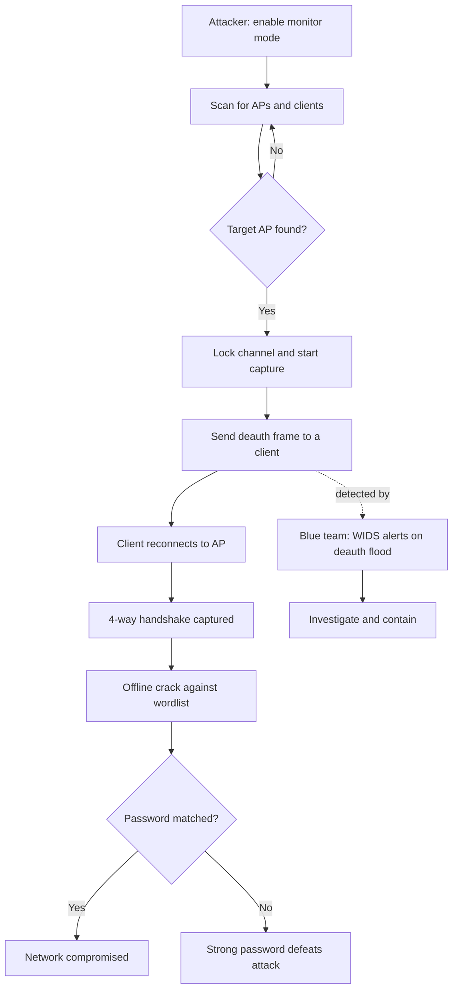

# Hacking Wireless Networks

> **What you'll learn:** How Wi-Fi networks work, how attackers break their encryption, the tools and methodology behind wireless attacks, and how defenders stop them.
> **Prerequisites:** Basic networking (IP addresses, MAC addresses), familiarity with the Linux command line, and the earlier modules on footprinting and packet capture.

| | |
|---|---|
| **Course** | Professional Level 2 |
| **Course code** | SKL-CSP2-711 |
| **Module** | Module 08 — Hacking Wireless Networks |
| **Level** | level2 |

---

## 1. In Plain English

Imagine your home Wi-Fi router is a radio station, broadcasting in every direction through the walls of your house and out into the street. Unlike a wired network — where someone would need to physically plug a cable into your wall — anyone sitting in a parked car outside can *hear* that radio signal. They don't need permission to listen; the airwaves are public. The only thing protecting your private conversations (your banking, your messages, your passwords) is **encryption**: the network scrambles the radio signal so eavesdroppers hear gibberish instead of your data.

Wireless hacking is the study of how attackers try to either *break* that scrambling or *trick* you into handing over the key. A "total beginner" should care because almost every device you own talks over Wi-Fi, and a weakly protected network is one of the easiest ways for a criminal to get a foothold inside your digital life — without ever touching your computer.

Think of the encryption key like the lock on your front door. Some locks (an old standard called WEP) can be picked in minutes by someone who knows the trick. Better locks (WPA2, WPA3) are far stronger — but a clever attacker might still trick you into *giving them a copy of the key* by pretending to be your router. This module teaches you both the lock-picking and the lock-making.

Everything here is taught so you can **defend** networks and test systems you own or are authorized to test. Attacking someone else's Wi-Fi is illegal in nearly every country.

---

## 2. Core Concepts

### 2.1 Wireless networking basics

A **Wi-Fi network** lets devices communicate using radio waves instead of cables, following the **IEEE 802.11** family of standards (802.11n, 802.11ac, 802.11ax/"Wi-Fi 6", etc.). Key terms:

- **Access Point (AP):** The device (usually your router) that broadcasts the network and connects wireless clients to the internet.
- **Client / Station (STA):** Any device connecting to the AP — a phone, laptop, smart bulb.
- **SSID (Service Set Identifier):** The human-readable network name, e.g. "HomeNet_5G". The AP advertises it in **beacon frames** many times per second.
- **BSSID:** The MAC address (a unique 48-bit hardware identifier) of the access point's radio. It uniquely identifies *that* AP even if two networks share an SSID.
- **Channel:** A specific slice of radio frequency. Wi-Fi uses the 2.4 GHz, 5 GHz, and (in Wi-Fi 6E) 6 GHz bands, each divided into channels.

### 2.2 Wireless frames

802.11 traffic is carried in **frames**, split into three types:

- **Management frames** — set up and tear down connections (beacons, probe requests, authentication, association, and importantly **deauthentication** frames).
- **Control frames** — coordinate access to the airwaves (acknowledgements, request-to-send).
- **Data frames** — carry the actual user payload (your web traffic).

A crucial historical weakness: in older standards, management frames were **not authenticated**, meaning anyone could forge a "deauthentication" frame and kick a device off the network. This is the basis of several attacks.

### 2.3 Wireless encryption standards

Encryption protects data frames so eavesdroppers can't read them. The standards evolved as each one was broken:

| Standard | Year | Cipher | Status |
|---|---|---|---|
| **WEP** (Wired Equivalent Privacy) | 1997 | RC4 + 24-bit IV | **Broken** — crackable in minutes |
| **WPA** (Wi-Fi Protected Access) | 2003 | RC4 + TKIP | Deprecated — interim fix for WEP |
| **WPA2** | 2004 | AES-CCMP | Widely used; vulnerable to offline cracking of weak passwords |
| **WPA3** | 2018 | AES + SAE | Current best; resists offline cracking |

- **WEP** used the RC4 stream cipher with a tiny 24-bit **Initialization Vector (IV)** — a random value meant to make each packet's encryption unique. The IV space was so small that values repeated quickly; by capturing enough packets and analysing the repeated IVs, an attacker recovers the key. WEP is considered completely insecure.
- **WPA** patched WEP by adding **TKIP (Temporal Key Integrity Protocol)**, which rotated keys per packet. It bought time but still relied on RC4 and is now deprecated.
- **WPA2** introduced **CCMP**, based on the strong **AES** block cipher. Its main weakness isn't the cipher — it's that the **4-way handshake** (the exchange that proves both sides know the password) can be captured and the password guessed *offline* by brute force. Weak passwords fall quickly.
- **WPA3** replaces the handshake with **SAE (Simultaneous Authentication of Equals)**, also called **Dragonfly**. SAE provides *forward secrecy* and resists offline guessing: an attacker who captures the exchange cannot brute-force it without interacting live with the AP for every guess, which is detectable and slow.

**Personal vs Enterprise:** WPA2/3-**Personal (PSK)** uses one shared password for everyone. WPA2/3-**Enterprise** uses **802.1X/EAP** with a RADIUS server, giving each user unique credentials — far harder to attack at scale.

### 2.4 Wireless threats (the attacker's options)

- **Eavesdropping / sniffing:** Passively capturing traffic. On open or WEP networks, payloads are readable directly.
- **Rogue access point:** An unauthorized AP plugged into the corporate network, creating an unmonitored back door.
- **Evil twin:** A fake AP broadcasting the *same SSID* as a legitimate one, luring victims to connect so the attacker can intercept traffic (a man-in-the-middle position).
- **Deauthentication (deauth) attack:** Forging management frames to forcibly disconnect clients — used to capture handshakes or to deny service.
- **Handshake capture + offline cracking:** Recording the WPA2 4-way handshake and guessing the password offline.
- **WPS attacks:** **Wi-Fi Protected Setup** PINs are only 8 digits and validated in two halves, making them brute-forceable (the "Reaver"/Pixie-Dust class of attacks).
- **KRACK (Key Reinstallation Attack):** A 2017 flaw in the WPA2 handshake that let attackers force reuse of an encryption key. Fixed by patches.

### 2.5 Monitor mode and packet injection

To attack or audit Wi-Fi, the wireless card must support:

- **Monitor mode:** Listening to *all* nearby frames, not just those addressed to you (similar to "promiscuous mode" on wired NICs).
- **Packet injection:** Transmitting crafted frames (e.g. deauth frames). Not all chipsets support this; lab setups use known-compatible USB adapters.

---

## 3. How It Works (Step by Step)

The most common modern attack is **WPA2-Personal handshake capture and offline cracking**. Here is the flow, end to end.

1. **Enable monitor mode** on the wireless adapter so it can hear all traffic on a channel.
2. **Scan** the area to discover nearby APs, their BSSIDs, channels, and connected clients.
3. **Lock onto the target** AP's channel and begin capturing frames to a file.
4. **Wait for, or force, a handshake.** A handshake happens whenever a client (re)connects. To speed this up, the attacker sends a **deauth frame** to a connected client, forcing it to reconnect — and the reconnection produces a fresh 4-way handshake.
5. **Capture the 4-way handshake** — four encrypted messages that prove knowledge of the password. This does *not* reveal the password, but contains enough to verify guesses.
6. **Crack offline.** Using a wordlist (dictionary) or brute force, the attacker computes the expected handshake for each candidate password and compares. A match reveals the password. Strong, long, random passwords make this infeasible.

The defender's job is to make steps 4–6 fail: detect the deauth flood, and ensure passwords are too strong to crack.



---

## 4. Real-World Examples

**TJX / TJ Maxx breach (2005–2007).** Attackers exploited **WEP** at retail store wireless networks to gain entry, ultimately exposing tens of millions of payment card records. It remains a textbook example of how a weak wireless standard becomes the doorway into an entire enterprise — and a key reason WEP was abandoned.

**KRACK vulnerability (2017).** Security researcher Mathy Vanhoef disclosed the **Key Reinstallation Attack**, a flaw in the WPA2 4-way handshake itself (not a weak password). It allowed an attacker within range to force reinstallation of an already-in-use key, enabling decryption or replay of traffic. Because it was a protocol flaw, virtually every WPA2 device was affected until vendors shipped patches — a reminder that even "strong" standards need maintenance.

**Evil-twin attacks at public venues.** A recurring real-world scenario: an attacker sets up a fake AP named identically to airport, café, or hotel Wi-Fi. Victims' devices, configured to auto-join known names, connect to the rogue AP. The attacker then sits in the middle of all traffic. This requires no encryption cracking at all — it exploits human and device trust.

---

## 5. Tools of the Trade

> All tools below are for use on networks you own or are explicitly authorized to test.

### Aircrack-ng suite
The flagship wireless auditing toolkit. It is a *suite* of small programs:

- `airmon-ng` — puts the adapter into monitor mode.
- `airodump-ng` — scans and captures frames/handshakes.
- `aireplay-ng` — injects frames (e.g. deauth).
- `aircrack-ng` — performs the offline crack.

```bash
# Put wlan0 into monitor mode (creates wlan0mon)
sudo airmon-ng start wlan0

# Scan all nearby networks to identify the target's BSSID and channel
sudo airodump-ng wlan0mon

# Capture handshake on the target channel, writing to capture files
sudo airodump-ng --bssid AA:BB:CC:DD:EE:FF --channel 6 -w capture wlan0mon
```
The first command enables listening to all frames; the second lists APs; the third focuses on one AP and saves captured traffic (including any handshake) to files named `capture-01.cap`, etc.

### Kismet
A passive wireless detector and **WIDS** (Wireless Intrusion Detection System). It discovers networks and devices without transmitting, making it useful for both reconnaissance auditing and *defensive* monitoring.

```bash
# Launch Kismet listening on a monitor-mode interface
sudo kismet -c wlan0mon
```
Kismet logs every device it sees and can flag suspicious activity such as deauth floods or rogue APs.

### Wireshark
The standard packet analyzer. With a monitor-mode capture, you can inspect 802.11 frames and filter for handshakes or deauth frames.

```text
# Wireshark display filter to show only deauthentication frames
wlan.fc.type_subtype == 0x0c
```
This filter isolates deauth frames so you can spot an active deauth attack.

### Hashcat
A high-speed password-cracking tool. Aircrack-ng can export a captured handshake to a hash format that Hashcat cracks using GPU acceleration and large wordlists. Used in audits to test whether a chosen Wi-Fi password is strong enough.

```bash
# Crack a WPA2 handshake (mode 22000) against a wordlist
hashcat -m 22000 capture.hc22000 wordlist.txt
```
`-m 22000` selects the WPA-PBKDF2 hash mode; the command tests each word as a candidate password.

---

## 6. Hands-On Lab (Authorized / Lab-Only)

> **Reminder: Perform this only on a wireless network and devices you personally own or are explicitly authorized in writing to test.** Capturing or attacking third-party Wi-Fi is illegal.

**Goal:** Stand up an isolated wireless lab, capture and attempt to crack your *own* WPA2 handshake, then prove a defender can detect the attack.

**Lab build:**
- A spare Wi-Fi router you own, set to **WPA2-Personal** with a *deliberately weak* test password (e.g. `password123`). Keep it physically isolated — not connected to your real home/work network.
- An attacker machine: a laptop running Kali Linux (or a VM with a USB Wi-Fi adapter that supports monitor mode and injection — VMs can't use the host's built-in card).
- A "victim" device: a second phone or laptop you own, connected to the test router.
- A defender machine running Kismet (can be the same Kali box with a second adapter, or a Raspberry Pi). Cloud sandboxes don't have radios, so wireless labs must be physical — but you can use a cloud VM for the *cracking* step.

**Steps (adapt the interface names, BSSID, and channel to your gear):**

1. Enable monitor mode and confirm with `airmon-ng start wlan0` then `iwconfig`.
2. Scan with `airodump-ng` and record your test router's **BSSID** and **channel**.
3. In one terminal, start a focused capture on that BSSID/channel and write to disk.
4. In a second terminal, send a small, targeted deauth burst to your *own* victim device with `aireplay-ng --deauth`. Watch the airodump screen for the `WPA handshake:` notice.
5. Stop capturing once the handshake is recorded.
6. Move the `.cap` file to a machine with a GPU (or cloud GPU VM), convert it to `hc22000`, and run Hashcat against a small wordlist that *contains* your weak password. Confirm it cracks.
7. **Now change the router password** to a 16+ character random passphrase, re-capture, and re-run Hashcat against the same wordlist. Confirm it does **not** crack — demonstrating why password strength matters.

**Validate the defense (detection):**
8. Before repeating the deauth, start Kismet on the defender machine.
9. Run the deauth burst again and confirm Kismet (or a Wireshark filter `wlan.fc.type_subtype == 0x0c`) flags the spike in deauthentication frames.
10. Document the timestamps and source MAC of the deauth frames — this is exactly the evidence a blue team would collect during an incident.

**Cleanup:** Reset the router, disable monitor mode (`airmon-ng stop`), and securely delete capture files.

---

## 7. Countermeasures & Defenses

**Encryption & authentication**
- Use **WPA3** where supported; otherwise **WPA2-AES (CCMP)**. Never use WEP or WPA/TKIP.
- For organizations, deploy **WPA2/3-Enterprise (802.1X/EAP)** with a RADIUS server so each user has unique credentials.
- Enable **Protected Management Frames (PMF / 802.11w)** — this authenticates management frames and blocks classic deauth attacks. PMF is mandatory in WPA3.

**Passwords & configuration**
- Use long (16+ character), random passphrases that resist dictionary and brute-force cracking.
- **Disable WPS** — its 8-digit PIN is brute-forceable.
- Change default admin credentials and SSIDs; keep router firmware patched (KRACK and similar flaws are fixed via updates).

**Detection & monitoring**
- Deploy a **WIDS/WIPS** (Wireless Intrusion Detection/Prevention System), e.g. Kismet or commercial controller-based systems, to alert on deauth floods, rogue APs, and evil twins.
- Maintain an inventory of authorized BSSIDs; alert on any unknown AP advertising your SSID.
- Watch for anomalous reconnection patterns and management-frame spikes.

**Architecture**
- Segment guest, IoT, and corporate Wi-Fi onto separate VLANs so a compromised wireless segment can't reach sensitive systems.
- Reduce signal leakage where practical (AP placement, power tuning) so the network isn't broadcast across the street.
- Educate users not to auto-join open networks and to verify they're on the real AP.

---

## 8. Key Terms

- **SSID** — the human-readable name of a Wi-Fi network, broadcast in beacon frames.
- **BSSID** — the MAC address of an access point's radio, uniquely identifying it.
- **Access Point (AP)** — device that broadcasts a Wi-Fi network and bridges clients to the wired network.
- **Monitor mode** — adapter mode that captures *all* nearby 802.11 frames, not just addressed ones.
- **Packet injection** — transmitting crafted frames such as deauth packets.
- **WEP** — obsolete 1997 encryption using RC4 with a weak 24-bit IV; trivially broken.
- **WPA2** — AES-CCMP based standard; secure cipher but weak passwords are crackable offline.
- **WPA3 / SAE** — current standard using the Dragonfly (SAE) handshake, resistant to offline cracking.
- **4-way handshake** — the WPA2 message exchange proving both sides know the password; can be captured and cracked offline.
- **Deauthentication attack** — forging management frames to disconnect clients, often to force a handshake.
- **Evil twin** — a rogue AP impersonating a legitimate SSID to intercept traffic.
- **WPS** — Wi-Fi Protected Setup; its short PIN makes it brute-forceable.
- **KRACK** — 2017 key-reinstallation flaw in the WPA2 handshake, since patched.
- **PMF (802.11w)** — Protected Management Frames; authenticates management frames to stop deauth attacks.
- **WIDS/WIPS** — systems that detect/prevent wireless attacks like rogue APs and deauth floods.

---

## 9. Summary & Takeaways

- Wi-Fi is a broadcast radio medium — anyone in range can listen, so **encryption is the only barrier**.
- Encryption standards evolved by necessity: **WEP → WPA → WPA2 → WPA3**; use WPA3 or WPA2-AES, never WEP or TKIP.
- The dominant modern attack captures the **WPA2 4-way handshake** (often by forcing a reconnection with a **deauth** frame) and cracks the password **offline** — so **long, random passwords are your strongest defense**.
- **WPA3's SAE handshake** resists offline cracking, and **Protected Management Frames** neutralize classic deauth attacks.
- Not all attacks require breaking crypto: **evil twins** and **rogue APs** exploit trust, while **WPS** PINs and unpatched **KRACK**-style flaws exploit configuration and protocol weaknesses.
- The **Aircrack-ng suite** is the core auditing toolkit; **Kismet** and **Wireshark** support both offense and defensive detection; **Hashcat** tests password strength.
- Defense is layered: strong encryption, strong passwords, disabled WPS, patched firmware, network segmentation, and a **WIDS/WIPS** to detect attacks in progress.
- All testing must be on owned or explicitly authorized systems.

**Further reading:** NIST SP 800-153 (Guidelines for Securing Wireless LANs); Wi-Fi Alliance WPA3 specification; MITRE ATT&CK techniques for Network Sniffing and Adversary-in-the-Middle; OWASP guidance on wireless and man-in-the-middle attacks.
