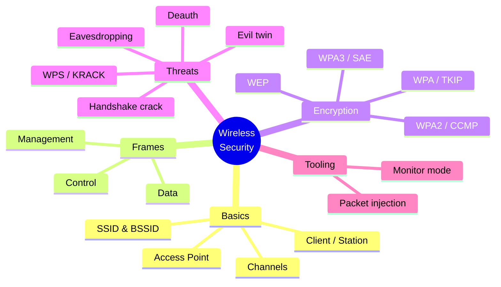
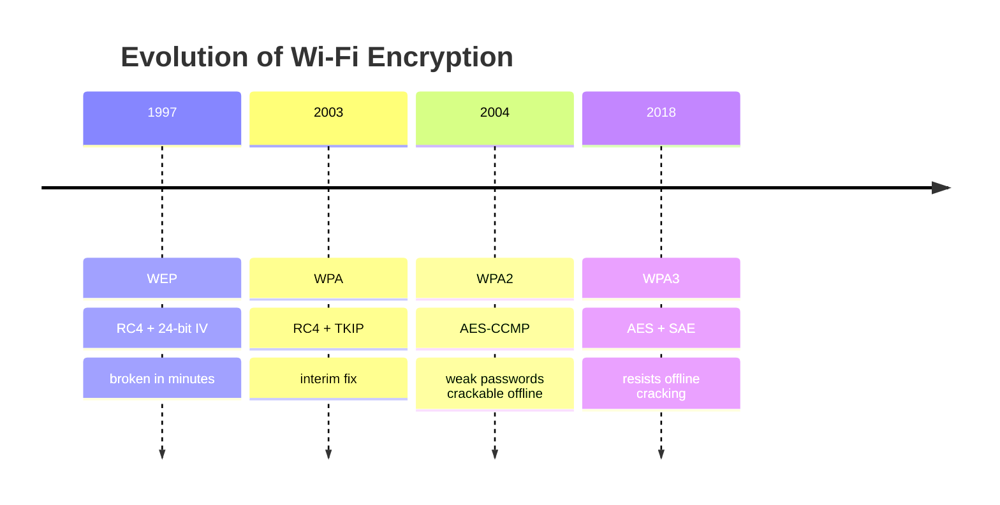
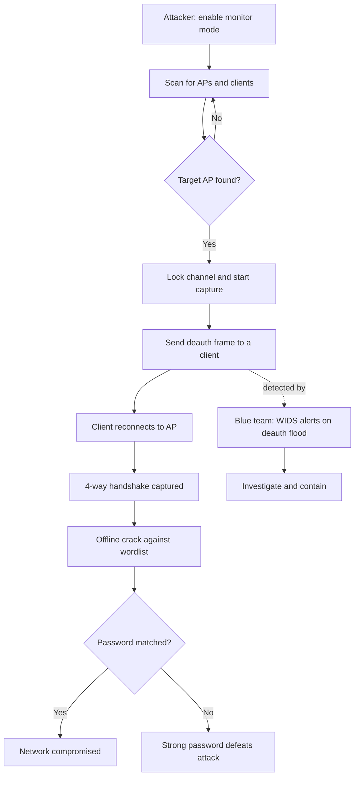
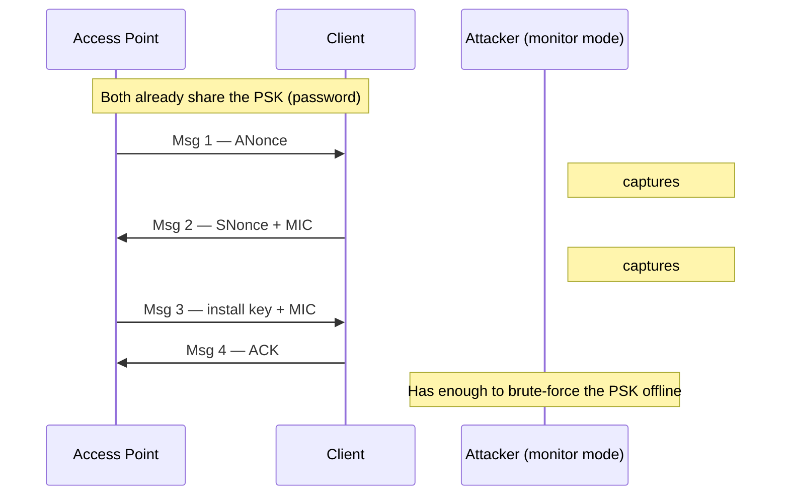
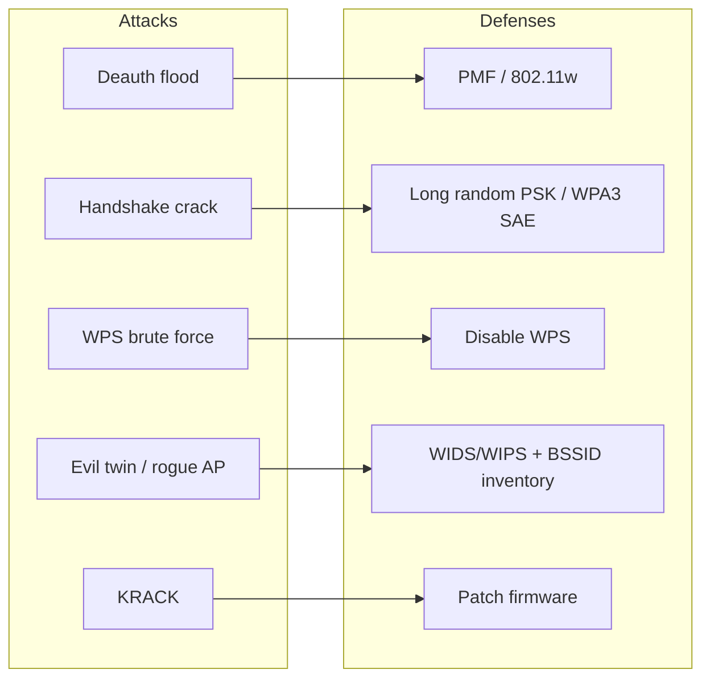

# Hacking Wireless Networks 📡

> **What you'll learn:** How Wi-Fi works, how attackers break its encryption, the tools and methodology behind wireless attacks, and how defenders stop them.
> **Prerequisites:** Basic networking (IP/MAC addresses), the Linux command line, and the earlier modules on footprinting and packet capture.

| | |
|---|---|
| **Course** | Professional Level 2 |
| **Course code** | SKL-CSP2-711 |
| **Module** | Module 08 — Hacking Wireless Networks |
| **Level** | level2 |

---

## 1. In Plain English 🗣️

Your Wi-Fi router is a radio station, broadcasting through your walls and out into the street. Unlike a wired network — where someone must physically plug into your wall — anyone in a parked car outside can simply *listen*. The airwaves are public. The only thing protecting your banking, messages, and passwords is **encryption**: the network scrambles the signal so eavesdroppers hear gibberish.

Wireless hacking studies how attackers either *break* that scrambling or *trick* you into handing over the key. Beginners should care because almost every device you own talks over Wi-Fi, and a weak network is one of the easiest footholds into your digital life — without ever touching your computer.

> 🔑 **Key idea:** Think of the encryption key as your front-door lock. **WEP** is an old lock that picks in minutes. **WPA2/WPA3** are far stronger — but a clever attacker can still trick you into *handing over a copy of the key* by impersonating your router.

> ⚠️ **Warning:** Everything here is for **defending** networks and testing systems you own or are authorized to test. Attacking someone else's Wi-Fi is illegal in nearly every country.

---

## 2. Core Concepts 🧩



### 2.1 Wireless networking basics

A **Wi-Fi network** lets devices communicate over radio waves instead of cables, following the **IEEE 802.11** family (802.11n, 802.11ac, 802.11ax/"Wi-Fi 6", etc.).

| Term | Meaning |
|---|---|
| **Access Point (AP)** | The device (your router) that broadcasts the network and bridges clients to the internet. |
| **Client / Station (STA)** | Any connecting device — phone, laptop, smart bulb. |
| **SSID** | The human-readable network name (e.g. `HomeNet_5G`), advertised many times/second in **beacon frames**. |
| **BSSID** | The MAC address (48-bit hardware ID) of the AP's radio. Identifies *that* AP even when two networks share an SSID. |
| **Channel** | A slice of radio frequency. Wi-Fi uses 2.4 GHz, 5 GHz, and (Wi-Fi 6E) 6 GHz bands, each divided into channels. |

### 2.2 Wireless frames

802.11 traffic travels in **frames** of three types:

- **Management frames** — set up and tear down connections (beacons, probe requests, authentication, association, and importantly **deauthentication**).
- **Control frames** — coordinate access to the airwaves (acknowledgements, request-to-send).
- **Data frames** — carry the actual user payload (your web traffic).

> ⚠️ **Warning:** Historically, management frames were **not authenticated** — so anyone could forge a "deauthentication" frame and kick a device off the network. This is the root of several attacks (see §2.4).

### 2.3 Wireless encryption standards

Encryption protects data frames from eavesdroppers. Each standard was created because the previous one broke:



| Standard | Year | Cipher | Status |
|---|---|---|---|
| 🔴 **WEP** (Wired Equivalent Privacy) | 1997 | RC4 + 24-bit IV | **Broken** — crackable in minutes |
| 🟠 **WPA** (Wi-Fi Protected Access) | 2003 | RC4 + TKIP | Deprecated — interim fix for WEP |
| 🟡 **WPA2** | 2004 | AES-CCMP | Widely used; weak passwords crack offline |
| 🟢 **WPA3** | 2018 | AES + SAE | Current best; resists offline cracking |

- **WEP** used RC4 with a tiny 24-bit **Initialization Vector (IV)** — a value meant to make each packet's encryption unique. The IV space was so small that values repeated quickly; capture enough packets, analyse the repeats, and the key falls out. Completely insecure.
- **WPA** added **TKIP (Temporal Key Integrity Protocol)** to rotate keys per packet. It bought time but still relied on RC4 and is now deprecated.
- **WPA2** introduced **CCMP** on the strong **AES** block cipher. Its weakness isn't the cipher — it's that the **4-way handshake** (proving both sides know the password) can be captured and the password guessed *offline*. Weak passwords fall quickly.
- **WPA3** replaces the handshake with **SAE (Simultaneous Authentication of Equals)**, a.k.a. **Dragonfly**. SAE gives *forward secrecy* and resists offline guessing: an attacker must interact live with the AP for every guess — slow and detectable.

> 🔑 **Key idea:** **Personal vs Enterprise** — WPA2/3-**Personal (PSK)** uses one shared password for everyone. WPA2/3-**Enterprise** uses **802.1X/EAP** with a RADIUS server, giving each user unique credentials — far harder to attack at scale.

### 2.4 Wireless threats (the attacker's options)

| Threat | What it does | Breaks crypto? |
|---|---|---|
| 👂 **Eavesdropping / sniffing** | Passively captures traffic; readable on open/WEP nets | No |
| 🔌 **Rogue access point** | Unauthorized AP on the corporate net — an unmonitored back door | No |
| 👯 **Evil twin** | Fake AP with the *same SSID*, luring victims into a man-in-the-middle | No |
| 🚪 **Deauthentication attack** | Forges management frames to disconnect clients (capture handshake or deny service) | No |
| 🤝 **Handshake capture + offline crack** | Records the WPA2 4-way handshake, guesses the password offline | Yes |
| 🔢 **WPS attacks** | The 8-digit PIN is validated in two halves → brute-forceable (Reaver / Pixie-Dust) | Config flaw |
| 🔁 **KRACK** | 2017 flaw forcing reuse of a WPA2 encryption key; fixed by patches | Protocol flaw |

### 2.5 Monitor mode and packet injection

To attack or audit Wi-Fi, the wireless card must support:

- **Monitor mode** — listening to *all* nearby frames, not just those addressed to you (like "promiscuous mode" on wired NICs).
- **Packet injection** — transmitting crafted frames (e.g. deauth). Not all chipsets support this; labs use known-compatible USB adapters.

---

## 3. How It Works (Step by Step) ⚙️

The most common modern attack is **WPA2-Personal handshake capture and offline cracking**. End to end:

| Step | Action | Why |
|---|---|---|
| 1️⃣ | Enable **monitor mode** | Hear all traffic on a channel |
| 2️⃣ | **Scan** the area | Discover APs, BSSIDs, channels, clients |
| 3️⃣ | **Lock onto** the target channel, start capture | Focus on one AP |
| 4️⃣ | **Force a handshake** with a deauth frame | A reconnecting client produces a fresh 4-way handshake |
| 5️⃣ | **Capture the 4-way handshake** | Four encrypted messages prove password knowledge — enough to *verify* guesses |
| 6️⃣ | **Crack offline** with a wordlist/brute force | Compute the expected handshake per candidate, compare for a match |

> 💡 **Tip:** The 4-way handshake never reveals the password directly — it only lets the attacker *test* guesses. Long, random passwords make step 6 infeasible. The defender's job is to make steps 4–6 fail: detect the deauth flood, and use uncrackable passwords.



The 4-way handshake itself, where the attacker eavesdrops:



> 🖼️ *Suggested image: annotated airodump-ng terminal showing the "WPA handshake: AA:BB:CC..." notice appearing top-right after a deauth.*

---

## 4. Real-World Examples 🌍

**TJX / TJ Maxx breach (2005–2007).** Attackers exploited **WEP** on retail store Wi-Fi to gain entry, ultimately exposing tens of millions of payment card records. A textbook case of a weak wireless standard becoming the doorway into an entire enterprise — and a key reason WEP was abandoned.

**KRACK vulnerability (2017).** Researcher Mathy Vanhoef disclosed the **Key Reinstallation Attack**, a flaw in the WPA2 4-way handshake itself (not a weak password). An attacker in range could force reinstallation of an in-use key, enabling decryption or replay. Because it was a *protocol* flaw, virtually every WPA2 device was affected until vendors patched — proof that even strong standards need maintenance.

**Evil-twin attacks at public venues.** An attacker stands up a fake AP named identically to airport, café, or hotel Wi-Fi. Victims' devices auto-join the known name and connect to the rogue AP, putting the attacker in the middle of all traffic. No encryption cracking required — it exploits human and device trust.

> 💡 **Tip:** Two of these three (evil twin, KRACK) needed **zero password cracking**. Defenders must guard against trust- and protocol-level attacks, not just weak passwords.

---

## 5. Tools of the Trade 🛠️

> ⚠️ **Warning:** All tools below are for networks you own or are explicitly authorized to test.

| Tool | Role | Offense / Defense |
|---|---|---|
| **Aircrack-ng suite** | Monitor mode, scan, inject, crack | Offense (audit) |
| **Kismet** | Passive detector + WIDS | Both |
| **Wireshark** | 802.11 frame analysis | Both |
| **Hashcat** | GPU password cracking | Offense (audit) |

### Aircrack-ng suite
The flagship wireless auditing toolkit — a *suite* of small programs:

| Program | Job |
|---|---|
| `airmon-ng` | Put the adapter into monitor mode |
| `airodump-ng` | Scan and capture frames/handshakes |
| `aireplay-ng` | Inject frames (e.g. deauth) |
| `aircrack-ng` | Perform the offline crack |

```bash
# Put wlan0 into monitor mode (creates wlan0mon)
sudo airmon-ng start wlan0

# Scan all nearby networks to identify the target's BSSID and channel
sudo airodump-ng wlan0mon

# Capture handshake on the target channel, writing to capture files
sudo airodump-ng --bssid AA:BB:CC:DD:EE:FF --channel 6 -w capture wlan0mon
```
The first command enables listening to all frames; the second lists APs; the third focuses on one AP and saves traffic (including any handshake) to files named `capture-01.cap`, etc.

### Kismet
A passive wireless detector and **WIDS** (Wireless Intrusion Detection System). It discovers networks and devices *without transmitting*, useful for both reconnaissance and **defensive** monitoring.

```bash
# Launch Kismet listening on a monitor-mode interface
sudo kismet -c wlan0mon
```
Kismet logs every device it sees and flags suspicious activity such as deauth floods or rogue APs.

### Wireshark
The standard packet analyzer. With a monitor-mode capture, you can inspect 802.11 frames and filter for handshakes or deauth frames.

```text
# Wireshark display filter: show only deauthentication frames
wlan.fc.type_subtype == 0x0c
```
This isolates deauth frames so you can spot an active deauth attack.

### Hashcat
A high-speed password cracker. Aircrack-ng exports a captured handshake to a hash format Hashcat cracks with GPU acceleration and large wordlists — used in audits to test whether a Wi-Fi password is strong enough.

```bash
# Crack a WPA2 handshake (mode 22000) against a wordlist
hashcat -m 22000 capture.hc22000 wordlist.txt
```
`-m 22000` selects the WPA-PBKDF2 hash mode; the command tests each word as a candidate password.

> 🖼️ *Suggested image: Hashcat status screen showing Recovered/Speed/ETA while cranking a WPA handshake on a GPU.*

---

## 6. Hands-On Lab (Authorized / Lab-Only) 🧪

> ⚠️ **Warning:** Perform this **only** on a wireless network and devices you personally own or are explicitly authorized in writing to test. Capturing or attacking third-party Wi-Fi is illegal.

**Goal:** Stand up an isolated wireless lab, capture and attempt to crack your *own* WPA2 handshake, then prove a defender can detect the attack.

**Lab build:**

| Role | Setup |
|---|---|
| 🎯 **Target AP** | A spare router you own, set to **WPA2-Personal** with a *deliberately weak* test password (e.g. `password123`). Keep it physically isolated from your real network. |
| 🦹 **Attacker** | Kali Linux laptop, or a VM with a USB Wi-Fi adapter supporting monitor mode + injection (VMs can't use the host's built-in card). |
| 📱 **Victim** | A second phone/laptop you own, connected to the test router. |
| 🛡️ **Defender** | Kismet on the same Kali box (second adapter) or a Raspberry Pi. |

> 💡 **Tip:** Cloud sandboxes have no radios, so the *capture* must be physical — but you can offload the *cracking* step to a cloud GPU VM.

**Attack & password-strength steps** (adapt interface names, BSSID, channel to your gear):

1. Enable monitor mode and confirm: `airmon-ng start wlan0`, then `iwconfig`.
2. Scan with `airodump-ng`; record your test router's **BSSID** and **channel**.
3. Terminal 1: start a focused capture on that BSSID/channel, writing to disk.
4. Terminal 2: send a small, targeted deauth burst at your *own* victim with `aireplay-ng --deauth`. Watch airodump for the `WPA handshake:` notice.
5. Stop capturing once the handshake is recorded.
6. Move the `.cap` to a GPU machine (or cloud GPU VM), convert to `hc22000`, and run Hashcat against a small wordlist that *contains* your weak password. Confirm it cracks.
7. **Now change the router password** to a 16+ character random passphrase, re-capture, and re-run Hashcat against the same wordlist. Confirm it does **not** crack — proving why password strength matters.

**Validate the defense (detection):**

8. Before repeating the deauth, start Kismet on the defender machine.
9. Run the deauth burst again; confirm Kismet (or Wireshark filter `wlan.fc.type_subtype == 0x0c`) flags the spike in deauthentication frames.
10. Document the timestamps and source MAC of the deauth frames — exactly the evidence a blue team collects during an incident.

**Cleanup:** Reset the router, disable monitor mode (`airmon-ng stop`), and securely delete capture files.

---

## 7. Countermeasures & Defenses 🛡️



**🔐 Encryption & authentication**
- Use **WPA3** where supported; otherwise **WPA2-AES (CCMP)**. Never use WEP or WPA/TKIP.
- For organizations, deploy **WPA2/3-Enterprise (802.1X/EAP)** with a RADIUS server so each user has unique credentials.
- Enable **Protected Management Frames (PMF / 802.11w)** — authenticates management frames and blocks classic deauth attacks. PMF is mandatory in WPA3.

**🔑 Passwords & configuration**
- Use long (16+ character), random passphrases that resist dictionary and brute-force cracking.
- **Disable WPS** — its 8-digit PIN is brute-forceable.
- Change default admin credentials and SSIDs; keep firmware patched (KRACK and similar are fixed via updates).

**🔍 Detection & monitoring**
- Deploy a **WIDS/WIPS** (e.g. Kismet or commercial controllers) to alert on deauth floods, rogue APs, and evil twins.
- Maintain an inventory of authorized BSSIDs; alert on any unknown AP advertising your SSID.
- Watch for anomalous reconnection patterns and management-frame spikes.

**🏗️ Architecture**
- Segment guest, IoT, and corporate Wi-Fi onto separate VLANs so a compromised segment can't reach sensitive systems.
- Reduce signal leakage where practical (AP placement, power tuning) so the network isn't broadcast across the street.
- Educate users not to auto-join open networks and to verify they're on the real AP.

| Attack | Primary defense |
|---|---|
| Deauth flood | PMF (802.11w) |
| Offline handshake crack | Long random PSK / WPA3 SAE |
| WPS PIN brute force | Disable WPS |
| Evil twin / rogue AP | WIDS/WIPS + BSSID inventory + user training |
| KRACK & protocol flaws | Patched firmware |

---

## 8. Key Terms 📖

- **SSID** — the human-readable name of a Wi-Fi network, broadcast in beacon frames.
- **BSSID** — the MAC address of an access point's radio, uniquely identifying it.
- **Access Point (AP)** — device that broadcasts a Wi-Fi network and bridges clients to the wired network.
- **Monitor mode** — adapter mode that captures *all* nearby 802.11 frames, not just addressed ones.
- **Packet injection** — transmitting crafted frames such as deauth packets.
- **WEP** — obsolete 1997 encryption using RC4 with a weak 24-bit IV; trivially broken.
- **WPA2** — AES-CCMP based standard; secure cipher but weak passwords crack offline.
- **WPA3 / SAE** — current standard using the Dragonfly (SAE) handshake, resistant to offline cracking.
- **4-way handshake** — the WPA2 message exchange proving both sides know the password; capturable and crackable offline.
- **Deauthentication attack** — forging management frames to disconnect clients, often to force a handshake.
- **Evil twin** — a rogue AP impersonating a legitimate SSID to intercept traffic.
- **WPS** — Wi-Fi Protected Setup; its short PIN makes it brute-forceable.
- **KRACK** — 2017 key-reinstallation flaw in the WPA2 handshake, since patched.
- **PMF (802.11w)** — Protected Management Frames; authenticates management frames to stop deauth attacks.
- **WIDS/WIPS** — systems that detect/prevent wireless attacks like rogue APs and deauth floods.

---

## 9. Summary & Takeaways ✅

- Wi-Fi is a broadcast radio medium — anyone in range can listen, so **encryption is the only barrier**.
- Standards evolved by necessity: **WEP → WPA → WPA2 → WPA3**; use WPA3 or WPA2-AES, never WEP or TKIP.
- The dominant modern attack captures the **WPA2 4-way handshake** (often forced by a **deauth** frame) and cracks the password **offline** — so **long, random passwords are your strongest defense**.
- **WPA3's SAE handshake** resists offline cracking, and **Protected Management Frames** neutralize classic deauth attacks.
- Not all attacks break crypto: **evil twins** and **rogue APs** exploit trust, while **WPS** PINs and unpatched **KRACK**-style flaws exploit configuration and protocol weaknesses.
- The **Aircrack-ng suite** is the core auditing toolkit; **Kismet** and **Wireshark** serve offense *and* defense; **Hashcat** tests password strength.
- Defense is layered: strong encryption, strong passwords, disabled WPS, patched firmware, network segmentation, and a **WIDS/WIPS** to catch attacks in progress.
- All testing must be on owned or explicitly authorized systems.

**Further reading:** NIST SP 800-153 (Guidelines for Securing Wireless LANs); Wi-Fi Alliance WPA3 specification; MITRE ATT&CK techniques for Network Sniffing and Adversary-in-the-Middle; OWASP guidance on wireless and man-in-the-middle attacks.
