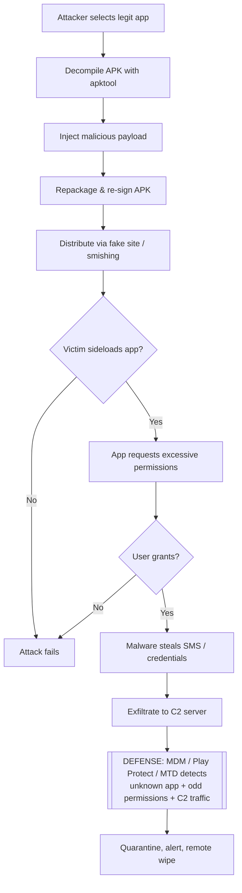

# Hacking Mobile Platforms

> **What you'll learn:** How attackers target Android and iOS devices and apps, the OWASP Mobile Top 10 risks, how Mobile Device Management (MDM) protects fleets of phones, and the tools and defenses every mobile security tester should know.
> **Prerequisites:** Basic networking (TCP/IP, HTTP), comfort with a Linux/macOS terminal, and a general idea of what an "app" and an "operating system" are. No prior mobile-hacking experience required.

| Course | Course Code | Module | Level |
|--------|-------------|--------|-------|
| Skillogic CSPP — Certified Cyber Security Professional | SKL-CSP2-711 | Module 09: Hacking Mobile Platforms | Professional Level 2 (level2) |

---

## 1. In Plain English

Imagine your phone is a tiny apartment building. Each app is a separate flat with its own front door, its own locks, and its own stuff inside. The operating system (Android or iOS) is the building manager who decides which flats can talk to each other, who is allowed into the basement (the system internals), and who gets a master key. **Hacking mobile platforms** is the art of finding ways to pick those locks, sneak past the manager, or trick a tenant into handing over their keys.

Why should a total beginner care? Because your phone holds more of your life than your laptop ever did — banking apps, messages, photos, location history, two-factor authentication codes, and saved passwords. Attackers know this. A single malicious app, a fake Wi-Fi network, or a phishing text can hand a stranger the keys to your digital identity. Companies care even more: employees carry corporate email and documents on personal phones, so one compromised device can leak an entire organization's secrets.

In this module we look at the topic from a **security tester's** point of view — someone who learns how the attacks work so they can defend against them. Everything here is framed for authorized testing: practicing on devices and accounts you own, in a lab you control. The goal is understanding, not mischief.

By the end you'll understand the **attack surface** (all the places an attacker can poke at), how Android and iOS differ, the standard catalog of mobile risks (OWASP Mobile Top 10), and how organizations lock down phones at scale.

---

## 2. Core Concepts

### Mobile Attack Surface and Attack Vectors

The **attack surface** is the total set of points where an attacker could try to get in. An **attack vector** is a specific path they take. On mobile, the surface is unusually wide because a phone is connected to so many things at once.

- **Application layer** — the apps themselves. Insecure code, hardcoded secrets, weak storage of data.
- **Network layer** — Wi-Fi, cellular, Bluetooth. Attackers can run a **Man-in-the-Middle (MITM)** attack, meaning they secretly sit between your phone and the server, reading or altering traffic.
- **Operating system layer** — bugs in Android or iOS that let an attacker escape an app's "sandbox" (its isolated flat) and gain control of the whole device.
- **Physical layer** — a stolen or briefly borrowed phone, malicious USB chargers (**juice jacking**, where a charging port also steals data), or shoulder-surfing a PIN.
- **Human layer** — **phishing** (tricking users into clicking links) and **smishing** (phishing over SMS text messages).

### App Sandboxing and Permissions

Both platforms use **sandboxing**: each app runs in an isolated container and can only touch its own data unless it asks permission. **Permissions** are the explicit grants a user gives an app — access to camera, contacts, location, etc. A common attack is **permission abuse**, where a flashlight app asks for your contacts and microphone for no legitimate reason, then exfiltrates (steals) that data.

### Rooting and Jailbreaking

- **Rooting** (Android) and **jailbreaking** (iOS) mean removing the manufacturer's restrictions to gain **root** (administrator) access over the whole device.
- Users sometimes do this voluntarily to customize their phone. Attackers do it to bypass security controls. A rooted/jailbroken device breaks the trust model the OS depends on, so most banking and enterprise apps refuse to run on one.

### Reverse Engineering

**Reverse engineering** means taking a compiled app apart to understand or modify how it works. On Android, apps ship as **APK** files (Android Package) which are essentially zip archives containing **DEX** bytecode (Dalvik Executable — the compiled code the Android runtime executes). On iOS, apps are **IPA** files (iOS App Store Package) containing a Mach-O binary. Testers decompile these to find hardcoded API keys, weak logic, or hidden endpoints.

### Hacking Android OS

Android is open-source, runs on thousands of device models, and allows **sideloading** — installing apps from outside the official Google Play Store. This flexibility is also its biggest risk. Key Android-specific concepts:

- **APK repackaging** — an attacker decompiles a legitimate app, injects malicious code, repackages and re-signs it, then distributes it via a fake store or phishing link.
- **Exported components** — Android apps expose **Activities** (screens), **Services** (background tasks), **Broadcast Receivers** (event listeners), and **Content Providers** (data interfaces). If a developer accidentally marks one as `exported`, other apps can invoke it directly, sometimes bypassing the login screen.
- **Intent abuse** — an **Intent** is a message Android apps use to ask each other to do something. Malicious intents can trigger unintended actions.
- **Insecure storage** — secrets written to `SharedPreferences`, SQLite databases, or the SD card in plaintext.
- **ADB (Android Debug Bridge)** — a developer tool that, if **USB debugging** is left enabled, lets anyone with physical access install apps, pull files, and run shell commands.

### Hacking iOS

iOS is closed-source, tightly controlled by Apple, and apps must normally come from the App Store. This makes it harder to attack, but not impossible:

- **Jailbreaking** unlocks the device and disables many protections, letting tools inspect or modify any app.
- **Keychain** is iOS's secure credential store; misuse (e.g., storing items with weak accessibility settings) can leak credentials.
- **Insecure data storage** in `NSUserDefaults`, plist files, or unencrypted Core Data databases.
- **TLS/SSL pitfalls** — apps that disable certificate validation (often via misconfigured **App Transport Security**, Apple's policy forcing encrypted connections) become vulnerable to MITM.
- **Side-loading and enterprise certificates** — attackers abuse Apple's enterprise distribution program to install malicious apps outside the App Store.

### OWASP Mobile Top 10

The **OWASP Mobile Top 10** (from the Open Worldwide Application Security Project, a non-profit that publishes free security standards) is the industry's reference list of the most critical mobile app risks. The 2024 edition:

| # | Risk | Plain-English meaning |
|---|------|-----------------------|
| M1 | Improper Credential Usage | Hardcoded or poorly handled passwords/keys/tokens. |
| M2 | Inadequate Supply Chain Security | Malicious or vulnerable third-party libraries and SDKs. |
| M3 | Insecure Authentication/Authorization | Weak login or broken access checks. |
| M4 | Insufficient Input/Output Validation | Trusting untrusted data, leading to injection. |
| M5 | Insecure Communication | Unencrypted or improperly validated network traffic. |
| M6 | Inadequate Privacy Controls | Mishandling personal/sensitive data. |
| M7 | Insufficient Binary Protections | No obfuscation or tamper detection; easy to reverse. |
| M8 | Security Misconfiguration | Insecure defaults, debug flags left on, exported components. |
| M9 | Insecure Data Storage | Secrets saved in plaintext on the device. |
| M10 | Insufficient Cryptography | Weak or misused encryption. |

### Mobile Device Management (MDM)

**MDM** is software that lets an organization centrally control a fleet of phones — enforcing passcodes, pushing apps, encrypting storage, and **remote wiping** (erasing a lost device). The broader term is **UEM (Unified Endpoint Management)**, which covers laptops and tablets too. **MAM (Mobile Application Management)** is a lighter variant that controls only the corporate apps and data, leaving the rest of a personal phone untouched (useful for **BYOD** — Bring Your Own Device).

---

## 3. How It Works (Step by Step)

Here is a realistic **malicious-APK** attack chain on Android, followed by where defenses fit.

1. **Reconnaissance** — The attacker picks a popular legitimate app to imitate (e.g., a banking or game app) and downloads its APK.
2. **Decompile** — Using a tool like `apktool`, they unpack the APK into readable resources and **smali** code (a human-readable form of DEX bytecode).
3. **Inject payload** — They add malicious code: a hidden service that reads SMS (to steal 2FA codes) and beacons data to a command-and-control (C2) server.
4. **Repackage and sign** — They rebuild the APK and sign it with their own key, since Android requires every app to be signed.
5. **Distribute** — They host it on a fake website or send a smishing text: "Your account is locked, install this update."
6. **Install (sideload)** — The victim enables "install from unknown sources" and installs it.
7. **Permission grant** — The app requests SMS and accessibility permissions; the trusting user approves.
8. **Exfiltration** — The malware silently forwards 2FA codes and credentials to the attacker.
9. **Detection point** — A defender using MDM, Google Play Protect, or a mobile threat-detection agent flags the unsigned/unknown app, the suspicious permission set, and the outbound C2 traffic.



---

## 4. Real-World Examples

**Pegasus spyware (NSO Group).** Pegasus is commercial spyware that has been used to target journalists, activists, and officials. Some variants relied on **zero-click** exploits — the victim did not have to tap anything; a specially crafted message could compromise the device. Once installed it could read messages, activate the microphone and camera, and track location. This case shows that even fully patched, non-jailbroken iPhones can be vulnerable to sophisticated, well-funded attackers exploiting unknown (zero-day) bugs.

**Joker / Bread malware on Google Play.** Over several years, families of malware nicknamed "Joker" repeatedly slipped into the official Play Store hidden inside otherwise-functional apps. They signed victims up for premium SMS subscriptions and stole data. Google removed many such apps, but the recurring pattern demonstrates the limits of store vetting and the danger of excessive SMS/notification permissions.

**Banking trojans via accessibility services.** Numerous Android banking trojans (a widely documented category) abuse the **Accessibility Service** — a feature meant to help users with disabilities — to read screen content, overlay fake login screens on top of real banking apps, and capture credentials. The lesson: a single over-powerful permission can defeat app sandboxing entirely.

---

## 5. Tools of the Trade

> All tools below are for **authorized testing on devices and apps you own or are contracted to assess.**

### MobSF (Mobile Security Framework)
An automated, all-in-one analysis platform for Android and iOS apps (static and dynamic).
```bash
# Run MobSF locally via Docker, then upload an APK/IPA in the web UI at http://localhost:8000
docker run -it --rm -p 8000:8000 opensecurity/mobile-security-framework-mobsf
```
*This launches the MobSF server; you drag-and-drop an APK to get a report on hardcoded secrets, permissions, and insecure storage.*

### apktool
Decompiles and rebuilds APKs to inspect resources and smali code.
```bash
apktool d target-app.apk -o target-app-decoded
```
*`d` = decode; this unpacks the APK into a readable folder so you can review the manifest and code.*

### ADB (Android Debug Bridge)
The official command-line tool for talking to Android devices.
```bash
adb devices                          # list connected devices/emulators
adb shell pm list packages | grep bank   # find installed package names
adb pull /data/data/com.example/shared_prefs/  # (requires root) copy app data off device
```
*Used here to enumerate apps and, on a rooted test device, inspect how an app stores data.*

### Frida
A dynamic instrumentation toolkit — it hooks into a running app to inspect or change its behavior at runtime (e.g., bypassing SSL pinning or root detection during a test).
```bash
frida-ps -U                          # list processes on a USB-connected device
frida -U -f com.example.app -l hook.js --no-pause
```
*`-U` targets a USB device, `-f` spawns the app, and `-l` loads your hook script.*

### objection
A runtime mobile toolkit built on Frida that needs no jailbreak for many tasks.
```bash
objection -g com.example.app explore
# inside the prompt:
android sslpinning disable
```
*Disables certificate pinning in a test app so you can inspect its HTTPS traffic through a proxy.*

### Burp Suite / mitmproxy
Intercepting proxies that let you read and modify the app's network traffic.
```bash
mitmproxy --mode regular --listen-port 8080
```
*Starts a proxy on port 8080; you point the test device's Wi-Fi proxy at your machine and install the proxy's CA certificate to view HTTPS.*

---

## 6. Hands-On Lab (Authorized / Lab-Only)

> **Reminder: Perform this only on devices, emulators, and apps you own or are explicitly authorized to test.**

**Goal:** Build a small mobile pentest lab, analyze a deliberately vulnerable app, intercept its traffic, and then validate that a defense (MDM policy / threat detection) catches the risky behavior.

**Lab setup (multi-VM / cloud sandbox):**
- A **host** running an analysis VM (Kali Linux or Ubuntu) with `apktool`, Frida, objection, MobSF, and mitmproxy installed.
- An **Android Emulator** (Android Studio AVD) or **Genymotion** instance acting as the victim device — keep it on an **isolated host-only network** so nothing leaks to the real internet.
- Optionally a second VM acting as a mock C2/web server to receive simulated exfiltration.
- A purpose-built target such as the **OWASP MASTG / iGoat (iOS)** or **DIVA / InsecureBankv2 (Android)** intentionally vulnerable apps. (Use only these training apps, never real third-party apps.)

**Steps:**
1. **Recon & static analysis** — Load the vulnerable APK into MobSF. Record any hardcoded secrets, dangerous permissions, and exported components it reports. Map each finding to the OWASP Mobile Top 10 item it represents.
2. **Decompile** — Run `apktool d` on the same APK and locate the suspicious code or strings MobSF flagged. Confirm the manifest declares an exported component.
3. **Dynamic interception** — Configure the emulator's Wi-Fi proxy to point at mitmproxy/Burp on your analysis VM, install the proxy CA cert, and capture the app's login traffic. Note whether credentials travel in plaintext (M5: Insecure Communication).
4. **Bypass a control** — If the app pins certificates or detects root, use objection (`android sslpinning disable`) to defeat it, demonstrating M7 (Insufficient Binary Protections). Adapt the Frida hook script to the app's actual class names — you'll need to read the decompiled code to find them.
5. **Simulate exfiltration** — Trigger the vulnerable function and observe data hitting your mock C2 server's logs.
6. **Validate the defense** — Enroll the emulator in a test MDM/UEM (e.g., a trial of an open MDM or a vendor sandbox). Apply a compliance policy that blocks sideloaded/unknown-source apps, requires a passcode, and flags root. Re-attempt the install and confirm the MDM **quarantines or blocks** it. Check the MDM/threat-detection dashboard for an alert on the unknown app and abnormal network destination.
7. **Write it up** — Produce a short report: each finding, its OWASP category, severity, reproduction steps, and the remediation, plus evidence that the defensive control fired.

**Stretch goal:** Add a mobile threat-detection (MTD) agent to the emulator and confirm it independently flags the C2 beacon, giving you defense-in-depth (two controls catching one attack).

---

## 7. Countermeasures & Defenses

**For app developers (build secure apps):**
- Never hardcode credentials, API keys, or tokens; fetch secrets at runtime over TLS and store them in the **Android Keystore** / iOS **Keychain**.
- Enforce **TLS with certificate pinning** and never disable validation (defeats M5).
- Encrypt all sensitive data at rest; never write secrets to logs, `SharedPreferences`, `NSUserDefaults`, or external storage in plaintext (defeats M9).
- Minimize and justify every permission; avoid Accessibility/SMS unless essential.
- Mark components `exported="false"` unless they must be public; validate all input from intents/IPC (defeats M4/M8).
- Add **binary protections**: obfuscation (e.g., R8/ProGuard), tamper detection, and root/jailbreak detection (defeats M7).
- Vet third-party SDKs and keep dependencies patched (defeats M2).

**For organizations (protect the fleet):**
- Deploy **MDM/UEM** to enforce passcodes, full-disk encryption, OS patch levels, and to enable **remote lock/wipe**.
- Use **MAM** for BYOD so corporate data lives in a managed container, separate from personal data.
- Block **sideloading** and "unknown sources"; require apps from approved stores only.
- Deploy **Mobile Threat Defense (MTD)** agents to detect malicious apps, risky configs, and network attacks in real time.
- Enforce **conditional access**: a device must be compliant (patched, not rooted) before it can reach corporate email or data.

**For users (everyday hygiene):**
- Install apps only from official stores; review permissions before accepting.
- Keep the OS and apps updated; avoid rooting/jailbreaking devices that hold sensitive data.
- Be wary of smishing links and "urgent update" messages; use a VPN on untrusted Wi-Fi.

---

## 8. Key Terms

- **Attack surface** — the full set of points an attacker could target.
- **Attack vector** — a specific path used to carry out an attack.
- **Sandboxing** — isolating each app so it cannot access others' data.
- **Sideloading** — installing an app from outside the official store.
- **APK / IPA** — Android / iOS app package files.
- **DEX / smali** — Android's compiled bytecode and its human-readable form.
- **Rooting / Jailbreaking** — removing OS restrictions to gain administrator control.
- **MITM (Man-in-the-Middle)** — secretly intercepting traffic between device and server.
- **Smishing** — phishing delivered via SMS text messages.
- **OWASP Mobile Top 10** — the standard catalog of critical mobile app risks.
- **MDM / UEM / MAM** — central management of devices / all endpoints / just managed apps.
- **BYOD** — Bring Your Own Device (personal phones used for work).
- **SSL/Certificate pinning** — an app trusting only a specific server certificate.
- **C2 (Command and Control)** — the attacker's server that malware reports to.
- **Zero-click exploit** — compromise requiring no user interaction.

---

## 9. Summary & Takeaways

- A phone is a high-value target because it concentrates identity, money, communication, and 2FA in one device, across many attack vectors at once.
- **Android** is more open (sideloading, varied devices), so repackaged APKs and permission abuse dominate; **iOS** is more locked down but still vulnerable to jailbreaks, misconfiguration, and sophisticated zero-click exploits.
- The **OWASP Mobile Top 10** gives you a shared vocabulary to classify and prioritize mobile risks — anchor your testing and reporting to it.
- Most real-world mobile attacks rely on the **human layer** (smishing, over-granted permissions) as much as on technical bugs.
- **Reverse engineering and dynamic instrumentation** (apktool, MobSF, Frida, objection) are the core tester's skills; intercepting proxies expose insecure communication.
- Defense is layered: **secure coding** (developer), **MDM/UEM/MTD plus conditional access** (organization), and **basic hygiene** (user).
- Always operate within authorized, isolated lab environments and validate that your defensive controls actually fire against the attacks you simulate.

**Further reading:** OWASP Mobile Top 10 and the OWASP Mobile Application Security Testing Guide (MASTG); NIST SP 800-124 (Guidelines for Managing the Security of Mobile Devices); MITRE ATT&CK for Mobile; Android Developer security docs and Apple Platform Security Guide.
