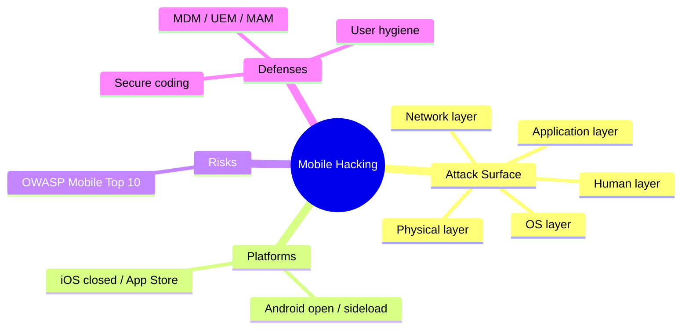
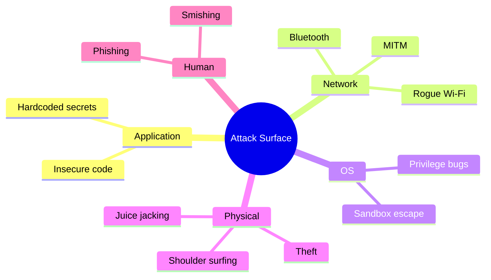
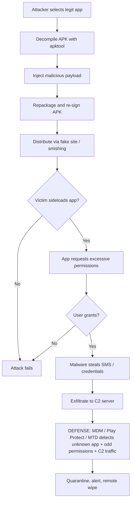
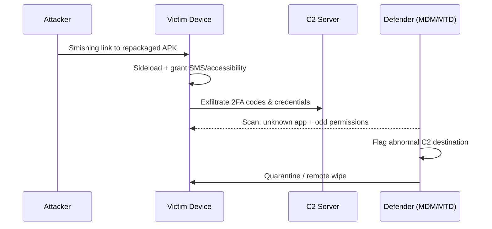
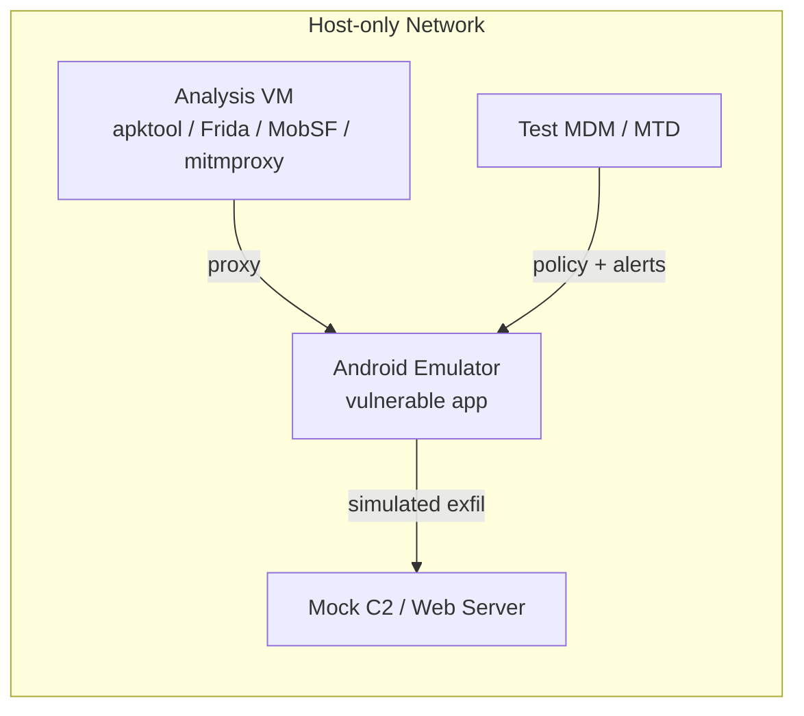
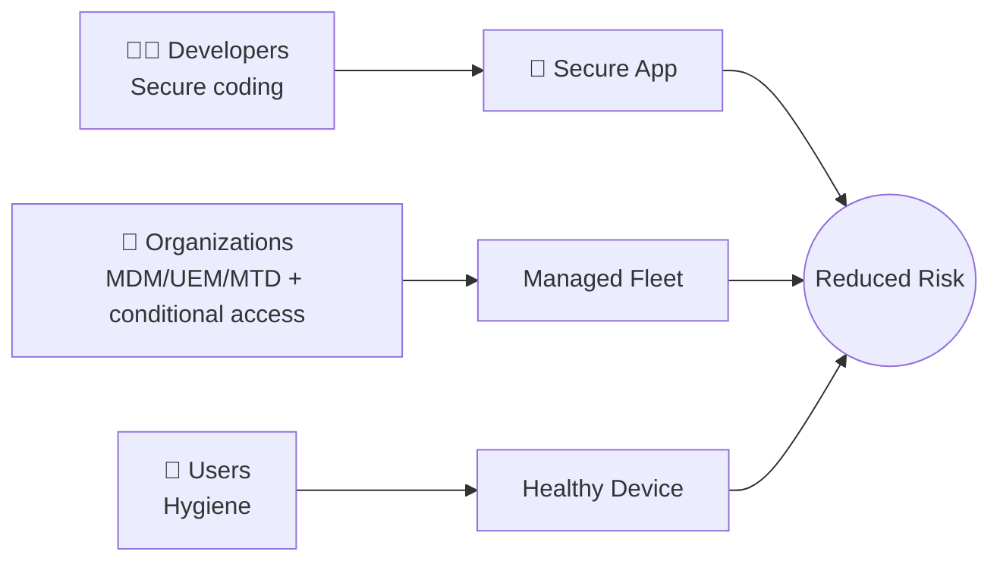

# Hacking Mobile Platforms 📱

> **What you'll learn:** How attackers target Android and iOS devices and apps, the OWASP Mobile Top 10 risks, how Mobile Device Management (MDM) protects fleets of phones, and the tools and defenses every mobile security tester should know.
> **Prerequisites:** Basic networking (TCP/IP, HTTP), comfort with a Linux/macOS terminal, and a general idea of what an "app" and an "operating system" are. No prior mobile-hacking experience required.

| Course | Course Code | Module | Level |
|--------|-------------|--------|-------|
| Skillogic CSPP — Certified Cyber Security Professional | SKL-CSP2-711 | Module 09: Hacking Mobile Platforms | Professional Level 2 (level2) |

---

## 1. In Plain English 🗣️

Picture your phone as a tiny apartment building. Each app is a flat with its own front door, locks, and belongings. The operating system (Android or iOS) is the building manager — it decides which flats can talk, who reaches the basement (system internals), and who holds a master key. **Hacking mobile platforms** is the art of picking those locks, slipping past the manager, or tricking a tenant into handing over their keys.

Why care as a beginner? Your phone holds more of your life than your laptop ever did — banking, messages, photos, location history, 2FA codes, and saved passwords. One malicious app, a fake Wi-Fi network, or a phishing text can hand a stranger your digital identity. Companies care even more: employees carry corporate email and documents on personal phones, so a single compromised device can leak an organization's secrets.

We study this from a **security tester's** viewpoint — learning how attacks work in order to defend. Everything here is framed for **authorized testing**: devices and accounts you own, in a lab you control. The goal is understanding, not mischief.

By the end you'll understand the **attack surface** (every place an attacker can poke), how Android and iOS differ, the standard catalog of mobile risks (OWASP Mobile Top 10), and how organizations lock down phones at scale.

> 🔑 **Key idea:** A phone concentrates identity, money, comms, and 2FA in one pocket-sized device. That concentration is exactly what makes it a prime target.



---

## 2. Core Concepts 🧠

### Mobile Attack Surface and Attack Vectors

The **attack surface** is the total set of points where an attacker could get in. An **attack vector** is the specific path they take. On mobile the surface is unusually wide — a phone connects to many things at once.

| Layer | What's exposed | Example attack |
|-------|---------------|----------------|
| 📲 **Application** | The apps themselves | Insecure code, hardcoded secrets, weak data storage |
| 🌐 **Network** | Wi-Fi, cellular, Bluetooth | **Man-in-the-Middle (MITM)** — secretly sitting between phone and server to read/alter traffic |
| ⚙️ **Operating system** | Android/iOS internals | Bugs that let an app escape its "sandbox" and seize the whole device |
| 🔌 **Physical** | The hardware in hand | Stolen phone, **juice jacking** (a malicious charging port that also steals data), shoulder-surfing a PIN |
| 🧑 **Human** | The user | **Phishing** (malicious links) and **smishing** (phishing over SMS) |



### App Sandboxing and Permissions

Both platforms use **sandboxing**: each app runs in an isolated container and can only touch its own data unless granted access. **Permissions** are explicit grants a user gives — camera, contacts, location, etc. A common attack is **permission abuse**: a flashlight app demands contacts and microphone for no legitimate reason, then **exfiltrates** (steals) that data.

### Rooting and Jailbreaking

- **Rooting** (Android) and **jailbreaking** (iOS) remove the manufacturer's restrictions to gain **root** (administrator) access over the whole device.
- Users sometimes do this voluntarily to customize. Attackers do it to bypass security controls.

> ⚠️ **Warning:** A rooted/jailbroken device breaks the trust model the OS depends on. That's why most banking and enterprise apps refuse to run on one.

### Reverse Engineering

**Reverse engineering** means taking a compiled app apart to understand or modify it. Testers do this to find hardcoded API keys, weak logic, or hidden endpoints.

| Platform | Package | Contains |
|----------|---------|----------|
| 🤖 Android | **APK** (Android Package) — basically a zip archive | **DEX** bytecode (Dalvik Executable — the compiled code the Android runtime executes) |
| 🍎 iOS | **IPA** (iOS App Store Package) | A **Mach-O** binary |

### Hacking Android OS 🤖

Android is open-source, runs on thousands of device models, and allows **sideloading** — installing apps from outside Google Play. That flexibility is also its biggest risk.

- **APK repackaging** — an attacker decompiles a legit app, injects malicious code, repackages, re-signs, and distributes it via a fake store or phishing link.
- **Exported components** — Android apps expose **Activities** (screens), **Services** (background tasks), **Broadcast Receivers** (event listeners), and **Content Providers** (data interfaces). A component accidentally marked `exported` can be invoked directly by other apps — sometimes bypassing the login screen.
- **Intent abuse** — an **Intent** is a message apps use to ask each other to do something. Malicious intents can trigger unintended actions.
- **Insecure storage** — secrets written to `SharedPreferences`, SQLite databases, or the SD card in plaintext.
- **ADB (Android Debug Bridge)** — a developer tool that, with **USB debugging** left enabled, lets anyone with physical access install apps, pull files, and run shell commands.

### Hacking iOS 🍎

iOS is closed-source, tightly controlled by Apple, and apps normally come only from the App Store. Harder to attack — but not impossible.

- **Jailbreaking** unlocks the device and disables protections, letting tools inspect or modify any app.
- **Keychain** is iOS's secure credential store; misuse (e.g., weak accessibility settings) can leak credentials.
- **Insecure data storage** in `NSUserDefaults`, plist files, or unencrypted Core Data databases.
- **TLS/SSL pitfalls** — apps that disable certificate validation (often via misconfigured **App Transport Security**, Apple's policy forcing encrypted connections) become MITM-vulnerable.
- **Side-loading and enterprise certificates** — attackers abuse Apple's enterprise distribution program to install malicious apps outside the App Store.

> 💡 **Tip:** Remember the core asymmetry — Android's openness invites *repackaging and sideloading*; iOS's lockdown pushes attackers toward *jailbreaks, misconfiguration, and expensive zero-days*.

### OWASP Mobile Top 10

The **OWASP Mobile Top 10** (from the Open Worldwide Application Security Project, a non-profit publishing free security standards) is the industry reference list of the most critical mobile app risks. The 2024 edition:

| # | Risk | Plain-English meaning |
|---|------|-----------------------|
| M1 | Improper Credential Usage | Hardcoded or poorly handled passwords/keys/tokens. |
| M2 | Inadequate Supply Chain Security | Malicious or vulnerable third-party libraries and SDKs. |
| M3 | Insecure Authentication/Authorization | Weak login or broken access checks. |
| M4 | Insufficient Input/Output Validation | Trusting untrusted data, leading to injection. |
| M5 | Insecure Communication | Unencrypted or improperly validated network traffic. |
| M6 | Inadequate Privacy Controls | Mishandling personal/sensitive data. |
| M7 | Insufficient Binary Protections | No obfuscation or tamper detection; easy to reverse. |
| M8 | Security Misconfiguration | Insecure defaults, debug flags left on, exported components. |
| M9 | Insecure Data Storage | Secrets saved in plaintext on the device. |
| M10 | Insufficient Cryptography | Weak or misused encryption. |

### Mobile Device Management (MDM)

**MDM** lets an organization centrally control a fleet of phones — enforcing passcodes, pushing apps, encrypting storage, and **remote wiping** (erasing a lost device). Two related terms:

| Term | Scope | Best for |
|------|-------|----------|
| **MDM** (Mobile Device Management) | The whole device | Corporate-owned phones |
| **UEM** (Unified Endpoint Management) | Devices + laptops + tablets | Mixed fleets across endpoint types |
| **MAM** (Mobile Application Management) | Only corporate apps/data | **BYOD** (Bring Your Own Device) — leaves the personal phone untouched |

---

## 3. How It Works (Step by Step) 🔍

A realistic **malicious-APK** attack chain on Android, with the defense point at the end.

| Step | Phase | What happens |
|------|-------|--------------|
| 1 | 🔎 Reconnaissance | Attacker picks a popular legit app (banking/game) and downloads its APK. |
| 2 | 🧩 Decompile | Using `apktool`, they unpack the APK into readable resources and **smali** code (human-readable DEX bytecode). |
| 3 | 💉 Inject payload | They add malicious code: a hidden service that reads SMS (to steal 2FA) and beacons to a command-and-control (C2) server. |
| 4 | 📦 Repackage & sign | They rebuild and sign with their own key (Android requires every app to be signed). |
| 5 | 📨 Distribute | Hosted on a fake site or sent via smishing: "Your account is locked, install this update." |
| 6 | ⬇️ Install (sideload) | Victim enables "install from unknown sources" and installs it. |
| 7 | ✅ Permission grant | App requests SMS and accessibility permissions; the trusting user approves. |
| 8 | 📤 Exfiltration | Malware silently forwards 2FA codes and credentials. |
| 9 | 🛡️ Detection point | MDM, Google Play Protect, or an MTD agent flags the unknown app, suspicious permissions, and outbound C2 traffic. |



The same chain viewed as a conversation between attacker, victim device, and defender:



---

## 4. Real-World Examples 🌍

**Pegasus spyware (NSO Group).** Commercial spyware used to target journalists, activists, and officials. Some variants used **zero-click** exploits — no tap required; a crafted message alone could compromise the device. Once installed it read messages, activated the mic and camera, and tracked location.
> 🔑 **Key idea:** Even a fully patched, non-jailbroken iPhone can fall to a well-funded attacker wielding unknown (zero-day) bugs.

**Joker / Bread malware on Google Play.** Over years, "Joker" malware families repeatedly slipped into the official Play Store hidden inside functional apps, signing victims up for premium SMS subscriptions and stealing data. The recurring pattern shows the limits of store vetting and the danger of excessive SMS/notification permissions.

**Banking trojans via accessibility services.** Many Android banking trojans abuse the **Accessibility Service** — a feature meant to help users with disabilities — to read screen content, overlay fake login screens on real banking apps, and capture credentials.
> ⚠️ **Warning:** A single over-powerful permission (like Accessibility) can defeat app sandboxing entirely.

> 🖼️ *Suggested image: Annotated screenshot of an Android permission prompt highlighting a flashlight app requesting SMS + Accessibility.*

---

## 5. Tools of the Trade 🧰

> ⚠️ **Warning:** All tools below are for **authorized testing on devices and apps you own or are contracted to assess.**

| Tool | Type | Primary use |
|------|------|-------------|
| **MobSF** | Static + dynamic analysis | All-in-one automated app report (secrets, permissions, storage) |
| **apktool** | Decompiler | Unpack/rebuild APKs to read manifest + smali |
| **ADB** | Device bridge | Enumerate apps, pull data, run shell on Android |
| **Frida** | Dynamic instrumentation | Hook a running app (bypass SSL pinning / root detection) |
| **objection** | Frida-based runtime toolkit | Many tasks with no jailbreak needed |
| **Burp Suite / mitmproxy** | Intercepting proxy | Read and modify app network traffic |

### MobSF (Mobile Security Framework)
Automated, all-in-one analysis platform for Android and iOS apps (static and dynamic).
```bash
# Run MobSF locally via Docker, then upload an APK/IPA in the web UI at http://localhost:8000
docker run -it --rm -p 8000:8000 opensecurity/mobile-security-framework-mobsf
```
*Launches the MobSF server; drag-and-drop an APK to get a report on hardcoded secrets, permissions, and insecure storage.*

### apktool
Decompiles and rebuilds APKs to inspect resources and smali code.
```bash
apktool d target-app.apk -o target-app-decoded
```
*`d` = decode; unpacks the APK into a readable folder for reviewing the manifest and code.*

### ADB (Android Debug Bridge)
Official command-line tool for talking to Android devices.
```bash
adb devices                          # list connected devices/emulators
adb shell pm list packages | grep bank   # find installed package names
adb pull /data/data/com.example/shared_prefs/  # (requires root) copy app data off device
```
*Used to enumerate apps and, on a rooted test device, inspect how an app stores data.*

### Frida
Dynamic instrumentation toolkit — hooks into a running app to inspect or change its behavior at runtime (e.g., bypassing SSL pinning or root detection during a test).
```bash
frida-ps -U                          # list processes on a USB-connected device
frida -U -f com.example.app -l hook.js --no-pause
```
*`-U` targets a USB device, `-f` spawns the app, `-l` loads your hook script.*

### objection
Runtime mobile toolkit built on Frida; needs no jailbreak for many tasks.
```bash
objection -g com.example.app explore
# inside the prompt:
android sslpinning disable
```
*Disables certificate pinning in a test app so you can inspect its HTTPS traffic through a proxy.*

### Burp Suite / mitmproxy
Intercepting proxies that let you read and modify the app's network traffic.
```bash
mitmproxy --mode regular --listen-port 8080
```
*Starts a proxy on port 8080; point the test device's Wi-Fi proxy at your machine and install the proxy's CA certificate to view HTTPS.*

> 🖼️ *Suggested image: MobSF static-analysis dashboard showing the security score and flagged permissions for a sample APK.*

---

## 6. Hands-On Lab (Authorized / Lab-Only) 🧪

> ⚠️ **Warning:** Perform this only on devices, emulators, and apps you own or are explicitly authorized to test.

**Goal:** Build a small mobile pentest lab, analyze a deliberately vulnerable app, intercept its traffic, then validate that a defense (MDM policy / threat detection) catches the risky behavior.

**Lab setup (multi-VM / cloud sandbox):**
- A **host** running an analysis VM (Kali Linux or Ubuntu) with `apktool`, Frida, objection, MobSF, and mitmproxy installed.
- An **Android Emulator** (Android Studio AVD) or **Genymotion** instance as the victim device — keep it on an **isolated host-only network** so nothing leaks to the real internet.
- Optionally a second VM as a mock C2/web server to receive simulated exfiltration.
- A purpose-built target such as **OWASP MASTG / iGoat (iOS)** or **DIVA / InsecureBankv2 (Android)** intentionally vulnerable apps. (Use only these training apps, never real third-party apps.)



**Steps:**
1. **Recon & static analysis** — Load the vulnerable APK into MobSF. Record hardcoded secrets, dangerous permissions, and exported components. Map each finding to its OWASP Mobile Top 10 item.
2. **Decompile** — Run `apktool d` on the same APK and locate the suspicious code/strings MobSF flagged. Confirm the manifest declares an exported component.
3. **Dynamic interception** — Point the emulator's Wi-Fi proxy at mitmproxy/Burp, install the proxy CA cert, and capture login traffic. Note whether credentials travel in plaintext (M5: Insecure Communication).
4. **Bypass a control** — If the app pins certificates or detects root, use objection (`android sslpinning disable`) to defeat it, demonstrating M7 (Insufficient Binary Protections). Adapt the Frida hook to the app's actual class names — read the decompiled code to find them.
5. **Simulate exfiltration** — Trigger the vulnerable function and watch data hit your mock C2 server's logs.
6. **Validate the defense** — Enroll the emulator in a test MDM/UEM (trial of an open MDM or vendor sandbox). Apply a policy that blocks sideloaded/unknown-source apps, requires a passcode, and flags root. Re-attempt the install and confirm the MDM **quarantines or blocks** it. Check the dashboard for an alert on the unknown app and abnormal network destination.
7. **Write it up** — Short report: each finding, its OWASP category, severity, reproduction steps, remediation, plus evidence the defensive control fired.

> 💡 **Tip:** Stretch goal — add a mobile threat-detection (MTD) agent to the emulator and confirm it *independently* flags the C2 beacon. Two controls catching one attack = defense-in-depth.

---

## 7. Countermeasures & Defenses 🛡️

Defense is layered across three audiences. The table maps each OWASP risk to its primary fix.

| OWASP risk | Primary developer defense |
|------------|---------------------------|
| M1 Improper Credentials | Fetch secrets at runtime over TLS; store in Android Keystore / iOS Keychain |
| M2 Supply Chain | Vet third-party SDKs; keep dependencies patched |
| M4 Input/Output Validation | Validate all input from intents/IPC |
| M5 Insecure Communication | Enforce TLS + certificate pinning; never disable validation |
| M7 Binary Protections | Obfuscation (R8/ProGuard), tamper + root/jailbreak detection |
| M8 Misconfiguration | Mark components `exported="false"` unless they must be public |
| M9 Insecure Data Storage | Encrypt data at rest; never log secrets or write them in plaintext |

**For app developers (build secure apps):**
- Never hardcode credentials, API keys, or tokens; fetch at runtime over TLS and store in the **Android Keystore** / iOS **Keychain**.
- Enforce **TLS with certificate pinning**; never disable validation (defeats M5).
- Encrypt all sensitive data at rest; never write secrets to logs, `SharedPreferences`, `NSUserDefaults`, or external storage in plaintext (defeats M9).
- Minimize and justify every permission; avoid Accessibility/SMS unless essential.
- Mark components `exported="false"` unless they must be public; validate all input from intents/IPC (defeats M4/M8).
- Add **binary protections**: obfuscation (R8/ProGuard), tamper detection, root/jailbreak detection (defeats M7).
- Vet third-party SDKs and keep dependencies patched (defeats M2).

**For organizations (protect the fleet):**
- Deploy **MDM/UEM** to enforce passcodes, full-disk encryption, OS patch levels, and **remote lock/wipe**.
- Use **MAM** for BYOD so corporate data lives in a managed container, separate from personal data.
- Block **sideloading** and "unknown sources"; require approved stores only.
- Deploy **Mobile Threat Defense (MTD)** agents to detect malicious apps, risky configs, and network attacks in real time.
- Enforce **conditional access**: a device must be compliant (patched, not rooted) before reaching corporate email or data.

**For users (everyday hygiene):**
- Install apps only from official stores; review permissions before accepting.
- Keep OS and apps updated; avoid rooting/jailbreaking devices that hold sensitive data.
- Beware smishing links and "urgent update" messages; use a VPN on untrusted Wi-Fi.



---

## 8. Key Terms 📖

| Term | Meaning |
|------|---------|
| **Attack surface** | The full set of points an attacker could target. |
| **Attack vector** | A specific path used to carry out an attack. |
| **Sandboxing** | Isolating each app so it cannot access others' data. |
| **Sideloading** | Installing an app from outside the official store. |
| **APK / IPA** | Android / iOS app package files. |
| **DEX / smali** | Android's compiled bytecode and its human-readable form. |
| **Rooting / Jailbreaking** | Removing OS restrictions to gain administrator control. |
| **MITM (Man-in-the-Middle)** | Secretly intercepting traffic between device and server. |
| **Smishing** | Phishing delivered via SMS text messages. |
| **OWASP Mobile Top 10** | The standard catalog of critical mobile app risks. |
| **MDM / UEM / MAM** | Central management of devices / all endpoints / just managed apps. |
| **BYOD** | Bring Your Own Device (personal phones used for work). |
| **SSL/Certificate pinning** | An app trusting only a specific server certificate. |
| **C2 (Command and Control)** | The attacker's server that malware reports to. |
| **Zero-click exploit** | Compromise requiring no user interaction. |

---

## 9. Summary & Takeaways ✅

- A phone is a high-value target because it concentrates identity, money, communication, and 2FA in one device, across many attack vectors at once.
- **Android** is more open (sideloading, varied devices), so repackaged APKs and permission abuse dominate; **iOS** is more locked down but still vulnerable to jailbreaks, misconfiguration, and sophisticated zero-click exploits.
- The **OWASP Mobile Top 10** gives you a shared vocabulary to classify and prioritize mobile risks — anchor your testing and reporting to it.
- Most real-world mobile attacks lean on the **human layer** (smishing, over-granted permissions) as much as on technical bugs.
- **Reverse engineering and dynamic instrumentation** (apktool, MobSF, Frida, objection) are core tester skills; intercepting proxies expose insecure communication.
- Defense is layered: **secure coding** (developer), **MDM/UEM/MTD plus conditional access** (organization), and **basic hygiene** (user).
- Always operate within authorized, isolated lab environments and validate that your defensive controls actually fire against the attacks you simulate.

> 💡 **Tip:** When in doubt, classify any finding against the OWASP Mobile Top 10 first — it turns a vague "this seems bad" into a prioritized, reportable risk.

**Further reading:** OWASP Mobile Top 10 and the OWASP Mobile Application Security Testing Guide (MASTG); NIST SP 800-124 (Guidelines for Managing the Security of Mobile Devices); MITRE ATT&CK for Mobile; Android Developer security docs and Apple Platform Security Guide.
