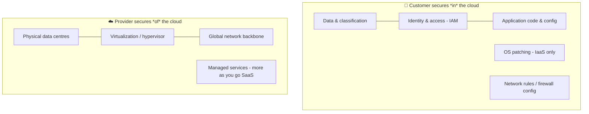
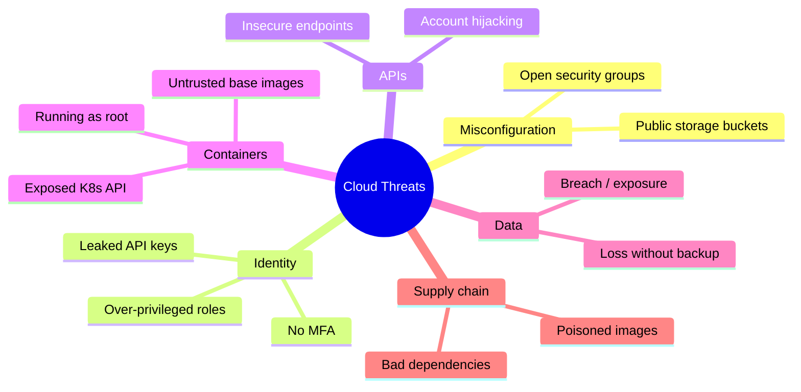
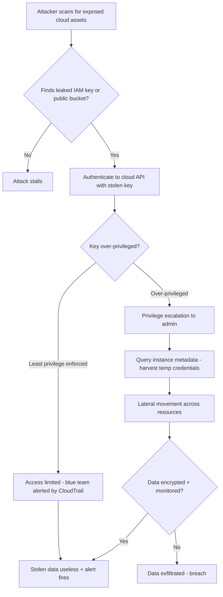

# Module 10: Cloud Computing Security

> **What you'll learn:** How cloud computing works, who is responsible for securing what, how attackers target clouds and containers, and the controls (IAM, CASB, encryption) that keep cloud workloads safe.
> **Prerequisites:** Basic networking (IP, DNS, HTTP), familiarity with the Linux command line, and a general idea of what a virtual machine is.

| | |
|---|---|
| **Course** | Professional Level 2 |
| **Course code** | SKL-CSP2-711 |
| **Module** | Cloud Computing Security |
| **Level** | level2 |

---

## 1. In Plain English

Imagine you want to run a restaurant but don't want to build a kitchen. Instead, you rent space in a giant shared commercial kitchen. Sometimes you rent just the bare room and bring your own appliances (you do most of the work). Sometimes the room comes with ovens and fridges already installed (less work for you). And sometimes you just rent a fully-staffed kitchen that cooks a fixed menu — you barely touch anything. **Cloud computing** is exactly this idea, but for computers: instead of buying your own servers, you rent computing power from a provider like Amazon (AWS), Microsoft (Azure), or Google (GCP), and you choose how much of the "kitchen" you manage yourself.

This matters for security because of one crucial question: **when something goes wrong, whose fault is it?** In the shared kitchen, if a burglar walks in through the front door the building owner failed to lock, that's on them. But if *you* leave your own freezer unlocked and someone steals your ingredients, that's on you. The cloud has the exact same arrangement, called the **shared responsibility model** — the provider secures the building, and you secure what you put inside it.

A total beginner should care because almost everything you use today — your bank app, your streaming service, your messaging — runs in the cloud. Most major data breaches in recent years were not caused by clever hackers breaking the provider's walls. They were caused by customers misconfiguring their own "freezer" — leaving a storage bucket open to the public internet, hardcoding a password, or giving a robot account far too much access. Understanding cloud security means understanding where *your* responsibilities begin.

In this module we go from these basics all the way to **containers** (a lightweight way to package and ship software), the threats unique to cloud, how attackers exploit them, and the defenses that stop them.

> 🔑 **Key idea:** You can outsource the *work* of security to a cloud provider, but you can never outsource the *accountability*. Where the provider's job ends and yours begins is the whole game.

> 🖼️ *Suggested image: the AWS/Azure/GCP "shared responsibility model" diagram from the provider's own docs (e.g. AWS Shared Responsibility Model).*

---

## 2. Core Concepts

### 2.1 What "the cloud" actually is

The **cloud** is simply someone else's computers, accessed over the internet, that you rent on demand and pay only for what you use. The technical name is **on-demand self-service computing**. Five characteristics define it (per NIST Special Publication 800-145):

- **On-demand self-service** — you provision resources yourself, no phone call needed.
- **Broad network access** — reachable over standard internet protocols.
- **Resource pooling** — the provider's hardware is shared among many customers (**multi-tenancy**), with each customer logically isolated.
- **Rapid elasticity** — you can scale up or down in seconds.
- **Measured service** — usage is metered and billed.

### 2.2 The service models: IaaS, PaaS, SaaS

These describe *how much* of the technology stack the provider manages versus you. Think of the stack from bottom (hardware) to top (the application a user clicks on).

| Model | You manage | Provider manages | Example |
|---|---|---|---|
| **IaaS** (Infrastructure as a Service) | OS, runtime, apps, data | Hardware, network, virtualization | AWS EC2, Azure VMs |
| **PaaS** (Platform as a Service) | Apps, data | Everything below (OS, runtime, scaling) | Google App Engine, Heroku |
| **SaaS** (Software as a Service) | Just your data & user settings | Everything else | Gmail, Salesforce, Microsoft 365 |

- **IaaS** rents you raw virtual machines and networks. You get the most control and the most responsibility.
- **PaaS** rents you a ready-made platform to deploy code; you don't patch the operating system.
- **SaaS** rents you finished software; you only configure it and protect your accounts and data.

A simple rule: **the higher up the stack you go (IaaS → SaaS), the less you manage and the less you can secure yourself — but the more you depend on the provider getting it right.**

### 2.3 Deployment models

*Where* the cloud lives and who can use it:

- **Public cloud** — shared infrastructure open to any paying customer (AWS, Azure, GCP).
- **Private cloud** — dedicated to a single organization, on-premises or hosted. More control, higher cost.
- **Hybrid cloud** — a mix of public and private, connected together (e.g., sensitive data stays private, web front-end runs public).
- **Community cloud** — shared by several organizations with common needs (e.g., a group of hospitals).
- **Multi-cloud** — using more than one public provider at once to avoid lock-in or for resilience.

### 2.4 The shared responsibility model

This is the single most important security concept in the cloud. It splits duties between provider and customer:

- **Security *of* the cloud** = the provider's job (physical data centers, hardware, the virtualization layer, the global network).
- **Security *in* the cloud** = your job (your data, identities, OS patches, network rules, application code).

Crucially, the dividing line **moves depending on the service model**. With IaaS you patch the OS; with SaaS the provider does. But **data, identity, and access management are almost always your responsibility, no matter the model.** The ISC2 CCSP guide stresses that the customer can never fully outsource accountability — even when a task is the provider's, the customer remains accountable to regulators and customers for the outcome.



> 💡 **Tip:** Read the diagram top-down by service model — as you move IaaS → PaaS → SaaS, items like OS patching slide *up* from your box into the provider's box. Data and identity never move.

### 2.5 Container technology

A **container** is a way to package an application together with everything it needs to run (libraries, settings) into a single, portable unit that runs the same anywhere. Unlike a virtual machine, which includes a full operating system, containers **share the host's OS kernel**, making them lightweight and fast to start.

- **Docker** — the most common tool for building and running containers. A **Docker image** is the read-only template; a **container** is a running instance of it.
- **Kubernetes (K8s)** — an **orchestrator** that runs, scales, and heals thousands of containers across many machines. Its smallest unit is a **pod** (one or more containers that share networking).

**Why containers change security:** because containers share the host kernel, a flaw that lets an attacker "break out" of a container can compromise the whole host and every other container on it. Container security spans four areas (the "4 C's"): **Code, Container image, Cluster, Cloud/host.** Key risks include: images built from untrusted bases, secrets baked into images, containers running as **root** (full admin), overly permissive Kubernetes role bindings, and an exposed Kubernetes API server or dashboard.

> ⚠️ **Warning:** A container running as **root** that breaks out becomes root on the *host*. Treat "don't run as root" and "don't expose the K8s dashboard" as non-negotiable.

> 🖼️ *Suggested image: a VM-vs-Container architecture comparison (Docker docs) showing containers sharing one host kernel while VMs each carry a full guest OS.*

| | Virtual Machine | Container |
|---|---|---|
| **Isolation** | Strong (own kernel) | Weaker (shared host kernel) |
| **Size / start time** | GBs / minutes | MBs / seconds |
| **Blast radius of escape** | The VM | Potentially the whole host |
| **Best for** | Strong tenant isolation | Fast, portable app packaging |

### 2.6 Cloud-specific threats

- **Misconfiguration** — the #1 cause of cloud breaches (e.g., a public storage bucket).
- **Insecure APIs** — cloud is controlled entirely through APIs; a leaked API key is a master key.
- **Account hijacking** — stolen credentials give attackers your console.
- **Insufficient IAM** — over-privileged accounts and unused keys.
- **Data breaches & data loss** — exposed data or deleted-without-backup data.
- **Insider threats** and **shared-technology vulnerabilities** (multi-tenancy escape).
- **Supply-chain attacks** via poisoned container images or dependencies.



### 2.7 Cloud security controls

- **IAM (Identity and Access Management)** — who can do what. Enforces **least privilege** (give only the access needed) and **MFA** (multi-factor authentication).
- **CASB (Cloud Access Security Broker)** — a security checkpoint sitting between users and cloud services that enforces policy, detects shadow IT, and spots risky behavior.
- **Encryption** — protecting data **at rest** (stored) and **in transit** (moving), using keys managed by a **KMS (Key Management Service)**.

---

## 3. How It Works (Step by Step)

Let's walk through a realistic cloud attack — the kind that causes most real breaches — and then the defense that stops it.

**The attack: exploiting a misconfigured cloud and stealing data**

1. **Reconnaissance.** The attacker scans for exposed assets — public storage buckets, open Kubernetes dashboards, or leaked credentials in public code repositories (a developer accidentally commits an API key).
2. **Initial access.** They find a leaked **IAM access key** in a public Git repo, or a storage bucket set to "public read."
3. **Validate access.** Using the stolen key, they call the cloud API to ask "what am I allowed to do?" (enumerating permissions).
4. **Privilege escalation.** The key turns out to be over-privileged — it can create new users or assume more powerful roles. The attacker grants themselves admin.
5. **Lateral movement.** From a compromised container or VM, they query the **instance metadata service** to harvest temporary credentials and pivot to other resources.
6. **Exfiltration.** They copy sensitive data out, and may leave a backdoor (a new IAM user) for persistence.

**The defense:** least-privilege IAM, no public buckets, encryption so stolen data is useless, MFA on all human accounts, and continuous logging (e.g., AWS CloudTrail) feeding alerts so step 3 onward triggers an investigation.



---

## 4. Real-World Examples

**Capital One (2019).** A misconfigured web application firewall on AWS allowed an attacker to perform a server-side request forgery (SSRF) attack against the **instance metadata service**, retrieving temporary credentials that had broad S3 permissions. The attacker then accessed storage buckets containing data on roughly 100 million customers. The lesson is textbook shared responsibility: AWS's infrastructure was sound; the *customer's* configuration (firewall rule + over-privileged role + reachable metadata) was the gap.

**Tesla Kubernetes cryptojacking (2018).** Researchers found Tesla's Kubernetes administrative console exposed to the internet without password protection. Attackers used it to run cryptocurrency-mining containers on Tesla's cloud account — a classic example of an exposed orchestration plane being abused for **cryptojacking**.

**Recurring open-bucket leaks.** Numerous organizations have exposed data through publicly readable object storage buckets that were never meant to be public. These are not sophisticated hacks — they are configuration mistakes, which is precisely why "misconfiguration" tops industry threat lists year after year.

---

## 5. Tools of the Trade

> All tools below are for use only on cloud accounts and systems you own or are explicitly authorized to test.

**ScoutSuite** — multi-cloud security auditing tool that reports misconfigurations.
```bash
scout aws --report-dir ./scout-report
# Audits the configured AWS account and writes an HTML report
# highlighting public buckets, weak IAM, open security groups, etc.
```

**Prowler** — AWS/Azure/GCP security best-practice and compliance scanner.
```bash
prowler aws --severity high critical
# Runs hundreds of checks and prints only HIGH and CRITICAL findings
```

**Trivy** — scans container images for vulnerabilities and misconfigurations.
```bash
trivy image myapp:latest
# Lists known CVEs in the image's OS packages and app dependencies
```

**kube-bench** — checks a Kubernetes cluster against the CIS hardening benchmark.
```bash
kube-bench run --targets master,node
# Reports failed hardening checks on control-plane and worker nodes
```

**Pacu** — an AWS exploitation framework for authorized red-team testing.
```bash
pacu
# Then inside: run iam__enum_permissions
# Enumerates what the current credentials are actually allowed to do
```

**AWS CLI** — official command-line tool, also useful for verifying your own posture.
```bash
aws s3api get-bucket-acl --bucket my-bucket
# Shows who can read/write a bucket - confirm it is not public
```

---

## 6. Hands-On Lab (Authorized / Lab-Only)

> This lab is for systems and cloud accounts you own or are explicitly authorized to test. Use a personal sandbox account, never production or someone else's environment.

**Goal:** Build a small cloud sandbox, deliberately misconfigure it, exploit the chain, then validate that detection catches you.

**Setup — your lab environment.** Create a free-tier or sandbox cloud account (AWS/Azure/GCP), or run everything locally with **LocalStack** (an AWS API emulator) plus a one-node Kubernetes via **minikube**. Optionally spin up two VMs (one "attacker" Kali box, one workload host) so you practice lateral movement realistically.

**Step 1 — Plant the misconfiguration.** Create an object storage bucket and set it to public-read. Create an IAM role/user that is deliberately over-privileged (e.g., broad storage + IAM permissions) and store its access key on the workload VM as a developer might.

**Step 2 — Recon.** From the attacker box, enumerate the account: list buckets, attempt anonymous reads on the public bucket, and locate the leaked key. Adapt your tooling (ScoutSuite or Prowler) to confirm the bucket shows up as "public."

**Step 3 — Authenticate and enumerate.** Configure the stolen key and use Pacu's `iam__enum_permissions` module (or the equivalent CLI calls) to discover what the credential can do.

**Step 4 — Escalate and move laterally.** Using the over-privileged role, attempt to create a new IAM user (persistence) and, from a compromised container/VM, query the instance metadata service to harvest temporary credentials. Try to reach a second resource with them.

**Step 5 — Exfiltrate (simulated).** Copy a dummy "sensitive" file out of the bucket to prove the data path works. Use only fake data.

**Step 6 — Validate detection (the blue-team step).** Enable audit logging (AWS CloudTrail / Azure Activity Log / GCP Audit Logs) **before** repeating steps 3–5. Then:
- Confirm the API calls (ListBuckets, GetObject, CreateUser, metadata access) appear in the logs.
- Write a simple detection: alert when a `CreateUser` or anonymous `GetObject` event occurs.
- Re-run the attack and verify your alert fires.

**Step 7 — Remediate and re-test.** Make the bucket private, replace the over-privileged role with a least-privilege policy, rotate the key, enable MFA, and block the metadata service from untrusted processes. Re-run steps 2–5 and confirm the attack now fails. Document which control stopped each step.

---

## 7. Countermeasures & Defenses

**Identity & access**
- Enforce **least privilege**; no wildcard "allow everything" policies.
- Require **MFA** on all human accounts, especially admins.
- Use short-lived, **role-based temporary credentials** instead of long-lived keys; rotate any keys regularly.
- Audit for unused users, keys, and over-broad roles.

**Data protection**
- Encrypt data **at rest and in transit**; manage keys in a **KMS** and rotate them.
- Make storage buckets **private by default**; block public access account-wide.
- Maintain backups and test restores (defends against data loss/ransomware).

**Configuration & monitoring**
- Continuously scan for misconfigurations (**CSPM** — Cloud Security Posture Management tools like ScoutSuite/Prowler).
- Enable comprehensive **audit logging** (CloudTrail / Activity Logs) and alert on anomalous API calls.
- Deploy a **CASB** to control SaaS usage, detect shadow IT, and enforce data policies.

**Container & Kubernetes**
- Scan images for vulnerabilities (**Trivy**) and use minimal, trusted base images.
- Never run containers as **root**; drop unneeded Linux capabilities.
- Harden clusters with **kube-bench**; apply **RBAC** least privilege, **network policies**, and **pod security standards**.
- Never expose the Kubernetes API server or dashboard to the public internet; keep **secrets out of images** (use a secrets manager).

**Architecture**
- Block or restrict access to the **instance metadata service** (use the hardened/IMDSv2-style version where available).
- Segment networks with security groups/firewalls; deny by default.

---

## 8. Key Terms

- **Cloud computing** — on-demand, metered, internet-delivered computing rented from a provider.
- **IaaS / PaaS / SaaS** — service models defining how much of the stack the provider versus you manages.
- **Deployment model** — public, private, hybrid, community, or multi-cloud.
- **Shared responsibility model** — division of security duties: provider secures *of* the cloud, customer secures *in* the cloud.
- **Multi-tenancy** — many customers sharing the same physical infrastructure, logically isolated.
- **Container** — a lightweight, portable package of an app and its dependencies that shares the host OS kernel.
- **Docker** — the leading tool for building and running containers.
- **Kubernetes** — an orchestrator that manages containers at scale; smallest unit is a **pod**.
- **Container breakout** — escaping a container to compromise the host.
- **IAM** — Identity and Access Management; controls who can do what.
- **Least privilege** — granting only the minimum access required.
- **MFA** — multi-factor authentication.
- **CASB** — Cloud Access Security Broker; a policy enforcement point between users and cloud services.
- **KMS** — Key Management Service for creating and managing encryption keys.
- **CSPM** — Cloud Security Posture Management; continuous misconfiguration scanning.
- **Instance metadata service** — an in-VM endpoint that hands out temporary credentials; a frequent attack target.
- **Cryptojacking** — abusing stolen cloud compute to mine cryptocurrency.

---

## 9. Summary & Takeaways

- The cloud is rented, metered, internet-delivered computing; **IaaS/PaaS/SaaS** differ by how much of the stack you manage.
- The **shared responsibility model** is the core principle — the provider secures *of* the cloud, you secure *in* the cloud, and **data and identity are always yours**.
- **Misconfiguration**, not provider weakness, causes most real breaches (public buckets, leaked keys, over-privileged roles).
- **Containers** share the host kernel, so image scanning, non-root execution, and Kubernetes hardening (RBAC, network policies, no public API/dashboard) are essential.
- A typical attack chain is: recon → stolen/leaked credential → enumerate → privilege escalation → metadata/lateral movement → exfiltration.
- The strongest defenses are **least-privilege IAM + MFA**, **encryption with managed keys**, **private-by-default storage**, **continuous posture scanning (CSPM)**, and **audit logging with alerting**.
- A **CASB** governs SaaS and shadow IT; **CSPM** governs your own cloud configuration — use both.
- Accountability cannot be outsourced: even when a task is the provider's, you remain answerable for the outcome.

**Further reading:** NIST SP 800-145 (cloud definitions) and NIST SP 800-210 (cloud access control); the ISC2 **CCSP** Official Study Guide; the **Cloud Security Alliance** "Top Threats to Cloud Computing" report and Cloud Controls Matrix; **OWASP** Cloud-Native Application Security Top 10 and Kubernetes Security Cheat Sheet; **MITRE ATT&CK** for Cloud and Containers matrices; CIS Benchmarks for AWS, Azure, GCP, Docker, and Kubernetes.
