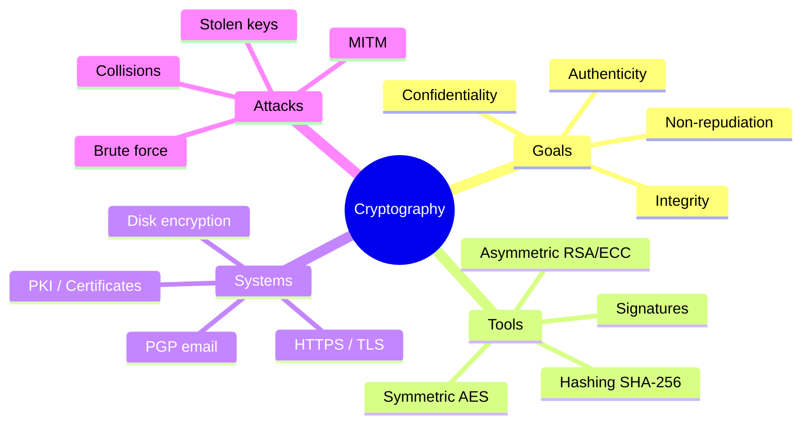
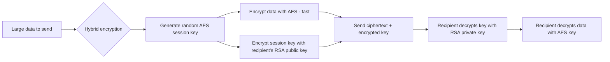
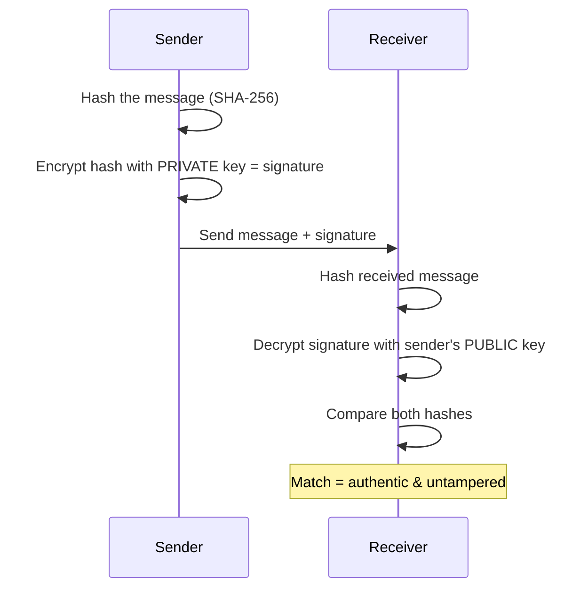
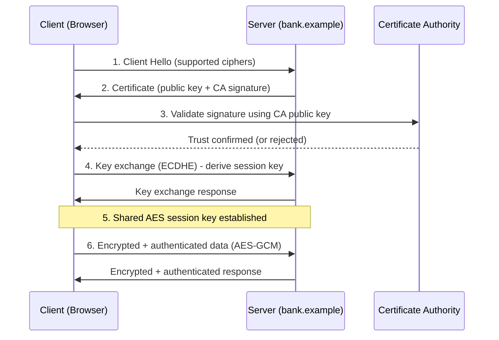

# Cryptography

> **What you'll learn:** How encryption, hashing, digital signatures, and certificates protect data — plus the tools and attacks that test those protections.
> **Prerequisites:** Basic command-line comfort, a rough idea of how networks and files work, and a willingness to think in terms of "secrets" and "keys." No math degree required.

| Course | Course code | Module | Level |
|---|---|---|---|
| Skillogic CSPP — Professional Level 2 | SKL-CSP2-711 | Module 11: Cryptography | level2 |

---

## 1. In Plain English

Imagine mailing a locked diary to a friend overseas. Padlock it and keep the key — your friend can't open it. Mail the key separately — a thief intercepts it. Cryptography is the centuries-old art of solving exactly this puzzle: **keep a message secret, prove who sent it, and detect tampering — even when the message travels through untrusted places.**

In computing, the "message" might be your bank password, a credit card number crossing the internet, or your entire hard drive. **Cryptography** ("secret writing") turns readable **plaintext** into scrambled **ciphertext** using a recipe (an **algorithm**) and a secret value (a **key**). Without the right key, you see only noise.

Why should a beginner care? Cryptography is the invisible machinery behind almost everything you trust online — the browser padlock, the "end-to-end encrypted" chat label, the chip in your debit card. Done right, snoops are locked out. Done wrong (weak algorithms, leaked keys, sloppy setup), the lock becomes decorative and your secrets spill out.

> 🔑 **Key idea:** Cryptography provides three protections — secrecy, tamper-detection, and proof of origin. The rest of this module is just *how*.



---

## 2. Core Concepts

### Plaintext, Ciphertext, and Keys

| Term | Meaning |
|---|---|
| **Plaintext** | Original readable data |
| **Ciphertext** | Scrambled output |
| **Cipher / algorithm** | The math procedure converting between the two |
| **Key** | Secret number that personalizes the algorithm — same algorithm + different key = totally different ciphertext |
| **Encryption** | The scrambling step |
| **Decryption** | Reversing it back to plaintext |

> 🔑 **Key idea — Kerckhoffs's Principle:** A system should stay secure even if everyone knows the algorithm — *only the key must be secret.* This is why strong crypto uses public, peer-reviewed algorithms.

> ⚠️ **Warning:** "Security through obscurity" — hiding the algorithm and hoping nobody figures it out — is a red flag, not a defense.

### The Three Goals 🎯

| Goal | Means | Achieved by |
|---|---|---|
| 🔒 **Confidentiality** | Only authorized people can read it | Encryption |
| ✅ **Integrity** | Detect any change, even one bit | Hashing, MACs |
| 🪪 **Authenticity** | Prove *who* created/sent it | Digital signatures |
| 📝 **Non-repudiation** | Sender can't later deny sending | Digital signatures |

### Symmetric Encryption

The *same* key locks and unlocks — like a house key: whoever holds it can lock and unlock the door. Symmetric ciphers are extremely fast and ideal for large amounts of data.

- **AES (Advanced Encryption Standard)** — the dominant algorithm, standardized by U.S. NIST in 2001. A **block cipher** (encrypts fixed 128-bit blocks), with key sizes of 128, 192, or 256 bits. AES-256 is used for top-secret data.
- **DES** (56-bit key) and **3DES** — now weak/deprecated; never use for new systems.

Because a block cipher handles one block at a time, it needs a **mode of operation** to chain blocks safely:

| Mode | Verdict | Why |
|---|---|---|
| **ECB** (Electronic Codebook) | ❌ Insecure | Identical plaintext blocks → identical ciphertext, leaking patterns |
| **CBC** (Cipher Block Chaining) | ⚠️ OK but careful | Chains blocks; no built-in integrity |
| **GCM** (Galois/Counter Mode) | ✅ Preferred | Encrypts *and* verifies integrity in one step (authenticated) |

> 🔑 **Key idea — the key distribution problem:** How do two parties agree on the same secret key without an eavesdropper capturing it? Asymmetric crypto solves this.

The infamous ECB pattern leak — encrypting an image with ECB still reveals its outline:

> 🖼️ *Suggested image: the classic "ECB Penguin" comparison (original image vs ECB-encrypted vs secure-mode-encrypted) showing how ECB leaks structure.*

### Asymmetric (Public-Key) Encryption

Uses a *pair* of mathematically linked keys: a **public key** (shared freely) and a **private key** (kept secret). Data encrypted with the public key can only be decrypted with the matching private key, and vice versa.

> 💡 **Tip — the mailbox analogy:** Anyone can drop a letter in the slot (encrypt with the public key), but only the person with the mailbox key (private key) can take letters out (decrypt). You publish your public key anywhere, and people send you secrets with no pre-shared password.


| Algorithm | Based on | Notes |
|---|---|---|
| **RSA** | Difficulty of factoring the product of two large primes | Key sizes 2048 or 4096 bits; can encrypt *and* sign |
| **ECC** (Elliptic Curve) | Math of elliptic curves | Same security as RSA with much smaller keys (256-bit ECC ≈ 3072-bit RSA) — faster, lighter, ideal for mobile/IoT |
| **Diffie–Hellman (DH/ECDH)** | Discrete-log problem | Not encryption — a **key exchange** that derives a shared secret over an open channel |

Asymmetric crypto is slow, so real systems use **hybrid encryption**: asymmetric crypto to safely exchange a one-time symmetric **session key**, then fast symmetric crypto (AES) for the data. This is exactly what HTTPS does.



### Symmetric vs Asymmetric at a Glance

| Property | 🔑 Symmetric (AES) | 🗝️ Asymmetric (RSA/ECC) |
|---|---|---|
| Keys | One shared secret | Public + private pair |
| Speed | Very fast | Slow |
| Best for | Bulk data encryption | Key exchange, signatures |
| Key distribution | Hard (the core problem) | Easy (publish public key) |
| Scales to many users | Poorly (n² keys) | Well |

### Hashing

A **cryptographic hash function** takes input of any size and produces a fixed-length fingerprint — a **hash** or **digest**. Good hashes are:

- **One-way** — you can't reverse the digest back to the input.
- **Deterministic** — same input always gives the same digest.
- **Collision-resistant** — infeasible to find two inputs with the same digest.

> ⚠️ **Warning:** Hashing is **not** encryption — there's no key and no way to decrypt. It's used for **integrity** (did this file change?) and password storage.

| Algorithm | Status | Use for security? |
|---|---|---|
| **SHA-256 / SHA-3** | ✅ Current standard | Yes |
| **SHA-1** | ❌ Broken (collisions found) | No |
| **MD5** | ❌ Broken (collisions found) | No |

For passwords, plain hashing isn't enough. Add a **salt** (random value mixed into each password so identical passwords get different hashes) and use deliberately *slow* hashes — **bcrypt**, **scrypt**, or **Argon2** — to make brute-forcing expensive.

### Message Authentication and Digital Signatures

- **MAC (Message Authentication Code)**, e.g. **HMAC** — combines a hash with a *secret key* to prove both integrity and that the sender knew the key.
- **Digital signature** — goes further with asymmetric keys: the sender hashes the message and encrypts that hash with their *private* key. Anyone verifies it with the sender's *public* key, proving the message is authentic, unaltered, and non-repudiable.



---

## 3. How It Works (Step by Step)

The most important real-world flow: **a browser establishing an HTTPS/TLS connection.** It ties together asymmetric crypto, certificates, hashing, and symmetric crypto.

1. **Client Hello** — Your browser connects to `https://bank.example` and announces which cipher suites it supports.
2. **Server certificate** — The server sends its **digital certificate** (public key + signature from a trusted **Certificate Authority**).
3. **Certificate validation** — Your browser checks the CA's signature using the CA's public key (pre-installed in the OS/browser trust store), confirms the cert isn't expired or revoked, and verifies the domain matches. This proves you're talking to the *real* bank.
4. **Key exchange** — Using **ECDHE** (Elliptic Curve Diffie–Hellman Ephemeral), client and server derive a shared **session key** without sending it across the wire. This gives **forward secrecy**: even if the server's private key leaks later, past sessions stay safe.
5. **Symmetric encryption begins** — All further data uses fast **AES-GCM** with the session key. GCM also guarantees integrity.
6. **Ongoing integrity** — Each record is authenticated, so an attacker flipping bits in transit is caught immediately.

> ⚠️ **Warning:** A **man-in-the-middle (MITM)** attacker tries to slip in their own certificate at step 2 — but step 3's CA validation foils them unless they forge a CA signature or trick the user into trusting a rogue CA.



> 🖼️ *Suggested image: a browser address bar showing the HTTPS padlock and the certificate details popup (issuer, validity dates, subject).*

---

## 4. Real-World Examples

| Incident | What happened | Lesson |
|---|---|---|
| 🩸 **Heartbleed** (2014, CVE-2014-0160) | A bug in the OpenSSL library let attackers read chunks of server memory — potentially private keys, session cookies, passwords. Not a weakness in the *algorithms* but in the *implementation*. | Crypto is only as strong as the code running it. Fix required patching OpenSSL **and** rotating affected keys/certs. |
| 🔥 **Flame malware** (discovered 2012) | Forged a Microsoft certificate by exploiting an **MD5 collision**, masquerading as legitimate Windows Update content. | Broken hashes are dangerous: an attacker who manufactures two inputs with the same hash can forge trusted signatures. |
| 🔐 **Ransomware** | Encrypts files with strong hybrid crypto — a unique AES key per file, those keys encrypted by an attacker-held RSA public key. Without the attacker's RSA private key, recovery is mathematically infeasible. | Crypto used *against* defenders. Offline, immutable backups matter more than trying to "crack" it. |

---

## 5. Tools of the Trade

| Tool | Best for | Type |
|---|---|---|
| **OpenSSL** | Keys, certs, encryption, hashing — everything | CLI |
| **GnuPG (GPG)** | Email & file encryption/signing (OpenPGP) | CLI |
| **Hashcat** | High-speed password recovery / hash cracking | CLI (red team/forensics) |
| **VeraCrypt** | Encrypted volumes & full-disk encryption | GUI |
| **CyberChef** | Encoding, decoding, hashing, quick experiments | Browser, no install |

### OpenSSL — the crypto Swiss-army knife

```bash
# Generate a 2048-bit RSA private key
openssl genrsa -out private.key 2048

# Create a self-signed certificate valid 365 days (lab/testing only)
openssl req -new -x509 -key private.key -out cert.pem -days 365

# Inspect a remote server's TLS certificate
openssl s_client -connect example.com:443 -servername example.com
```
The first builds a private key; the second wraps a public key into a certificate; the third connects to a live site and dumps its certificate chain so you can verify issuer and expiry.

### GnuPG (GPG) — OpenPGP for email/files

```bash
# Generate a personal key pair (interactive)
gpg --full-generate-key

# Encrypt a file for a recipient using their public key
gpg --encrypt --recipient alice@example.com secret.txt
```
This encrypts `secret.txt` so only Alice's private key can decrypt it.

### Hashcat — password-recovery / hash testing

```bash
# Dictionary attack against MD5 hashes (lab use only)
hashcat -m 0 -a 0 hashes.txt wordlist.txt
```
`-m 0` selects MD5; `-a 0` is straight dictionary mode.

> ⚠️ **Warning:** Use Hashcat (and any cracking tool) **only** on hashes you are explicitly authorized to crack.

---

## 6. Hands-On Lab (Authorized / Lab-Only)

> ⚠️ **Warning:** Perform these steps only on systems you own or are explicitly authorized to test. Never run cracking or interception tooling against systems, networks, or accounts you don't control.

**Goal:** Build a small lab and run an end-to-end "weak crypto discovery and detection" exercise.

**Setup.** Spin up a multi-VM home lab (VirtualBox/VMware) or a cloud sandbox: one **attacker VM** (Kali Linux) and one **target VM** (a basic Linux web server). Keep both on an isolated host-only network so nothing leaks to the real internet.

```mermaid
graph LR
    A[Attacker VM - Kali] -->|host-only network| T[Target VM - Linux web server]
    A -.sslscan / testssl.sh.-> T
    A -.hashcat / john.-> H[(Leaked hash file)]
    T --> H
```

1. **Stand up weak TLS.** On the target, configure nginx/Apache with a deliberately weak, self-signed certificate (short RSA key, outdated cipher suite). Simulates a misconfigured legacy service.
2. **Enumerate the crypto.** From the attacker VM, run a TLS scanner (`sslscan`, `testssl.sh`, or `nmap --script ssl-enum-ciphers`) against port 443. Identify weak ciphers, expired/self-signed certs, and unsafe protocol versions. Adapt the scan flags yourself for host and port.
3. **Crack a weak password hash.** Generate salted and unsalted password hashes on the target (simulating a leaked database). Transfer the file to the attacker VM and use `hashcat` or `john` with a small wordlist. Observe how *salted, slow* hashes (bcrypt/Argon2) resist cracking while raw MD5 falls instantly — adapt the hash-mode flag per algorithm.
4. **Demonstrate integrity failure.** Hash a file with `sha256sum`, modify a single byte, re-hash. Confirm the digest changes completely — this is how tampering is detected.
5. **Validate the defense.** Re-harden the target: install a properly issued (or strong self-signed) certificate, disable weak ciphers and old protocols, switch password storage to bcrypt/Argon2. Re-run steps 2 and 3 and confirm the findings disappear. Capture before/after scanner output as evidence.

**What you proved:** how attackers discover and exploit weak crypto, and how blue teams detect and remediate it.

> 🖼️ *Suggested image: side-by-side testssl.sh output — "before" (red weak-cipher findings) vs "after" hardening (all green).*

---

## 7. Countermeasures & Defenses

Attacks rarely break the math — they exploit weak choices, bad implementations, or stolen keys. Here is the attack-to-defense mapping:

| Attack 🗡️ | Defense 🛡️ |
|---|---|
| Weak/legacy algorithm (DES, RC4, MD5) | Use modern primitives (AES-256, SHA-256/3, Argon2) |
| ECB pattern leakage | Use authenticated modes (GCM) |
| Stolen private key | Store keys in HSM/vault; rotate regularly |
| MITM / rogue certificate | Strict cert validation; pinning; Certificate Transparency |
| Protocol downgrade | Require TLS 1.2/1.3; disable old versions; HSTS |
| Password brute-force | Salt + slow hash (bcrypt/scrypt/Argon2) |
| Ransomware encryption | Offline/immutable backups |

**Choose strong primitives**
- AES-256 (GCM mode) for symmetric; RSA-2048+/RSA-4096 or ECC (P-256+) for asymmetric.
- SHA-256/SHA-3 for hashing; bcrypt, scrypt, or Argon2 for passwords with unique salts.
- Retire MD5, SHA-1, DES, 3DES, RC4, and ECB mode.

**Protect keys (the crown jewels)**
- Store private keys in a Hardware Security Module (HSM) or managed key vault — never in source code or plaintext config.
- Rotate keys and certificates on a schedule, and immediately after any suspected exposure.
- Enforce least-privilege access to key material.

**Configure transport correctly**
- Require TLS 1.2 or 1.3; disable older protocols.
- Enable forward secrecy (ECDHE) and HSTS to force HTTPS.
- Validate certificates strictly; consider certificate pinning for high-value mobile apps.

**Detect and monitor**
- Scan endpoints regularly with testssl.sh or nmap's ssl-enum-ciphers.
- Use Certificate Transparency logs to spot rogue certificates issued for your domains.
- Alert on expired/expiring certificates and on downgrade attempts.

**Protect data at rest**
- Enable full-disk encryption (BitLocker, FileVault, LUKS, VeraCrypt) on laptops and removable media.
- Encrypt database fields and backups; keep at least one offline/immutable backup against ransomware.

**Plan ahead**
- Track migration toward **post-quantum cryptography** (NIST-standardized algorithms) for long-lived secrets.

---

## 8. Key Terms

| Term | Definition |
|---|---|
| **Plaintext / Ciphertext** | Readable data / its scrambled, encrypted form |
| **Key** | The secret value that personalizes a cipher |
| **Symmetric encryption** | Same key encrypts and decrypts (e.g., AES) |
| **Asymmetric encryption** | Public/private key pair (e.g., RSA, ECC) |
| **Hash / Digest** | A fixed-length one-way fingerprint of data |
| **Salt** | Random data added to a password before hashing |
| **Digital signature** | A hash encrypted with a private key, proving authenticity and integrity |
| **PKI** | Public Key Infrastructure — CAs, certs, and policies binding public keys to identities |
| **Certificate Authority (CA)** | A trusted entity that signs certificates |
| **TLS** | The protocol securing web/email traffic; powers HTTPS |
| **Forward secrecy** | Past sessions stay safe even if a long-term key later leaks |
| **MITM** | Man-in-the-Middle — attacker secretly relays/alters traffic between two parties |
| **Collision** | Two different inputs producing the same hash (a break) |

---

## 9. Summary & Takeaways

- Cryptography delivers three goals: **confidentiality** (encryption), **integrity** (hashing/MACs), and **authenticity** (digital signatures).
- **Symmetric** crypto (AES) is fast for bulk data; **asymmetric** crypto (RSA, ECC) solves key distribution; real systems combine both as **hybrid encryption**.
- **Hashing is one-way** and key-less — never confuse it with encryption; always salt and slow-hash passwords.
- **PKI and certificates** let strangers trust each other online, anchored in Certificate Authorities; **email encryption** (PGP, S/MIME) and **disk encryption** (BitLocker, LUKS, VeraCrypt) apply the same primitives to messages and storage.
- Most real breaks target **weak algorithms, broken implementations (Heartbleed), or stolen keys** — not the unbreakable math.
- Defenders should use modern primitives, protect keys in HSMs/vaults, enforce TLS 1.2/1.3 with forward secrecy, monitor certificates, and prepare for **post-quantum** migration.
- Common crypto attacks: MITM, hash collisions, brute-force/dictionary, padding-oracle, and downgrade attacks — all preventable with correct configuration.

> 💡 **Tip:** If you remember one thing: *protect the key, not the algorithm.* Almost every real-world crypto failure is a key-management or configuration failure, not broken math.

**Further reading:** NIST SP 800-57 (Key Management) and FIPS 197 (AES); OWASP Cryptographic Storage and Transport Layer Protection Cheat Sheets; MITRE ATT&CK techniques under Credential Access and Collection; the OpenSSL and GnuPG official documentation.
