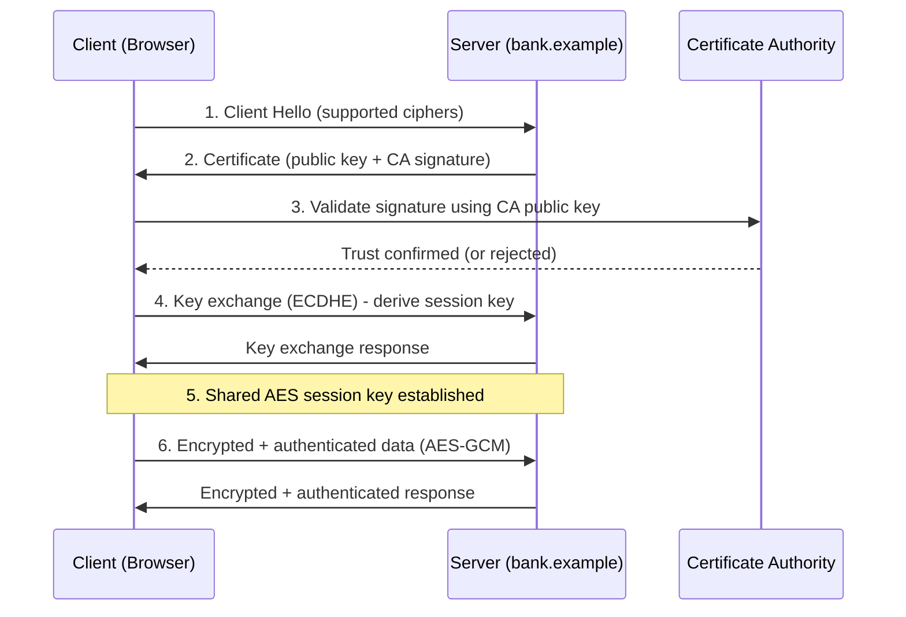

# Cryptography

> **What you'll learn:** How encryption, hashing, digital signatures, and certificates protect data — plus the tools and attacks that test those protections.
> **Prerequisites:** Basic command-line comfort, a rough idea of how networks and files work, and a willingness to think in terms of "secrets" and "keys." No math degree required.

| Course | Course code | Module | Level |
|---|---|---|---|
| Skillogic CSPP — Professional Level 2 | SKL-CSP2-711 | Module 11: Cryptography | level2 |

---

## 1. In Plain English

Imagine you want to mail a locked diary to a friend across the world. If you put a padlock on it and keep the only key, your friend can't open it. If you mail the key separately, a thief could intercept it. Cryptography is the centuries-old art of solving exactly this puzzle: **how to keep a message secret, prove who sent it, and detect if anyone tampered with it — even when the message travels through dangerous, untrusted places.**

In computing, the "message" might be your bank password, a credit card number flying across the internet, or the entire contents of your laptop's hard drive. **Cryptography** (literally "secret writing") turns readable information, called **plaintext**, into scrambled gibberish called **ciphertext**, using a recipe (an **algorithm**) and a secret value (a **key**). Anyone without the right key sees only noise.

Why should a total beginner care? Because cryptography is the invisible machinery behind almost everything you trust online. The little padlock in your browser, the "end-to-end encrypted" label on your chat app, the chip in your debit card — all of it is cryptography doing its job. When it's done right, criminals and snoops are locked out. When it's done wrong (weak algorithms, leaked keys, sloppy setup), the lock becomes decorative, and your secrets spill out.

This module teaches you the core ideas, the main algorithm families, how the pieces fit together into real systems like HTTPS and email encryption, and finally how attackers try to break crypto — so you can defend it.

---

## 2. Core Concepts

### Plaintext, Ciphertext, and Keys

**Plaintext** is the original readable data. **Ciphertext** is the scrambled output. An **encryption algorithm** (also called a **cipher**) is the mathematical procedure that converts one to the other. A **key** is a secret number that personalizes the algorithm — the same algorithm with two different keys produces two completely different ciphertexts. **Encryption** is the scrambling step; **decryption** is reversing it back to plaintext.

A foundational rule is **Kerckhoffs's Principle**: a system should stay secure even if everyone knows how the algorithm works — *only the key must be secret*. This is why strong cryptography uses public, peer-reviewed algorithms. "Security through obscurity" (hiding the algorithm and hoping nobody figures it out) is considered a red flag.

### The Three Goals: Confidentiality, Integrity, Authenticity

Cryptography serves three overlapping goals:

- **Confidentiality** — only authorized people can read the data (achieved by encryption).
- **Integrity** — you can detect if data was changed, even by one bit (achieved by hashing and MACs).
- **Authenticity** — you can prove *who* created or sent the data (achieved by digital signatures).

A fourth related goal, **non-repudiation**, means a sender cannot later deny having sent something — digital signatures provide this.

### Symmetric Encryption

In **symmetric encryption**, the *same* key both locks and unlocks the data. It's like a house key: whoever holds it can lock and unlock the door. Symmetric ciphers are extremely fast and ideal for encrypting large amounts of data.

The dominant symmetric algorithm today is **AES (Advanced Encryption Standard)**, standardized by the U.S. NIST in 2001. AES is a **block cipher** — it encrypts fixed-size chunks (128-bit blocks) — and supports key sizes of 128, 192, or 256 bits. AES-256 is widely used for top-secret data. Older symmetric ciphers like **DES** (56-bit key) and **3DES** are now considered weak or deprecated and should not be used for new systems.

Because a block cipher only handles one block at a time, it needs a **mode of operation** to safely chain blocks together. **ECB (Electronic Codebook)** mode is insecure because identical plaintext blocks produce identical ciphertext, leaking patterns. Modern systems use modes like **CBC** or, preferably, **authenticated modes** such as **GCM (Galois/Counter Mode)**, which encrypt *and* verify integrity in one step.

The big challenge with symmetric crypto is the **key distribution problem**: how do two parties agree on the same secret key without an eavesdropper capturing it? That's where asymmetric crypto comes in.

### Asymmetric (Public-Key) Encryption

**Asymmetric encryption** uses a *pair* of mathematically linked keys: a **public key** (shared freely with the world) and a **private key** (kept secret). Data encrypted with the public key can only be decrypted with the matching private key, and vice versa.

The analogy: imagine a mailbox with a slot. Anyone can drop a letter in (encrypt with the public key), but only the person with the mailbox key (the private key) can take letters out (decrypt). This elegantly solves key distribution — you can publish your public key anywhere, and people can send you secrets without a pre-shared password.

Key asymmetric algorithms:

- **RSA** — the classic, based on the difficulty of factoring the product of two very large prime numbers. Common key sizes are 2048 or 4096 bits. RSA can both encrypt and create signatures.
- **ECC (Elliptic Curve Cryptography)** — based on the math of elliptic curves. ECC achieves the same security as RSA with *much smaller* keys (a 256-bit ECC key roughly matches a 3072-bit RSA key), making it faster and lighter — perfect for mobile and IoT devices.
- **Diffie–Hellman (DH / ECDH)** — not strictly encryption, but a **key exchange** protocol that lets two parties derive a shared secret over an open channel.

Asymmetric crypto is slow, so real systems use **hybrid encryption**: asymmetric crypto to safely exchange a one-time symmetric key (the **session key**), then fast symmetric crypto (AES) for the actual data. This is exactly what HTTPS does.

### Hashing

A **cryptographic hash function** takes input of any size and produces a fixed-length fingerprint called a **hash** or **digest**. Good hashes have three properties: they're **one-way** (you can't reverse the digest back to the input), **deterministic** (same input always gives the same digest), and **collision-resistant** (it's infeasible to find two inputs with the same digest).

Hashing is *not* encryption — there's no key and no way to decrypt. It's used for **integrity** (did this file change?) and for storing passwords. Common algorithms: **SHA-256** and **SHA-3** are current standards; **MD5** and **SHA-1** are broken (collisions found) and should never be used for security.

For passwords specifically, plain hashing isn't enough. Defenders add a **salt** (a random value mixed into each password so identical passwords get different hashes) and use deliberately *slow* hashes like **bcrypt**, **scrypt**, or **Argon2** to make brute-forcing expensive.

### Message Authentication and Digital Signatures

A **MAC (Message Authentication Code)**, such as **HMAC**, combines a hash with a secret key to prove both integrity and that the sender knew the key. A **digital signature** goes further using asymmetric keys: the sender hashes the message and encrypts that hash with their *private* key. Anyone can verify it with the sender's *public* key, proving the message is authentic, unaltered, and non-repudiable.

---

## 3. How It Works (Step by Step)

Let's walk through the single most important real-world flow: **a browser establishing an HTTPS/TLS connection to a website.** This ties together asymmetric crypto, certificates, hashing, and symmetric crypto.

1. **Client Hello** — Your browser connects to `https://bank.example` and announces which cipher suites (algorithm combos) it supports.
2. **Server certificate** — The server sends its **digital certificate**, which contains its public key and is signed by a trusted **Certificate Authority (CA)**.
3. **Certificate validation** — Your browser checks the CA's signature using the CA's public key (pre-installed in the OS/browser trust store), confirms the certificate isn't expired or revoked, and verifies the domain name matches. This proves you're talking to the *real* bank, not an impostor.
4. **Key exchange** — Using ECDHE (Elliptic Curve Diffie–Hellman Ephemeral), the client and server derive a shared **session key** without ever sending it across the wire. This also provides **forward secrecy**: even if the server's private key leaks later, past sessions stay safe.
5. **Symmetric encryption begins** — All further data (your login, transactions) is encrypted with fast AES-GCM using the session key. GCM also guarantees integrity, so tampering is detected.
6. **Ongoing integrity** — Each record is authenticated, so an attacker who flips bits in transit is caught immediately.

On the attack side, an adversary attempting a **man-in-the-middle (MITM)** attack would try to slip in their own certificate at step 2 — but step 3's CA validation foils them unless they can forge a CA signature or trick the user into trusting a rogue CA.



---

## 4. Real-World Examples

**Heartbleed (2014, CVE-2014-0160).** A bug in the OpenSSL library let attackers read chunks of a server's memory — potentially including private keys, session cookies, and passwords. It wasn't a weakness in the *algorithms* but in the *implementation*, a powerful lesson that crypto is only as strong as the code running it. The fix required patching OpenSSL *and* rotating affected private keys and certificates.

**The Flame malware (discovered 2012).** This espionage toolkit forged a Microsoft digital certificate by exploiting an MD5 hash **collision**, letting it masquerade as legitimate Windows Update content. It's a textbook example of why broken hash functions like MD5 are dangerous: an attacker who can manufacture two inputs with the same hash can forge trusted signatures.

**Ransomware encryption.** Modern ransomware families encrypt a victim's files using strong hybrid crypto — a unique AES key per file, with the AES keys themselves encrypted by an attacker-held RSA public key. Without the attacker's RSA private key, recovery is mathematically infeasible. This is cryptography used *against* defenders, and it underscores why offline, immutable backups matter more than trying to "crack" the encryption.

---

## 5. Tools of the Trade

### OpenSSL
A Swiss-army knife for almost any crypto task: keys, certificates, encryption, hashing.

```bash
# Generate a 2048-bit RSA private key
openssl genrsa -out private.key 2048

# Create a self-signed certificate valid 365 days (lab/testing only)
openssl req -new -x509 -key private.key -out cert.pem -days 365

# Inspect a remote server's TLS certificate
openssl s_client -connect example.com:443 -servername example.com
```
The first command builds a private key; the second wraps a public key into a certificate; the third connects to a live site and dumps its certificate chain so you can verify the issuer and expiry.

### GnuPG (GPG)
The open-source implementation of OpenPGP, used for email and file encryption and signing.

```bash
# Generate a personal key pair (interactive)
gpg --full-generate-key

# Encrypt a file for a recipient using their public key
gpg --encrypt --recipient alice@example.com secret.txt
```
This encrypts `secret.txt` so only Alice's private key can decrypt it.

### Hashcat
A high-speed password-recovery tool used by red teams (and forensics) to test password strength against captured hashes.

```bash
# Dictionary attack against MD5 hashes (lab use only)
hashcat -m 0 -a 0 hashes.txt wordlist.txt
```
`-m 0` selects the MD5 hash type, `-a 0` is straight dictionary mode. Use only on hashes you are authorized to crack.

### VeraCrypt
Free, open-source disk-encryption software (successor to TrueCrypt) for encrypted volumes and full-disk encryption. Mostly GUI-driven; it creates encrypted "container" files or encrypts whole partitions with AES, Serpent, or cascades.

### CyberChef
A browser-based "cyber Swiss-army knife" for encoding, decoding, hashing, and quick crypto experiments — great for learning, with no installation needed.

---

## 6. Hands-On Lab (Authorized / Lab-Only)

> **Reminder:** Perform these steps only on systems you own or are explicitly authorized to test. Never run cracking or interception tooling against systems, networks, or accounts you don't control.

**Goal:** Build a small lab and run an end-to-end "weak crypto discovery and detection" exercise.

**Setup.** Spin up a multi-VM home lab (VirtualBox/VMware) or a cloud sandbox: one **attacker VM** (Kali Linux) and one **target VM** (a basic Linux web server). Keep both on an isolated host-only network so nothing leaks to the real internet.

1. **Stand up weak TLS.** On the target, configure a web server (nginx/Apache) with a deliberately weak, self-signed certificate (e.g., short RSA key, outdated cipher suite). This simulates a misconfigured legacy service.

2. **Enumerate the crypto.** From the attacker VM, use a TLS scanner (such as `sslscan`, `testssl.sh`, or `nmap --script ssl-enum-ciphers`) against the target's port 443. Identify weak ciphers, expired or self-signed certs, and unsafe protocol versions. Adapt the scan flags yourself to target the right host and port.

3. **Crack a weak password hash.** Generate a few salted and unsalted password hashes on the target (simulating a leaked database). Transfer the hash file to the attacker VM and use `hashcat` or `john` with a small wordlist to recover the weak ones. Observe how *salted, slow* hashes (bcrypt/Argon2) resist cracking while raw MD5 falls instantly — adapt the hash-mode flag for each algorithm.

4. **Demonstrate integrity failure.** Hash a file with `sha256sum`, modify a single byte, and re-hash. Confirm the digest changes completely — this is how tampering is detected.

5. **Validate the defense.** Re-harden the target: install a properly issued (or strong self-signed) certificate, disable weak ciphers and old protocol versions, and switch password storage to bcrypt/Argon2. Re-run step 2's scanner and step 3's cracker and confirm the previous findings disappear. Capture before/after scanner output as evidence.

**What you proved:** how attackers discover and exploit weak crypto, and how blue teams detect and remediate it.

---

## 7. Countermeasures & Defenses

**Choose strong primitives**
- Use AES-256 (GCM mode) for symmetric encryption; RSA-2048+/RSA-4096 or ECC (P-256+) for asymmetric.
- Use SHA-256/SHA-3 for hashing; bcrypt, scrypt, or Argon2 for passwords with unique salts.
- Retire MD5, SHA-1, DES, 3DES, RC4, and ECB mode.

**Protect keys (the crown jewels)**
- Store private keys in a Hardware Security Module (HSM) or a managed key vault, never in source code or plaintext config.
- Rotate keys and certificates on a schedule, and immediately after any suspected exposure.
- Enforce least-privilege access to key material.

**Configure transport correctly**
- Require TLS 1.2 or 1.3; disable older protocols.
- Enable forward secrecy (ECDHE) and HSTS to force HTTPS.
- Validate certificates strictly; consider certificate pinning for high-value mobile apps.

**Detect and monitor**
- Scan endpoints regularly with tools like testssl.sh or nmap's ssl-enum-ciphers.
- Use Certificate Transparency logs to spot rogue certificates issued for your domains.
- Alert on expired/expiring certificates and on downgrade attempts.

**Protect data at rest**
- Enable full-disk encryption (BitLocker, FileVault, LUKS, VeraCrypt) on laptops and removable media.
- Encrypt database fields and backups; keep at least one offline/immutable backup against ransomware.

**Plan ahead**
- Track the migration toward **post-quantum cryptography** (NIST-standardized algorithms) for long-lived secrets.

---

## 8. Key Terms

- **Plaintext / Ciphertext** — readable data / its scrambled, encrypted form.
- **Key** — the secret value that personalizes a cipher.
- **Symmetric encryption** — same key encrypts and decrypts (e.g., AES).
- **Asymmetric encryption** — public/private key pair (e.g., RSA, ECC).
- **Hash / Digest** — a fixed-length one-way fingerprint of data.
- **Salt** — random data added to a password before hashing.
- **Digital signature** — a hash encrypted with a private key, proving authenticity and integrity.
- **PKI (Public Key Infrastructure)** — the system of CAs, certificates, and policies that bind public keys to identities.
- **Certificate Authority (CA)** — a trusted entity that signs certificates.
- **TLS** — the protocol securing web/email traffic; powers HTTPS.
- **Forward secrecy** — past sessions stay safe even if a long-term key later leaks.
- **MITM (Man-in-the-Middle)** — attacker secretly relays/alters traffic between two parties.
- **Collision** — two different inputs producing the same hash (a break).

---

## 9. Summary & Takeaways

- Cryptography delivers three goals: **confidentiality** (encryption), **integrity** (hashing/MACs), and **authenticity** (digital signatures).
- **Symmetric** crypto (AES) is fast for bulk data; **asymmetric** crypto (RSA, ECC) solves key distribution; real systems combine both as **hybrid encryption**.
- **Hashing is one-way** and key-less — never confuse it with encryption; always salt and slow-hash passwords.
- **PKI and certificates** let strangers trust each other on the internet, anchored in Certificate Authorities; **email encryption** (PGP, S/MIME) and **disk encryption** (BitLocker, LUKS, VeraCrypt) apply the same primitives to messages and storage.
- Most real breaks target **weak algorithms, broken implementations (Heartbleed), or stolen keys** — not the unbreakable math itself.
- Defenders should use modern primitives, protect keys in HSMs/vaults, enforce TLS 1.2/1.3 with forward secrecy, monitor certificates, and prepare for **post-quantum** migration.
- Common crypto attacks include MITM, hash collisions, brute-force/dictionary attacks, padding-oracle and downgrade attacks — all preventable with correct configuration.

**Further reading:** NIST SP 800-57 (Key Management) and FIPS 197 (AES); OWASP Cryptographic Storage and Transport Layer Protection Cheat Sheets; MITRE ATT&CK techniques under Credential Access and Collection; the OpenSSL and GnuPG official documentation.
