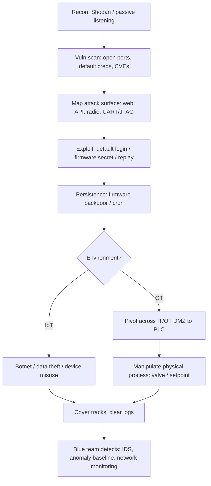

# IoT & OT Hacking

> **What you'll learn:** How internet-connected "smart" devices (IoT) and industrial control machinery (OT) work, how attackers find and exploit them, and how defenders detect and stop those attacks.
> **Prerequisites:** Basic networking (IP addresses, ports, TCP/UDP), comfort with a Linux terminal, and the earlier CSPP modules on reconnaissance and network scanning.

| | |
|---|---|
| **Course** | Professional Level 2 |
| **Course code** | SKL-CSP2-711 |
| **Module** | IoT & OT Hacking |
| **Level** | level2 |

---

## 1. In Plain English

Imagine your home is filling up with gadgets that can talk to the internet: a doorbell with a camera, a thermostat you control from your phone, a baby monitor, a smart speaker, even a fridge. Each of these is a tiny computer. Collectively we call them **IoT** — the **Internet of Things**. The "thing" is any everyday object that has been given a network connection and a small brain so it can send and receive data.

Now picture a much bigger, more serious version of that idea: the machines that run a water treatment plant, a power grid, a factory assembly line, or an oil pipeline. These are controlled by specialized computers too, but the stakes are physical and high — if they misbehave, water can be poisoned, lights can go out, or machinery can be destroyed. We call this world **OT** — **Operational Technology**. OT is the technology that monitors and controls physical processes in the real world.

Why should a beginner care? Because these devices are often the *weakest* link. A laptop gets security patches every month; a smart lightbulb or a 20-year-old factory controller almost never does. Attackers love weak links. A cheap camera with a default password of `admin/admin` can become the doorway into an entire network, or one of millions of devices in a botnet (an army of hijacked machines used to attack others).

Think of it like a house with a state-of-the-art front door (your patched laptop) but a flimsy pet flap at the back (the smart bulb). This module teaches you where those pet flaps are, how attackers crawl through them, and — most importantly — how to seal them.

---

## 2. Core Concepts

### 2.1 What "IoT" actually means

An **IoT device** is a physical object embedded with sensors, software, and a network connection that lets it collect and exchange data. Examples: smart cameras, smart locks, fitness trackers, connected medical devices, and home routers.

A typical IoT device has four parts:
- **Sensors/actuators** — sensors *read* the world (temperature, motion); actuators *change* it (unlock a door, spin a motor).
- **A microcontroller or SoC (System on a Chip)** — the small brain running the firmware.
- **Firmware** — the permanent software baked into the device that makes it work. Think of it as the device's operating system stored on a chip.
- **Connectivity** — Wi-Fi, Bluetooth, Zigbee, Z-Wave, cellular, or other radio protocols used to talk to other devices and the cloud.

### 2.2 The IoT communication models

Devices rarely work alone. Common arrangements:
- **Device-to-Device:** two gadgets talk directly (a fitness band to your phone over Bluetooth).
- **Device-to-Cloud:** the device sends data to a vendor's internet servers (the cloud).
- **Device-to-Gateway:** devices talk to a local hub (gateway) that translates and forwards traffic.
- **Back-end data sharing:** the cloud shares your data with other services.

### 2.3 Common IoT protocols (define before use)

- **MQTT (Message Queuing Telemetry Transport):** a lightweight "publish/subscribe" messaging protocol. Devices *publish* messages to named **topics**; other devices *subscribe* to topics to receive them. A central **broker** routes the messages. It's efficient but, if misconfigured, often allows anyone to connect without a password.
- **CoAP (Constrained Application Protocol):** a web-like protocol (similar to HTTP) designed for tiny devices, running over UDP.
- **UPnP (Universal Plug and Play):** lets devices auto-discover each other on a local network. Convenient, but historically a frequent source of holes because it can expose services to the internet automatically.
- **Zigbee / Z-Wave:** low-power radio protocols for home automation (bulbs, sensors) that form a **mesh network** (devices relay each other's traffic).

### 2.4 The OWASP IoT Top 10

The **OWASP** (Open Worldwide Application Security Project) is a non-profit that publishes widely respected security guidance. Their **IoT Top 10** lists the most common IoT weaknesses. The recurring themes:

| Weakness | Plain explanation |
|---|---|
| Weak/default/hardcoded passwords | Same `admin`/`admin` on every unit, baked in and unchangeable |
| Insecure network services | Open ports running buggy services |
| Insecure ecosystem interfaces | Vulnerable web, API, or cloud dashboards |
| Lack of secure update mechanism | No way to patch, or updates aren't signed/encrypted |
| Use of insecure/outdated components | Old libraries with known bugs |
| Insufficient privacy protection | Personal data stored or sent carelessly |
| Insecure data transfer/storage | No encryption in transit or at rest |
| Lack of device management | Can't monitor or decommission devices |
| Insecure default settings | Ships wide open |
| Lack of physical hardening | Easy to open the case and read the chips |

### 2.5 What "OT" actually means (and ICS, SCADA, PLC)

- **OT (Operational Technology):** hardware and software that detects or causes changes in physical processes — pumps, valves, turbines, conveyor belts.
- **ICS (Industrial Control System):** the umbrella term for the systems used to control industrial processes.
- **SCADA (Supervisory Control and Data Acquisition):** a *type* of ICS used to monitor and control equipment spread over a wide area (e.g., a regional power grid). It includes operator screens, historians (databases of process data), and remote units.
- **PLC (Programmable Logic Controller):** a rugged little industrial computer that directly controls a machine — "if tank level > 90%, close valve." This is the muscle that touches the physical world.
- **HMI (Human-Machine Interface):** the screen an operator uses to watch and command the process.
- **RTU (Remote Terminal Unit):** like a PLC but built for remote field sites.

### 2.6 The Purdue Model

The **Purdue Model** is the classic reference architecture for organizing an OT network into layers, from the physical machines (Level 0) up to the business IT network (Levels 4-5). Security relies on **segmentation** — keeping these layers separated so an attacker who lands in the office email system can't reach a PLC. The boundary between IT and OT is often called the **IT/OT DMZ**.

### 2.7 Insecure industrial protocols

OT protocols were designed decades ago for reliability, *not* security — most have **no authentication or encryption** by default:
- **Modbus:** a simple master/slave protocol to read and write values in PLCs. Anyone who can reach a Modbus device can usually command it.
- **DNP3 (Distributed Network Protocol):** common in utilities (electric/water).
- **EtherNet/IP, PROFINET, S7comm (Siemens):** vendor and industry protocols, similarly trusting by design.

The core lesson: in OT, *reachability often equals control*. Network access is the prize.

---

## 3. How It Works (Step by Step)

Attackers (and authorized penetration testers) follow a repeatable **hacking methodology**. Here it is for an IoT/OT engagement:

1. **Information gathering / reconnaissance.** Identify devices, vendors, firmware versions, and exposed services. Use search engines for internet-connected devices (Shodan, Censys) and passive listening.
2. **Vulnerability scanning.** Probe for open ports, default credentials, known CVEs (publicly catalogued vulnerabilities), and weak protocol configurations.
3. **Attack surface mapping.** Enumerate every entry point: web/admin interfaces, mobile app, cloud API, radio (Bluetooth/Zigbee), and physical ports (UART, JTAG — debug interfaces on the circuit board).
4. **Gaining access / exploitation.** Log in with default credentials, exploit a vulnerable service, replay a captured command, or extract secrets from firmware.
5. **Maintaining access.** Install persistence (e.g., a backdoor in firmware or a cron job) so access survives reboots.
6. **Lateral movement / pivoting.** Use the compromised device as a stepping stone deeper into the network — in OT, from the IT side across the DMZ toward PLCs.
7. **Impact / actions on objective.** In IoT this might be joining a botnet or stealing video feeds; in OT it might be manipulating a process (opening a valve, changing a setpoint).
8. **Covering tracks.** Clear logs and remove artifacts.

For OT specifically, the **MITRE ATT&CK for ICS** framework catalogues these attacker behaviors (tactics and techniques) in a standardized way, which is invaluable for both red and blue teams.



---

## 4. Real-World Examples

**Mirai botnet (2016).** Malware called **Mirai** scanned the internet for IoT devices — mostly cameras and home routers — and tried a built-in list of common default usernames and passwords. It hijacked hundreds of thousands of devices into a botnet and launched massive **DDoS (Distributed Denial of Service)** attacks, flooding targets with traffic. One attack disrupted **Dyn**, a major DNS provider, knocking large parts of the internet (Twitter, Netflix, Reddit) offline for many users. Lesson: default passwords at scale are catastrophic.

**Stuxnet (discovered 2010).** A highly sophisticated worm that targeted **Siemens** PLCs controlling uranium-enrichment centrifuges in Iran. It spread via USB and the IT network, then quietly altered centrifuge speeds while feeding operators normal-looking readings. It is widely cited as the first malware known to cause real physical destruction of industrial equipment. Lesson: OT is reachable and physically consequential.

**Ukraine power grid attack (2015).** Attackers compromised the IT networks of Ukrainian electricity distributors, pivoted into the SCADA systems, and remotely opened circuit breakers, cutting power to roughly a quarter-million people. They also wiped systems to slow recovery. Lesson: IT compromise plus poor IT/OT segmentation leads to grid-level impact. (Use these as documented, widely reported cases; avoid embellishing specifics.)

---

## 5. Tools of the Trade

> All tools below are for use only on systems you own or are explicitly authorized to test.

**Shodan / Censys — internet device search engines.** Find internet-exposed devices by banner, port, or product.
```bash
# Search Shodan for exposed devices reporting a specific product (via CLI)
shodan search "product:MQTT port:1883" --fields ip_str,port,org
```
This lists IPs running MQTT brokers on the default port 1883 — useful to confirm whether *your* broker is unintentionally exposed.

**Nmap — network scanner.** Discover open ports and fingerprint services, including OT protocols via scripts.
```bash
# Scan a host for the common Modbus port and run an enumeration script
nmap -p 502 --script modbus-discover 192.0.2.10
```
Port 502 is Modbus; the `modbus-discover` script enumerates accessible unit IDs without sending control commands.

**Mosquitto clients — MQTT testing.** `mosquitto_sub`/`mosquitto_pub` let you subscribe and publish to an MQTT broker.
```bash
# Subscribe to ALL topics on a broker you control to see if it's open
mosquitto_sub -h 192.0.2.20 -t '#' -v
```
The `#` wildcard subscribes to every topic; if it works with no credentials, the broker is unauthenticated.

**Binwalk — firmware analysis.** Extract and inspect the contents of a firmware image (you own).
```bash
# Identify and extract embedded filesystems/keys from a firmware blob
binwalk -e firmware.bin
```
`-e` extracts found components (e.g., a SquashFS filesystem) so you can hunt for hardcoded passwords or keys.

**Metasploit Framework — exploitation platform.** Includes modules for common IoT/SCADA targets.
```bash
# Search Metasploit for SCADA-related modules
msfconsole -q -x "search scada; exit"
```
This lists auxiliary/exploit modules relevant to industrial systems for authorized testing.

---

## 6. Hands-On Lab (Authorized / Lab-Only)

> **Reminder: Perform this only on lab systems you own or are explicitly authorized to test. Never touch production or third-party IoT/OT devices.**

**Goal:** Stand up a small simulated IoT/OT environment, run the full methodology against it, then validate that your detection works.

**Build the lab (multi-VM or cloud sandbox):**
1. Create an isolated virtual network (VirtualBox/VMware host-only network, or an isolated cloud VPC with no internet egress).
2. **VM-A (vulnerable IoT):** run an MQTT broker (e.g., Mosquitto) with authentication disabled, plus a deliberately vulnerable IoT web app image.
3. **VM-B (OT simulator):** run an open-source Modbus PLC simulator (e.g., a Python `pymodbus` server) exposing holding registers on port 502.
4. **VM-C (attacker):** Kali Linux with Nmap, Metasploit, binwalk, and mosquitto clients.
5. **VM-D (defender):** a sensor running an IDS (e.g., Suricata or Zeek) with traffic mirrored to it.

**Attack chain (adapt IPs/ports yourself):**
1. From VM-C, run host discovery and a service scan across the lab subnet; identify the MQTT (1883) and Modbus (502) hosts.
2. Subscribe to the MQTT broker with the `#` wildcard. Confirm it accepts you without credentials and observe message flow.
3. Publish a crafted message to a control topic and observe the IoT app react — demonstrating command injection via an open broker.
4. Use the Modbus enumeration script against VM-B to read holding registers (read-only). **Stop there** — note where a *write* would change a simulated "valve" value, and reason about the physical impact rather than performing destructive actions.
5. Obtain the IoT app's firmware image (provided in your lab), run binwalk extraction, and search the extracted filesystem for hardcoded credentials.

**Validate the defense/detection (this step is required):**
1. On VM-D, confirm your IDS logged the port scan and the unauthenticated MQTT subscription. Write or enable a rule that alerts on Modbus traffic (port 502) from any host *not* on an allow-list.
2. Re-run step 4 and verify the IDS fires an alert. Capture the alert and the corresponding packet in your notes.
3. Remediate VM-A: enable MQTT authentication and TLS, then re-run step 2 and confirm the connection is now refused. Document before/after.

**Deliverable:** a short report mapping each action to its MITRE ATT&CK for ICS / IoT technique and showing the matching detection.

---

## 7. Countermeasures & Defenses

**Identity & access**
- Eliminate default and hardcoded credentials; force unique strong passwords at first boot.
- Use certificate-based authentication and TLS for device-to-cloud and broker traffic.
- Disable unused services, ports, and protocols (e.g., UPnP, Telnet).

**Network architecture**
- Segment IoT and OT onto separate VLANs/networks; never put them flat with corporate IT.
- Enforce the Purdue Model layering and an IT/OT DMZ; allow only explicitly required flows.
- Restrict OT protocols (Modbus, DNP3) to known hosts via firewall allow-lists.

**Patch & lifecycle management**
- Apply signed, encrypted firmware updates; verify integrity before install.
- Maintain an asset inventory so you know every device and its version.
- Plan secure decommissioning (wipe credentials/keys).

**Monitoring & detection**
- Deploy passive OT-aware network monitoring/IDS (Zeek, Suricata, or ICS-specific tools) that learns a **baseline** of normal traffic and alerts on anomalies.
- Watch for new/unauthorized devices, unexpected Modbus writes, and protocol use outside maintenance windows.
- Centralize logs into a SIEM (Security Information and Event Management system) and map detections to MITRE ATT&CK for ICS.

**Physical & supply chain**
- Harden devices physically (disable/lock UART/JTAG debug ports).
- Vet vendor security and require a Software Bill of Materials (SBOM) where possible.

---

## 8. Key Terms

- **IoT** — internet-connected everyday devices with sensors, firmware, and network access.
- **OT** — technology that monitors/controls physical industrial processes.
- **ICS** — Industrial Control System; umbrella term for OT control systems.
- **SCADA** — supervisory system for monitoring/controlling geographically spread equipment.
- **PLC** — Programmable Logic Controller; rugged computer that directly drives a machine.
- **HMI** — Human-Machine Interface; the operator's control screen.
- **Firmware** — the embedded software baked into a device.
- **MQTT** — lightweight publish/subscribe messaging protocol with a central broker.
- **Modbus** — simple, unauthenticated industrial protocol to read/write PLC values (port 502).
- **Purdue Model** — layered reference architecture for segmenting OT networks.
- **Botnet** — a network of hijacked devices controlled by an attacker.
- **DDoS** — Distributed Denial of Service; overwhelming a target with traffic from many sources.
- **CVE** — publicly catalogued, identified software/hardware vulnerability.
- **MITRE ATT&CK for ICS** — knowledge base of attacker tactics/techniques against industrial systems.

---

## 9. Summary & Takeaways

- IoT and OT devices are full computers, but they are often unpatched, default-configured, and trusting by design — making them the network's weakest link.
- The attack methodology is consistent: recon, scan, map attack surface, exploit, persist, pivot, impact, cover tracks.
- IoT failures cluster around default passwords, exposed services, and absent secure updates (see the OWASP IoT Top 10).
- OT protocols (Modbus, DNP3) usually lack authentication, so **network reachability often equals physical control** — which is why segmentation and the Purdue Model matter most.
- Real incidents (Mirai, Stuxnet, the Ukraine grid attack) prove these risks are physical and large-scale, not theoretical.
- Core tools include Shodan/Censys (discovery), Nmap (scanning), Mosquitto clients (MQTT), binwalk (firmware), and Metasploit (exploitation) — for authorized use only.
- Defense is layered: kill default creds, segment networks, sign firmware updates, and deploy OT-aware passive monitoring tied to a SIEM.
- Detection must be *validated*: every offensive action in a lab should map to a working alert before you call a control effective.

**Further reading:** OWASP IoT Top 10 and OWASP Firmware Security Testing Methodology; NIST SP 800-82 (Guide to Operational Technology Security); MITRE ATT&CK for ICS; CISA ICS advisories and the Purdue Enterprise Reference Architecture.
